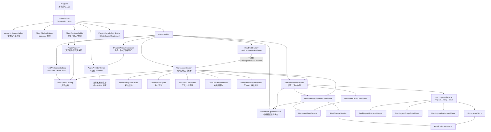
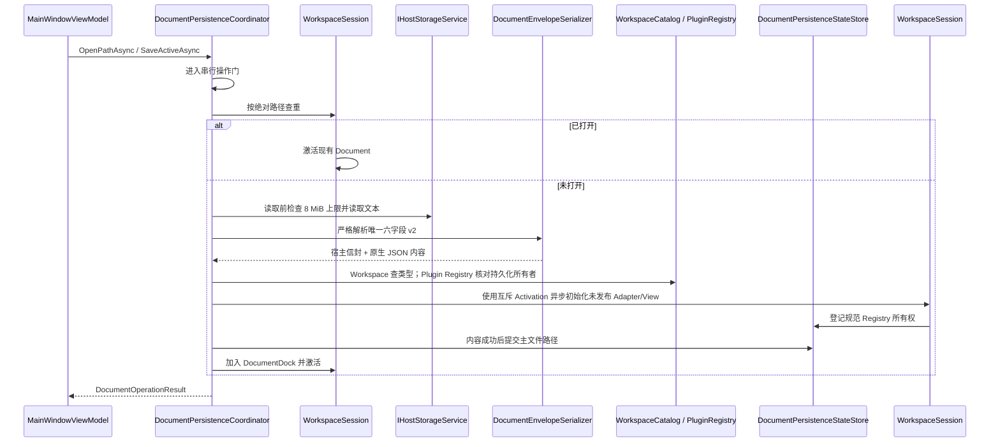

# MyAvaloniaManagement 内部架构

> 当前源码已完成 V3 G14 封板：产品、SDK 与四插件版本为 `3.0.0`，Core/UI API 已进入 Shipped
> 127/45；Document 保存已采用修订快照与
> 指定修订确认，激活已采用互斥 New/Restore 类型，插件注册已采用 Host 最终提交与 ID 归属校验；
> MyPlugTest 与 BiliDownloader 消息器已归各自插件 Provider 所有；Workspace Session、Dock Factory 和
> Tool 只读投影已经分离；Host Catalog 与只含真实插件的 Plugin Registry 已分离；全屏端口已改为
> 单参数 `TryPresent` 返回幂等租约，并由 Host 具体会话维护唯一活动展示。四插件已从最终 Registry、
> 私有 Provider 经 Workspace Session 与 Dock Adapter 完成各自贡献验收，并由真实 ZIP Loader 重放
> 同一组合链。manifest、Document envelope、layout 保持 schema 2，默认数据根保持 `v2`；
> G13 已完成 V2 生产面删除与零残留证明；G14 已完成两轮隔离门禁和本地发布资格签署。

## 1. 目标与边界

`MyAvaloniaManagement` 是 Avalonia 桌面宿主，负责：

- 组合依赖、发现插件模块并管理插件生命周期；
- 收集显式 Document/Tool/View/Lifecycle 贡献并分派创建请求；
- 建立和维护四向 Dock 工作区；
- 严格读写唯一 Document 信封 v2，并编排异步创建、打开、恢复、保存、关闭和资源释放；
- 严格读取、校验、整体隔离和原子保存唯一 Layout V2；
- 只向插件提交窗口交互与 Document 生命周期等真实 Host 端口，不拥有插件内部消息；
- 以窄 UI SDK 端口为插件提供文件选择和剪贴板交互；
- 为 XAML、菜单、主题和宿主 Tool 提供绑定入口。

宿主不负责插件的领域业务、插件内部 DTO 演进或后台任务实现。当前信任模型是同一团队维护的进程内可信插件，不提供沙箱、热卸载或第三方 ABI。

### Plugin SDK 与主题所有权

最终基础契约来自 `MyAvaloniaManagement.PluginSdk`，UI 注册契约来自
`MyAvaloniaManagement.PluginSdk.UI`；四个业务插件均已只使用最终 SDK。旧
`MyAvaloniaManagementCommon` 与 Legacy 项目已在 G13 删除。SDK 不拥有
字体、桌面后端或全局主题。`App.axaml` 是 Fluent、Semi、Ursa、Dock Theme 和 Host Styles 的唯一
组合入口；`ApplicationThemeService` 只切换宿主主题状态，不把第三方主题对象暴露成插件服务。

普通插件通过 `App*` 语义画刷和局部 `StyleInclude` 适配外观。需要直接使用 Semi、Ursa 或 Dock UI
的插件引用同版本 `MyAvaloniaManagement.PluginSdk.UI`；共享策略保证这些 UI 类型来自默认加载上下文。
这个分层保持全局外观一致，同时避免基础 SDK 对所有插件强制传递完整 UI 实现。

## 2. 总体结构

依赖方向有两个核心约束：

1. ViewModel 依赖面向用例的协调器，不直接实现文件事务或重复 Dock 遍历。
2. `HostDockFactory` 只保留 Dock 库要求的继承协议；`WorkspaceSession` 独占工作区状态，ViewModel 只依赖窄用例入口。

## 3. 启动和关闭

### 3.1 `HostRuntime` 是唯一实际组合根

[`HostRuntime`](../../Business/Composition/HostRuntime.cs) 按以下顺序启动：

1. 创建 `PluginRegistryBuilder`，注册宿主核心服务、ViewModel 和宿主显式贡献；
2. 读取全部 manifest v2，检查单一 Core/UI SDK 区间与全局身份；
3. 验证精确入口 `.deps.json`，建立 ALC 并按大小写敏感完整名称取得清单入口类型；
4. 预检并实例化该 `IPluginModule`；不扫描或执行程序集中的其他模块，身份只取自 manifest；
5. 以 `ValidateScopes`、`ValidateOnBuild` 构建 Host Provider；
6. 按 manifest `pluginId` 顺序为每个插件创建空服务集合，执行一次 `Configure` 并构建私有 Provider；
7. 单插件成功后才合并其声明；失败则释放自身并继续后续插件；
8. 只读取已冻结声明完成跨所有者冲突过滤，释放冲突 Provider，再发布不可变 `PluginRegistry`；
9. 由 internal `PluginLifecycleCoordinator` 按 PluginId 启动可用插件，再显式解析唯一 `WorkspaceSession`；
10. 将完全组合成功的 Host Provider 交给 Avalonia 启动路径。

关闭时先由 Session 停止新建并按 Document 在前、Tool 逆序在后的顺序释放工作区，再反向停止成功生命周期，随后逆序释放插件 Provider，最后释放
Host Provider。这个所有权对称性防止 `Program`、`App` 和插件生命周期管理器分别持有清理责任。

[`Program`](../../Program.cs) 只保留进程入口和失败应用编排。`HostRuntime` 通过 internal
`HostAvaloniaBuilder` 使用 `Func<App>` 创建应用；App 注入 `IHostDesktopShell`，不再存在静态
`ServiceProvider` 或生产 ViewModel 无参构造。仓库测试与 Harness 通过明确 friend assembly
访问 internal 组合入口。

### 3.2 为什么不直接采用通用 Host Builder

当前应用已有固定的 Avalonia 启动方式。内部 `HostRuntime` 与桌面 Shell 足以集中所有权，而引入
另一套通用 Host 生命周期会增加双重启动/关闭语义。本轮选择最小可验证边界，不改变进程模型。

## 4. 插件发现和声明式注册

### 4.1 程序集快照

[`AssemblyLoaderHelper`](../../Business/Plugins/Discovery/AssemblyLoaderHelper.cs) 是 Host internal 加载边界，其行为是：

- 用绝对、规范化且不区分大小写的插件根目录作为缓存键；
- 通过 `Lazy<PluginDiscoverySnapshot>` 保证并发调用只执行一次扫描；
- 第一阶段只读严格 `plugin.manifest.json`，检查单一 SDK 区间和全局 `pluginId`；
- 第二阶段只为通过预检的候选创建加载上下文，清单声明是唯一入口来源；
- 入口必须携带同名 `.deps.json`，托管和原生依赖只按 deps/RID 图解析；
- 类型预检后只要求清单精确指定的类型具体、public、实现 `IPluginModule` 且具有 public 无参构造；
- 每个插件目录拥有自己的 `PluginLoadContext`；
- 不注册进程级 `AssemblyResolve`，私有依赖只在当前插件 ALC 内解析；
- 单个清单、目录、依赖或完整类型预检失败不会阻断其他独立插件；
- 程序集、清单、类型和模块类型通过同一不可变快照发布。

缓存的取舍是“稳定启动优先于进程内刷新”。部署模型要求替换插件后重启应用，因此不实现缓存失效和热加载。

### 4.2 Managed-only 模块与激活

[`PluginModulePreflight`](../../Business/Plugins/Discovery/PluginModulePreflight.cs) 在不实例化插件对象的前提下验证清单精确入口及其 public 无参构造；结构错误只隔离当前目录。随后 [`PluginModuleCatalog`](../../Business/Plugins/Discovery/PluginModuleCatalog.cs) 只实例化快照中的模块；单个构造失败记录受控诊断并排除该插件，不阻断其他入口。

[`PluginProviderOwner`](../../Business/Plugins/Registration/PluginProviderOwner.cs) 在 Host Provider 建立后，按规范 PluginId
顺序为每个入口创建真正为空的 `ServiceCollection`。`PluginRegistration` 把 manifest `PluginId` 与该
私有集合绑定，模块只在组合
阶段调用一次最终 UI SDK `Configure(IPluginRegistration)`。模块返回后，贡献方法和插件保存的
`Services` 引用同时封闭。Document、Tool、View 和 Lifecycle 必须调用专用方法才能进入唯一 Registry；
这些根服务描述符先由 Host 暂存，不进入插件可修改集合。局部 Seal 强制 Document/Tool ID 属于 manifest
PluginId 的 `.document.*`/`.tool.*` 命名空间；随后 `PluginServiceCommitGuard` 拒绝普通或 keyed 的
Host Port、Document/Tool/Lifecycle 根影子注册，并最终追加窗口交互、`IDocumentLifetime`、
Document Scope 基础设施与固定生命周期贡献根。直接 DI 注册其他普通类型只会留在插件 Provider。

宿主服务集合从不交给插件，也不复制到插件集合，因此旧 `HostServiceDescriptorPolicy`、
`PluginServiceRegistrationTransaction`、描述符增量比较和贡献旁路扫描已经删除。Microsoft DI 原生的
多实现、keyed 和开放泛型注册完整可用；删除或替换描述符最多使当前插件不可用。模块配置或私有
Provider 构建失败会产生 `PLUGIN_SERVICE_REGISTRATION_FAILED` 或 `PLUGIN_CONTAINER_BUILD_FAILED`；
保留端口、贡献根和 ID 归属错误使用 G4 专用稳定码，
对应插件不发布任何贡献，Host 与成功插件继续运行。

每个插件 Provider 都创建自己的 `DocumentScopeManager`。宿主
[`DocumentScopeRegistry`](../../Business/Documents/Ownership/DocumentScopeRegistry.cs) 只负责把 Dock 关闭通知路由到
实际所有者，不提供跨插件解析。退出顺序固定为：关闭全部 Document Scope、停止生命周期、按 PluginId
反序释放插件 Provider、最后释放 Host Provider。

### 4.3 单一扩展注册表

[`PluginRegistryBuilder`](../../Business/Plugins/Registration/PluginRegistryBuilder.cs) 为每个插件先使用临时实例收集声明；
Descriptor、模型类型、View 类型/工厂和生命周期类型在注册调用中一次冻结。私有 Provider 构建成功且
生命周期 singleton 可解析后，声明才合并到全局 Builder；此过程不创建 Document/Tool，也不调用插件
元数据代码。全局 Builder 只对不可变候选做分组判重，再提交
[`PluginRegistry`](../../Business/Plugins/Registration/PluginRegistry.cs)。Registry 统一拥有：

- manifest、入口程序集和模块类型快照；
- manifest 所属的 Document、Tool、View 和 Lifecycle；
- Document/Tool 元数据快照；
- Document 菜单入口展开；
- ViewModel 类型到无参 View 工厂的映射；
- 生命周期实现类型及其 manifest 所有权。

插件内重复 Document/Tool ID、重复精确模型映射、同一模型跨 Document/Tool、多生命周期和所有者混入会
丢弃整个候选。跨插件 Document/Tool ID 或精确模型映射冲突时，所有冲突插件均排除；与 Host 内建贡献
冲突时保留 Host。无冲突插件继续发布，被排除 Provider 立即释放且从不登记 Document Scope。

Registry 不保存 Provider，也不负责创建模型。[`PluginContributionActivator`](../../Business/Plugins/Registration/PluginContributionActivator.cs)
是唯一 Provider 路由边界，根据注册所有者选择 Host 或插件 Provider；Document 通过所属 Scope 创建，
Tool 解析插件 singleton。G6 起 Activator 只返回普通模型与所有权租约，不转换或验证 Dock 类型；
[`HostDockAdapterFactory`](../../Business/Docking/HostDockAdapterFactory.cs) 在其后创建唯一允许继承 Dock 的
internal sealed Adapter。

[`ViewLocator`](../../ViewLocator.cs) 是 DI 管理的普通实例，只读取当前 `PluginRegistry`。它不读取
AppDomain、插件目录或类型名称，不提供 `ViewModel` → `View` 字符串回退。发布前由精确注册工厂构造
一次 View、设置普通模型 `DataContext` 并交给 Adapter View Lease；Dock 渲染只返回同一实例。Document
View 失败原子回滚 Scope，Tool View 失败只隔离自身；诊断不持久化插件异常正文。

### 4.4 Host Dock Adapter 与所有权

`ManagedDocumentDockable` 拥有普通 Document 模型、预构建 View 和独立 Scope Lease。标题从模型、请求、
Descriptor 依次回退，后台 `PresentationChanged` 切回 UI Dispatcher；最终关闭按“解绑事件 → 断开
DataContext/释放 View → 取消 ClosingToken → 释放模型与 scoped 依赖”执行。`ManagedToolDockable` 只拥有
View；Tool 模型仍是插件 Provider singleton。两个 Adapter 均禁止浮动，Tool 的 Hide/Prevent、四向位置和
Pinned 由 Descriptor 与现有布局协调器投影。

`WorkspaceSession` 依赖窄口 `IHostDockableFactory` 并独占已经发布的 Adapter。关闭失败回滚、正常关闭
与 Runtime 退出汇入幂等释放入口；`HostDockFactory` 不保存 Adapter 集合，只按 Dock 基类时序转发回调。
生产 DI 不注册 Legacy `IDocumentScopeFactory`，旧持久化测试 seam 不进入运行时对象图。

### 4.5 诊断白名单边界

所有加载、组合、布局和启动诊断都通过 `IHostDiagnosticSink` 进入 `HostDiagnosticSession`。
业务边界只创建 `HostDiagnosticDraft`：它只能携带错误码、阶段、强类型身份/版本、异常引用及受控
生命周期数据，不能提交自由用户说明或技术详情。`HostDiagnosticRedactionPolicy` 在分配序号、写内存、
JSONL 和镜像之前执行唯一一次白名单转换：

- 用户说明由错误码和阶段固定映射，不使用插件、文件或异常正文；
- Plugin ID、目录叶名称、程序集简单名、稳定 ID 和版本各自按结构校验，失败就丢弃可选值；
- `Exception` 只投影运行时类型，不读取 `Message`、`StackTrace` 或 `ToString()`；
- schema 1 的 `TechnicalDetail` 只允许生命周期枚举与毫秒耗时，否则为 `null`。

因此插件状态 Tool、启动失败窗口和复制摘要只是同一脱敏记录的投影，不再承担二次清洗。
进程环境变量 `MYAVALONIA_ENABLE_SENSITIVE_DIAGNOSTICS=1` 是与记录完全分离的短期调试旁路：它只把
带风险警告的原始异常写到 Trace/stderr，不写 UI、剪贴板或 JSONL，也不持久化开关。默认和 Release
门禁都不启用该旁路。设计与验收证据见
[G15 宿主诊断脱敏](../../../../docs/plan-history/host-v1/g15-host-diagnostic-redaction.md)。

## 5. Workspace Session 与 Dock Factory 边界

V3 G6 已删除 `ManagementFactory` Facade。生产代码只有
[`HostDockFactory`](../../Business/Docking/HostDockFactory.cs) 继承 Dock `Factory`；它与
[`WorkspaceSession`](../../Business/Workspace/WorkspaceSession.cs) 在组合根执行一次性绑定，未绑定使用和
重复绑定均快速失败。唯一 internal `IWorkspaceDockCallbacks` 只表达 Dock Framework 的真实回调接缝，
不进入 ViewModel、Plugin SDK 或通用消息基础设施。

| 协作者 | 单一职责 | 不负责 |
| --- | --- | --- |
| `HostWorkspaceCatalog` | Host Descriptor、模型/View 精确工厂 | manifest、插件 Provider、可用性和 Dock 状态 |
| `PluginRegistry` | 真实插件清单所有权、贡献、元数据和 View 映射 | Host 项、Provider、模型创建、Dock 树状态、生命周期运行状态 |
| `WorkspaceCatalog` | 合并 Host 与可用插件的 Descriptor、菜单和精确 View 查询 | Provider 解析、模型创建和状态修改 |
| `PluginContributionActivator` | 按 Registry 所有者路由 Provider、Scope 与模型创建 | 冲突判断、元数据解释、生命周期编排 |
| `HostDockAdapterFactory` | 创建内部 Adapter 并在发布前预构建精确 View | Provider 选择、布局协调、模型生命周期策略 |
| `HostDockFactory` | Dock override、规范 Locator、禁浮动和回调顺序 | Root、Document、Tool 集合与业务状态 |
| `WorkspaceSession` | Root/Document Dock、Document/Tool 所有权、发布/显隐/关闭/退出提交点 | 磁盘序列化、任意事件路由、服务定位 |
| `ToolWorkspaceReadModel` | 从 Session/Workspace Catalog 生成无 Dock 的不可变 Tool 状态 | Tool 创建、显隐命令和 Dock 树写入 |
| `DockWorkspaceBuilder` | 创建稳定四向初始布局 | 工具恢复和激活 |
| `DockTreeNavigator` | Dock、Document、Tool、Pinned/Hidden 查询 | 修改业务状态 |
| `ToolDockCoordinator` | 工具显示、恢复、停靠点重建和纵向区域归一化 | 策略发现 |
| `DockDocumentLifetime` | 文档关闭后的缓存移除和 Scope 释放 | 关闭是否允许 |

Factory 的 Docked/Hidden 在基类行为后通知 Session；Closing 只有 Session 脏文档保护通过后才进入基类；
Closed 把基类通知放在 `try`、Session 最终释放放在 `finally`。多个 MainWindow 共享同一 Session/Root，
各自订阅和解除定向通知。Tool 管理在布局前后都读取 `ToolWorkspaceReadModel` 的纯数据快照，Pinned Tool
视为可见，不获得 Root Dock、Dock Tool、Factory 字典或服务容器。

### 5.1 G8 全屏会话

`MainWindow` 显式实现 UI SDK 的 `IWindowContentFullscreenHost`，但不直接保存插件 owner 或内容状态；
它把 `TryPresent(Control)` 委托给窗口私有的 `WindowContentFullscreenSession`。该具体会话只维护覆盖层、
ContentHost、宿主有效性和一个活动租约。租约按引用身份释放，重复释放无操作，旧租约不能清理新展示；
错误线程调用不会消耗首次释放。内容挂载失败会在传播原异常前清空内容并隐藏覆盖层。

窗口可取消的 `Closing` 不触碰租约，真正 `Closed` 或 ContentHost 脱离视觉树才自动失效。释放时先让
租约失效，再清空视觉内容，防止卸载回调重入。插件只看到标准 `IDisposable`，不获得 MainWindow、
Dock 或内部会话；MySmallTools 在原生表面迁移前后持有/释放租约，Document 直接关闭也走同一清理路径。

## 6. 文档工作流

### 6.1 分层

各组件职责：

- `MainWindowViewModel`：绑定状态、命令、主题、布局生命周期及根级状态的定向订阅；
- `DocumentPersistenceCoordinator`：选择、批量打开、文件树窄入口、恢复编排和单文件错误隔离；
- `DocumentOperationState`：保存当前 HostRuntime 唯一的文档错误条状态；文件菜单与文件树共享；
- `DocumentSaveService`：指定 Document 的路径决策、主文件提交、状态接受和恢复备份；
- `DocumentCloseCoordinator`：标签/窗口关闭确认、批量保存和同步关闭的异步重入；
- `WorkspaceSession`：拥有文档区、同路径激活、活动文档、原子发布、失败回滚与最终释放；
- `DocumentPathIdentity`：绝对路径与 Windows 不区分大小写身份；
- `DocumentPersistenceStateStore`：按 Adapter 引用保存规范 Registry、路径、Host 标题与 `RequiresSave`，关闭与失败时幂等清理；
- `DocumentEnvelopeSerializer`：严格读写 schema 2 六字段根对象、两字段 content、深度 8 和 UTF-8 8 MiB 边界；
- `WorkspaceCatalog`：提供 Host 与当前可用插件的 Document 类型查询；
- `PluginRegistry`：仅为可持久化插件 Document 提供主 ID 和插件所有权事实；
- `IHostStorageService`：隔离 Avalonia 选择器、本机文件系统与读前长度检查。

### 6.2 并发与状态提交

打开和所有保存入口共享 `DocumentOperationGate`。该方案牺牲同一窗口内文档 I/O 的并行度，换取简单、确定的查重和状态提交顺序。文档文件通常较小，稳定性收益高于有限的并行收益。

保存遵循“主文件成功后再提交内存状态”：`CaptureSaveSnapshotAsync(ClosingToken)` 返回同一稳定观察
区间中的插件修订与原生 JSON 内容；原子写入完成后才更新 Host 标题、路径与恢复标记，并调用
`AcceptChanges(savedRevision)`。Host 不解释或持久化 Revision。随后更新 `.recovery.bak`；确认或备份
失败只产生“已保存但有警告”，不伪造主文件失败。若确认后仍有较新修改，普通保存成功，关闭保持打开。

插件 `DocumentContent` 只包含内容版本和克隆的 `JsonElement` payload。`pluginId`、`documentTypeId`、
标题和 UTC 时间由宿主分别从 Registry、目标文件名和 `TimeProvider` 取得。生产只接受 V2，不设置
V1 探测、别名归一化或迁移分支。打开任一阶段失败时，未发布 Adapter/View/Scope 被释放且不写输入。

文档操作结果由 ViewModel 通过内部异步观察方法捕获，避免 `async void` 和未观察任务异常；Host 不用
事件广播替代这条直接协调路径。

### 6.3 异常边界

文件、权限、路径、严格信封与插件初始化异常在 Host internal 边界转换为可恢复失败。转换由
`DocumentPersistenceErrorMapper` 返回宿主固定文本，不信任公共异常消息，也不拼接文件路径。
空引用、无效程序状态等编程错误继续向上传播，使测试和诊断能够尽早暴露缺陷。

批量打开以单文件为错误边界：一个文件失败不阻断后续文件。窗口退出的“保存全部”按 Dock 顺序逐个提交，首个失败或取消即停止。

### 6.4 插件私有消息器

V3 SDK 和 Host 不再拥有通用事件总线。MyPlugTest 与 BiliDownloader 分别在自己的程序集声明最小接口，
由自己的 Provider 注册 internal sealed singleton 实现。消息不能跨插件 Provider 或 HostRuntime 解析。
两个实现只在锁内维护订阅并创建发布快照，在锁外按登记顺序、发布线程同步调用用户代码；这允许处理器
自释放、重入发布或新增订阅而不死锁，并确保本次发布只看到快照中的处理器。

处理器异常原样传播并停止后续派发。订阅者保存独立、幂等的 `IDisposable` 令牌：Document 随自身
Scope 释放，插件 Coordinator 在关闭流程释放，插件 Provider 最后释放消息器。进入发布快照的处理器
可能最后执行一次，因此 Document 仍以 `IDocumentLifetime.IsClosing` 阻止迟到副作用。消息器只负责
对应插件中真实多消费者需求的派发，不承担订阅者生命周期。

G10 后 Host 自己不再把文件打开、布局刷新和 Tool 显隐绕行到事件广播。文件树只依赖单方法
`IHostDocumentOpenService`，生产实现复用文档持久化协调器；`WorkspaceSession` 作为唯一 Dock 状态所有者，
在显隐完整提交后发布定向通知，Tool 管理器再从 ReadModel 重建纯数据投影。两类根级通知都由瞬态消费者在 `Dispose`
时解除，不存在任意事件类型路由、静态订阅或跨 HostRuntime 状态。

## 7. 布局生命周期

[`DockLayoutLifecycle`](../../Business/Layout/DockLayoutLifecycle.cs) 只保留三个阶段：

1. `Prepare`：读取快照并创建、初始化默认 Dock 树；
2. `ApplyPending`：验证贡献可用性、补齐稳定节点、校验运行时结构并应用快照；
3. `Save`：捕获运行时状态并交给存储层。

细节分别由以下组件承担：

- [`DockLayoutSnapshotMapper`](../../Business/Layout/DockLayoutSnapshotMapper.cs)：只负责 `Capture`、`EnsureSnapshotDocks`和 `ApplySnapshot`；
- `DockLayoutSnapshotV2Json`：严格字段读取与固定顺序写出；
- [`DockLayoutRuntimeValidator`](../../Business/Layout/DockLayoutRuntimeValidator.cs)：只读检查插件声明、生命周期可用性、Pane、Tool 和稳定 ID；
- `DockLayoutStore`：路径、原子读写和坏文件隔离；
- `AtomicFileTransaction`：临时写入、提交和清理。

快照整体无效时隔离原文件并回退完整默认布局。贡献可用性检查在补建 Pane 之前完成；V2 不做缺失插件下的部分恢复，也没有 V1 reader 或 Migrator。

## 8. 原子文件事务

[`AtomicFileTransaction`](../../Business/Storage/AtomicFileTransaction.cs) 同时服务于文档和布局：

1. 将目标路径规范化并确保父目录存在；
2. 在同目录创建唯一 `.tmp` 文件；
3. 写入全部内容并刷新到磁盘；
4. 目标存在时 `File.Replace`，不存在时 `File.Move`；
5. 无论成功失败都尝试清理临时文件。

同目录临时文件避免跨卷移动失去原子性。事务不负责备份、格式迁移或用户提示，这些属于上层用例。

## 9. 生命周期与所有权

| 对象 | 所有者 | 释放时机 |
| --- | --- | --- |
| Host Provider | `HostRuntime` | 全部插件 Provider 释放后 |
| 插件 Provider | `PluginProviderOwner` | 生命周期停止后按 PluginId 反序释放 |
| 插件私有消息器 | 对应插件 Provider | 订阅者先释放令牌；插件 Provider 最后释放消息器 |
| Managed 插件生命周期 | `PluginLifecycleCoordinator` | Adapter/View 与全部 Document Scope 释放后，插件 Provider 释放前 |
| Tool Adapter 实例 | `WorkspaceSession`；普通模型仍属对应插件 Provider | Session 先释放 Adapter/View，插件 Provider 后释放模型 |
| Root / Document Dock | `WorkspaceSession` | HostRuntime 退出时随 Session 释放 |
| Host Welcome Scope | Host `DocumentScopeManager` | Dock 确认关闭后；退出时 Session 兜底 |
| 插件 Document Scope | 所属插件 `DocumentScopeManager` | Dock 确认关闭后；退出时插件 Scope Manager 兜底 |
| Document 控件缓存 | Host DI 容器中唯一的 `DocumentControlRecycling` | App Resource、DockControl Style 与关闭链共用；对应 Document 确认关闭后移除 |
| 布局快照待应用状态 | `DockLayoutLifecycle` | 首次 Apply 时原子取出 |

`App.axaml` 只通过 `DynamicResource ControlRecyclingKey` 声明 Dock Style 契约，不创建实例。
`App.Initialize` 在 XAML 加载后安装当前容器的单例；`DockDocumentLifetime` 从构造函数取得同一
实例。关闭链不读取 `Application.Current.Resources`，因此不同 HostRuntime 不会跨容器回收对方控件。

当前 Host Welcome 由 Host Catalog 的精确工厂请求 Host `DocumentScopeManager` 建立独立 Scope；插件
Document 则由 Plugin Registry 确认 owner 后请求所属插件的 Scope Manager。两条路径都只返回不暴露
`IServiceScope` 的窄 Lease。生产容器不注册 Legacy `IDocumentScopeFactory`；插件既不能创建 Scope，
也不能主动取消关闭令牌。

## 10. 测试映射

| 风险 | 主要保护 |
| --- | --- |
| Plugin SDK public 签名漂移 | Core/UI v2 Shipped 文本、`Test-PluginSdkCompatibility.ps1`、基线政策测试 |
| Host 实现面意外导出 | `HostApiBoundaryTests` |
| 插件并发扫描、可变缓存泄漏 | `InternalRefactorTests` |
| Managed-only 拒绝、显式贡献所有权与 ID 碰撞诊断 | `ManagedOnlyPluginLoadingTests`、`ExplicitContributionAndPluginRegistryTests`、内部注册表测试 |
| Host Catalog / Plugin Registry 分离、双激活边界与规范 Locator | `HostCatalogPluginRegistryTests`、`Test-HostCatalogPluginRegistry.ps1` |
| 诊断正文、凭据、URL、路径泄漏与敏感开关误开 | `HostDiagnosticsTests`、生命周期/UI/Document 错误测试、`Test-HostDiagnosticRedaction.ps1` |
| 插件私有 Provider、Host Port、失败隔离与四插件回归 | `PluginContainerIsolationTests`、`PluginProviderOwnerTests` |
| 严格六字段信封、原生 JSON、资源边界、所有权与失败不发布 | `DocumentEnvelopeV2Tests` |
| 异步创建、并发打开、保存提交点、关闭重入与坏文件恢复 | `DocumentPersistenceTests`、`DocumentCloseTests` |
| 四向 Dock、Pinned/Hidden、禁用浮动 | PluginTests |
| Scope 与控件缓存释放 | PluginTests |
| 同步顺序、重入、异常、并发、Provider/Runtime 隔离及订阅释放 | 两插件 `*EventBusTests`、Document Scope 测试、`Test-PluginPrivateMessaging.ps1` |
| 布局严格解析、隔离、回退 | 布局生命周期与存储测试 |
| Layout V2 严格字段、V1 不读取、生命周期不可用零部分应用 | `DockLayoutStoreTests`、`DockLayoutAvailabilityTests` |
| 生命周期排序、幂等、失败/超时/取消、反向停止和脱敏 | `PluginLifecycleCoordinatorTests` |
| XAML、绑定和真实窗口事件 | Headless UI 与 Windows Smoke |

详细命令和门槛参见[测试说明](../../../../docs/reference/myavalonia-management-tests.md)。

## 11. V4 文件系统展示边界

文件树选择按三个明确步骤执行：`FileSystemPath` 只规范化并分类字符串，
`IHostStorageService.DirectoryExists` 只回答路径是否仍存在，`FileSystemTreeViewModel` 最后一次性提交
根节点、标题与驱动器模式。空白、相对、设备、非法或已经消失的路径在提交前失败，旧 UI 状态保持不变。

本地驱动器根（包括裸盘符 `C:` 规范化得到的 `C:\`）继续显示驱动器集合；UNC 共享根
`\\server\share` 作为唯一自定义根；共享下子目录按普通目录处理。测试替身通过存储端口模拟 UNC，
不访问真实网络。`CategoryNode` 的名称和 Document 集合是构造期只读快照，只有展开状态可变；
`PlugGroupMenuViewModel` 直接调用强类型 Document 创建入口，不持有可变外部集合。
