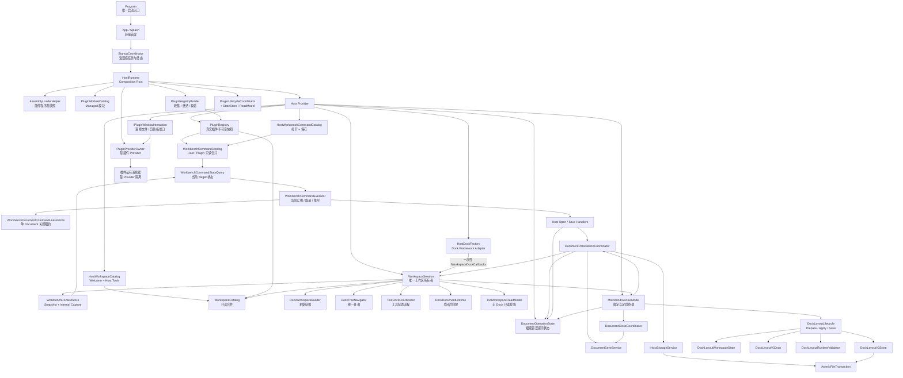
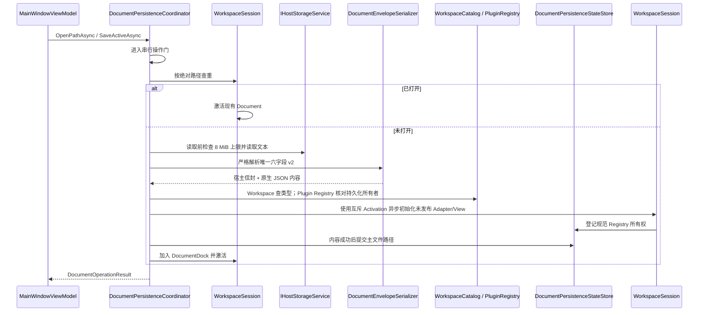

# MyAvaloniaManagement 内部架构

> 用途：当前 Host 内部实现与资源所有权。状态：当前；核对日期：2026-09-21。事实源：[Business 实现](../../Business)、[Host 测试](../../../MyAvaloniaManagement.Tests)及 [Plugin 测试](../../../MyAvaloniaManagement.PluginTests)。

版本和交付范围集中在[版本基线](../../../../docs/reference/platform-baseline.md)。本仓仅保留 Host 与 MyPlugTest；其他业务插件独立交付。历史封板不能代表当前工作树的发布资格，未完成事项见[待办](../../../../docs/roadmap/README.md)。

插件接入边界是内部可信 Managed Plugin、显式贡献、每插件私有 Provider。Document 是独立工作实例，Tool 是可隐藏的单例投影，业务服务的寿命不依赖面板可见性。修改内部类名不应迫使外部插件跟随；可观察行为由[兼容约束](../reference/compatibility-contracts.md)保护。

跨窗口正文迁移依赖 Host 专用的 Avalonia 布局队列修复：旧根跳过已迁走控件的残留任务，新根正常布局；正文缓存只负责唯一 View 与最终释放。运行时资产选择和摘要检查属于构建层，不进入插件业务或页面生命周期。官方 SDK UI `[12.1.2]` 编译契约保持不变，详见[跨窗布局维护](../../../../docs/maintenance/dock-cross-window-layout-verification.md)。

## 1. 目标与边界

诊断代码按已有职责分别放入 `Business/Diagnostics`：`HostDiagnosticContracts` 保存草稿、记录与端口，`HostDiagnosticCodes` 保存稳定错误码，`HostDiagnosticRedactionPolicy` 和 `HostDiagnosticFailurePolicy` 分别负责脱敏与分类，`HostDiagnosticSession` 继续独占记录、锁和写入器。敏感调试旁路与加载异常映射各有独立文件；文件拆分没有增加运行期协作者或改变输出政策。

命令展示的文件与既有类型对应：`WorkbenchPresentationCommandStore` 复用适配器，`WorkbenchMenuProjection` 和 `WorkbenchKeyBindingProjection` 各自拥有查询/通知，`WorkbenchCommandPresentation` 组合并释放这些对象与 Palette。菜单和快捷键的小契约就近保留；`UiRefreshScheduler` 的时机、共享锁与各投影的异常政策保持原样。

V18 的 `WorkbenchPalettePresentation` 保存纯值展示快照及分组排序规则。Palette 投影继续汇合四类已声明来源，不增加目录或业务执行器；View 只维护查询、选择、滚动和预编辑输入会话。页面命令的 `WorkbenchCommandTargetExpectation` 只保存 PageId 和上下文代次，随一次调用传给共享 Executor，并在最终调用前重查；不进入 Command Store，也不拥有模型、窗口或 Scope。组首标记只是行装饰，组标题不是可执行候选。详见[V18 专用验证](../../../../docs/maintenance/host-v18-command-palette-verification.md)。

V19 的 `DocumentCreationMenuQuery` 直接依赖 `WorkspaceCatalog`，读取纯声明不需要 Session。
`HasCreationEntry(DocumentTypeId, CreationIntentId)` 和 `WorkspaceSession.CanActivatePage(PageId)`
只检查请求身份及实时状态，Palette 的可用性和焦点复核不再生成全量分类树/页面展示列表。
完整展示查询继续保留原排序、分类诊断和单次布局快照；不新增长期缓存或第二份页面索引。

工具业务只保留 `OpenTool`、`SetToolVisibility` 和批量 `HideAllTools`。Session 共用身份及当前实例
检查和原位置恢复，ToolDockCoordinator 只处理 Dock 恢复与布局协议；删除重复 ShowTool 分发与
TrySetToolVisibility 业务布尔入口。打开已可见工具仍执行定位/预览，设置已满足的显隐状态则无副作用。
原生浮窗否决后返回失败并保留活动项；批量操作保留逐项结果并只发一次最终通知。

`ServiceCollectionExtensions.AddApplicationServices` 在入口确定共享 Builder、Provider 所有者、Scope 目录和退出参与者；同类私有方法分别登记布局、导航工具、看板、Host 交互、Workflow、文档用例、Registry、命令、插件生命周期、工作区激活和 Session。所有调用保持原始注册顺序，简单的 WorkspaceCatalog 合并工厂仍直接可见；每个工厂继续在原解析时机创建对象，成功交付前记录实际参与者。同实例接口映射与 Session.DockFactory 别名不产生第二份所有权。

V14 自动重启在 Program 入口先分流无插件助手；正常 Host 由 `HostRestartCoordinator` 协调单次请求，复用 MainWindow、工作区关闭许可和最终布局保存。`PluginEnablementService` 持有设置冻结门，`RestartHandoffSession` 由 Program 持有并借给 DI，避免 Runtime 释放时丢失交接。Program 检查 Shutdown 结构化结果及诊断关闭后才发送最终许可；助手确认许可并等旧进程实际退出后创建一次新 Host。职责、取消和诊断详见[自动重启契约](../../../../docs/reference/host-restart.md)。

`MyAvaloniaManagement` 是 Avalonia 桌面宿主，负责：

- 组合依赖、发现插件模块并管理插件生命周期；
- 收集显式 Document/Tool/View/Lifecycle 贡献并分派创建请求；
- 建立和维护四向 Dock 工作区；
- 严格读写唯一 Document 信封 v2，并编排异步创建、打开、恢复、保存、关闭和资源释放；
- 严格 Layout V3、V2 只读迁移、可用项投影、工具浮窗与原子保存；
- 只向插件提交窗口交互与 Document 生命周期等真实 Host 端口，不拥有插件内部消息；
- 以窄 UI SDK 端口为插件提供文件选择和剪贴板交互；
- 为显式 Consumer 注入 caller-bound Workflow Action Gateway，并在 Provider 私有 Scope 内治理调用；
- 合并 Host/Plugin Workbench Command 不可变事实，通过 Context/State 查询当前活动实例，并由无 UI
  Executor 执行 Host 内建或插件 Document 命令；
- 为 XAML、菜单、主题和宿主 Tool 提供绑定入口。

宿主不负责插件的领域业务、插件内部 DTO 演进或后台任务实现。当前信任模型是同一团队维护的进程内可信插件，不提供沙箱、热卸载或第三方 ABI。

### Plugin SDK 与主题所有权

最终基础契约来自 `MyAvaloniaManagement.PluginSdk`，UI 注册契约来自
`MyAvaloniaManagement.PluginSdk.UI`；Workflow Schema、引用与目录修订契约来自窄包
`MyAvaloniaManagement.PluginSdk.Workflow`。插件使用 SDK，不引用 Host 实现。旧
`MyAvaloniaManagementCommon` 与 Legacy 项目已删除。SDK 不拥有
字体、桌面后端或全局主题。`App.axaml` 是 Fluent、Semi、Ursa、Dock Theme 和 Host Styles 的唯一
组合入口；`ApplicationThemeService` 只切换宿主主题状态，不把第三方主题对象暴露成插件服务。

普通插件通过 `App*` 语义画刷和局部 `StyleInclude` 适配外观。需要直接使用 Semi、Ursa 或 Dock UI
的插件引用同版本 `MyAvaloniaManagement.PluginSdk.UI`；共享策略保证这些 UI 类型来自默认加载上下文。
这个分层保持全局外观一致，同时避免基础 SDK 对所有插件强制传递完整 UI 实现。

## 2. 总体结构

依赖方向有两个核心约束：

1. ViewModel 依赖面向用例的协调器，不直接实现文件事务或重复 Dock 遍历。
2. `HostDockFactory` 只保留 Dock 库要求的继承协议；`WorkspaceSession` 独占工作区状态，ViewModel 只依赖窄用例入口。

## 3. 启动和关闭

### 3.1 `HostRuntime` 是唯一实际组合根

V15 先由 Program 初始化唯一轻量 App 和 Splash，再从首帧调度启动后台组合。StartupWorker 的 Windows 同步入口保持 STA；进度通过有界快照传给 UI，详见[启动契约](../../../../docs/reference/host-startup.md)。

[`HostRuntime`](../../Business/Composition/HostRuntime.cs) 随后按以下顺序组合：

1. 创建 `PluginRegistryBuilder`，注册宿主核心服务、ViewModel 和宿主显式贡献；
2. 读取启动设置及全部 manifest v2，先检查单一 Core/UI SDK 区间与全局身份，再按本次启用快照过滤禁用项；禁用项不创建 ALC、不加载 DLL；
3. 验证精确入口 `.deps.json`，建立 ALC 并按大小写敏感完整名称取得清单入口类型；
4. 预检该 `IPluginModule` 并保存延迟构造入口；不扫描或执行程序集中的其他模块，身份只取自 manifest；
5. 以 `ValidateScopes`、`ValidateOnBuild` 构建 Host Provider；
6. 按 manifest `pluginId` 顺序为每个插件创建空服务集合，执行一次 `Configure` 并构建私有 Provider；
7. 单插件成功后才合并其声明；失败则释放自身并继续后续插件；
8. 只读取已冻结声明完成跨所有者冲突过滤，释放冲突 Provider，再发布不可变 `PluginRegistry`；
9. 校验纯描述 `WorkbenchCommandCatalog` 并一次提交 `WorkflowActionCatalogStore`，由 internal `PluginLifecycleCoordinator` 按 PluginId 初始化可用插件；
10. 回到 UI 线程，在同一 App 安装完整资源；创建并校验 `HostWorkbenchCommandBindings` 的显式执行绑定及其 Workspace 依赖，随后通过桌面 Shell 创建正式主窗口，成功交接后关闭 Splash。

关闭时先由 Workflow Action 与 Workbench Command 门控拒绝新调用并传播取消，再撤回插件可用性并让
Session 停止新建。Command 可能仍在使用 Workspace、活动 Document 或 Scope，因此必须先排空 Command，
成功后才释放工作区和 Document Scope；Command 与 Workflow Action 均排空后，才反向停止生命周期、
逆序释放插件 Provider 并释放 Host Provider。任一门控无法证明排空时保留相应对象图并报告脱敏诊断，
不强杀同进程代码或伪装成功。

上述资源释放判断集中在 `HostRuntimeShutdown`，正常退出和启动失败回滚共用同一流程。
`HostShutdownParticipants` 在 DI 工厂成功交付对象时记录实际引用，包含插件 Gateway 间接创建的
Workflow 管理器；回滚不重新解析 Workspace 或关闭参与者。初始化成功后再发生组合失败，会先
执行已启动项的逆序 Shutdown；原始启动异常不会被清理或诊断异常覆盖。

`PluginLifecycleOperation` 分开持有生命周期返回 Task、取消通知任务及 CTS。正常等待仍为初始化
30 秒、Shutdown 10 秒，第一次请求取消固定额外 2 秒宽限；后续检查不续期。任务与取消通知均结束，
且应执行的 Shutdown 已成功完成，才允许释放 Provider。Shutdown 已失败/取消按独立保守政策保留，
诊断明确区分该政策与任务仍在运行的硬约束。

迟到初始化按原始启动序号处理，越过关闭位置后不补插。无法安全关闭时，`HostResourceRetention`
只持有必要对象图到进程退出；不提供全局服务定位、重试或恢复。保留期间已有后台活动可能继续，
尤其启动失败窗口并不意味着进程立即退出。生命周期诊断出口在释放/交接前关闭，并等待既有报告结束。
生命周期执行器不自行重调度回调；V15 的初始调用来自启动工作线程。返回 Task 前的同步阻塞以及同步 Dispose 不受异步等待超时保证约束。

[`Program`](../../Program.cs) 保留助手分流、轻量 App 工厂及最终收尾。生产 App 注入 StartupCoordinator 和诊断；StartupDesktopShell 适配窗口，Runtime.AttachWorkbench 在 UI 线程解析正式 IHostDesktopShell。资源测试保留显式 Shell 构造入口，生产不使用静态 ServiceProvider，也不会因启动失败再次创建 Application。仓库测试与 Harness 通过明确 friend assembly 访问 internal 组合入口。

### 3.2 为什么不直接采用通用 Host Builder

当前应用已有固定的 Avalonia 启动方式。内部 `HostRuntime` 与桌面 Shell 足以集中所有权，而引入
另一套通用 Host 生命周期会增加双重启动/关闭语义。本轮选择最小可验证边界，不改变进程模型。

## 4. 插件发现和声明式注册

### 4.1 程序集快照

[`AssemblyLoaderHelper`](../../Business/Plugins/Discovery/AssemblyLoaderHelper.cs) 是 Host internal 加载边界，其行为是：

- 用绝对、规范化且不区分大小写的插件根目录作为缓存键；
- 通过 `Lazy<PluginDiscoverySnapshot>` 保证并发调用只执行一次扫描；
- 第一阶段只读严格 `plugin.manifest.json`，检查单一 SDK 区间和全局 `pluginId`；
- 身份预检完成后应用本次启动的禁用设置，保留候选元数据；第二阶段只为通过预检且启用的候选创建加载上下文，清单声明是唯一入口来源；
- 入口必须携带同名 `.deps.json`，托管和原生依赖只按 deps/RID 图解析；
- 类型预检后只要求清单精确指定的类型具体、public、实现 `IPluginModule` 且具有 public 无参构造；
- 每个插件目录拥有自己的 `PluginLoadContext`；
- 不注册进程级 `AssemblyResolve`，私有依赖只在当前插件 ALC 内解析；
- 单个清单、目录、依赖或完整类型预检失败不会阻断其他独立插件；
- 程序集、清单、类型和模块类型通过同一不可变快照发布。

缓存的取舍是“稳定启动优先于进程内刷新”。部署模型要求替换插件后重启应用，因此不实现缓存失效和热加载。

### 4.2 Managed-only 模块与激活

[`PluginModulePreflight`](../../Business/Plugins/Discovery/PluginModulePreflight.cs) 在不实例化插件对象的前提下验证清单精确入口及其 public 无参构造；结构错误只隔离当前目录。随后 [`PluginModuleCatalog`](../../Business/Plugins/Discovery/PluginModuleCatalog.cs) 只实例化快照中的模块；单个构造失败记录受控诊断并排除该插件，不阻断其他入口。

[`PluginProviderOwner`](../../Business/Plugins/Registration/PluginProviderOwner.cs) 在 Host Provider 建立后，按规范 PluginId
顺序为每个入口创建真正为空的 `ServiceCollection`。`PluginRegistration` 把 manifest `PluginId` 与该
私有集合绑定，模块只在组合
阶段调用一次最终 UI SDK `Configure(IPluginRegistration)`。模块返回后，贡献方法和插件保存的
`Services` 引用同时封闭。Document、Tool、View 和 Lifecycle 必须调用专用方法才能进入唯一 Registry；
这些根服务描述符先由 Host 暂存，不进入插件可修改集合。局部 Seal 强制 Document/Tool ID 属于 manifest
PluginId 的 `.document.*`/`.tool.*` 命名空间；随后 `PluginServiceCommitGuard` 拒绝普通或 keyed 的
Host Port、Document/Tool/Lifecycle 根影子注册，并最终追加窗口交互、`IDocumentLifetime`、
Document Scope 基础设施与固定生命周期贡献根。直接 DI 注册其他普通类型只会留在插件 Provider。

宿主服务集合从不交给插件，也不复制到插件集合，因此旧 `HostServiceDescriptorPolicy`、
`PluginServiceRegistrationTransaction`、描述符增量比较和贡献旁路扫描已经删除。Microsoft DI 原生的
多实现、keyed 和开放泛型注册完整可用；删除或替换描述符最多使当前插件不可用。模块配置或私有
Provider 构建失败会产生 `PLUGIN_SERVICE_REGISTRATION_FAILED` 或 `PLUGIN_CONTAINER_BUILD_FAILED`；
保留端口、贡献根和 ID 归属错误使用 G4 专用稳定码，
对应插件不发布任何贡献，Host 与成功插件继续运行。

每个插件 Provider 都创建自己的 `DocumentScopeManager`。宿主
[`DocumentScopeRegistry`](../../Business/Documents/Ownership/DocumentScopeRegistry.cs) 只负责把 Dock 关闭通知路由到
实际所有者，不提供跨插件解析。退出顺序固定为：关闭全部 Document Scope、停止生命周期、按 PluginId
反序释放插件 Provider、最后释放 Host Provider。

### 4.3 单一扩展注册表

V12-P1 将局部校验交给 `PluginContributionValidator`，跨所有者分析交给
`PluginConflictAnalyzer`。二者只消费 `PluginContributionSnapshot` 的防御性集合快照，
不调用工厂或解析服务。Builder 保留可写状态、局部异常出口、有序诊断与最终提交；
全局分析逐条返回冲突，诊断失败仍立即终止。只有 Registry 构造成功后才提交 Provider
和 Scope 所有权，Import 局部复查及 Build 全局防线均保留。

[`PluginRegistryBuilder`](../../Business/Plugins/Registration/PluginRegistryBuilder.cs) 为每个插件先使用临时实例收集声明；
Descriptor、模型类型、View 类型/工厂和生命周期类型在注册调用中一次冻结。私有 Provider 构建成功且
生命周期 singleton 可解析后，声明才合并到全局 Builder；此过程不创建 Document/Tool，也不调用插件
元数据代码。全局 Builder 只对不可变候选做分组判重，再提交
[`PluginRegistry`](../../Business/Plugins/Registration/PluginRegistry.cs)。Registry 统一拥有：

- manifest、入口程序集和模块类型快照；
- manifest 所属的 Document、Tool、View 和 Lifecycle；
- Document/Tool 元数据快照；
- Document 菜单入口展开；
- ViewModel 类型到无参 View 工厂的映射；
- 生命周期实现类型及其 manifest 所有权；
- Workbench Command、菜单 Placement 和快捷键 Placement 的不可变声明事实。

插件内重复 Document/Tool ID、重复精确模型映射、同一模型跨 Document/Tool、多生命周期和所有者混入会
丢弃整个候选。跨插件 Document/Tool ID 或精确模型映射冲突时，所有冲突插件均排除；与 Host 内建贡献
冲突时保留 Host。无冲突插件继续发布，被排除 Provider 立即释放且从不登记 Document Scope。

Registry 不保存 Provider，也不负责创建模型。[`PluginContributionActivator`](../../Business/Plugins/Registration/PluginContributionActivator.cs)
是唯一 Provider 路由边界，根据注册所有者选择 Host 或插件 Provider；Document 通过所属 Scope 创建，
Tool 解析插件 singleton。G6 起 Activator 只返回普通模型与所有权租约，不转换或验证 Dock 类型；
[`HostDockAdapterFactory`](../../Business/Docking/HostDockAdapterFactory.cs) 在其后创建唯一允许继承 Dock 的
internal sealed Adapter。

[`ViewLocator`](../../ViewLocator.cs) 是 DI 管理的普通实例，只读取当前 `PluginRegistry`。它不读取
AppDomain、插件目录或类型名称，不提供 `ViewModel` → `View` 字符串回退。发布前由精确注册工厂构造
一次 View、设置普通模型 `DataContext` 并交给 Adapter View Lease；Dock 渲染只返回同一实例。Document
View 失败原子回滚 Scope，Tool View 失败只隔离自身；诊断不持久化插件异常正文。

### 4.4 Host Dock Adapter 与所有权

`ManagedDocumentDockable` 拥有普通 Document 模型、预构建 View 和独立 Scope Lease。标题从模型、请求、
Descriptor 依次回退，后台 `PresentationChanged` 切回 UI Dispatcher；最终关闭按“解绑事件 → 断开
DataContext/释放 View → 取消 ClosingToken → 释放模型与 scoped 依赖”执行。`ManagedToolDockable` 只拥有
View；Tool 模型仍是插件 Provider singleton。两个 Adapter 均允许浮动，主窗口固定骨架不浮动。V7 Host 统一允许隐藏所有 Tool，
旧 SDK 的 `Prevent` 不再阻止隐藏；四向位置与 Pinned 继续由声明和布局协调器管理。

`WorkspaceSession` 依赖窄口 `IHostDockableFactory` 并独占已经发布的 Adapter。关闭失败回滚、正常关闭
与 Runtime 退出汇入幂等释放入口；`HostDockFactory` 不保存 Adapter 集合，只按 Dock 基类时序转发回调。
生产 DI 不注册 Legacy `IDocumentScopeFactory`，旧持久化测试 seam 不进入运行时对象图。

### 工具中心

侧面的管理 Tool 已退役，`ToolCenterWindowService` 拥有一个以主窗口为 Owner 的非模态窗口。
主菜单、欢迎页和命令面板共用 Host 入口；窗口关闭释放 ViewModel 订阅，偏好保留在 Runtime 级服务中。
`ToolWorkspaceReadModel` 一次遍历布局并合并完整注册目录；`ToolCenterQuery` 只处理元数据、筛选和历史占位；
`ToolCenterActions` 经 `WorkspaceSession` 提交显隐，并仅在成功访问后记录最近工具。
收藏与分类使用独立 `tool-center-v1.json`，不复制 Dock 状态。Tool 的模型和已创建 View 仍沿用原有生命周期。
默认布局先隐藏所有 Tool，再恢复有效旧快照；退役管理 ID 只进行定向删除，V2 原文件只读保留，后续提交写入独立 V3。

### 插件看板独立窗口

`PluginStatusWindowService` 按需创建非模态单实例窗口，菜单和命令面板共用 Host 命令。
`IPluginStatusQuery` 隔离窗口与 Registry/生命周期/诊断事实，查询只生成不可变展示数据，不扫描目录或激活插件。
`PluginStatusPresentation` 集中状态文案；窗口模型负责概览、矩阵、筛选、选择与刷新，View 适配焦点、Esc、剪贴板和文件选择。
`IPluginDashboardEvidence` 只提供证据读取与数据导入；`PluginDashboardEvidence` 在后台读取文件并核对身份，
`CompatibilityReportStore` 负责校验后的原子保存，`CompatibilityMatcher` 与矩阵投影保持纯数据判断。
唯一规则源是 `build/MyAvaloniaManagement.RuntimeProfile.props`，Host、Build 和 Gate 共同使用。
打开、激活或手动刷新读取当前会话，完整文件摘要由“检查安装产物”显式触发。
窗口关闭取消读取，刷新代次拒绝迟到结果；复制只使用既有脱敏记录和受控验收摘要。

旧插件状态 Tool 注册已删除。`RetiredHostToolIds` 为布局和工具偏好提供统一白名单，清理旧记录及历史收藏，
保留其他工具和缺失插件的数据。操作见[插件看板](../../../../docs/quick-start/plugin-status.md)，证据规则见[兼容契约](../../../../docs/reference/plugin-compatibility.md)，历史设计见[归档](../../../../docs/archive/plans/plugin-status-window.md)。

### 4.5 诊断白名单边界

所有加载、组合、布局和启动诊断都通过 `IHostDiagnosticSink` 进入 `HostDiagnosticSession`。
业务边界只创建 `HostDiagnosticDraft`：它只能携带错误码、阶段、强类型身份/版本、异常引用及受控
生命周期数据，不能提交自由用户说明或技术详情。`HostDiagnosticRedactionPolicy` 在分配序号、写内存、
JSONL 和镜像之前执行唯一一次白名单转换：

- 用户说明由错误码和阶段固定映射，不使用插件、文件或异常正文；
- Plugin ID、目录叶名称、程序集简单名、稳定 ID 和版本各自按结构校验，失败就丢弃可选值；
- `Exception` 只投影运行时类型，不读取 `Message`、`StackTrace` 或 `ToString()`；
- schema 1 的 `TechnicalDetail` 只允许生命周期枚举与毫秒耗时，否则为 `null`。

因此插件状态窗口、启动失败窗口和复制摘要只是同一脱敏记录的投影，不再承担二次清洗。
进程环境变量 `MYAVALONIA_ENABLE_SENSITIVE_DIAGNOSTICS=1` 是与记录完全分离的短期调试旁路：它只把
带风险警告的原始异常写到 Trace/stderr，不写 UI、剪贴板或 JSONL，也不持久化开关。默认和 Release
门禁都不启用该旁路。设计与验收证据见
[G15 宿主诊断脱敏](../../../../docs/archive/records/host-v1/g15-host-diagnostic-redaction.md)。

### 4.6 Workbench Command 内核、活动实例路由与 Host Presentation

`HostWorkbenchCommandCatalog` 只冻结七个内建命令的身份、文字等描述，不保存 Handler；
`WorkbenchCommandCatalog` 把该目录与 `PluginRegistry.WorkbenchCommands` 合并，并在启动期拒绝最终身份
碰撞。Catalog 不按生命周期过滤，也不保存 Provider、Scope、Document 模型或 Avalonia `ICommand`。

`HostWorkbenchCommandBindings` 在 UI 组合边界冻结一对一执行绑定，缺失、重复或多余 ID 立即产生
带稳定身份的组合诊断。映射不拥有 Handler；状态查询为每次调用捕获原实例到 Route，执行器共用
同一实例，避免目录查询拖入工作区，也避免状态与执行各自维护分发规则。

G3 后 `WorkspaceSession` 从 Dock 活动变化发布独立、按 Adapter 引用去重的
`ActiveDocumentChanged`。`WorkbenchContextStore` 把它投影为只含活动类型、owner、持久化能力和 revision
的不可变 Snapshot；Adapter、SDK Target 与 ClosingToken 只在 Host internal Capture 中临时同行。
Snapshot 不含模型、Control、Dock、Provider、Scope、Selection、Tool 或任意对象字典。

`WorkbenchCommandStateQuery` 统一返回 CommandNotFound、OwnerUnavailable、TargetUnavailable、Disabled 或
Enabled，并只订阅当前实例的 `CommandStateChanged`。切换先使旧 revision 失效，再在锁外退订/订阅；
工作线程事件必须同时匹配 sender、revision、owner、DocumentType 和 CommandId。Target 缺失、owner/type
不匹配聚合为 TargetUnavailable，CanExecute false/异常为 Disabled。

`WorkbenchCommandExecutor` 每次调用重新检查 Catalog、owner、当前捕获、owner/type、Target 与
CanExecute，不缓存状态。插件执行链接调用者、单 Document 关闭、Adapter ClosingToken 和 Host shutdown
四个取消来源，并真正等待 Target。按 Adapter 引用计数的 Lease 在关闭时先拒绝新调用、取消并排空旧调用，
再允许 Dock 重试和既有 View/Adapter/Scope 释放；没有强制释放超时。全局退出仍由独立 10 秒门控负责，
超时保留对象图。

打开/保存 Handler 继续复用 `DocumentPersistenceCoordinator` 和唯一 `DocumentOperationState`。G4–G5 的
`HostWorkbenchCommandPresentation` 拥有共享 `WorkbenchPresentationCommand`、声明式菜单与经过 Host 优先、
插件冲突治理后的有效快捷键；File 菜单与 `Ctrl+S` 引用同一个 Save 实例。Adapter 的
`CanExecute`/`IsEnabled` 实时查询 State Query，执行始终进入 Executor 重查；工作线程状态通知切回显式
Dispatcher，Dispose 成对退订。`MainWindowViewModel` 已删除打开/保存方法、生成命令和持久化协调器依赖，
只保留窄 Presentation 绑定属性。

V12-P2 的 `UiRefreshScheduler` 只管理 pending/disposed 与 Dispatcher 通知时机。Menu、KeyBinding 和 Command 在 UI 线程立即刷新，Palette 始终排队；每个消费者独立拥有一个实例。调度器共用消费者原锁，消费者在同一临界区调用 `TryBeginRefresh`、检查释放并捕获事件快照，在锁外通知。原订阅、定向过滤及各自诊断政策仍留在消费者，已开始的事件快照可在观察者释放后继续完成。

V8 的 `WorkbenchCommandPaletteProjection` 汇合功能创建目录、已打开页面、工具状态和可发现 Command。
普通 Command 继续以菜单声明作为发现许可，复用 State Query、有效快捷键和原 Executor；纯快捷键或局部命令不会自动公开。
结果使用四种强类型身份，不以多个可空 ID 猜测动作。`WorkbenchTextMatch` 是无 I/O 的纯匹配函数，由三个搜索入口共享。

页面数据由 `WorkspaceSession.Pages` 提供不可变快照。每个已发布 Adapter 有独立运行期 ID 和稳定显示序号，关闭时移除引用与订阅，不新增 Scope 或跨启动数据。原唯一活动页引用现在接受分割区域的真实激活通知，工具激活保持文档目标，空目标会撤回。

V12-P3 的 `WorkspaceLayoutQuerySnapshot` 在每次页面／工具查询内同步捕获关系，使用对象引用索引文档分组、首个承载浮窗及 Hidden/Pinned/Docked/Active 成员。节点按既有 Navigator 顺序捕获，每个浮窗的可见树只扫描一次；窗口归属保留窗口声明顺序，不能用 DFS 首次到达代替。快照不跨调用缓存，页面标题、Dirty、关闭中和插件可用性继续即时读取，执行入口仍重查真实树。

`WorkspacePaletteActions` 把功能、页面和工具分别适配到原 Coordinator、Workspace 与 Tool Actions。执行时重查入口、页面、插件可用性和关闭状态，失效页面不替换成同名页面。`WorkspacePaletteCommand` 提供可等待结果并隔离异步异常，普通 Command 不经过该适配器。

`CommandPaletteView` 管理窗口内的查询、选择、忙碌和错误。功能初始化成功才关闭遮罩；失败保留查询与身份并恢复输入焦点。普通 Command 仍先关闭遮罩再执行。Presentation 在 Dock 布局完成后重查目标并交还焦点，Workspace 不遍历视觉树。

`Ctrl+Shift+P` 仍为 Host 保留快捷键。遮罩会话暂停其他生成 KeyBinding，关闭或释放时成对恢复／退订。View 不获取插件 Provider、Scope 或模型；没有第二套命令注册、全局事件总线或搜索索引。

## 5. Workspace Session 与 Dock Factory 边界

V3 G6 已删除 `ManagementFactory` Facade。生产代码只有
[`HostDockFactory`](../../Business/Docking/HostDockFactory.cs) 继承 Dock `Factory`；它与
[`WorkspaceSession`](../../Business/Workspace/WorkspaceSession.cs) 在组合根执行一次性绑定，未绑定使用和
重复绑定均快速失败。唯一 internal `IWorkspaceDockCallbacks` 只表达 Dock Framework 的真实回调接缝，
不进入 ViewModel、Plugin SDK 或通用消息基础设施。

| 协作者 | 单一职责 | 不负责 |
| --- | --- | --- |
| `HostWorkspaceCatalog` | Host Descriptor、模型/View 精确工厂 | manifest、插件 Provider、可用性和 Dock 状态 |
| `PluginRegistry` | 真实插件清单所有权、贡献、元数据和 View 映射 | Host 项、Provider、模型创建、Dock 树状态、生命周期运行状态 |
| `WorkspaceCatalog` | 合并 Host 与可用插件的 Descriptor、菜单和精确 View 查询 | Provider 解析、模型创建和状态修改 |
| `PluginContributionActivator` | 按 Registry 所有者路由 Provider、Scope 与模型创建 | 冲突判断、元数据解释、生命周期编排 |
| `HostDockAdapterFactory` | 创建内部 Adapter 并在发布前预构建精确 View | Provider 选择、布局协调、模型生命周期策略 |
| `HostDockFactory` | Dock override、规范 Locator、浮动边界和回调顺序 | Root、Document、Tool 集合与业务状态 |
| `WorkspaceSession` | Root/Document Dock、Document/Tool 所有权、发布/显隐/关闭/退出提交点 | 磁盘序列化、任意事件路由、服务定位 |
| `ToolWorkspaceReadModel` | 从 Session/Workspace Catalog 生成无 Dock 的不可变 Tool 状态 | Tool 创建、显隐命令和 Dock 树写入 |
| `WorkspaceLayoutQuerySnapshot` | 单次同步查询的布局引用关系 | 实例创建释放、布局写入、持久缓存及执行许可 |
| `UiRefreshScheduler` | 每个消费者的刷新时机、待发布合并与释放后抑制 | 业务状态、事件订阅、观察者快照及异常映射 |
| `DockWorkspaceBuilder` | 创建稳定四向初始布局 | 工具恢复和激活 |
| `DockTreeNavigator` | Dock、Document、Tool、Pinned/Hidden 查询 | 修改业务状态 |
| `WorkbenchContextStore` | 活动 Document 纯值快照和原子内部捕获 | 遍历 Dock、状态判断、命令执行 |
| `WorkbenchCommandStateQuery` | Catalog/owner/当前 Target 的即时状态与定向失效通知 | 缓存 CanExecute、执行 Target、UI 调度 |
| `WorkbenchCommandExecutor` | 当前实例重查、执行、取消链接和全局排空 | 菜单投影、Document 释放、业务重试 |
| `WorkbenchDocumentCommandLeaseStore` | 单 Adapter 在途计数、关闭拒绝/取消/排空 | 强制超时、释放 Scope、全局任务运行时 |
| `WorkbenchCommandPaletteProjection` | 四类候选、发现许可、状态过滤、搜索排序与有效快捷键文本 | 执行命令、缓存业务状态、焦点和插件对象 |
| `WorkspacePaletteActions` | 以强类型身份适配原工作区用例，并在布局完成后交还焦点 | Scope、磁盘状态、普通 Command 执行 |
| `ToolDockCoordinator` | 工具显示、恢复、停靠点重建和明确主窗口目标的全宽兼容策略 | 策略发现、窗口归属事实、文件保存 |
| `DockDocumentLifetime` | 文档关闭后的缓存移除和 Scope 释放 | 关闭是否允许 |

Factory 的 Docked/Hidden 在基类行为后通知 Session；Closing 只有 Session 脏文档保护通过后才进入基类；
Closed 把基类通知放在 `try`、Session 最终释放放在 `finally`。多个 MainWindow 共享同一 Session/Root，
各自订阅和解除定向通知。Tool 管理在布局前后都读取 `ToolWorkspaceReadModel` 的纯数据快照，Pinned Tool
视为可见，不获得 Root Dock、Dock Tool、Factory 字典或服务容器。

V11-P1 的 `SplitToDock` 在基类完成且节点挂接后调用内部 `OnDockSplitCompleted(originalTarget, insertedDock, operation)`。Factory 保留原目标并补齐同方向分割新增分隔条的 Owner；Session 按不进入 Windows 的主树遍历确认归属；Coordinator 仅对主文档区和稳定全局目标进行全宽整理。普通 Docked 只更新状态。工具局部分割和浮窗分割复用基类结果，布局保存仍通过原批量通知、Dispatcher 延后捕获和串行队列执行。详见 [P1 计划](../../../../docs/archive/plans/host-v11-p1-tool-split-fix-plan.md)。

### 5.1 全屏会话

`MainWindow` 显式实现 UI SDK 的 `IWindowContentFullscreenHost`，但不直接保存插件 owner 或内容状态；
它把 `TryPresent(Control)` 委托给窗口私有的 `WindowContentFullscreenSession`。该具体会话只维护覆盖层、
ContentHost、宿主有效性和一个活动租约。租约按引用身份释放，重复释放无操作，旧租约不能清理新展示；
错误线程调用不会消耗首次释放。内容挂载失败会在传播原异常前清空内容并隐藏覆盖层。

窗口可取消的 `Closing` 不触碰租约，真正 `Closed` 或 ContentHost 脱离视觉树才自动失效。释放时先让
租约失效，再清空视觉内容，防止卸载回调重入。插件只看到标准 `IDisposable`，不获得 MainWindow、
Dock 或内部会话；MySmallTools 在原生表面迁移前后持有/释放租约，Document 直接关闭也走同一清理路径。

## 6. 文档工作流

### 6.1 分层

各组件职责：

- `MainWindowViewModel`：绑定状态、命令、主题、布局生命周期及根级状态的定向订阅；
- `HostOpenDocumentCommandHandler` / `HostSaveDocumentCommandHandler`：把稳定 CommandId 适配到既有文档用例并应用唯一错误状态；
- `DocumentPersistenceCoordinator`：选择、批量打开、文件树窄入口、恢复编排和单文件错误隔离；
- `DocumentOperationState`：保存当前 HostRuntime 唯一的文档错误条状态；文件菜单与文件树共享；
- `DocumentSaveService`：指定 Document 的路径决策、主文件提交、状态接受和恢复备份；
- `DocumentCloseCoordinator`：标签/窗口关闭确认、批量保存和同步关闭的异步重入；
- `WorkspaceSession`：拥有文档区、同路径激活、活动文档、原子发布、失败回滚与最终释放；
- `DocumentPathIdentity`：绝对路径与 Windows 不区分大小写身份；
- `DocumentPersistenceStateStore`：按 Adapter 引用保存规范 Registry、路径、Host 标题与 `RequiresSave`，关闭与失败时幂等清理；
- `DocumentEnvelopeSerializer`：严格读写 schema 2 六字段根对象、两字段 content、深度 8 和 UTF-8 8 MiB 边界；
- `WorkspaceCatalog`：提供 Host 与当前可用插件的 Document 类型查询；
- `PluginRegistry`：仅为可持久化插件 Document 提供主 ID 和插件所有权事实；
- `IHostStorageService`：隔离 Avalonia 选择器、本机文件系统与读前长度检查。

### 6.2 并发与状态提交

打开和所有保存入口共享 `DocumentOperationGate`。该方案牺牲同一窗口内文档 I/O 的并行度，换取简单、确定的查重和状态提交顺序。文档文件通常较小，稳定性收益高于有限的并行收益。

保存遵循“主文件成功后再提交内存状态”：`CaptureSaveSnapshotAsync(ClosingToken)` 返回同一稳定观察
区间中的插件修订与原生 JSON 内容；原子写入完成后才更新 Host 标题、路径与恢复标记，并调用
`AcceptChanges(savedRevision)`。Host 不解释或持久化 Revision。随后更新 `.recovery.bak`；确认或备份
失败只产生“已保存但有警告”，不伪造主文件失败。若确认后仍有较新修改，普通保存成功，关闭保持打开。

插件 `DocumentContent` 只包含内容版本和克隆的 `JsonElement` payload。`pluginId`、`documentTypeId`、
标题和 UTC 时间由宿主分别从 Registry、目标文件名和 `TimeProvider` 取得。生产只接受 V2，不设置
V1 探测、别名归一化或迁移分支。打开任一阶段失败时，未发布 Adapter/View/Scope 被释放且不写输入。

文档操作结果由 ViewModel 通过内部异步观察方法捕获，避免 `async void` 和未观察任务异常；Host 不用
事件广播替代这条直接协调路径。

### 6.3 异常边界

文件、权限、路径、严格信封与插件初始化异常在 Host internal 边界转换为可恢复失败。转换由
`DocumentPersistenceErrorMapper` 返回宿主固定文本，不信任公共异常消息，也不拼接文件路径。
空引用、无效程序状态等编程错误继续向上传播，使测试和诊断能够尽早暴露缺陷。

批量打开以单文件为错误边界：一个文件失败不阻断后续文件。窗口退出的“保存全部”按 Dock 顺序逐个提交，首个失败或取消即停止。

### 6.4 插件私有消息器

V3 SDK 和 Host 不再拥有通用事件总线。MyPlugTest 与 BiliDownloader 分别在自己的程序集声明最小接口，
由自己的 Provider 注册 internal sealed singleton 实现。消息不能跨插件 Provider 或 HostRuntime 解析。
两个实现只在锁内维护订阅并创建发布快照，在锁外按登记顺序、发布线程同步调用用户代码；这允许处理器
自释放、重入发布或新增订阅而不死锁，并确保本次发布只看到快照中的处理器。

处理器异常原样传播并停止后续派发。订阅者保存独立、幂等的 `IDisposable` 令牌：Document 随自身
Scope 释放，插件 Coordinator 在关闭流程释放，插件 Provider 最后释放消息器。进入发布快照的处理器
可能最后执行一次，因此 Document 仍以 `IDocumentLifetime.IsClosing` 阻止迟到副作用。消息器只负责
对应插件中真实多消费者需求的派发，不承担订阅者生命周期。

G10 后 Host 自己不再把文件打开、布局刷新和 Tool 显隐绕行到事件广播。文件树只依赖单方法
`IHostDocumentOpenService`，生产实现复用文档持久化协调器；`WorkspaceSession` 作为唯一 Dock 状态所有者，
在显隐完整提交后发布定向通知，Tool 管理器再从 ReadModel 重建纯数据投影。两类根级通知都由瞬态消费者在 `Dispose`
时解除，不存在任意事件类型路由、静态订阅或跨 HostRuntime 状态。

## 7. 布局生命周期

`DockLayoutLifecycle` 协调 Prepare、ApplyPending、捕获/保存与退出冻结，只拥有订阅和保存调度。生产写入 Layout V3，文档协议和默认数据根仍各自保持 V2。

- `DockLayoutWorkspaceState`：UI 树与纯数据互转，复用原 Tool/Document/View，稳定身份独立于临时框架 ID。
- `DockLayoutTree`：剔除文档、空分支归并、隐藏和不可用工具记录合并。
- `DockLayoutV3Json` / `DockLayoutV3Validator`：严格字段及有界结构；`DockLayoutV2Migration` 只读转换旧格式。
- `DockLayoutV3Store`：数据根写锁、只读保护、坏文件保留、有效备份和原子提交。
- `DockLayoutSaveQueue`：750 毫秒合并、后台串行写入、失败重试、最终排空与释放。
- `DockLayoutTransferCheckpoint`：恢复失败时还原原集合和窗口，业务实例不复活也不重建。
- `WorkbenchWindowContext` / `WindowPlacementTracker`：窗口登记、正常尺寸与屏幕变化；计算交给纯 `DockScreenPlacement`。

`HostFloatingWindow` 继承原生 Dock HostWindow；主窗和浮窗共用 `WorkbenchWindowInteraction`，每窗拥有独立 KeyBinding、焦点和全屏租约，共享命令展示和唯一命令面板会话。窗口只有展示寿命，Scope 仍由 Session / Runtime 所有。

浮窗关闭先经 `DockWindowCloseCoordinator` 固定范围，再由 `DocumentCloseCoordinator` 统一询问、保存与排空命令。原生取消必须在框架 Root.Close 之前检查。主窗最终保存早于浮窗拆除；`HostShutdownParticipants` 只记录实际创建的布局生命周期，Runtime 在释放工作区前停止其调度，不在回滚时解析新服务。

V11-P2 在 `HostFloatingWindow` 的按钮 Click 冒泡阶段阻止最后一个 Tool 的重复 Command：Dock 已先请求窗口关闭，不能在异步重试之前隐藏内容。`HostDockFactory` 将最后 Tool 的命令/隐藏也转入现有原生关闭协议；在仍可取消的 Closing 中检查 Tool 能力和 DockableClosing，短期许可只用于框架后续清理，消费或结束后撤销。`CloseWindow` 合并逐项隐藏，避免注销位置跟踪之后重新捕获默认 bounds。Session 仍唯一拥有工具，取消隐藏时不更新活动项、不报告成功；保存队列和关闭范围协调器不承担按钮适配。详见 [P2 计划](../../../../docs/archive/plans/host-v11-p2-tool-window-close-fix-plan.md)。

最终文件队列不依赖 UI Dispatcher，因此无在途文档操作时同步排空以保留原生一次关闭；其他关闭异步准备并重试。文件失败显示提示并恢复入口。业务文档与 Layout 保存结果分别判断。

当前详细格式与验证入口见 [V3 契约](../../../../docs/reference/dock-layout-snapshot-v3.md) 和 [专项维护指南](../../../../docs/maintenance/floating-layout-verification.md)。

## 8. 原子文件事务

[`AtomicFileTransaction`](../../Business/Storage/AtomicFileTransaction.cs) 同时服务于文档和布局：

1. 将目标路径规范化并确保父目录存在；
2. 在同目录创建唯一 `.tmp` 文件；
3. 写入全部内容并刷新到磁盘；
4. 目标存在时 `File.Replace`，不存在时 `File.Move`；
5. 无论成功失败都尝试清理临时文件。

同目录临时文件避免跨卷移动失去原子性。事务不负责备份、格式迁移或用户提示，这些属于上层用例。

## 9. 生命周期与所有权

| 对象 | 所有者 | 释放时机 |
| --- | --- | --- |
| Host Provider | `HostRuntime` / `HostRuntimeShutdown` | 生命周期与业务 drain 安全后，全部插件 Provider 释放后；不安全则保留 |
| 插件 Provider | `PluginProviderOwner` | 生命周期停止后按 PluginId 反序释放 |
| 插件私有消息器 | 对应插件 Provider | 订阅者先释放令牌；插件 Provider 最后释放消息器 |
| Managed 插件生命周期 | `PluginLifecycleCoordinator` | Adapter/View 与全部 Document Scope 释放后，插件 Provider 释放前 |
| Tool Adapter 实例 | `WorkspaceSession`；普通模型仍属对应插件 Provider | Session 先释放 Adapter/View，插件 Provider 后释放模型 |
| Root / Document Dock | `WorkspaceSession` | HostRuntime 退出时随 Session 释放 |
| Host Welcome Scope | Host `DocumentScopeManager` | Dock 确认关闭后；退出时 Session 兜底 |
| 插件 Document Scope | 所属插件 `DocumentScopeManager` | Dock 确认关闭后；退出时插件 Scope Manager 兜底 |
| Document 控件缓存 | Host DI 容器中唯一的 `DocumentControlRecycling` | App Resource、DockControl Style 与关闭链共用；对应 Document 确认关闭后移除 |
| 布局快照待应用状态 | `DockLayoutLifecycle` | 首次 Apply 时原子取出 |
| Workbench Command 在途调用 | `WorkbenchCommandExecutor` | HostRuntime 先拒绝并取消新调用；排空后才释放 Workspace/Scope/Provider |
| 单 Document Command 租约 | `WorkbenchDocumentCommandLeaseStore` | Dock 关闭先取消并排空；最终关闭后移除，Dock 拒绝时恢复 |
| 文档新建/打开/保存串行操作 | `DocumentOperationGate` | 退出拒绝新请求并等待执行中及排队请求；超时保留 Workspace/Scope/Provider |
| 功能中心选择窗口与会话 | `FunctionCenterWindowService` | 每个 Runtime 最多一个窗口；关闭退订并释放会话，创建中的释放延迟到任务返回 |

`App.axaml` 只通过 `DynamicResource ControlRecyclingKey` 声明 Dock Style 契约，不创建实例。
`App.Initialize` 在 XAML 加载后安装当前容器的单例；`DockDocumentLifetime` 从构造函数取得同一
实例。关闭链不读取 `Application.Current.Resources`，因此不同 HostRuntime 不会跨容器回收对方控件。

当前 Host Welcome 由 Host Catalog 的精确工厂请求 Host `DocumentScopeManager` 建立独立 Scope；插件
Document 则由 Plugin Registry 确认 owner 后请求所属插件的 Scope Manager。两条路径都只返回不暴露
`IServiceScope` 的窄 Lease。生产容器不注册 Legacy `IDocumentScopeFactory`；插件既不能创建 Scope，
也不能主动取消关闭令牌。

## 10. 测试映射

| 风险 | 主要保护 |
| --- | --- |
| Plugin SDK public 签名漂移 | Core/UI Shipped 文本、Gate 契约阶段、基线政策测试 |
| Host 实现面意外导出 | `HostApiBoundaryTests` |
| 插件并发扫描、可变缓存泄漏 | `InternalRefactorTests` |
| Managed-only 拒绝、显式贡献所有权与 ID 碰撞诊断 | `ManagedOnlyPluginLoadingTests`、`ExplicitContributionAndPluginRegistryTests`、内部注册表测试 |
| Host Catalog / Plugin Registry 分离、双激活边界与规范 Locator | `HostCatalogPluginRegistryTests`、Gate Host 验证 |
| 诊断正文、凭据、URL、路径泄漏与敏感开关误开 | `HostDiagnosticsTests`、生命周期/UI/Document 错误测试、Gate 契约阶段 |
| 插件私有 Provider、Host Port 与失败隔离 | `PluginContainerIsolationTests`、`HostLifecycleOwnershipTests` |
| 严格六字段信封、原生 JSON、资源边界、所有权与失败不发布 | `DocumentEnvelopeV2Tests` |
| 异步创建、并发打开、保存提交点、关闭重入与坏文件恢复 | `DocumentPersistenceTests`、`DocumentCloseTests` |
| 四向 Dock、Pinned/Hidden、内容浮动与固定骨架保护 | PluginTests |
| Scope 与控件缓存释放 | PluginTests |
| 同步顺序、重入、异常、并发、Provider/Runtime 隔离及订阅释放 | MyPlugTest 消息测试、Document Scope 测试；外部插件自行回归 |
| 布局严格解析、隔离、回退 | 布局生命周期与存储测试 |
| Layout V3 严格字段、V2 原件保留、V1 不读取、不可用工具保留记录 | `DockLayoutV3StoreTests`、`DockLayoutV3BoundaryTests`、`DockLayoutAvailabilityTests` |
| 生命周期排序、幂等、失败/超时/取消、反向停止和脱敏 | `PluginLifecycleCoordinatorTests` |
| V5 真实容器释放、启动回滚、取消通知、迟到边界、间接创建与诊断关闭 | `HostLifecycleOwnershipTests` |
| Command 合并目录、Context、当前 Target 状态/执行、租约关闭和诊断脱敏 | `WorkbenchCommand*Tests`、主仓 Gate verify |
| XAML、绑定和真实窗口事件 | Headless UI 与 Windows Smoke |

详细命令和门槛参见[测试说明](../../../../docs/maintenance/verification.md)。

## 11. 文件系统展示边界

文件树选择按三个明确步骤执行：`FileSystemPath` 只规范化并分类字符串，
`IHostStorageService.DirectoryExists` 只回答路径是否仍存在，`FileSystemTreeViewModel` 最后一次性提交
根节点、标题与驱动器模式。空白、相对、设备、非法或已经消失的路径在提交前失败，旧 UI 状态保持不变。

本地驱动器根（包括裸盘符 `C:` 规范化得到的 `C:\`）继续显示驱动器集合；UNC 共享根
`\\server\share` 作为唯一自定义根；共享下子目录按普通目录处理。测试替身通过存储端口模拟 UNC，
不访问真实网络。`CategoryNode` 的名称和 Document 集合是构造期只读快照，只有展开状态可变；
`PlugGroupMenuViewModel` 直接调用强类型 Document 创建入口，不持有可变外部集合。

## 12. 插件目录与功能中心

`DocumentCreationMenuQuery` 读取当前可用创建入口，`DocumentCategoryPath` 和 `DocumentCreationDirectory`
完成路径解析与只读树投影。旧 Tool 保留原始分类分组，新树和功能中心使用 `/` 分层；各视图独立持有展开状态。
`PluginNavigationSettingsStore` 单独保存稳定模式与自定义显示名，不扩展布局格式。
图标由 HostIconCatalog 解析 `builtin:` 与已注册的 `plugin:` 引用，再绘制矢量几何；不读取插件图片或为搜索创建插件控件。

文件菜单经已有工作台命令投影打开功能中心；窗口服务管 Owner 和单窗口，会话 ViewModel 管搜索与提交。
三处创建入口共用 `DocumentPersistenceCoordinator`。目录刷新替换绑定集合时保护临时选择回写，
实际创建仍校验插件可用性并遵守 Scope 发布/回滚链。关闭流程显式等待文档门排空，不能把选择窗口关闭当作初始化已结束。

设计、用法和完整测试证据见 [V6 实施验收记录](../../../../docs/archive/records/host-v6/plugin-navigation-and-function-center-acceptance.md)。

## 13. 图标边界

图标声明随插件 Registry 一起原子提交；HostIconCatalog 读取公共资源 All 与可信 Owner 声明，HostIconRenderer 在 UI 线程缓存几何，HostIconView 按画布和主题绘制。资源包不属于共享程序集闭包，资源对象不跨 ALC；参见 [图标开发说明](../../../../docs/quick-start/plugin-icons.md)。

## 14. 当前框架适配与调用边界

V9 的 DockTabPointerCaptureGuard 处理 Direct 捕获丢失与手势结束；捕获移交后不能恢复接收方状态。DocumentControlRecycling 安全解除已知父级、保留绑定，同一模板已有正文时保持所有权，未知父级明确失败。HostDockFactory、DockDocumentLifetime、布局映射和浮动保护继续拥有各自职责；真实输入、多屏和原生视频验收仍见集中待办。

当前 Workflow 支持同插件兼任 Provider/Consumer，拒绝自调用及 Handler 异步链嵌套调用。详细预算、Schema 和 Run 边界见[Workflow 契约](../../../../docs/reference/workflow-actions.md)；Command 与 Workflow 不共享另一套执行器，用户入口规则见[Command 契约](../../../../docs/reference/workbench-commands.md)。

SDK 的稳定身份、Document 修订保存及 Layout schema 3 的细节分别由[API](../../../../docs/reference/plugin-sdk-api-compatibility.md)、[持久化](../../../../docs/reference/document-persistence.md)和[布局](../../../../docs/reference/dock-layout-snapshot-v3.md)说明。本页不重复维护历史测试数量或发布哈希。

### V16 文档窗口上下文

`WorkbenchWindowInteraction` 在显示面板前借用已登记工作台窗口的布局根，投影经 Session 捕获 `DocumentCreationTarget`。目标按调用穿过 `WorkspacePaletteActions` 和 `DocumentPersistenceCoordinator`，不保存在共享 Command。`DocumentCreationTargetResolver` 维护按根隔离的弱最近组记录，只做局部选择与引用归属校验；Session 提供关闭状态并负责最终原子发布、回滚和资源所有权。选择与焦点通知共同更新最近组，Tool 焦点保留文档记录。

最后 Document 经 `HostDockFactory` 转入既有窗口关闭协调，在原生关闭可取消时完成能力与事件检查。一次性许可接续单页和整窗阶段，Closed 后仍由框架清理和 Session 释放。窗口活动序号、面板会话号和创建结果页面身份共同约束延迟焦点回调。详见 [V16 开发记录](../../../../docs/archive/records/host-v16/development-acceptance.md)。

## V13 插件启动选择

HostRuntime 通过 HostDataRootPolicy 定位开关文件，读取冻结设置后传给 AssemblyLoaderHelper。发现先确认全部清单身份，再在 ALC、DLL 与模块创建前过滤。PluginDiscoverySnapshot 保留未加载候选和首份启动策略，缓存按插件根与数据根隔离，不按设置修订重新加载。

PluginEnablementSettingsStore 只管理原子文件提交；PluginEnablementService 通过窄读写端口拥有已保存的下次意图。PluginStatusQuery 组合注册、可用性、诊断、候选和意图；窗口只调用操作端口，不接触 Loader。保存成功后才发布状态，关闭窗口不取消已接受提交，迟到回调不访问已释放窗口。工作区退出时禁用新操作。

未加载产物由 PluginDashboardEvidence 只读磁盘/PE，不冒充已核对运行实例。布局与收藏沿用缺失插件保留规则；SDK、Provider/Scope 与生命周期协议不变。详细契约见[插件启用与禁用](../../../../docs/reference/plugin-enablement.md)。
