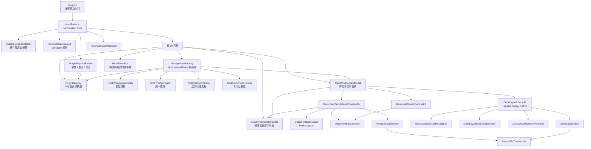
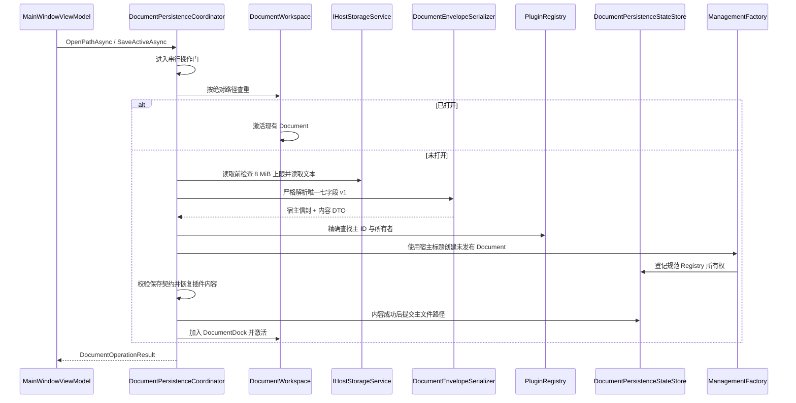

# MyAvaloniaManagement 内部架构

## 1. 目标与边界

`MyAvaloniaManagement` 是 Avalonia 桌面宿主，负责：

- 组合依赖、发现插件模块并管理插件生命周期；
- 收集显式 Document/Tool/View/Lifecycle 贡献并分派创建请求；
- 建立和维护四向 Dock 工作区；
- 严格读写唯一 Document 信封 v1，并编排打开、保存和关闭后的资源释放；
- 读取、迁移、校验和保存布局 V1；
- 提供每个 HostRuntime 独享的同步强类型事件总线；
- 为 XAML、菜单、主题和宿主 Tool 提供绑定入口。

宿主不负责插件的领域业务、插件内部 DTO 演进或后台任务实现。当前信任模型是同一团队维护的进程内可信插件，不提供沙箱、热卸载或第三方 ABI。

### Plugin SDK 与主题所有权

`MyAvaloniaManagementCommon` 通过 `MyAvaloniaManagement.PluginSdk` 提供基础编译契约，不再拥有
字体、桌面后端或全局主题。`App.axaml` 是 Fluent、Semi、Ursa、Dock Theme 和 Host Styles 的唯一
组合入口；`ApplicationThemeService` 只切换宿主主题状态，不把第三方主题对象暴露成插件服务。

普通插件通过 `App*` 语义画刷和局部 `StyleInclude` 适配外观。需要直接使用 Semi、Ursa 或 Dock UI
的插件引用同版本 `MyAvaloniaManagement.PluginSdk.UI`；共享策略保证这些 UI 类型来自默认加载上下文。
这个分层保持全局外观一致，同时避免基础 SDK 对所有插件强制传递完整 UI 实现。

## 2. 总体结构

依赖方向有两个核心约束：

1. ViewModel 依赖面向用例的协调器，不直接实现文件事务或重复 Dock 遍历。
2. `ManagementFactory` 保留 Dock 库要求的继承与 public 契约，但业务规则尽量委托给内部协作者。

## 3. 启动和关闭

### 3.1 `HostRuntime` 是唯一实际组合根

[`HostRuntime`](../../Business/Helpers/HostRuntime.cs) 按以下顺序启动：

1. 创建 `PluginRegistryBuilder`，注册宿主核心服务、ViewModel 和宿主显式贡献；
2. 读取全部插件清单并检查 Host API、Common 版本与全局身份；
3. 验证入口 `.deps.json`，建立 ALC 并生成严格类型与唯一模块快照；
4. 实例化已预检的 `IPluginModule`；身份只取自已经验证的 manifest；
5. 按 manifest `pluginId` 顺序执行 `Configure(IPluginRegistrationContext)`，分别收集插件私有服务与显式贡献；
6. 以 `ValidateScopes`、`ValidateOnBuild` 构建根容器；
7. 激活贡献、读取一次元数据并完成全量校验，成功后发布不可变 `PluginRegistry`；
8. 显式解析 Registry、`ManagementFactory` 与生命周期计划，再初始化 `PluginLifecycleManager`；
9. 将完全组合成功的容器交给 Avalonia 启动路径。

关闭时顺序反转：先关闭成功初始化的插件，再释放根容器。这个所有权对称性防止 `Program`、`App` 和插件生命周期管理器分别持有一部分清理责任。

[`Program`](../../Program.cs) 只保留进程入口和失败应用编排。`HostRuntime` 通过 internal
`HostAvaloniaBuilder` 使用 `Func<App>` 创建应用；App 注入 `IHostDesktopShell`，不再存在静态
`ServiceProvider` 或生产 ViewModel 无参构造。仓库测试与 Harness 通过明确 friend assembly
访问 internal 组合入口。

### 3.2 为什么不直接采用通用 Host Builder

当前应用已有固定的 Avalonia 启动方式。内部 `HostRuntime` 与桌面 Shell 足以集中所有权，而引入
另一套通用 Host 生命周期会增加双重启动/关闭语义。本轮选择最小可验证边界，不改变进程模型。

## 4. 插件发现和策略注册

### 4.1 程序集快照

[`AssemblyLoaderHelper`](../../Business/Helpers/AssemblyLoaderHelper.cs) 是 Host internal 加载边界，其行为是：

- 用绝对、规范化且不区分大小写的插件根目录作为缓存键；
- 通过 `Lazy<PluginDiscoverySnapshot>` 保证并发调用只执行一次扫描；
- 第一阶段只读严格 `plugin.manifest.json`，检查两个版本区间和全局 `pluginId`；
- 第二阶段只为通过预检的候选创建加载上下文，清单声明是唯一入口来源；
- 入口必须携带同名 `.deps.json`，托管和原生依赖只按 deps/RID 图解析；
- 类型预检后要求唯一、具体且具有 public 无参构造的 `IPluginModule`；
- 每个插件目录拥有自己的 `PluginLoadContext`；
- 不注册进程级 `AssemblyResolve`，私有依赖只在当前插件 ALC 内解析；
- 单个清单、目录、依赖或完整类型预检失败不会阻断其他独立插件；
- 程序集、清单、类型和模块类型通过同一不可变快照发布。

缓存的取舍是“稳定启动优先于进程内刷新”。部署模型要求替换插件后重启应用，因此不实现缓存失效和热加载。

### 4.2 Managed-only 模块与激活

[`PluginModulePreflight`](../../Business/Helpers/PluginModulePreflight.cs) 在不实例化插件对象的前提下验证唯一 `IPluginModule` 及其 public 无参构造；结构错误只隔离当前目录。随后 [`PluginModuleCatalog`](../../Business/Helpers/PluginModuleCatalog.cs) 只实例化快照中的模块，并把已经验证的 manifest `PluginId` 注入独立 [`PluginRegistrationContext`](../../Business/Helpers/PluginRegistrationContext.cs)。模块不再声明身份，也不能设置或覆盖 Context 的身份。

模块只在组合阶段调用一次 `Configure`。`context.Services` 指向当前插件独占的服务集合工作副本，只允许追加插件私有业务服务；Document、Tool、View 和 Lifecycle 必须调用专用 `Add*` 方法。未登记类型即使存在于入口程序集也不会被宿主发现；通过 `Services` 直接登记贡献接口会以 `CONTRIBUTION_REGISTRATION_BYPASS` 阻断组合。

[`HostServiceDescriptorPolicy`](../../Business/Helpers/PluginServiceRegistrationProtection.cs) 从完整宿主注册捕获保护类型，[`PluginServiceRegistrationTransaction`](../../Business/Helpers/PluginServiceRegistrationProtection.cs) 按模块复制当前描述符，以引用和顺序验证既有项，再只提交尾部新增项。插件删除、替换、重排既有描述符或追加宿主 ServiceType 会以 `PLUGIN_HOST_SERVICE_MUTATION` 在根容器构建前阻断；正常私有多实现、keyed 和开放泛型注册不受影响。模块返回后保存的工作副本已经与正式集合脱离。

### 4.3 单一扩展注册表

[`PluginRegistryBuilder`](../../Business/Helpers/PluginRegistryBuilder.cs) 只收集宿主和模块通过受控 Context 提交的贡献声明。根容器建立后，它激活 Document、Tool、Lifecycle，读取一次元数据并执行全量校验；无诊断时才提交 [`PluginRegistry`](../../Business/Helpers/PluginRegistry.cs)。Registry 统一拥有：

- manifest、入口程序集和模块类型快照；
- manifest 所属的 Document、Tool、View 和 Lifecycle；
- 策略 ID 到创建策略的映射；
- Document/Tool 元数据快照；
- Document 菜单入口展开；
- ViewModel 类型到无参 View 工厂的映射；
- 生命周期实例及其 manifest 所有权。

元数据在提交前只读取一次，避免属性访问包含计算或副作用时产生不一致。重复贡献类型、ViewModel 映射、Document/Tool 主 ID 与别名、所有权错误、空元数据和重复 Creation Intent 均形成结构化诊断，并以 `HostCompositionException` 阻断启动；失败的 Builder 和容器整体丢弃，不发布部分菜单或生命周期。

[`ViewLocator`](../../ViewLocator.cs) 是 DI 管理的普通实例，只读取当前 `PluginRegistry`。它不读取 AppDomain、插件目录或类型名称，不提供 `ViewModel` → `View` 字符串回退。未登记 Dockable 显示明确占位；View 工厂失败记录 `VIEW_CREATION_FAILED` 并显示占位，不持久化插件异常正文。

### 4.4 诊断白名单边界

所有加载、组合、布局和启动诊断都通过 `IHostDiagnosticSink` 进入 `HostDiagnosticSession`。
业务边界只创建 `HostDiagnosticDraft`：它只能携带错误码、阶段、强类型身份/版本、异常引用及受控
生命周期数据，不能提交自由用户说明或技术详情。`HostDiagnosticRedactionPolicy` 在分配序号、写内存、
JSONL 和镜像之前执行唯一一次白名单转换：

- 用户说明由错误码和阶段固定映射，不使用插件、文件或异常正文；
- Plugin ID、目录叶名称、程序集简单名、稳定 ID 和版本各自按结构校验，失败就丢弃可选值；
- `Exception` 只投影运行时类型，不读取 `Message`、`StackTrace` 或 `ToString()`；
- schema 1 的 `TechnicalDetail` 只允许生命周期枚举与毫秒耗时，否则为 `null`。

因此插件状态 Tool、启动失败窗口和复制摘要只是同一脱敏记录的投影，不再承担二次清洗。
进程环境变量 `MYAVALONIA_ENABLE_SENSITIVE_DIAGNOSTICS=1` 是与记录完全分离的短期调试旁路：它只把
带风险警告的原始异常写到 Trace/stderr，不写 UI、剪贴板或 JSONL，也不持久化开关。默认和 Release
门禁都不启用该旁路。设计与验收证据见
[G15 宿主诊断脱敏](../../../../docs/plan-history/host-v1/g15-host-diagnostic-redaction.md)。

## 5. `ManagementFactory` 的 Facade 边界

[`ManagementFactory`](../../ViewModels/ManagementFactory.cs) 必须继承 Dock 的工厂类型并保留现有 public 方法、override 和定位器配置，因此不能简单删除。它现在主要承担协议适配与委托：

| 协作者 | 单一职责 | 不负责 |
| --- | --- | --- |
| `PluginRegistry` | 清单所有权、贡献、元数据、View 映射、菜单和创建分派 | 组合写入、Dock 树状态、生命周期运行状态 |
| `DockWorkspaceBuilder` | 创建稳定四向初始布局 | 工具恢复和激活 |
| `DockTreeNavigator` | Dock、Document、Tool、Pinned/Hidden 查询 | 修改业务状态 |
| `ToolDockCoordinator` | 工具显示、恢复、停靠点重建和纵向区域归一化 | 策略发现 |
| `DockDocumentLifetime` | 文档关闭后的缓存移除和 Scope 释放 | 关闭是否允许 |

这种拆分保留 Dock 框架所需的 Facade，同时让每项内部规则可以独立测试。`GetToolManagementData()` 在布局尚未建立时继续返回 `null`；内部 `ToolRegistrySnapshot` 仅供宿主提前构造工具管理列表，不扩大 public API。

## 6. 文档工作流

### 6.1 分层

各组件职责：

- `MainWindowViewModel`：绑定状态、命令、主题、布局生命周期及根级状态的定向订阅；
- `DocumentPersistenceCoordinator`：选择、批量打开、文件树窄入口、恢复编排和单文件错误隔离；
- `DocumentOperationState`：保存当前 HostRuntime 唯一的文档错误条状态；文件菜单与文件树共享；
- `DocumentSaveService`：指定 Document 的路径决策、主文件提交、状态接受和恢复备份；
- `DocumentCloseCoordinator`：标签/窗口关闭确认、批量保存和同步关闭的异步重入；
- `DocumentWorkspace`：把 Dock 树适配为文档区操作；
- `DocumentPathIdentity`：绝对路径与 Windows 不区分大小写身份；
- `DocumentPersistenceStateStore`：按 Document 引用保存规范 Registry 注册项和当前主路径，关闭与失败时幂等清理；
- `DocumentEnvelopeSerializer`：严格读写 schema 1、七个精确字段、深度 8 和 UTF-8 8 MiB 边界；
- `PluginRegistry`：提供不可变 Document 类型、主 ID 和插件所有权事实；
- `IHostStorageService`：隔离 Avalonia 选择器、本机文件系统与读前长度检查。

### 6.2 并发与状态提交

打开和所有保存入口共享 `DocumentOperationGate`。该方案牺牲同一窗口内文档 I/O 的并行度，换取简单、确定的查重和状态提交顺序。文档文件通常较小，稳定性收益高于有限的并行收益。

保存遵循“主文件成功后再提交内存状态”：`CreateContentSnapshot()` 无副作用，原子写入完成后才更新标题、宿主路径并调用 `IDocumentSaveState.AcceptChanges`。随后更新 `.recovery.bak`；备份失败只产生警告，不伪造主文件失败。

插件快照只包含内容版本和 payload。`pluginId`、`documentTypeId`、标题和 UTC 时间由宿主分别从
Registry、目标文件名和 `TimeProvider` 取得。v1 是第一个且唯一格式；不设置旧字段探测、别名
归一化后继续打开或迁移分支。打开任一阶段失败时，未发布 Scope 被释放且不会执行写入。

事件总线按契约同步派发且不等待异步回调；ViewModel 通过内部异步观察方法捕获预期的文档操作结果，
避免 `async void` 和未观察任务异常。

### 6.3 异常边界

只把预期的文件、权限、路径、JSON 和 `DocumentLoadException` 转换为可恢复失败。转换由
`DocumentPersistenceErrorMapper` 返回宿主固定文本，不信任公共异常消息，也不拼接文件路径。
空引用、无效程序状态等编程错误继续向上传播，使测试和诊断能够尽早暴露缺陷。

批量打开以单文件为错误边界：一个文件失败不阻断后续文件。窗口退出的“保存全部”按 Dock 顺序逐个提交，首个失败或取消即停止。

### 6.4 事件总线

SDK 的 `IHostEventBus` 是唯一公共进程内事件契约。Host 的 internal `HostEventBus` 由根容器注册为
singleton，所以一个 HostRuntime 内共享、不同 HostRuntime 互相隔离。实现只在锁内维护订阅并创建
发布快照，在锁外按登记顺序、发布线程同步调用用户代码；这允许处理器自释放或重入发布而不死锁。

处理器异常原样传播并停止后续派发。订阅者保存独立、幂等的 `IDisposable` 令牌：Document 随自身
Scope 释放，插件 Coordinator 在关闭流程释放，根级窗口和 Tool 由自身 `Dispose` 及根容器兜底。
进入发布快照的处理器可能最后执行一次，因此 Document 仍以 `IDocumentLifetime.IsClosing` 阻止迟到
副作用。总线只负责插件或 Document 中存在真实多消费者需求的派发，不承担订阅者生命周期。

G10 后 Host 自己不再把文件打开、布局刷新和 Tool 显隐绕行到公共总线。文件树只依赖单方法
`IHostDocumentOpenService`，生产实现复用文档持久化协调器；`ManagementFactory` 作为 Dock 状态所有者，
在显隐完整提交后直接同步 Tool 管理器并定向通知主窗口。两类根级通知都由瞬态主窗口在 `Dispose`
时解除，不存在任意事件类型路由、静态订阅或跨 HostRuntime 状态。

## 7. 布局生命周期

[`DockLayoutLifecycle`](../../Business/Layout/DockLayoutCoordinator.cs) 只保留三个阶段：

1. `Prepare`：读取快照并创建、初始化默认 Dock 树；
2. `ApplyPending`：迁移、补齐稳定节点、校验并应用快照；
3. `Save`：捕获运行时状态并交给存储层。

细节分别由以下组件承担：

- `DockLayoutSnapshotMapper`：运行时 Dock 树与 V1 快照互转；
- `DockLayoutSnapshotMigrator`：仅处理现有两向到四向兼容；
- `DockLayoutRuntimeValidator`：检查插件、Pane、Tool 和稳定 ID；
- `DockLayoutStore`：JSON 读写、格式校验和坏文件隔离；
- `AtomicFileTransaction`：临时写入、提交和清理。

快照整体无效时隔离原文件并回退完整默认布局。当前不做缺失插件下的部分恢复，因为部分应用会制造难以解释的混合状态，也会隐式改变 V1 语义。

## 8. 原子文件事务

[`AtomicFileTransaction`](../../Business/Storage/AtomicFileTransaction.cs) 同时服务于文档和布局：

1. 将目标路径规范化并确保父目录存在；
2. 在同目录创建唯一 `.tmp` 文件；
3. 写入全部内容并刷新到磁盘；
4. 目标存在时 `File.Replace`，不存在时 `File.Move`；
5. 无论成功失败都尝试清理临时文件。

同目录临时文件避免跨卷移动失去原子性。事务不负责备份、格式迁移或用户提示，这些属于上层用例。

## 9. 生命周期与所有权

| 对象 | 所有者 | 释放时机 |
| --- | --- | --- |
| 根 DI 容器 | `HostRuntime` | 插件反向关闭后 |
| Host 事件总线 | 根 DI 容器 | 根容器释放；订阅者应更早释放自己的令牌 |
| Managed 插件生命周期 | `PluginLifecycleManager` | Avalonia 消息循环结束后 |
| Tool 实例 | `ManagementFactory` | 根容器释放 |
| 有独立 Scope 的 Document | `DocumentScopeManager` | Dock 确认关闭后；根容器退出时兜底 |
| Document 控件缓存 | `DocumentControlRecycling` | 对应 Document 确认关闭后移除 |
| 布局快照待应用状态 | `DockLayoutLifecycle` | 首次 Apply 时原子取出 |

当前仓库 Managed Document 均通过 `IDocumentScopeFactory` 建立独立 Scope。显式注册保证宿主知道策略归属，但策略若绕过该工厂自行创建 Document，宿主仍无法替它拥有该实例的局部依赖；插件作者必须遵守 Document Scope 契约。

## 10. 测试映射

| 风险 | 主要保护 |
| --- | --- |
| Plugin SDK public 签名漂移 | v1 Shipped/Unshipped 文本、`Test-PluginSdkCompatibility.ps1`、基线政策测试 |
| Host 实现面意外导出 | `HostApiBoundaryTests` |
| 插件并发扫描、可变缓存泄漏 | `InternalRefactorTests` |
| Managed-only 拒绝、显式贡献所有权与 ID 碰撞诊断 | `ManagedOnlyPluginLoadingTests`、`ExplicitContributionAndPluginRegistryTests`、内部注册表测试 |
| 诊断正文、凭据、URL、路径泄漏与敏感开关误开 | `HostDiagnosticsTests`、生命周期/UI/Document 错误测试、`Test-HostDiagnosticRedaction.ps1` |
| 插件私有 DI 事务提交、宿主描述符保护与四插件回归 | `PluginServiceProtectionTests` |
| 严格七字段信封、资源边界、所有权与失败不发布 | `DocumentEnvelopeV1Tests` |
| 并发打开、保存失败、关闭确认与坏文件恢复 | `MainWindowViewModelTests`、`DocumentPersistenceV1Tests` |
| 四向 Dock、Pinned/Hidden、禁用浮动 | PluginTests |
| Scope 与控件缓存释放 | PluginTests |
| 同步顺序、重入、异常、并发、根隔离及订阅释放 | `HostEventBusTests`、Document Scope 测试 |
| 布局迁移、隔离、回退 | 布局生命周期与存储测试 |
| XAML、绑定和真实窗口事件 | Headless UI 与 Windows Smoke |

详细命令和门槛参见[测试说明](../../../../docs/reference/myavalonia-management-tests.md)。
