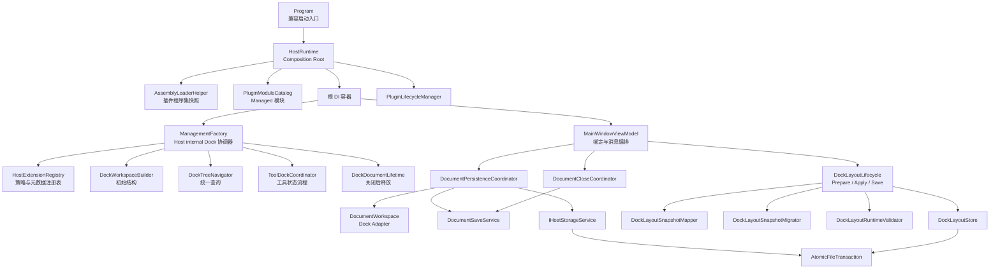
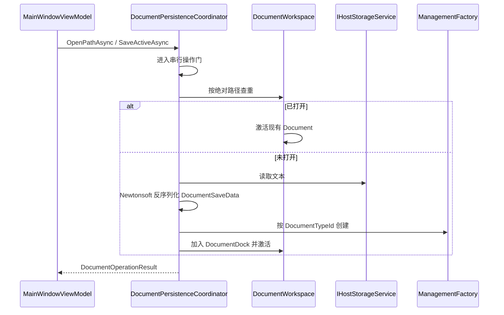

# MyAvaloniaManagement 内部架构

## 1. 目标与边界

`MyAvaloniaManagement` 是 Avalonia 桌面宿主，负责：

- 组合依赖、发现插件并管理插件生命周期；
- 发现 Document/Tool 策略并分派创建请求；
- 建立和维护四向 Dock 工作区；
- 编排文档打开、保存和关闭后的资源释放；
- 读取、迁移、校验和保存布局 V1；
- 为 XAML、菜单、主题和宿主 Tool 提供绑定入口。

宿主不负责插件的领域业务、插件内部 DTO 演进或后台任务实现。当前信任模型是同一团队维护的进程内可信插件，不提供沙箱、热卸载或第三方 ABI。

### Plugin SDK 与主题所有权

`MyAvaloniaManagementCommon` 通过 `MyAvaloniaManagement.PluginSdk` 提供基础编译契约，不再拥有
字体、桌面后端或全局主题。`App.axaml` 是 Fluent、Semi、Ursa、Dock Theme 和 Host Styles 的唯一
组合入口；`ApplicationThemeService` 只切换宿主主题状态，不把第三方主题对象暴露成插件服务。

普通插件通过 `App*` 语义画刷和局部 `StyleInclude` 适配外观。需要直接使用 Semi、Ursa 或 Dock UI
的插件引用同版本 `MyAvaloniaManagement.PluginSdk.UI`；共享策略保证这些 UI 类型来自默认加载上下文。
这个分层保持全局外观一致，同时避免基础 SDK 对所有插件强制传递完整 UI 实现。

## 2. 总体结构

依赖方向有两个核心约束：

1. ViewModel 依赖面向用例的协调器，不直接实现文件事务或重复 Dock 遍历。
2. `ManagementFactory` 保留 Dock 库要求的继承与 public 契约，但业务规则尽量委托给内部协作者。

## 3. 启动和关闭

### 3.1 `HostRuntime` 是唯一实际组合根

[`HostRuntime`](../../Business/Helpers/HostRuntime.cs) 按以下顺序启动：

1. 注册宿主核心服务和 ViewModel；
2. 读取全部插件清单并检查 Host API、Common 版本与全局身份；
3. 验证入口 `.deps.json`，建立 ALC 并生成严格类型与唯一模块快照；
4. 实例化已预检的 `IPluginModule` 并二次核对清单身份；
5. 允许 Managed 插件向 `IServiceCollection` 注册服务；
6. 以 `ValidateScopes`、`ValidateOnBuild` 构建根容器；
7. 初始化 `PluginLifecycleManager`；
8. 将容器交给 Avalonia 启动路径。

关闭时顺序反转：先关闭成功初始化的插件，再释放根容器。这个所有权对称性防止 `Program`、`App` 和插件生命周期管理器分别持有一部分清理责任。

[`Program`](../../Program.cs) 只保留进程入口和失败应用编排。`HostRuntime` 通过 internal
`HostAvaloniaBuilder` 使用 `Func<App>` 创建应用；App 注入 `IHostDesktopShell`，不再存在静态
`ServiceProvider` 或生产 ViewModel 无参构造。仓库测试与 Harness 通过明确 friend assembly
访问 internal 组合入口。

### 3.2 为什么不直接采用通用 Host Builder

当前应用已有固定的 Avalonia 启动方式。内部 `HostRuntime` 与桌面 Shell 足以集中所有权，而引入
另一套通用 Host 生命周期会增加双重启动/关闭语义。本轮选择最小可验证边界，不改变进程模型。

## 4. 插件发现和策略注册

### 4.1 程序集快照

[`AssemblyLoaderHelper`](../../Business/Helpers/AssemblyLoaderHelper.cs) 是 Host internal 加载边界，其行为是：

- 用绝对、规范化且不区分大小写的插件根目录作为缓存键；
- 通过 `Lazy<PluginDiscoverySnapshot>` 保证并发调用只执行一次扫描；
- 第一阶段只读严格 `plugin.manifest.json`，检查两个版本区间和全局 `pluginId`；
- 第二阶段只为通过预检的候选创建加载上下文，清单声明是唯一入口来源；
- 入口必须携带同名 `.deps.json`，托管和原生依赖只按 deps/RID 图解析；
- 类型预检后要求唯一、具体且具有 public 无参构造的 `IPluginModule`；
- 每个插件目录拥有自己的 `PluginLoadContext`；
- 不注册进程级 `AssemblyResolve`，私有依赖只在当前插件 ALC 内解析；
- 单个清单、目录、依赖或完整类型预检失败不会阻断其他独立插件；
- 程序集、清单、类型和模块类型通过同一不可变快照发布。

缓存的取舍是“稳定启动优先于进程内刷新”。部署模型要求替换插件后重启应用，因此不实现缓存失效和热加载。

### 4.2 Managed-only 模块与激活

[`PluginModulePreflight`](../../Business/Helpers/PluginModulePreflight.cs) 在不实例化插件对象的前提下验证唯一 `IPluginModule` 及其 public 无参构造；结构错误只隔离当前目录。随后 [`PluginModuleCatalog`](../../Business/Helpers/PluginModuleCatalog.cs) 只实例化快照中的模块，并在服务注册前核对模块 `PluginId` 与清单。Host 和插件的 Document/Tool 策略全部通过 `ActivatorUtilities` 激活，无模块程序集和 public 无参策略不再形成第二条路径。

生产发现要求入口及引用程序集完成严格类型预检，失败时隔离整个目录，避免同一插件出现部分类型成功。模块身份或程序集版本与清单不一致属于发布物自相矛盾，在 `ConfigureServices` 前阻断组合。

### 4.3 单一扩展注册表

[`HostExtensionRegistry`](../../Business/Helpers/HostExtensionRegistry.cs) 对宿主程序集和插件程序集做一次类型遍历，同时发现 Document 与 Tool 策略。它拥有：

- 策略 ID 到创建策略的映射；
- Document/Tool 元数据快照；
- Document 菜单入口展开；
- 统一 DI 策略创建；
- Builder → Validate → Commit 三阶段原子发布。

元数据在注册时只读取一次，避免属性访问包含计算或副作用时产生不一致。注册表先扫描并激活候选策略、各读取一次元数据、校验主 ID、别名与命名空间的全量碰撞，无诊断时才一次性发布只读注册表。重复 `PluginId`、Document/Tool 主 ID 与别名、所有权错误、空元数据和重复 Creation Intent 均形成排序稳定的结构化诊断，并以 `HostCompositionException` 阻断启动；不再有“首次注册胜出”语义。

[`ViewLocator`](../../ViewLocator.cs) 复用已经加载到当前进程的程序集和同一局部类型容错逻辑，不再次承担插件部署扫描职责。

## 5. `ManagementFactory` 的 Facade 边界

[`ManagementFactory`](../../ViewModels/ManagementFactory.cs) 必须继承 Dock 的工厂类型并保留现有 public 方法、override 和定位器配置，因此不能简单删除。它现在主要承担协议适配与委托：

| 协作者 | 单一职责 | 不负责 |
| --- | --- | --- |
| `HostExtensionRegistry` | 策略、元数据、菜单和创建分派 | Dock 树状态 |
| `DockWorkspaceBuilder` | 创建稳定四向初始布局 | 工具恢复和激活 |
| `DockTreeNavigator` | Dock、Document、Tool、Pinned/Hidden 查询 | 修改业务状态 |
| `ToolDockCoordinator` | 工具显示、恢复、停靠点重建和纵向区域归一化 | 策略发现 |
| `DockDocumentLifetime` | 文档关闭后的缓存移除和 Scope 释放 | 关闭是否允许 |

这种拆分保留 Dock 框架所需的 Facade，同时让每项内部规则可以独立测试。`GetToolManagementData()` 在布局尚未建立时继续返回 `null`；内部 `ToolRegistrySnapshot` 仅供宿主提前构造工具管理列表，不扩大 public API。

## 6. 文档工作流

### 6.1 分层

各组件职责：

- `MainWindowViewModel`：绑定状态、命令、主题、布局生命周期和消息编排；
- `DocumentPersistenceCoordinator`：选择、批量打开、恢复编排和单文件错误隔离；
- `DocumentSaveService`：指定 Document 的路径决策、主文件提交、状态接受和恢复备份；
- `DocumentCloseCoordinator`：标签/窗口关闭确认、批量保存和同步关闭的异步重入；
- `DocumentWorkspace`：把 Dock 树适配为文档区操作；
- `DocumentPathIdentity`：绝对路径与 Windows 不区分大小写身份；
- `DocumentEnvelopeSerializer`：固定 Newtonsoft 与 `DocumentSaveData` 格式；
- `IHostStorageService`：隔离 Avalonia 选择器和本机文件系统。

### 6.2 并发与状态提交

打开和所有保存入口共享 `DocumentOperationGate`。该方案牺牲同一窗口内文档 I/O 的并行度，换取简单、确定的查重和状态提交顺序。文档文件通常较小，稳定性收益高于有限的并行收益。

保存遵循“主文件成功后再提交内存状态”：快照生成无副作用，原子写入完成后才更新标题、路径并调用 `IDocumentSaveState.AcceptChanges`。随后更新 `.recovery.bak`；备份失败只产生警告，不伪造主文件失败。

消息总线无法等待异步回调时，ViewModel 通过内部异步观察方法捕获预期的文档操作结果，避免 `async void` 和未观察任务异常。

### 6.3 异常边界

只把预期的文件、权限、路径、JSON 和 `DocumentLoadException` 转换为可恢复失败。空引用、无效程序状态等编程错误继续向上传播，使测试和诊断能够尽早暴露缺陷。

批量打开以单文件为错误边界：一个文件失败不阻断后续文件。窗口退出的“保存全部”按 Dock 顺序逐个提交，首个失败或取消即停止。

## 7. 布局生命周期

[`DockLayoutLifecycle`](../../Business/Layout/DockLayoutCoordinator.cs) 只保留三个阶段：

1. `Prepare`：读取快照并创建、初始化默认 Dock 树；
2. `ApplyPending`：迁移、补齐稳定节点、校验并应用快照；
3. `Save`：捕获运行时状态并交给存储层。

细节分别由以下组件承担：

- `DockLayoutSnapshotMapper`：运行时 Dock 树与 V1 快照互转；
- `DockLayoutSnapshotMigrator`：仅处理现有两向到四向兼容；
- `DockLayoutRuntimeValidator`：检查插件、Pane、Tool 和稳定 ID；
- `DockLayoutStore`：JSON 读写、格式校验和坏文件隔离；
- `AtomicFileTransaction`：临时写入、提交和清理。

快照整体无效时隔离原文件并回退完整默认布局。当前不做缺失插件下的部分恢复，因为部分应用会制造难以解释的混合状态，也会隐式改变 V1 语义。

## 8. 原子文件事务

[`AtomicFileTransaction`](../../Business/Storage/AtomicFileTransaction.cs) 同时服务于文档和布局：

1. 将目标路径规范化并确保父目录存在；
2. 在同目录创建唯一 `.tmp` 文件；
3. 写入全部内容并刷新到磁盘；
4. 目标存在时 `File.Replace`，不存在时 `File.Move`；
5. 无论成功失败都尝试清理临时文件。

同目录临时文件避免跨卷移动失去原子性。事务不负责备份、格式迁移或用户提示，这些属于上层用例。

## 9. 生命周期与所有权

| 对象 | 所有者 | 释放时机 |
| --- | --- | --- |
| 根 DI 容器 | `HostRuntime` | 插件反向关闭后 |
| Managed 插件生命周期 | `PluginLifecycleManager` | Avalonia 消息循环结束后 |
| Tool 实例 | `ManagementFactory` | 根容器释放 |
| 有独立 Scope 的 Document | `DocumentScopeManager` | Dock 确认关闭后；根容器退出时兜底 |
| Document 控件缓存 | `DocumentControlRecycling` | 对应 Document 确认关闭后移除 |
| 布局快照待应用状态 | `DockLayoutLifecycle` | 首次 Apply 时原子取出 |

当前仓库 Managed Document 均通过 `IDocumentScopeFactory` 建立独立 Scope。未来插件若绕过该工厂自行创建 Document，宿主无法替它拥有该实例的局部依赖；这属于 Document 注册契约由 G5 进一步收口的边界，不是 Legacy 激活能力。

## 10. 测试映射

| 风险 | 主要保护 |
| --- | --- |
| public 签名漂移 | `PublicApiContractTests` |
| 插件并发扫描、可变缓存泄漏 | `InternalRefactorTests` |
| Managed-only 拒绝、模块所有权与 ID 碰撞诊断 | `ManagedOnlyPluginLoadingTests`、内部注册表测试 |
| 并发打开、保存失败、关闭确认与坏文件恢复 | `MainWindowViewModelTests`、`DocumentPersistenceV1Tests` |
| 四向 Dock、Pinned/Hidden、禁用浮动 | PluginTests |
| Scope 与控件缓存释放 | PluginTests |
| 布局迁移、隔离、回退 | 布局生命周期与存储测试 |
| XAML、绑定和真实窗口事件 | Headless UI 与 Windows Smoke |

详细命令和门槛参见[测试说明](../../../../docs/reference/myavalonia-management-tests.md)。
