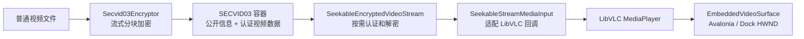

# MySmallTools 安全视频子系统

本文档目录说明 `MySmallTools` 中已经落地的安全视频加密与播放能力。当前实现以 SECVID03 为唯一受支持的容器格式，通过 AES-256-GCM 分块认证、可随机定位的按需解密流和 LibVLC 完成播放，并针对 Avalonia Dock 重建原生视频表面的行为实现了状态恢复。

> 这里的“安全”是指容器固定头、原视频前缀和加密视频块具有密码学完整性保护，且播放器不需要把完整视频解密到内存或临时明文文件。无需密码即可读取的标题、描述和原始文件名属于公开信息，不提供真实性保证。

## 文档导航

| 文档 | 内容 | 适合读者 |
| --- | --- | --- |
| [概要设计](architecture-design.md) | 分层、组件职责、加密与播放数据流、DI 和 Document 生命周期 | 开发者、维护者 |
| [SECVID03 文件格式](secvid03-format.md) | 二进制布局、密钥派生、GCM 认证、随机读取、公开信息和兼容策略 | 格式维护者、安全评审人员 |
| [接入、约定与排障](integration-and-conventions.md) | LibVLC 部署、插件扫描、Dock 黑屏恢复、资源释放、已踩过的坑和回归检查 | 集成人员、问题排查人员 |

## 系统边界

该子系统包含三项宿主菜单能力：

- **视频文件加密器**：把普通视频流式写为 `.secvid` 文件，显示进度，并在失败或取消时删除未完成的 `.partial-*` 文件。
- **加密视频播放器**：无需密码读取公开标题和描述；输入密码后验证固定头，并把 SECVID03 暴露为可随机读取的原视频视图供 LibVLC 解码。
- **加密视频库播放器**：异步扫描文件夹当前层的 `.secvid`，按文件名、公开标题和描述搜索，并用当前 Document 的公共密码在同一页面切换播放。

核心链路如下：

加密器和播放器共用 SECVID03 格式定义，但不共享任务状态、播放位置或原生播放器实例。每个 Dock Document 都有独立 DI Scope；仅 `LibVlcRuntime` 作为进程级单例，负责从插件私有目录执行一次 `Core.Initialize`。

## 运行基线

| 项目 | 当前基线 |
| --- | --- |
| .NET | .NET 9 (`net9.0`) |
| 操作系统和架构 | Windows x64 |
| LibVLCSharp | 3.9.4 |
| LibVLCSharp.Avalonia | 3.9.4 |
| VideoLAN.LibVLC.Windows | 3.0.21 |
| 容器格式 | SECVID03 |
| 插件部署目录 | `Controls/SmallTools/` |
| 原生运行时相对目录 | `native/win-x64/libvlc/` |

运行时不会回退到宿主输出根目录、`PATH` 或系统安装的 VLC。私有原生目录不完整时，播放器会报告实际检查的绝对路径。

## 快速使用

### 创建加密视频

1. 在宿主中打开“视频文件加密器”。
2. 选择普通视频并确认输出 `.secvid` 路径；输入路径与输出路径不能相同。
3. 输入并确认至少 6 个字符的密码，可选填公开标题和描述。
4. 开始加密并等待正式输出文件生成。

加密过程使用与目标文件相同目录中的唯一 `.partial-*` 临时文件。只有全部分块写入并刷新成功后，临时文件才会移动为目标文件；关闭文档、取消、磁盘错误或其他异常都会进入临时文件清理路径。

### 播放加密视频

1. 在宿主中打开“加密视频播放器”。
2. 选择 `.secvid` 文件。播放器会先显示无需密码的公开标题和描述。
3. 输入密码并加载。加载阶段执行 PBKDF2、固定头认证和 LibVLC 本地媒体解析，不会完整解密视频。
4. 使用播放、暂停、停止、进度和音量控件。切换 Dock 标签页后，播放器会在新视频表面上恢复原位置及播放或暂停状态。

### 浏览文件夹视频库

1. 在宿主中打开“加密视频库播放器”，选择包含 `.secvid` 的文件夹。
2. 页面只扫描当前目录，不递归子目录；公开信息在后台以最多四个并发读取任务逐项加入列表。
3. 搜索框匹配磁盘文件名、公开标题和公开描述，描述本身不会显示在列表中。
4. 输入当前视频库共用的密码，单击选择视频后双击列表项或点击“播放所选视频”。切换文件夹会释放当前媒体，“刷新”当前文件夹则不会中断正在播放的视频。

公开信息损坏的文件仍会以磁盘文件名显示并标注错误。此类文件仍可尝试播放，因为公开区损坏不必然意味着受认证保护的视频主体损坏。

### 编辑公开信息

标题和描述位于固定的 64 KiB 公开区，可以在不移动或重新加密视频主体的情况下原地修改。进入编辑前，播放器会释放当前 `Media` 和 `MediaInput`，避免 LibVLC 后台读取与文件写入冲突。修改后需要重新输入密码加载媒体。

## 当前限制

- 仅支持 Windows x64；项目和原生运行时都固定为 x64。
- 播放器只接受 SECVID03。检测到 SECVID02 时会提示重新加密，不会回退到旧的完整内存解密方案。
- 文件夹视频库第一版只扫描当前层的 `.secvid`，不提供递归、自动连播、目录监听或密码持久化。
- 密码丢失后无法从容器恢复；公开区也不保存可直接比较的明文 key hash。
- 标题最多 200 个 Unicode Rune，描述最多 10,000 个 Unicode Rune，同时还受 UTF-8 字节上限约束。
- 公开信息使用 CRC32 检测意外损坏，不用于防篡改；拥有文件写权限的人可以重写公开信息和 CRC。
- `SeekableEncryptedVideoStream` 本身不保证多线程并发安全；LibVLC 适配器在回调入口串行化访问。

## 源码入口

- 插件与服务注册：[MySmallToolsPluginModule.cs](../../Plugin/MySmallToolsPluginModule.cs)
- 加密与格式：[Secvid03Encryptor.cs](../../Business/SecretVideoPlayer/Secvid03Encryptor.cs)、[Secvid03Format.cs](../../Business/SecretVideoPlayer/Secvid03Format.cs)
- 随机读取播放：[SeekableEncryptedVideoStream.cs](../../Business/SecretVideoPlayer/SeekableEncryptedVideoStream.cs)、[SecureVideoPlayer.cs](../../Business/SecretVideoPlayer/SecureVideoPlayer.cs)
- Dock 视频表面：[EmbeddedVideoSurface.cs](../../Views/SecretVideoPlayer/EmbeddedVideoSurface.cs)、[VideoSurfaceRestoreSequence.cs](../../Business/SecretVideoPlayer/VideoSurfaceRestoreSequence.cs)
- 文件夹视频库：[VideoLibraryScanner.cs](../../Business/SecretVideoPlayer/VideoLibraryScanner.cs)、[SecretVideoLibraryViewModel.cs](../../ViewModels/SecretVideoPlayer/SecretVideoLibraryViewModel.cs)
- 自动化测试：[Secvid03Tests.cs](../../../MySmallTools.Tests/Secvid03Tests.cs)、[VideoToolStabilityTests.cs](../../../MySmallTools.Tests/VideoToolStabilityTests.cs)、[VideoLibraryTests.cs](../../../MySmallTools.Tests/VideoLibraryTests.cs)

本文档描述当前实现，不把设想中的跨平台支持、旧格式兼容或其他加密算法写作已有能力。格式或接入行为变化时，应同时更新本目录文档和对应自动化测试。
