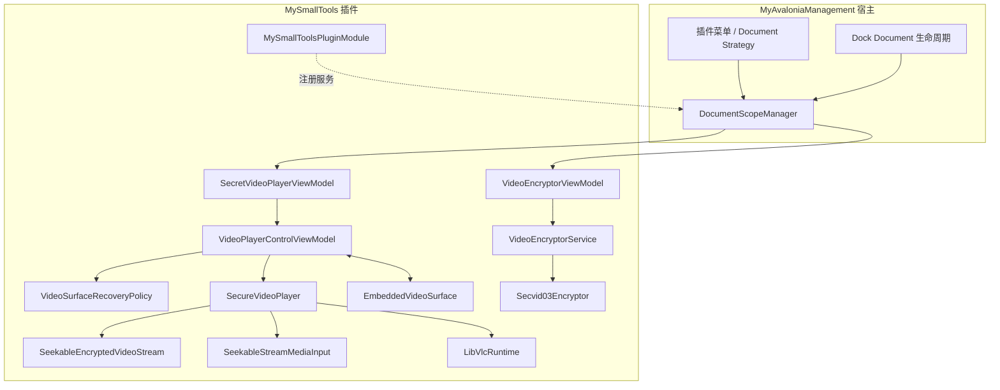
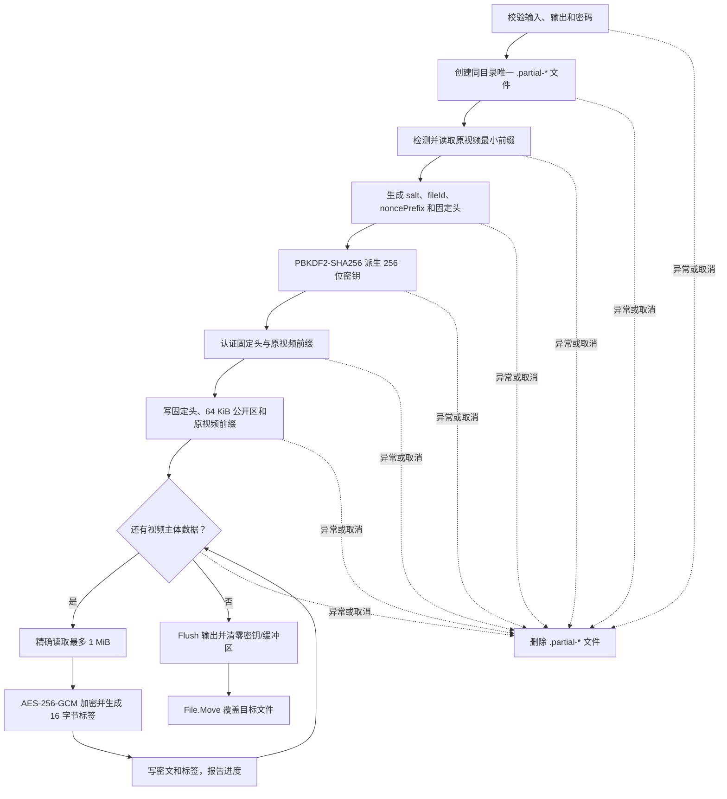
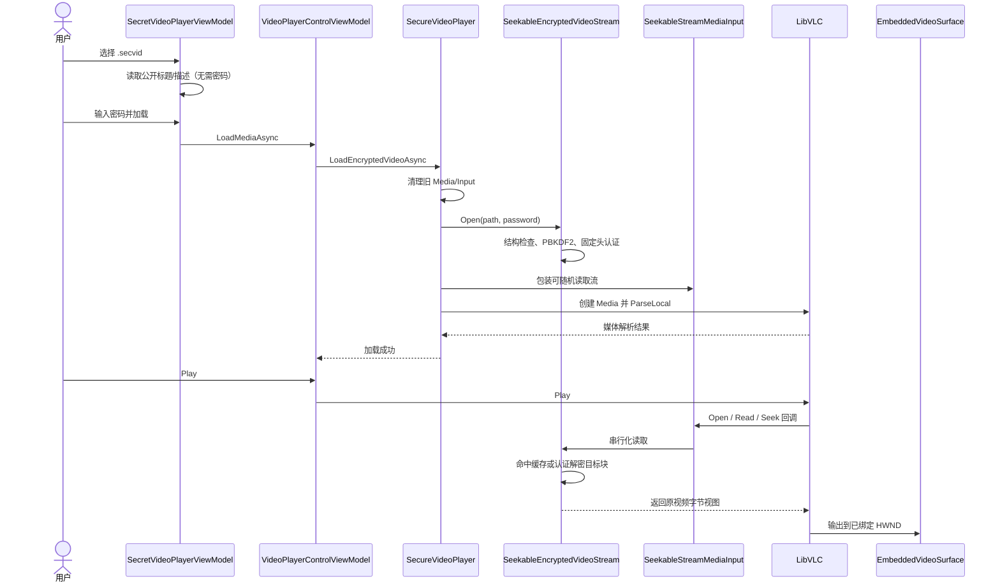
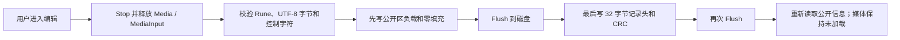
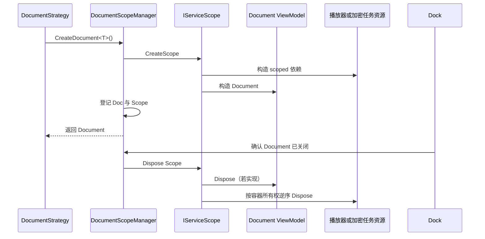

# 安全视频子系统概要设计

## 1. 设计目标

安全视频子系统需要同时满足以下目标：

- 大文件加密与播放的内存占用不随视频总大小线性增长。
- 密码错误、固定头篡改和视频块篡改能够被明确拒绝。
- 解码器可以像读取普通文件一样顺序读取或随机 Seek，无需生成完整明文副本。
- 标题和描述可以在输入密码前展示，并可在不重写大型视频主体的情况下修改。
- 多个 Dock 标签页互不共享播放状态、恢复快照、加密任务和原生播放器。
- Dock 销毁并重建原生 HWND 后，播放器恢复原位置和用户可见的播放或暂停状态。
- 插件关闭后及时释放原生对象、文件句柄、派生密钥和明文缓存。

不在当前范围内的能力包括：跨平台原生运行时、SECVID02 播放兼容、云端密钥管理、数字签名和公开元数据真实性认证。

## 2. 分层与职责

各层边界如下：

| 层 | 主要类型 | 职责 |
| --- | --- | --- |
| 插件接入 | `MySmallToolsPluginModule`、两个 `DocumentStrategy` | 声明服务生命周期，由宿主为每个 Document 创建 Scope；不在模块加载时创建 View、LibVLC 或任务 |
| 页面协调 | `SecretVideoPlayerViewModel`、`VideoEncryptorViewModel` | 命令、输入校验、状态文本、公开信息编辑和任务取消 |
| 播放控件 | `VideoPlayerControlViewModel`、`VideoPlayerControl` | 播放控制、LibVLC 事件转 UI、媒体代次和视频表面恢复 |
| 原生输出 | `EmbeddedVideoSurface` | 在原生句柄真正创建后绑定 `MediaPlayer.Hwnd`，销毁前同步发出表面丢失通知 |
| 播放服务 | `SecureVideoPlayer` | 管理 `LibVLC`、`MediaPlayer`、`Media`、`MediaInput` 的所有权与释放顺序 |
| 流适配 | `SeekableStreamMediaInput` | 把 .NET 可 Seek 流适配为 LibVLC `MediaInput`，串行化回调并保留底层异常 |
| 容器读取 | `SeekableEncryptedVideoStream` | 验证固定头，按需认证和解密目标块，维护四块 LRU 明文缓存 |
| 加密 | `VideoEncryptorService`、`Secvid03Encryptor` | 任务状态、进度、目录准备，以及 SECVID03 的事务式流式写入 |
| 格式与公开区 | `Secvid03Format`、`EncryptedVideoContainer` | 固定偏移、nonce/AAD、边界校验、公开信息读取和原地更新 |
| 原生运行时 | `LibVlcRuntime` | 从插件私有目录惰性、线程安全地完成一次进程级 `Core.Initialize` |

## 3. 加密数据流

加密器只保留一个明文块和一个密文块缓冲区。输入流允许其他读取者，但输出临时文件使用独占写入；输入文件在加密过程中被截断时，精确读取会抛出异常，不会为不完整块生成标签。

## 4. 加载与播放数据流

“加载成功”不表示视频主体已经完整解密。打开阶段只验证容器结构、密码和不可变头；某个视频块被篡改时，会在解码器实际读取该块时失败。`SeekableStreamMediaInput.LastError` 保存底层认证或读取异常，供 LibVLC 的通用错误事件生成更有意义的提示。

## 5. 公开信息编辑流程

公开标题和描述不属于视频密文认证数据，因此可以原地修改。页面层必须先切换资源状态，再写文件：

先写负载、后提交记录头的顺序不能颠倒。进程在中途退出时，旧记录头和新负载不匹配会触发 CRC 错误，而不会把部分写入误认为有效公开信息。公开区损坏不阻止用户继续尝试密码验证和播放，因为公开区刻意不参与 GCM AAD。

## 6. DI 与 Document 生命周期

`MySmallToolsPluginModule` 当前注册关系为：

| 生命周期 | 服务 |
| --- | --- |
| Singleton | `LibVlcRuntime` |
| Scoped | `SecureVideoPlayer`、`VideoSurfaceRecoveryPolicy`、`VideoPlayerControlViewModel`、`SecretVideoPlayerViewModel`、`VideoEncryptorService`、`VideoEncryptorViewModel` |
| Transient | `Secvid03Encryptor`、`MetadataExtractor` |

播放器和加密器策略都通过 `IDocumentScopeFactory.CreateDocument<TDocument>()` 创建文档。宿主的 `DocumentScopeManager` 维护 Document 与 `IServiceScope` 的一一对应关系；只有 Dock 真正确认关闭后才释放 Scope。

由此产生以下所有权约定：

- 插件模块只注册构造关系，不保存 Scope，也不预创建原生对象。
- ViewModel 可以取消自己发起的异步工作、退订事件和使回调失效，但不能重复释放由 DI 注入且同样由 Scope 托管的服务。
- `SecureVideoPlayer` 独占并释放自己的 `LibVLC`、`MediaPlayer`、`Media` 和 `MediaInput`；进程级初始化不等于原生实例无需释放。
- 关闭加密文档只发送取消，不在 UI 线程同步等待任务；底层加密调用在退出路径删除临时文件。
- 宿主退出时，`DocumentScopeManager.Dispose` 会逆序释放仍未关闭文档的 Scope。

## 7. 播放状态与异步回调

`VideoPlayerControlViewModel` 是 LibVLC 线程与 Avalonia UI 线程之间的边界：

- LibVLC 的状态、时间、位置、长度和错误事件通过 `Dispatcher.UIThread.Post` 更新绑定属性。
- 每次加载或清理媒体都会推进 `mediaGeneration`。投递回 UI 队列的回调携带当时的代次；代次不匹配或对象已释放时直接丢弃。
- 用户主动播放、暂停、停止、Seek、切换媒体或清理媒体都会取消尚未完成的视频表面自动恢复。
- 表面恢复请求具有唯一 `RequestId` 且只消费一次；快速重复切换时只有最新快照生效。
- 为表面重建执行的内部 `Stop` 与用户主动 `Stop` 分开计数，防止迟到的原生 `Stopped` 事件误删恢复快照。

Dock/原生表面的详细恢复时序及故障定位见[接入、约定与排障](integration-and-conventions.md#4-dock-切换与视频表面恢复)。

## 8. 关键源码

- [MySmallToolsPluginModule.cs](../../Plugin/MySmallToolsPluginModule.cs)
- [SecretVideoPlayerViewModel.cs](../../ViewModels/SecretVideoPlayer/SecretVideoPlayerViewModel.cs)
- [VideoPlayerControlViewModel.cs](../../ViewModels/SecretVideoPlayer/VideoPlayerControlViewModel.cs)
- [SecureVideoPlayer.cs](../../Business/SecretVideoPlayer/SecureVideoPlayer.cs)
- [VideoEncryptorViewModel.cs](../../ViewModels/SecretVideoPlayer/VideoEncryptorViewModel.cs)
- [DocumentScopeManager.cs](../../../MyAvaloniaManagement/Business/Helpers/DocumentScopeManager.cs)
