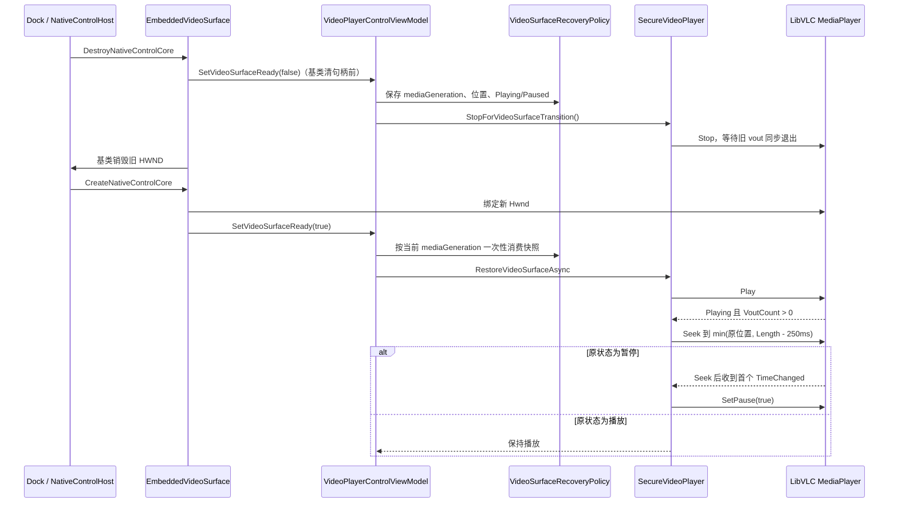
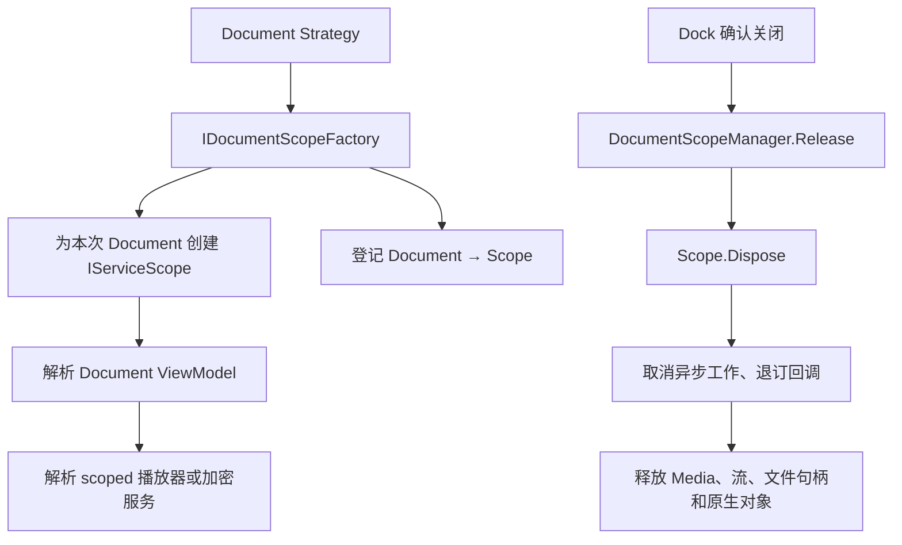

# LibVLC 接入、开发约定与故障排查

本文集中记录 MySmallTools 安全视频子系统在插件宿主、LibVLC、Avalonia NativeControlHost 和 Dock 生命周期之间的集成约束。这些约束来自当前实现和已经修复的问题；删除某个看似多余的顺序、判断或目录规则前，应先确认对应回归测试仍能覆盖真实场景。

## 1. 插件部署与 LibVLC 初始化

### 1.1 部署目录必须自包含

`MySmallTools.csproj` 在构建后把插件部署到宿主输出目录的 `Controls/SmallTools/`：

```text
Controls/SmallTools/
├─ MySmallTools.dll
├─ LibVLCSharp.dll
├─ LibVLCSharp.Avalonia.dll
└─ native/win-x64/libvlc/
   ├─ libvlc.dll
   ├─ libvlccore.dll
   └─ plugins/
```

必须同时部署插件本体、两个托管桥接程序集和完整的 Windows x64 原生树。`VideoLAN.LibVLC.Windows` 使用 `PrivateAssets="all"`，NuGet 原生内容通过 `VlcWindowsX64TargetDir` 重定向到插件私有目录，不应默认散落到宿主输出根目录。

部署 Target 会先删除并重新创建 `Controls/SmallTools/`。这是有意行为：升级 LibVLC 后如果只增量复制，新版本已经删除或改名的旧原生模块可能残留，导致运行时加载到混合版本。

如只需构建而不部署插件，可设置 `SkipPluginDeploy=true`；此时不能把宿主输出当作可直接运行的完整部署包。

### 1.2 初始化顺序不能交换

正确顺序是：

1. 通过 `typeof(LibVlcRuntime).Assembly.Location` 获取实际 `MySmallTools.dll` 目录。
2. 组合绝对路径 `native/win-x64/libvlc`。
3. 验证 Windows x64、`libvlc.dll`、`libvlccore.dll` 和 `plugins/`。
4. 调用 `Core.Initialize(runtimeDirectory)`。
5. 之后才能创建任何 `LibVLC` 或 `MediaPlayer` 实例。

`LibVlcRuntime` 使用双重检查锁，允许多个播放器在不同线程首次调用时仍只初始化一次。它是进程级 Singleton，但保持惰性：仅加载插件不会触发 LibVLC 原生初始化。

禁止回退到以下位置：

- `AppContext.BaseDirectory` 或宿主输出根目录；
- 进程当前工作目录；
- `PATH`；
- 系统安装的 VLC。

回退会让开发机“偶尔可用”，部署机却失败，或者混用不兼容版本后产生难以复现的原生崩溃。当前实现选择快速失败，并在错误信息中包含实际检查的绝对目录。

## 2. 插件扫描必须排除原生目录

宿主会递归扫描插件目录下的 `.dll`。LibVLC 的 `plugins/` 中包含大量原生 DLL；如果把它们交给 `AssemblyLoadContext.LoadFromAssemblyPath`，会产生启动期异常、无意义日志和性能损耗。

`AssemblyLoaderHelper` 的首次扫描和 `PluginLoadContext` 的依赖解析必须采用同一排除规则：目录名为 `native`、`runtimes` 或 `libvlc` 时停止递归。不能只修首次扫描而忘记依赖解析，否则缺少托管依赖时，解析器仍会进入原生树。

回归测试 `NativeDirectoryScanTests.PluginScannerAndResolver_DoNotEnterNativeDirectory` 会在 `native/win-x64/libvlc` 放置一个可加载的托管测试 DLL，并验证扫描器和解析器都不会发现它。

## 3. Media、MediaInput 和文件句柄

`SecureVideoPlayer` 持有当前 `Media` 和 `SeekableStreamMediaInput`。释放顺序必须为：

```text
MediaPlayer.Stop()
→ MediaPlayer.Media = null
→ Media.Dispose()
→ MediaInput.Dispose()
→ SeekableEncryptedVideoStream.Dispose()
→ 文件句柄关闭、明文缓存和派生密钥清零
```

如果先关闭底层流，LibVLC 尚未结束的回调可能继续读取已关闭句柄。每次切换文件或重新加载前都要完整清理旧媒体，以免留下文件锁或让旧流的回调污染新媒体状态。

公开信息更新需要以读写方式打开同一个 `.secvid`。因此“编辑信息”不是单纯的 UI 状态切换：即使视频暂停，也必须先调用 `CleanupMedia`，让 LibVLC 彻底释放文件句柄，再执行原地写入。

## 4. Dock 切换与视频表面恢复

### 4.1 已出现的问题

Dock 切换文档时可能销毁 Avalonia `NativeControlHost` 对应的 HWND，稍后再创建新 HWND。LibVLCSharp.Avalonia 3.9.4 通常只在 `MediaPlayer` 属性变化或控件 `Initialized` 时尝试绑定句柄；这两个时机都可能早于原生句柄真正创建。

历史表现包括：

- 返回标签页后只有黑屏，声音或进度仍继续；
- LibVLC 的 `Hwnd` 保持为零，回退创建独立 Direct3D11 输出窗口；
- 只重新赋值 `Hwnd` 后仍无画面，因为旧 vout 没有完整退出；
- 原来处于暂停状态时，Seek 后立刻暂停，目标帧尚未输出，界面仍停留在黑帧或旧帧。

### 4.2 原生句柄绑定约定

`EmbeddedVideoSurface` 继承 `VideoView` 并覆盖原生控件生命周期：

- `CreateNativeControlCore` 必须先调用基类，等内部平台句柄完成赋值后，再把非零句柄写入 `MediaPlayer.Hwnd`，最后通知表面 Ready。
- `DestroyNativeControlCore` 必须在调用基类、即基类清零 `Hwnd` 之前同步通知表面 Lost。
- Lost 通知不可异步投递；ViewModel 需要在旧 HWND 消失前同步停止 LibVLC，使旧 vout 完整退出。

`VideoPlayerControl` 切换 `DataContext` 时也有严格所有权顺序：先通知旧 ViewModel 失去表面，再切换 `VideoSurface.MediaPlayer`，最后把当前表面状态交给新 ViewModel。这样同一个 HWND 不会同时被两个播放器视为自己的输出目标。

### 4.3 完整恢复时序



不能把恢复缩减为“Pause → 换 Hwnd → Play”，原因是暂停并不保证旧 vout 退出；也不能在暂停恢复时省略首帧等待，否则目标帧可能尚未渲染。恢复位置最多为 `Length - 250 ms`，避免靠近末尾的快照在恢复后立即触发 `EndReached`。

### 4.4 并发与过期保护

恢复逻辑同时使用以下保护：

- **一次性快照**：一个 `VideoSurfaceRecoveryRequest` 只允许消费一次。
- **请求编号**：快速连续丢失表面时，只保留最新 `RequestId`。
- **媒体代次**：切换、加载、清理或释放媒体会推进 `mediaGeneration`；旧媒体请求和已投递 UI 回调直接失效。
- **内部 Stop 计数**：表面切换产生的 `Stopped` 事件不会被误判为用户主动停止。用户 Stop 则会取消恢复快照。
- **取消源**：用户主动播放、暂停、停止、Seek、切换媒体或再次丢失表面会取消旧恢复。
- **5 秒超时**：等待视频输出或暂停场景的目标帧超过 5 秒后停止恢复，并提示用户手动播放。
- **释放检查**：Document Scope 释放后，所有异步恢复和 UI 回调都不得再修改绑定状态。

## 5. Document、DI 与资源所有权

MySmallTools 通过 `IPluginModule` 显式接入宿主容器。托管插件策略使用 `ActivatorUtilities` 注入 `IDocumentScopeFactory`；历史插件仍保留公共无参构造路径，两者不能混为同一种激活方式。



约定如下：

- 每个 Document 必须由 `IDocumentScopeFactory` 创建，禁止从根容器直接解析可释放的 scoped/transient 文档对象。
- 策略只申请某种 Document，不保存 `IServiceScope`；Scope 的真实释放时机由 Dock 和宿主决定。
- `VideoPlayerControlViewModel.Dispose` 只使回调失效、取消恢复、退订事件和停止 UI 定时器，不再次 `Dispose` 注入的 `SecureVideoPlayer`。
- `SecureVideoPlayer.Dispose` 是其独占原生对象和媒体链路的最终所有者。
- `VideoEncryptorViewModel.Dispose` 取消当前加密，不在 UI 线程同步等待任务，避免异步清理返回 UI 上下文时死锁。
- 取消源由正在运行任务的 `finally` 释放；Document 释放路径只交换引用并调用 `Cancel`，避免取消源与任务竞争释放。
- `VideoDecryptorViewModel.Dispose` 遵循相同规则：只取消当前批次并清空密码。当前单文件调用负责删除 partial，已经正式提交的明文文件不回滚。
- 解密队列项只保存候选公开信息、路径和执行状态，绝不复制或持有公共密码。

## 6. UI 与命名约定

### 6.1 Document 标题与视频标题不同

- `Document.Title` 是 Dock 标签页标题，例如“视频文件加密器”或调用方传入的自定义任务标题。
- `VideoTitle`/公开 `Title` 是写入 SECVID03 公开区、供播放器展示的视频标题。
- 清空加密表单或修改视频标题不能改变 Dock `Document.Title`。
- 视频库使用 `SplitView/CompactInline`：展开 340 px，收起后保留 32 px 触发条。`IsLibraryPaneOpen` 只属于当前 Document，不写入全局配置；收起不得清理媒体或改变播放状态。
- 视频库筛选区只改变布局密度；搜索字段仍匹配文件名、公开标题和公开描述，列表第一行显示文件名、第二行以小号字体显示公开标题。
- 批量解密输出名必须通过 `DecryptionOutputPathResolver`。公开原始文件名不可信，不允许直接 `Path.Combine`；正式提交始终使用不覆盖模式。
- 公开标题为空时，播放器回退显示公开区中的原始文件名；公开区不可读时，再回退到当前 `.secvid` 容器文件名。

### 6.2 文件选择器属于 View

系统文件选择器依赖 `TopLevel.StorageProvider`，因此由 View 的点击处理器直接调用，不通过 ViewModel 事件转发。这样 Dock 重建 View 或重复设置 `DataContext` 时不会累计订阅。

异步文件选择处理器应遵守以下规则：

- 防止同一 View 实例重复打开选择器；加密页面使用 `_isFilePickerOpen`。
- 打开对话框前保存发起请求的 ViewModel。
- 对话框返回后只在当前 `DataContext` 仍为发起者时回写，防止 Dock 切换后污染另一文档。
- 加密进行中不允许重新选择输入文件。
- 选择结果必须是本地文件；错误写回当前文档的状态信息。

播放器页面目前同样直接从 View 打开 `.secvid` 选择器；后续调整此处理器时，不得重新引入 ViewModel 事件订阅模式。

### 6.3 用户操作优先于自动恢复

用户主动播放、暂停、停止或拖动进度，表示用户接受并改变当前状态。此时必须取消尚未消费的自动恢复请求，不能让稍晚完成的异步恢复覆盖用户操作。

## 7. 历史问题与解决方案

| 现象 | 根因 | 当前解决方案 | 回归检查 |
| --- | --- | --- | --- |
| 开发机可播放、部署机报找不到 VLC 或原生崩溃 | 从工作目录、PATH 或系统 VLC 加载了错误版本 | 以 `MySmallTools.dll` 为基准定位私有绝对目录；文件不全立即失败 | `LibVlcRuntime_UsesPluginLocalWindowsX64Directory` |
| 宿主启动扫描大量 VLC DLL 并打印 BadImageFormat 类错误 | 递归插件扫描把原生 DLL 当托管程序集 | 扫描和依赖解析统一跳过 `native`、`runtimes`、`libvlc` | `PluginScannerAndResolver_DoNotEnterNativeDirectory` |
| 切换标签页后黑屏或弹出独立视频窗口 | HWND 创建时序竞争，Hwnd 为零；旧 vout 未退出 | 句柄创建后显式绑定，销毁前同步 Stop，新表面完整重建 vout | 表面恢复策略与顺序测试；手工快速切换 |
| 暂停视频切回后仍黑屏 | Seek 后立即 Pause，目标帧尚未输出 | 等待 `TimeChanged` 确认 Seek 后首帧，再暂停 | `SurfaceRecoveryPolicy_RecordsPausedStateForFrameRestoration`、`SurfaceRestoreSequence_PausedModeWaitsForFrameBeforePausing` |
| 快速切换或换视频后恢复到旧位置 | 迟到的恢复任务和 UI 回调没有版本边界 | `RequestId`、`mediaGeneration`、取消源、表面 Ready 状态联合校验 | `SurfaceRecoveryPolicy_MediaGenerationRejectsStaleRequest`、`RapidSurfaceLossKeepsOnlyLatestSnapshot` |
| 内部 Stop 被当成用户停止，恢复快照消失 | 原生 `Stopped` 事件异步到达 | 对表面切换 Stop 计数并单独消费 | `SurfaceRecoveryPolicy_InternalStopPreservesRequest_ButUserStopCancelsIt` |
| 编辑标题时报文件被占用 | 暂停并未释放 LibVLC 的 MediaInput/FileStream | 编辑前完整 `CleanupMedia`，保存后保持媒体未加载 | 手工“播放/暂停 → 编辑 → 保存 → 重新加载” |
| 多开标签页共享播放状态或关闭后资源不释放 | 从根容器解析或手工 `new`/级联释放 | 每 Document 独立 Scope；宿主登记并在确认关闭后统一释放 | `MySmallTools模块注册可通过作用域验证且加密Document彼此独立`、`DocumentScopeManagerTests` |
| 关闭加密页后仍生成文件或遗留半成品 | 后台任务未取消，或直接写正式目标 | Dispose 只发取消；底层使用唯一 partial 文件并在异常路径删除 | `VideoEncryptorDocument_DisposeCancelsEncryptionAndRemovesPartialFile` |
| Dock 标题被视频标题或清空操作修改 | `Document.Title` 与业务标题使用同一属性 | 两类标题完全分离 | `VideoEncryptorDocument_DefaultTitleAndVideoTitle_AreIndependent` |
| 选择文件窗口重复弹出或结果写入另一标签页 | `async void` 可重入，等待期间 DataContext 已变化 | View 级重入锁和发起 ViewModel 身份检查 | 手工连续点击并在对话框期间切换 Dock |

## 8. 故障排查

### 8.1 “LibVLC 原生运行库不完整”

1. 读取异常中的实际检测目录，不要先安装系统 VLC。
2. 确认进程为 Windows x64。
3. 检查 `libvlc.dll`、`libvlccore.dll` 和 `plugins/` 是否都位于 `MySmallTools.dll/native/win-x64/libvlc/`。
4. 重新构建 MySmallTools，确认没有设置 `SkipPluginDeploy=true`。
5. 确认部署目录已被重新创建，没有复制或杀毒软件中断。

### 8.2 密码正确但加载失败

1. 确认输入是受支持的 SECVID03 容器；其他魔数和结构不完整的文件都会被受控拒绝。
2. 区分打开阶段和播放阶段：打开阶段失败通常是结构、固定头、密码或前缀认证问题；播放到特定位置失败通常是对应密文块或 Tag 损坏。
3. 公开信息 CRC 错误不会单独阻止密码验证；若公开信息和播放都失败，应继续检查固定头和物理文件长度。
4. 不要手工修正固定头长度、偏移或保留位；这些字段属于认证数据。

### 8.3 切换 Dock 后黑屏

1. 确认当前输出仍为内嵌 HWND，没有出现独立 Direct3D11 窗口。
2. 确认 `CreateNativeControlCore` 返回非零句柄后设置了 `MediaPlayer.Hwnd`。
3. 确认 Lost 事件发生在基类清零句柄之前，并同步执行 `StopForVideoSurfaceTransition`。
4. 查看状态是否提示“等待视频输出或首帧超时”；恢复超时为 5 秒，失败后应允许手动播放。
5. 对暂停场景确认顺序包含等待 vout、Seek、等待 Seek 后首帧、Pause。
6. 对快速切换确认只消费最新请求，旧请求的媒体代次应失效。

### 8.4 文件无法覆盖、删除或编辑

1. 确认先调用 `CleanupCurrentMedia`，而不是只调用 Pause。
2. 确认释放顺序为 Stop、解除 Media、Dispose Media、Dispose MediaInput。
3. 确认没有第二个 Dock Document 正在播放同一个文件；各 Document 播放器独立，另一个 Scope 仍可能合法持有自己的读取句柄。
4. 使用重复 Open/Read/Dispose 测试验证容器流自身不会遗留句柄。

### 8.5 关闭加密页后存在 `.partial-*`

1. 确认 `VideoEncryptorViewModel.Dispose` 已由 Document Scope 触发。
2. 确认后台任务观察到取消并退出 `Secvid03Encryptor.EncryptAsync`。
3. 检查临时文件删除是否被外部进程阻止。
4. 不要在 UI Dispose 中同步等待任务；这可能造成死锁，并不能替代底层事务清理。

## 9. 维护检查表

### 修改 SECVID03 时

- [ ] 是否保持现有固定偏移、块大小、Tag 长度、KDF 迭代数和 nonce 规则？
- [ ] 若不保持，是否创建了新格式版本而不是静默改变 SECVID03？
- [ ] 所有外部长度在 Slice、分配和偏移计算前是否经过范围及溢出检查？
- [ ] 是否仍先认证后返回明文，并在淘汰、异常和 Dispose 时清零敏感缓冲区？
- [ ] 是否补充顺序读取、跨块 Seek、错误密码、固定头/密文/Tag 篡改和边界测试？

### 修改 LibVLC 或部署时

- [ ] 两个 LibVLCSharp 托管包与原生 LibVLC 版本是否经过一起验证？
- [ ] `Core.Initialize` 是否仍发生在任何 `new LibVLC()` 之前？
- [ ] 插件是否仍能只依赖自身目录运行，没有回退到系统 VLC？
- [ ] 部署是否清理旧原生树，扫描器和解析器是否继续跳过原生目录？

### 修改 Dock 或播放控件时

- [ ] HWND 绑定是否发生在句柄非零之后，Lost 通知是否发生在句柄清除之前？
- [ ] 旧 ViewModel 是否在新 ViewModel 接管同一表面前收到 Lost？
- [ ] 表面恢复是否仍按 Stop → 新 Hwnd → Play → 等待 vout → Seek → 等待首帧（暂停态）→ Pause？
- [ ] 用户操作、媒体切换、快速表面切换和 Document 关闭能否取消或淘汰旧恢复？

### 修改 DI 或关闭逻辑时

- [ ] 每个 Document 是否仍使用独立 Scope？
- [ ] 注入的可释放服务是否只有一个最终所有者，避免重复 Dispose？
- [ ] 已投递 UI 回调是否在对象释放或媒体代次变化后失效？
- [ ] 关闭加密页是否取消任务、删除 partial 文件且不阻塞 UI 线程？
- [ ] 关闭批量解密页是否清空密码、取消当前文件、保留已完成结果并清理当前 partial？

## 10. 能力、代码、测试与文档映射

| 能力或约束 | 生产入口 | 自动化证据 | 权威文档 |
| --- | --- | --- | --- |
| SECVID03 流式加密与事务提交 | `Secvid03Encryptor`、`VideoEncryptorService` | `Secvid03Tests.cs`、`VideoToolStabilityTests.cs` | [格式](secvid03-format.md)、[架构](architecture-design.md) |
| 批量解密、认证、取消与不覆盖 | `Secvid03Decryptor`、`VideoDecryptionService` | `VideoDecryptionTests.cs` | [README](README.md)、[格式](secvid03-format.md) |
| 认证随机读取、Seek 与句柄释放 | `SeekableEncryptedVideoStream` | `Secvid03Tests.cs` | [格式](secvid03-format.md)、[架构](architecture-design.md) |
| 文件夹媒体库扫描和过期结果淘汰 | `VideoLibraryScanner`、`VideoLibraryBrowserViewModel` | `VideoLibraryTests.cs` | [README](README.md)、[架构](architecture-design.md) |
| Dock 表面恢复顺序和用户操作优先 | `VideoSurfaceRestoreSequence`、`VideoSurfaceRecoveryPolicy` | `VideoToolStabilityTests.cs` | 本文第 4 节、[架构](architecture-design.md) |
| 每个 Document 独立 Scope 并在关闭时释放 | `DocumentScopeManager`、各 Document Strategy | `PluginCompatibilityTests.cs`、`DocumentScopeManagerTests.cs` | 本文第 5 节、[架构](architecture-design.md) |
| 私有 LibVLC 目录且不参与插件扫描 | `LibVlcRuntime`、宿主插件扫描器 | `Secvid03Tests.cs`、`NativeDirectoryScanTests.cs` | 本文第 1～2 节 |
| 真实 MP4/WebM 来源和字节完整性 | 不适用，仅为测试资产 | `RealMediaAssetTests.cs` | [真实媒体测试资产](real-media-test-assets.md) |

G0 只证明真实媒体文件可复现、版权边界清晰且字节完整。真实 LibVLC 解码、播放和跨块 Seek 的环境集成回归属于路线图 G3，不在此表中宣称为已完成能力。

建议验证命令：

```powershell
dotnet test MySmallTools.Tests/MySmallTools.Tests.csproj
dotnet test MyAvaloniaManagement.PluginTests/MyAvaloniaManagement.PluginTests.csproj
```

## 11. 关键源码

- [MySmallTools.csproj](../../MySmallTools.csproj)
- [LibVlcRuntime.cs](../../Business/SecretVideoPlayer/LibVlcRuntime.cs)
- [EmbeddedVideoSurface.cs](../../Views/SecretVideoPlayer/EmbeddedVideoSurface.cs)
- [VideoPlayerControlViewModel.cs](../../ViewModels/SecretVideoPlayer/VideoPlayerControlViewModel.cs)
- [VideoSurfaceRestoreSequence.cs](../../Business/SecretVideoPlayer/VideoSurfaceRestoreSequence.cs)
- [MySmallToolsPluginModule.cs](../../Plugin/MySmallToolsPluginModule.cs)
- [Secvid03Decryptor.cs](../../Business/SecretVideoPlayer/Secvid03Decryptor.cs)
- [VideoDecryptionService.cs](../../Business/SecretVideoPlayer/VideoDecryptionService.cs)
- [AssemblyLoaderHelper.cs](../../../MyAvaloniaManagement/Business/Helpers/AssemblyLoaderHelper.cs)
- [DocumentScopeManager.cs](../../../MyAvaloniaManagement/Business/Helpers/DocumentScopeManager.cs)
