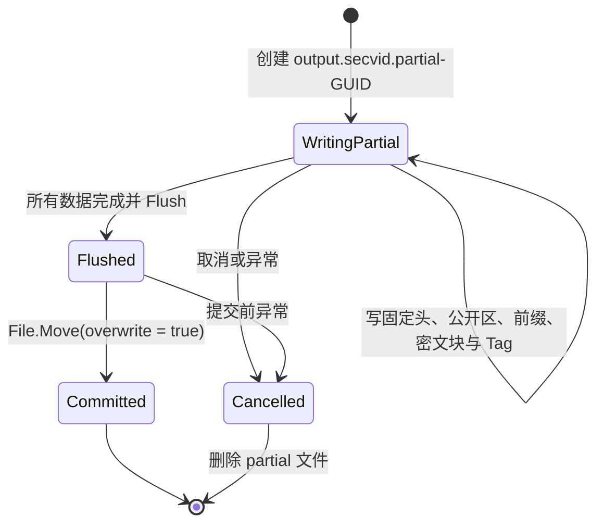
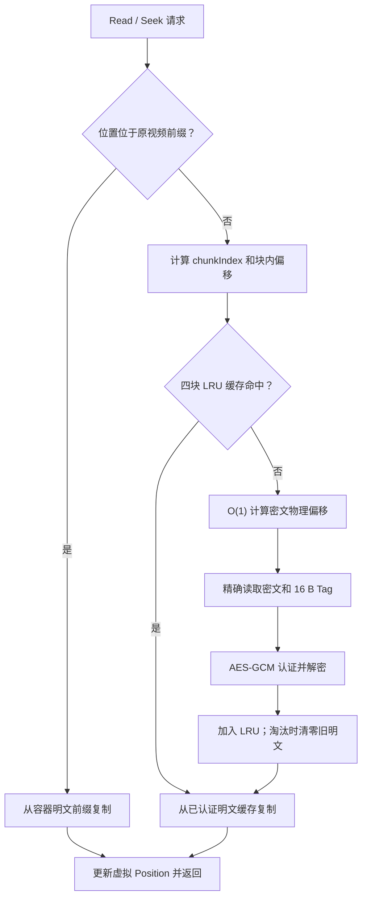

# SECVID03 文件格式与随机读取

## 1. 格式目标

SECVID03 是当前安全视频子系统唯一支持的容器格式。它解决了旧方案需要完整读取或解密视频的问题：视频主体按固定大小独立认证和加密，播放器可直接定位到目标块，只解密解码器实际请求的数据。

格式具有以下性质：

- 使用 PBKDF2-SHA256 从密码派生 256 位密钥。
- 使用 AES-256-GCM 同时提供机密性和完整性验证。
- 每个视频块使用独立 nonce 和 16 字节认证标签，支持 O(1) 计算物理偏移。
- 固定头和原视频前缀受到认证，但前缀以明文保存，便于解码器识别容器。
- 公开标题、描述和原始文件名无需密码即可读取，并可原地更新。
- 打开时验证密码和不可变头；视频块在首次读取时逐块验证。

## 2. 整体磁盘布局

设：

- `H` 为原视频前缀长度，合法范围为 `0..40` 字节。
- `B` 为原视频主体长度，即 `OriginalFileLength - H`。
- `C` 为块大小，固定为 `1,048,576` 字节（1 MiB）。
- `N = ceil(B / C)` 为块数，最大为 `uint.MaxValue`。

```text
物理偏移
0
├─ 256 B        SECVID03 固定头
├─ 65,536 B     公开信息区（PUBMETA1）
├─ H B          原视频前缀（明文，但纳入固定头认证）
├─ 最多 1 MiB   第 0 块密文
├─ 16 B         第 0 块 GCM Tag
├─ 最多 1 MiB   第 1 块密文
├─ 16 B         第 1 块 GCM Tag
│  ...
├─ 最多 1 MiB   第 N-1 块密文
└─ 16 B         第 N-1 块 GCM Tag
```

关键偏移和长度为：

```text
OriginalHeaderOffset = 256 + 65,536 = 65,792
EncryptedDataOffset  = 65,792 + H
PhysicalFileLength   = EncryptedDataOffset + B + N × 16
```

解析器不会信任文件中声明的派生长度和偏移，而是从原始长度、前缀长度、块大小重新计算。非空主体使用 `1 + (B - 1) / C` 计算块数，避免向上取整时的加法溢出；所有偏移和物理长度继续使用 `checked` 算术，拒绝整数溢出、截断和尾随数据。

## 3. 固定头

固定头总长 256 字节，未使用的保留区域必须为零。格式版本发布后，现有偏移和常量不能直接修改，否则旧文件的偏移、nonce 和 AAD 都会失去兼容性。

| 字节范围 | 长度 | 内容 |
| --- | ---: | --- |
| `0..7` | 8 | ASCII 魔数 `SECVID03` |
| `8..11` | 4 | 版本号 `3`，Little Endian |
| `12..15` | 4 | 固定头长度 `256` |
| `16..23` | 8 | 公开区偏移 `256` |
| `24..27` | 4 | 公开区容量 `65,536` |
| `28..31` | 4 | 原视频前缀长度 `H` |
| `32..39` | 8 | 原视频总长度 |
| `40..47` | 8 | 原视频主体长度 `B` |
| `48..55` | 8 | 首个加密块物理偏移 |
| `56..59` | 4 | 块大小 `1,048,576` |
| `60..63` | 4 | GCM Tag 长度 `16` |
| `64..67` | 4 | PBKDF2 迭代次数 `600,000` |
| `68..71` | 4 | 保留，必须全零 |
| `72..87` | 16 | 每文件随机 salt |
| `88..103` | 16 | 每文件随机 `fileId` |
| `104..111` | 8 | 每文件随机 nonce 前缀 |
| `112..115` | 4 | 原扩展名 UTF-8 字节长度 |
| `116..147` | 32 | 原扩展名固定槽位，未用部分必须为零 |
| `148..163` | 16 | 固定头 GCM Tag |
| `164..255` | 92 | 保留，必须全零 |

原扩展名最多占 32 个 UTF-8 字节，原视频前缀最多为 40 字节。解析器先检查版本、固定常量、长度范围、保留区和严格 UTF-8，再重新计算块计数、偏移及精确物理长度；只有结构通过后才读取前缀并执行 PBKDF2，避免畸形长度触发超大分配或高成本密钥派生。

## 4. 密钥、nonce 与 AAD

### 4.1 密钥派生

```text
key = PBKDF2-HMAC-SHA256(
    password,
    salt = fixedHeader[72..87],
    iterations = 600,000,
    outputLength = 32 bytes)
```

密码不会写入容器。加密界面要求密码至少 6 个字符，这是输入校验下限，不应理解为高强度密码保证；实际安全性仍取决于密码熵。

### 4.2 nonce 规则

每个 nonce 为 96 位：

```text
[ 8 字节随机 noncePrefix ][ 4 字节大端计数器 ]
```

- 计数器 `0` 专用于固定头认证。
- 视频块 `i` 使用计数器 `i + 1`。
- 固定头占用计数器 0，视频块依次使用 `1..uint.MaxValue`；解析器限制块数不超过 `uint.MaxValue`，防止同一文件密钥下重复 nonce。

### 4.3 固定头认证

固定头认证使用“空明文 + AAD”生成 Tag。AAD 由以下内容拼接：

1. 完整 256 字节固定头，但把 `148..163` 的 Tag 槽位清零。
2. 以明文保存的原视频前缀。

打开文件时使用相同 AAD 和计数器 `0` 验证 Tag。密码错误、不可变固定头或原视频前缀被修改都会表现为 `UnauthorizedAccessException("密码错误或文件已损坏。")`。文件中不保存可离线直接比较的明文 key hash。

### 4.4 视频块认证

为避免每次随机读取都重新拼接固定头和原视频前缀，先计算：

```text
immutableDigest = SHA256(fixedHeaderAad)
chunkAad = immutableDigest || Int64BigEndian(chunkIndex)
```

块 `i` 使用 `chunkAad`、nonce 计数器 `i + 1` 和独立 16 字节 Tag。块序号进入 AAD，因此密文块不能在同一文件中交换，也不能直接复制到另一文件。认证失败时会清零刚分配的明文缓冲区并抛出 `InvalidDataException`，不会向解码器返回未认证的部分数据。

## 5. 原视频前缀

加密器保留解码器识别容器所需的最小前缀，并在虚拟明文流的偏移 0 返回它。当前检测规则为：

| 格式特征 | 保留长度上限 |
| --- | ---: |
| MP4：偏移 4 为 `ftyp` | 32 字节 |
| AVI：偏移 8 为 `AVI ` | 12 字节 |
| Matroska/WebM：以 `1A 45 DF A3` 开始 | 40 字节 |
| FLV：以 `FLV` 开始 | 9 字节 |
| 其他格式 | 32 字节 |

短文件最多保留实际读取到的字节。前缀虽为明文，但属于固定头 AAD；任何修改都会使密码验证失败。

## 6. 公开信息区

固定头之后的 64 KiB 是无需密码即可访问的公开区：

| 字节范围（相对公开区） | 长度 | 内容 |
| --- | ---: | --- |
| `0..7` | 8 | ASCII 魔数 `PUBMETA1` |
| `8..11` | 4 | 公开区版本 `1` |
| `12..15` | 4 | 记录总长度 |
| `16..19` | 4 | 原始文件名 UTF-8 长度 |
| `20..23` | 4 | 标题 UTF-8 长度 |
| `24..27` | 4 | 描述 UTF-8 长度 |
| `28..31` | 4 | 负载 CRC32 |
| `32..` | 可变 | 文件名、标题、描述的连续 UTF-8 负载 |
| 记录末尾至 64 KiB | 可变 | 零填充；读取器要求全部为零 |

公开区约束如下：

| 字段 | Unicode Rune 上限 | UTF-8 字节上限 |
| --- | ---: | ---: |
| 原始文件名 | 255 | 1,020 |
| 标题 | 200 | 800 |
| 描述 | 10,000 | 40,000 |

计数使用 Unicode 标量值（`Rune`），而不是 UTF-16 `char` 数。例如常见 emoji 在 .NET 字符串中占两个 `char`，但计为一个 Rune。编码器会拒绝未配对代理项；禁止 NUL 和普通控制字符，允许换行、回车和制表符。

### 6.1 安全边界

- 公开区不进入固定头或视频块的 GCM AAD，因此修改公开区不会使视频认证失败。
- CRC32 只检测写入中断或意外损坏，不是消息认证码。攻击者可以修改公开信息后重新计算 CRC。
- 固定头中的原始扩展名和原始视频长度受到 GCM 认证；公开区中的原始文件名不受密码学认证。
- 公开区 CRC 损坏时，界面回退显示容器文件名并提示描述不可读取，但用户仍可输入密码尝试播放。

### 6.2 原地更新顺序

更新标题和描述不会改写原始文件名，也不会移动视频数据：

1. 验证当前固定头和公开记录。
2. 在内存中构造完整的 64 KiB 新公开区，未使用空间保持为零。
3. 先写偏移 32 之后的负载与零填充，`Flush(flushToDisk: true)`。
4. 最后写 32 字节记录头及新 CRC，再次 `Flush(flushToDisk: true)`。

这个顺序提供可检测的提交边界。若进程在步骤 3 后退出，旧头与新负载不匹配，读取端会报告 CRC 错误。

## 7. 加密文件的事务式生成

正式输出不直接边写边暴露：



临时文件与目标文件位于同一目录，成功时使用 `File.Move(..., overwrite: true)` 提交。明文和密文块缓冲区、派生密钥在正常或异常退出时都会尽快清零。关闭加密 Document 会取消当前任务，任务退出路径负责关闭流并删除临时文件。

## 8. 随机读取模型

`SeekableEncryptedVideoStream` 对调用者呈现一个长度和内容都与原视频一致的只读流：



缓存最多保存四个解密块，常见回读和小范围拖动约占 4 MiB 明文缓存，不随视频总大小增长。最后一块可以小于 1 MiB；前面所有块固定为完整块，因此物理偏移可直接计算：

```text
chunkPhysicalOffset = EncryptedDataOffset + chunkIndex × (1 MiB + 16)
```

流支持同步 `Read` 和 `Seek`，不支持写入。LibVLC 通过 `SeekableStreamMediaInput` 调用它；适配器把单次读取限制为最多 1 MiB、检查无符号偏移到 .NET `long` 的转换，并在锁内串行执行 Open/Read/Seek/Close。

## 9. 格式版本边界

- SECVID03 解析器要求魔数、版本、固定常量和物理长度全部匹配，不做宽松猜测；其他魔数统一作为不受支持的格式拒绝。
- 不得通过放宽解析条件或修改 SECVID03 常量来承载新需求。需要改变磁盘布局、KDF、块大小或认证规则时，应设计新的格式版本和独立实施计划。

## 10. 对应实现与测试

- [Secvid03Format.cs](../../Business/SecretVideoPlayer/Container/Secvid03Format.cs)：格式常量、集中布局计算和严格解析。
- [Secvid03Cryptography.cs](../../Business/SecretVideoPlayer/Container/Secvid03Cryptography.cs)：KDF、nonce、AAD 和认证规则。
- [Secvid03Encryptor.cs](../../Business/SecretVideoPlayer/Encryption/Secvid03Encryptor.cs)：流式加密与事务提交。
- [EncryptedVideoContainer.cs](../../Business/SecretVideoPlayer/Container/EncryptedVideoContainer.cs)：公开区读取和原地更新。
- [SeekableEncryptedVideoStream.cs](../../Business/SecretVideoPlayer/Container/SeekableEncryptedVideoStream.cs)：按需认证解密和 LRU 缓存。
- [SeekableStreamMediaInput.cs](../../Business/SecretVideoPlayer/Playback/SeekableStreamMediaInput.cs)：LibVLC 回调适配。
- [Secvid03SecurityTests.cs](../../../MySmallTools.Tests/Secvid03SecurityTests.cs)：边界、逐字节篡改、块归属、资源和路径安全。
- [Secvid03GoldenVectorTests.cs](../../../MySmallTools.Tests/Secvid03GoldenVectorTests.cs)：固定向量、逐字节输出和独立参考验证。
