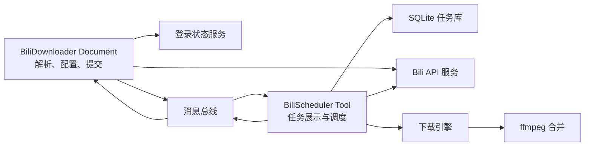
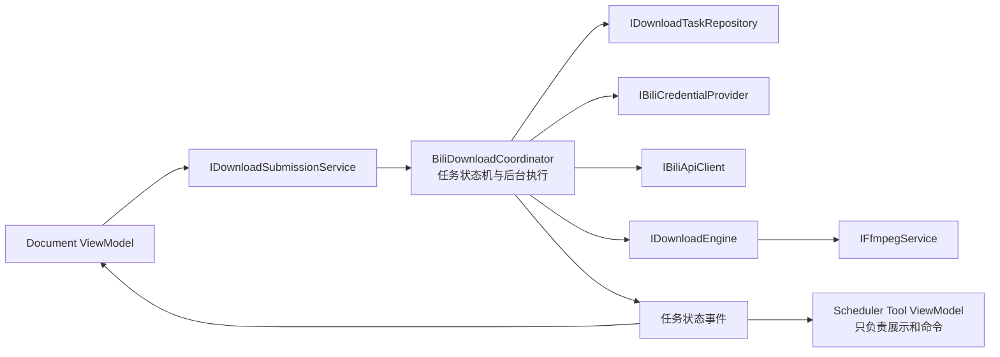

# BiliDownloader 架构改进建议

## 1. 文档目的

本文基于当前 `BiliDownloader` 插件实现，对其结构、生命周期、任务调度、持久化、下载可靠性和开发规范给出改进建议。

本插件的定位是内部自研插件，主要利用插件形式实现关注点分离，不面向第三方插件生态。因此本文不引入热重载、插件沙箱、跨进程 UI 等高复杂度能力。

本次明确采用以下产品约束：

- 应用启动后**不自动开始或恢复下载**。
- 启动时可以初始化数据库、迁移表结构并展示历史任务，但不得自动发起网络请求或启动 ffmpeg。
- 新提交的任务可以按现有交互直接开始，也可以由用户在调度器中显式点击开始。
- 上次退出时仍在执行的任务，重新启动后应显示为“已中断/等待恢复”，由用户主动恢复。
- 插件更新仍采用“关闭应用、替换插件、重新启动”的方式，不实现运行期卸载。

## 2. 当前结构判断

当前插件已经不是单一页面插件，而是一个小型下载子系统：



现有设计中值得保留的部分：

- 使用 Document 负责视频解析、下载配置和任务提交。
- 使用 Tool 展示全局任务，并允许 Document 关闭后任务继续存在。
- 使用 `DocumentId` 对消息进行定向，支持多个下载 Document。
- 使用 SQLite 作为任务事实来源，消息总线只承担实时通知。
- 主 Document 已拆分为登录、解析、配置、列表和重命名等子 ViewModel。
- View 使用设计期 DataContext，运行期实例由宿主和组合 ViewModel 提供。
- 下载文件采用任务独立临时目录，为恢复和清理提供了基础。

当前最主要的结构问题是：`BiliSchedulerToolViewModel` 同时承担了 UI 状态、后台队列、取消控制、SQLite 编排、下载流程和 ffmpeg 管理。Tool ViewModel 已经成为插件实际的后台服务，这会使下载生命周期依赖 UI 生命周期，也降低可测试性。

## 3. 推荐的目标结构

不需要引入完整的 Clean Architecture。建议只增加一个真正的应用服务：`BiliDownloadCoordinator`。



建议的核心职责：

### `BiliDownloadCoordinator`

- 接收新任务。
- 串行维护任务状态转换。
- 拥有当前处理 Task 和 CancellationTokenSource。
- 决定哪些任务可以运行。
- 调用下载引擎和仓储。
- 节流进度持久化。
- 对外发布任务状态快照。
- 应用退出时有序取消并等待当前任务结束。

### `BiliSchedulerToolViewModel`

- 展示任务列表和调度状态。
- 提供开始、暂停、恢复、重试、删除命令。
- 订阅 Coordinator 的状态变化。
- 不直接持有下载循环，不直接创建下载服务。

### `BiliDownloaderViewModel`

- 继续负责页面组合和 Document 持久化。
- 通过提交服务提交任务。
- 不感知 Scheduler Tool 实例。
- 通过任务事件或查询服务获取本 Document 的任务投影。

### 基础设施服务

建议形成以下接口，但不必为了接口而接口；只有需要替换或测试的边界才抽象：

```csharp
public interface IDownloadTaskRepository;
public interface IBiliApiClient;
public interface IBiliCredentialProvider;
public interface IDownloadEngine;
public interface IFfmpegService;
```

## 4. 启动与恢复策略

### 4.1 应用启动

应用启动或插件首次初始化时只允许：

1. 初始化插件服务。
2. 创建或迁移 SQLite 表。
3. 加载历史任务供 Tool 展示。
4. 将异常退出前的运行中状态转换为 `Interrupted`。
5. 检测 ffmpeg 是否可用，但不启动 ffmpeg。

禁止在启动阶段：

- 自动请求 DASH 地址。
- 自动下载视频或音频。
- 自动启动 ffmpeg。
- 因为历史任务存在而调用 `StartProcessing()`。

### 4.2 允许启动下载的入口

只保留两个明确入口：

- 用户在 Document 中提交新任务。
- 用户在 Scheduler Tool 中点击“开始/恢复”。

历史 `Interrupted` 任务不应因为用户提交了另一个新任务而自动混入队列。建议区分：

- `Ready`：允许调度器选取。
- `Interrupted`：必须由用户执行恢复操作后才能变成 `Ready`。
- `Paused`：用户主动暂停，必须主动恢复。

这样可以防止应用重启后意外消耗网络、覆盖文件或继续处理用户已经不需要的任务。

## 5. 任务状态机改进

当前字符串状态粒度不足，无法可靠判断视频或音频是否已经完成。建议使用枚举并集中定义状态转换：

```text
Ready
  -> FetchingMetadata
  -> DownloadingVideo
  -> VideoReady
  -> DownloadingAudio
  -> AudioReady
  -> Merging
  -> Completed

任意运行状态
  -> Paused / Interrupted / Failed / Canceled
```

不要在多个 ViewModel 和 Service 中分别维护字符串映射。状态显示文本应由 Converter 或统一映射器生成。

任务表还应记录：

- 视频临时文件期望长度和实际长度。
- 音频临时文件期望长度和实际长度。
- 视频、音频阶段是否通过完整性验证。
- 最终输出文件路径。
- 最后更新时间。
- 可选的错误类型和可重试标志。

恢复时根据文件事实和数据库状态共同判断，不能只根据 `progress` 或 `video_bytes` 判断。

## 6. 调度与取消改进

当前停止逻辑只取消 CTS，没有等待旧处理循环真正退出，删除任务后立即重新启动可能与旧循环发生竞争。

建议保存当前处理 Task：

```csharp
private Task? _processingTask;
private CancellationTokenSource? _processingCts;
```

停止过程必须异步完成：

```text
发出 Cancel
  -> 等待下载请求停止
  -> 等待文件流关闭
  -> 等待或终止 ffmpeg
  -> 等待处理循环退出
  -> Dispose CTS
  -> 更新任务状态
  -> 允许下一次启动
```

删除正在运行的任务时，应先完成上述停止过程，再删除数据库记录和临时目录。不能取消后立即删除仍被文件流或 ffmpeg 使用的目录。

建议由 Coordinator 串行处理以下控制命令：

- Submit
- Start
- Pause
- Resume
- Retry
- Delete
- Shutdown

这可以使用 `SemaphoreSlim` 实现，无需引入复杂消息队列框架。

## 7. SQLite 一致性与写入节流

当前进度回调使用 fire-and-forget 写 SQLite，然后立即广播消息。这不是真正的“先写库、后通知”，还可能产生并发写入、顺序倒置和未观察异常。

建议将写入分为两类：

### 关键状态写入

以下状态必须等待 SQLite 提交成功后再通知 UI：

- 新任务创建。
- 阶段切换。
- 暂停、恢复、失败、完成。
- 删除任务。
- 输出文件确认完成。

### 高频进度写入

- UI 进度可以约每 100～200ms 更新。
- SQLite 进度建议每 500ms～1s 合并写入。
- 同一 TaskId 始终只保存最新快照。
- 写入失败必须记录日志，不能静默丢弃。
- 应用有序退出时强制 Flush 最后一份进度。

批量插入任务时应使用事务，避免集合提交到一半失败后产生部分任务。

## 8. 分块下载和断点续传

### 8.1 必须校验 Range 响应

发送 Range 后不能只判断 `2xx`。服务器忽略 Range 时可能返回 `200 OK` 和完整文件，继续 Append 或合并 chunk 会损坏输出。

每个 Range 请求必须验证：

- HTTP 状态码为 `206 Partial Content`。
- `Content-Range.From` 与请求起点一致。
- `Content-Range.To` 不超过请求终点。
- 所有 CDN 返回的总文件长度一致。

若返回 `200 OK`：

- 分块模式应换备用 CDN 或降级为单连接完整下载。
- 单连接续传应删除不完整文件后从零开始，不能 Append。

### 8.2 CDN 回退

一个 chunk 失败时，应该使用同一资源的下一个候选 URL 重试，而不是让 `Task.WhenAll` 直接导致整个任务失败。

建议提供有限重试：

- 单个 CDN 最多重试 2～3 次。
- 指数退避并加入少量随机延迟。
- 403/404/签名过期时重新获取 DASH URL。
- 校验不同 CDN 是否指向相同总长度的资源。

### 8.3 断点恢复事实来源

多连接模式实际依赖 `.chunkN` 文件恢复，SQLite 字节数更多是展示信息。建议明确：

- chunk 文件长度是分块恢复事实。
- SQLite 保存阶段和预期长度。
- 已经合并完成的 `video.tmp` 或 `audio.tmp` 应通过长度验证后直接跳过对应下载阶段。
- 重试任务需要明确是“继续断点”还是“删除临时文件后重新下载”。

## 9. ffmpeg 管理

`IFfmpegService.MergeAsync` 应接受 CancellationToken。

取消时应：

1. 停止等待。
2. 尝试 `Kill(entireProcessTree: true)`。
3. 等待进程退出。
4. 清理未完成输出文件。

标准错误输出应在进程运行期间异步读取，不能先等待退出再读取，以避免输出管道阻塞。

其他建议：

- 使用 `ProcessStartInfo.ArgumentList`，避免手工拼接和转义参数。
- ffmpeg 自定义路径保存到设置表。
- 删除硬编码的 `D:\soft\FFMEPG`。
- 默认查找顺序建议为：用户设置、插件工具目录、系统 PATH。
- `ValidatePathAsync` 不应使用同步 `WaitForExit(5000)` 阻塞 UI；应使用可取消的异步等待，超时后终止进程。

## 10. 登录与 Cookie

Cookie 不应复制到每一条下载任务记录中。退出登录后，任务库中仍会残留旧 Cookie。

建议：

- 任务只记录“需要登录凭据”，不保存 Cookie 内容。
- 下载执行时通过 `IBiliCredentialProvider` 获取当前 Cookie。
- 无有效登录态时将任务置为 `WaitingForLogin`，不直接失败。
- 退出登录时暂停需要登录的任务。
- Cookie 通过 `ICredentialProtector` 使用每安装随机 key 的 AES-256-GCM 保护，Windows 与 Linux 共用格式。
- 当前 key 与凭据库同目录，解决明文落盘和篡改检测，不把用户数据目录整体泄露纳入防护范围。
- 登录状态初始化失败后应允许再次尝试，不能提前永久设置 `_initialized = true`。
- 登录窗口增加互斥状态，避免 View 附加和点击页面同时打开多个登录窗口。

## 11. DI 与插件生命周期

本插件仍然不需要热重载，但需要最小插件生命周期：

```csharp
public interface IPluginModule
{
    void ConfigureServices(IServiceCollection services);
    Task InitializeAsync(CancellationToken cancellationToken);
    Task ShutdownAsync(CancellationToken cancellationToken);
}
```

建议服务生命周期：

- `BiliDownloadCoordinator`：Singleton。
- `DownloadTaskStore`：Singleton 或稳定 Repository。
- `BiliLoginStateService`：Singleton，通过 DI 创建，不再自行维护静态 Lazy。
- `HttpClient`：由 `IHttpClientFactory` 或共享 `SocketsHttpHandler` 创建。
- Document ViewModel：Scoped，由宿主每 Document Scope 创建和释放。
- Scheduler Tool ViewModel：Singleton，与宿主创建的唯一 Tool 对应。

`InitializeAsync` 只初始化结构和加载任务，不启动下载；`ShutdownAsync` 负责取消并等待正在运行的任务。

## 12. 平台与部署规范

当前插件同时携带多个平台的 SQLite 原生库，但 ffmpeg 查找、文件过滤和硬编码路径明显偏向 Windows。应明确二选一：

- 如果仅支持 Windows，在项目文档、发布 RID 和 UI 中明确说明。
- 如果支持跨平台，ffmpeg 可执行文件名、默认目录、原生库解析和文件对话框需要按平台适配。

构建部署脚本不应在每个插件 `.csproj` 中复制。建议提取公共：

```text
build/Plugin.Build.targets
```

插件项目只声明：

```xml
<PropertyGroup>
  <IsManagementPlugin>true</IsManagementPlugin>
  <PluginId>BiliDownloader</PluginId>
</PropertyGroup>
```

同时避免每次插件 Build 都完整 Publish 宿主。开发模式可以从宿主输出文件清单或共享依赖清单中排除公共 DLL，正式发布再执行完整校验。

## 13. 日志与错误处理

当前存在较多空 `catch`。内部工具不需要建设复杂观测平台，但至少应使用统一日志接口记录：

- API 请求失败和状态码。
- CDN 切换及重试。
- SQLite 写入失败。
- ffmpeg 命令、退出码和错误摘要。
- 任务状态转换。
- 临时文件清理失败。
- 插件初始化和停止结果。

向用户展示的错误应简洁；完整异常写入日志文件。Cookie、完整请求 Header 和敏感 URL 参数不得写入日志。

## 14. 测试建议

该插件最需要测试的不是 View，而是下载协议和任务状态机。

### 单元测试

- 状态转换是否合法。
- 文件名清理和唯一文件名生成。
- WBI 参数排序与签名。
- 视频/音频流选择策略。
- CDN URL 排序。
- 重命名行数校验。

### HTTP 集成测试

使用本地测试服务器模拟：

- 正常 `206` Range。
- 忽略 Range 返回 `200`。
- 返回错误 Content-Range。
- 下载中断后续传。
- 某个 CDN 失败后切换备用 URL。
- URL 过期后重新获取。

### 状态恢复测试

- 视频下载一半退出。
- 视频完成、音频下载一半退出。
- 音视频完成、合并前退出。
- ffmpeg 合并期间取消。
- 删除正在运行的任务。
- SQLite 写入失败时不发送错误的完成通知。
- 启动应用后历史任务保持 `Interrupted`，不会自动下载。
- 用户点击恢复后才进入 `Ready` 并开始执行。

## 15. 推荐实施顺序

### 第一阶段：正确性

1. 校验 `206` 和 Content-Range。
2. 修复 Stop/Delete/Restart 竞态，保存并等待 `_processingTask`。
3. 为 ffmpeg 增加取消、进程终止和异步错误读取。
4. 修复 SQLite fire-and-forget 写入和进度写入顺序。
5. 启动时将运行中任务转换为 `Interrupted`，取消自动恢复下载。

### 第二阶段：结构

1. 抽取 `BiliDownloadCoordinator`。
2. Scheduler Tool ViewModel 改为纯展示与控制。
3. 集中任务状态机和显示映射。
4. 引入插件级 DI 和 Initialize/Shutdown 生命周期。
5. 把 Cookie 从任务表移除。

### 第三阶段：开发规范

1. 提取公共插件构建 Target。
2. 持久化 ffmpeg 路径并移除机器路径硬编码。
3. 增加核心服务测试。
4. 引入统一日志。
5. 更新设计文档，使其与多连接下载和手动恢复策略一致。

## 16. 完成标准

完成改进后应满足：

- 应用启动后不会自动发起任何历史下载。
- 历史运行中任务显示为“已中断”，用户可以主动恢复。
- Tool 是否显示、隐藏或切换不影响已由用户启动的下载。
- 删除活动任务前能够确定下载和 ffmpeg 已停止。
- Range 被服务器忽略时不会生成损坏文件。
- SQLite 中的关键状态和 UI 通知顺序一致。
- 进度写库不会产生大量并发写入或倒序覆盖。
- 任务库不保存明文 Cookie。
- Document、Tool 和 Coordinator 的职责清晰。
- 插件可以在不启动宿主 UI 的情况下测试任务状态机和下载引擎。

