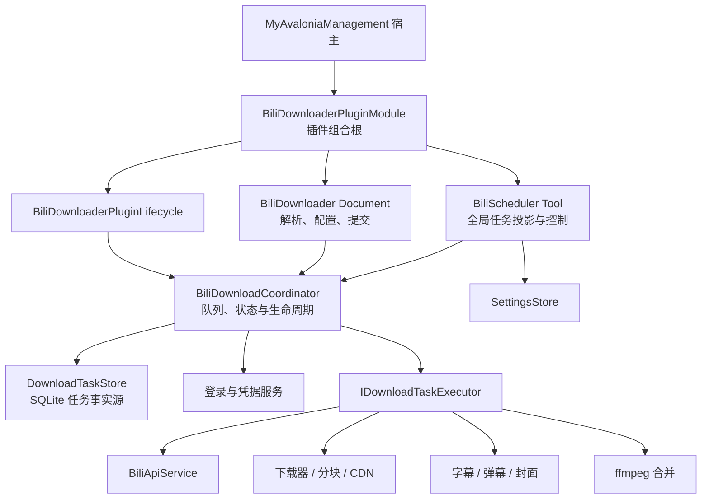
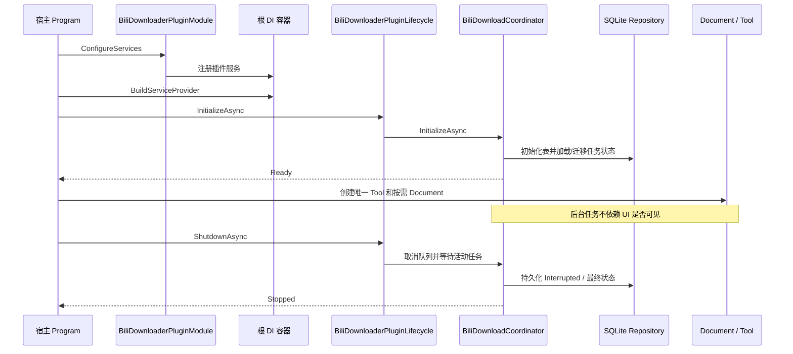
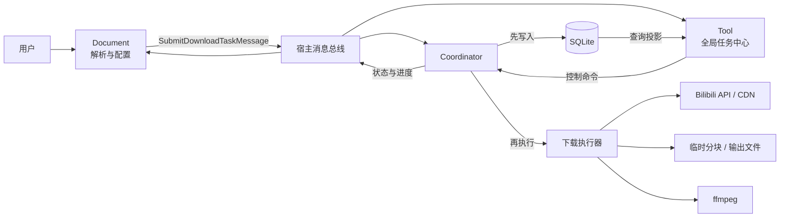
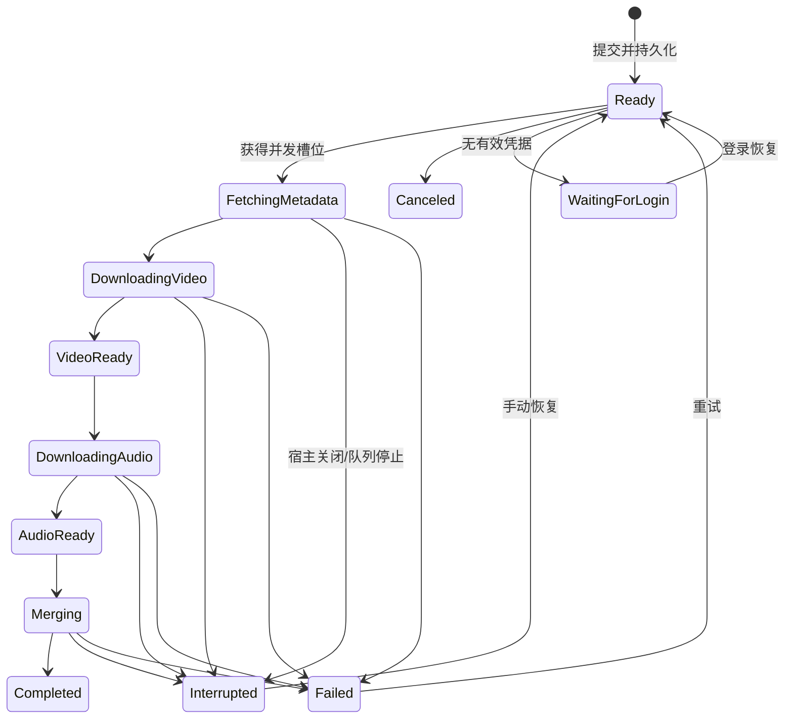
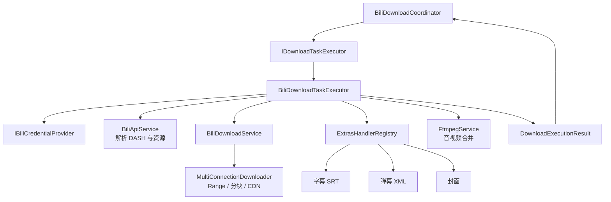

# BiliDownloader 插件架构 Review

> 评审日期：2026-07-22；更新日期：2026-08-11 
> 评审对象：BiliDownloader 插件自身，以及它与 MyAvaloniaManagement 宿主的交互  
> 默认边界：Windows x64、内部可信插件、关闭宿主后替换插件，不要求运行时卸载  
> 关联文档：[产品定义](../PRODUCT.md) · [架构改进建议](../ARCHITECTURE_IMPROVEMENT.md) · [实施路线图](ROADMAP.md) · [G0 验证记录](G0-BASELINE-TEST-LIFECYCLE.md) · [宿主—插件架构评审](../../../../docs/host-plugin-architecture-review.md)

## 1. 总体结论：它已经是一个下载子系统

**[架构判断]** BiliDownloader 不是一个只负责输入 URL 和显示进度的页面插件。它已经具备一个小型下载子系统的主要组成：

- 下载工作台 `Document`：登录、解析、选择、配置、重命名和任务提交；
- 下载任务中心 `Tool`：展示全局任务并提供调度命令；
- 插件级 `BiliDownloadCoordinator`：任务状态、并发队列、恢复和关闭协调；
- SQLite：任务、设置和 Cookie 持久化；
- 下载执行层：API、DASH 下载、多连接分块、附加资源和 ffmpeg 合并；
- 宿主托管生命周期：启动初始化和退出清理。

一句话定义：

> **一个嵌入 Avalonia Dock 宿主的、以 SQLite 为任务事实源、以 Coordinator 为运行内核的 Bilibili 下载工作台。**

当前成熟阶段可概括为：**下载内核基本可用，G0 架构基线已经完成，产品级安全、单任务控制、恢复和任务管理仍在建设中。** 这与 [`PRODUCT.md`](../PRODUCT.md#L54) 的产品阶段判断一致。

### 1.1 插件内部结构

**[代码事实]** 模块将仓储、登录服务、API、执行器、Coordinator 和 Tool 注册为插件级 singleton，将主 Document ViewModel 注册为 scoped，并注册唯一的 `IPluginLifecycle`。参见 [`BiliDownloaderPluginModule.cs`](../Plugin/BiliDownloaderPluginModule.cs#L19)。

## 2. 它如何接入宿主

### 2.1 宿主启动与插件生命周期

**[代码事实]** `BiliDownloaderPluginLifecycle` 只代理 Coordinator 的初始化和关闭，避免启动时创建 Tool/Document 或依赖视觉树。参见 [`BiliDownloaderPluginModule.cs`](../Plugin/BiliDownloaderPluginModule.cs#L53)。

**[代码事实]** Coordinator 的初始化和关闭是幂等的；关闭时取消处理队列、等待活动任务并注销共享消息总线。参见 [`BiliDownloadCoordinator.cs`](../Services/Download/BiliDownloadCoordinator.cs)。

**[架构判断]** 这是当前插件最成熟、最有价值的一次结构调整：下载任务的存活不再等价于某个 Tool 或 Document 是否打开。

### 2.2 与宿主共享和不共享的内容

| 内容 | 所有者 | 当前方式 |
| --- | --- | --- |
| Dock、窗口和应用退出 | 宿主 | 插件只贡献 Document/Tool |
| 根 DI 容器 | 宿主 | 插件通过 `IPluginModule` 注册自身服务 |
| 消息总线 | 宿主 | 插件复用 `IMessengerService`，不创建第二个实例 |
| 下载任务、设置、登录状态 | BiliDownloader | 插件级 singleton 与 SQLite |
| Document 实例 | 宿主创建，插件实现 | `IDocumentScopeFactory` 创建 scoped ViewModel，关闭后由宿主释放 |
| Tool 实例 | 宿主创建一次，插件实现 | singleton ViewModel，隐藏后恢复同一实例 |
| 后台下载生命周期 | 插件实现，宿主触发 | `IPluginLifecycle` → Coordinator |

**[已实现]** `BiliDownloaderDocumentStrategy` 只依赖宿主 `IDocumentScopeFactory`，每次创建独立 scoped `BiliDownloaderViewModel`；Dock 确认关闭后由宿主释放 Scope。仓储、Coordinator 和 Tool 仍是插件级 singleton，因此关闭 Document 不会终止已经提交的后台下载任务。参见 [`BiliDownloaderDocumentStrategy.cs`](../Create/BiliDownloaderDocumentStrategy.cs#L18)。

## 3. Document、Tool 和 Coordinator 的职责

### 3.1 Document：下载方案工作台

Document 面向“这次准备下载什么”：

- 登录入口与状态展示；
- BV、AV、b23.tv、EP、SS 等 URL 解析；
- 分集选择、质量配置、附加资源与输出目录；
- 重命名和分组；
- 生成带 `SourceDocumentId` 的提交消息；
- 保存和恢复当前下载方案。

Document 不应负责：

- 长期维护全局下载队列；
- 因标签页关闭而停止已提交任务；
- 持有全局 CancellationTokenSource；
- 直接决定宿主或插件退出流程。

### 3.2 Tool：全局任务投影

Tool 面向“所有下载任务现在怎么样”：

- 展示 SQLite/Coordinator 中的全局任务；
- 启动或停止处理；
- 重试、恢复、删除和打开结果；
- 展示并发设置与 ffmpeg 状态；
- 隐藏后下载继续，恢复后重新投影任务状态。

Tool 不应成为真正的下载引擎。当前 `BiliSchedulerToolViewModel` 已经把核心编排移交给 Coordinator，这是正确方向。

### 3.3 Coordinator：插件运行内核

Coordinator 面向“任务如何可靠地从提交走到完成”：

- 接收任务提交；
- 先持久化，再进入执行队列；
- 管理并发槽位和活动任务；
- 调用可替换的 `IDownloadTaskExecutor`；
- 更新阶段、进度、失败和恢复状态；
- 向 Document/Tool 广播状态；
- 宿主退出时停止并等待后台工作。

### 3.4 职责与数据流

**[代码事实]** 提交消息包含 Document ID、媒体项、清晰度、输出目录和附加资源配置；Coordinator 测试验证了“先持久化再执行”。参见 [`SubmitDownloadTaskMessage.cs`](../Messages/SubmitDownloadTaskMessage.cs) 和 [`BiliDownloadCoordinatorTests.cs`](../../BiliDownloader.Tests/BiliDownloadCoordinatorTests.cs#L44)。

**[架构判断]** 当前消息名称仍写作 `Document -> Tool`，实际接收者已经是 Coordinator。应更新概念和注释，避免新代码再次把 Tool 当作后台服务。

## 4. 下载任务生命周期

### 4.1 当前状态机

**[代码事实]** 状态已从散落字符串集中为 `DownloadTaskStatus` 枚举，并保留 SQLite 旧字符串映射。参见 [`DownloadTaskStatus.cs`](../Models/DownloadTaskStatus.cs)。

**[代码事实]** 初始化时，历史运行中状态被迁移为 `Interrupted`，不会自动开始下载；用户明确提交或恢复后才执行。这一行为已有离线测试。参见 [`BiliDownloadCoordinatorTests.cs`](../../BiliDownloader.Tests/BiliDownloadCoordinatorTests.cs#L8)。

### 4.2 当前状态机仍未闭环的部分

- `Paused`、`Canceled`、`WaitingForLogin` 已进入枚举，但产品级单任务暂停/继续和等待登录闭环尚未完整实现；
- 当前停止处理仍偏向队列级控制，不能替代独立任务控制；
- 任务删除、停止、重试之间仍需要更严格的竞争条件定义；
- Range、临时分块和 SQLite 字节进度的恢复权威性尚未统一；
- 进度节流、最终 flush 和异常退出后的完整性校验仍属于后续 G2/G3 工作。

**[架构判断]** 枚举存在不等于状态能力已完成。只有命令、持久化迁移、执行器取消、UI 投影和恢复测试同时完成，某个状态才算产品能力。

## 5. 持久化与事实源

插件当前有三类持久化数据：

| 数据 | 存储 | 语义 |
| --- | --- | --- |
| 下载任务 | `download_tasks` SQLite | 全局任务事实源，Document 关闭后仍存在 |
| 插件设置 | `settings` SQLite | 并发、路径等插件级配置 |
| 登录 Cookie | `bili_cookies.db` | 当前登录凭据，现阶段明文存储 |
| Document 保存文件 | 宿主统一 JSON 外壳 | 某个 Document 的下载方案，而不是全局任务库 |

**[代码事实]** `DownloadTaskStore` 使用 WAL 和 `synchronous=NORMAL`，包含一系列兼容式 `ALTER TABLE`，并保留已废弃 Cookie 列读取/写入。参见 [`DownloadTaskStore.cs`](../Services/Persistence/DownloadTaskStore.cs#L37)。

**[代码事实]** `BiliCookieStore` 直接把 Cookie 值写入用户 AppData 下的 SQLite，没有加密。参见 [`BiliCookieStore.cs`](../Services/Auth/BiliCookieStore.cs#L8)。

**[安全结论]** G1 是当前最高优先级之一：Cookie 必须迁移到 DPAPI 或等价的 Windows 用户级保护；任务消息、任务表、日志和导出内容不应再包含 Cookie 或带签名 URL。

**[概念边界]** SQLite 是“已经提交的下载任务事实源”；Document 保存文件是“用户可再次打开和编辑的下载方案”。两者不能互相替代，也不应在恢复时重复提交同一批任务。

### 5.1 P1-G4：Document V3 持久化边界

**[已实现]** `IBiliDownloaderDocumentStateMapper` 集中负责版本识别、V1/V2 单向迁移、V3 安全校验和宿主保存信封。`BiliDownloaderViewModel` 只采集与应用不可变快照，不再自行解释 JSON 版本；生产 DI 使用无状态单例映射器，测试可替换该窄接口。

**[已实现]** 来源通过 `SourceDescriptorSaveData` 白名单 DTO 保存，不序列化 Provider 或任意参数字典。筛选、轻量增量基线和完整 P1 输出配置分别拥有稳定 DTO/值对象；页面、游标链、跨页选择和任务状态明确排除。

**[已实现]** 来源工作流具有专用离线恢复入口：加载只挂载描述符、筛选和空浏览层级，随后按 `DocumentId` 查询 SQLite 投影。缺失 Provider 时保留原始白名单 DTO并显示只读摘要，用户仍可另存。

**[已实现]** 未知未来主版本实现宿主通用 `IDocumentSavePathPolicy`，强制选择新路径；损坏 V3 抛出稳定 `DocumentLoadException`，宿主显示错误但不创建标签。创建 JSON 不再提前清除 `IsModified`，只有宿主写盘成功通知后才清除。

详细字段、默认值和迁移表见 [P1-G4 Document V3 与可复用方案](P1-G4-DOCUMENT-V3-REUSABLE-SCHEMES.md)。

## 6. 下载执行边界

**[已实现]** 把外部副作用集中在 `IDownloadTaskExecutor` 之后，使 Coordinator 可以使用内存仓储、假凭据和假执行器进行完全离线测试。参见 [`IDownloadTaskExecutor.cs`](../Services/Download/IDownloadTaskExecutor.cs) 和 [`BiliDownloaderModuleTests.cs`](../../BiliDownloader.Tests/BiliDownloaderModuleTests.cs)。

**[已实现]** G7 将 ffmpeg 边界收窄为运行时定位、包安装和媒体合并三项职责；安装 Facade 使用固定供应链清单、安全解压、进程探测及原子活动指针，启动阶段只做本地探测。参见 [`FfmpegService.cs`](../Services/Infrastructure/FfmpegService.cs)、[`FfmpegPackageInstaller.cs`](../Services/Infrastructure/FfmpegPackageInstaller.cs) 和 [`G7-FFMPEG-ERROR-ACTION-ENTRY.md`](G7-FFMPEG-ERROR-ACTION-ENTRY.md)。

**[已实现]** 媒体完成校验后、合并前由 Coordinator 持久化检查点；`IMediaMergeRetryExecutor` 能在不重新请求 DASH 和主媒体的前提下仅重试合并。持久化错误由统一展示策略映射为十类摘要与有限行动，UI 不再直接展示长技术异常。

**[不成熟点]** `BiliDownloadTaskExecutor` 仍保留从旧任务 Cookie 回退的兼容路径；这是迁移代码，不应被当作目标设计。参见 [`BiliDownloadTaskExecutor.cs`](../Services/Download/BiliDownloadTaskExecutor.cs#L80)。

## 7. 能力成熟度盘点

| 产品/架构能力 | 状态 | 当前评价 |
| --- | --- | --- |
| BV、AV、普通视频、b23.tv 解析 | 已实现 | 主下载入口可用 |
| EP、SS 番剧解析 | 已实现 | 按当前账号合法权限获取 |
| 分集、质量、批量重命名 | 已实现 | 尚无完整命名模板体系 |
| 字幕、弹幕、封面 | 已实现 | 已拆为 Extras Handler |
| DASH 下载与 MP4 合并 | 已实现 | 支持可信媒体检查点和仅合并重试 |
| 多连接分块和 CDN 回退 | 已实现 | 仍需加强协议级完整性校验 |
| SQLite 任务事实源 | 已实现 | 生命周期和全局投影基础已经形成 |
| 宿主托管插件生命周期 | 已实现 | G0 核心成果 |
| Coordinator 可替换执行边界 | 已实现 | 支持离线测试 |
| Document/Tool/后台服务分层 | 已实现 | Document 使用宿主 Scope，Tool 与后台服务保持插件级 singleton |
| 状态机 | 部分成熟 | 枚举与映射已形成，若干状态缺完整命令闭环 |
| 断点续传 | 部分成熟 | 已有分块文件基础，恢复校验仍需 G3 收口 |
| 错误分类和行动入口 | 已实现 | 十类错误在任务卡片、紧凑菜单和提交预检中提供结构化行动 |
| ffmpeg 管理 | 已实现 | Windows x64 固定版本安装/修复、原子回滚、重新检测与自定义路径均已闭环 |
| Cookie 安全 | 未成熟 | SQLite 明文、旧任务字段仍兼容，G1 必须优先 |
| 单任务暂停/继续/取消 | 未完成 | G2 |
| 批量操作、筛选和虚拟化 | 未完成 | G4 |
| 下载预设与命名模板 | 未完成 | G5 |
| 文件冲突与磁盘预检 | 未完成 | G6 |
| P0 自动化与产品验收 | 未完成 | G8 |
| UP、收藏夹、稍后再看、历史 | 已实现 | P1-G1 统一 Provider、分页与选择工作流 |
| 追番、追剧、订阅合集 | 已实现 | P1-G2 层级 Provider、权限策略与可选解析端口 |
| 课程 | 部分实现 | P1-G2 只读发现与浏览，不提供下载解析能力 |
| MKV、仅音频、主动编码选择 | 未实现 | P1 |

详细产品宣称应以 [`PRODUCT.md` 当前能力表](../PRODUCT.md#L439) 为准，而不是只根据类名或已有枚举推断。

## 8. 主要风险与设计债务

### 8.1 P0 级风险

1. **凭据明文存储**：Cookie 数据库与任务兼容字段仍可能保存敏感信息。
2. **单任务控制不足**：队列级停止会影响其他活动任务，不能满足高频任务管理。
3. **恢复事实不统一**：SQLite 字节数、分块文件和最终文件之间需要明确权威顺序。
4. **文件冲突处理不足**：覆盖、跳过、续传、自动改名和批量确认需要统一预检。

### 8.2 工程性风险

1. 插件 `.csproj` 自己 publish 宿主并按文件名做差集，构建慢且与其他插件部署规则重复。
2. 插件与宿主共享公共程序集版本依赖部署约定，缺少 manifest 和 Host API 兼容检查。
3. 消息总线是全局共享通道，插件消息缺少正式命名空间、版本和诊断。
4. SQLite 迁移是逐列兼容脚本，缺少明确 schema version 和事务化迁移历史。
5. 部分静态基础设施难以替换，扩大了测试盲区。

### 8.3 不属于当前目标的能力

- 运行期卸载或热更新 BiliDownloader；
- 对 BiliDownloader 进行安全沙箱隔离；
- 跨进程组合 Avalonia UI；
- 自动绕过付费、会员、地区或账号权限；
- 在 P0 中插入新的内容源和输出格式。

## 9. 建议演进顺序

### G1：先解决凭据与数据安全

- 用 DPAPI 保护 Cookie；
- 迁移已有明文数据库并提供失败回退/重新登录；
- 删除提交消息和任务模型中的 Cookie；
- 清理 SQLite 旧 Cookie 列；
- 对日志、错误和导出数据做敏感值过滤。

### G2：建立真正的单任务控制

- 每个活动任务拥有独立取消控制；
- 明确定义暂停、继续、取消、重试、删除的合法状态转换；
- 队列停止不误伤已经单独控制的其他任务；
- 用并发和竞争测试覆盖命令冲突。

### G3：闭合持久化与恢复

- 明确分块文件、SQLite 进度和目标文件的恢复权威顺序；
- 校验 Range、长度、临时文件和最终输出；
- 保证最终进度 flush；
- 处理中断、过期 DASH URL 和磁盘内容漂移。

### G4–G7：把内核能力产品化

- G4：筛选、排序、虚拟化、多选和批量命令；
- G5：下载预设、变量命名模板和 Document V2；
- G6：文件冲突、磁盘空间和提交预检；
- G7：ffmpeg 安装/修复与错误行动入口（已完成，详见 [`G7-FFMPEG-ERROR-ACTION-ENTRY.md`](G7-FFMPEG-ERROR-ACTION-ENTRY.md)）。

### G8：用真实验收结束 P0

- 增加真实 SQLite、临时目录、取消恢复和文件冲突集成测试；
- 验证多 Document、Tool 隐藏、宿主退出和重新启动；
- 更新 PRODUCT 当前能力表，只宣称已经通过验收的功能。

## 10. 测试现状与建议矩阵

截至 G7 完成时，`BiliDownloader.Tests` 共有 384 项测试通过；其中 G7 独立测试覆盖可信安装、失败回滚、安全 ZIP、运行时探测、检查点、仅合并重试、十类错误行动和目录事务。早期评审基线的核心覆盖仍包括：

- 模块服务生命周期和宿主消息服务复用；
- Coordinator 初始化幂等；
- 运行中任务迁移为 Interrupted；
- 加载历史任务不自动执行；
- 先持久化再执行；
- 执行失败持久化；
- 宿主关闭取消、等待并保存中断状态。

建议下一批测试按风险排序：

| 优先级 | 场景 |
| --- | --- |
| P0 | 明文 Cookie 迁移、DPAPI 失败、日志脱敏 |
| P0 | 两个并发任务中只暂停/取消一个 |
| P0 | 关闭宿主时多活动任务全部等待并正确落库 |
| P0 | 临时分块不完整、长度不符、DASH URL 过期后的恢复 |
| P0 | 删除、重试、停止并发触发时不产生幽灵任务 |
| P1 | Document 多开、关闭后任务继续、重新打开后定向投影 |
| P1 | Tool 隐藏/恢复不重复注册消息或创建 Coordinator |
| P1 | 真实 SQLite schema 从旧版本迁移 |
| 已覆盖 | ffmpeg 缺失、不可执行、供应链校验、合并失败和临时文件保留 |

## 11. 最终评价

BiliDownloader 当前最值得肯定的不是已经支持多少 URL，而是它已经形成了正确的长期结构：

> **Document 负责准备任务，Tool 负责观察和控制，Coordinator 负责事实与执行，宿主负责插件生命周期。**

G0 已经把下载后台从 UI 生命周期中抽离，并建立了可以离线测试的执行边界。这说明插件已经从“功能堆在 ViewModel 中”进入“有明确运行内核”的阶段。

接下来不应急于增加更多内容源。最高价值的工作依次是：凭据安全、单任务控制、恢复闭环、任务中心产品化、文件预检和真实验收。同时让插件部署、兼容性和诊断逐步交给宿主平台。

完成这些工作后，BiliDownloader 才会从“能下载的视频插件”成为“可以长期、高频、可恢复使用的下载子系统”。
## 12. P1-G0 内容源边界补充

P1-G0 在原有 API 与 Document 解析界面之间增加统一内容源边界：`VideoParseViewModel` 只通过 `IContentSourceProviderRegistry` 选择来源策略，当前 `DirectLinkProvider` 负责 BV、AV、b23.tv、EP、SS 和 MD 的规范化与展开。Provider 只依赖窄接口 `IBiliContentSourceApi` 和凭据读取接口，不引用 UI、Coordinator、SQLite 或 Document。

分页状态由会话级 `ContentPageAccumulator` 管理；它按 `ContentItemKey` 去重，并在游标不前进且没有新增项目时终止协议。解析后的跨来源媒体身份使用 `MediaUnitKey(Aid, Cid)`，不再混用来源项身份或随机任务 ID。

这一边界采用 Strategy、Registry、Adapter 和分页 Guard，均对应明确的变化点；后续来源通过注册新的 Provider 扩展，不修改当前 ViewModel 的来源分支。

## 13. P1-G8 高规格媒体边界补充

P1-G8 没有把 HDR、杜比或 FLAC 判断继续堆入下载编排，而是拆成四个单一职责边界：API 映射只生成结构化证据；`MediaStreamSelectionPolicy` 以纯函数执行层级与编码选择；`OutputArtifactPolicy` 统一维护容器保真矩阵；`IMediaOutputVerifier` 在原子发布前解释 ffprobe 事实。工作区的批量探测另由 `IMediaCapabilityInspectionService` 负责，并且只缓存脱敏能力快照。

数据流采用 Requested / Expected / Actual 三阶段事实，避免 Auto 结果冒充用户显式要求，也避免 API 声明在未验证时冒充实际成品。任务快照 v2、`rf2:` 和 SQLite 的 Unknown/None 区分共同保证旧数据不会被当前默认值回填。该结构满足 SRP、OCP、ISP 与 DIP；策略模式只用于确实存在替换与组合规则的位置，未为简单 DTO 映射引入额外抽象。

## 14. P1-G9 字幕、软字幕与弹幕边界补充

P1-G9 将附加资源拆为目录发现、内容获取、cue 规范化、格式策略、媒体封装、轨道验证和失败重试七类窄边界。处理器只编排这些依赖，不解释平台 JSON、不拼接 ffmpeg 参数，也不直接访问 SQLite。字幕和弹幕格式采用 Strategy + Registry；其余只有单一实现的流程使用普通依赖倒置，避免为了模式而模式。

主媒体与附加资源继续使用不同事实链：`RenditionFingerprint` 只描述媒体输出，`ExtrasExecutionSummary` 使用版本化逐项键描述语言、格式、交付和失败分类。软封装由 muxer 生成候选文件，ffprobe 证明 codec、语言、标题与精确轨数后才原子替换；失败时可信无字幕主文件保持不变。Coordinator 的附加资源重试只接受已完成且主文件存在的任务，并以任务级互斥保证不会并发重建同一文件。

Document V3 只保存结构化意图，字幕目录是用户点击检测后产生的会话缓存，恢复文档不联网。SQLite 和安全历史导出只保存配置与结果元数据，禁止保存正文、Cookie、Header 或下载 URL。详细兼容矩阵、迁移和验收证据见 [`P1-G9-SUBTITLE-DANMAKU-ENHANCEMENT.md`](P1-G9-SUBTITLE-DANMAKU-ENHANCEMENT.md)。
