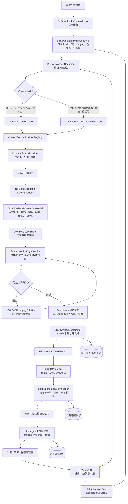
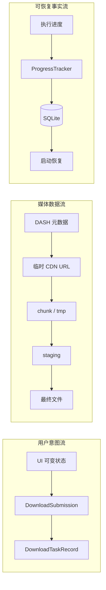

# 01. 宏观架构与完整链路

## 一张图串起整个插件

## 全流程分成八个阶段

### 1. 插件装配

`BiliDownloaderPluginModule` 是组合根。它把仓储、API、Provider、预检策略、执行器、调度器、登录服务、ViewModel 等注册到宿主 DI 容器。这里决定“某个接口在生产环境由谁实现”，而不是执行业务。

`BiliDownloaderPluginLifecycle` 管理插件级生命周期：

1. 初始化本地目录和 SQLite。
2. 载入 ffmpeg 配置并做本地探测。
3. 恢复保存的登录会话。
4. 初始化协调器，将异常退出前的运行中任务转为 `Interrupted` 并校准断点字节。
5. 启动非阻塞的登录态后台验证。

关闭时先停登录验证，再让 Coordinator 有序取消、等待并刷新进度。

### 2. 创建编辑界面

`BiliDownloaderDocumentStrategy` 每次创建新的 `BiliDownloaderViewModel`，所以各个下载计划的输入、选择和配置互相独立。`BiliSchedulerToolStrategy` 返回单例 `BiliSchedulerToolViewModel`，因此全局只有一个任务观察和控制面。

Document 有两种创建意图：

- `quick-url`：直接粘贴 URL 或 ID。
- `personal-source`：浏览个人/订阅内容来源。

两条入口最终都汇聚成 `VideoParseResult`，后面的配置和提交逻辑不再关心来源类型。

### 3. 解析内容

快速 URL 路径的核心顺序是：

1. `DirectLinkProvider.NormalizeAsync` 展开短链并提取稳定 ID。
2. `GetPageAsync` 把直接链接表达成统一的“唯一根项目”。
3. `ResolveItemAsync` 调用普通视频或番剧 API，得到 `BiliVideoCollection`。
4. `IBiliMediaProbe.GetDashResultAsync` 探测首项可用画质和音频。
5. `DownloadWorkspaceViewModel.ApplyParseResult` 更新列表和下载配置。

个人来源则先分页浏览、筛选和选择，再由解析 Provider 转成一个或多个集合，最后通过 `VideoParseResultFactory` 汇总为同一种结果。

### 4. 固化提交意图

用户点击下载后，`VideoListViewModel` 不把可变的 UI 对象交给后台，而是：

- 渲染命名模板，确定最终标题。
- 把选中项转为 `DownloadSubmissionItem`。
- 把画质、编码、容器、输出模式、冲突策略、字幕与弹幕配置转为 `DownloadProfileSnapshot`。
- 组成不可变 `DownloadSubmission`。

此后修改 Document 不会改变已经提交的任务。

### 5. 预检与原子提交

`SubmissionPreflightService` 先返回结构化报告，不直接写任务：

- 输出模式与容器是否合法。
- ffmpeg 是否就绪、是否支持目标封装。
- 每个媒体的 DASH 流是否真实可选。
- 输出目录能否创建并写入。
- 输出路径和附加资源是否冲突。
- 是跳过、覆盖、校验续传还是自动编号。
- 峰值磁盘空间是否足够。
- 同一媒体输出版本是否重复。
- 增量比较结果是否仍然有效。

用户确认后，Coordinator 在唯一命令锁内重新预检并比较指纹。只有事实未变化，才在 SQLite 中创建任务并保留输出路径。这样解决“检查后、写入前，另一个 Document 抢先占用路径”的竞态。

### 6. 后台调度

`BiliDownloadCoordinator` 是任务事实和运行授权的编排者：

- 查询 SQLite 中的 `Ready` 任务。
- 按 1～5 个并发槽启动任务。
- 为每个任务创建 `TaskRuntimeContext`，隔离暂停与取消。
- 把执行回调交给 `DownloadProgressTracker`。
- 在完成、失败、登录失效、空间不足和取消时写入不同终态。

Document 可以关闭，但任务仍由插件级 Coordinator 继续执行。

### 7. 下载与发布

执行器重新获取 DASH，避免使用解析时已经过期的签名 URL。`MediaStreamSelectionPolicy` 根据已固化配置选择流：

- 显式选择不可用时返回失败，不静默降级。
- 自动模式按兼容顺序选择视频编码和高规格层级。
- 输出容器、媒体模式和实际编码共同决定扩展名。

`MultiConnectionDownloader` 使用 HTTP Range 分块或单连接续传。每一段都验证状态码、`Content-Range`、`Content-Length` 和最终字节数。验证通过后，音视频临时文件进入检查点，再由 ffmpeg 封装到同目录 staging 文件。需要高规格证明时用 ffprobe 验证，最后才原子移动为正式文件。

### 8. 附加资源与反馈

主媒体发布后，`BiliDownloadTaskExecutor` 按固定顺序执行封面、字幕、弹幕处理器。某个 Extras 失败会写入结构化摘要，但不会推翻已经成功的主媒体。任务中心可以只重试失败的 Extras。

进度通过两条通道传播：

- 内存与消息总线立即通知 Document/Tool，保证 UI 流畅。
- SQLite 写入经过 500ms 节流、按任务合并并由单读者串行执行，保证顺序和恢复事实。

## 三条关键数据流

需要特别区分：`DownloadSubmission` 是用户意图，DASH URL 是短期网络能力，`DownloadTaskRecord` 是可恢复事实。代码刻意不把签名 URL 或 Cookie 放进提交快照与任务库。

## 最重要的设计不变量

1. 解析不会创建任务，预检不会创建任务。
2. 任务一旦提交，使用的是不可变配置快照，不跟随 UI 后续变化。
3. 用户确认后的事实必须在提交锁内复检。
4. SQLite 是任务状态事实源；UI 消息只是投影。
5. 下载字节只有通过协议长度校验后才可进入媒体合并。
6. 最终文件先写 staging，验证后再发布，避免半成品冒充成功。
7. 显式媒体选择不可用时失败，不偷偷降低画质、编码或高规格。
8. Cookie 和签名 URL 不进入普通日志、Document 或任务数据库。
9. 附加资源失败不会破坏主媒体成功事实。
10. 暂停、取消、全局停止和应用关闭具有不同的持久化语义。
