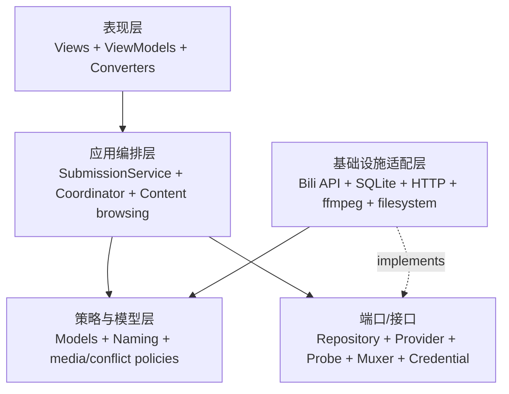
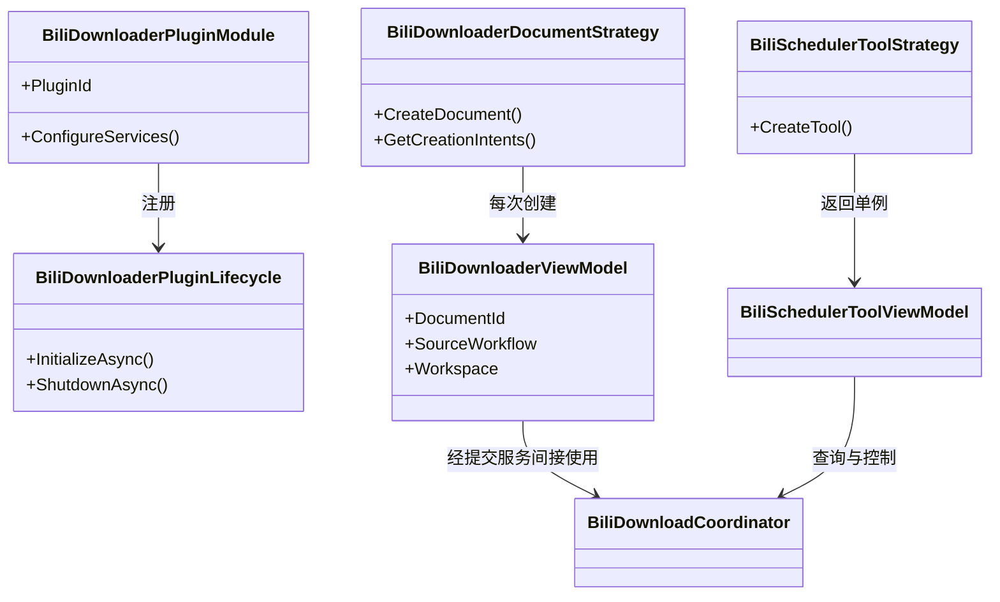
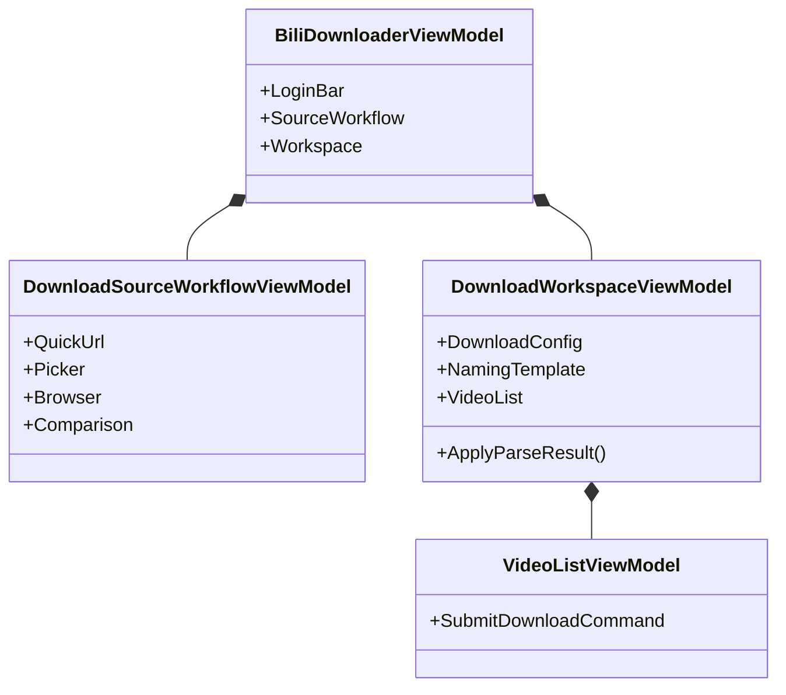

# 02. 代码层级与核心对象

## 目录层级

```text
BiliDownloader/
├─ Plugin/          插件组合根和生命周期
├─ Create/          Document / Tool 创建策略
├─ Views/           Avalonia 视图，原则上只做绑定和少量视图行为
├─ ViewModels/      Document、Tool 及细分交互状态
├─ Models/          媒体、提交、任务、预检、文档保存等数据模型
├─ Services/
│  ├─ Api/          Bilibili HTTP API 与响应映射
│  ├─ Auth/         登录、会话状态、凭据加密存储
│  ├─ ContentSources/ 内容源抽象、Provider、浏览、筛选、增量比较
│  ├─ Download/     预检、调度、执行、传输、媒体策略、Extras
│  ├─ History/      历史查询、导出、重新下载、文件状态
│  ├─ Infrastructure/ 路径、HTTP、ffmpeg、日志、UI 调度等适配器
│  ├─ Naming/       命名模板和文件名净化
│  └─ Persistence/  SQLite、设置、预设、Document 编解码
├─ Messages/        Document 与全局调度器之间的消息 DTO
├─ Converters/      Avalonia 展示转换器
├─ Constants/       稳定类型 ID
└─ Styles/          主题与样式资源
```

## 逻辑分层



这不是严格的独立程序集分层，而是单项目内的职责分区。依赖方向大体清晰，但仍有少量兼容构造函数直接创建具体实现，属于历史兼容取舍。

## 对象生命周期

### 插件级单例

以下对象在整个插件进程生命周期内共享：

| 类型 | 为什么共享 |
|---|---|
| `BiliDownloadCoordinator` | 全局只能有一个队列和任务状态机。 |
| `IDownloadTaskRepository` / `DownloadTaskStore` | Tool、Document 和 Coordinator 必须观察同一事实源。 |
| `BiliLoginStateService` / `IBiliCredentialProvider` | 所有请求共享当前账号会话。 |
| `BiliApiService` | 复用 API 适配器和 WBI key 缓存。 |
| `IContentSourceProviderRegistry` 及 Provider | Provider 无 Document UI 状态，可安全共享。 |
| `FfmpegService` | 统一定位和探测 ffmpeg 能力。 |
| `DownloadProgressTracker` | 统一写入顺序与消息广播。 |
| `BiliSchedulerToolViewModel` | Tool 在宿主中是全局任务控制面。 |

### Document 级瞬态

`BiliDownloaderViewModel` 是 transient。每个 Document 都有独立的：

- `VideoParseViewModel`
- `DownloadSourceWorkflowViewModel`
- `DownloadWorkspaceViewModel`
- `DownloadConfigViewModel`
- `VideoListViewModel`
- `NamingTemplateViewModel`

因此一个 Document 的 URL、筛选条件、勾选状态和命名配置不会污染另一个 Document；但它们提交的任务最终都进入同一个 Coordinator。

### 任务级运行时对象

每次活动执行有一个 `TaskRuntimeContext`，内部持有链接到全局停止令牌的任务级取消源和不可变停止原因。Coordinator 将它和完成任务封装成 `ActiveTaskRun` 并在执行器启动前原子登记。运行时对象只在本次执行期间存在，不持久化；恢复时创建新上下文，可恢复事实保存在 `DownloadTaskRecord` 和临时文件中。

## 主要入口类



## Document 内部组合

`BiliDownloaderViewModel` 是 Document 的组合 ViewModel，而不是所有业务的“大类”。它主要负责：

- 创建和连接子 ViewModel。
- 提供跨子模块所需的 `SubmitContext`。
- 将解析结果交给工作区。
- 路由进度和状态消息到当前 Document。
- 保存/恢复 Document V3 状态。



### 为什么这样拆

- `SourceWorkflow` 只管理“内容从哪里来”。
- `Workspace` 只组合“解析后的下载方案”。
- `DownloadConfig` 只管理输出配置和预设。
- `VideoList` 只管理条目选择、重命名与提交交互。
- 顶层 Document 只协调，不重复实现子场景。

这符合单一职责原则，也减少 XAML 绑定到一个超大 ViewModel 的复杂度。

## Services 子目录的角色

### Api

把远端 API 的 URL、参数、WBI 签名和 JSON 结构封装在适配器内。上层尽量依赖窄接口：

- `IBiliContentSourceApi`
- `IBiliMediaProbe`
- `IBiliSubtitleApi`
- `IBiliDanmakuApi`
- 个人来源和订阅来源的各类 catalog API

同一个 `BiliApiService` 可以实现多个接口，但消费者只看到自己需要的能力。

### ContentSources

把不同内容入口统一为 Provider 协议：规范化来源、分页、可选解析。该层还负责：

- Provider 注册与能力校验。
- 远端分页游标的安全消费。
- 会话级 LRU 缓存。
- 全部匹配选择的稳定物化。
- 增量比较与去重。

### Download

这是主业务核心，但内部继续拆成不同边界：

| 类/接口 | 职责 |
|---|---|
| `IDownloadSubmissionService` | 给 Document 一个“预检 + 提交”的窄入口。 |
| `ISubmissionPreflightService` | 只检查并生成结构化报告。 |
| `BiliDownloadCoordinator` | 任务状态机、队列、并发、持久化编排。 |
| `IDownloadTaskExecutor` | 隔离真正的网络与文件副作用。 |
| `BiliDownloadService` | 单项 DASH 下载与发布流程。 |
| `MultiConnectionDownloader` | HTTP Range、续传、协议校验。 |
| `IMediaStreamSelectionPolicy` | 纯函数式媒体选择。 |
| `IOutputArtifactPolicy` | 输出矩阵、扩展名和身份规范化。 |
| `IDownloadProgressTracker` | UI 广播和 SQLite 进度写入。 |

### Persistence

这里存在两类持久化，不能混淆：

- Document 文件保存：保存编辑计划、来源描述符、配置和增量基线。
- 插件数据库：保存已提交任务、断点、状态、错误和最终输出事实。

Document 删除或关闭不应删除已提交任务；任务库也不负责恢复编辑器的 UI 状态。

## 模型分组

| 模型组 | 代表类型 | 生命周期 |
|---|---|---|
| 解析模型 | `BiliVideoCollection`, `BiliVideoItem`, `BiliDashResult` | 一次解析/探测 |
| 来源模型 | `ContentSourceDescriptor`, `ContentSourceItem`, `ContentPage` | 浏览会话，可部分保存 |
| 提交模型 | `DownloadSubmission`, `DownloadProfileSnapshot` | 从点击提交到入库 |
| 预检模型 | `SubmissionPreflightReport`, `PreparedSubmission` | 一次确认循环 |
| 任务模型 | `DownloadTaskRecord`, `TaskRuntimeSnapshot` | 跨进程持久化 |
| 输出模型 | `MediaOutputPlan`, `RenditionSpecification` | 预检和执行共同使用 |
| 文档模型 | `DocumentSaveDataV3` | 跨 Document 保存/加载 |

## 外部依赖的职责

| 依赖 | 用途 |
|---|---|
| Avalonia / Dock | UI、Document 和 Tool 宿主模型。 |
| CommunityToolkit.Mvvm | 可观察属性和命令生成。 |
| Flurl.Http | Bilibili API 请求。 |
| `HttpClient` | 媒体流与封面下载，便于精确控制 Range。 |
| Newtonsoft.Json | API 动态 JSON 映射。 |
| Microsoft.Data.Sqlite | 任务、设置、预设和凭据持久化。 |
| protobuf-net | 弹幕 Protobuf 解码。 |
| QRCoder | 登录二维码 PNG 生成。 |
| ffmpeg / ffprobe | 媒体封装、字幕封装和输出能力验证。 |

## 阅读代码的建议路径

如果只想理解下载主链路，按下面顺序读即可：

1. `Plugin/BiliDownloaderPluginModule.cs`
2. `ViewModels/BiliDownloader/VideoParseViewModel.cs`
3. `Services/ContentSources/DirectLinkProvider.cs`
4. `ViewModels/BiliDownloader/VideoListViewModel.cs`
5. `Services/Download/SubmissionPreflightService.cs`
6. `Services/Download/BiliDownloadCoordinator.cs`
7. `Services/Download/BiliDownloadTaskExecutor.cs`
8. `Services/Download/BiliDownloadService.cs`
9. `Services/Download/MultiConnectionDownloader.cs`
10. `Services/Persistence/DownloadTaskStore.cs`
## P1-G10：带宽对象与生命周期

| 对象 | 生命周期与职责 |
|---|---|
| `IBandwidthLimiter` | 下载器唯一依赖的读取许可端口。 |
| `GlobalBandwidthLimiter` | 插件单例；维护跨任务公平令牌桶。 |
| `TaskBandwidthLimitManager` | 插件单例；按活动 taskId 创建、热更新和释放任务桶。 |
| `CompositeBandwidthLimiter` | 先申请任务额度，再申请全局额度。 |
| `GlobalBandwidthLimitService` | settings 持久化、损坏值回退和运行时配置切换。 |
| `IBandwidthClock` | 提供单调时间和可取消延时，生产使用 Stopwatch，测试使用手动时钟。 |

limiter 只保存数字、等待队列和取消注册，不保存 `HttpClient`、网络流或文件流。任务 lease 与 `ProcessSingleTaskAsync` 同生命周期，finally 释放时输出聚合诊断。
