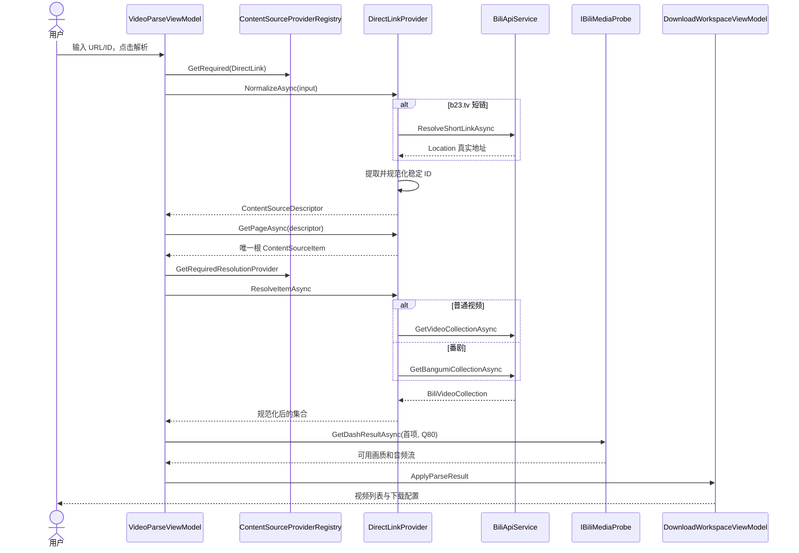
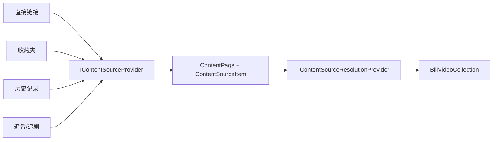
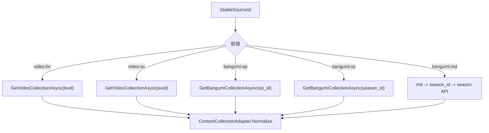
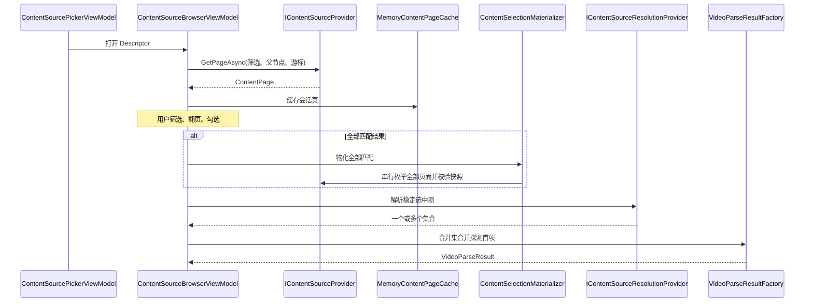
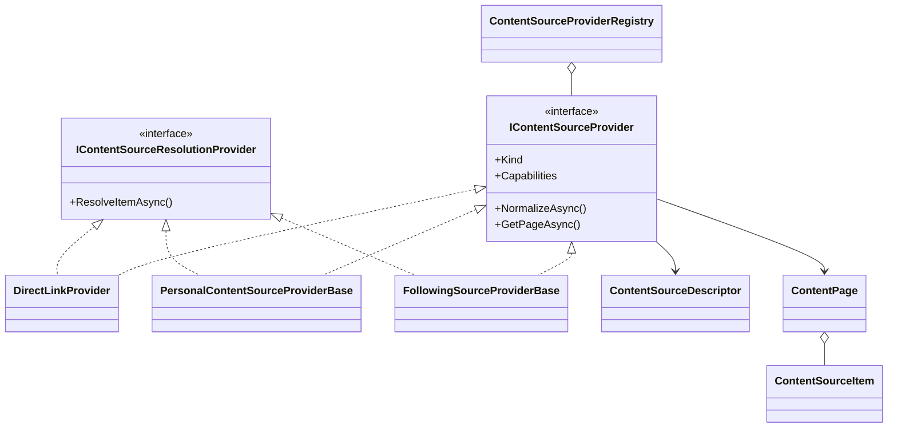

# 03. URL 与内容源解析

## 解析的目标不是“拿到一个 URL”

解析阶段最终要得到：

- 稳定的来源身份，便于保存和恢复。
- 一个或多个包含 `aid/cid` 的媒体单元。
- 首个媒体单元的可用画质、音频和高规格能力。
- 统一的 `VideoParseResult`，供工作区展示和配置。

临时 CDN 地址不在这一阶段交给下载器长期保存。真正执行任务时会重新获取 DASH。

## 快速 URL 完整时序

## 第一步：输入识别与稳定 ID

### 支持的输入

| 类别 | 示例形态 | 稳定身份形态 |
|---|---|---|
| BV 号 | `BV...` 或 `/video/BV...` | `video:bv:<payload>` |
| av 号 | `av123` 或 `/video/av123` | `video:av:123` |
| 番剧分集 | `ep123` 或 `/bangumi/play/ep123` | `bangumi:ep:123` |
| 番剧季度 | `ss123` 或 `/bangumi/play/ss123` | `bangumi:ss:123` |
| 媒体条目 | `md123` | `bangumi:md:123` |
| 短链 | `b23.tv/...` | 先展开，再映射为以上某一种 |

`BiliApiService.ParseVideoId` 和 `ParseBangumiId` 负责语法提取；`DirectLinkProvider.NormalizeStableId` 负责生成领域内稳定身份。

稳定 ID 的价值：

- 去掉原始 URL 中无关的 query、分享参数和展示差异。
- Document 保存时不必存远端临时地址。
- `ContentItemKey` 可进行确定性比较。
- 普通视频、番剧和未来来源可以进入同一 Provider 协议。

### b23.tv 短链

`DirectLinkProvider` 先通过 `BiliApiService.IsB23TvLink` 判断短链，再调用 `ResolveShortLinkAsync`。具体实现发送禁用自动跳转的 HEAD 请求，读取 `Location`，随后再对真实 URL 做普通解析。

短链展开失败会映射为 `ContentSourceErrorCode.RemoteFailure`，不会把原始异常或可能包含敏感参数的 URL向上泄漏。

## 第二步：为什么直接链接也要分页协议

`DirectLinkProvider.GetPageAsync` 总是返回一个唯一根项目，而且不接受 continuation token。这看似多绕一层，实际是为了统一：

这样快速链接和个人来源共用来源身份、错误分类、解析能力检查与结果出口。以后新增来源，不需要再给下载工作区增加一套专用路径。

`ContentPageAccumulator` 还会校验分页协议。快速链接要求结果数严格为 1；若 Provider 返回 0 或多个根项目，视为协议违约，而不是猜测该选哪一个。

## 第三步：将来源项解析成媒体集合

`DirectLinkProvider.ResolveItemAsync` 先验证：

- Descriptor 类型确实是 `DirectLink`。
- Item key 和 Descriptor stable ID 完全一致。
- 当前输入没有被其他来源项目替换。

之后按前缀路由：

### 普通视频映射

`BiliApiService.GetVideoCollectionAsync` 调用 `/x/web-interface/view`，将响应映射为：

- 集合标题、封面、UP 主、发布时间。
- 单视频或多 P 的 `BiliVideoItem`。
- 若存在 `ugc_season`，则改用合集 section/episode 构造完整列表。

每个可下载项的关键身份是 `aid + cid`；`bvid` 主要用于展示和命名。

### 番剧映射

`GetBangumiCollectionAsync` 调用 `/pgc/view/web/season`：

- `ep` 使用 `ep_id`。
- `ss` 使用 `season_id`。
- `md` 先通过 `/pgc/review/user` 转为 `season_id`。

响应中的正片和 section 附加内容都会映射成 `BiliVideoItem`，并补充 `MediaType=Bangumi`、`EpId` 和 `SeasonId`。这些字段随后决定播放地址应走普通视频还是 PGC API。

## 第四步：探测画质，而不是保存下载地址

解析集合后，`VideoParseViewModel` 对首项调用 `IBiliMediaProbe.GetDashResultAsync`，目标画质使用 Q80 作为能力探针。返回的 `BiliDashResult` 包含：

- `AcceptQualities`
- 视频流元数据
- 标准、Hi-Res、杜比等音频流元数据
- HDR、杜比视界、Hi-Res、Atmos 的证据状态

UI 只提取画质选项和标准音频档位作为初始配置。实际提交预检和任务执行都会重新请求 DASH，因为签名播放地址有时效性，解析时结果不能作为长期下载能力。

## 第五步：原子更新解析状态

`VideoParseViewModel` 在所有远端调用成功前不会覆盖上一次成功结果。成功后才一次性更新：

- `VideoCollection`
- 规范化后的显示输入
- `CurrentSourceDescriptor`
- `IsParsed`
- `DownloadInfo`

如果取消或失败，上一次成功结果保持不变。这是“先计算、后提交状态”的小型事务模式，避免 UI 出现集合已换但画质仍属于旧集合的半完成状态。

## 个人内容来源路径

### Provider 类型

| Provider | 来源 | 可解析为下载 |
|---|---|---|
| `UploaderSourceProvider` | UP 主投稿 | 是 |
| `FavoriteSourceProvider` | 收藏夹 | 是 |
| `WatchLaterSourceProvider` | 稍后再看 | 是 |
| `HistorySourceProvider` | 观看历史 | 是 |
| `FollowingBangumiSourceProvider` | 追番 | 是 |
| `FollowingCinemaSourceProvider` | 追剧 | 是 |
| `CollectionSourceProvider` | 收藏的合集/订阅目录 | 是 |
| `CourseSourceProvider` | 课程目录 | 当前主要是浏览；接口分离允许不伪造下载能力 |

所有 Provider 实现 `IContentSourceProvider`；只有能把目录项解析为媒体集合的类型才实现 `IContentSourceResolutionProvider`。这体现接口隔离原则：能浏览不等于能下载。

### 浏览链路

### 分页并发保护

`ContentQueryCoordinator` 同时维护：

- generation：新查询使旧查询结果失效。
- cancellation token：主动取消上一代查询。
- semaphore：同一时间只推进一个分页游标。

这避免快速切换筛选时旧请求晚到并覆盖新界面，也避免两个“下一页”请求消耗同一游标。

`MemoryContentPageCache` 是 Document 会话级有界 LRU，默认容量 32。缓存 key 包含来源类型、稳定 ID、能力版本、父节点、筛选指纹、页大小和游标。游标只留在内存，不写入日志或 Document。

### “全部匹配”为什么要物化

当用户选择“全部匹配结果”时，UI 并没有持有所有远端项目。`ContentSelectionMaterializer` 会在提交前：

1. 校验选择时的筛选指纹仍一致。
2. 串行读取所有页，最多 10,000 页。
3. 拒绝游标循环。
4. 验证 snapshot token 在枚举期间不变化。
5. 若 Provider 没有 snapshot token，则重新读取第一页并比较摘要。
6. 完整成功后才返回稳定项目集合。

任何分页错误都不会产生部分提交。

## 内容源核心类图

## 错误如何向 UI 收敛

Provider 边界使用 `ContentSourceException` 和稳定错误码：

- `InvalidInput`
- `LoginRequired`
- `Forbidden`
- `RiskControlled`
- `NotFound`
- `RateLimited`
- `RemoteFailure`
- `ProtocolViolation`
- `UnknownProvider`
- `UnsupportedOperation`

`VideoParseViewModel` 再将错误码翻译成面向用户的文本。这样 API 的原始消息、URL 和 Cookie 不会直接穿透到 UI 或日志。

## 如何新增一种内容来源

1. 在 `ContentSourceKind` 增加稳定枚举值。
2. 实现 `IContentSourceProvider`，准确声明能力位和版本。
3. 若可下载，再实现 `IContentSourceResolutionProvider`。
4. 返回稳定、无敏感信息的 Descriptor 和 Item key。
5. 严格遵守 continuation token、`HasMore` 和 snapshot 约定。
6. 在 `BiliDownloaderPluginModule` 注册 Provider。
7. 让 `ContentSourceProviderRegistry` 在启动时校验重复类型和非法能力。

下载工作区和 Coordinator 通常不需要修改，这正是 Provider/Strategy 设计带来的开放封闭性。
## 与 P1-G10 限速的边界

内容源分页、详情解析、短链展开、DASH 元数据和字幕目录都不计入主媒体限速。Provider 也不读取 settings 或任务 limiter。只有内容已经通过提交与调度、进入 `MultiConnectionDownloader` 的视频/音频字节才申请额度。这个边界避免低速设置拖慢登录、预检和来源浏览，也防止 Provider 为了限速反向依赖执行层。
