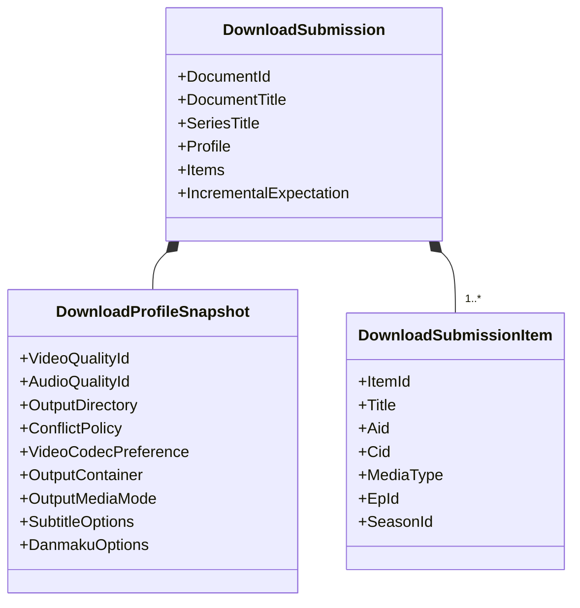
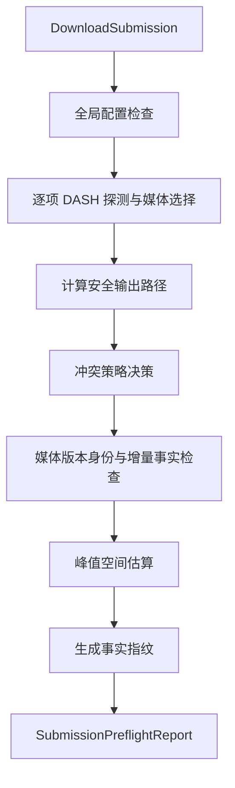
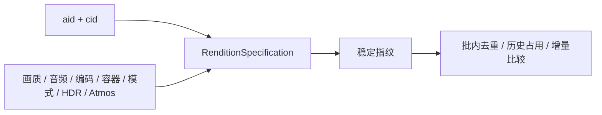
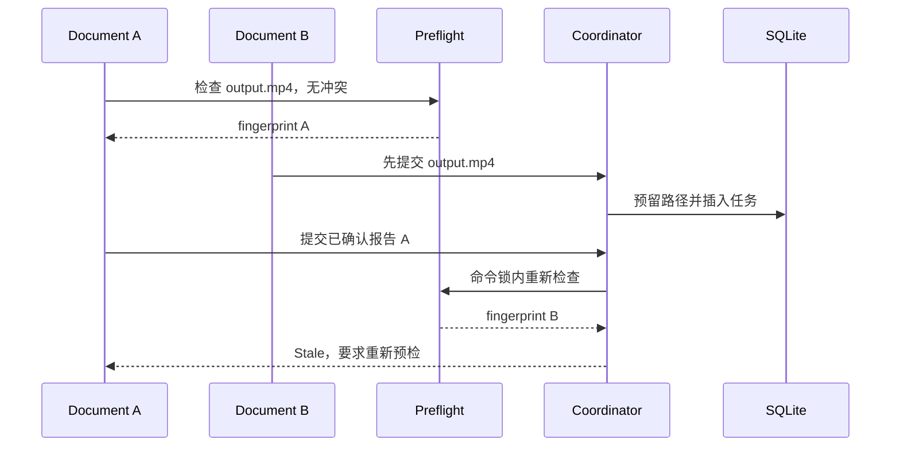
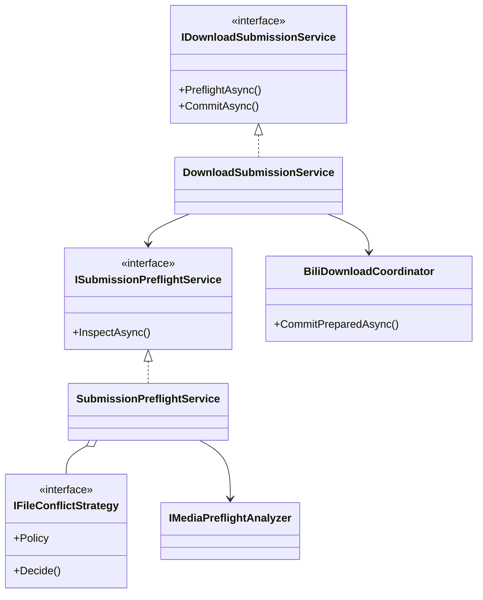

# 04. 下载提交与预检

## 为什么“点击下载”不等于立即开始下载

点击时仍有许多不稳定事实：目录可能不可写、ffmpeg 可能不可用、同名文件可能存在、磁盘空间可能不足、另一个 Document 可能同时提交相同输出、解析时的 DASH 能力也可能已经变化。

因此提交被拆成三步：

## 1. 从 UI 状态生成不可变快照

`VideoListViewModel.SubmitDownloadAsync` 先做轻量 UI 校验：

- 至少有一个解析项并且至少勾选一项。
- 命名模板合法。
- 非纯音频模式已经选择画质。
- 显式高规格选择对当前所选项有效。

然后在 Document 侧渲染最终标题。手工重命名优先于模板；普通项使用 `NamingTemplateEngine` 将 `{index}`、`{title}`、`{bv}`、`{up}`、`{date}`、`{series}` 等上下文转换为最终任务标题。

### 提交对象

这组 record 是后台边界唯一接受的 payload。它与 `BiliVideoItem` 的可观察 UI 状态脱钩，保证任务可复现。

## 2. 预检 Facade 做了什么

`DownloadSubmissionService` 为 ViewModel 提供两个方法：

- `PreflightAsync`：委托给 `ISubmissionPreflightService`。
- `CommitAsync`：把已确认报告交给 Coordinator。

ViewModel 不需要理解调度锁、SQLite 事务或路径预留。

`SubmissionPreflightService` 是预检 Facade，内部编排多个窄策略和适配器。

### 全局检查

- 字幕和弹幕结构化选项能否通过自身校验。
- 纯音频是否错误请求软字幕。
- MKV + VTT 软字幕等组合是否受支持。
- 输出模式与容器矩阵是否合法。
- 需要封装时 ffmpeg 是否就绪。
- ffmpeg 是否支持目标 muxer。
- 输出目录是否为空、是否能规范化、创建并写入临时探针文件。

### 媒体检查

`DashMediaPreflightAnalyzer` 对每个项只请求一次 DASH：

1. `IBiliMediaProbe` 获取当前流事实。
2. `IMediaStreamSelectionPolicy` 按快照选择视频和音频。
3. `IMediaSizeCalculator` 根据实际选择的带宽和时长估算峰值空间。
4. 仅返回不含 Cookie 和签名 URL 的 `MediaOutputPlan`。

显式编码或高规格不可用会成为 Blocking issue；不会在预检阶段静默降级。

### 峰值空间估算

`MediaSizeCalculator` 使用所选音视频总带宽和时长估算媒体字节，再按约 2.2 倍计算峰值：下载临时流与发布 staging 在某个阶段会同时存在，并额外保留 10% 余量。

未知时长、未知带宽或无法读取磁盘容量不会伪装成 0，而是产生需要确认的 `disk_unknown` 警告。明确小于估算则产生 `disk_insufficient` 阻止项。

## 3. 输出身份与去重

插件区分两个层次：

- `MediaUnitKey`：`aid + cid`，表示同一个媒体单元。
- `RenditionFingerprint`：媒体单元 + 画质 + 音频 + 编码 + 容器 + 输出模式 + 高规格偏好，表示具体输出版本。

`RenditionSpecification.Canonicalize` 会清除当前输出模式不消费的配置维度。例如纯音频不应因为无关的视频编码设置不同而被视为两个不同输出版本。

预检会阻止或跳过：

- 同一批次中的相同 rendition。
- 已有可信完成品或活动/可恢复任务占用相同 rendition。
- 增量预览后任务事实变化。
- 使用旧 `task_id` 隐式覆盖历史任务。

## 4. 文件冲突策略

`IFileConflictStrategy` 将“发现冲突后怎么办”从预检主流程中拆开。

| 策略 | 行为 |
|---|---|
| `SkipConflictStrategy` | 已有文件时跳过该项。 |
| `OverwriteConflictStrategy` | 标记为需要明确确认的覆盖。 |
| `ResumeVerifiedConflictStrategy` | 只复用同 Document、同媒体、同输出规格且临时事实可信的任务。 |
| `AutoNumberConflictStrategy` | 分配 `name (1).ext`，最多尝试到 9999。 |

冲突域不仅包含主媒体，还包含可能共用基础名的 XML、封面、弹幕格式和外置字幕。这样不会出现“主视频自动编号成功，但字幕仍覆盖旧文件”的问题。

### 校验续传

续传候选必须满足：

- Document、aid、cid、ep、画质、音频、编码、容器和模式一致。
- 原任务处于 `Paused`、`Interrupted` 或 `Failed`。
- 临时目录存在。
- 新版任务具备所需输入流的可信预期长度。
- 现有 tmp/chunk 总长度不超过预期。
- 至少存在可恢复数据。

否则 Resume 策略不能把任意同名残留文件当作可信断点。

## 5. 结构化报告与用户动作

`SubmissionPreflightReport` 包含：

- 每项的最终输出路径、是否提交、跳过或续传。
- 每项和全局的 `PreflightIssue`。
- 输出计划与估算字节。
- 可用磁盘空间。
- 当前事实的 SHA-256 fingerprint。

问题分两种：

- `Blocking`：不能提交，必须修复。
- `Warning`：允许提交，但必须明确确认。

`VideoListViewModel` 将常见阻止码映射为动作：

| 问题码 | UI 动作 |
|---|---|
| `login` | 重新登录 |
| `ffmpeg` | 安装/修复 ffmpeg |
| `disk_insufficient` | 更换输出目录 |
| `output_empty` / `output_unwritable` | 选择输出目录 |
| `stale_comparison` | 刷新增量比较，不复用旧确认 |

## 6. 为什么提交时还要再检查一次

预检和用户确认之间存在时间窗口：

`CommitPreparedAsync` 在 `_commandLock` 内重新运行预检：

- 指纹不同返回 `Stale`。
- 增量事实变化返回 `StaleComparison`。
- 新阻止项返回 `Blocked`。
- 仍需确认但没有确认标记时拒绝。

通过后，任务批量插入和 `output_path_reservations` 由 SQLite 事务保证。唯一约束冲突也会被转换为 `Stale`，而不是覆盖已有任务。

这是一种乐观并发控制：预检报告是带版本的事实快照，提交时验证版本仍有效。

## 7. 任务记录如何生成

每个通过预检的新项会获得新的随机 `TaskId`，并固化：

- 来源 Document 身份与标题。
- 媒体身份、rendition 指纹。
- 完整下载配置快照。
- 预检确定的输出路径和规范化 path key。
- 冲突策略与覆盖确认。
- 估算空间、预期媒体特征。
- 字幕、弹幕和封面配置。
- 初始状态 `Ready`。

旧版直接使用提交项 ID 作为 task ID 的入口仍保留用于兼容，但生产 DI 路径使用可等待的预检提交服务。

## 关键类图

## 设计收益

- UI 可以展示结构化检查结果，而不是等待后台静默失败。
- 预检可单元测试，不必真的创建任务。
- 不同冲突策略可独立扩展。
- 用户确认与事实提交之间有明确边界。
- 并发 Document 不会互相覆盖输出路径。
- 任务记录包含完整快照，后续重试不依赖当前 UI。
