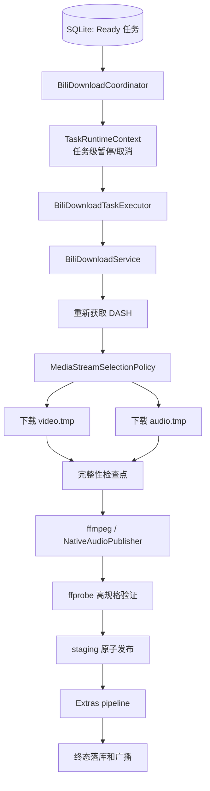
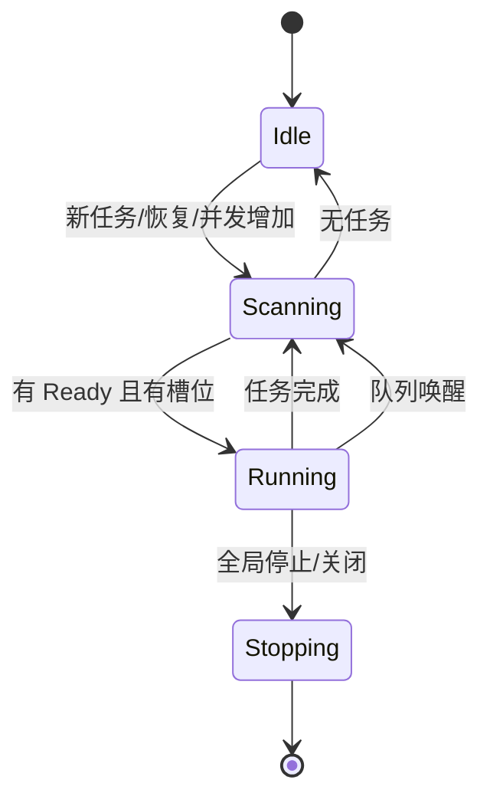
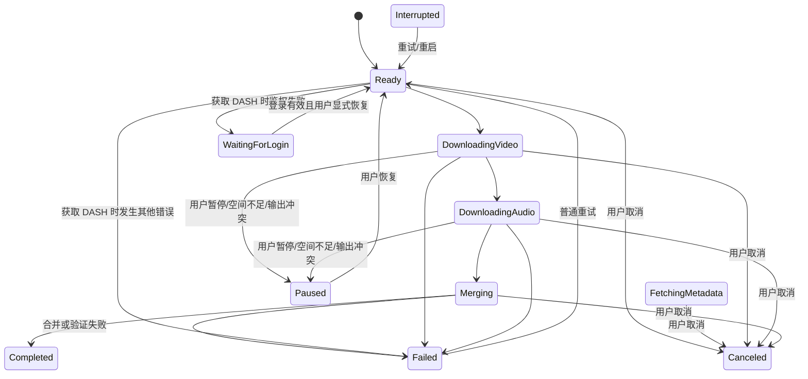
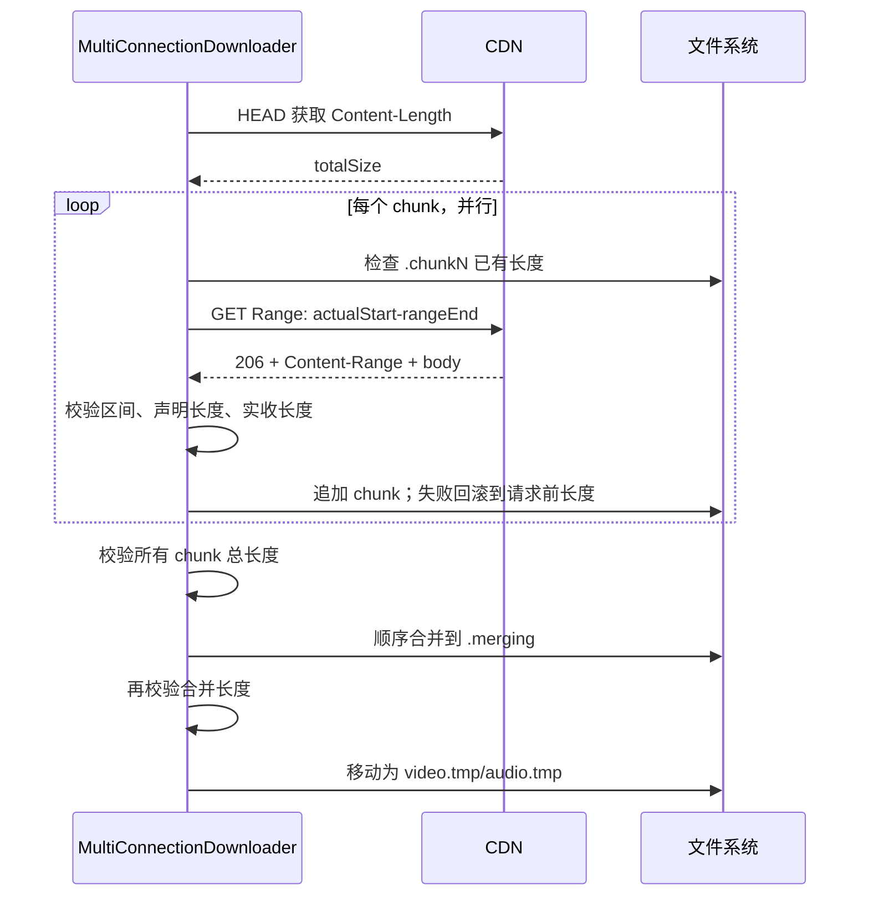
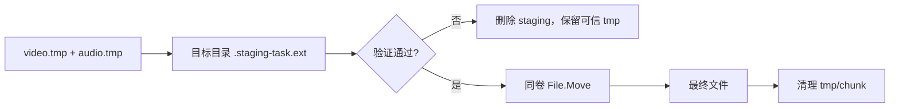
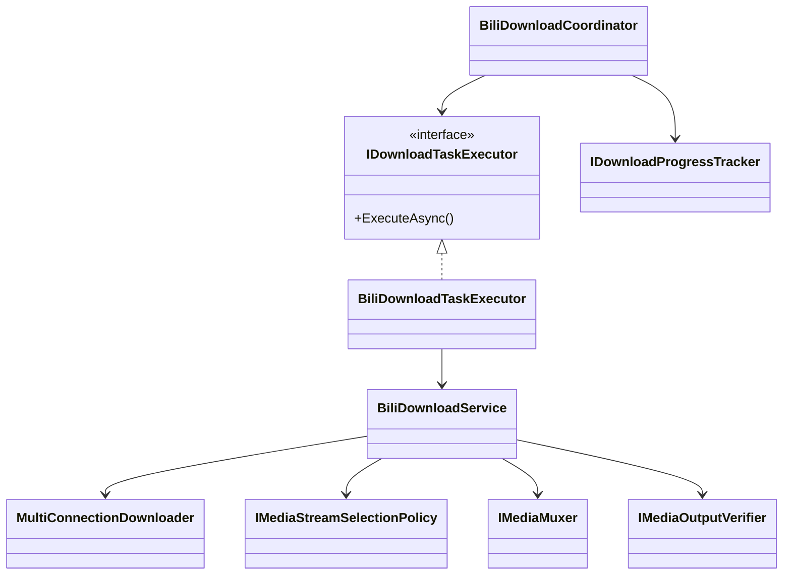

# 05. 调度与下载执行

## 总览

## 1. Coordinator 的职责边界

`BiliDownloadCoordinator` 负责：

- 初始化任务库和恢复异常退出状态。
- 接收经过预检的任务。
- 保证命令串行和任务状态迁移。
- 按并发上限调度 `Ready` 任务。
- 为活动任务创建运行时上下文。
- 将进度、字节和检查点持久化。
- 处理完成、异常、暂停、取消、重启和关闭。

它不负责：

- 解析 Bilibili JSON。
- 选择具体 DASH 流。
- 发起 Range 请求。
- 拼 ffmpeg 参数。
- 下载字幕和弹幕。

这些副作用由 `IDownloadTaskExecutor` 后面的实现完成，因此 Coordinator 可以用测试执行器独立验证状态机。

## 2. 队列如何工作

Coordinator 使用一个处理循环，而不是每次提交都启动独立调度器：

1. 从 SQLite 读取所有任务。
2. 清理已完成的活动 Task 和 Context。
3. 找出未在活动集合中的 `Ready` 任务。
4. 计算 `maxConcurrentDownloads - activeCount`。
5. 只为可用槽位启动任务。
6. 等待任一活动任务完成或队列唤醒信号。
7. 无活动任务且无新唤醒时自然退出。

`Channel<bool>` 容量为 1，使用 `DropWrite`。这里信号只表达“队列事实可能变化”，不携带任务数据，所以多个唤醒可以合并，避免无意义堆积。

并发数限制为 1～5。下调并发时优先暂停最近启动的超额任务，保留断点，而不是粗暴取消全部任务。

## 3. 任务状态词汇与当前实际迁移

`DownloadTaskStatus` 还定义了 `FetchingMetadata`、`VideoReady` 和 `AudioReady`，用于表达更细的阶段并兼容存储/展示；但当前 `DownloadProgressTracker` 只把 `video`、`audio`、`merging`、`done` 映射为新状态，`fetching` 保持任务原状态，因此这三个细分状态目前不会由主执行链主动写出。上图表示当前实际可观察的主迁移，而不是枚举中全部理想阶段。

启动时，所有“运行中”状态都被迁移为 `Interrupted`，因为进程已经无法证明旧执行仍在运行。

### 四种取消语义

`TaskRuntimeContext` 让同一个 `OperationCanceledException` 可以根据来源映射为不同状态：

| 原因 | 结果状态 | 语义 |
|---|---|---|
| 用户暂停 | `Paused` | `RequestStop(Pause)` 固化停止原因并取消任务级 CTS；命令等待旧执行完成状态写入后返回，恢复时用新上下文重新调度。 |
| 应用关闭 | `Interrupted` | 记录异常中止，下次启动可恢复。 |
| 全局停止队列 | `Ready` | 放回队列，不解释为用户取消。 |
| 单任务取消 | `Canceled` | 不再自动执行，并清理临时文件。 |

登录恢复也不会自动启动 `WaitingForLogin` 任务。必须由用户点击恢复，Coordinator 再验证当前凭据有效，避免环境事件绕过用户暂停意图。

## 4. 执行器组合

`BiliDownloadTaskExecutor` 实现三个窄接口：

- `IDownloadTaskExecutor`：完整任务执行。
- `IMediaMergeRetryExecutor`：只重试已验证临时媒体的合并。
- `IExtrasRetryExecutor`：只重试失败的附加资源。

完整执行顺序：

1. 从 `IBiliCredentialProvider` 取得当前 Cookie header。
2. 调用 `BiliDownloadService.DownloadItemAsync` 处理主媒体。
3. 主媒体成功后运行 Extras pipeline。
4. 返回输出路径、传输完整性和 Extras 摘要。

Coordinator 只依赖接口，所以“只重试合并”从类型边界上就不能重新下载主媒体。

## 5. DASH 获取与流选择

### 为什么执行时重新获取

解析和预检阶段的 URL 可能过期。执行时 `BiliDownloadService` 再调用 `BiliApiService.GetDashResultAsync`：

- 普通视频走 `/x/player/wbi/playurl`。
- 番剧走 `/pgc/player/web/v2/playurl`。
- 请求参数经 WBI 签名。
- 结果解析为视频、标准音频、Dolby 和 FLAC 流。

### WBI 签名

`BiliApiService` 从 `/x/web-interface/nav` 获取 img/sub key，按固定表重排得到 mixin key，缓存 30 分钟。请求参数加入时间戳、按 key 排序、过滤特殊字符，再计算 MD5 作为 `w_rid`。

签名 URL 只用于当次请求和下载，不进入任务数据库或 Document。

### 流选择策略

`MediaStreamSelectionPolicy` 是无网络、无磁盘副作用的纯策略：

- 自动视频编码兼容顺序：AVC → HEVC → AV1。
- 自动动态范围：杜比视界 → HDR → 标准。
- 自动音频规格：Atmos → Hi-Res → 标准。
- 显式选择只接受目标规格，不跨画质、编码或规格降级。
- 通过 codec id、codec string 和 MIME 共同识别编码；证据矛盾时视为未知。
- 容器不能无损承载所选特征时直接失败。

最终得到 `MediaOutputPlan`：实际视频/音频编码、输出容器和模式、扩展名、带宽、预期媒体特征。

## 6. 多连接下载与断点续传

`BiliDownloadService` 先通过 `CdnUrlHelper` 过滤并排序主/备 CDN URL，再交给 `MultiConnectionDownloader`。

### 多连接路径

分块数为配置值与文件大小的较小者，默认最多 4 块。每块最多重试 3 次，并轮换 CDN 备选 URL。

分块响应必须满足：

- HTTP 206。
- `Content-Range` 的单位、起点、终点和总长度全部匹配。
- 若有 `Content-Length`，必须等于本次期望区间长度。
- 实际读取字节不能多也不能少。

失败时文件回滚到本次请求前长度，进度也扣回，防止把错误响应体当成合法断点。

### 单连接回退

如果只有一个 URL、配置为单连接，或 HEAD 无法取得长度，则走单连接：

- 已有文件时发送 Range 续传。
- 若服务器正确返回 206，则校验 `Content-Range` 后追加。
- 若服务器忽略 Range 返回 200，则明确从头覆盖。
- 响应中断或最终长度不符时回滚。

## 7. 媒体检查点

视频和音频都下载并通过长度验证后，执行器在启动 ffmpeg 前调用 `OnMediaReadyAsync`。Coordinator 将以下事实写入 SQLite：

- `ExpectedVideoBytes`
- `ExpectedAudioBytes`
- `VideoIntegrityPassed`
- `AudioIntegrityPassed`

只有检查点落库成功才开始合并。这样如果进程在 ffmpeg 阶段崩溃，后续可以证明临时输入可信并执行“只重试合并”。

## 8. 合并、验证和原子发布

### 音视频或仅视频

`IMediaMuxer` 由 `FfmpegService` 实现。它根据 `MediaMuxRequest` 组装封装命令，将输出写到最终目录中的 staging 文件。

staging 和最终文件位于同一目录，目的是保证最后一步是同卷 `File.Move`，而不是可能失败的跨卷复制。

### 纯音频

普通原生音频可由 `NativeAudioPublisher` 直接发布；需要保留高规格事实时仍先复制到 staging 并进行验证。扩展名依据实际编码决定：AAC/E-AC-3 为 `.m4a`，FLAC 为 `.flac`。

### 高规格验证

如果 `MediaOutputPlan.ExpectedMediaFeatures` 不为空，`FfprobeMediaOutputVerifier` 会检查 staging 的真实流：

- HDR
- Dolby Vision
- Hi-Res/FLAC
- Dolby Atmos/E-AC-3 证据

验证失败会删除不可信 staging，但保留已通过长度校验的 tmp 输入，供修复依赖后重试合并。

### 发布

非覆盖策略下，若最终路径在执行期间被外部创建，发布会抛出 `OutputConflictException`，不会覆盖。覆盖也必须带有预检阶段固化的 `OverwriteConfirmed`。

## 9. 进度和终态

`BiliDownloadService` 按输出模式分配总进度权重：

| 模式 | 计算方式 |
|---|---|
| 音视频 | 视频 45% + 音频 45% + 合并 10% |
| 仅视频 | 视频 90% + 合并 10% |
| 仅音频 | 音频 100% |

Coordinator 收到回调后：

- 立即更新内存任务和 UI。
- 通过 Tracker 节流写入 SQLite。
- 阶段边界和终态前 `FlushAsync`。
- 先在数据库标记完成，再广播内存终态。

错误由 `DownloadErrorClassifier` 分类。鉴权错误进入 `WaitingForLogin`；磁盘不足或输出冲突转为 `Paused`；其他错误进入 `Failed` 并记录是否可重试。异常文本先经 `SensitiveDataSanitizer` 清理。

## 10. 重试层次

| 操作 | 是否重新下载主媒体 | 是否清理断点 | 适用场景 |
|---|---:|---:|---|
| 普通 Retry | 视断点情况继续 | 否 | 网络/CDN 暂时失败 |
| Restart | 是 | 是 | 用户明确从零开始 |
| RetryMerge | 否 | 否 | 下载已完整，ffmpeg/验证失败 |
| RetryFailedExtras | 否 | 否 | 主媒体成功，字幕/弹幕/封面部分失败 |

重试被拆成不同接口和命令，是为了不让“修复一个后处理错误”意外重新下载大文件或扩大网络访问范围。

## 核心类图

## 9. P1-G10 带宽调度

并发任务数、单任务分块数和带宽是三个独立维度。Coordinator 仍决定“多少任务运行”，MultiConnectionDownloader 仍决定“一个任务多少连接”，limiter 只决定“下一次最多 8 KiB 读取何时获准”。

全局令牌桶按 taskId 维护 FIFO 子队列并 Round Robin；因此一个四连接任务每轮只获得一个读取量子，空闲任务又不会保留不可用配额。任务桶把同一 taskId 的视频、音频和分块合计起来。Composite 先等待任务桶，再等待全局桶，避免已被严格任务上限阻塞的请求提前占住共享令牌。

运行时更新在锁内补充旧额度、切换新速率并唤醒 pump 重新计算。0 会排空等待队列；降速不丢弃已读字节，升速不重建请求。延时等待和唤醒等待使用同一轮 linked cancellation，未胜出的等待立即取消，防止信号泄漏与关闭死锁。

任务卡片同时展示 `TaskRateLimitDisplayText` 与已有 `SpeedText`：前者是配置事实，后者是采样观测，两者不能互相替代。
