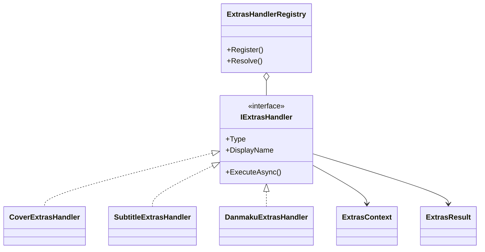
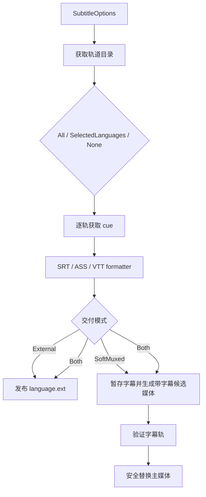
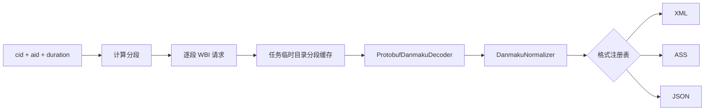
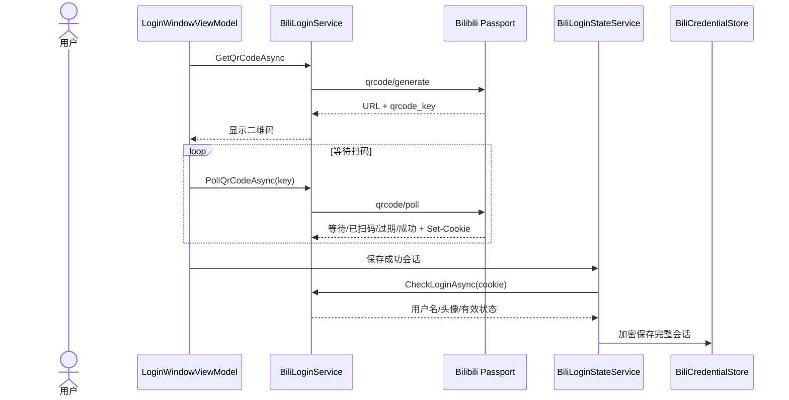
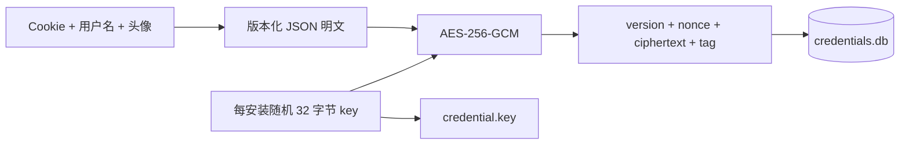
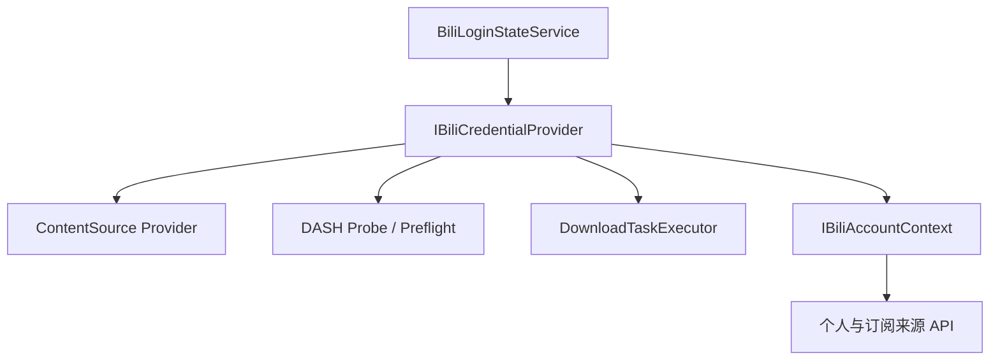

# 06. 附加资源与登录安全

## 附加资源为什么在主媒体之后执行

字幕、弹幕和封面是用户选择的附加产物，但不应决定主媒体是否成功。当前流程先安全发布主媒体，再顺序运行 Extras：

固定顺序是封面 → 字幕 → 弹幕。单个处理器失败被捕获并写入摘要，主媒体仍保持 `Completed`。任务中心可以独立重试失败项。

## Extras 策略边界

`IExtrasHandler` 只要求三个能力：稳定类型、显示名、异步执行。`ExtrasHandlerRegistry` 根据位标志 `ExtrasType` 解析处理器列表。

`ExtrasContext` 使用参数对象模式，集中携带：

- 任务和媒体身份。
- 最终主媒体路径、任务临时目录和基础文件名。
- 容器、冲突策略和覆盖确认事实。
- 当前 Cookie。
- 字幕/弹幕不可变配置快照。
- 独立重试时允许执行的稳定结果 key。

新增字段不必不断扩大 `ExecuteAsync` 参数列表。

## 安全发布附加文件

`ExtrasOutputWriter` 不直接覆盖目标文件：

1. 在目标旁写入唯一 staging。
2. 写完后根据冲突策略决定是否可以发布。
3. 使用 `File.Move` 发布。
4. finally 中清理残留 staging。

首次执行只有显式确认的 Overwrite 可覆盖。独立重试可以更新属于该任务的失败附加产物，因为 Coordinator 已先验证任务完成和主文件存在。

## 封面

`CoverExtrasHandler`：

- 从解析结果固化的 `CoverUrl` 下载图片。
- 将 `http` 规范化为 `https`，并验证 URL。
- 使用专用 HTTP client，而不是媒体分块下载器。
- 输出为与主媒体同基础名的 `_cover.jpg`。
- 通过 `ExtrasOutputWriter` 安全发布。

封面 URL 不是登录凭据，但仍不应在失败日志中原样传播；错误最终经过统一净化。

## 字幕

字幕由多个小职责协作：

| 类 | 职责 |
|---|---|
| `SubtitleCatalogService` | 从 API 获取可用轨道并做来源优先选择。 |
| `SubtitleContentProvider` | 获取某条轨道的字幕 cue。 |
| `SubtitleFormatterRegistry` | 按格式选择 formatter。 |
| `SrtSubtitleFormatter` | 输出 SRT。 |
| `AssSubtitleFormatter` | 输出 ASS。 |
| `VttSubtitleFormatter` | 输出 WebVTT。 |
| `SubtitleExtrasHandler` | 编排语言选择、格式化、外置发布和软字幕封装。 |

### 字幕处理图

字幕来源有官方、AI 和未知等类型。目录聚合时使用稳定语言 key，并优先选择更可信的来源。Document 中的字幕检测对多个选中项最多四路并发，展示语言在批次中的覆盖数量。

软字幕有容器约束：

- 纯音频不能软封装字幕。
- MKV 软字幕不接受 VTT。
- 预检会在创建任务前阻止非法组合。

软字幕使用候选媒体并通过 `ISubtitleTrackVerifier` 验证，不在未验证时直接破坏已发布主媒体。

## 弹幕

`DanmakuExtrasHandler` 设计上根据 `ExtrasContext.Duration` 以每 360 秒一段计算分段，通过 `IBiliDanmakuApi` 获取 Protobuf 二进制，并由 `ProtobufDanmakuDecoder` 解码。请求之间使用 `IDanmakuRequestPacer` 节流，默认约 200ms，降低触发远端限流的概率。

格式化器职责：

- XML：兼容常见 Bilibili 弹幕 XML。
- JSON：结构化输出。
- ASS：分配轨道、估算文字宽度、生成移动效果和时间轴。

结构化摘要可以记录失败分段。独立重试时只重新请求失败段，并复用任务临时缓存，避免重新下载全部弹幕，更不会重新下载主媒体。

> 当前实现注意：任务记录已经保存 `DurationSeconds`，`ExtrasContext` 也定义了 `Duration`，但 `BiliDownloadTaskExecutor` 构造 context 时尚未把前者赋给后者。因此生产主链当前观察到的 duration 为默认 0，`Math.Max(1, ...)` 会使弹幕只请求第 1 段。理解现状或修复长视频弹幕缺段时，需要检查这一映射点。

## Extras 结果语义

`ExtrasExecutionSummary` 支持逐语言、逐格式、逐处理器记录：

- `Success`
- `Failed`
- `Unavailable`
- 可重试 key
- 输出文件列表
- 失败分段
- 净化后的错误信息

`Unavailable` 表示远端没有该资源，不一定是错误；部分成功仍可以标记可重试失败项。新版摘要使用版本化 JSON，旧扩展处理器仍可返回兼容文本。

---

## 登录链路

### 二维码登录

`BiliLoginService` 只封装 Passport 和会话验证 API：

- 生成二维码。
- 轮询扫码状态并解析 `Set-Cookie`。
- 调 `/x/web-interface/nav` 验证登录。
- 从 `bili_jct` 取得 CSRF 后调用退出接口。

`BiliLoginStateService` 则拥有当前内存会话、恢复、后台验证与状态广播。API 和下载服务通过 `IBiliCredentialProvider` 读取 Cookie，不直接依赖登录 UI。

## 凭据保存

`BiliCredentialStore` 的 SQLite 表只保存 AES-GCM 信封，不保存明文 Cookie 或账号资料。保存时：

1. Cookie 按名称排序并构造版本化 payload。
2. 序列化为 UTF-8 字节。
3. `ICredentialProtector` 加密。
4. 在事务中 upsert 唯一记录。
5. 用 `CryptographicOperations.ZeroMemory` 清理明文缓冲区。

读取失败、认证 tag 不匹配、JSON 损坏或版本非法时，会删除不可读密文并重置 key，要求重新登录，不继续使用不可信凭据。

### InstallationKeyStore 的安全边界

每次安装生成 32 字节随机 key，写入带 `BILIKEY1` 头的 key 文件。Linux 下尽力收紧为用户读写权限。

重要限制：key 与数据库位于同一用户数据目录。因此该方案的目标是消除数据库明文、避免普通数据库查看或误上传直接暴露 Cookie；它不能抵御整个用户目录和 key 同时泄露。代码注释明确说明了这一威胁模型，没有把本地文件权限冒充硬件级秘密存储。

## 凭据如何进入请求

消费者依赖窄接口，不读取凭据库。`BiliAccountContext` 只投影“是否登录、Cookie 和 UserId”，便于 Provider 判断个人来源能力，也便于测试替换。

## 敏感信息控制

插件通过以下规则缩小泄露面：

- Descriptor、Document 和任务记录不保存 Cookie。
- 任务记录不保存 DASH 签名 URL。
- Provider 异常只保留稳定错误分类。
- 远端异常文本在进入日志和任务错误前经过 `SensitiveDataSanitizer`。
- 页面 continuation token 只存在内存缓存，不写日志。
- 媒体预检结果返回稳定元数据，不返回 URL 或请求头。
- 凭据明文缓冲区在加解密后清零。

## 设计模式与 SOLID

- Strategy：每种 Extras 和每种格式都是可替换策略。
- Registry：将配置枚举映射到处理器和 formatter。
- Parameter Object：`ExtrasContext` 避免长参数列表。
- DIP：执行器依赖字幕目录/内容、danmaku formatter、HTTP factory 等抽象。
- ISP：会话验证 `IBiliSessionApi`、凭据读取 `IBiliCredentialProvider`、账号上下文 `IBiliAccountContext` 分开。
- SRP：API 获取、格式转换、安全发布、软封装验证各自独立。
- OCP：增加新格式通常只需新增 formatter 并注册，不改主执行器。
## P1-G10：为什么 Extras 与鉴权请求不参与主媒体限速

限速只包围视频/音频流的读取。封面、字幕、弹幕、二维码和登录验证保留各自的请求节奏与取消规则；弹幕的 `IDanmakuRequestPacer` 仍处理 API 友好性，不能被带宽 limiter 替代。日志只记录 B/s 数值、taskId、原因和聚合等待，不记录 Cookie、Header、正文或签名 URL。settings 损坏警告也只打印原始数值文本并经统一日志脱敏器处理。
