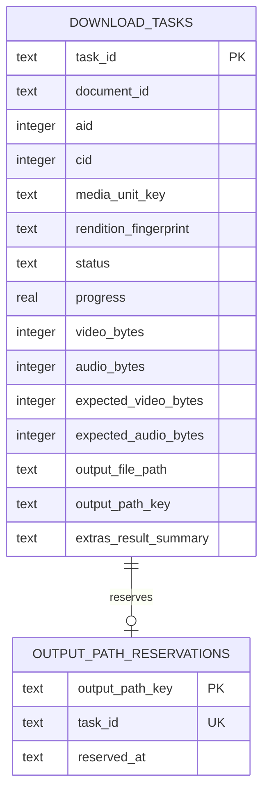
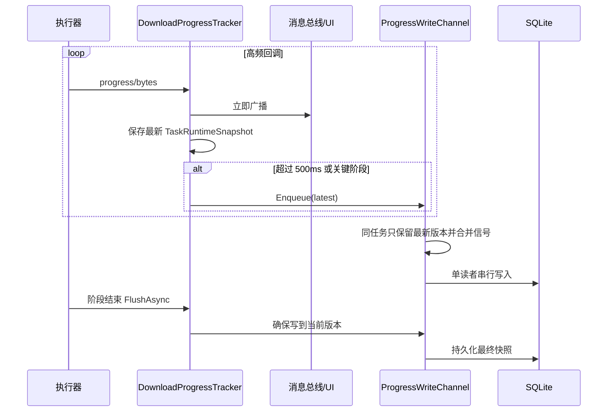
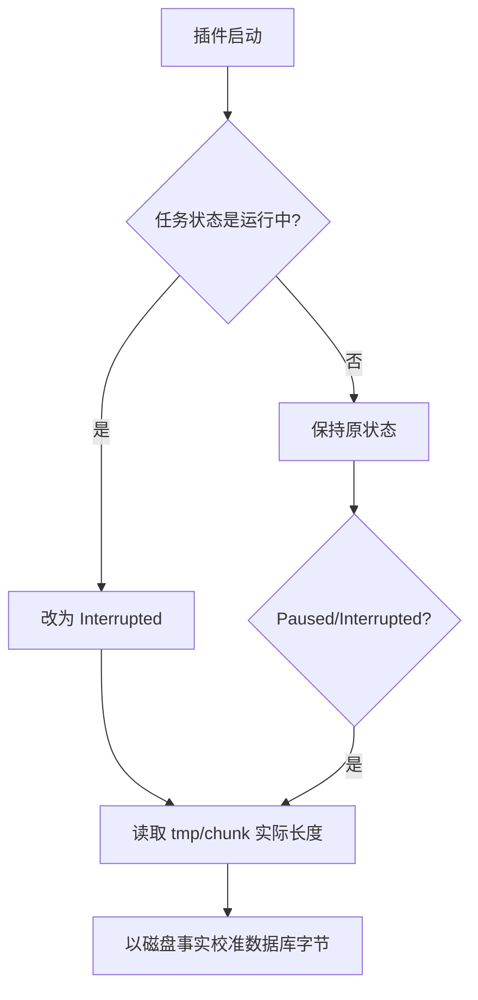
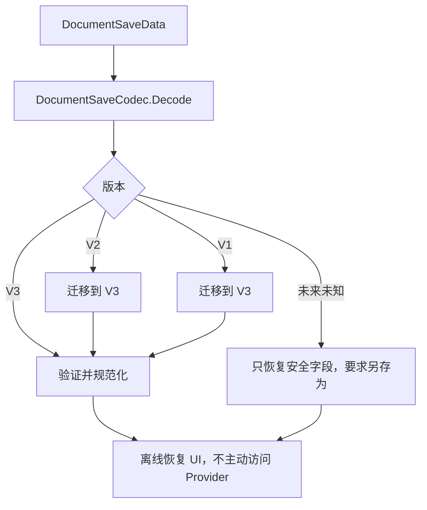

# 07. 持久化、恢复与消息通信

## 三种状态必须分开

```mermaid
flowchart TD
    Document["Document 文件状态\n来源、筛选、配置、增量基线"]
    Tasks["任务数据库状态\n任务快照、进度、断点、终态"]
    Runtime["运行时状态\nCTS、暂停门控、活动 Task、缓存"]

    Document -.保存/加载.-> DocFile[("宿主 Document 文件")]
    Tasks -.持续写入.-> SQLite[("bili_download_tasks.db")]
    Runtime -.进程退出即消失.-> Memory[("内存")]
    SQLite --> Runtime : 启动恢复
```

Document 是编辑计划，任务库是已经提交的执行事实，运行时对象只是当前进程的控制机制。把三者混在一起会导致关闭 Document 时任务消失，或重启后错误恢复旧 CTS。

## 本地路径

`IBiliDataPaths` 是所有持久化服务共享的路径决策入口。

### Windows

根目录位于本地 AppData 下的 `BiliDownloader`，包含：

- `bili_download_tasks.db`
- `credentials.db`
- `credential.key`
- `logs/`
- `temp/`
- `dependencies/ffmpeg/`

### Linux

按 XDG 目录分别放置 data、state 下的 `logs`，以及 cache 下的插件目录；未配置环境变量时回退到 `~/.local/share`、`~/.local/state` 和 `~/.cache`。三个根下都会追加 `BiliDownloader`，其中日志目录再追加 `logs`。

集中路径策略避免每个 Store 自己猜测平台目录，也为本地状态重置提供确定范围。

## 任务数据库

`DownloadTaskStore` 同时实现：

- `IDownloadTaskRepository`：Coordinator 的读写端口。
- `ITaskHistoryReadRepository`：历史中心的只读查询端口。

数据库启用 WAL 和 `synchronous=NORMAL`，在桌面场景中兼顾并发和性能。

### 核心表



`download_tasks` 不只是进度表，还固化提交快照、媒体身份、输出策略、完整性检查点、错误分类、Extras 配置和结果。

`output_path_reservations` 将规范化输出路径设为主键，保证并发提交不能占用同一路径。

### 兼容迁移

初始化会创建当前表，并逐项尝试添加历史版本缺少的列。旧任务的未知事实通常保持空字符串或版本 0，而不是伪造为当前默认值。例如旧任务不知道实际编码时，不能因为新版默认 AVC 就把它当成已证实的 AVC 任务。

常用索引覆盖媒体单元、rendition、状态/时间、Document 和输出规格，支持增量去重及历史分页。

## 进度为什么不直接每次写 SQLite

下载回调可能非常频繁。每个字节变化都写数据库会造成锁竞争和磁盘放大；完全 fire-and-forget 又可能让旧写入覆盖新进度。

当前方案由 `DownloadProgressTracker` 和 `ProgressWriteChannel` 两层组成：



### Tracker 的职责

- 立即更新内存 `DownloadTaskRecord`。
- 将 stage 映射为存储状态。
- UI 广播不节流。
- 普通数据库入队按任务 500ms 节流。
- merging/done 等关键阶段立即入队。
- 维护每个任务的最新完整快照。

### Channel 的职责

- 多生产者、单消费者。
- 每个 task ID 的内存状态只保留最新 snapshot 和单调版本。
- 队列中同一任务只放一个 persist signal，增长受活动任务数约束。
- Flush 和 Stop 是不会被丢弃的控制命令。
- SQLite busy/locked 错误按 50/150/450ms 重试。
- `FlushAsync` 持续写到 persisted version 追上 current version。

这是一种 coalescing write-behind 模式：UI 实时，数据库最终按顺序追上，并在关键边界提供强制一致性。

## 异常退出恢复

插件启动时 `BiliDownloadCoordinator.InitializeCoreAsync`：

1. 初始化任务数据库。
2. 将所有运行中状态改为 `Interrupted`。
3. 对 `Interrupted` 和 `Paused` 任务调用 `DownloadRecoveryService.ReconcileAsync`。

恢复服务不信任旧数据库字节数，而是查看磁盘：

- 若有完整 `video.tmp` / `audio.tmp`，读取其长度。
- 否则合计相应 `.chunk*` 文件。
- 有预期长度时，将观测值截断到不超过预期。
- 与数据库不同才更新。



原因是崩溃可能发生在文件写入和 SQLite 写入之间。数据库字节可能落后，也可能在未 fsync 时看起来领先；续传起点必须以实际文件为准。

## 有序关闭

`ShutdownAsync` 是幂等的：

1. 标记 Coordinator 正在关闭，拒绝新命令。
2. 取消处理循环。
3. 等待处理循环和所有活动任务退出。
4. 活动任务将状态写为 `Interrupted`。
5. `DownloadProgressTracker.ShutdownAsync` 刷新所有最新快照。
6. 释放 CTS，并从消息总线注销 Coordinator。

关闭不依赖 Tool 或 Document 是否打开，因此后台状态不会绑在 UI 生命周期上。

## Document V3 保存

`BiliDownloaderViewModel` 实现宿主的 `ISavableDocument`。保存逻辑委托给 `IBiliDownloaderDocumentStateMapper` 和 `DocumentSaveCodec`。

V3 保存的主要内容：

- `DocumentId`
- 快速 URL 的兼容输入文本
- 规范化来源 Descriptor
- 来源筛选规则
- 增量比较基线
- 下载配置和预设 ID
- 命名模板

不保存：

- Cookie
- DASH/CDN URL
- continuation token
- 页面缓存
- 活动 Task/CTS
- 全局任务进度

### 版本恢复



恢复来源时不会自动调用 `Normalize`、`GetPage` 或 `Resolve`。Document 打开只是恢复意图，不应因加载文件产生网络副作用。

若保存文件引用当前未注册的 Provider，UI 保留白名单 DTO 和说明，另存时不丢失未来/可选来源身份。未知未来版本不能覆盖原文件，必须另存为 V3 副本。

保存验证还会拒绝敏感或临时值，防止 URL token、Cookie 或游标误入 Document。

## 消息通信

Document 和全局调度器生命周期不同，因此使用消息总线投影任务变化：

| 消息 | 方向 | 用途 |
|---|---|---|
| `SubmitDownloadTaskMessage` | Document → Coordinator | 旧兼容提交入口；生产路径优先使用可等待服务。 |
| `DownloadTaskProgressMessage` | Coordinator → 目标 Document | 高频进度、分阶段进度、速度和错误。 |
| `DownloadTaskStatusChangedMessage` | Coordinator → 目标 Document | 状态迁移。 |
| `DownloadTaskDeletedMessage` | Coordinator → 目标 Document | 从当前列表移除已删除任务。 |
| `LoginStateChangedMessage` | 登录服务 → UI | 更新登录展示和媒体能力缓存。 |

进度消息带 `targetDocumentId`。多个 Document 共用 Coordinator 时，各自只更新属于自己的条目。`VideoListViewModel` 还保存“独立 task ID → 提交项 ID”映射，因为新版每次提交都会生成新的任务 ID。

消息不是事实源：若 Document 打开或恢复时需要完整状态，应从 `IDownloadTaskRepository.GetByDocumentIdAsync` 读取已有任务，再将后续消息作为增量投影。

## 数据一致性原则

1. 终态先写数据库，再广播 UI。
2. 关键阶段先 Flush 进度，再写终态。
3. 恢复时磁盘字节优先于旧进度数字。
4. Document 恢复不产生网络副作用。
5. 未知旧字段保留“未知”，不伪造新版事实。
6. 消息可丢失或晚到，SQLite 仍能解释任务状态。
