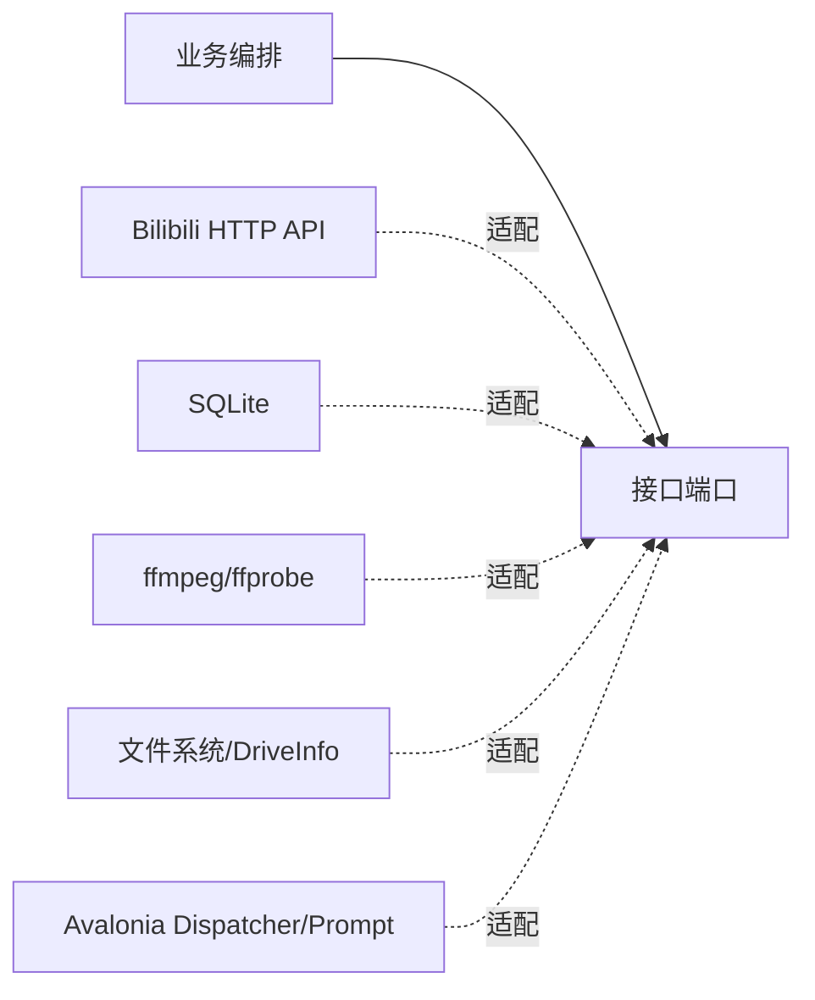

# 08. 设计模式与 SOLID 评析

## 总结

BiliDownloader 的主设计不是套用某一种经典模式，而是围绕四个风险拆边界：

- 多种内容来源需要扩展，但下载链路应稳定。
- UI 确认与后台任务提交之间存在并发竞态。
- 网络、磁盘和 ffmpeg 副作用必须可测试、可恢复。
- Document、Tool、插件和任务有不同生命周期。

因此代码组合使用 Strategy、Registry、Facade、Adapter、Repository、Mediator、Snapshot、State Machine 和 Write-behind Queue。
这些名称描述已经存在的职责，不要求每个对象都套一层模式。G12 的 Host 接入尤其只使用构造注入、
私有 Provider、Document Scope、窄 Host Port、不可变 readiness 快照与幂等释放。

## 设计模式映射

### 1. Strategy（策略模式）

| 策略族 | 接口 | 实现示例 | 解决的问题 |
|---|---|---|---|
| 内容来源 | `IContentSourceProvider` | `DirectLinkProvider`, `FavoriteSourceProvider` | 新来源不侵入下载工作区。 |
| 文件冲突 | `IFileConflictStrategy` | Skip、Overwrite、Resume、AutoNumber | 冲突决策独立于预检编排。 |
| 媒体选择 | `IMediaStreamSelectionPolicy` | `MediaStreamSelectionPolicy` | 将复杂选择规则变为纯函数。 |
| 输出策略 | `IOutputArtifactPolicy` | `OutputArtifactPolicy` | UI、预检、执行共用输出矩阵。 |
| Extras | `IExtrasHandler` | Cover、Subtitle、Danmaku | 主执行器不感知具体附加资源。 |
| 格式化 | `ISubtitleFormatter`, `IDanmakuFormatter` | SRT/ASS/VTT、XML/ASS/JSON | 新格式按注册扩展。 |

策略模式在这里不是只为“优雅”，而是让每种规则可以单独测试，尤其适合媒体选择和文件冲突这种组合分支很多的逻辑。

### 2. Registry（注册表）

`ContentSourceProviderRegistry`、`ExtrasHandlerRegistry`、字幕/弹幕 formatter registry 都把稳定 key 映射到策略。

Provider registry 还承担启动时验证：拒绝重复 Kind、非法能力位、错误能力版本和目录/解析 Kind 不一致。把歧义尽早变成启动错误，使运行期查找确定。

### 3. Facade（外观模式）

- `DownloadSubmissionService` 隐藏“预检 + Coordinator 提交”的组合。
- `SubmissionPreflightService` 聚合登录、ffmpeg、媒体、路径、容量、冲突与去重检查。
- `BiliDownloadTaskExecutor` 聚合主媒体执行和 Extras。

Facade 让 ViewModel 和 Coordinator 都不必知道大量协作者的组合细节。

### 4. Adapter / Ports and Adapters

外部系统都放在窄端口后面：

代表端口包括 `IBiliMediaProbe`、`IDownloadTaskRepository`、`IMediaMuxer`、`IStorageCapacityProvider`、`IUiDispatcher` 和 `IUserPromptService`。

### 5. Repository（仓储模式）

`IDownloadTaskRepository` 隔离任务状态机与 SQLite；`ITaskHistoryReadRepository` 为历史查询提供更窄的读模型。设置、预设和凭据也各有独立仓储接口。

收益：

- Coordinator 测试可使用内存仓储。
- SQL schema 和迁移不泄漏到 UI。
- 任务写模型与历史读模型可以分别演进。

### 6. Mediator / Message Bus

宿主消息总线解耦 Document 与插件级 Coordinator。Document 不必持有 Tool，Tool 也不必知道有哪些 Document。

消息只承担通知和兼容命令，不代替 SQLite 事实源。这个限制很重要：Mediator 适合解耦，不适合当持久化数据库。

### 7. Immutable Snapshot（不可变快照）

`DownloadSubmission`、`DownloadProfileSnapshot`、`PreparedSubmission` 和 `TaskRuntimeSnapshot` 都将某个时刻的事实固化。

- 提交快照防止 UI 后续修改影响任务。
- 预检报告加 fingerprint 支持乐观并发控制。
- 运行快照保证一次 SQLite 写入包含相互一致的进度字段。

### 8. State Machine（状态机）

Coordinator 以 `DownloadTaskStatus` 管理任务，并明确区分暂停、取消、等待登录、中断和失败。状态迁移与控制命令集中在一个服务中，避免多个 ViewModel 各自修改状态字符串。

### 9. Write-behind + Coalescing Queue

`DownloadProgressTracker` 入口节流，`ProgressWriteChannel` 消费端合并并串行写入。它同时解决：

- 高频写入成本。
- 同任务写入乱序。
- 队列无限增长。
- 终态前必须 Flush。

### 10. Two-phase check/commit

预检与提交类似“两阶段”协议：先形成可供用户确认的报告，再在锁内复检并提交。它不是分布式两阶段提交，但使用了相同的核心思想：准备结果不能直接当作最终事实。

## SOLID 对照

### S：单一职责原则

做得较明显的拆分：

- `VideoParseViewModel` 管输入和解析交互，不负责下载。
- `DirectLinkProvider` 管直接链接语义，不负责 UI。
- `MediaStreamSelectionPolicy` 只选择流，不访问网络。
- `MultiConnectionDownloader` 只管 HTTP 字节传输与协议校验。
- `FfmpegService` 只管运行时定位与媒体进程。
- `DownloadProgressTracker` 只管进度投影和持久化队列。
- `DocumentStateMapper` 只管当前 Document V3 的快照映射、版本校验和内容校验，不迁移历史文件。

现实取舍是 `BiliDownloadCoordinator` 仍然较大，因为它集中承载状态机、控制命令、生命周期和原子提交。这里的“大”不完全等于职责混乱：这些职责共享同一任务事实和锁。不过后续可按“提交端口、调度循环、任务控制、重试命令”继续拆成内部协作者。

### O：开放封闭原则

扩展良好的位置：

- 新内容源通过 Provider 注册。
- 新 Extras 通过 Handler 注册。
- 新字幕/弹幕格式通过 Formatter 注册。
- 新冲突策略通过 `IFileConflictStrategy` 注册。

限制：`ExtrasHandlerRegistry.Resolve` 当前按固定 if 顺序识别三种内置类型；新增完全独立 Extras 除了注册类外，还要扩展 `ExtrasType` 和 Resolve 映射。若未来需要第三方动态扩展，可让 Handler 自己声明 flag 和 order。

### L：里氏替换原则

接口实现通常可替换，尤其是仓储、运行时、容量、ffmpeg process 和执行器测试替身。

Provider 通过注册表的声明校验增强可替换性：同一 `Kind`、正确能力位和能力版本是实现必须遵守的契约。分页累加器和物化器进一步验证 continuation token 与快照不变量，避免“实现了接口但行为不兼容”。

### I：接口隔离原则

这是插件中最突出的 SOLID 实践之一：

- `IContentSourceProvider` 与 `IContentSourceResolutionProvider` 分离，课程可以只浏览。
- `IFfmpegRuntimeLocator`、`IMediaMuxer`、`ISubtitleMediaMuxer`、`IMediaMuxerCapabilityProvider` 分离。
- `IDownloadTaskExecutor`、`IMediaMergeRetryExecutor`、`IExtrasRetryExecutor` 分离。
- `IBiliSessionApi`、`IBiliCredentialProvider`、`IBiliAccountContext` 分离。
- `IDownloadTaskRepository` 与 `ITaskHistoryReadRepository` 分离。

同一个具体类可以实现多个接口，但消费者只依赖所需的最小能力。

### D：依赖倒置原则

高层服务通常依赖接口：

- Coordinator → repository、executor、tracker、credentials、recovery。
- Preflight → credentials、ffmpeg locator、size estimator、capacity、policies。
- Download service → muxer、HTTP factory、runtime、selection/output policies、verifier。
- Provider → API contract、account/credential contract。

`BiliDownloaderPluginModule` 作为组合根负责把具体实现装配进去。

存在一些向后兼容构造函数会在类内部 `new` 默认具体实现，例如独立构造 `BiliDownloadService` 或 `MultiConnectionDownloader`。生产路径仍走 DI，但这些兼容入口减弱了纯粹的依赖倒置。维护时应避免在新生产代码继续使用兼容构造函数。

G12 进一步明确了 Host/插件的 DIP 边界：Host 只通过最终 SDK 契约激活普通 Document/Tool 模型，插件
不引用 Host 或 Dock；`BiliDownloaderViewModel` 强制注入 `IDocumentLifetime`，Tool 只依赖
`IBiliDownloaderPluginReadiness` 的只读投影，目录与 FFmpeg 选择只依赖 `IUserPromptService`。没有
通过全局窗口、Host 生命周期 Manager 或服务定位器取得隐式依赖。

readiness 刻意不是通用状态机框架。Lifecycle 是唯一写入者，只推进
`NotStarted → Initializing → Ready → Stopping → Stopped/Faulted`；Tool 是只读观察者。这样既满足
SRP/ISP，也避免插件复制 Host 的超时、隔离、顺序与诊断职责。具名事件处理器和幂等 `Dispose` 则让
singleton Tool 的隐藏复用与最终释放都可直接验证。

## 关键设计为何这样做

### 为什么解析结果与任务记录分开

解析模型适合 UI，包含选择状态和可观察属性；任务记录需要不可变且跨进程。直接持久化 `BiliVideoItem` 会把展示状态、网络结果和执行事实耦合在一起。

### 为什么预检返回报告而不是抛异常

一次提交可能同时存在多个可修复问题。结构化报告可以展示“3 项可提交、1 项跳过、2 个警告、1 个阻止”，并为 UI 提供明确动作。异常适合不可预期失败，不适合批量业务决策。

### 为什么显式选择不自动降级

用户选择 HDR、Dolby Vision、Hi-Res、Atmos 或特定编码，本质上是输出契约。静默降级可能产生看似成功但不符合预期的文件，也会破坏 rendition 去重身份。自动模式才拥有按规则回退的授权。

### 为什么 staging 位于最终目录

最终目录可能在另一块磁盘。若 staging 在插件 temp 目录，`File.Move` 可能变成跨卷失败或需要非原子复制。同目录 staging 保证发布步骤可以是同卷原子替换/移动。

### 为什么 Extras 失败不推翻主媒体

主媒体通常体积大、成本高。封面或某条字幕失败不应把已验证媒体标记为失败，更不应在重试 Extras 时重新下载主媒体。结构化部分成功更符合实际用户价值。

### 为什么消息总线之外仍需要 repository

消息是瞬时通知，Document 可能未打开、订阅可能晚于任务开始。SQLite 才能跨进程、跨 UI 生命周期解释事实。消息只用于提高响应性。

## 扩展场景指南

## P1-G10 的模式与 SOLID 取舍

带宽实现优先使用窄接口而非把策略堆进下载器：`IBandwidthLimiter` 符合 DIP，`IBandwidthClock` 隔离时间，控制端口与读取端口符合 ISP；settings 应用服务、令牌桶、任务注册表和 UI 各自承担单一职责。新增另一种整形算法时可替换 limiter，而无需修改 HTTP 读取循环，体现 OCP。

务实使用三种模式：Token Bucket 解决长期吞吐和小突发；Round Robin 解决多任务公平；Composite 解决全局与任务约束交集。没有为只有一个实现的数值校验或日志再建立工厂层。任务激活使用 lease，是为了让 finally 可证明释放，不是为了引入通用资源框架。

一个刻意取舍是 Coordinator 的兼容构造路径仍可创建默认任务 limiter，保证大量旧测试和宿主调用不被一次性破坏；生产 DI 始终注入单例端口。后续移除兼容构造函数时，应先迁移所有调用方，而不是让生产链路出现两个任务注册表。

### 新增内容来源

优先新增 Provider 与 API 窄接口；不要在 `VideoParseViewModel` 中加入新的大分支。只浏览的来源不要实现解析接口。

### 新增媒体输出模式或容器

先修改 `IOutputArtifactPolicy` 的唯一规则源，再覆盖：

- 组合合法性。
- 扩展名。
- 特征承载能力。
- rendition canonicalization。

之后再扩展 `MediaStreamSelectionPolicy` 和 muxer。不要只改 UI 下拉框，否则预检和执行会拒绝或产生身份漂移。

### 新增 Extras

实现 `IExtrasHandler`，定义稳定结果 key，使用 `ExtrasOutputWriter` 发布，不直接覆盖目标文件。错误不得包含 Cookie 或签名 URL，并应区分 Unavailable 与 Failed。

### 新增任务状态

必须同时检查：

- `DownloadTaskStatus` 与存储映射。
- Coordinator 调度筛选和状态迁移。
- 启动恢复语义。
- UI converter。
- 历史查询与批量控制。
- 终态/活动态判断。

状态不是显示文本，而是持久化协议的一部分。

## 可改进点

以下不是当前功能缺陷，而是代码继续增长时值得关注的演进方向：

1. 将超大的 `BiliDownloadCoordinator` 内部拆成提交事务、调度循环、控制命令和重试服务，同时保留单一状态事实和锁顺序。
2. 让 Extras registry 由 Handler 声明 flag/order，减少固定分支。
3. 逐步移除生产类中的兼容构造函数，避免新代码绕过 DI。
4. `BiliApiService` 同时承载 URL 提取、WBI、内容、DASH、字幕和弹幕适配；可按远端领域拆成多个内部 client，同时继续通过现有窄接口暴露。
5. 将 API 动态 JSON 映射逐步替换为明确 DTO，可提高协议变化的可检测性。
6. 为文档集增加自动化链接与 Mermaid 语法检查，避免类重命名后说明漂移。

## 架构判断清单

修改代码前可以用以下问题判断应该放在哪里：

| 问题 | 应放置的层 |
|---|---|
| 这是某一种来源特有的规则吗？ | ContentSource Provider/API adapter |
| 这是所有提交都必须检查的规则吗？ | Preflight 或纯 Policy |
| 这是任务何时运行、变为什么状态吗？ | Coordinator |
| 这是怎样获取或写入媒体字节吗？ | Executor / DownloadService / Downloader |
| 这是容器、编码或扩展名的确定性规则吗？ | Output/Selection Policy |
| 这是 UI 展示和交互状态吗？ | ViewModel/View/Converter |
| 这是跨进程事实吗？ | Repository/Document mapper，先明确属于哪一种持久化 |
| 这是外部系统调用吗？ | 窄接口后的 Infrastructure/API adapter |

只要持续守住“解析、提交、调度、执行、持久化”这几个边界，插件可以增加来源和输出能力，而不会让所有变化重新汇聚成一个难以测试的大流程。
