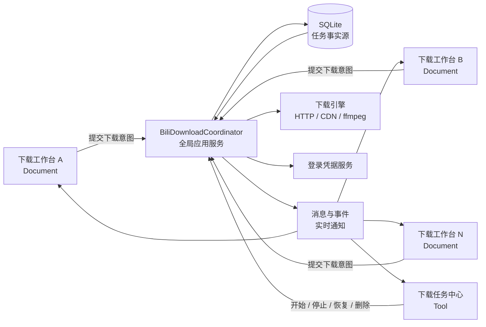

# BiliDownloader 产品文档

> 文档定位：产品与开发共同使用的产品基线  
> 产品形态：MyAvaloniaManagement 内的 Bilibili 下载插件  
> 当前平台：Windows / Linux
> 竞品调研日期：2026-07-20  
> 文档状态：V1.1（G3–G5 闭环重构完成）

> 2026-08-03 产品基线更新：G6 已完成四种文件冲突策略、统一提交预检、批量结果汇总、SQLite 原子路径保留、执行前磁盘复检和 staging 安全替换；旧 Document 默认迁移为自动序号，不允许静默覆盖。详细证据见 [G6 文件冲突与提交预检](../plan-history/G6-FILE-CONFLICT-SUBMISSION-PREFLIGHT.md)。

> 2026-08-09 产品基线更新：P1-G9 已完成多语言字幕、SRT/ASS/VTT、MP4/MKV 软字幕、弹幕 XML/ASS/JSON、结构化结果及附加资源独立重试；离线 Release 测试通过，固定版 ffmpeg 与 B 站实网发布验收待执行。详细证据见 [P1-G9 字幕、软字幕与弹幕增强](../plan-history/P1-G9-SUBTITLE-DANMAKU-ENHANCEMENT.md)。

> 2026-08-10 产品基线更新：P1-G10 已完成全局/单任务主媒体限速、运行时热更新、快照 v4、SQLite 迁移和离线门禁；固定版 ffmpeg、实网与桌面发布验收未完成，仍不可宣称 P1 正式发布。详细证据见 [P1-G10 限速与总验收](../plan-history/P1-G10-BANDWIDTH-REGRESSION-RELEASE-ACCEPTANCE.md)。

## 目录

- [1. 产品概述](#1-产品概述)
- [2. 用户与使用场景](#2-用户与使用场景)
- [3. 产品原则与范围](#3-产品原则与范围)
- [4. Tool / Document 产品架构](#4-tool--document-产品架构)
- [5. 产品信息架构](#5-产品信息架构)
- [6. 核心用户流程](#6-核心用户流程)
- [7. 异常与恢复流程](#7-异常与恢复流程)
- [8. 当前能力基线](#8-当前能力基线)
- [9. 功能路线图](#9-功能路线图)
- [10. 竞品参考](#10-竞品参考)
- [11. 产品指标与验收标准](#11-产品指标与验收标准)
- [12. 安全、合规与非功能要求](#12-安全合规与非功能要求)
- [13. 版本边界与架构约束](#13-版本边界与架构约束)

---

## 1. 产品概述

### 1.1 一句话定义

> BiliDownloader 是基于 MyAvaloniaManagement Tool / Document 架构的个人 B 站批量、增量离线下载与任务管理工具。

### 1.2 产品背景

普通下载器通常以“粘贴一个链接，下载一个视频”为核心。实际的个人使用场景往往更复杂：用户需要反复下载多 P、番剧、收藏夹或某个 UP 主的内容，并希望复用相同的画质、命名和目录规则；下载过程中还需要统一管理长时间运行的队列、失败任务与历史记录。

BiliDownloader 已经具备视频解析、批量任务、多连接下载、断点续传、任务持久化和 ffmpeg 合并等基础能力。下一阶段不再单纯追求“多支持一种链接”，而是围绕以下三个方向建立产品价值：

1. **多来源批量下载**：从单链接扩展到用户自己的内容来源。
2. **可复用下载方案**：将内容源、选择规则、质量、命名和目录保存为 Document。
3. **全局任务调度**：所有 Document 共用一个稳定、可恢复、可批量操作的任务中心。

### 1.3 核心价值

| 用户问题 | 产品能力 | 用户价值 |
| --- | --- | --- |
| 每次下载都要重复配置 | 可保存的下载方案与预设 | 减少重复操作 |
| 多 P、番剧或收藏内容需要逐条处理 | 批量解析、筛选和提交 | 提升批量处理效率 |
| Document 关闭后仍要观察下载 | 全局下载任务中心 | 下载与编辑页面生命周期解耦 |
| 网络中断或程序退出导致重来 | 断点续传、状态持久化、手动恢复 | 减少时间和流量损失 |
| 文件命名与目录杂乱 | 命名模板、冲突策略和归档规则 | 下载结果可直接使用 |
| 不清楚失败原因和处理方法 | 可行动的错误提示与诊断 | 降低排障成本 |

### 1.4 产品阶段

当前产品处于“下载内核基本可用，产品管理能力待完善”的阶段：

- 下载执行链路已经形成。
- Tool / Document 的结构方向正确。
- 任务中心、配置复用、内容源和安全体验仍需产品化。
- 当前优先服务个人效率，不以公开发行软件的完整商业化体验为第一目标。

---

## 2. 用户与使用场景

### 2.1 目标用户

主要用户是需要在 Windows 本地保存本人有权访问的 B 站内容，并经常进行批量、重复下载的个人用户，包括：

- 希望离线观看多 P、番剧或课程内容的用户。
- 需要定期归档收藏夹或特定 UP 主投稿的用户。
- 需要同时保存字幕、弹幕和封面的资料整理用户。
- 使用 Emby、Jellyfin 或 Kodi 管理个人媒体库的进阶用户。

### 2.2 核心使用场景

#### 场景 A：临时下载

用户粘贴一个 BV/AV、短链或番剧链接，选择需要的分集和质量后立即提交下载。

#### 场景 B：批量下载

用户解析一个多 P 或番剧集合，批量选择内容、统一重命名并提交到全局任务中心。

#### 场景 C：多个下载方案并行工作

用户打开多个下载 Document，分别处理不同内容。所有任务进入同一个 Tool，Document 只展示与自身关联的状态。

#### 场景 D：中断后恢复

应用异常退出或用户停止下载。再次启动时任务不会擅自联网，而是显示为“已中断”，由用户确认后继续。

#### 场景 E：增量归档

用户保存一个收藏夹、UP 主或订阅合集 Document。下次打开时检查远端变化，仅选择新增且本地不存在的内容下载。

---

## 3. 产品原则与范围

### 3.1 产品原则

1. **用户确认优先**：历史任务和增量内容必须经用户确认后才能开始下载。
2. **Document 表达意图，Tool 管理执行**：配置与执行状态不能混为一体。
3. **SQLite 保存事实，消息只做通知**：任何 UI 都可以通过持久化状态恢复。
4. **批量操作优先**：功能设计必须考虑 100 个任务，而不只考虑单个任务。
5. **可恢复优先于自动化**：先保证暂停、恢复和重试正确，再增加无人值守能力。
6. **默认简单，高级可配置**：新用户能快速提交，进阶用户可控制编码、格式和归档规则。
7. **仅使用合法访问权限**：不绕过付费墙、会员权限或平台鉴权。

### 3.2 当前范围

- Windows 桌面端。
- MyAvaloniaManagement 插件形态。
- Bilibili 中国站中用户账号有权访问的普通视频和番剧内容。
- DASH 音视频下载、ffmpeg 封装与相关附加资源。
- 本地任务和设置持久化。

### 3.3 非目标

- 直播录制和直播间监控。
- 绕过付费、会员或区域权限。
- 专业视频剪辑、转码工作站。
- 当前阶段的多语言和全平台发行。
- 应用启动后无人确认地自动恢复历史下载。
- 将下载内容上传、分享或重新分发。

---

## 4. Tool / Document 产品架构

### 4.1 总体关系



### 4.2 下载工作台（Document）

#### 产品定位

一个 Document 代表一个独立的“下载方案工作区”。用户可以同时创建多个 Document，也可以将其保存后再次打开。

#### 当前职责

- 登录状态入口。
- URL 输入与解析。
- 解析结果和分集选择。
- 画质、音质、输出目录和附加资源配置。
- 批量重命名。
- 提交下载任务。
- 按 `DocumentId` 展示本 Document 关联任务的实时状态。
- 保存 `DocumentId`、URL、输出目录等部分配置。

#### 目标职责

- 保存完整内容源和下载规则。
- 保存下载预设、命名模板、冲突策略和筛选条件。
- 展示上次检查结果以及远端新增内容。
- 展示本 Document 关联任务的投影，但不成为任务事实源。

#### 明确不负责

- 不直接创建或持有下载线程。
- 不直接执行 ffmpeg。
- 不维护独立任务队列。
- 不因为 Document 被关闭而取消已经提交的任务。

### 4.3 下载任务中心（Tool）

#### 产品定位

Tool 是宿主中的全局下载控制面板。面向用户统一使用“下载任务中心”名称；代码中的 `BiliSchedulerToolViewModel` 等类型名可暂时保持不变。

#### 当前职责

- 展示所有 Document 提交的任务。
- 展示视频、音频和合并阶段进度及下载速度。
- 全局启动或停止调度。
- 对失败或中断任务进行重试。
- 删除任务、清除已完成任务、打开文件位置。
- 配置 ffmpeg、默认输出目录和并发下载数。

#### 目标职责

- 按状态、Document、标题和时间筛选任务。
- 支持多选和批量控制。
- 支持单任务暂停、继续、重来和取消。
- 展示预计大小、剩余时间、质量、编码和输出路径。
- 提供历史记录、诊断和临时文件清理入口。

#### 生命周期要求

- 宿主只创建一个 Tool 实例。
- Tool 被隐藏或恢复时，不影响已经由用户启动的任务。
- Tool 不是下载引擎的生命周期所有者；全局 Coordinator 才是。

### 4.4 BiliDownloadCoordinator

Coordinator 是 Document 和 Tool 之外的全局应用服务，也是唯一允许拥有下载执行循环的组件。

核心职责：

- 接收和持久化新任务。
- 串行处理控制命令，避免启动、停止和删除竞争。
- 维护任务状态机和并发槽位。
- 调用下载引擎、附加资源处理器和 ffmpeg。
- 管理取消、暂停、恢复、重试和有序退出。
- 持久化关键状态并发布实时事件。
- 从凭据服务获取当前登录态，不在任务中长期保存 Cookie。

架构约束：Tool 和 Document 均不得自行创建第二个 Coordinator、第二套队列或第二个后台下载循环。

### 4.5 SQLite、Document 保存文件与消息

| 数据 | 唯一事实源 | 说明 |
| --- | --- | --- |
| 下载方案 | Document 保存文件 | 内容源、筛选、质量、命名、目录和附加资源配置 |
| 下载任务 | SQLite | TaskId、DocumentId、阶段、进度、临时文件和输出结果 |
| 登录凭据 | 凭据存储 | 与任务库隔离，使用每安装随机 key 的 AES-256-GCM 密文存储 |
| 实时进度 | Coordinator 内存状态 | 先按策略持久化，再向 UI 通知 |
| UI 通知 | 消息总线或事件 | 可丢失，不可作为恢复依据 |

- `DocumentId`：持久标识下载方案来源，用于过滤和恢复任务投影。
- `TaskId`：标识一个具体下载项及其生命周期。
- Document 保存文件不能复制完整任务执行状态。
- SQLite 不能取代 Document 保存内容源和用户规则。
- 高频进度可以节流写入；阶段切换、暂停、失败、完成和删除必须等待持久化成功后再通知 UI。

### 4.6 功能归属矩阵

| 能力 | Document | Tool | Coordinator | 基础服务 |
| --- | :---: | :---: | :---: | :---: |
| 链接或内容源解析 | 主责 |  | 编排边界 | Bili API |
| 分集与下载规则配置 | 主责 |  |  |  |
| 提交下载任务 | 发起 |  | 主责 | SQLite |
| 全局任务列表 | 关联投影 | 主责 | 提供状态 | SQLite |
| 单任务/批量控制 |  | 发起 | 主责 |  |
| 下载与断点续传 |  |  | 编排 | 下载引擎 |
| ffmpeg 合并 |  | 展示设置 | 编排 | ffmpeg 服务 |
| 登录凭据 | 展示登录状态 | 展示等待登录 | 获取当前凭据 | 凭据服务 |
| 方案保存与打开 | 主责 |  |  | 宿主保存机制 |
| 任务恢复 | 展示关联状态 | 提供恢复入口 | 主责 | SQLite / 临时文件 |

---

## 5. 产品信息架构

### 5.1 下载工作台（Document）

```text
下载工作台
├─ 登录状态
├─ 内容源
│  ├─ 当前：BV / AV / b23.tv / EP / SS
│  └─ 规划：UP / 收藏夹 / 稍后再看 / 历史 / 订阅 / 课程
├─ 解析结果
│  ├─ 搜索与筛选
│  ├─ 分集选择
│  └─ 本地已存在状态
├─ 下载配置
│  ├─ 下载预设
│  ├─ 视频质量 / 编码 / 容器
│  ├─ 音频质量 / 输出方式
│  ├─ 字幕 / 弹幕 / 封面
│  ├─ 命名模板 / 文件冲突策略
│  └─ 输出目录
├─ 提交确认
└─ 本方案关联任务
```

### 5.2 下载任务中心（Tool）

```text
下载任务中心
├─ 状态总览
├─ 搜索 / 筛选 / 排序
├─ 任务列表
│  ├─ 单任务控制
│  ├─ 多选批量操作
│  └─ 错误与行动建议
├─ 历史记录
├─ 全局设置
│  ├─ 并发数
│  ├─ 限速
│  ├─ 默认输出目录
│  └─ ffmpeg 管理
└─ 诊断与清理
```

### 5.3 默认与高级配置

- 首屏保留内容源、解析按钮、分集列表、下载预设和提交按钮。
- 编码、容器、字幕格式、命名模板等进入高级配置。
- 用户选择过的预设和输出目录应记忆。
- 解析成功后默认选择兼容性最高的可用质量组合，不替用户选择无权访问的清晰度。

---

## 6. 核心用户流程

### 6.1 单链接下载

1. 用户新建“下载工作台”。
2. 粘贴 BV/AV、B 站视频 URL、b23.tv 短链或番剧 URL。
3. 点击解析，系统展开短链并获取视频集合、分集、画质和音频流。
4. 用户选择分集和下载预设，必要时调整高级设置。
5. 系统在提交前校验登录态、ffmpeg、输出目录、磁盘空间和文件冲突。
6. 用户点击提交，Document 生成任务意图并交给 Coordinator。
7. Coordinator 批量写入 SQLite 后启动新任务。
8. Tool 展示全局任务；Document 展示与自身 `DocumentId` 关联的任务。

目标是从输入链接到提交下载不超过 3 个主要操作：解析、选择、提交。

### 6.2 多 Document 协同

1. 用户打开多个下载工作台。
2. 每个 Document 拥有稳定且持久化的 `DocumentId`。
3. 各 Document 可以使用不同的内容源、目录和下载规则。
4. 所有任务提交到同一个 Coordinator 和任务中心。
5. 消息携带目标 `DocumentId`，Document 只处理自己的任务状态。
6. 某个 Document 关闭后，已经提交的任务不被取消。

### 6.3 保存与重新打开下载方案

目标状态下，Document 保存以下信息：

- `DocumentId` 与显示名称。
- 内容源类型及稳定标识。
- 最近一次解析参数和筛选条件。
- 下载预设、质量、编码、容器和输出类型。
- 字幕、弹幕、封面等附加资源配置。
- 命名模板、目录规则和冲突策略。
- 上次检查时间和增量比较基线。

重新打开时：

1. 恢复方案配置，不自动提交任务。
2. 从 SQLite 查询关联任务并建立状态投影。
3. 远端内容必须由用户点击“重新解析”或“检查更新”后获取。

### 6.4 增量下载（P1）

1. 用户在 Document 中保存收藏夹、UP 主或订阅合集来源。
2. 用户点击“检查更新”。
3. 系统分页获取远端内容，并与任务历史及本地文件比较。
4. 结果分为：新增、已下载、下载中、已失效、规则排除。
5. 默认只勾选新增内容，不自动提交。
6. 用户确认后创建任务，并更新本次检查时间。

---

## 7. 异常与恢复流程

### 7.1 应用异常退出

- 初始化时只加载数据库、迁移状态、检查本地依赖并展示历史任务。
- 上次退出时处于下载或合并阶段的任务统一转为“已中断”。
- 启动阶段不得自动请求 DASH、下载文件或启动 ffmpeg。
- 用户在任务中心点击恢复后，Coordinator 才允许任务重新进入 Ready。
- 恢复时以临时文件长度和完整性校验为准，SQLite 字节数只作为辅助信息。

### 7.2 登录失效

- 需要登录权限的任务进入“等待登录”，而不是直接失败。
- Tool 和 Document 显示“重新登录”操作。
- 登录成功后由用户确认恢复等待任务。
- 退出登录时不得继续使用任务记录中的旧 Cookie。

### 7.3 ffmpeg 缺失或不可用

- 提交前明确提示缺失状态。
- P0 提供一键下载、校验、重选路径和重新检测。
- 已下载完成但等待合并的任务保留临时音视频，不应被标记为永久失败。
- 修复 ffmpeg 后允许只重试合并阶段。

### 7.4 网络和 CDN 失败

- 单个分块在同一 CDN 有限重试后切换备用 CDN。
- Range 响应必须校验 `206` 和 `Content-Range`，避免损坏文件。
- DASH URL 过期时重新获取元数据后继续。
- 错误信息区分网络超时、权限、资源失效、磁盘和合并错误。

### 7.5 磁盘空间不足

- 提交时依据可用信息预估空间；开始写入前再次检查。
- 空间不足时暂停任务并保留可恢复临时文件。
- UI 显示所需空间、可用空间和“更换目录”入口。

### 7.6 文件冲突

Document 必须提供并保存一种明确策略：

- 跳过已有文件。
- 覆盖已有文件。
- 校验后继续未完成文件。
- 自动追加序号。

批量提交前展示冲突数量，不允许静默覆盖。

### 7.7 附加资源失败

- 字幕、弹幕或封面失败不改变主视频“已完成”状态。
- 任务记录分别展示附加资源结果。
- 用户可以只重试失败的附加资源，不重新下载音视频。

### 7.8 删除活动任务

删除顺序必须为：取消任务 → 等待网络流和 ffmpeg 退出 → 释放文件 → 删除数据库记录 → 按用户选择清理临时文件或成品。

“删除任务记录”和“删除本地文件”必须是两个可区分的用户选择。

---

## 8. 当前能力基线

状态说明：

- **已实现**：当前代码已具备主要执行链路。
- **部分实现**：已有基础模型或服务，但 UI、完整流程或可靠性尚未闭环。
- **未实现**：进入路线图，不应在当前产品介绍中宣称支持。

| 产品域 | 能力 | 状态 | 当前说明 |
| --- | --- | --- | --- |
| 登录 | 二维码登录与历史登录态验证 | 已实现 | 启动先本地恢复、后台验证并缓存账号资料；断网保留历史密文 |
| 解析 | BV、AV、普通视频 URL | 已实现 | 支持单视频和多 P |
| 解析 | b23.tv 短链 | 已实现 | 自动展开并回写真实链接 |
| 解析 | 番剧 EP、SS | 已实现 | 按账号合法权限获取内容 |
| 来源 | UP、收藏夹、稍后再看、历史 | 已实现 | P1-G1 统一 Provider、分页、选择与既有下载配置工作流 |
| 来源 | 追番、追剧、订阅合集 | 已实现 | P1-G2 层级浏览、权限徽标和可用媒体解析；真实账号发布验收待执行 |
| 来源 | 课程 | 部分实现 | 可发现、分页、按 ss/ep 浏览与展示权限；暂不可提交下载 |
| 选择 | 分集选择、全选和全不选 | 已实现 | 适用于当前解析结果 |
| 下载配置 | 视频画质、音频质量、编码、容器与输出模式 | 已实现 | AVC/HEVC/AV1，MP4/MKV，音视频/仅视频/仅音频；显式编码不可用不降级 |
| 下载配置 | 批量重命名、序号、分组目录 | 已实现 | 尚无变量化命名模板 |
| 下载配置 | 下载预设与完整配置记忆 | 部分实现 | 仅保存部分目录和 Document 配置 |
| 附加资源 | 多语言字幕与软字幕 | 部分实现 | SRT/ASS/VTT 外置、MP4 mov_text、MKV SubRip/ASS、手动语言检测和独立重试已完成；固定版 ffmpeg 发布门禁待执行 |
| 附加资源 | 弹幕 XML/ASS/JSON | 已实现 | 360 秒分段、ID 去重、确定性排序/ASS 轨道、部分失败独立重试 |
| 附加资源 | 封面 JPG | 已实现 | 尚无原格式和媒体内嵌 |
| 下载内核 | 多连接分块与 CDN 回退 | 已实现 | 需持续完善协议级校验 |
| 下载内核 | 断点续传 | 已实现 | 基于 Range 和临时分块文件 |
| 下载内核 | 并发任务 1–5 | 已实现 | Tool 中配置 |
| 下载内核 | 全局与单任务主媒体限速 | 实现完成，待发布验收 | 公平共享、分块聚合、运行时热更新；0 不限速，最小 64 KiB/s |
| 输出 | DASH stream copy 与原生音频发布 | 已实现 | MP4/MKV 支持音视频和仅视频；普通 AAC 仅音频原子发布为 M4A |
| 输出 | AVC/HEVC/AV1 主动选择、MKV、仅音频 | 已实现 | P1-G7；实际编码、容器和模式进入任务与历史事实 |
| 任务 | SQLite 持久化与三阶段进度 | 已实现 | SQLite 为任务事实源 |
| 任务 | 启动后标记已中断并手动恢复 | 已实现 | 不自动恢复历史任务 |
| 任务 | 全局启动/停止、失败重试、删除、打开文件 | 已实现 | 任务中心基础能力 |
| 任务 | 单任务暂停/继续、批量操作、筛选搜索 | 未实现 | P0 |
| 架构 | 可测试下载执行边界与离线测试骨架 | 已实现 | Coordinator 可使用假执行器验证成功、失败和取消路径 |
| 架构 | 插件初始化与有序关闭 | 已实现 | BiliDownloader 接入生命周期；MyPlugTest 仅接入 DI；其余插件保持历史流程 |
| 依赖 | ffmpeg 检测、自定义路径与一键修复 | 已实现 | Windows x64 使用固定版本和 SHA-256 清单安装，不修改 PATH；其他平台可自定义路径 |
| 诊断 | 十类错误摘要与行动入口 | 已实现 | Tool 任务卡片、紧凑菜单和 Document 预检提供登录、修复、迁移目录、重试合并及日志入口 |
| 安全 | Cookie 与任务解耦 | 已实现 | 提交消息、任务模型和新任务表均不包含 Cookie |
| 安全 | AES-GCM 加密 Cookie | 已实现 | Windows/Linux 共用；key 与凭据库同目录，防护范围不含整目录泄露 |

---

## 9. 功能路线图

### 9.1 P0：日常好用

P0 目标是让现有下载链路可长期、高频使用，不增加新的内容品类。

| 编号 | 功能 | 产品要求 | 主要归属 |
| --- | --- | --- | --- |
| P0-01 | 单任务控制 | 暂停、继续、重新开始和取消；不影响其他并发任务 | Tool / Coordinator |
| P0-02 | 批量任务操作 | 多选、全选当前筛选结果、批量暂停/继续/重试/删除 | Tool / Coordinator |
| P0-03 | 任务搜索筛选 | 按标题、状态、Document、创建时间筛选和排序 | Tool |
| P0-04 | 任务信息增强 | 展示预计大小、已下载大小、剩余时间、画质和输出路径 | Tool / Coordinator |
| P0-05 | 下载预设 | 内置兼容、质量、归档预设，支持自定义和记忆上次选择 | Document / 设置存储 |
| P0-06 | 命名模板 | 支持标题、序号、BV、UP、发布时间等变量并实时预览 | Document |
| P0-07 | 文件冲突策略 | 跳过、覆盖、校验续传、自动序号；批量提交前汇总冲突 | Document / Coordinator |
| P0-08 | ffmpeg 一键就绪 | **已实现**：一键安装固定精简版本、校验、重新选择和修复 | Tool / ffmpeg 服务 |
| P0-09 | 凭据安全 | AES-GCM 加密；任务表不保存 Cookie；日志和持久化错误不记录敏感值 | 凭据服务 / SQLite |
| P0-10 | 错误行动入口 | **已实现**：十类错误提供结构化摘要及对应修复按钮 | Tool / Document |

#### P0 验收标准

- 暂停一个活动任务不停止其他任务。
- 批量操作对当前筛选结果有明确作用范围和确认提示。
- 100 个任务时可以快速找到失败和等待登录任务。
- 下载预设在新建 Document 后可一键应用。
- 文件冲突不会发生未确认覆盖。
- 未安装 ffmpeg 的用户不需要手动配置 PATH。
- SQLite 任务表和日志中不再出现可复用的明文 Cookie。

### 9.2 P1：个人效率

P1 目标是从“下载单个链接”升级为“管理可重复执行的内容来源”。

| 编号 | 功能 | 产品要求 | 主要归属 |
| --- | --- | --- | --- |
| P1-01 | 多内容源 | UP、收藏夹、稍后再看、历史、追番追剧、订阅合集和课程 | Document / Bili API |
| P1-02 | 大列表筛选 | 分页、关键词、日期和类型筛选，支持选择当前页或全部结果 | Document |
| P1-03 | 可复用方案 | **已实现**：Document V3 完整保存内容源、筛选、预设、命名、输出规则和轻量基线；离线恢复且兼容 V1/V2 | Document 保存机制 |
| P1-04 | 增量检查 | **已实现**：用户主动递归检查重复来源，区分新增、已下载、下载中、失效和规则排除；按媒体与输出指纹跨来源去重，检查不自动提交 | Document / SQLite |
| P1-05 | 输出控制 | **已实现**：AVC/HEVC/AV1，MP4/MKV，音视频/仅视频/仅音频；stream copy、无静默降级、模式化恢复 | Document / 下载引擎 |
| P1-06 | 高规格媒体 | **已实现**：基于结构化证据识别 HDR、杜比视界、Hi-Res 和 Atmos；批量交集、无静默降级、任务事实与发布前 ffprobe 验证 | Document / Bili API / 下载引擎 |
| P1-07 | 字幕弹幕增强 | **实现完成，待发布验收**：稳定语言选择、SRT/ASS/VTT、MP4/MKV 软字幕、弹幕 XML/ASS/JSON、逐项结果和独立重试；按门禁规则暂不标记“已实现” | Document / Extras |
| P1-08 | 历史中心 | **已实现**：活动/历史分区、组合搜索、按需文件检查、新任务重下、CSV/JSON 白名单脱敏与原子导出 | Tool / SQLite |
| P1-09 | 速度控制 | **实现完成，待发布验收**：全局公平共享、单任务分块聚合、运行时热更新，并保留独立并发数设置 | Tool / 下载引擎 |

#### P1 验收标准

- 内容源超过一页时可以稳定分页并保留选择状态。
- 检查更新不会自动创建任务，新增内容必须由用户确认。
- 同一内容不会因来自不同内容源而被重复下载。
- 保存并重新打开 Document 后，下载规则保持一致。
- 输出文件的实际编码、容器和用户选择一致。
- 历史导出不包含 Cookie、签名 URL 或其他敏感数据。

### 9.3 P2：专业归档

| 编号 | 功能 | 产品要求 | 主要归属 |
| --- | --- | --- | --- |
| P2-01 | 媒体库元数据 | 生成 NFO、poster、fanart，兼容 Emby/Jellyfin/Kodi | Extras |
| P2-02 | 章节信息 | 将 B 站章节和番剧分集信息写入输出文件 | Bili API / ffmpeg |
| P2-03 | 完整性检查 | 检测历史文件、临时文件和数据库记录是否一致 | Tool / SQLite |
| P2-04 | 安全清理 | 预览并清理孤立临时文件、缺失成品记录和过期缓存 | Tool |
| P2-05 | 自动更新 | 检查并验证插件更新，显示变更说明 | 宿主 / 插件基础设施 |
| P2-06 | 诊断导出 | 导出脱敏日志、依赖状态和失败摘要 | Tool / 日志服务 |

---

## 10. 竞品参考

竞品用于识别用户预期和成熟能力，不代表需要完整复制。调研日期为 2026-07-20。

| 产品 | 重点能力 | BiliDownloader 借鉴方向 |
| --- | --- | --- |
| [Bili23 Downloader](https://github.com/ScottSloan/Bili23-Downloader) | 多内容源、AVC/HEVC/AV1、MP4/MKV、多格式字幕弹幕、NFO 和命名规则 | 能力覆盖与配置模型 |
| [bilibili-video-downloader](https://github.com/lanyeeee/bilibili-video-downloader) | 自定义目录、NFO、章节、广告标记、限速和批量任务控制 | 文件归档和任务管理 |
| [Bilibili Downloader GUI](https://github.com/j4rviscmd/bilibili-downloader-gui) | ffmpeg 一键安装、自动更新、历史导出、字幕嵌入和凭据加密 | 易用性、安全与产品完成度 |
| [BilibiliDown](https://github.com/nICEnnnnnnnLee/BilibiliDown) | 收藏夹、稍后再看、UP 主批量下载和内置精简 ffmpeg | 高频批量入口和零配置体验 |

[BBDown](https://github.com/nilaoda/BBDown) 与 [BiliTools](https://github.com/btjawa/BiliTools) 已归档，仅作为历史能力基线，不作为持续维护方案或核心依赖。

### 10.1 差异化策略

BiliDownloader 不以“支持最多平台”或“参数最多”为差异点，而是利用宿主架构形成以下组合：

- Document 是可以保存和重复使用的下载方案。
- 多个方案共用一个不会随页面关闭而消失的任务中心。
- 下载执行与编辑页面完全解耦。
- 内容源可以做差异比较和增量提交。
- 用户在同一个工作台体系中管理下载和其他个人工具。

---

## 11. 产品指标与验收标准

### 11.1 核心指标

| 指标 | 目标 |
| --- | --- |
| 快速提交效率 | 从输入链接到提交不超过 3 个主要操作 |
| 中断恢复成功率 | 95% 以上 |
| 批量管理规模 | 100 个任务可通过筛选和批量操作管理 |
| 重复下载控制 | 提交前识别已存在文件和历史已下载内容 |
| 生命周期独立 | Document 关闭或 Tool 隐藏不影响已启动任务 |
| 启动安全 | 应用启动不自动恢复历史网络下载 |
| 凭据安全 | 任务库、导出文件和日志无明文 Cookie |

### 11.2 架构验收场景

#### 多 Document

- 同时打开三个下载工作台并分别提交任务。
- Tool 展示全部任务。
- 每个 Document 只展示自己的任务投影。
- 关闭任一 Document 不取消任务。

#### Tool 隐藏与恢复

- 用户启动任务后隐藏任务中心。
- 下载继续执行，进度继续持久化。
- 恢复 Tool 后从 Coordinator/SQLite 获取最新状态。

#### 异常退出

- 分别在视频下载、音频下载和合并阶段退出。
- 重启后任务统一显示“已中断”，不自动联网。
- 用户点击恢复后从可验证的本地阶段继续。

#### 登录失效

- 下载需要登录权限的内容时使 Cookie 失效。
- 任务进入“等待登录”，不丢失临时文件。
- 重新登录并经用户确认后恢复。

#### 删除活动任务

- 删除活动任务时先停止对应网络和 ffmpeg 操作。
- 不影响其他并发任务。
- 用户可以选择是否同时删除临时文件或成品。

#### 附加资源失败

- 模拟字幕或封面下载失败。
- 主视频仍显示完成。
- Tool 提供仅重试失败附加资源的入口。

---

## 12. 安全、合规与非功能要求

### 12.1 凭据安全

- Cookie 与任务记录分离。
- Windows 与 Linux 使用每安装随机 key 的 AES-256-GCM 保护本地凭据。
- Cookie、最近一次验证成功的用户名和头像保存在同一个加密载荷中，不单独明文缓存。
- 启动验证最长等待 5 秒并在后台执行；网络故障保留登录态，只有服务端明确失效才删除凭据。
- key 以可见 Base64 文本与凭据库保存在同一用户数据目录；目标是消除明文落盘并校验篡改，不抵御整个用户数据目录泄露。
- 退出登录时清除持久化凭据和内存态。
- 日志过滤 Cookie、完整请求头、签名参数和敏感 URL。
- 历史导出与诊断包默认脱敏。

### 12.2 内容合规

- 工具仅用于个人学习、研究和离线使用。
- 只访问用户当前账号具有合法观看权限的内容。
- 不提供破解、解密付费内容或规避平台权限的功能。
- 不提供自动上传、传播或商业分发能力。
- 产品界面和文档应提示用户遵守平台规则、版权和适用法律。

### 12.3 可靠性

- 关键状态变化必须持久化成功后再通知 UI。
- 下载恢复必须校验 HTTP Range 响应和本地文件事实。
- 删除活动任务必须等待网络流、文件句柄和 ffmpeg 退出。
- 附加资源失败与主视频结果解耦。
- 应用关闭时有序取消并 Flush 最后进度。

### 12.4 性能

- Tool 展示 100 个任务时保持可筛选、可滚动和可批量操作。
- UI 进度更新与 SQLite 写入分别节流，避免高频并发写入。
- 大列表内容源使用分页加载，不一次性创建全部 UI 项。
- 并发数和限速由全局调度统一管理。

### 12.5 可观察性

- 记录任务状态转换、CDN 切换、有限重试、SQLite 错误和 ffmpeg 退出码。
- 用户界面只展示简洁错误和下一步行动。
- 详细错误写入本地脱敏日志。

---

## 13. 版本边界与架构约束

### 13.1 当前版本默认假设

- Windows 优先，不承诺当前版本跨平台。
- 产品作为 MyAvaloniaManagement 内部插件运行。
- 使用现有 `IDocumentCreationStrategy` 创建 Document。
- 使用现有 `IToolCreationStrategy` 创建唯一 Tool。
- Document 通过 `ISavableDocument` 接入宿主保存和打开机制。
- `BiliDownloadCoordinator` 为全局单例应用服务。
- SQLite 是下载任务唯一事实源。
- 历史任务在应用启动时只加载和迁移状态，不自动恢复下载。

### 13.2 后续开发必须保持的约束

1. 始终保持“多个 Document、一个全局 Tool、一个 Coordinator、一个任务事实源”。
2. Document 保存下载意图和规则，SQLite 保存执行状态。
3. Tool 的显示、隐藏或视觉树生命周期不控制下载生命周期。
4. 消息总线故障或错过消息后，UI 必须能从 SQLite 恢复。
5. 任务控制命令必须通过 Coordinator 串行协调。
6. 任何自动化下载都必须有明确用户授权，并且不得改变“启动不自动恢复”的默认策略。
7. 新功能必须在本文件中标记为“已实现”后，才能进入面向用户的当前功能介绍。

### 13.3 文档维护规则

- 功能实现、状态机或产品边界变化时同步更新本文档。
- 当前能力表是产品宣称的依据，不能仅依据旧设计文档判断。
- 新增功能进入开发前，应明确其优先级、模块归属和验收场景。
- 竞品信息按需要重新核查，并更新调研日期。
