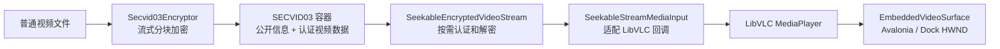

# MySmallTools 安全视频子系统

本文档目录说明 `MySmallTools` 中已经落地的安全视频加密与播放能力。当前实现以 SECVID03 为唯一受支持的容器格式，通过 AES-256-GCM 分块认证、可随机定位的按需解密流和 LibVLC 完成播放，并针对 Avalonia Dock 重建原生视频表面的行为实现了状态恢复。

> 这里的“安全”是指容器固定头、原视频前缀和加密视频块具有密码学完整性保护，且播放器不需要把完整视频解密到内存或临时明文文件。无需密码即可读取的标题、描述和原始文件名属于公开信息，不提供真实性保证。

## 文档导航

| 文档 | 内容 | 适合读者 |
| --- | --- | --- |
| [实施路线图](ROADMAP.md) | 当前基线、阶段时间线、功能依赖、退出条件和统一完成标准 | 产品、开发者、维护者 |
| [G0 完成记录](G0-BASELINE-REAL-MEDIA-LEGACY-CLEANUP.md) | 真实素材、遗留清理、SOLID 边界和 37/15 测试基线 | 开发者、维护者、评审人员 |
| [G1 安全验证](G1-SECVID03-FORMAT-SECURITY-VALIDATION.md) | 五子域整理、威胁模型、固定向量、畸形/篡改矩阵和性能基线 | 开发者、安全评审人员 |
| [G2 可靠性闭环](G2-ENCRYPTION-DECRYPTION-PREFLIGHT-ERROR-RESOURCE-CLOSURE.md) | 加解密预检、统一错误、不覆盖事务、取消重试和资源释放证据 | 开发者、测试人员、评审人员 |
| [G3 真实播放与 Dock 稳定性](G3-REAL-MEDIA-PLAYBACK-DOCK-STABILITY.md) | 播放会话契约、候选 Lease、类型化错误、真实 HWND/vout 门禁和 100 次压力证据 | 开发者、测试人员、评审人员 |
| [G3.1 异步播放与 UI 响应性](G3.1-ASYNC-PLAYBACK-UI-RESPONSIVENESS.md) | 单 MediaPlayer、原生命令串行调度、有界异步回收、内存抖动分析和 UI heartbeat 门禁 | 开发者、测试人员、评审人员 |
| [G4 P0 部署、验收与发布基线](G4-P0-DEPLOYMENT-ACCEPTANCE-RELEASE-BASELINE.md) | 部署探针、阻断诊断、确定性发布包、大文件内存与两轮真实播放门禁 | 开发者、发布人员、评审人员 |
| [概要设计](architecture-design.md) | 分层、组件职责、加密与播放数据流、DI 和 Document 生命周期 | 开发者、维护者 |
| [SECVID03 文件格式](secvid03-format.md) | 二进制布局、密钥派生、GCM 认证、随机读取、公开信息和兼容策略 | 格式维护者、安全评审人员 |
| [接入、约定与排障](integration-and-conventions.md) | LibVLC 部署、插件扫描、Dock 黑屏恢复、资源释放、已踩过的坑和回归检查 | 集成人员、问题排查人员 |
| [真实媒体测试资产](real-media-test-assets.md) | 合成 MP4/WebM 的来源、授权、生成、完整性和阶段边界 | 开发者、测试人员 |

## 系统边界

该子系统包含四项宿主菜单能力：

- **视频文件加密器**：预检输入、目标冲突、目录写入和磁盘空间后，把普通视频流式写为 `.secvid`；正式提交不覆盖，失败或取消清理 partial。
- **批量视频解密器**：重新预检未成功项，顺序导出多个 SECVID03 文件，隔离单项失败，净化输出名称且不静默覆盖已有文件。
- **加密视频播放器**：无需密码读取公开标题和描述；输入密码后验证固定头，并把 SECVID03 暴露为可随机读取的原视频视图供 LibVLC 解码。
- **加密视频库播放器**：异步扫描文件夹当前层的 `.secvid`，按文件名、公开标题和描述搜索，并用当前 Document 的公共密码在同一页面切换播放。

核心链路如下：



加密、解密和播放器共用 SECVID03 格式定义，但不共享密码、任务状态、播放位置或原生播放器实例。每个 Dock Document 都有独立 DI Scope；`IPlaybackDeploymentProbe` 与 `LibVlcRuntime` 是无状态/进程级单例，前者只读验证部署，后者在检查通过后执行一次 `Core.Initialize`。加解密共用预检严重级别、稳定失败代码和不覆盖输出事务，但仍保持独立应用服务。

## 运行基线

| 项目 | 当前基线 |
| --- | --- |
| .NET | .NET 9 (`net9.0`) |
| 操作系统和架构 | Windows x64 |
| LibVLCSharp | 3.9.4 |
| LibVLCSharp.Avalonia | 3.9.4 |
| VideoLAN.LibVLC.Windows | 3.0.21 |
| 容器格式 | SECVID03 |
| 插件部署目录 | `Controls/SmallTools/` |
| 原生运行时相对目录 | `native/win-x64/libvlc/` |

运行时不会回退到宿主输出根目录、`PATH` 或系统安装的 VLC。私有原生目录不完整时，播放器会报告实际检查的绝对路径。

## 快速部署与发布

正式发布包只包含 `Controls/SmallTools/`，可直接解压到宿主根目录。单一发布入口会串行完成 Release 零警告构建、100 项插件测试、20 项宿主扫描测试、Manifest/ZIP 校验、64/512 MiB 内存门禁和两轮真实窗口播放门禁：

```powershell
.\scripts\Release-MySmallToolsP0.ps1
```

正式流程拒绝 dirty worktree。开发中若只验证未提交变更，可增加 `-AllowDirty`；对应报告会标记 `publishable: false`，不可当作正式发布候选。产物位于 `artifacts/MySmallTools/p0-win-x64/`。

两个播放文档打开时都会先执行只读部署自检。失败不会阻止文档创建，也不会初始化 LibVLC；页面会显示问题码、实际路径、建议动作和“重新检测”，并仅禁用依赖 LibVLC 的命令。部署完整时，为保持 Avalonia `VideoView`、HWND 与 vout 的已验证绑定顺序，Document backend 在首次视图绑定前创建，后续媒体切换始终复用同一 PlayerHost。

## 快速使用

### 创建加密视频

1. 在宿主中打开“视频文件加密器”。
2. 选择普通视频并确认输出 `.secvid` 路径；输入路径与输出路径不能相同。
3. 输入并确认至少 6 个字符的密码，可选填公开标题和描述。
4. 开始加密并等待正式输出文件生成。

开始按钮会先检查输入、同路径、目标冲突、公开信息长度、输出目录可写性和可用空间。阻止项必须处理后才能继续；无法可靠取得网络目录空间等警告不会阻止操作。

加密过程使用与目标文件相同目录中的唯一 `.partial-*` 临时文件。只有全部分块写入、落盘刷新和关闭成功后，临时文件才会以不覆盖方式移动为目标文件；关闭文档、取消、磁盘错误或其他异常都会进入临时文件清理路径。

### 播放加密视频

1. 在宿主中打开“加密视频播放器”。
2. 选择 `.secvid` 文件。播放器会先显示无需密码的公开标题和描述。
3. 输入密码并加载。加载阶段执行 PBKDF2、固定头认证和 15 秒受限 LibVLC 回调媒体解析；LibVLC 3.0.21 返回干净 `Skipped` 时由后续真实播放、轨道和 Seek 门禁继续判定，不会完整解密视频。
4. 使用播放、暂停、停止、进度和音量控件。切换 Dock 标签页后，播放器会在新视频表面上恢复原位置及播放或暂停状态。

### 浏览文件夹视频库

1. 在宿主中打开“加密视频库播放器”，选择包含 `.secvid` 的文件夹。
2. 页面只扫描当前目录，不递归子目录；公开信息在后台以最多四个并发读取任务逐项加入列表。
3. 搜索框匹配磁盘文件名、公开标题和公开描述，描述本身不会显示在列表中。
4. 输入当前视频库共用的密码，单击选择视频后双击列表项或点击“播放所选视频”。切换文件夹会释放当前媒体，“刷新”当前文件夹则不会中断正在播放的视频。

公开信息损坏的文件仍会以磁盘文件名显示并标注错误。此类文件仍可尝试播放，因为公开区损坏不必然意味着受认证保护的视频主体损坏。

侧栏默认展开，可通过箭头收起为 32 px 触发条；收起只改变布局，不会清理当前媒体或中断播放。文件夹、搜索、公共密码和扫描状态集中在紧凑顶部区域，列表分别用两行显示磁盘文件名和较小的公开标题。

### 批量解密视频

1. 在宿主中打开“批量视频解密器”，一次选择多个 `.secvid` 文件。
2. 选择统一输出目录并输入这些文件共用的密码。
3. 开始解密。任务严格顺序执行，一个文件失败不会阻止后续文件；失败或取消项可在修正密码后重试，已经成功的项目会被跳过。
4. 输出名称来自经过净化的公开原始文件名，扩展名来自固定头；已有同名文件时自动追加编号，任何情况下都不会静默覆盖。

单文件导出先验证固定头和密码，随后以固定大小缓冲区逐块认证解密。明文先写入唯一 `.partial-*`，完整刷新后才以不覆盖模式提交；取消、内容篡改或磁盘错误会删除当前半成品，而此前已经成功的文件保持不变。密码只存在于当前 Document 和调用链中，不写入队列模型、公开信息或日志。

### 编辑公开信息

标题和描述位于固定的 64 KiB 公开区，可以在不移动或重新加密视频主体的情况下原地修改。进入编辑前，播放器会释放当前 `Media` 和 `MediaInput`，避免 LibVLC 后台读取与文件写入冲突。修改后需要重新输入密码加载媒体。

## 当前限制

- 仅支持 Windows x64；项目和原生运行时都固定为 x64。
- 播放器只接受结构和认证均有效的 SECVID03；其他格式或损坏容器会被受控拒绝。
- 文件夹视频库第一版只扫描当前层的 `.secvid`，不提供递归、自动连播、目录监听或密码持久化。
- 批量解密只支持显式多选文件和一个统一输出目录，不删除源容器，也不持久化公共密码。
- 密码丢失后无法从容器恢复；公开区也不保存可直接比较的明文 key hash。
- 标题最多 200 个 Unicode Rune，描述最多 10,000 个 Unicode Rune，同时还受 UTF-8 字节上限约束。
- 公开信息使用 CRC32 检测意外损坏，不用于防篡改；拥有文件写权限的人可以重写公开信息和 CRC。
- `SeekableEncryptedVideoStream` 本身不保证多线程并发安全；LibVLC 适配器在回调入口串行化访问。
- 真实播放集成门禁只支持交互式 Windows x64 会话；Headless 后端不能验证 HWND 和 vout。

## 源码入口

- 插件与服务注册：[MySmallToolsPluginModule.cs](../../Plugin/MySmallToolsPluginModule.cs)
- 加密与格式：[Secvid03Encryptor.cs](../../Business/SecretVideoPlayer/Encryption/Secvid03Encryptor.cs)、[Secvid03Format.cs](../../Business/SecretVideoPlayer/Container/Secvid03Format.cs)
- 随机读取播放：[SeekableEncryptedVideoStream.cs](../../Business/SecretVideoPlayer/Container/SeekableEncryptedVideoStream.cs)、[SecureVideoPlayer.cs](../../Business/SecretVideoPlayer/Playback/SecureVideoPlayer.cs)、[PlaybackMediaLease.cs](../../Business/SecretVideoPlayer/Playback/PlaybackMediaLease.cs)、[PlaybackNativeDispatcher.cs](../../Business/SecretVideoPlayer/Playback/PlaybackNativeDispatcher.cs)、[PlaybackResourceReaper.cs](../../Business/SecretVideoPlayer/Playback/PlaybackResourceReaper.cs)
- 批量明文导出：[Secvid03Decryptor.cs](../../Business/SecretVideoPlayer/Decryption/Secvid03Decryptor.cs)、[VideoDecryptionService.cs](../../Business/SecretVideoPlayer/Decryption/VideoDecryptionService.cs)
- Dock 视频表面：[EmbeddedVideoSurface.cs](../../Views/SecretVideoPlayer/EmbeddedVideoSurface.cs)、[VideoSurfaceRestoreSequence.cs](../../Business/SecretVideoPlayer/Playback/VideoSurfaceRestoreSequence.cs)
- 文件夹视频库：[VideoLibraryScanner.cs](../../Business/SecretVideoPlayer/Library/VideoLibraryScanner.cs)、[SecretVideoLibraryViewModel.cs](../../ViewModels/SecretVideoPlayer/SecretVideoLibraryViewModel.cs)
- 自动化测试：[Secvid03Tests.cs](../../../MySmallTools.Tests/Secvid03Tests.cs)、[Secvid03SecurityTests.cs](../../../MySmallTools.Tests/Secvid03SecurityTests.cs)、[Secvid03GoldenVectorTests.cs](../../../MySmallTools.Tests/Secvid03GoldenVectorTests.cs)、[G2ReliabilityTests.cs](../../../MySmallTools.Tests/G2ReliabilityTests.cs)、[G3PlaybackSessionTests.cs](../../../MySmallTools.Tests/G3PlaybackSessionTests.cs)、[G4DeploymentTests.cs](../../../MySmallTools.Tests/G4DeploymentTests.cs)
- 真实窗口门禁：[MySmallTools.Playback.IntegrationHarness](../../../MySmallTools.Playback.IntegrationHarness/)
- 发布门禁：[MySmallTools.ReleaseAcceptance](../../../MySmallTools.ReleaseAcceptance/)、[Release-MySmallToolsP0.ps1](../../../../../scripts/Release-MySmallToolsP0.ps1)

本文档描述当前实现，不把设想中的跨平台支持、旧格式兼容或其他加密算法写作已有能力。格式或接入行为变化时，应同时更新本目录文档和对应自动化测试。
