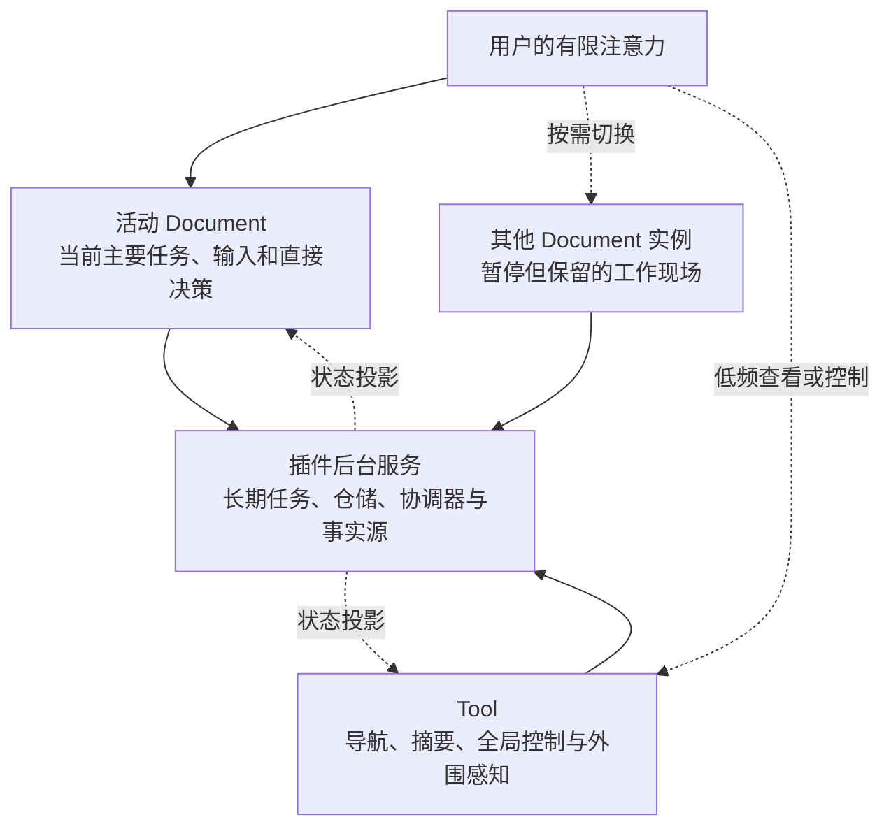

# 以注意力为中心的可停靠工作台：MyAvaloniaManagement 的软件设计意图、理论基础与工程目的

> 文档性质：设计意图与理论说明  
> 适用对象：开发团队、产品设计者、项目评审者  
> 讨论范围：人的注意力、认知负荷、任务切换与空间化工作上下文  
> 术语说明：本文所说的“注意力机制”属于人机交互与认知工程，不是机器学习中的 Attention 算法

## 摘要

MyAvaloniaManagement 是一个基于 .NET 10、Avalonia、Dock.Avalonia 和插件机制构建的模块化桌面工作台。它选择 `Document`、`Tool` 与可停靠布局作为主要交互结构，并不只是为了提供类似 IDE 的外观，也不是为了让屏幕上能够同时放置尽可能多的窗口。其更根本的设计意图是：**把人的注意力视为有限资源，把复杂工作拆分成可识别、可暂停、可恢复、可重新组合的上下文，并通过稳定的空间关系帮助用户管理这些上下文。**

在单个界面中堆叠大量输入项、状态、命令和流程，看似减少了页面数量，实际上可能迫使用户同时理解多个目标、记住大量隐含状态，并在错误的对象或阶段执行操作。相反，如果每个 `Document` 表达一个主要工作目标，每个实例保存自己的局部状态，`Tool` 只承担导航、全局状态和外围感知，后台服务又不依赖界面是否可见，那么用户就可以把主要注意力集中在当前任务上，同时保留其他任务的现场。

这种结构对应一条连续的设计推理：

> 人的注意力与工作记忆有限  
> → 复杂界面和任务切换会产生额外认知成本  
> → 软件应区分主要任务、暂停上下文、外围状态和后台事实  
> → `Document`、`Tool` 与 Dock 分别承载这些职责  
> → 多实例和空间布局可以帮助外化、分散、聚集和恢复上下文  
> → 但窗口增长也会产生管理成本，因此布局必须克制，并接受用户实验检验。

本文使用信息熵、Hick–Hyman 选择反应模型、任务切换成本、恢复延迟和空间布局代价函数对这一思想进行形式化说明。需要特别强调的是：其中一部分公式来自已经公开的研究，一部分是可用于后续实验的测量指标，另一部分是本项目提出的工程模型。三者会被明确区分。现有研究能够支持本项目的设计方向，但在完成正式用户实验前，不能据此宣称本项目已经证明能够降低错误率或提高生产率。

## 1. 项目要解决的不是“页面数量”，而是注意力配置

复杂业务必然包含复杂信息。视频下载需要登录、解析、选择、配置、排队与查看结果；加密视频工具需要文件、密码、元数据、队列、进度、播放控制和媒体库；数据导入也包含文件选择、校验、计算和输出。软件无法通过视觉简化消除业务本身的复杂度，但可以决定：这些复杂度是否必须在同一时刻、同一位置、以同样的显著程度压给用户。

一个“大而全”的界面通常混合了三类不同信息：

1. 当前操作真正需要的信息；
2. 稍后可能需要、但现在不应占据主要注意力的信息；
3. 只需让用户保持知晓的后台状态。

当三类信息缺少层次时，用户不仅要完成业务任务，还要额外承担界面搜索、窗口整理、状态记忆、任务恢复和错误纠正。Sweller 的认知负荷研究最初主要讨论学习和问题求解，不能直接作为 Dock 界面的实验证明，但它揭示了一个对交互设计有启发性的事实：问题求解过程本身已经可能消耗大量有限的认知处理能力；额外的非必要处理会挤占用于理解和决策的资源[5]。

本项目因此不把“功能全部可见”视为完整，也不把“所有内容都隐藏”视为简洁。设计目标是让信息根据注意力角色出现：

- **焦点信息**进入当前活动的 `Document`；
- **暂停但仍需保留的信息**留在其他 `Document` 实例中；
- **全局状态和导航**进入左右 `Tool`；
- **长期任务和事实源**进入插件服务，不依赖某个面板是否可见；
- **低频设置和高级功能**在具体界面内部渐进披露。

这与现有工程的架构事实一致。项目已经把 `Document` 定义为中央工作区中的多实例工作上下文，把 `Tool` 定义为宿主级单例侧边面板，把插件服务定义为与页面可见性无关的业务能力。更完整的代码边界可参见[宿主—插件交互架构评审](./host-plugin-architecture-review.md)。

## 2. 选择不确定性：信息熵能够说明什么

### 2.1 从“功能数量”转向“当前不确定性”

Shannon 在信息论中使用熵描述随机变量的不确定性[1]。如果把当前界面中可能被选择的操作抽象为随机变量 \(A\)，则：

$$
H(A)=-\sum_{i=1}^{n}p(a_i)\log_2 p(a_i)
$$

其中：

- \(a_i\) 是一个候选操作；
- \(p(a_i)\) 是用户在当前任务条件下选择该操作的概率；
- \(H(A)\) 是选择不确定性，单位为 bit。

当 \(n\) 个操作等概率时：

$$
H(A)=\log_2 n
$$

这不是说用户真的在脑中逐项计算 bit，而是提供一种精确语言：界面负担不只取决于有多少功能，还取决于用户是否知道哪些功能与当前目标有关。如果一个总界面同时呈现 16 个等可能入口，则其抽象选择熵为：

$$
H(A)=\log_2 16=4\ \text{bit}
$$

假设用户进入“视频加密”上下文后，当前阶段只有 4 个相关入口，在等概率的简化条件下：

$$
H(A\mid C=\text{视频加密})=\log_2 4=2\ \text{bit}
$$

这里的关键不是“把 16 个按钮删到 4 个”，而是引入了任务上下文 \(C\)。条件熵为：

$$
H(A\mid C)=\sum_c p(c)H(A\mid C=c)
$$

对离散随机变量，有：

$$
H(A\mid C)\leq H(A)
$$

也可以写成互信息关系：

$$
I(A;C)=H(A)-H(A\mid C)\geq 0
$$

如果上下文 \(C\) 对正确操作 \(A\) 有信息量，那么明确上下文能够降低平均不确定性。`Document` 的设计意义由此可以表述为：**它不是随意隐藏控件，而是把操作放入有语义的任务条件中，让用户面对条件化后的相关选择。**

### 2.2 不能滥用信息熵

信息熵是通信与概率模型，不是完整的可用性分数。把 16 个入口机械拆成“先选 4 个分类、再选每类 4 个功能”，总信息量在理想等概率条件下仍可能是：

$$
\log_2 4+\log_2 4=4\ \text{bit}
$$

而且多一级导航还会增加点击、记忆和返回成本。因此，分层只有在以下条件下才有设计价值：

- 分类与真实任务目标一致；
- 当前上下文确实排除了无关操作；
- 用户可以从标题、内容和位置识别上下文；
- 返回上下文时能够保留原状态；
- 分层没有制造重复导航和隐藏依赖。

所以，本文不会用“熵变小”直接证明某个页面更好。它只说明为何**任务相关的上下文划分**比**无差别的功能堆叠**更有可能降低当下选择的不确定性。

## 3. Hick–Hyman 模型：受限选择情境中的定量启发

Hick 和 Hyman 的经典实验研究了刺激信息量与选择反应时间之间的关系[2][3]。常见表达为：

$$
RT=a+bH
$$

等概率选择时可写为：

$$
RT=a+b\log_2 n
$$

其中：

- \(RT\) 是选择反应时间；
- \(a\) 表示与选择信息量无关的基础感知、准备和动作时间；
- \(b\) 表示处理单位信息所增加的时间；
- \(H\) 是选择信息量；
- \(n\) 是刺激—反应候选数量。

这个模型能够支持一个有限结论：当用户面对一组缺乏结构、需要进行刺激—反应映射的候选项时，增加选择不确定性可能增加反应时间。因此，在一个操作阶段同时暴露大量同级、外观近似的命令，通常不是理想设计。

但不能把它简化为“按钮越少越好”。Liu、Gori、Rioul、Beaudouin-Lafon 与 Guiard 在 CHI 2020 对 Hick 定律在 HCI 中的适用性进行了专门评述，指出真实界面中的视觉搜索、决策、熟练度和语义结构不能被一个选择反应公式替代[4]。对熟练用户而言，一个稳定、可直接访问的宽菜单甚至可能优于层层嵌套的窄菜单。

因此，本项目采用以下谨慎解释：

- Hick–Hyman 模型支持减少**无结构的同级选择不确定性**；
- 它不支持为了减少控件数量而增加无意义的页面层级；
- `Document` 应按任务语义划分，而不是按任意数量切割功能；
- `Tool` 应显示摘要和高价值命令，而不是成为另一个命令仓库；
- 是否更快仍需使用真实任务完成时间验证。

## 4. 任务切换成本：Dock 不应鼓励频繁切换

人在多个任务之间切换时，需要抑制旧任务规则并激活新任务规则。Monsell 对任务切换研究的综述指出，即使有准备时间，切换后的反应通常仍然更慢，并且往往更容易出错；准备能够减小但不能完全消除这种“切换成本”[6]。

在项目的用户实验中，可以把时间切换成本定义为：

$$
C_T=\overline{T}_{switch}-\overline{T}_{repeat}
$$

把错误切换成本定义为：

$$
C_E=P(error\mid switch)-P(error\mid repeat)
$$

其中：

- \(\overline{T}_{switch}\) 是切换任务后完成目标操作的平均时间；
- \(\overline{T}_{repeat}\) 是继续执行同类任务时的平均时间；
- \(P(error\mid switch)\) 是切换后出错的概率；
- \(P(error\mid repeat)\) 是未切换时出错的概率。

若 \(C_T>0\)，说明切换增加时间；若 \(C_E>0\)，说明切换增加错误风险。这里的公式是实验指标定义，不是假定所有人具有相同的固定成本。

这也说明了一个容易误解的问题：Dock 提供很多标签和窗口，并不意味着项目鼓励用户不断切换。它的目标应当是：

1. 在当前 `Document` 内尽量完成一个连贯任务；
2. 当切换不可避免时，保留被暂停任务的状态；
3. 让用户通过标题、位置和可见摘要识别正确上下文；
4. 避免为了查看后台状态而离开主要任务；
5. 防止多个实例共享不应共享的临时状态。

Czerwinski、Horvitz 与 Wilhite 对信息工作者进行的一周日记研究发现，多任务交错、中断和复杂长期项目的恢复是实际工作中的显著问题，并据此讨论了任务管理工具的设计方向[7]。Iqbal 与 Horvitz 随后的现场研究进一步关注计算任务的暂停与恢复，记录应用、窗口和通知之间的活动，并强调快速切换不等同于高效恢复[8]。这些研究支持“保留任务现场和恢复线索”的方向，但没有直接检验本项目的具体界面。

## 5. 恢复延迟：保留界面不等于恢复思维，但能提供线索

任务重新显示后，用户通常还需要时间回忆“刚才做到哪里、下一步是什么”。可以把恢复延迟定义为：

$$
RL=t_{\text{first-valid-action}}-t_{\text{context-restored}}
$$

其中：

- \(t_{\text{context-restored}}\) 是原任务上下文重新可见的时刻；
- \(t_{\text{first-valid-action}}\) 是用户在原任务中完成第一个有效操作的时刻；
- \(RL\) 越大，说明恢复目标和状态所需时间越长。

Altmann 与 Trafton 的“目标记忆”模型用激活、干扰与线索解释暂停目标的恢复[9]；Trafton 等人的研究还讨论了中断前准备对恢复的帮助[10]。在 Altmann 与 Trafton 2004 年使用的特定任务环境中，中断后的恢复延迟为 3.8 秒，而普通连续操作间隔为 1.9 秒；实验还发现，与被中断任务相关的外部线索能够缩短恢复延迟[11]。

这个“约两倍”只能描述该实验环境，不能推广为所有软件、所有任务和所有用户的固定比例，更不能替换本项目的实测数据。它真正有价值的地方是提供了可验证的设计推论：**恢复界面时，如果原任务的状态与线索仍然存在，用户可能更容易恢复被暂停的目标。**

在 MyAvaloniaManagement 中，`Document` 可以提供以下恢复线索：

- 标签标题表明任务类型或对象；
- 固定或用户熟悉的空间位置帮助识别；
- 输入值、选择项、列表、滚动位置和执行进度仍属于原实例；
- 同类型任务可以由不同实例隔离，不必覆盖上一份现场；
- `Document` 真正关闭后再释放作用域和资源，避免“看似存在、实际已失效”；
- `Tool` 可以保留后台任务摘要，用户无需进入每个 `Document` 才知道全局状态。

但也必须承认：保留一个标签不自动等于保留人的完整思维。标题含糊、实例过多、状态不可见或空间频繁变化，都可能让用户仍然无法判断应该恢复哪个任务。因此，标签命名、状态摘要、脏状态、最近操作提示和布局稳定性仍是后续设计工作。

## 6. 本项目的注意力分层

项目可以用“焦点—上下文—外围—后台”四层模型表达：

这四层不是按视觉大小划分，而是按职责和注意力强度划分：

| 层级 | 应承担的内容 | 不应承担的内容 |
| --- | --- | --- |
| 活动 `Document` | 当前任务、局部状态、直接操作、明确反馈 | 全部插件的全局状态、无关任务命令 |
| 其他 `Document` | 被暂停任务的独立状态和恢复线索 | 持续抢占用户注意力的动画与通知 |
| `Tool` | 导航、全局摘要、队列、筛选和少量控制 | 必须依赖 Tool 可见性才能存活的后台任务 |
| 插件服务 | 长任务、仓储、调度、凭据和领域事实 | 直接拥有具体 Dock 的视觉生命周期 |

这一模型解释了为什么 `Document` 与 `Tool` 必须具有不同生命周期。`Document` 是工作上下文，可以多实例创建并在真正关闭后释放；`Tool` 是全局状态投影，通常只创建一次，关闭时隐藏并可恢复同一实例；后台服务则不能因为某个 `Tool` 被隐藏而停止。

## 7. Document：把复杂工作变成独立、可恢复的上下文

在本项目中，`Document` 不是传统意义上的文本文件，而更接近 IDE 中的编辑器标签或一个独立工作会话。公共扩展入口由 [`IDocumentCreationStrategy`](../Host/MyAvaloniaManagementCommon/DocumentCreation/IDocumentCreationStrategy.cs) 和 [`DocumentMetadata`](../Host/MyAvaloniaManagementCommon/DocumentCreation/DocumentMetadata.cs) 提供。宿主按文档类型发现策略，每次创建一个新的工作实例。

当前项目已经包含多种不同目标的 `Document`：

- Bilibili 下载配置与提交；
- 加密视频播放器；
- 加密视频媒体库；
- 视频文件加密；
- 批量视频解密；
- 发票信息导入；
- 测试欢迎页和消息订阅页。

这些内容没有被强制装进一个总控制台。尤其是 MySmallTools 将播放、媒体库、加密和解密声明为不同文档类型，并进一步在文档内部按 Playback、Library、Encryption、Decryption 和 SingleVideo 进行组件化。相关职责拆分可参见[安全视频子系统架构设计](../Plugins/MySmallTools/MySmallTools/docs/secret-video-player/architecture-design.md)与[G7.1 UI 职责拆分](../Plugins/MySmallTools/MySmallTools/docs/secret-video-player/G7.1-UI-RESPONSIBILITY-REFACTOR.md)。

`Document` 多实例的价值主要体现在：

1. **状态隔离**：两个播放器、两份下载配置或两批加密任务不应覆盖彼此的输入和进度。
2. **暂停而不销毁**：用户切换标签时，任务现场仍可保留。
3. **直接比较**：相关上下文可以按需并排或在不同显示区域观察。
4. **资源所有权清晰**：由独立作用域创建的 Document 可以在 Dock 确认关闭后释放对应资源。
5. **错误边界缩小**：当前操作的对象和局部状态集中在一个明确实例中。

不过，多实例只是能力，不是越多越好。每个 `Document` 仍应满足：

- 有一个能够用一句话说明的主要目标；
- 主要操作在视觉层级中明确；
- 低频设置采用折叠、分步或按需呈现；
- 不复制全局事实源；
- 标题能够区分同类型实例；
- 高风险命令明确指出目标对象和影响范围；
- 关闭、取消、保存与后台继续之间的语义一致。

项目当前已具备每 Document 独立 DI Scope 的公共能力，但并非所有托管文档都已统一迁移到这一模式；这应当被视为当前成熟度边界，而不是被文档掩盖。现状详见[架构评审中的 Document 章节](./host-plugin-architecture-review.md#3-document多实例工作上下文)。

## 8. Tool：让用户保持知晓，而不是持续被打断

`Tool` 对应文件树、插件目录、工具管理、任务中心或调度面板。它通常不是当前工作的主体，却能让用户知道工作台中有哪些能力、后台正在发生什么，以及何时需要干预。

宿主默认将文件树放在左侧，将插件入口和工具管理类面板放在右侧。`ManagementFactory` 启用了 `HideToolsOnClose`，并缓存已创建的 Tool；关闭 Tool 时进入隐藏集合，恢复时仍是同一实例。相关实现可参见 [`ManagementFactory`](../Host/MyAvaloniaManagement/ViewModels/ManagementFactory.cs) 和 [`ToolMetadata`](../Host/MyAvaloniaManagementCommon/ToolCreation/ToolMetadata.cs)。

Bilibili 插件体现了这种职责分离：

- 下载 `Document` 负责登录状态、URL 解析、下载配置、视频列表和提交；
- `BiliSchedulerTool` 负责排队数、完成数、调度状态、开始/暂停和已完成任务清理；
- 下载协调器与任务队列属于插件服务，不因 Tool 隐藏而消失。

这使用户可以在中央继续处理主要任务，通过侧边区域获得外围感知。Grudin 对多显示器使用的现场研究发现，第二显示区域经常不是简单的“更多主工作区”，而被用于展示后台任务、事件与通信等外围信息[14]。这不能直接证明侧边 Tool 的具体宽度或位置，但支持了“主要任务与外围感知具有不同空间角色”的设计方向。

一个合格的 Tool 应遵循以下原则：

- 摘要先于细节；
- 状态变化默认不抢走输入焦点；
- 只有确需用户决策的事件才提升显著性；
- 隐藏不等于停止后台任务；
- 恢复时不应创建第二份全局状态；
- 操作必须明确作用范围，避免误控制另一个 Document；
- 如果信息长期无关，应允许隐藏，而不是永久占据屏幕。

## 9. Dock：空间不是装饰，而是外部认知资源

Kirsh 提出，人们会主动安排物体、工具和工作中间产物的位置，以简化选择、感知和内部计算；空间管理是思考和行动的一部分，而不是事后的整理[12]。在数字工作台中，标签、左右区域、并排关系和浮动位置也可以承担类似作用：它们把一部分“我正在做什么、哪些内容相关、下一步可能去哪”放到环境中，而不是完全留在人的工作记忆里。

MyAvaloniaManagement 的默认 Dock 树形成稳定语义：

- 中央 `Documents` 是主要工作区；
- `LeftTools` 承载左侧导航类 Tool；
- `RightTools` 承载右侧菜单、管理和状态类 Tool；
- 左右面板默认各占约 15% 比例；
- Tool 可以隐藏和恢复；
-布局快照保存面板比例、Tool 归属、顺序、显隐、活动项和 Tool 浮动边界。

布局快照只保存宿主可重建的空间结构，不保存 Document、密码、媒体路径、播放状态和插件表单值；重启后当前版本也不会自动重开历史 Document。参见[Dock 结构布局快照 V1](./upgrade/net10/dock-layout-snapshot-v1.md)。因此，本项目当前提供的是**运行期多上下文保留与可重建的 Tool 空间结构**，还不是完整的跨会话工作现场恢复。

Robertson 等人的 Scalable Fabric 研究提出了焦点—上下文窗口管理方式：主要窗口位于焦点区域，外围保留缩小的任务窗口，并利用空间安排与分组帮助任务切换[13]。研究同时指出，显示空间增加会让用户保留更多窗口，而更多窗口也可能增加整理和切换时间。这个双面结论对本项目非常重要：Dock 的价值不在于最大化窗口数量，而在于让窗口数量、关联关系和注意力层级可管理。

## 10. 上下文关系的空间形式模型

为了把“空间分散与关联聚集”变成可以讨论的工程问题，可以把当前工作区抽象为加权图：

$$
G=(V,E)
$$

其中：

- \(V\) 是打开的 `Document` 与 `Tool`；
- \(E\) 是上下文之间的关系；
- \(w_{ij}\) 是上下文 \(i\) 与 \(j\) 之间比较、切换或协作的频率；
- \(d_{ij}\) 是两者之间的操作距离或切换成本。

定义一个项目级布局代价：

$$
L_{\text{layout}}
=
\sum_{(i,j)\in E}w_{ij}d_{ij}
+
\lambda C_{\text{clutter}}
$$

其中：

- 第一项希望频繁协作的上下文更接近、更容易切换；
- \(C_{\text{clutter}}\) 表示同时显示过多内容造成的视觉噪声、遮挡和扫描成本；
- \(\lambda\) 表示当前任务对界面拥挤的敏感程度。

这不是 Kirsh 或 Scalable Fabric 论文中的原公式，而是本项目受这些研究启发后提出的工程形式化。它帮助解释五个设计动作：

1. **聚集**：把高 \(w_{ij}\) 的上下文并排或放在相邻标签中，减小 \(d_{ij}\)。
2. **分散**：把弱相关信息移到外围 Tool 或另一显示区域，避免占据焦点。
3. **隐藏**：当某个 Tool 的当前收益很低时，降低 \(C_{\text{clutter}}\)。
4. **稳定布局**：减少用户因位置变化重新搜索而产生的有效距离。
5. **恢复默认布局**：当布局损坏或插件缺失时，回到可预测结构，而不是应用部分错误状态。

该模型还说明为何不能让所有内容始终可见。若不断增加窗口，即使部分 \(d_{ij}\) 下降，\(C_{\text{clutter}}\) 也可能快速上升，最终使总布局代价变大。

## 11. 多窗口能力的边际收益

可以用以下项目决策式判断是否值得增加常驻面板、并排 Document 或浮动窗口：

$$
\Delta U
=
\Delta B_{\text{context}}
+
\Delta B_{\text{comparison}}
-
\Delta C_{\text{management}}
-
\Delta C_{\text{distraction}}
$$

其中：

- \(\Delta B_{\text{context}}\) 是新增区域带来的上下文保留收益；
- \(\Delta B_{\text{comparison}}\) 是同时观察和比较的收益；
- \(\Delta C_{\text{management}}\) 是窗口整理、查找和切换成本；
- \(\Delta C_{\text{distraction}}\) 是视觉噪声与注意力分散成本。

只有当：

$$
\Delta U>0
$$

新增区域才具有净收益。例如，同时观察媒体库与播放器可能支持选择和播放之间的直接关系；显示下载队列摘要可能避免反复进入每个下载 Document。相反，如果新面板只复制已有信息、持续闪动或要求用户反复整理位置，则其净收益可能为负。

Gallagher 等人对办公室多显示器研究的系统综述发现，双显示器符合较强的用户偏好，并有中等证据表明它可能提高任务效率、减少桌面交互；但同时可能导致非中性颈部姿势，研究者因此要求把任务复杂度、用户位置、健康与生产率共同纳入评价[15]。这进一步说明：空间扩展既有潜在收益，也有交互和人体工学成本。

## 12. 总操作时间：项目能优化哪一部分

为了避免把“业务变快”和“界面开销变少”混为一谈，可以把观察到的任务时间分解为：

$$
T_{\text{observed}}
=
T_{\text{business}}
+
T_{\text{navigation}}
+
T_{\text{rearrangement}}
+
T_{\text{recovery}}
+
T_{\text{error-rework}}
$$

其中：

- \(T_{\text{business}}\)：业务本身不可避免的处理时间；
- \(T_{\text{navigation}}\)：查找功能、打开入口、切换层级的时间；
- \(T_{\text{rearrangement}}\)：移动、缩放、查找和恢复窗口的时间；
- \(T_{\text{recovery}}\)：切换后恢复任务目标和状态的时间；
- \(T_{\text{error-rework}}\)：误操作导致撤销、重做和重新确认的时间。

这是项目评估模型，不是心理学定律，各项在真实日志中也未必能够完全独立。它的作用是限定项目的承诺：Dock 不能让加密算法、网络下载或数据计算本身凭空变快；它主要尝试降低导航、整理、恢复和错误返工等界面附加成本。

这也给出了正确的优化优先级：

- 不应为了减少一个点击而破坏上下文清晰度；
- 不应为了“全部可见”而增加扫描和整理时间；
- 不应为了减少窗口数量而把无关任务重新塞回一个页面；
- 应在真实业务时间之外单独测量界面管理时间。

## 13. 研究证据、项目推论与证明边界

| 公开研究 | 研究或模型表达 | 对项目的合理启发 | 不能由此推出 |
| --- | --- | --- | --- |
| Shannon 信息熵[1] | \(H(A)=-\sum p_i\log_2p_i\) | 用上下文过滤无关操作，讨论条件选择不确定性 | 不能仅按按钮数计算界面质量 |
| Hick、Hyman[2][3] | \(RT=a+bH\) | 避免大量无结构的同级刺激—反应选择 | 不能证明“越少越好”或直接预测业务完成时间 |
| Liu 等[4] | 评述 Hick 定律的 HCI 适用边界 | 必须考虑视觉搜索、语义、熟练度和实际任务 | 不能用单一心理学定律包办界面设计 |
| Sweller[5] | 问题求解会占用有限处理能力 | 减少与主要任务无关的界面处理 | 不能直接证明 Dock 降低了认知负荷 |
| Monsell[6] | 切换后反应更慢且通常更易错 | 减少不必要切换，保留独立任务现场 | 不能给所有用户指定固定切换时间 |
| Czerwinski 等[7] | 信息工作者存在多任务、中断与恢复困难 | 支持面向任务的上下文管理 | 不能证明本项目的具体实现已经有效 |
| Iqbal、Horvitz[8] | 现场记录任务暂停与恢复 | 快速切换之外还要支持重新获得上下文 | 不能把某一现场样本当作所有场景 |
| Altmann、Trafton[9][11] | 目标激活、恢复延迟与外部线索 | 标签、状态与空间位置可作为恢复线索 | 不能声称标签能够保存完整人的思维 |
| Kirsh[12] | 空间安排可简化选择、感知和内部计算 | 将空间视为外部认知资源 | 不能证明任意 Dock 布局都更好 |
| Scalable Fabric[13] | 焦点—上下文、空间分组及窗口管理成本 | 中央焦点、外围 Tool、相关任务聚集 | 不能把更多窗口等同于更高效率 |
| Grudin[14] | 多显示区域常承担外围感知 | Tool 适合后台摘要和全局状态 | 不能规定所有用户必须使用多显示器 |
| Gallagher 等[15] | 多显示器收益与人体工学风险并存 | 同时评价效率、复杂度和物理成本 | 不能只依据用户偏好宣称生产率提升 |

## 14. 面向后续开发的注意力设计原则

### 14.1 一个 Document 对应一个主要目标

如果一个页面无法用一句话说明主要目标，或者同时存在多个互不依赖的“主操作”，应优先检查是否需要拆分 Document 或内部功能包。拆分依据是任务语义和状态所有权，不是控件数量。

### 14.2 当前上下文只突出当前有效选择

不相关命令可以隐藏、禁用或移入下一阶段，但必须保持可发现性。不要用深层菜单掩盖糟糕的信息架构，也不要让用户猜测某项功能消失的原因。

### 14.3 采用渐进披露

高频信息和主要操作保持可见；高级设置、历史维护和低频诊断按需展开。项目中的媒体库已经采用“列表优先、设置折叠”的渐进披露，这类模式应继续保持。

### 14.4 保持空间语义稳定

导航类 Tool 优先保持在左侧，全局控制和状态类 Tool 优先保持在右侧；同一 Tool 恢复时回到可预测位置。除非用户主动调整，不应因状态更新频繁重排面板。

### 14.5 为暂停任务保留恢复线索

同类型实例需要可区分标题；列表选择、进度、筛选和输入应由实例拥有；发生中断前后的关键阶段应有可见状态。未来若实现跨会话 Document 恢复，应同时设计版本迁移、敏感数据边界和失败占位，而不是简单序列化整个 ViewModel。

### 14.6 区分“隐藏”“关闭”“取消”和“后台继续”

Tool 隐藏不应停止插件级后台任务；Document 关闭应释放文档级资源；取消业务任务不一定等于关闭页面；长期任务是否继续必须有一致且可见的规则。

### 14.7 避免跨实例隐式污染

局部输入、密码、候选列表、当前对象和临时进度不得因错误的单例生命周期在多个 Document 之间共享。全局服务可以共享事实，但 Document 应拥有自己的交互投影和取消边界。

### 14.8 高风险操作显式指出目标

删除、覆盖、停止、清空和批量执行等命令应明确显示作用对象、范围和不可逆后果。多实例环境尤其要避免“用户看着 A，命令却作用于 B”。

### 14.9 Tool 默认安静

外围感知不等于持续动画、弹窗和颜色闪烁。状态变化应先在 Tool 中形成摘要，只有需要立即决策时才升级为中断。

### 14.10 控制默认窗口数量

默认布局只应展示跨多数任务都高价值的 Tool。新插件不应因为注册了 Tool 就理所当然永久占据可见空间；工具应可隐藏、可恢复，并在插件缺失时安全回退。

## 15. 后续用户实验与验收指标

当前项目已经有大量架构、生命周期、布局和真实窗口集成测试，但这些测试验证的是软件正确性和稳定性，不等同于人因效果验证。注意力设计目标应通过专门的用户研究评估。

### 15.1 建议指标

切换成本：

$$
\text{SwitchCost}
=
\overline{T}_{switch}
-
\overline{T}_{baseline}
$$

错误率：

$$
\text{ErrorRate}
=
\frac{N_{error}}{N_{operations}}
$$

恢复延迟：

$$
\text{ResumptionLag}
=
t_{\text{first-valid-action}}
-
t_{\text{return}}
$$

窗口管理占比：

$$
\text{RearrangementRatio}
=
\frac{T_{\text{window-management}}}{T_{\text{observed}}}
$$

还应记录：

- 找错 Document 或对错误对象操作的次数；
- 为恢复任务重复打开页面、重新输入或重新筛选的次数；
- Tool 状态被正确理解的比例；
- 用户主动隐藏、移动和恢复 Tool 的频率；
- 主观工作负荷，例如 NASA-TLX，但不能只依赖主观分数；
- 多显示器条件下的头颈姿势和布局偏好。

### 15.2 建议对比场景

1. 单一复杂页面与多个任务化 `Document`；
2. 切换后保留实例状态与重新导航进入；
3. 后台状态常驻主页面与放入可隐藏 `Tool`；
4. 默认布局与用户建立的稳定布局；
5. 少量相关窗口与大量无关窗口；
6. 含明确标题和状态摘要的恢复界面与缺少线索的恢复界面。

实验应采用相同业务数据、相同任务顺序平衡、足够样本和事先定义的排除标准。结果需要同时报告时间、错误和主观负荷，避免只选择有利指标。若实验未发现显著差异，应如实修正设计假设。

## 16. 结论

MyAvaloniaManagement 的核心设计目的不是“把更多功能放进一个主窗口”，也不是“让用户同时操作尽可能多的窗口”。它试图建立一种以注意力为中心的复杂桌面软件结构：

- `Document` 把主要任务变成独立、多实例、可暂停的工作上下文；
- `Tool` 把导航、全局状态和后台感知放到注意力外围；
- 插件服务让长期任务不依赖某个界面是否可见；
- Dock 让上下文能够按照关系聚集、按照注意力角色分散；
- 稳定布局把一部分任务记忆外化为空间线索；
- 隐藏与恢复机制让用户能够主动控制视觉噪声。

信息熵说明了任务上下文如何降低条件选择的不确定性；Hick–Hyman 模型在受限条件下说明无结构选择与反应时间的关系；任务切换和恢复研究说明暂停任务不会自动无成本地回到人的思维中；空间认知研究说明布局可以成为外部认知资源。与此同时，窗口管理研究也提醒我们：更多空间和更多窗口会产生新的整理、搜索、分心和人体工学成本。

因此，这一设计理念最终可以归结为一句话：

> **软件不应要求用户把整个系统装进工作记忆，而应让系统以清晰的任务边界、可恢复的实例状态和稳定的空间关系，帮助用户保存正在进行的思考。**

这是一项设计承诺，而不是未经检验的效果声明。项目后续开发应继续以真实任务、错误率、恢复延迟和窗口管理成本验证它，并在证据不支持时调整具体实现。

## 参考文献

1. Shannon, C. E. (1948). *A Mathematical Theory of Communication*. Bell System Technical Journal, 27, 379–423, 623–656. [DOI](https://doi.org/10.1002/j.1538-7305.1948.tb01338.x)
2. Hick, W. E. (1952). *On the Rate of Gain of Information*. Quarterly Journal of Experimental Psychology, 4(1), 11–26. [DOI](https://doi.org/10.1080/17470215208416600)
3. Hyman, R. (1953). *Stimulus Information as a Determinant of Reaction Time*. Journal of Experimental Psychology, 45(3), 188–196. [PubMed / DOI](https://pubmed.ncbi.nlm.nih.gov/13052851/)
4. Liu, W., Gori, J., Rioul, O., Beaudouin-Lafon, M., & Guiard, Y. (2020). *How Relevant Is Hick’s Law for HCI?* Proceedings of CHI 2020, 1–11. [DOI](https://doi.org/10.1145/3313831.3376878)
5. Sweller, J. (1988). *Cognitive Load During Problem Solving: Effects on Learning*. Cognitive Science, 12(2), 257–285. [DOI](https://doi.org/10.1207/s15516709cog1202_4)
6. Monsell, S. (2003). *Task Switching*. Trends in Cognitive Sciences, 7(3), 134–140. [PubMed / DOI](https://pubmed.ncbi.nlm.nih.gov/12639695/)
7. Czerwinski, M., Horvitz, E., & Wilhite, S. (2004). *A Diary Study of Task Switching and Interruptions*. Proceedings of CHI 2004, 175–182. [Microsoft Research](https://www.microsoft.com/en-us/research/publication/a-diary-study-of-task-switching-and-interruptions/)
8. Iqbal, S. T., & Horvitz, E. (2007). *Disruption and Recovery of Computing Tasks: Field Study, Analysis, and Directions*. Proceedings of CHI 2007, 677–686. [Microsoft Research](https://www.microsoft.com/en-us/research/publication/disruption-recovery-computing-tasks-field-study-analysis-directions/)
9. Altmann, E. M., & Trafton, J. G. (2002). *Memory for Goals: An Activation-Based Model*. Cognitive Science, 26(1), 39–83. [DOI](https://doi.org/10.1207/s15516709cog2601_2)
10. Trafton, J. G., Altmann, E. M., Brock, D. P., & Mintz, F. E. (2003). *Preparing to Resume an Interrupted Task: Effects of Prospective Goal Encoding and Retrospective Rehearsal*. International Journal of Human-Computer Studies, 58(5), 583–603. [DOI](https://doi.org/10.1016/S1071-5819(03)00023-5)
11. Altmann, E. M., & Trafton, J. G. (2004). *Task Interruption: Resumption Lag and the Role of Cues*. Proceedings of the 26th Annual Conference of the Cognitive Science Society. [公开论文页面](https://escholarship.org/uc/item/18b4r661)
12. Kirsh, D. (1995). *The Intelligent Use of Space*. Artificial Intelligence, 73(1–2), 31–68. [作者公开全文](https://adrenaline.ucsd.edu/kirsh/Articles/Space/AIJ1.html)
13. Robertson, G., Horvitz, E., Czerwinski, M., Baudisch, P., Hutchings, D., Meyers, B., Robbins, D., & Smith, G. (2004). *Scalable Fabric: Flexible Task Management*. Proceedings of AVI 2004, 85–89. [Microsoft Research](https://www.microsoft.com/en-us/research/publication/scalable-fabric-flexible-representation-task-management/)
14. Grudin, J. (1999). *Primary Tasks and Peripheral Awareness: A Field Study of Multiple Monitor Use*. Microsoft Research Technical Report MSR-TR-99-72. [Microsoft Research](https://www.microsoft.com/en-us/research/publication/primary-tasks-and-peripheral-awareness-a-field-study-of-multiple-monitor-use/)
15. Gallagher, K. M., Cameron, L., De Carvalho, D. E., & Boulé, M. (2021). *Does Using Multiple Computer Monitors for Office Tasks Affect User Experience? A Systematic Review*. Human Factors, 63(3), 433–449. [PubMed / DOI](https://pubmed.ncbi.nlm.nih.gov/31809202/)
