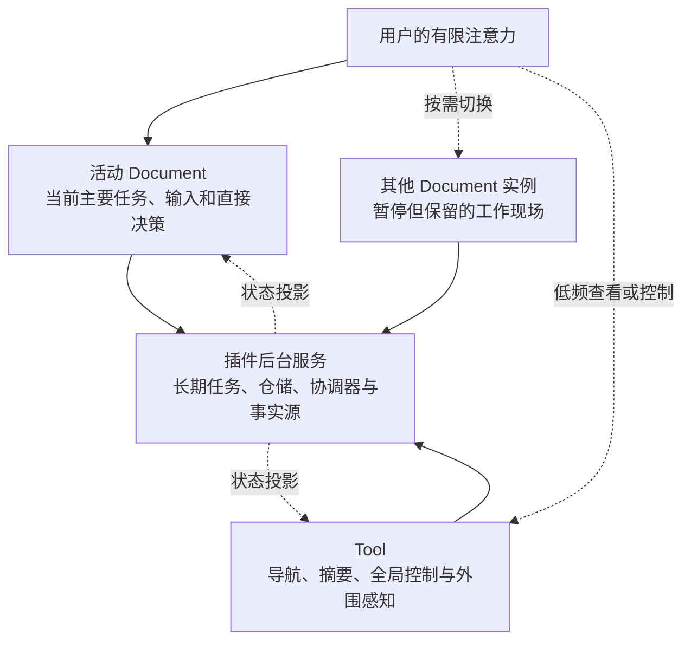

# 以注意力为中心的可停靠工作台：MyAvaloniaManagement 的软件设计意图、理论基础与工程目的

> 文档性质：设计意图与理论说明  
> 适用对象：开发团队、产品设计者、项目评审者  
> 讨论范围：人的注意力、认知负荷、任务切换与空间化工作上下文  
> 术语说明：本文所说的“注意力机制”属于人机交互与认知工程，不是机器学习中的 Attention 算法

## 摘要

MyAvaloniaManagement 是一个基于 .NET 10、Avalonia、Dock.Avalonia 和插件机制构建的模块化桌面工作台。它选择 `Document`、`Tool` 与可停靠布局作为主要交互结构，并不只是为了提供类似 IDE 的外观，也不是为了让屏幕上能够同时放置尽可能多的窗口。其更根本的设计意图是：**把人的注意力视为有限资源，把复杂工作拆分成可识别、可暂停、可恢复、可重新组合的上下文，并通过稳定的空间关系帮助用户管理这些上下文。**

在单个界面中堆叠大量输入项、状态、命令和流程，看似减少了页面数量，实际上可能迫使用户同时理解多个目标、记住大量隐含状态，并在错误的对象或阶段执行操作。相反，如果每个 `Document` 表达一个主要工作目标，每个实例保存自己的局部状态，`Tool` 只承担导航、全局状态和外围感知，后台服务又不依赖界面是否可见，那么用户就可以把主要注意力集中在当前任务上，同时保留其他任务的现场。

这种结构对应一条连续的设计推理：

> 人的注意力与工作记忆有限  
> → 复杂界面和任务切换会产生额外认知成本  
> → 软件应区分主要任务、暂停上下文、外围状态和后台事实  
> → `Document`、`Tool` 与 Dock 分别承载这些职责  
> → 多实例和空间布局可以帮助外化、分散、聚集和恢复上下文  
> → 但窗口增长也会产生管理成本，因此布局必须克制，并接受用户实验检验。

本文使用信息熵、Hick–Hyman 选择反应模型、任务切换成本、恢复延迟和空间布局代价函数对这一思想进行形式化说明。需要特别强调的是：其中一部分公式来自已经公开的研究，一部分是可用于后续实验的测量指标，另一部分是本项目提出的工程模型。三者会被明确区分。现有研究能够支持本项目的设计方向，但在完成正式用户实验前，不能据此宣称本项目已经证明能够降低错误率或提高生产率。

本文还引入一个谨慎的跨尺度类比。Deng、Hani 与 Ma 近期在稀薄硬球体系中完成了从微观粒子动力学到 Boltzmann 动理学、再到若干流体方程的严格连接[16][17]。这项工作提示我们区分“完整微观状态”“任务尺度的中间表示”和“面向行动的宏观摘要”，但它并不证明人的认知服从 Boltzmann 方程，也不证明遗忘是热力学熵增。本文只借用其结构：当高维状态被投影到较低维表示时，未被表示的细节和关联会使反演变得不唯一；有效不可逆性由约化、初始条件、典型性和可访问性共同产生，不能简单归结为信息被物理删除。对软件的直接启示是：界面可以压缩当前可见信息，但关键上下文应由 `Document`、`Tool`、后台事实源和稳定空间线索保持可恢复。

## 1. 项目要解决的不是“页面数量”，而是注意力配置

复杂业务必然包含复杂信息。视频下载需要登录、解析、选择、配置、排队与查看结果；加密视频工具需要文件、密码、元数据、队列、进度、播放控制和媒体库；数据导入也包含文件选择、校验、计算和输出。软件无法通过视觉简化消除业务本身的复杂度，但可以决定：这些复杂度是否必须在同一时刻、同一位置、以同样的显著程度压给用户。

一个“大而全”的界面通常混合了三类不同信息：

1. 当前操作真正需要的信息；
2. 稍后可能需要、但现在不应占据主要注意力的信息；
3. 只需让用户保持知晓的后台状态。

当三类信息缺少层次时，用户不仅要完成业务任务，还要额外承担界面搜索、窗口整理、状态记忆、任务恢复和错误纠正。Sweller 的认知负荷研究最初主要讨论学习和问题求解，不能直接作为 Dock 界面的实验证明，但它揭示了一个对交互设计有启发性的事实：问题求解过程本身已经可能消耗大量有限的认知处理能力；额外的非必要处理会挤占用于理解和决策的资源[5]。

本项目因此不把“功能全部可见”视为完整，也不把“所有内容都隐藏”视为简洁。设计目标是让信息根据注意力角色出现：

- **焦点信息**进入当前活动的 `Document`；
- **暂停但仍需保留的信息**留在其他 `Document` 实例中；
- **全局状态和导航**进入左右 `Tool`；
- **长期任务和事实源**进入插件服务，不依赖某个面板是否可见；
- **低频设置和高级功能**在具体界面内部渐进披露。

这与现有工程的架构事实一致。项目已经把 `Document` 定义为中央工作区中的多实例工作上下文，把 `Tool` 定义为宿主级单例侧边面板，把插件服务定义为与页面可见性无关的业务能力。更完整的代码边界可参见[宿主—插件交互架构评审](./host-plugin-architecture-review.md)。

## 2. 选择不确定性：信息熵能够说明什么

### 2.1 从“功能数量”转向“当前不确定性”

Shannon 在信息论中使用熵描述随机变量的不确定性[1]。如果把当前界面中可能被选择的操作抽象为随机变量 \(A\)，则：

$$
H(A)=-\sum_{i=1}^{n}p(a_i)\log_2 p(a_i)
$$

其中：

- \(a_i\) 是一个候选操作；
- \(p(a_i)\) 是用户在当前任务条件下选择该操作的概率；
- \(H(A)\) 是选择不确定性，单位为 bit。

当 \(n\) 个操作等概率时：

$$
H(A)=\log_2 n
$$

这不是说用户真的在脑中逐项计算 bit，而是提供一种精确语言：界面负担不只取决于有多少功能，还取决于用户是否知道哪些功能与当前目标有关。如果一个总界面同时呈现 16 个等可能入口，则其抽象选择熵为：

$$
H(A)=\log_2 16=4\ \text{bit}
$$

假设用户进入“视频加密”上下文后，当前阶段只有 4 个相关入口，在等概率的简化条件下：

$$
H(A\mid C=\text{视频加密})=\log_2 4=2\ \text{bit}
$$

这里的关键不是“把 16 个按钮删到 4 个”，而是引入了任务上下文 \(C\)。条件熵为：

$$
H(A\mid C)=\sum_c p(c)H(A\mid C=c)
$$

对离散随机变量，有：

$$
H(A\mid C)\leq H(A)
$$

也可以写成互信息关系：

$$
I(A;C)=H(A)-H(A\mid C)\geq 0
$$

如果上下文 \(C\) 对正确操作 \(A\) 有信息量，那么明确上下文能够降低平均不确定性。`Document` 的设计意义由此可以表述为：**它不是随意隐藏控件，而是把操作放入有语义的任务条件中，让用户面对条件化后的相关选择。**

### 2.2 不能滥用信息熵

信息熵是通信与概率模型，不是完整的可用性分数。把 16 个入口机械拆成“先选 4 个分类、再选每类 4 个功能”，总信息量在理想等概率条件下仍可能是：

$$
\log_2 4+\log_2 4=4\ \text{bit}
$$

而且多一级导航还会增加点击、记忆和返回成本。因此，分层只有在以下条件下才有设计价值：

- 分类与真实任务目标一致；
- 当前上下文确实排除了无关操作；
- 用户可以从标题、内容和位置识别上下文；
- 返回上下文时能够保留原状态；
- 分层没有制造重复导航和隐藏依赖。

所以，本文不会用“熵变小”直接证明某个页面更好。它只说明为何**任务相关的上下文划分**比**无差别的功能堆叠**更有可能降低当下选择的不确定性。

## 3. Hick–Hyman 模型：受限选择情境中的定量启发

Hick 和 Hyman 的经典实验研究了刺激信息量与选择反应时间之间的关系[2][3]。常见表达为：

$$
RT=a+bH
$$

等概率选择时可写为：

$$
RT=a+b\log_2 n
$$

其中：

- \(RT\) 是选择反应时间；
- \(a\) 表示与选择信息量无关的基础感知、准备和动作时间；
- \(b\) 表示处理单位信息所增加的时间；
- \(H\) 是选择信息量；
- \(n\) 是刺激—反应候选数量。

这个模型能够支持一个有限结论：当用户面对一组缺乏结构、需要进行刺激—反应映射的候选项时，增加选择不确定性可能增加反应时间。因此，在一个操作阶段同时暴露大量同级、外观近似的命令，通常不是理想设计。

但不能把它简化为“按钮越少越好”。Liu、Gori、Rioul、Beaudouin-Lafon 与 Guiard 在 CHI 2020 对 Hick 定律在 HCI 中的适用性进行了专门评述，指出真实界面中的视觉搜索、决策、熟练度和语义结构不能被一个选择反应公式替代[4]。对熟练用户而言，一个稳定、可直接访问的宽菜单甚至可能优于层层嵌套的窄菜单。

因此，本项目采用以下谨慎解释：

- Hick–Hyman 模型支持减少**无结构的同级选择不确定性**；
- 它不支持为了减少控件数量而增加无意义的页面层级；
- `Document` 应按任务语义划分，而不是按任意数量切割功能；
- `Tool` 应显示摘要和高价值命令，而不是成为另一个命令仓库；
- 是否更快仍需使用真实任务完成时间验证。

## 4. 任务切换成本：Dock 不应鼓励频繁切换

人在多个任务之间切换时，需要抑制旧任务规则并激活新任务规则。Monsell 对任务切换研究的综述指出，即使有准备时间，切换后的反应通常仍然更慢，并且往往更容易出错；准备能够减小但不能完全消除这种“切换成本”[6]。

在项目的用户实验中，可以把时间切换成本定义为：

$$
C_T=\overline{T}_{switch}-\overline{T}_{repeat}
$$

把错误切换成本定义为：

$$
C_E=P(error\mid switch)-P(error\mid repeat)
$$

其中：

- \(\overline{T}_{switch}\) 是切换任务后完成目标操作的平均时间；
- \(\overline{T}_{repeat}\) 是继续执行同类任务时的平均时间；
- \(P(error\mid switch)\) 是切换后出错的概率；
- \(P(error\mid repeat)\) 是未切换时出错的概率。

若 \(C_T>0\)，说明切换增加时间；若 \(C_E>0\)，说明切换增加错误风险。这里的公式是实验指标定义，不是假定所有人具有相同的固定成本。

这也说明了一个容易误解的问题：Dock 提供很多标签和窗口，并不意味着项目鼓励用户不断切换。它的目标应当是：

1. 在当前 `Document` 内尽量完成一个连贯任务；
2. 当切换不可避免时，保留被暂停任务的状态；
3. 让用户通过标题、位置和可见摘要识别正确上下文；
4. 避免为了查看后台状态而离开主要任务；
5. 防止多个实例共享不应共享的临时状态。

Czerwinski、Horvitz 与 Wilhite 对信息工作者进行的一周日记研究发现，多任务交错、中断和复杂长期项目的恢复是实际工作中的显著问题，并据此讨论了任务管理工具的设计方向[7]。Iqbal 与 Horvitz 随后的现场研究进一步关注计算任务的暂停与恢复，记录应用、窗口和通知之间的活动，并强调快速切换不等同于高效恢复[8]。这些研究支持“保留任务现场和恢复线索”的方向，但没有直接检验本项目的具体界面。

## 5. 恢复延迟：保留界面不等于恢复思维，但能提供线索

任务重新显示后，用户通常还需要时间回忆“刚才做到哪里、下一步是什么”。可以把恢复延迟定义为：

$$
RL=t_{\text{first-valid-action}}-t_{\text{context-restored}}
$$

其中：

- \(t_{\text{context-restored}}\) 是原任务上下文重新可见的时刻；
- \(t_{\text{first-valid-action}}\) 是用户在原任务中完成第一个有效操作的时刻；
- \(RL\) 越大，说明恢复目标和状态所需时间越长。

Altmann 与 Trafton 的“目标记忆”模型用激活、干扰与线索解释暂停目标的恢复[9]；Trafton 等人的研究还讨论了中断前准备对恢复的帮助[10]。在 Altmann 与 Trafton 2004 年使用的特定任务环境中，中断后的恢复延迟为 3.8 秒，而普通连续操作间隔为 1.9 秒；实验还发现，与被中断任务相关的外部线索能够缩短恢复延迟[11]。

这个“约两倍”只能描述该实验环境，不能推广为所有软件、所有任务和所有用户的固定比例，更不能替换本项目的实测数据。它真正有价值的地方是提供了可验证的设计推论：**恢复界面时，如果原任务的状态与线索仍然存在，用户可能更容易恢复被暂停的目标。**

在 MyAvaloniaManagement 中，`Document` 可以提供以下恢复线索：

- 标签标题表明任务类型或对象；
- 固定或用户熟悉的空间位置帮助识别；
- 输入值、选择项、列表、滚动位置和执行进度仍属于原实例；
- 同类型任务可以由不同实例隔离，不必覆盖上一份现场；
- `Document` 真正关闭后再释放作用域和资源，避免“看似存在、实际已失效”；
- `Tool` 可以保留后台任务摘要，用户无需进入每个 `Document` 才知道全局状态。

但也必须承认：保留一个标签不自动等于保留人的完整思维。标题含糊、实例过多、状态不可见或空间频繁变化，都可能让用户仍然无法判断应该恢复哪个任务。因此，标签命名、状态摘要、脏状态、最近操作提示和布局稳定性仍是后续设计工作。

## 6. 本项目的注意力分层

项目可以用“焦点—上下文—外围—后台”四层模型表达：

这四层不是按视觉大小划分，而是按职责和注意力强度划分：

| 层级 | 应承担的内容 | 不应承担的内容 |
| --- | --- | --- |
| 活动 `Document` | 当前任务、局部状态、直接操作、明确反馈 | 全部插件的全局状态、无关任务命令 |
| 其他 `Document` | 被暂停任务的独立状态和恢复线索 | 持续抢占用户注意力的动画与通知 |
| `Tool` | 导航、全局摘要、队列、筛选和少量控制 | 必须依赖 Tool 可见性才能存活的后台任务 |
| 插件服务 | 长任务、仓储、调度、凭据和领域事实 | 直接拥有具体 Dock 的视觉生命周期 |

这一模型解释了为什么 `Document` 与 `Tool` 必须具有不同生命周期。`Document` 是工作上下文，可以多实例创建并在真正关闭后释放；`Tool` 是全局状态投影，通常只创建一次，关闭时隐藏并可恢复同一实例；后台服务则不能因为某个 `Tool` 被隐藏而停止。

## 7. Document：把复杂工作变成独立、可恢复的上下文

在本项目中，`Document` 不是传统意义上的文本文件，而更接近 IDE 中的编辑器标签或一个独立工作会话。公共扩展入口由 [`IDocumentCreationStrategy`](../Host/MyAvaloniaManagementCommon/DocumentCreation/IDocumentCreationStrategy.cs) 和 [`DocumentMetadata`](../Host/MyAvaloniaManagementCommon/DocumentCreation/DocumentMetadata.cs) 提供。宿主按文档类型发现策略，每次创建一个新的工作实例。

当前项目已经包含多种不同目标的 `Document`：

- Bilibili 下载配置与提交；
- 加密视频播放器；
- 加密视频媒体库；
- 视频文件加密；
- 批量视频解密；
- 发票信息导入；
- 测试欢迎页和消息订阅页。

这些内容没有被强制装进一个总控制台。尤其是 MySmallTools 将播放、媒体库、加密和解密声明为不同文档类型，并进一步在文档内部按 Playback、Library、Encryption、Decryption 和 SingleVideo 进行组件化。相关职责拆分可参见[安全视频子系统架构设计](../Plugins/MySmallTools/MySmallTools/docs/secret-video-player/architecture-design.md)与[G7.1 UI 职责拆分](../Plugins/MySmallTools/MySmallTools/docs/secret-video-player/G7.1-UI-RESPONSIBILITY-REFACTOR.md)。

`Document` 多实例的价值主要体现在：

1. **状态隔离**：两个播放器、两份下载配置或两批加密任务不应覆盖彼此的输入和进度。
2. **暂停而不销毁**：用户切换标签时，任务现场仍可保留。
3. **直接比较**：相关上下文可以按需并排或在不同显示区域观察。
4. **资源所有权清晰**：由独立作用域创建的 Document 可以在 Dock 确认关闭后释放对应资源。
5. **错误边界缩小**：当前操作的对象和局部状态集中在一个明确实例中。

不过，多实例只是能力，不是越多越好。每个 `Document` 仍应满足：

- 有一个能够用一句话说明的主要目标；
- 主要操作在视觉层级中明确；
- 低频设置采用折叠、分步或按需呈现；
- 不复制全局事实源；
- 标题能够区分同类型实例；
- 高风险命令明确指出目标对象和影响范围；
- 关闭、取消、保存与后台继续之间的语义一致。

项目当前已具备每 Document 独立 DI Scope 的公共能力，但并非所有托管文档都已统一迁移到这一模式；这应当被视为当前成熟度边界，而不是被文档掩盖。现状详见[架构评审中的 Document 章节](./host-plugin-architecture-review.md#3-document多实例工作上下文)。

## 8. Tool：让用户保持知晓，而不是持续被打断

`Tool` 对应文件树、插件目录、工具管理、任务中心或调度面板。它通常不是当前工作的主体，却能让用户知道工作台中有哪些能力、后台正在发生什么，以及何时需要干预。

宿主默认将文件树放在左侧，将插件入口和工具管理类面板放在右侧。`ManagementFactory` 启用了 `HideToolsOnClose`，并缓存已创建的 Tool；关闭 Tool 时进入隐藏集合，恢复时仍是同一实例。相关实现可参见 [`ManagementFactory`](../Host/MyAvaloniaManagement/ViewModels/ManagementFactory.cs) 和 [`ToolMetadata`](../Host/MyAvaloniaManagementCommon/ToolCreation/ToolMetadata.cs)。

Bilibili 插件体现了这种职责分离：

- 下载 `Document` 负责登录状态、URL 解析、下载配置、视频列表和提交；
- `BiliSchedulerTool` 负责排队数、完成数、调度状态、开始/暂停和已完成任务清理；
- 下载协调器与任务队列属于插件服务，不因 Tool 隐藏而消失。

这使用户可以在中央继续处理主要任务，通过侧边区域获得外围感知。Grudin 对多显示器使用的现场研究发现，第二显示区域经常不是简单的“更多主工作区”，而被用于展示后台任务、事件与通信等外围信息[14]。这不能直接证明侧边 Tool 的具体宽度或位置，但支持了“主要任务与外围感知具有不同空间角色”的设计方向。

一个合格的 Tool 应遵循以下原则：

- 摘要先于细节；
- 状态变化默认不抢走输入焦点；
- 只有确需用户决策的事件才提升显著性；
- 隐藏不等于停止后台任务；
- 恢复时不应创建第二份全局状态；
- 操作必须明确作用范围，避免误控制另一个 Document；
- 如果信息长期无关，应允许隐藏，而不是永久占据屏幕。

## 9. Dock：空间不是装饰，而是外部认知资源

Kirsh 提出，人们会主动安排物体、工具和工作中间产物的位置，以简化选择、感知和内部计算；空间管理是思考和行动的一部分，而不是事后的整理[12]。在数字工作台中，标签、左右区域、并排关系和浮动位置也可以承担类似作用：它们把一部分“我正在做什么、哪些内容相关、下一步可能去哪”放到环境中，而不是完全留在人的工作记忆里。

MyAvaloniaManagement 的默认 Dock 树形成稳定语义：

- 中央 `Documents` 是主要工作区；
- `LeftTools` 承载左侧导航类 Tool；
- `RightTools` 承载右侧菜单、管理和状态类 Tool；
- 左右面板默认各占约 15% 比例；
- Tool 可以隐藏和恢复；
-布局快照保存面板比例、Tool 归属、顺序、显隐、活动项和 Tool 浮动边界。

布局快照只保存宿主可重建的空间结构，不保存 Document、密码、媒体路径、播放状态和插件表单值；重启后当前版本也不会自动重开历史 Document。参见[Dock 结构布局快照 V1](./upgrade/net10/dock-layout-snapshot-v1.md)。因此，本项目当前提供的是**运行期多上下文保留与可重建的 Tool 空间结构**，还不是完整的跨会话工作现场恢复。

Robertson 等人的 Scalable Fabric 研究提出了焦点—上下文窗口管理方式：主要窗口位于焦点区域，外围保留缩小的任务窗口，并利用空间安排与分组帮助任务切换[13]。研究同时指出，显示空间增加会让用户保留更多窗口，而更多窗口也可能增加整理和切换时间。这个双面结论对本项目非常重要：Dock 的价值不在于最大化窗口数量，而在于让窗口数量、关联关系和注意力层级可管理。

## 10. 上下文关系的空间形式模型

为了把“空间分散与关联聚集”变成可以讨论的工程问题，可以把当前工作区抽象为加权图：

$$
G=(V,E)
$$

其中：

- \(V\) 是打开的 `Document` 与 `Tool`；
- \(E\) 是上下文之间的关系；
- \(w_{ij}\) 是上下文 \(i\) 与 \(j\) 之间比较、切换或协作的频率；
- \(d_{ij}\) 是两者之间的操作距离或切换成本。

定义一个项目级布局代价：

$$
L_{\text{layout}}
=
\sum_{(i,j)\in E}w_{ij}d_{ij}
+
\lambda C_{\text{clutter}}
$$

其中：

- 第一项希望频繁协作的上下文更接近、更容易切换；
- \(C_{\text{clutter}}\) 表示同时显示过多内容造成的视觉噪声、遮挡和扫描成本；
- \(\lambda\) 表示当前任务对界面拥挤的敏感程度。

这不是 Kirsh 或 Scalable Fabric 论文中的原公式，而是本项目受这些研究启发后提出的工程形式化。它帮助解释五个设计动作：

1. **聚集**：把高 \(w_{ij}\) 的上下文并排或放在相邻标签中，减小 \(d_{ij}\)。
2. **分散**：把弱相关信息移到外围 Tool 或另一显示区域，避免占据焦点。
3. **隐藏**：当某个 Tool 的当前收益很低时，降低 \(C_{\text{clutter}}\)。
4. **稳定布局**：减少用户因位置变化重新搜索而产生的有效距离。
5. **恢复默认布局**：当布局损坏或插件缺失时，回到可预测结构，而不是应用部分错误状态。

该模型还说明为何不能让所有内容始终可见。若不断增加窗口，即使部分 \(d_{ij}\) 下降，\(C_{\text{clutter}}\) 也可能快速上升，最终使总布局代价变大。

## 11. 多窗口能力的边际收益

可以用以下项目决策式判断是否值得增加常驻面板、并排 Document 或浮动窗口：

$$
\Delta U
=
\Delta B_{\text{context}}
+
\Delta B_{\text{comparison}}
-
\Delta C_{\text{management}}
-
\Delta C_{\text{distraction}}
$$

其中：

- \(\Delta B_{\text{context}}\) 是新增区域带来的上下文保留收益；
- \(\Delta B_{\text{comparison}}\) 是同时观察和比较的收益；
- \(\Delta C_{\text{management}}\) 是窗口整理、查找和切换成本；
- \(\Delta C_{\text{distraction}}\) 是视觉噪声与注意力分散成本。

只有当：

$$
\Delta U>0
$$

新增区域才具有净收益。例如，同时观察媒体库与播放器可能支持选择和播放之间的直接关系；显示下载队列摘要可能避免反复进入每个下载 Document。相反，如果新面板只复制已有信息、持续闪动或要求用户反复整理位置，则其净收益可能为负。

Gallagher 等人对办公室多显示器研究的系统综述发现，双显示器符合较强的用户偏好，并有中等证据表明它可能提高任务效率、减少桌面交互；但同时可能导致非中性颈部姿势，研究者因此要求把任务复杂度、用户位置、健康与生产率共同纳入评价[15]。这进一步说明：空间扩展既有潜在收益，也有交互和人体工学成本。

## 12. 总操作时间：项目能优化哪一部分

为了避免把“业务变快”和“界面开销变少”混为一谈，可以把观察到的任务时间分解为：

$$
T_{\text{observed}}
=
T_{\text{business}}
+
T_{\text{navigation}}
+
T_{\text{rearrangement}}
+
T_{\text{recovery}}
+
T_{\text{error-rework}}
$$

其中：

- \(T_{\text{business}}\)：业务本身不可避免的处理时间；
- \(T_{\text{navigation}}\)：查找功能、打开入口、切换层级的时间；
- \(T_{\text{rearrangement}}\)：移动、缩放、查找和恢复窗口的时间；
- \(T_{\text{recovery}}\)：切换后恢复任务目标和状态的时间；
- \(T_{\text{error-rework}}\)：误操作导致撤销、重做和重新确认的时间。

这是项目评估模型，不是心理学定律，各项在真实日志中也未必能够完全独立。它的作用是限定项目的承诺：Dock 不能让加密算法、网络下载或数据计算本身凭空变快；它主要尝试降低导航、整理、恢复和错误返工等界面附加成本。

这也给出了正确的优化优先级：

- 不应为了减少一个点击而破坏上下文清晰度；
- 不应为了“全部可见”而增加扫描和整理时间；
- 不应为了减少窗口数量而把无关任务重新塞回一个页面；
- 应在真实业务时间之外单独测量界面管理时间。

## 13. 研究证据、项目推论与证明边界

| 公开研究 | 研究或模型表达 | 对项目的合理启发 | 不能由此推出 |
| --- | --- | --- | --- |
| Shannon 信息熵[1] | \(H(A)=-\sum p_i\log_2p_i\) | 用上下文过滤无关操作，讨论条件选择不确定性 | 不能仅按按钮数计算界面质量 |
| Hick、Hyman[2][3] | \(RT=a+bH\) | 避免大量无结构的同级刺激—反应选择 | 不能证明“越少越好”或直接预测业务完成时间 |
| Liu 等[4] | 评述 Hick 定律的 HCI 适用边界 | 必须考虑视觉搜索、语义、熟练度和实际任务 | 不能用单一心理学定律包办界面设计 |
| Sweller[5] | 问题求解会占用有限处理能力 | 减少与主要任务无关的界面处理 | 不能直接证明 Dock 降低了认知负荷 |
| Monsell[6] | 切换后反应更慢且通常更易错 | 减少不必要切换，保留独立任务现场 | 不能给所有用户指定固定切换时间 |
| Czerwinski 等[7] | 信息工作者存在多任务、中断与恢复困难 | 支持面向任务的上下文管理 | 不能证明本项目的具体实现已经有效 |
| Iqbal、Horvitz[8] | 现场记录任务暂停与恢复 | 快速切换之外还要支持重新获得上下文 | 不能把某一现场样本当作所有场景 |
| Altmann、Trafton[9][11] | 目标激活、恢复延迟与外部线索 | 标签、状态与空间位置可作为恢复线索 | 不能声称标签能够保存完整人的思维 |
| Kirsh[12] | 空间安排可简化选择、感知和内部计算 | 将空间视为外部认知资源 | 不能证明任意 Dock 布局都更好 |
| Scalable Fabric[13] | 焦点—上下文、空间分组及窗口管理成本 | 中央焦点、外围 Tool、相关任务聚集 | 不能把更多窗口等同于更高效率 |
| Grudin[14] | 多显示区域常承担外围感知 | Tool 适合后台摘要和全局状态 | 不能规定所有用户必须使用多显示器 |
| Gallagher 等[15] | 多显示器收益与人体工学风险并存 | 同时评价效率、复杂度和物理成本 | 不能只依据用户偏好宣称生产率提升 |
| Deng、Hani、Ma[16][17] | 在明确极限与正则性条件下建立硬球动力学、Boltzmann 方程和特定流体方程的连接 | 区分完整状态、中间任务表示和宏观摘要，讨论跨尺度约化 | 不能推出认知过程是热力学过程，也不能把“约化”写成信息被物理删除 |
| Tishby 等、Sims[19][20] | 信息瓶颈与率失真描述容量、相关信息和失真之间的权衡 | 将注意力界面理解为保留任务相关信息的有损压缩 | 不能证明大脑逐项求解某个信息论优化式 |
| Borst 等、Oulasvirta 与 Saariluoma[22][23] | 问题状态瓶颈与编码—提取对称性影响中断恢复 | 除保存字段外，还应保存阶段、对象关系和恢复线索 | 不能断言所有切换错误都来自关系丢失 |
| Risko 与 Gilbert、Grinschgl 等[24][27] | 外部化可降低即时认知需求，但可能改变后续记忆 | Dock 可成为外部认知资源，同时应防止依赖和失忆 | 不能由“可外化”推出“外化越多越好” |

## 14. 从微观可逆到宏观有效不可逆：一个受约束的跨尺度类比

### 14.1 近期数学结果严格证明了什么

Deng、Hani 与 Ma 的近期工作建立了下面这条特定的数学链条：

> 稀薄硬球系统的 Newton 动力学 \(\longrightarrow\) Boltzmann 动理学方程 \(\longrightarrow\) 可压缩 Euler 方程或不可压缩 Navier–Stokes–Fourier 方程。

第一项工作证明，在 Boltzmann–Grad 稀薄气体极限下，只要 Boltzmann 方程的正则解存在，从硬球动力学到 Boltzmann 方程的推导就可在相应的任意长时间区间成立；它扩展了 Lanford 只覆盖短时间的经典结果。该论文已被 *Annals of Mathematics* 接收[16]。后续工作在二维、三维环面等明确条件下，将这一步与已有的流体动力学极限连接，从弹性碰撞硬球系统导出上述特定流体方程[17]。因此，更准确的说法是：这项工作执行了希尔伯特第六问题中“通过 Boltzmann 动理学从粒子系统导出流体方程”的纲领，而不是一次性公理化全部物理学，也不是覆盖任意密度、相互作用和流体状态。

设 \(N\) 粒子的完整相空间状态为 \(X_N\)，微观演化写成：

$$
X_N(t)=\Phi_t(X_N(0)),
\qquad
\Phi_{-t}=\Phi_t^{-1}
$$

在弹性硬球模型的适当定义域中，微观运动可逆。若用完整概率密度 \(F_N\) 描述系综，则 Liouville 演化保持相空间体积；相应的细粒度 Gibbs 熵

$$
S_G[F_N]
=
-k_B\int F_N(X_N,t)\log F_N(X_N,t)\,\mathrm dX_N
$$

在理想的封闭 Hamilton 型演化下保持不变[18]。这里 \(k_B\) 是 Boltzmann 常数。这已经排除了一个常见但过度简化的说法：不能把宏观时间箭头直接解释为“微观动力学删除了信息”。

介观描述不再追踪全部 \(N\) 粒子，而只保留一粒子分布：

$$
f_N^{(1)}(z_1,t)
=
\int F_N(z_1,z_2,\ldots,z_N,t)
\,
\mathrm dz_2\cdots\mathrm dz_N
$$

其中 \(z_i=(x_i,v_i)\) 包含粒子的位置与速度。这一边缘化是多对一映射：许多不同的 \(F_N\) 可以具有相同的 \(f_N^{(1)}\)，而二粒子及更高阶关联并未出现在这一表示中。极限下得到的 Boltzmann 方程为：

$$
\partial_t f+v\cdot\nabla_x f=Q(f,f)
$$

在合适的边界、可积性和正则性条件下，其 \(H\) 泛函满足：

$$
H[f]=\int f\log f\,\mathrm dx\,\mathrm dv,
\qquad
\frac{\mathrm dH}{\mathrm dt}\leq 0
$$

若把相应的动理学熵记为 \(S_{\text{kin}}=-k_BH\)，便得到介观熵非减[18]。再对 \(f\) 取速度矩，可以得到质量密度、动量密度和能量等宏观量，例如：

$$
\rho(x,t)=\int f(x,v,t)\,\mathrm dv,
\qquad
\rho u=\int v f(x,v,t)\,\mathrm dv
$$

每向上约化一层，描述变量更少、适用尺度更大，但能够区分的微观状态也更少。

### 14.2 “信息丢失导致不可逆”为什么只说对了一半

将完整状态投影为约化状态，可以抽象为：

$$
z=P(x)
$$

若存在 \(x_1\neq x_2\) 而 \(P(x_1)=P(x_2)\)，则只根据 \(z\) 不存在唯一逆映射。这里的“丢失”首先意味着：某些信息不在约化变量中、对当前观察者不可访问，或恢复问题变得病态；它不自动意味着底层动力学摧毁了信息。

从微观可逆性到宏观有效不可逆性，还需要至少三个条件：

1. **约化描述**：宏观变量把大量微观状态归入同一宏观态；
2. **统计典型性与初始条件**：从低熵宏观态出发，绝大多数相容微观态会朝占据相空间体积更大的宏观态演化；时间反演轨道通常要求非常特殊的关联[18]；
3. **闭合或极限假设**：介观方程用受控方式忽略或约束高阶关联，使少数变量近似闭合。

尤其值得注意的是，Deng、Hani 与 Ma 的长时间证明并不是先把碰撞历史粗暴删除。相反，其方法传播累积量假设，保留相关粒子的完整碰撞历史，再证明有关累积量在 \(L^1\) 意义下足够小[16]。因此，这项研究给软件设计最有价值的启示并不是“删除细节自然产生秩序”，而是：

> **一个可靠的高层模型，需要说明哪些细节被约化、哪些关联仍被控制、在什么条件下高层动力学可以近似闭合。**

这一表述也限定了类比的边界。热力学熵、Shannon 熵和界面选择熵具有相关的数学形式，但它们的随机变量、概率空间和操作含义不同；数值都以“熵”命名，不代表可以直接互换。人的注意力不是稀薄气体，`Document` 也不是 Boltzmann 方程的解。下文只讨论表示、压缩和恢复的结构同构，不主张物理机制相同。

### 14.3 从跨尺度约化到注意力压缩

设：

- \(X\) 是与业务有关的完整系统状态；
- \(C\) 是用户当前目标；
- \(Y\) 是完成目标所需的正确判断、动作或结果；
- \(Z\) 是用户当前实际保持和处理的内部表示；
- \(E\) 是界面保存的外部状态与恢复线索。

由于注意和工作记忆容量有限，\(Z\) 不可能在所有时刻等同于 \(X\)。Tishby、Pereira 与 Bialek 的信息瓶颈方法把“短编码保留相关信息”形式化为[19]：

$$
\min_{p(z\mid x)}
\left[
I(X;Z)-\beta I(Z;Y)
\right]
$$

第一项惩罚表示过多保留输入信息，第二项奖励保留与目标 \(Y\) 有关的信息，\(\beta\) 控制压缩与任务相关性的权衡。这是信息论方法，不是已经证明的大脑运行方程。Sims 将率失真理论用于绝对辨认和视觉工作记忆，显示有限通道和任务损失函数能够解释若干人类知觉数据[20]；Tombu 等的双任务实验与脑成像结果也支持知觉和反应选择存在共享注意瓶颈[21]。这些研究使“注意力是有限容量的选择性表示”具有实证基础，但仍不足以证明人在使用本项目时精确优化上述目标。

若把任务目标显式加入项目模型，可定义一个**项目自己的任务条件率失真表达**：

$$
R_C(D)
=
\min_{\substack{p(z\mid x,c)\\
\mathbb E[d_C(X,Z)]\leq D}}
I(X;Z\mid C)
$$

其中 \(d_C\) 是任务相关失真：丢失当前对象身份、阶段、约束或未保存输入应得到较高惩罚，而遗漏当前任务无关的后台细节可以得到较低惩罚。该式的工程含义不是“尽量少显示”，而是“在相同注意容量下，优先保存对正确行动有预测价值的信息”。

如果在给定目标 \(C\) 时，后续判断 \(\hat Y\) 只通过内部表示 \(Z\) 使用 \(X\) 的信息，即形成条件 Markov 链 \(X\rightarrow Z\rightarrow\hat Y\)，则数据处理不等式给出：

$$
I(X;\hat Y\mid C)
\leq
I(X;Z\mid C)
$$

继续处理不能凭空恢复编码阶段未保留的信息。这个结论支持“关键上下文应在压缩前被识别”，但它仍不等于“显示越多越好”：扩大 \(I(X;Z\mid C)\) 可能占用更多注意容量，而目标真正关心的是与正确行动有关的部分。

由此可以把本项目分为三个尺度：

| 尺度 | 项目中的载体 | 主要作用 |
| --- | --- | --- |
| 完整事实层 | 插件服务、业务对象、队列和持久化数据 | 保存不依赖界面可见性的事实与长期状态 |
| 任务介观层 | `Document` 实例 | 聚合一个目标所需的对象、阶段、输入、局部选择和进度 |
| 注意宏观层 | 活动标签、标题、Tool 摘要、通知 | 让用户快速判断“现在做什么、哪里需要关注” |

`Document` 因而不是单纯的容器，而像一个面向任务的介观模型：它比后台事实更紧凑，又比一个通知摘要包含更多可继续操作的结构。`Tool` 则把多个任务的状态进一步压缩为外围感知。Dock 的职责是让这些不同分辨率的表示可以在空间中被展开、折叠和重新聚合。

### 14.4 界面中的“有效不可逆”与可恢复性

当用户从任务 \(X\) 切换出去时，其内部表示被压缩为 \(Z\)。若只剩下 \(Z\)，并且投影是多对一的，用户回来后只能构造估计 \(\hat X=g(Z)\)。可将恢复失真定义为：

$$
D_{\text{resume}}
=
\mathbb E\!\left[d_C(X_{\text{before}},\hat X_{\text{after}})\right]
$$

这不是热力学熵，也不是已建立的认知定律，而是项目可测量的工程概念。它允许区分两种情况：

- **底层状态仍在，但对用户有效不可逆**：输入、阶段或关联存在于系统中，却没有可用线索，用户无法可靠重建；
- **状态被真正销毁**：关闭实例后局部状态和资源已释放，除非另有持久化，系统本身也无法恢复。

若界面额外保存外部线索 \(E\)，最优理论恢复误差满足：

$$
\inf_g\mathbb E[d_C(X,g(Z,E))]
\leq
\inf_h\mathbb E[d_C(X,h(Z))]
$$

原因很简单：左侧的恢复器至少可以选择忽略 \(E\)，退化成右侧方案。这个不等式只说明“额外可用信息不会降低理论最优解”，并不保证具体界面一定更好；如果线索难找、过期、含义不稳定，实际搜索和误导成本仍可能超过收益。

对应到工程设计：

- 非活动 `Document` 保留局部状态，使暂停不等于销毁；
- 标题、标签顺序、选择状态和进度提供反演线索；
- `Tool` 隐藏后恢复同一实例，避免全局状态投影突然改变；
- 后台服务保存事实源，防止界面关闭被误当成业务事实消失；
- 稳定 Dock 布局保存上下文之间的空间关系。

因此可以提出一条比“始终显示更多信息”更准确的原则：

> **可见性可以随注意力而不对称，但关键状态与关系应尽量保持可恢复；真正不可恢复的操作必须被清楚标记。**

## 15. 三个可继续发展的研究命题

以下命题是由已有理论和实验导出的、可检验的研究方向，不是项目已经取得的效果。每个命题都给出支持链、工程推论、反例条件和验证方法。

### 15.1 命题一：注意力界面是任务条件的有损压缩

**命题。** 在注意容量受限时，界面的质量不取决于保留信息总量最大，而取决于在给定目标 \(C\) 下，使表示 \(Z\) 尽可能保留与正确行动 \(Y\) 有关的信息。换言之，好的渐进披露优化的是“相关信息/注意成本”，而不是控件数量。

该命题的逻辑链为：

1. 双任务研究表明人类信息处理存在容量瓶颈[21]；
2. 信息瓶颈方法严格定义了压缩与相关信息之间的权衡[19]；
3. 率失真模型已能解释部分人类知觉和视觉工作记忆数据[20]；
4. 因此，把任务界面建模为有目标的有损编码具有理论与经验依据；
5. 但“具体 `Document` 已达到最优编码”仍需单独实验，不能由前四步推出。

可以把待检验预测写成：

$$
D_C^{\text{task-conditioned}}(R)
<
D_C^{\text{generic}}(R)
$$

其中 \(R\) 是相同的信息或交互预算，\(D_C\) 是当前任务的错误、延迟和遗忘所构成的失真。实验可在信息量近似相同的条件下，比较按任务组织的 `Document` 与无差别总页面；若任务化界面没有降低失真，或只是把成本转移到更深导航中，则命题在该场景下不成立。

对开发的直接要求是：每次隐藏信息都必须回答“它与当前目标无关吗”，每次保留信息都必须回答“它能改变当前判断吗”。仅仅减少按钮，不构成注意力优化。

### 15.2 命题二：关系密集任务的切换损失主要表现为问题状态失真

**命题。** 在对象之间存在依赖、顺序和阶段约束的任务中，仅保存孤立字段不足以支持恢复；对象绑定、上一步动作、未完成目标和约束关系的保存，通常比单纯保留更多字段更能预测恢复质量。

Borst、Taatgen 与 van Rijn 的计算认知模型把中断破坏性与“问题状态瓶颈”联系起来，并统一解释中断时长、插入任务复杂度和中断时机的影响[22]。Oulasvirta 与 Saariluoma 的实验说明，熟练用户可借助长期工作记忆抵抗中断，但前提是界面处理速度允许任务表征被编码，并且提取条件与编码条件具有对称性[23]。这与 Altmann、Trafton 的目标记忆及恢复线索研究[9][11]相容：恢复不是重新看到若干值，而是重新激活“这些值在当前计划中意味着什么”。

把任务上下文表示为图 \(G=(V,E,W)\)：\(V\) 是文件、作业、输出和命令，\(E\) 是“属于”“依赖”“下一步”“由此产生”等关系，\(W\) 是关系重要度。恢复后的图为 \(\hat G\)，可定义项目测量：

$$
D_{\text{resume}}
=
\alpha D_{\text{item}}(V,\hat V)
+
\beta D_{\text{relation}}(E,\hat E)
+
\gamma D_{\text{goal}}(C,\hat C)
$$

其中三项分别表示对象、关系和目标的恢复误差；\(\alpha,\beta,\gamma\) 由任务风险确定。该式并未预设 \(\beta\) 永远最大。更精确且可证伪的预测是：随着任务关系密度和依赖风险上升，\(D_{\text{relation}}\) 对首个有效操作时间和错误率的解释力应上升。

可设计三组切换后界面：

1. 只恢复字段值；
2. 恢复字段值和当前对象身份；
3. 再恢复步骤、来源—输出关系、最后有效动作和下一步提示。

若第三组在关系密集任务中没有改善恢复延迟或错误率，则应拒绝或修正命题。该命题也提醒开发者：稳定标签标题、实例边界和空间邻接的价值，可能不在于多保存几个 bit，而在于保存 bit 之间的绑定。

### 15.3 命题三：Dock 是补偿内部压缩的外部记忆，但收益具有阈值

**命题。** 稳定、可查询的外部工作区能够保存内部注意表示 \(Z\) 未保留的任务信息和关系；只有当恢复与比较收益大于搜索、整理、分心和依赖成本时，增加一个面板或窗口才有净收益。

认知卸载被定义为通过身体行动或外部环境改变任务的信息处理需求[24]。Data Mountain 的受控研究发现，自由空间位置和视觉线索可支持文档再查找，相比当时的收藏夹机制具有统计优势[25]；大尺寸高分辨率显示器上的探索性研究也观察到分析者利用空间排列文档、线索和关系进行 sensemaking[26]。这些结果支持“空间可以参与思考”，但不证明任意 Dock 都有同样效果。更重要的是，Grinschgl 等的实验发现，外部化可提高即时任务表现，却可能降低对被外化内容的后续记忆；在明确存在记忆目标时，这种负效应可以显著减弱[27]。因此，外部化既是能力，也可能形成依赖。

在前述理论恢复误差基础上，可以定义线索价值：

$$
V_E
=
\eta
\left(
D_{\text{without }E}^{*}
-
D_{\text{with }E}^{*}
\right)
$$

其中 \(\eta\) 将恢复失真换算为任务效用。再定义项目自己的净效用模型：

$$
\Delta U
=
V_E
-
C_{\text{search}}
-
C_{\text{management}}
-
C_{\text{distraction}}
-
C_{\text{dependency}}
$$

这比“窗口越多越先进”产生更强的设计约束：

- 空间位置只有稳定、可区分且能被重新找到时才是线索；
- 并排只适合高频比较或强依赖内容；
- Tool 的摘要价值必须高于它持续占用视觉外围的成本；
- 必须区分即时业务表现与长期学习、记忆和独立完成能力；
- 当布局频繁漂移或窗口数量过多时，外部记忆会退化成新的搜索任务。

可通过固定布局、随机重排、仅标签列表和过量无关窗口四个条件进行比较。如果稳定空间布局只提高主观偏好，却没有改善恢复、比较或错误指标，或者其收益小于窗口管理时间，则该场景下 \(\Delta U\leq 0\)，默认布局就应收缩。

三个命题连在一起，形成一条可继续研究的主线：

> 注意力对完整状态进行任务条件压缩 \(\longrightarrow\) 切换使目标与关系最容易失去可访问性 \(\longrightarrow\) Dock 通过可恢复的外部结构补偿这种失真 \(\longrightarrow\) 但外部化也引入管理、分心和记忆依赖成本。

这条主线与热力学时间箭头只有结构相似性：两者都涉及从丰富状态到约化描述后反演困难，但其实体、概率分布、动力学和验证方法完全不同。本文不把物理学证明当作 HCI 效果证据，而把它用作检查软件抽象是否交代了“约化对象、保留关联、适用条件和反演成本”的方法论。

## 16. 面向后续开发的注意力设计原则

### 16.1 一个 Document 对应一个主要目标

如果一个页面无法用一句话说明主要目标，或者同时存在多个互不依赖的“主操作”，应优先检查是否需要拆分 Document 或内部功能包。拆分依据是任务语义和状态所有权，不是控件数量。

### 16.2 当前上下文只突出当前有效选择

不相关命令可以隐藏、禁用或移入下一阶段，但必须保持可发现性。不要用深层菜单掩盖糟糕的信息架构，也不要让用户猜测某项功能消失的原因。

### 16.3 采用渐进披露

高频信息和主要操作保持可见；高级设置、历史维护和低频诊断按需展开。项目中的媒体库已经采用“列表优先、设置折叠”的渐进披露，这类模式应继续保持。

### 16.4 保持空间语义稳定

导航类 Tool 优先保持在左侧，全局控制和状态类 Tool 优先保持在右侧；同一 Tool 恢复时回到可预测位置。除非用户主动调整，不应因状态更新频繁重排面板。

### 16.5 为暂停任务保留恢复线索

同类型实例需要可区分标题；列表选择、进度、筛选和输入应由实例拥有；发生中断前后的关键阶段应有可见状态。未来若实现跨会话 Document 恢复，应同时设计版本迁移、敏感数据边界和失败占位，而不是简单序列化整个 ViewModel。

### 16.6 区分“隐藏”“关闭”“取消”和“后台继续”

Tool 隐藏不应停止插件级后台任务；Document 关闭应释放文档级资源；取消业务任务不一定等于关闭页面；长期任务是否继续必须有一致且可见的规则。

### 16.7 避免跨实例隐式污染

局部输入、密码、候选列表、当前对象和临时进度不得因错误的单例生命周期在多个 Document 之间共享。全局服务可以共享事实，但 Document 应拥有自己的交互投影和取消边界。

### 16.8 高风险操作显式指出目标

删除、覆盖、停止、清空和批量执行等命令应明确显示作用对象、范围和不可逆后果。多实例环境尤其要避免“用户看着 A，命令却作用于 B”。

### 16.9 Tool 默认安静

外围感知不等于持续动画、弹窗和颜色闪烁。状态变化应先在 Tool 中形成摘要，只有需要立即决策时才升级为中断。

### 16.10 控制默认窗口数量

默认布局只应展示跨多数任务都高价值的 Tool。新插件不应因为注册了 Tool 就理所当然永久占据可见空间；工具应可隐藏、可恢复，并在插件缺失时安全回退。

## 17. 后续用户实验与验收指标

当前项目已经有大量架构、生命周期、布局和真实窗口集成测试，但这些测试验证的是软件正确性和稳定性，不等同于人因效果验证。注意力设计目标应通过专门的用户研究评估。

### 17.1 建议指标

切换成本：

$$
\text{SwitchCost}
=
\overline{T}_{switch}
-
\overline{T}_{baseline}
$$

错误率：

$$
\text{ErrorRate}
=
\frac{N_{error}}{N_{operations}}
$$

恢复延迟：

$$
\text{ResumptionLag}
=
t_{\text{first-valid-action}}
-
t_{\text{return}}
$$

窗口管理占比：

$$
\text{RearrangementRatio}
=
\frac{T_{\text{window-management}}}{T_{\text{observed}}}
$$

还应记录：

- 找错 Document 或对错误对象操作的次数；
- 为恢复任务重复打开页面、重新输入或重新筛选的次数；
- Tool 状态被正确理解的比例；
- 用户主动隐藏、移动和恢复 Tool 的频率；
- 主观工作负荷，例如 NASA-TLX，但不能只依赖主观分数；
- 多显示器条件下的头颈姿势和布局偏好。

### 17.2 建议对比场景

1. 单一复杂页面与多个任务化 `Document`；
2. 切换后保留实例状态与重新导航进入；
3. 后台状态常驻主页面与放入可隐藏 `Tool`；
4. 默认布局与用户建立的稳定布局；
5. 少量相关窗口与大量无关窗口；
6. 含明确标题和状态摘要的恢复界面与缺少线索的恢复界面。

实验应采用相同业务数据、相同任务顺序平衡、足够样本和事先定义的排除标准。结果需要同时报告时间、错误和主观负荷，避免只选择有利指标。若实验未发现显著差异，应如实修正设计假设。

## 18. 结论

MyAvaloniaManagement 的核心设计目的不是“把更多功能放进一个主窗口”，也不是“让用户同时操作尽可能多的窗口”。它试图建立一种以注意力为中心的复杂桌面软件结构：

- `Document` 把主要任务变成独立、多实例、可暂停的工作上下文；
- `Tool` 把导航、全局状态和后台感知放到注意力外围；
- 插件服务让长期任务不依赖某个界面是否可见；
- Dock 让上下文能够按照关系聚集、按照注意力角色分散；
- 稳定布局把一部分任务记忆外化为空间线索；
- 隐藏与恢复机制让用户能够主动控制视觉噪声。

信息熵说明了任务上下文如何降低条件选择的不确定性；Hick–Hyman 模型在受限条件下说明无结构选择与反应时间的关系；任务切换和恢复研究说明暂停任务不会自动无成本地回到人的思维中；空间认知研究说明布局可以成为外部认知资源。与此同时，窗口管理研究也提醒我们：更多空间和更多窗口会产生新的整理、搜索、分心和人体工学成本。

跨尺度约化的讨论又补充了一层方法论：高层表示的价值不在于复制底层全部细节，而在于以明确条件保留对当前尺度有决定意义的变量和关联。`Document` 可以被理解为位于后台完整事实与注意摘要之间的任务介观层；Dock 则为这些介观状态提供外部关系结构。类比到此为止——它不把认知等同于热力学，也不把界面信息熵当成物理熵。真正需要验证的，是任务化压缩是否减少了相关失真、关系线索是否缩短了恢复、外部空间收益是否超过了窗口管理与记忆依赖成本。

因此，这一设计理念最终可以归结为一句话：

> **软件不应要求用户把整个系统装进工作记忆，而应让系统以清晰的任务边界、可恢复的实例状态和稳定的空间关系，帮助用户保存正在进行的思考。**

这是一项设计承诺，而不是未经检验的效果声明。项目后续开发应继续以真实任务、错误率、恢复延迟和窗口管理成本验证它，并在证据不支持时调整具体实现。

## 参考文献

1. Shannon, C. E. (1948). *A Mathematical Theory of Communication*. Bell System Technical Journal, 27, 379–423, 623–656. [DOI](https://doi.org/10.1002/j.1538-7305.1948.tb01338.x)
2. Hick, W. E. (1952). *On the Rate of Gain of Information*. Quarterly Journal of Experimental Psychology, 4(1), 11–26. [DOI](https://doi.org/10.1080/17470215208416600)
3. Hyman, R. (1953). *Stimulus Information as a Determinant of Reaction Time*. Journal of Experimental Psychology, 45(3), 188–196. [PubMed / DOI](https://pubmed.ncbi.nlm.nih.gov/13052851/)
4. Liu, W., Gori, J., Rioul, O., Beaudouin-Lafon, M., & Guiard, Y. (2020). *How Relevant Is Hick’s Law for HCI?* Proceedings of CHI 2020, 1–11. [DOI](https://doi.org/10.1145/3313831.3376878)
5. Sweller, J. (1988). *Cognitive Load During Problem Solving: Effects on Learning*. Cognitive Science, 12(2), 257–285. [DOI](https://doi.org/10.1207/s15516709cog1202_4)
6. Monsell, S. (2003). *Task Switching*. Trends in Cognitive Sciences, 7(3), 134–140. [PubMed / DOI](https://pubmed.ncbi.nlm.nih.gov/12639695/)
7. Czerwinski, M., Horvitz, E., & Wilhite, S. (2004). *A Diary Study of Task Switching and Interruptions*. Proceedings of CHI 2004, 175–182. [Microsoft Research](https://www.microsoft.com/en-us/research/publication/a-diary-study-of-task-switching-and-interruptions/)
8. Iqbal, S. T., & Horvitz, E. (2007). *Disruption and Recovery of Computing Tasks: Field Study, Analysis, and Directions*. Proceedings of CHI 2007, 677–686. [Microsoft Research](https://www.microsoft.com/en-us/research/publication/disruption-recovery-computing-tasks-field-study-analysis-directions/)
9. Altmann, E. M., & Trafton, J. G. (2002). *Memory for Goals: An Activation-Based Model*. Cognitive Science, 26(1), 39–83. [DOI](https://doi.org/10.1207/s15516709cog2601_2)
10. Trafton, J. G., Altmann, E. M., Brock, D. P., & Mintz, F. E. (2003). *Preparing to Resume an Interrupted Task: Effects of Prospective Goal Encoding and Retrospective Rehearsal*. International Journal of Human-Computer Studies, 58(5), 583–603. [DOI](https://doi.org/10.1016/S1071-5819(03)00023-5)
11. Altmann, E. M., & Trafton, J. G. (2004). *Task Interruption: Resumption Lag and the Role of Cues*. Proceedings of the 26th Annual Conference of the Cognitive Science Society. [公开论文页面](https://escholarship.org/uc/item/18b4r661)
12. Kirsh, D. (1995). *The Intelligent Use of Space*. Artificial Intelligence, 73(1–2), 31–68. [作者公开全文](https://adrenaline.ucsd.edu/kirsh/Articles/Space/AIJ1.html)
13. Robertson, G., Horvitz, E., Czerwinski, M., Baudisch, P., Hutchings, D., Meyers, B., Robbins, D., & Smith, G. (2004). *Scalable Fabric: Flexible Task Management*. Proceedings of AVI 2004, 85–89. [Microsoft Research](https://www.microsoft.com/en-us/research/publication/scalable-fabric-flexible-representation-task-management/)
14. Grudin, J. (1999). *Primary Tasks and Peripheral Awareness: A Field Study of Multiple Monitor Use*. Microsoft Research Technical Report MSR-TR-99-72. [Microsoft Research](https://www.microsoft.com/en-us/research/publication/primary-tasks-and-peripheral-awareness-a-field-study-of-multiple-monitor-use/)
15. Gallagher, K. M., Cameron, L., De Carvalho, D. E., & Boulé, M. (2021). *Does Using Multiple Computer Monitors for Office Tasks Affect User Experience? A Systematic Review*. Human Factors, 63(3), 433–449. [PubMed / DOI](https://pubmed.ncbi.nlm.nih.gov/31809202/)
16. Deng, Y., Hani, Z., & Ma, X. (forthcoming). *Long Time Derivation of the Boltzmann Equation from Hard Sphere Dynamics*. Annals of Mathematics. [期刊页面](https://annals.math.princeton.edu/articles/22284)
17. Deng, Y., Hani, Z., & Ma, X. (2025). *Hilbert's Sixth Problem: Derivation of Fluid Equations via Boltzmann's Kinetic Theory*. arXiv:2503.01800. [arXiv](https://arxiv.org/abs/2503.01800)
18. Lebowitz, J. L. (1993). *Boltzmann's Entropy and Time's Arrow*. Physics Today, 46(9), 32–38. [DOI](https://doi.org/10.1063/1.881363)
19. Tishby, N., Pereira, F. C., & Bialek, W. (1999). *The Information Bottleneck Method*. Proceedings of the 37th Annual Allerton Conference on Communication, Control, and Computing, 368–377. [公开全文](https://arxiv.org/abs/physics/0004057)
20. Sims, C. R. (2016). *Rate–Distortion Theory and Human Perception*. Cognition, 152, 181–198. [PubMed / DOI](https://pubmed.ncbi.nlm.nih.gov/27107330/)
21. Tombu, M. N., Asplund, C. L., Dux, P. E., Godwin, D., Martin, J. W., & Marois, R. (2011). *A Unified Attentional Bottleneck in the Human Brain*. Proceedings of the National Academy of Sciences, 108(33), 13426–13431. [PubMed / DOI](https://pubmed.ncbi.nlm.nih.gov/21825137/)
22. Borst, J. P., Taatgen, N. A., & van Rijn, H. (2015). *What Makes Interruptions Disruptive? A Process-Model Account of the Effects of the Problem State Bottleneck on Task Interruption and Resumption*. Proceedings of CHI 2015, 2971–2980. [DOI](https://doi.org/10.1145/2702123.2702156)
23. Oulasvirta, A., & Saariluoma, P. (2006). *Surviving Task Interruptions: Investigating the Implications of Long-Term Working Memory Theory*. International Journal of Human-Computer Studies, 64(10), 941–961. [DOI](https://doi.org/10.1016/j.ijhcs.2006.04.006)
24. Risko, E. F., & Gilbert, S. J. (2016). *Cognitive Offloading*. Trends in Cognitive Sciences, 20(9), 676–688. [PubMed / DOI](https://pubmed.ncbi.nlm.nih.gov/27542527/)
25. Robertson, G., Czerwinski, M., Larson, K., Robbins, D. C., Thiel, D., & van Dantzich, M. (1998). *Data Mountain: Using Spatial Memory for Document Management*. Proceedings of UIST 1998, 153–162. [Microsoft Research 公开全文](https://www.microsoft.com/en-us/research/wp-content/uploads/1998/01/p153-robertson.pdf)
26. Andrews, C., Endert, A., & North, C. (2010). *Space to Think: Large, High-Resolution Displays for Sensemaking*. Proceedings of CHI 2010, 55–64. [DOI](https://doi.org/10.1145/1753326.1753336)
27. Grinschgl, S., Papenmeier, F., & Meyerhoff, H. S. (2021). *Consequences of Cognitive Offloading: Boosting Performance but Diminishing Memory*. Quarterly Journal of Experimental Psychology, 74(9), 1477–1496. [PubMed / DOI](https://pubmed.ncbi.nlm.nih.gov/33752519/)
