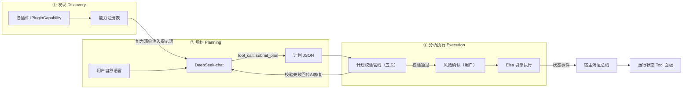
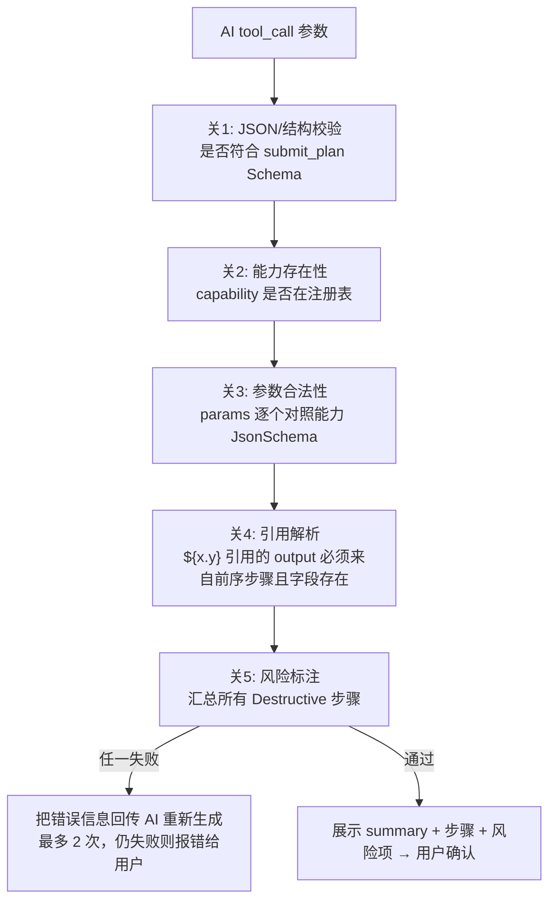
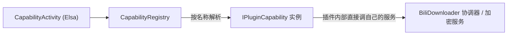
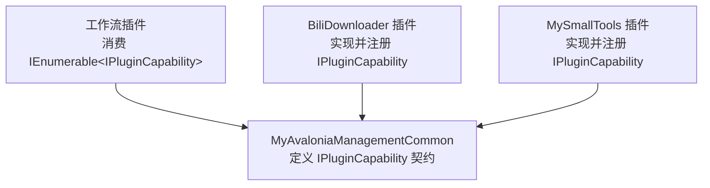

# AI 工作流插件接入可行性探索

> **文档状态：探索文档（Exploration）** —— 本文只进行方案设计与可行性论证，不代表任何已实现功能，具体实施另行立项。
>
> 探索日期：2026-08-07
> 探索范围：在 MyAvaloniaManagement 宿主上接入「AI 驱动的工作流插件」，让 AI 理解自然语言需求、编排并调用现有插件能力
> 相关文档：[`host-plugin-architecture-review.md`](./host-plugin-architecture-review.md)（宿主—插件架构评审）

---

## 1. 探索目标

验证以下需求在本项目架构下是否可行，以及怎么做：

> 用户输入一句自然语言，例如：
> 「从 a 网址调用 biliDownloader 下载内部的全部视频，使用最高画质只下载视频，下载好后使用视频加密插件将视频加密，加密后删掉原视频，加密密码是 123456」
>
> AI 自动：找到可用能力 → 生成结构化执行计划 → 经校验确认后由工作流引擎逐步调用各插件能力完成任务。

技术选型（本轮已确定）：

| 层 | 选型 | 说明 |
| --- | --- | --- |
| 工作流引擎 | **Elsa Workflows 3.x** | MIT 协议，纯 .NET 库可嵌入，Activity 模型，支持长运行/暂停恢复/持久化 |
| AI 模型 | **DeepSeek `deepseek-chat`** | OpenAI 兼容 API，支持 function calling（注意：`deepseek-reasoner` 不支持工具调用） |
| AI 调用层 | Microsoft.Extensions.AI（MEAI）或裸 HTTP | 指向 `https://api.deepseek.com` 即可 |
| 运行框架 | .NET 10 + Avalonia + Dock.Avalonia | 与宿主现有技术栈一致 |

**总体结论：可行。** 宿主已具备全部扩展点，真正的需求缺口不是工作流组件，而是「插件能力契约」这一层。

---

## 2. 架构映射：工作流插件如何套用现有扩展概念

宿主的三个核心扩展概念与工作流插件的角色对应如下（与 BiliDownloader 的模式一致）：

| 现有概念 | 工作流插件中的角色 |
| --- | --- |
| **Managed Plugin**（`IPluginModule` + `IPluginLifecycle`） | 工作流引擎作为插件级 singleton 后台服务，由宿主生命周期管理初始化/关闭 |
| **Document**（多实例） | 工作流编辑画布 / AI 对话入口 / 单次运行详情，支持保存（`ISavableDocument`） |
| **Tool**（单例侧边栏） | 工作流运行状态面板、任务队列投影（套用 BiliScheduler Tool 模式） |

接入形式上没有任何障碍，走 Managed Plugin 通道即可。

---

## 3. 总体链路：三段式流水线



三个环节的核心原则：

| 环节 | 原则 |
| --- | --- |
| 发现 | 能力描述是**数据不是代码**——注册表只是"菜单"，随插件启动自动收集 |
| 规划 | AI **只产出计划不执行**，输出被收敛到唯一一个工具 `submit_plan` |
| 执行 | 计划必须过**确定性校验**才能进引擎，AI 的错误在进引擎前被拦截或修复 |

### 3.1 两层分工（AI 规划 → Elsa 执行）

不让 AI 在工具调用循环里一步步手动执行业务（无持久化、中断即丢、易失控），而是：

- **AI 层**：只负责"理解意图 → 生成结构化计划"
- **Elsa 层**：负责持久化执行、失败停止、暂停恢复、状态投影

---

## 4. 环节①：发现（Discovery）

### 4.1 发现机制

不做动态反射扫描，走 DI 收集——每个插件在 `IPluginModule.ConfigureServices` 里注册自己的能力实现，工作流插件注入 `IEnumerable<IPluginCapability>` 即自动汇总。与现有 Managed Plugin 接入方式完全一致，零新增机制。

### 4.2 能力契约（定义在 MyAvaloniaManagementCommon）

```csharp
public enum CapabilityRisk { Safe, Destructive }

public sealed record CapabilityDescriptor(
    string Name,                  // 稳定 ID，如 "bili.download_videos"
    string Description,           // 写给 LLM 读的语义说明
    string ParametersJsonSchema,  // OpenAI tools 格式的 JSON Schema
    string ReturnsDescription,    // 返回结构说明（写给 AI，也供引用校验）
    CapabilityRisk Risk);         // 供执行前确认环节使用

public interface IPluginCapability
{
    CapabilityDescriptor Descriptor { get; }
    Task<JsonElement> InvokeAsync(JsonElement parameters, CancellationToken ct);
}
```

### 4.3 描述符质量规范（决定方案上限）

1. **Description 写给"聪明但零背景的新人"看**：说清做什么、关键枚举值含义、返回什么、副作用（尤其删除/加密类）
2. **参数枚举必须显式列出**：如 `quality: highest|medium|low`，让"最高画质"这种自然语言有确定映射目标
3. **返回值结构要写进描述**：下一步要引用它（如"返回 files 路径数组"）
4. **副作用标注**：`Risk = Destructive` 的步骤进入人工确认清单

### 4.4 探索期最小能力清单

| 能力 | 所属插件 | 风险级 |
| --- | --- | --- |
| `bili.download_videos` | BiliDownloader | Safe（写文件） |
| `crypto.encrypt_video` | MySmallTools | Safe |
| `host.delete_file` | 工作流插件代持 | **Destructive** |
| `host.open_folder` | 工作流插件代持 | Safe |

---

## 5. 环节②：AI 规划层（DeepSeek）

### 5.1 模型与调用参数

| 项 | 选择 | 理由 |
| --- | --- | --- |
| 模型 | `deepseek-chat` | 唯一支持 function calling 的 DeepSeek 模型 |
| 调用方式 | OpenAI 兼容端点 `https://api.deepseek.com` | MEAI 或裸 HTTP 均可，探索期裸 HTTP 也行 |
| temperature | 0.2~0.4 | 规划任务要确定性，不要创造力 |
| ToolMode | **强制调用** `submit_plan`（tool_choice） | 保证输出一定是结构化计划，不会闲聊 |
| 上下文 | 系统提示词 + 能力清单 + 最近 N 轮对话 + 用户输入 | 支持"刚才那个流程换个密码"这类追问 |

### 5.2 系统提示词模板（核心资产）

```text
# 角色
你是桌面工作台的工作流规划器。你唯一的职责是：把用户的自然语言需求，
转换为一份调用给定能力（capabilities）的结构化执行计划。

# 能力清单（本次会话可用，禁止使用清单之外的任何能力）
{capabilities_catalog}   ← 程序从注册表自动渲染注入，见 5.3

# 计划格式
你必须通过调用 submit_plan 工具输出计划，规则如下：
1. steps 是有序数组，按执行顺序排列；
2. 每个 step 的 capability 必须是能力清单中的 name；
3. params 只能包含该能力 Schema 中定义的参数，值必须符合类型与枚举；
4. 需要引用前序步骤的输出时，使用 "${步骤output名.字段}"；
   在 forEach 中用 "${item}" 指代当前元素；
5. 用户没有提供的可选参数不要编造，缺省即可；
6. 如果用户意图缺少必要信息（如没给网址、没给密码），不要猜测，
   改为输出 clarifying_question，向用户提出一个明确问题。

# 示例
用户：下载 https://www.bilibili.com/video/BV1xx 的全部视频，最高画质只要视频，
然后用密码 abc123 加密，加密完删掉原文件。
→ submit_plan:
{
  "summary": "下载BV1xx全部视频(最高画质/仅视频) → 逐个加密(密码abc123) → 删除原文件",
  "steps": [
    { "output": "dl", "capability": "bili.download_videos",
      "params": { "url": "https://www.bilibili.com/video/BV1xx",
                  "quality": "highest", "media": "video_only" } },
    { "forEach": "${dl.files}", "capability": "crypto.encrypt_video",
      "params": { "file_path": "${item}", "password": "abc123", "delete_source": true } }
  ]
}

# 约束
- 你不直接执行任何操作，只产出计划；
- 破坏性操作（删除文件等）必须如实体现在 summary 中，不得省略；
- 一次只处理一个需求，不要合并用户没提到的任务。
```

**提示词设计要点：**

- 能力清单**不手写进提示词**，由注册表运行时渲染——插件增删能力，提示词自动跟随
- 强制"缺信息就提问"（clarifying_question），防止 AI 脑补密码、网址
- 一个 few-shot 示例对 JSON 结构稳定性的提升远大于十条规则描述
- summary 要求如实描述破坏性操作——这是给"用户确认"界面服务的

### 5.3 能力清单的渲染格式

```text
## bili.download_videos
描述：从 B 站页面地址下载其中全部视频。quality: highest=最高画质...
参数 Schema：{...JSON Schema...}
返回：{ files: string[]（本地路径）, count: number }
```

### 5.4 `submit_plan` 工具定义（收敛 AI 输出的关键）

```json
{
  "name": "submit_plan",
  "description": "提交根据用户需求生成的执行计划",
  "parameters": {
    "type": "object",
    "properties": {
      "summary": { "type": "string" },
      "clarifying_question": { "type": "string" },
      "steps": {
        "type": "array",
        "items": {
          "type": "object",
          "properties": {
            "output":     { "type": "string" },
            "capability": { "type": "string" },
            "params":     { "type": "object" },
            "forEach":    { "type": "string" }
          },
          "required": ["capability", "params"]
        }
      }
    }
  }
}
```

AI 的每次响应只有两种合法形态：**带 steps 的计划**，或**带 clarifying_question 的反问**。

规划阶段**只暴露 `submit_plan` 一个工具**，能力清单作为"参考资料"写进系统提示词——AI 的输出结构完全可控，能力真正被调用发生在 Elsa 执行期。

---

## 6. 环节③：计划的分析与调用

### 6.1 校验管线（AI 产出 ≠ 可执行，必须过五关）



关键设计决策：

- **校验失败自动修复**：把具体错误（如 "`bili.downloads` 不存在，你是否想用 `bili.download_videos`？"）回填给 AI 重试——大模型自我纠错成功率很高，这关能拦掉大部分幻觉
- **关 4 是最重要的安全阀**：变量引用只能前向、只能引用已声明的返回字段，杜绝执行期才爆炸
- 校验全部是**确定性代码**，不依赖任何 AI 判断

### 6.2 计划 → Elsa 调用的映射规则

| 计划结构 | Elsa 映射 |
| --- | --- |
| 线性 steps | `Sequence` 内依次放 `CapabilityActivity` |
| `forEach` 步骤 | `ForEach` Activity，集合来自变量引用 |
| `${dl.files}` | Activity 执行前从 Elsa 变量容器解析（`dl` 是前一步的 output 变量名） |
| `${item}` | ForEach 当前迭代值 |
| 每个 step 的返回 | 写入以 `output` 命名的 Elsa 变量 |

执行语义（探索期先定三条）：

1. **失败即停**：某能力抛错 → 工作流停止 → 状态推给 Tool 面板 + AI 汇总失败原因
2. **Destructive 步骤前检查点**：删除类步骤执行前可设二次确认（可选开关）
3. **不做自动重试**（探索期简化；Elsa 本身有 retry 策略，后续再开）

执行引擎 Activity 骨架：

```csharp
public sealed class CapabilityActivity : CodeActivity<JsonElement>
{
    public string CapabilityName { get; set; } = "";
    public JsonElement Parameters { get; set; }   // 已解析 ${...} 引用

    protected override async ValueTask ExecuteAsync(ActivityExecutionContext context)
    {
        var registry = context.GetRequiredService<CapabilityRegistry>();
        var result = await registry.Resolve(CapabilityName)
                                     .InvokeAsync(Parameters, context.CancellationToken);
        context.SetResult(result);
    }
}
```

### 6.3 结果回流

工作流终态事件 → 消息总线 → ① Tool 面板更新状态；② AI Agent 收到结构化结果，生成一句人话总结（"已下载 8 个视频并全部加密，原文件已删除"）回给用户。

---

## 7. 调用通道选型：DI 契约调用，不走消息总线

### 7.1 为什么消息总线不能用于能力调用

现有 `MessengerService` 是 `WeakReferenceMessenger.Default` 的广播总线，`Send` 是 **void、无返回值、不保证有人接收** 的：

| 需求 | 消息总线现状 |
| --- | --- |
| 执行 `encrypt_video` 必须拿到加密后的文件路径 | ❌ `Send<TMessage>` 无返回值，单向广播 |
| 必须确认"对方真的处理了" | ❌ 没人订阅时消息静默丢失，工作流会假成功 |
| 参数校验、超时、异常传播 | ❌ 全部没有，只能自建"请求-响应"轮子（相关性 ID + 回调 + 超时） |

**广播总线适合"一对多通知"，不适合"一对一请求-响应"。**

### 7.2 正确通道：DI + 公共契约

所有 Managed Plugin 的 `ConfigureServices` 都注册进**同一个根容器**，调用链是纯 DI 的：



依赖方向的关键点——**工作流插件绝不引用 BiliDownloader 的程序集**，双方只共同依赖 `MyAvaloniaManagementCommon`：



通道职责分工：

| 通道 | 职责 | 例子 |
| --- | --- | --- |
| **DI 契约调用**（新增） | 请求-响应式的能力执行 | 下载、加密、删除 |
| **消息总线**（现有，不动） | 状态/事件广播，发完不关心谁收 | `WorkflowStepProgress`、`WorkflowCompleted` → Tool 面板、AI 汇报各自订阅 |

### 7.3 返回值设计：跨边界只用"共享类型"

规则：**跨越插件边界的参数和返回值，只能使用 BCL 类型或定义在 MyAvaloniaManagementCommon 里的类型**，绝不能用某个插件私有的类型（调用方看不见该类型，无法 cast）。

因此契约出入参统一用 `JsonElement`，三重好处：

| 好处 | 说明 |
| --- | --- |
| 跨 ALC 安全 | `JsonElement` 是 BCL 类型，永远来自同一份运行时程序集，没有类型身份问题 |
| 与 AI 无缝衔接 | DeepSeek tool_call 的 arguments 本来就是 JSON，执行结果直接回填模型，全程零转换 |
| 与 Elsa 无缝衔接 | 工作流变量存 JSON 即可持久化 |

能力实现内部的处理模式——**进了插件大门再换强类型，出门前序列化回 JSON**：

```csharp
public async Task<JsonElement> InvokeAsync(JsonElement p, CancellationToken ct)
{
    var req = p.Deserialize<DownloadRequest>();          // 插件内部私有类型，随便用
    var result = await _coordinator.DownloadAllAsync(req, ct);
    return JsonSerializer.SerializeToElement(new
    {
        files = result.FilePaths,
        count = result.FilePaths.Count
    });
}
```

---

## 8. 跨插件调用的安全性分析（基于现有加载器代码）

结合 [`PluginLoadContext.cs`](../../Host/MyAvaloniaManagement/Business/Helpers/PluginLoadContext.cs) 与 [`AssemblyLoaderHelper.cs`](../../Host/MyAvaloniaManagement/Business/Helpers/AssemblyLoaderHelper.cs) 的实际实现：

### 8.1 没有问题的部分

1. **契约类型身份安全**。`PluginLoadContext.Load` 找不到程序集时返回 `null`，ALC 规则回退到默认上下文解析。只要插件部署目录里不带 `MyAvaloniaManagementCommon.dll`，所有插件拿到的 `IPluginCapability` 就是默认上下文的同一份类型，cast 与 DI 注册/解析完全正常。
2. **对象传递、异常、线程无障碍**。ALC 隔离的是"程序集从哪加载"，不是对象。所有插件共享同一个 GC 堆、同一个 DI 容器、同一个线程池；能力实现内部 async 跑在自己的线程上，`await` 天然处理。
3. **DI 解析顺序天然正确**。所有插件的 `ConfigureServices` 执行完才 `BuildServiceProvider`，`IEnumerable<IPluginCapability>` 一定能收全。

### 8.2 必须防住的三个坑

| # | 坑 | 后果 | 对策 |
| --- | --- | --- | --- |
| 1 | **插件目录混入共享契约 DLL**（最危险） | `PluginLoadContext.Load` 优先从插件目录加载，出现两份 Common → 两个不同身份的 `IPluginCapability` → DI 集合注入**静默收空**，不报错 | publish 部署 Target 排除 Common 及宿主共享依赖（沿用现有"按文件名排除"机制） |
| 2 | 第三方库版本冲突"先到先得" | `CurrentDomain_AssemblyResolve` 遍历所有插件上下文解析，谁先命中用谁，可能串版本 | 能力方案不加剧此问题；但 Elsa 传递依赖多，应纳入"共享依赖清单"统一管理 |
| 3 | 能力的生命周期归属错 | 能力注册成 scoped/transient，工作流插件解析不到其内部依赖 | 能力统一注册为**根容器 singleton**；若内部需 scoped 资源，由能力实现自己 `CreateScope()` 用完即弃，对调用方透明 |

---

## 9. 用例句完整走一遍

输入："从 a 网址下载全部视频，最高画质只下载视频，下载好后加密，加密后删掉原视频，密码 123456"

1. **发现**：注册表有 4 个能力，渲染进系统提示词
2. **规划**：DeepSeek 返回 `submit_plan` tool_call——两个 step（download 输出 `dl`；forEach `${dl.files}` 执行 encrypt，`delete_source=true`、`password=123456`）
3. **分析**：五关校验全过；风险扫描发现 encrypt 带 `delete_source=true` → 标注"将删除原文件"
4. **确认**：UI 展示 summary + 风险项，用户点执行
5. **调用**：Elsa 执行 Sequence → ForEach，Activity 经注册表调用插件真实服务（DI 直接方法调用）
6. **回流**：状态实时投影到 Tool 面板，完成后 AI 汇总回复

---

## 10. 未知点与风险清单（探索需要验证的内容）

| # | 未知点 | 验证方式 | 影响 |
| --- | --- | --- | --- |
| 1 | DeepSeek-chat 对中文长能力清单的 tool_call 参数准确率 | 固定 10 条测试语料跑通过率 | 决定提示词要打磨到什么程度 |
| 2 | Elsa 3.x 在 net10 运行时 + PluginLoadContext 部署模式下是否正常 | 最小 console 跑一个动态构建的工作流 | 若不行，降级为自研轻量顺序执行器（计划格式不变） |
| 3 | `${var.field}` 解析遇到嵌套结构是否够用 | 用例覆盖 | 不够则引入 JSONPath，但要控制复杂度 |
| 4 | 能力清单变大后提示词膨胀（token 成本/注意力稀释） | 20 个能力规模测试 | 未来需要能力分组或 embedding 检索，探索期不做 |
| 5 | 校验修复循环是否收敛（AI 反复改不对） | 故障注入测试 | 上限 2 次重试是经验值，需实测 |
| 6 | **现有下载/加密入口是否可被封装成无 UI 依赖的能力调用** | 读现有服务接口 | 若能力入口耦合在 Document ViewModel 上，需先抽服务层（最大隐患） |

其中 #6 是现有代码侧最大的隐患：如果下载/加密的入口目前挂在 Document ViewModel 上而不是独立服务上，封装能力前要先做一轮服务抽取。

**安全红线（探索期即确立）**：

- Destructive 操作（删除文件等）执行前必须经用户确认，AI 不得全自动直达
- 密码等敏感参数在 UI 展示计划时按需脱敏；凭据不写入日志
- 能力注册表未来应支持白名单（对应架构评审中"能力权限声明"缺失项）

---

## 11. .NET 10 工程注意事项

1. **Elsa 包 TFM**：Elsa 3.x 目标框架为 net8/net9，在 net10 项目中引用可正常运行（高版本运行时向下兼容），无阻断性警告；锁定最新稳定版后先跑 PluginTests 验证。
2. **中央包管理**：项目使用 `Directory.Packages.props` + `packages.lock.json`，Elsa、`Microsoft.Extensions.AI`、`OpenAI` 包版本需加进 props，lock 模式记得 `dotnet restore --force-evaluate`。
3. **插件部署**：工作流插件独立目录部署时，Elsa 大量传递依赖 DLL 会随 publish 进入其 Controls 目录；若未来多插件共享 Elsa，应放进宿主共享依赖（按"按文件名排除"部署规则处理）。
4. **DeepSeek 模型选择**：Agent 用 `deepseek-chat`；若未来想用 reasoner 做复杂规划，只能采用"reasoner 输出文本计划 → 程序解析"的退化方案。

---

## 12. PoC 验证步骤（不做产品，只打桩验证）

| 步骤 | 内容 | 耗时 | 对应未知点 |
| --- | --- | --- | --- |
| 1 | 裸 HTTP 调 DeepSeek，塞 2 个假能力清单 + 本文系统提示词，验证 10 条语料的计划生成准确率 | 半天 | #1 |
| 2 | net10 控制台引用 Elsa，代码动态构建 Sequence + ForEach 跑通假 Activity | 半天 | #2 |
| 3 | 写校验管线五关 + 修复循环，用步骤 1 的真实 AI 输出喂进去 | 半天 | #3 #5 |
| 4 | 翻一遍 BiliDownloader / MySmallTools 现有服务层，确认能力封装点是否干净 | 检查 | #6 |

四步全绿即可进入正式实施排期；任何一步红了对应调整（例如 #2 失败则自研执行器，方案其余部分完全不受影响——**这正是把"计划格式"设计成与执行引擎解耦的价值**）。

## 13. 实施路径建议（供后续立项参考）

1. **P0**：在 Common 定义 `IPluginCapability`，让 1~2 个现有插件注册能力，建能力注册表
2. **P1**：接 DeepSeek，实现"对话 → AI 出计划 → 校验 → 直接顺序执行"（先不上 Elsa，验证价值）
3. **P2**：引入 Elsa，能力包装成 Activity，支持工作流持久化、暂停恢复
4. **P3**：Avalonia 工作流画布、运行状态 Tool、AI 自动生成工作流定义

> 注：Elsa 官方可视化设计器是 Blazor/Web 版，不能直接嵌入 Avalonia。图形化编辑器需自研（或先不做图形化，用 JSON 定义 + AI 生成工作流——与本方案天然契合）。

---

## 14. 一句话总结

**DI 负责"调用"，消息总线负责"通知"，AI 负责"规划"，Elsa 负责"执行"。** 架构上完全可行，缺的不是工作流组件，而是"插件能力契约"这一层。先把能力描述/调用契约补上，Elsa + DeepSeek 就能顺畅接进来。
