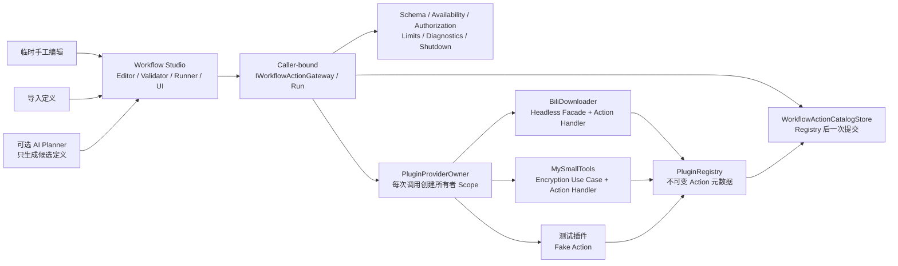

# 基于 Plugin SDK V3 / Host V4 的工作流执行与可选 AI 规划方案

> **文档状态：G0 已重新签署、G1–G4 已完成实现；G5–G10 尚未实施**
>
> 初始探索：2026-08-07
>
> 本次复核：2026-08-25
>
> 代码基线：产品 `3.0.0`、候选 Core/UI SDK `3.2.0`、Workflow SDK `1.0.0`、已封板 Host V4 internal + G1 Action 内核、.NET 10、Avalonia 12.1、manifest schema v2、每插件独立 Provider 与 `PluginLoadContext`
>
> 本文同时记录已实现的 G0–G4 与后续建议；外部 Workflow Studio v2、共享验证语义、Runner 与
> MySmallTools 非破坏性加密 Action 已存在，AI 客户端和 BiliDownloader 真实业务 Action 仍不存在。

相关事实源：

- [`host-plugin-architecture-review.md`](./host-plugin-architecture-review.md)
- [`host-v4-breaking-refactor-plan.md`](./host-v4-breaking-refactor-plan.md)
- [`external-managed-plugin-development-and-installation-plan.md`](./external-managed-plugin-development-and-installation-plan.md)
- [`Host architecture.md`](../../Host/MyAvaloniaManagement/docs/design/architecture.md)
- [`compatibility-contracts.md`](../../Host/MyAvaloniaManagement/docs/reference/compatibility-contracts.md)
- [`plugin-sdk-api-compatibility.md`](../reference/plugin-sdk-api-compatibility.md)
- [`Workflow Action G0 冻结记录`](../plan-history/workflow-action/g0-facts-naming-repositories-sdk-compatibility.md)
- [`Workflow Action G1 Host 内核记录`](../plan-history/workflow-action/g1-host-workflow-action-kernel.md)
- [`Workflow Action G2 SDK/Build/模板传播记录`](../plan-history/workflow-action/g2-sdk-build-external-template-propagation.md)
- [`Workflow Action G3 外部 Studio 记录`](../plan-history/workflow-action/g3-workflow-studio-fake-action-loop.md)
- [`Workflow Action G3.1 协议一致性记录`](../plan-history/workflow-action/g3.1-workflow-protocol-consistency.md)
- [`Workflow Action G4 MySmallTools 非破坏性加密记录`](../plan-history/workflow-action/g4-my-small-tools-nondestructive-encryption-action.md)

---

## 1. 执行结论

这个方向仍然可行，但产品核心应从“AI 自动生成并执行工作流”调整为：

> **用户可以临时手工编辑、验证并直接执行工作流；AI 只是在同一个编辑器中生成候选工作流的可选入口。**

因此首个可交付版本不依赖 DeepSeek、其他模型或工作流框架。建议实施顺序为：

1. 在 Host 中建立最小的 **Workflow Action 内核**：声明、不可变目录、调用者身份、所有者路由、可用性、Schema、授权、调用级 Scope、限制和关闭门控；
2. 用测试插件证明跨 ALC、跨私有 Provider 的受控调用成立，并产出可被外部项目消费的候选 SDK NuGet 包；
3. 更新通用外部插件模板，使其精确引用新 SDK，完成本地模板包的创建—还原—构建—打包门禁；
4. 使用新模板在 Host 仓库和 `MyAvaloniaManagement.sln` 之外创建 **Workflow Studio 插件**；
5. 在独立项目中先完成临时编辑器、确定性验证器和轻量执行器；
6. 为 MySmallTools 和 BiliDownloader 补充无 UI 应用服务并声明真实 Action；
7. 以手工编辑的工作流完成“下载 → 加密并保留源文件”的端到端闭环；
8. 完成 SDK、模板、外部插件、资源、真实包和退出门禁后，先封板一个完全不需要 AI 的 MVP；
9. 之后才把 DeepSeek 作为可选规划适配器接入；模型输出只能回填候选定义，不能越过编辑器、验证器、授权器直接执行；
10. “加密后删除源文件”和“跨进程恢复”分别作为独立后续门禁，不能阻塞手工工作流 MVP。

核心边界为：

> **提供者插件声明经过筛选的业务 Action；Host 负责目录、治理和路由；Workflow Studio 只依赖 Host Gateway，不引用业务插件程序集；手工编辑和 AI 规划最终产生同一种工作流定义。**

Workflow Studio 的建议项目名为 **`WorkflowStudio`**，产品显示名为 **MyAvalonia Workflow Studio**，稳定插件 ID 为 **`myavalonia.plugin.workflow-studio`**。它必须由外部模板生成独立 `.slnx`，不加入当前 `MyAvaloniaManagement.sln`。

### 1.1 可行性判断

| 方面 | 判断 | 主要条件 |
| --- | --- | --- |
| 临时手工编辑并执行 | 高 | 使用受约束的结构化步骤编辑器，不开放任意脚本或表达式 |
| 跨插件动作调用 | 中高 | Plugin SDK 需要兼容新增；Host 必须在所有者 Provider 内创建 invocation scope |
| 独立外部 Studio 项目 | 高 | 先发布/本地打包候选 SDK，再更新模板并由真实 nupkg 生成项目 |
| 下载后加密闭环 | 中高 | BiliDownloader 仍需新增 URL 到提交/终态的 headless Facade |
| MySmallTools 非破坏性加密 | 高 | 现有 scoped 服务、流式加密和原子输出可复用 |
| 可选 AI 规划 | 中高 | 只生成候选定义；本地验证和 Host 授权必须保持最终决定权 |
| 加密后删除源文件 | 中 | 需要新增原子业务用例、输出认证验证和故障注入矩阵 |
| 跨进程恢复/长时等待 | 当前无必要 | 出现真实需求后再评估 Elsa 等持久化引擎 |

### 1.2 MVP 产品范围

MVP 的首要入口是：

```text
新建临时工作流
→ 从可用 Action 目录添加步骤
→ 编辑常量、前序输出引用和会话 Secret 引用
→ 本地验证
→ 查看风险/预检摘要并确认
→ 直接执行
→ 查看逐步进度与结构化结果
```

MVP 的业务证明闭环为：

```text
用户输入 B 站链接、输出目录和会话密码
→ 手工工作流定义通过确定性验证
→ BiliDownloader 解析、预检、提交并等待任务终态
→ MySmallTools 对成功下载的文件逐个加密
→ 保留原视频并汇总成功/失败结果
```

MVP 明确不要求：

- AI、API Key 或联网规划；
- 自动删除原视频；
- 保存为可复用模板或应用重启后恢复运行；
- 任意分支、脚本、无限循环、并行写操作和自动补偿；
- 运行期安装、卸载或刷新插件；
- 恶意插件的进程级安全隔离。

“直接执行”只表示不需要先经过 AI；它不表示跳过 Schema 校验、业务预检、风险摘要或 Host 授权。

---

## 2. 当前项目事实与差距

### 2.1 版本事实

当前源码的产品仍为 **3.0.0**，Core/UI SDK 已兼容提升并发布 **3.2.0**，Workflow SDK 为 **1.0.0**，
Templates 为 **1.2.0**；Host V4 是已经封板的宿主内部收口代际，没有把产品或 SDK 提升到 4.0.0。
以下磁盘协议仍为 schema v2：

- `plugin.manifest.json`；
- Document envelope；
- Dock layout；
- Host 数据根代际。

后续应写“Plugin SDK V3 / Host V4 internal + manifest schema v2”，不能把 Host V4 误写成 SDK V4，也不能继续只写“基于 Host V3”。

### 2.2 已经具备的基础

| 现有事实 | 代码落点 | 对本方案的意义 |
| --- | --- | --- |
| 每插件独立 `ServiceCollection`、Provider | `PluginProviderOwner` | Action Handler 必须在所有者 Provider 内解析，不能把业务服务搬到 Host |
| 每插件独立 `PluginLoadContext` | `PluginLoadContext`、`PluginSharedAssemblyPolicy` | 跨边界只传共享 SDK/BCL 类型和 JSON，不能传业务插件 DTO |
| 显式贡献、两阶段提交、冲突所有者隔离 | `PluginRegistration`、`PluginRegistryBuilder` | Workflow Action 可作为新的显式贡献复用同一提交纪律 |
| 不可变 Registry | `PluginRegistry` | Action 目录可在启动时冻结，不需要运行期可变注册表 |
| 生命周期状态与可用性投影 | `PluginLifecycleStateStore`、`PluginAvailabilityReadModel` | 每次调用前可检查 Action 所有者是否仍可用 |
| Provider 反向释放和 Runtime 关闭顺序 | `HostRuntime.Dispose` | Gateway 可在关闭开始时拒绝新调用，再等待/取消在途调用 |
| 严格诊断白名单 | `HostDiagnostics` | 诊断只记录稳定 ID、阶段、耗时和错误码，不记录参数正文、路径或 Secret |
| 外部 SDK、模板与 Build 包已发布 | Core/UI `3.2.0`、Workflow `1.0.0`、Templates `1.2.0`、Build `1.1.2` | Studio 可以从 NuGet.org 在独立 `.slnx` 中开发；Build 协议没有随 G3.1 升版 |
| BiliDownloader 有无 UI 的提交边界 | `IDownloadSubmissionService` | 已有预检与提交基础，但输入仍是完整 `DownloadSubmission` |
| MySmallTools 有流式加密、原子输出与正式 Action | `IVideoEncryptionService`、`OutputFileTransaction`、`EncryptVideoWorkflowActionHandler` | `encrypt-video` 已保持非破坏性语义；删除源文件仍没有事务用例 |

### 2.3 G1–G4 已实现与仍不存在的能力

平台仓库已经具备 Workflow Action 公共契约、声明注册、不可变目录、caller-bound Gateway/Run、Host internal
Schema/授权/资源治理、invocation scope、诊断和关闭门控。外部 `myavalonia-workflow-studio` 仓库已经具备
非持久化 Document、结构化编辑器、严格定义 v2、双 revision、确定性引用值域验证器、风险摘要、Document Scope 会话 Secret Store、
顺序/有限 `ForEach` Runner 和 Standalone Fake Action 闭环。当前两个仓库合起来仍没有：

- AI/LLM 客户端插件；
- Host 级或持久化 Secret Store；G3 的 Secret 只存在于当前 Document 会话内存；
- Host 公共事件总线；V3 已删除公共事件总线，现有消息器均为插件私有；
- 第三方通用 JSON Schema 引擎；G3.1 的共享 Workflow SDK 只实现冻结 Profile 所需的窄校验；
- BiliDownloader 的“URL → 选择条目 → 下载提交 → 等待输出文件”无 UI Facade；
- MySmallTools 后续“加密、验证成功、删除源文件”的原子应用服务；现有 `encrypt-video` 永久保持非破坏性。

这些剩余能力不能在 UI 或说明中宣称已经可用。尤其是 G3 候选 Host 验收只证明 Studio ZIP 的发现、入口、
容器、Document 与 Gateway 组合；Fake Action 只属于 Standalone，不进入正式 ZIP，也不代表真实业务闭环完成。

---

## 3. 对原探索方案的重新评估

| 原设想 | 问题 | 调整后的决定 |
| --- | --- | --- |
| AI 是工作流的主入口 | 用户实际可以临时手工编辑后直接执行；AI 会无谓阻塞 MVP | 手工编辑是主路径，导入定义和 AI 候选是可选输入 |
| 使用 `AgentTool` 命名公共能力 | 把通用自动化边界错误绑定到 AI 概念，也容易与现有 UI `Tool` 混淆 | 公共能力改名为 `WorkflowAction`；现有 `Tool` 继续只表示 Dock 工具面板 |
| AI 插件同时承担编辑和执行 | 容易让无模型配置时产品不可用 | 建立 `Workflow Studio`；其编辑、验证和执行不依赖模型，AI 只是后续私有适配器 |
| 泛型 `IAgentToolHandler<TArguments,TResult>` | Host 无法以普通强类型调用未知插件私有泛型闭包，最终会依赖反射和未知 `ValueTask<TResult>` | 首版使用非泛型、JSON 边界的 `IWorkflowActionHandler`；插件内部可自行映射私有 DTO |
| AI 插件依赖所有业务插件 | 不符合私有 Provider 和独立 ALC | Studio 不引用业务程序集，只调用 caller-bound Gateway |
| 给 `IPluginRegistration` 直接增加成员 | 会改动已冻结的 V3 public interface | 使用新增扩展接口 + 扩展方法；不改既有接口签名 |
| Handler 为 singleton | 与 MySmallTools scoped 加密服务不匹配，也缺少调用级释放边界 | Handler 为 scoped；Host 每次调用创建并释放所有者 invocation scope |
| Host Event Bus 广播工作流状态 | 当前不存在 Host 公共事件总线 | 运行状态留在 Studio 插件内部；UI 订阅插件私有状态源 |
| 直接包装 BiliDownloader 提交服务 | 输入需要完整业务 DTO，不能从 URL 直接调用 | 先在 BiliDownloader 内新增 headless Facade，Action 只包装该 Facade |
| `deleteSourceAfterSuccess` 布尔参数 | 当前业务服务没有原子语义，临时拼接 `File.Delete` 不安全 | 后续新增独立 destructive Action，不污染非破坏性 `encrypt-video` |
| 第一阶段引入 Elsa | 当前没有持久化恢复的已验证需求 | 先实现会话内轻量顺序执行器；持久化引擎是独立可选门禁 |
| 工作流计划进入公共 SDK | 会让 SDK 过早绑定编辑器和执行器模型 | SDK 只放 Action 调用边界；定义、引用和执行器属于 Studio 私有实现 |

以下判断继续成立：

- 不能开放父容器回退、共享根 Provider、任意 `IServiceProvider` 或跨插件 Service Locator；
- Registry 只保存冻结元数据和 Handler 类型，不保存 Provider、Scope 或 Handler 实例；
- 手工输入、导入文件和模型输出都属于不可信输入；
- 新增普通 Action 提供插件不应要求修改或重编译 Studio；
- 事件通知不能代替有返回值、有超时、有授权的请求—响应调用。

---

## 4. 目标结构



### 4.1 职责边界

| 组件 | 负责 | 不负责 |
| --- | --- | --- |
| 业务插件 | 窄应用服务、输入/输出 Schema、Handler、业务错误映射 | 不暴露整个私有对象图，不执行全局授权 |
| `PluginRegistryBuilder` | 收集、校验、判重并冻结 Action 声明 | 不解析 Handler，不运行插件代码 |
| `PluginRegistry` | 保存 Owner、Descriptor、Handler 类型和目录 revision | 不保存 Provider、Scope 或实例 |
| `WorkflowActionCatalogStore` | 解决 Host Provider 先构建、Registry 后发布的时序 | 不允许二次提交或运行期追加 Action |
| `IWorkflowActionGateway` / `IWorkflowActionRun` | 列举可用 Action、创建绑定 Caller 的 Run 并提交受控调用 | 不提供服务定位，不接受 CallerId，不解释或保存工作流 |
| Host Action Executor | 可用性、Schema、授权、Scope、超时、输出限制和诊断 | 不保存提示词，不生成或解释工作流 |
| Workflow Studio | 临时编辑、引用检查、风险摘要、执行状态和 UI | 不直接解析其他插件 Provider |
| 轻量执行器 | 顺序、有限 `ForEach`、引用、取消和失败停止 | 不运行任意表达式或脚本 |
| 可选 AI Planner | 把自然语言转换为候选定义并回填编辑器 | 不直接调用真实 Action，不持有最终授权 |

### 4.2 三种入口必须汇合

```text
手工编辑 ─┐
导入 JSON ├→ 同一 WorkflowDefinition → 同一验证器 → 同一风险确认 → 同一 Runner
AI 候选 ──┘
```

不得为 AI 建立一条比手工编辑更有权限的执行通道，也不得让“直接执行”绕过验证器。

---

## 5. Plugin SDK 演进方案

### 5.1 版本决定

建议把 Workflow Action 作为 **Plugin SDK 3.1.0 的兼容新增候选**，不直接修改已经进入 v3 Shipped 的 `IPluginRegistration`。

G0 必须先用最小消费者和旧插件包证明这条路线确实满足源码/二进制兼容；若失败，停止 3.1 路线并建立 SDK V4，不能改写 v3 Shipped 基线。

G0 重新签署并由 G1 实现的公共形态：

```csharp
// Core SDK：只依赖 BCL / System.Text.Json
public interface IWorkflowActionHandler
{
    ValueTask<JsonElement> InvokeAsync(
        JsonElement arguments,
        WorkflowActionContext context,
        CancellationToken cancellationToken);
}

public interface IWorkflowActionGateway
{
    IReadOnlyList<WorkflowActionDescriptor> GetAvailableActions();

    IWorkflowActionRun CreateRun();
}

public interface IWorkflowActionRun : IAsyncDisposable
{
    Task<WorkflowActionInvocationResult> InvokeAsync(
        WorkflowActionInvocationRequest request,
        IProgress<WorkflowActionProgress>? progress,
        CancellationToken cancellationToken);
}

// UI SDK：Host 实现的新扩展面，不改变 IPluginRegistration 的成员集合
public interface IWorkflowActionRegistration
{
    void AddWorkflowAction<THandler>(WorkflowActionDescriptor descriptor)
        where THandler : class, IWorkflowActionHandler;

    void UseWorkflowActionGateway();
}

public static class WorkflowActionRegistrationExtensions
{
    public static void AddWorkflowAction<THandler>(
        this IPluginRegistration registration,
        WorkflowActionDescriptor descriptor)
        where THandler : class, IWorkflowActionHandler
    {
        // 转发到 IWorkflowActionRegistration；旧 Host 上给出明确“不支持”错误。
    }

    public static void UseWorkflowActionGateway(
        this IPluginRegistration registration)
    {
        // 转发到 IWorkflowActionRegistration。
    }
}
```

使用 JSON Handler 的原因：

- Host 可以直接通过共享 SDK 接口调用，不反射未知插件私有泛型；
- ALC 边界只出现 `JsonElement` 和 SDK 类型；
- 插件仍可在 Handler 内反序列化为私有 DTO 并调用私有应用服务；
- 输入和输出都能由 Host 按冻结 Schema 与预算验证。

关键兼容规则：

- 现有 `IPluginRegistration`、Document、Tool、Lifecycle public 签名保持不变；
- `PluginRegistration` 由 Host internal 同时实现两个接口；
- 使用 Workflow Action API 的插件 manifest 必须把 `sdk.minInclusive` 提升到 `3.1.0`；
- 未使用新能力的 3.0 插件仍可由 3.1 Host 加载；
- 新 public API 先进入 v3 `PublicAPI.Unshipped.txt`，通过 API、NuGet 和真实旧插件消费者门禁后才能发布；
- 若无法保持二进制兼容，建立 SDK V4，不保留双协议生产路径。

### 5.2 最小公共类型

Core SDK 第一版只增加：

- `WorkflowActionId`；
- `WorkflowActionDescriptor`；
- `[Flags] WorkflowActionRiskFlags`；
- `WorkflowActionConfirmationPolicy`；
- `WorkflowActionContext` 与受限进度 DTO；
- `IWorkflowActionHandler`；
- `IWorkflowActionGateway`；
- `IWorkflowActionRun`；
- 调用请求与结构化结果 DTO。

不放入公共 SDK：

- Workflow Definition、步骤、引用表达式和运行状态；
- AI Provider 请求/响应 DTO；
- Elsa Activity；
- BiliDownloader/MySmallTools 参数类型；
- Host internal Registry、授权器、执行器和 Secret Store。

### 5.3 ID、Schema 与描述符

Action ID 延续稳定 ID 纪律，并显式区别现有 UI Tool：

```text
myavalonia.plugin.bili-downloader.workflow.prepare-download
myavalonia.plugin.bili-downloader.workflow.commit-download
myavalonia.plugin.bili-downloader.workflow.await-download
myavalonia.plugin.my-small-tools.workflow.encrypt-video
```

Host 校验 Action ID 必须属于声明者的 `myavalonia.plugin.<name>.workflow.` 命名空间。

Descriptor 同时携带输入和输出 Schema。第一版不声称支持完整 JSON Schema，只冻结窄 Profile：

- 根必须是 `object`；
- 支持 `properties`、`required`、`additionalProperties: false`；
- 支持基本 `type`、`enum`、字符串/数值边界；
- 支持有 `maxItems` 的数组；
- 限制 Schema 和实例深度、属性数、字符串长度与总字节数；
- 注册时拒绝未知关键字和远程引用；
- 敏感字段由 Descriptor 的规范 JSON Pointer 列表标记，不依赖自由文本猜测。

Schema 由插件显式提供。首版不做任意 DTO 反射生成。

G0 已把首版 Profile 和资源预算冻结为可执行测试事实：

| 项目 | 冻结值 |
| --- | ---: |
| 每份输入/输出 Schema UTF-8 大小 | 64 KiB |
| 输入实例 UTF-8 大小 | 256 KiB |
| 输出实例 UTF-8 大小 | 1 MiB |
| Schema 与实例最大深度 | 16 |
| Schema 累计属性数 | 128 |
| 数组最大项数 | 1024 |
| 单字符串 UTF-8 大小 | 64 KiB |

Profile 只允许单一字符串 `type`；根必须为 `object`。对象必须显式提供 `properties` 和
`additionalProperties: false`；数组必须提供 `items` 与不超过 1024 的 `maxItems`。允许
`required`、标量 `enum`、`minLength`/`maxLength`、`minimum`/`maximum` 和数组项数边界。
组合 Schema、类型联合、未知关键字、远程 `$ref` 与非规范绝对 JSON Pointer 均拒绝。

### 5.4 Handler 生命周期

Handler 默认注册为 scoped。每次调用时 Host：

1. 在 Action 所有者 Provider 上创建独立 `IServiceScope`；
2. 在该 Scope 内解析 `IWorkflowActionHandler` 实现及私有依赖；
3. 传入只读、克隆后的参数 `JsonElement`；
4. 调用 Handler；
5. 校验、限制并克隆结果 `JsonElement`；
6. 最终释放 invocation scope。

不得把 invocation scope 登记为 Document Scope，也不得把其 `IServiceProvider` 交给消费插件。

---

## 6. Host 侧实现方案

### 6.1 组合与提交

在现有流程上增加 Action 声明：

```text
manifest / deps / entry point 预检
→ 为插件建立私有 ServiceCollection
→ Configure 收集 Document / Tool / Lifecycle / Workflow Action / Consumer 声明
→ Seal、所有权校验、追加 Host Port 和贡献根
→ 构建插件 Provider 并验证 Handler 可解析
→ 全局冲突校验，隔离冲突所有者
→ 发布不可变 PluginRegistry
→ Commit WorkflowActionCatalogStore（仅一次）
→ 启动插件生命周期
→ 创建 Workspace / UI
```

`catalogRevision` 由冻结后的规范 Descriptor 集合计算确定性哈希。执行前必须核对 revision；插件更新需要重启并产生新 revision。

### 6.2 Consumer 显式声明

只有调用 `UseWorkflowActionGateway()` 的插件才由 `PluginServiceCommitGuard` 注入绑定自身 `PluginId` 的 facade。

第一版规则：

- Action 提供插件不能同时声明 Consumer；
- Handler Context 不含 Gateway；
- Gateway facade 不暴露 CallerId 修改入口；
- Host 诊断从 facade 取得可信 CallerId，不相信请求 JSON。

这从结构上阻止首版的递归 Action 调用。若未来出现真实编排 Action 需求，再独立设计深度、调用图和死锁门禁。

### 6.3 调用顺序

Gateway 每次调用执行：

1. 检查 Runtime 是否仍接受新调用；
2. 校验 InvocationId、绑定的 CallerId 和 ActionId；
3. 从已提交目录精确查找注册项；
4. 通过 `PluginAvailabilityReadModel` 检查 Owner 是否可用；
5. 按冻结输入 Schema 验证参数并应用尺寸限制；
6. 根据风险标志和确认策略请求 Host authorizer；
7. 建立 Owner invocation scope 并解析 Handler；
8. 应用取消、超时和每插件/每运行并发限制；
9. 按输出 Schema 和预算校验结果，清理异常并写入脱敏诊断；
10. 释放 Scope，返回结构化终态。

超时只能触发协作取消，不能宣称能强杀同进程插件代码。超过关闭宽限期仍未返回属于插件缺陷；Host 不能在 Handler 仍执行时安全释放 Owner Provider。

### 6.4 授权模型

风险使用可组合标志：

- `UsesNetwork`；
- `ReadsLocalFiles`；
- `WritesLocalFiles`；
- `DeletesLocalFiles`；
- `HandlesSecret`；
- `LongRunning`。

确认策略：

- `Never`：只允许无副作用且不读取敏感数据的 Action；
- `OncePerRun`：对确定的 Action、目标和参数摘要授权一次；
- `EveryInvocation`：删除等不可恢复操作逐次授权。

G0 冻结的组合下限是：`Never` 只允许 `None`；任一非删除风险至少 `OncePerRun`；包含
`DeletesLocalFiles` 时必须 `EveryInvocation`。插件声明的是最低确认频率，Host 可以提升但不能降低。

Authorizer 是 Host internal 服务，生产实现使用 Avalonia UI，测试使用可控替身。编辑器、导入文件、模型文本和 Handler 都不能伪造授权结果。

### 6.5 关闭与在途调用

`HostRuntime.Dispose` 的目标顺序为：

```text
Workflow Action Gateway BeginShutdown
→ 拒绝新调用并取消在途调用
→ 停止 Workflow Runner 并等待会话状态收口
→ 释放 Workspace / View / Document Scope
→ 在宽限期内等待 Action 调用完成
→ 反向停止插件 Lifecycle
→ 反向释放插件 Provider
→ 释放 Host Provider
```

必须用竞态测试证明 Handler 尚在执行时 Owner Provider 不会被提前释放。实际实现还要避免 UI 消息循环结束后等待需要 UI 线程回调的授权请求。

---

## 7. Workflow Studio 插件方案

Workflow Studio 是普通 Managed Plugin，使用自身私有 Provider 和 ALC。它通过 `UseWorkflowActionGateway()` 获取唯一跨插件端口，并贡献非持久化 Document/Tool UI。

### 7.1 外部项目名称与仓库边界

建议直接采用以下稳定命名：

| 用途 | 名称 |
| --- | --- |
| Git 仓库名（建议） | `myavalonia-workflow-studio` |
| 本地解决方案根 | `WorkflowStudio` |
| 解决方案 | `WorkflowStudio.slnx` |
| 真实插件项目 | `WorkflowStudio.Plugin` |
| 独立预览项目 | `WorkflowStudio.Standalone` |
| 测试项目 | `WorkflowStudio.Tests` |
| 产品显示名 | `MyAvalonia Workflow Studio` |
| manifest PluginId | `myavalonia.plugin.workflow-studio` |
| 默认插件版本 | `1.0.0` |

名称不包含 AI，因为手工编排是永久主能力，AI 只是后续可选入口。`PluginId` 是持久身份，发布后不随显示名称、仓库名或 AI Provider 改变。

SDK 和模板通过门禁并发布后，在 Host 仓库之外执行：

```powershell
dotnet new install MyAvaloniaManagement.Plugin.Templates@1.2.0
dotnet new myavalonia-plugin `
  -n WorkflowStudio `
  --plugin-id myavalonia.plugin.workflow-studio
```

模板 `1.1.0` 是当前公开版本。生成结果必须是独立仓库/解决方案：

```text
WorkflowStudio/
├─ WorkflowStudio.slnx
├─ Directory.Build.props
├─ Directory.Packages.props
├─ src/
│  ├─ WorkflowStudio.Plugin/
│  └─ WorkflowStudio.Standalone/
├─ tests/
│  └─ WorkflowStudio.Tests/
└─ docs/
```

边界规则：

- 不把该项目加入 `MyAvaloniaManagement.sln`，也不复制进 Host 仓库的 `Plugins/`；
- 外部项目只通过精确版本 NuGet 包引用 Core SDK、UI SDK 和 Build 包，禁止 `ProjectReference` 到 Host 源码；
- 从 NuGet.org 精确还原 SDK `3.1.0` 与 Build `1.1.2`；不能依赖 Host 的 `artifacts` 目录，也不提交开发机 feed 绝对路径；
- Standalone 只注入受控 Fake Gateway 预览 UI；真实目录、授权、跨 ALC 调用和关闭顺序必须把插件 ZIP 部署到候选 Host 验收。

当前公开模板 `1.1.0` 使用模板引擎内置 `name` 的普通正则派生合法类型名，实测
`-n MyAvalonia.WorkflowStudio` 可锁定还原、零警告编译和测试；命名空间仍保留点分名称。

### 7.2 插件内部模块

```text
Action Catalog Projection
        ↓
Temporary Workflow Editor ← JSON Import
        ↑
Optional AI Candidate Adapter
        ↓
Deterministic Definition Validator
        ↓
Risk Summary / User Confirmation
        ↓
Lightweight Workflow Runner
        ↓
IWorkflowActionGateway
```

编辑器、验证器、执行器和 UI 不依赖任何模型类型。没有 API Key、没有 AI 配置或模型服务不可用时，手工工作流必须完整可用。

### 7.3 临时编辑器

MVP 使用结构化编辑器，而不是任意脚本编辑器：

- 从当前可用 Action 目录添加、删除和排序步骤；
- 根据输入 Schema 编辑常量参数；
- 为兼容字段选择前序步骤输出引用；
- 为敏感字段选择会话 Secret 引用；
- `ForEach` 只能引用前序步骤的有界数组输出；
- 显示字段错误、失效 Action、目录 revision 变化和风险摘要；
- 可查看/导入规范 JSON，但导入后仍必须解析到同一个结构化模型；
- “执行”按钮只在本地验证通过后可用。

MVP 的临时定义和运行记录只存在内存，关闭 Document 或应用即丢弃。这样可以先证明编辑和执行价值，不提前绑定 Document 持久化、迁移或 Secret 恢复协议。

### 7.4 最小工作流定义

工作流格式属于 Studio 私有、版本化数据，不属于 Plugin SDK：

```json
{
  "schemaVersion": 1,
  "catalogRevision": "sha256:...",
  "summary": "下载后逐个加密并保留源文件",
  "steps": [
    {
      "id": "prepare",
      "actionId": "myavalonia.plugin.bili-downloader.workflow.prepare-download",
      "arguments": {
        "url": "https://www.bilibili.com/video/...",
        "selection": "all",
        "quality": "highest",
        "mediaMode": "video-only",
        "outputDirectory": "D:\\Videos"
      }
    },
    {
      "id": "commit",
      "actionId": "myavalonia.plugin.bili-downloader.workflow.commit-download",
      "arguments": { "preparationId": "${prepare.result.preparationId}" }
    },
    {
      "id": "await",
      "actionId": "myavalonia.plugin.bili-downloader.workflow.await-download",
      "arguments": { "batchId": "${commit.result.batchId}" }
    },
    {
      "id": "encrypt",
      "forEach": "${await.result.succeededFiles}",
      "actionId": "myavalonia.plugin.my-small-tools.workflow.encrypt-video",
      "arguments": {
        "inputPath": "${item.path}",
        "outputPath": "${item.path}.secvid",
        "password": "${secret.videoPassword}"
      }
    }
  ]
}
```

密码由 UI 密码框写入 Studio 的会话内存 Secret Store。定义正文、导出 JSON、Document 信封和诊断只允许出现 secret reference，不允许出现 secret value。

### 7.5 确定性验证

执行前至少验证：

- `schemaVersion` 和 `catalogRevision`；
- 步骤 ID 唯一、ActionId 存在且 Owner 可用；
- 参数在引用解析前后的 Schema 兼容性；
- 只允许引用前序输出，不允许循环或跨作用域引用；
- `ForEach` 来源和最大项数；
- 步骤数、字符串、参数、输出、总运行时间和重试预算；
- 所有 Secret reference 都有当前会话值；
- 风险组合能生成可理解的授权摘要。

### 7.6 轻量执行器能力

MVP 只实现：

- `Sequence`；
- 有最大项数的顺序 `ForEach`；
- 只引用前序步骤输出；
- 步骤失败即停止；
- 用户取消；
- 只在内存保存步骤状态；
- InvocationId 和仅对明确可重试 Action 的有限重试；
- 受控进度投影。

MVP 不实现：

- 任意表达式、脚本和无限循环；
- 并行写操作；
- 执行中自由改写定义；
- 自动补偿；
- 应用重启恢复。

### 7.7 可选 AI 规划

AI 接入发生在手工 MVP 封板之后：

```text
自然语言
→ 模型读取筛选、脱敏后的 Action Descriptor
→ 模型提交候选 WorkflowDefinition
→ 回填同一个临时编辑器
→ 本地确定性验证
→ 用户检查/修改并确认
→ 同一个 Runner 执行
```

DeepSeek 可以是第一个私有适配器，但 Studio 的定义格式、编辑器、验证器和 Runner 不使用 DeepSeek 类型。第一版 AI 不获得真实 Gateway，不能直接调用 mutating Action。

若未来要求 AI Provider 作为独立可卸载插件，必须另行设计窄的 Planner Contribution；当前 Host 没有跨插件服务发现，不能为了拆包恢复 Service Locator 或公共事件总线。

---

## 8. 两个真实插件的接入评估

### 8.1 BiliDownloader：可行，但必须先补 headless 用例

可直接复用：

- `DirectLinkProvider` 的链接规范化与短链展开；
- 内容源解析与媒体探测服务；
- `IDownloadSubmissionService.PreflightAsync`；
- `IDownloadSubmissionService.CommitAsync`；
- `BiliDownloadCoordinator`、任务仓储和已有取消/恢复语义；
- `SubmissionPreflightReport.Fingerprint` 的 TOCTOU 防护。

不能直接作为 Action 使用：

- `BiliDownloaderViewModel`、`DownloadSourceWorkflowViewModel` 和 UI 状态；
- 需要用户控件状态才能拼出的 `DownloadSubmission`；
- 插件私有消息器的 fire-and-forget 路径。

需要先新增插件内部 `IWorkflowDownloadFacade`：

1. `PrepareFromUrlAsync`：解析 URL、选择全部内容、解析“最高画质/仅视频”、构造 `DownloadSubmission` 并预检；
2. 把 `PreparedSubmission` 存入有容量和 TTL 的插件私有缓存，返回不透明 `preparationId` 与脱敏摘要；
3. `CommitAsync`：确认后按 preparationId 提交，保留现有 fingerprint 复检；
4. `AwaitBatchAsync`：按任务 ID 等待终态，返回成功输出路径和失败码；
5. 关闭时取消等待，不改变 Coordinator 生命周期所有权。

首批 Action：

| Action | 风险 | 返回 |
| --- | --- | --- |
| `prepare-download` | `UsesNetwork` | preparationId、条目数、预估空间、警告摘要 |
| `commit-download` | `UsesNetwork + WritesLocalFiles + LongRunning` | batchId、taskIds |
| `await-download` | `LongRunning` | succeededFiles、failedItems、终态 |

主要未知量在 URL 到完整 `DownloadSubmission` 的默认策略和任务终态等待接口，因此该部分可行性为中等，需要独立 G 阶段验证，不能与 Studio UI 同时大改。

### 8.2 MySmallTools：非破坏性加密可直接推进

可复用：

- `IVideoEncryptionService.PreflightAsync`；
- `IVideoEncryptionService.EncryptAsync`；
- `Secvid03Encryptor` 的分块 AES-GCM；
- `OutputFileTransaction` 的临时文件、Flush 和同卷提交；
- 现有 scoped 生命周期和取消链。

首个 Action：

| Action | 风险 | 语义 |
| --- | --- | --- |
| `encrypt-video` | `ReadsLocalFiles + WritesLocalFiles + HandlesSecret + LongRunning` | 输出成功提交后返回目标路径；始终保留源文件 |

Handler 在 invocation scope 中解析 `IVideoEncryptionService`，不依赖 Document 或 ViewModel。由于现有业务边界已经存在，这一阶段可行性高。

“删除源文件”不能由 Handler 在 `EncryptAsync` 返回后直接调用 `File.Delete`。开放前必须新增 MySmallTools 内部事务用例，例如 `IVideoEncryptionCommitService`，至少保证：

1. 正式输出使用现有临时文件事务提交；
2. 对正式输出执行格式和认证验证；
3. 验证成功后才尝试删除源文件；
4. 删除失败返回 `EncryptedButSourceRetained`，不能谎报全成功；
5. 取消、磁盘满、目标冲突、验证失败、源文件被占用均有故障注入测试；
6. 重复 InvocationId 不会重复破坏文件。

通过后只增加独立 destructive Action，不给 `encrypt-video` 添加默认删除布尔参数。

---

## 9. G0–G10 可行性实施方案

本节采用其他设计任务书的阶段口径：每个 G 都给出目标、前置、生产变化、验证、退出条件和整体回滚单位。G0–G7 构成不依赖 AI 的 MVP 主线；G8–G10 是从已封板 MVP 分出的独立可选能力。Host/SDK/模板留在当前平台仓库，`WorkflowStudio` 留在独立外部仓库，两边只通过版本化 NuGet 包和真实插件 ZIP 相交。

### G0：冻结事实、命名、仓库与 SDK 兼容路线

> **状态：已完成（2026-08-25）；生产功能变化：无。**

- **目标**：冻结 `WorkflowAction` 命名、稳定 ID、风险标志、确认语义、Schema Profile、输入/输出预算、非泛型 JSON Handler 契约，以及“平台仓库/外部插件仓库”边界。
- **前置**：以当前干净、可追溯的 Plugin SDK V3 / Host V4 internal 基线为唯一输入；记录实际 revision、测试数和 API 基线哈希。
- **验证**：最小 Host/插件消费者证明“扩展接口 + 扩展方法”不修改 `IPluginRegistration`；旧 3.0 真实插件包可被候选 3.1 Host 加载；使用新 API 的插件被旧 Host 明确拒绝；非泛型 Handler 可跨独立 ALC 调用；记录外部项目名 `WorkflowStudio` 和 PluginId `myavalonia.plugin.workflow-studio`。
- **退出条件**：形成 SDK 3.1 可兼容或必须转 SDK V4 的明确结论；不能用“预计兼容”进入 G1。
- **回滚**：删除全部候选 API 和试验夹具，回到原 3.0.0 基线；不得改写 v3 Shipped、预建外部正式项目或保留半套命名。

实测结论为 **`sdkRoute=3.1-compatible-addition`**。G0 以提交
`030a4fca408f72aed75500c105dc51af855d9af7`、Git tree
`d961e506357fbb6cc7f160f18b65acec0e3b72f5` 为输入，在隔离副本中生成 SDK 3.1 候选：

- 生产 Core/UI v3 Shipped 仍为 127/45，SHA-256 分别为
  `063BCB5852827612B0501C135D23FECD015069A6F7DDB409547157E4FA00F80F` /
  `B11FBE768C3AD04CA65CBF5128BF6FCE8C00058EBB24052D51FE5464A65AD803`，G1 生产 Unshipped 为 72/6；
- 重新签署 API 已登记为 Core 72、UI 6 条 Unshipped，`IPluginRegistration` 原成员集合不变；
- 3.0 Host 在加载伪入口 DLL 前拒绝 `sdk.minInclusive=3.1.0`，候选 3.1 Host 可发现并组合真实 3.0
  MyPlugTest ZIP；Provider 与 Consumer 分处两个 `PluginLoadContext`，只经默认 ALC 的共享 SDK、
  caller-bound Gateway 和 JSON 完成非泛型 Handler 调用；
- 专项旧 Host 1/1、候选协议 14/14 通过；详细命令、包摘要、SOLID 取舍和非发布边界见
  [G0 专用记录](../plan-history/workflow-action/g0-facts-naming-repositories-sdk-compatibility.md)。

G1 已按重新签署的 Run/进度边界把候选形状写入 v3 `PublicAPI.Unshipped.txt` 并实现 Host 内核；
若后续必须改变这些边界，应退回 G0 再次签署。

### G1：Host Workflow Action 内核

> **状态：已完成（2026-08-25）；实现与非发布证据见 [G1 专用记录](../plan-history/workflow-action/g1-host-workflow-action-kernel.md)。**

- **目标**：完成 Action Provider/Consumer 声明、不可变目录、caller-bound Gateway、invocation scope、Schema、授权、预算、取消、并发限制和关闭门控。
- **前置**：G0 兼容路线已签署；Schema Profile 和 public API 不再漂移。
- **生产变化**：修改 SDK、`PluginRegistration`、`PluginRegistryBuilder`、`PluginRegistry`、`PluginServiceCommitGuard`、`PluginProviderOwner`、Host 组合根、诊断和关闭顺序。
- **验证**：使用两个测试插件覆盖跨 ALC/Provider 调用、无 Consumer 不注入、CallerId 不可伪造、非法/冲突 ActionId、Owner 不可用、输入/输出越界、Scope 释放、授权拒绝、取消、超时和关闭竞态。
- **退出条件**：Consumer 不引用 Provider 程序集即可列举并调用 Fake Action；所有既有容器隔离、真实旧插件包和 Host V4 门禁保持通过；产出候选 Core/UI SDK `3.1.0` nupkg 和可运行的候选 Host。
- **回滚**：整体回到 G0；不得留下只可注册但不能治理的目录，或为了调用方便开放通用 Provider 解析。

### G2：SDK 包、Build 包与外部模板传播门禁

> **状态：已完成（2026-08-25）；实现与非发布证据见 [G2 专用记录](../plan-history/workflow-action/g2-sdk-build-external-template-propagation.md)。**

> **可行性：高；这是平台能力对外可消费的必要门禁。**

- **目标**：把 G1 能力通过真实 NuGet 包交给外部项目；更新通用模板的精确 SDK 版本、SDK 最低区间、lock file、示例和文档，并把模板从 `1.0.4` 提升为 `1.1.0`。
- **前置**：G1 API、包依赖图和 Host 行为已经稳定；确认 manifest schema 没有变化。若 Build 协议未变化，`MyAvaloniaManagement.Plugin.Build` 可保持 `1.1.2`；只有构建校验/打包协议确有变化时才提升它。
- **生产变化**：更新 `Packaging/MyAvaloniaManagement.Plugin.Templates`；模板精确引用 SDK `3.1.0`，生成项目的 `ManagedPluginSdkMinInclusive` 同步为 `3.1.0`。不在模板中硬编码 Workflow Studio 业务代码。
- **验证**：在机器本地临时 NuGet feed 中放入 Core/UI、必要时的 Build 和 Template 包；卸载旧模板，安装候选模板，在系统临时目录生成通用探针项目，执行隔离还原、零警告构建、测试、Standalone 启动检查、确定性 ZIP/manifest 和候选 Host 加载；另以带点号名称做负例，模板必须明确拒绝或正确生成，不能直到 C# 编译才暴露非法标识符。
- **退出条件**：新生成项目不引用任何 Host 源码即可使用 `IWorkflowActionHandler`、`AddWorkflowAction` 和 `UseWorkflowActionGateway` 编译打包；旧模板/SDK 组合不能误编译新 API。
- **回滚**：整体回到 G1 的候选 SDK/Host；不得发布或覆盖同版本模板包。模板是创建时快照，不能把更新后的模板再次覆盖应用到已有项目。

实测结论：Core/UI `3.1.0` 与 Templates `1.1.0` 已通过本地候选门禁并发布，Build 协议未变化并继续精确消费
NuGet.org 的 `1.1.2`。模板三个项目均提交 lock file；普通名称、点号名称、Provider 和 Consumer 四套
生成结果都以 `--locked-mode` 通过。两个外部插件分别打包两次并由候选 Host 在独立 ALC 中完成一次
caller-bound 结构化调用。公开 SDK `3.0.0` 的负例在还原成功后因缺少 Workflow Action 符号而失败。

### G3：用新模板创建外部 Workflow Studio 与 Fake Action 闭环

> **状态：已完成（2026-08-25）；实现与非发布证据见 [G3 专用记录](../plan-history/workflow-action/g3-workflow-studio-fake-action-loop.md)。**
>
> **可行性：高；这是独立解决方案边界和产品概念的共同证明。**

- **目标**：使用 G2 模板在 Host 仓库之外创建 `WorkflowStudio.slnx`，实现非持久化 Studio Document、结构化步骤编辑器、定义 v1、确定性验证器、会话 Secret Store、风险摘要和轻量 Runner。
- **前置**：G2 的包和模板门禁通过；外部项目从 NuGet.org 精确还原正式包，不使用跨仓库 `ProjectReference`。
- **生产变化**：新增独立仓库 `myavalonia-workflow-studio`，解决方案名为 `WorkflowStudio`；当前 Host 的 `MyAvaloniaManagement.sln` 不增加项目。Standalone 注入 Fake Gateway，真实 Host 使用 caller-bound Gateway。
- **验证**：手工添加/排序步骤、常量与引用、顺序 `ForEach`、取消、失败停止、目录 revision 失效、关闭丢弃、Secret 不进入定义/日志；覆盖恶意 JSON、循环引用、未知 Action、越界数组和超预算运行；同时验证独立 restore/build/test/package。
- **退出条件**：用户能在无模型、无 API Key、无规划网络条件下，在独立项目产出的插件中临时编辑并执行 Fake Action 工作流；ZIP 可由候选 Host 加载。
- **回滚**：整体回到 G2；外部仓库可直接丢弃并由模板重新生成，Host/SDK 不受影响；不得把 Studio 源码搬回平台解决方案规避包问题。

实测结论：外部仓库使用已发布 Templates `1.1.0` 生成 `WorkflowStudio.slnx`，从 NuGet.org 精确消费
Core/UI SDK `3.1.0` 与 Build `1.1.2`，没有 Host 源码引用或跨仓库 `ProjectReference`。Standalone 以
`generate-items → format-item` 完成 4 次顺序调用和单 Run 释放；43/43 测试通过，行/分支覆盖率为
85.57%/76.52%，两次插件 ZIP 构建哈希一致。候选 Host 隔离副本加载正式 ZIP 并以退出码 0 自动关闭，
未发现 Plugin、入口、容器、Document 或 Workflow Gateway 错误。该验收不包含 G4/G5 真实 Provider，
也没有接入 AIFLOW、Windows CI、Release Acceptance、发布门禁、标签或上传。

### G3.1：协议一致性与静态引用安全

> **状态：已完成实现；证据见 [G3.1 专用记录](../plan-history/workflow-action/g3.1-workflow-protocol-consistency.md)。**

- **目标**：在 G4 真实业务 Action 前消除 Host/Studio 两套 Schema、路径和 revision 算法，并让类型、optional
  输出、数组索引与 ForEach 聚合形状在运行前得到确定结论。
- **平台变化**：新增窄包 `MyAvaloniaManagement.PluginSdk.Workflow 1.0.0`；Core/UI 提升到 3.2.0；Host
  Descriptor、输入输出与目录统一使用共享实现，并由默认 ALC 提供 Workflow 程序集。
- **Studio 变化**：插件 1.1.0 硬切定义 v2；Contract 漂移阻止执行，Presentation 漂移只告警；引用失败
  转为结构化结果；MainDocument 拆分编辑协调器和运行会话。
- **非目标**：不修改 Build、Templates、Host 产品与业务插件，不引入 AI、脚本、Mediator 或工作流框架。

### G4：MySmallTools 非破坏性加密 Action

> **可行性：高；可最早验证真实文件副作用。**

> **状态：已完成（2026-08-26）；MySmallTools `3.1.0` 本地候选与 Workflow Studio `1.1.0`
> 真实双 ZIP 开发门禁通过，未执行发布流程。**

- **目标**：用 scoped Handler 包装 `IVideoEncryptionService`，保持“成功生成加密文件、始终保留源文件”的单一语义。
- **前置**：G1 调用、授权、Secret 遮蔽和输出预算已通过；准备小型合法测试媒体。
- **生产变化**：MySmallTools 注册一个 Action 与私有 Handler；不改现有 UI 用例语义，不增加删除能力。
- **验证**：预检、密码下限、目标冲突、取消、磁盘不足、临时文件清理、正式输出认证、invocation scope 释放、重复 InvocationId 行为和真实插件包组合。
- **退出条件**：不接 AI，通过外部 Studio 插件的手工工作流可确定性加密测试媒体，失败时源文件保留且不留下正式损坏文件。
- **回滚**：整体移除 Action 声明和 Handler，保留原加密服务；不得让 UI 改走专用 Action 形成双入口回归。

实装合同固定为路径与密码必填、公开标题/描述可选，风险为读取/写入本地文件、处理 Secret 和长任务，
确认频率为 `OncePerRun`，敏感指针为 `/password`。Handler 只适配现有 scoped 应用服务；Studio 没有增加
MySmallTools 预设或程序集引用。重复相同参数会获得新的 Host InvocationId，并由既有不覆盖预检以
`OutputConflict` 失败；Caller 从来不能指定或重复 InvocationId。

完整本地开发门禁实测 **820/820**、失败 0、跳过 0；MySmallTools 总覆盖率为 **73.49% / 49.25%**，
G4 Action 文件行覆盖率 **94.12%**，Studio 为 **87.69% / 81.93%**。两侧候选 ZIP 均通过两次确定性
比对与真实独立 ALC 闭环；本轮 `windowsCi/windowsSmoke/releaseGate/publishable` 均为 `false`。

### G5：BiliDownloader headless 下载 Action

> **可行性：中；是 MVP 最大业务不确定项。**

- **目标**：新增 URL 准备、TTL 缓存、提交和等待终态 Facade，并声明三个窄 Action。
- **前置**：冻结“全部条目/最高画质/仅视频”等默认策略；确认 Coordinator 可按提交结果稳定等待终态和取得输出路径。
- **生产变化**：只在 BiliDownloader 内新增 headless 应用服务、缓存、等待投影和 Handler；不让 Handler 依赖 ViewModel、Control 或窗口。
- **验证**：mock HTTP、短链、凭据缺失、空内容、预检警告、fingerprint 变化、重复提交、TTL 过期、部分任务失败、取消、插件关闭、输出路径脱敏和真实插件包组合。
- **退出条件**：不接 AI，通过外部 Studio 插件的手工工作流可从测试 URL 完成准备、确认、提交、等待并取得成功输出路径。
- **回滚**：整体移除 Facade、缓存和三个 Action，回到现有 UI 提交链；不得绕过 `IDownloadSubmissionService` 或 Coordinator 锁内提交。

### G6：手工跨插件业务闭环

> **可行性：中高；G4、G5 通过后主要是确定性编排。**

- **目标**：在 Studio 内手工完成“下载 → 对成功文件逐个加密 → 保留源文件”，并形成清晰的逐步结果。
- **前置**：G4 与 G5 各自独立通过；固定小型本地/模拟下载源和可验证媒体。
- **生产变化**：只完善 Studio 定义验证、结果引用和顺序 `ForEach`；不增加 AI、删除、持久化恢复或任意分支。
- **验证**：下载预检阻断不提交、下载失败项不加密、部分成功只处理成功文件、加密失败不影响源文件、取消和应用退出有受控终态、目录 revision 变化拒绝执行。
- **退出条件**：固定定义和 UI 手工构造定义均能重复完成 E2E；所有副作用都有用户可理解的授权摘要。
- **回滚**：整体回到 G5，保留各单 Action；不得用业务特判硬编码 BiliDownloader/MySmallTools 的类型或 Action 列表到 Runner。

### G7：跨仓库 MVP 集成回归与封板

> **可行性：高；只签署 G0–G6 已完成事实。**

- **目标**：把 SDK、Host、Build/Template、外部 Studio、两个真实 Action 提供插件、诊断、文档和制品签署为同一“不依赖 AI 的手工工作流 MVP”基线。
- **前置**：G0–G6 分阶段记录完整；平台仓库和外部仓库分别固定可追溯 revision；没有未解释的测试降级、包漂移或资源泄漏。
- **生产变化**：原则上无；只允许修复 G0–G6 暴露的职责内回归，不新增功能。
- **验证**：Core/UI API、真实 nupkg、Build/Template 生成探针、Host Unit/UI/Plugin、四真实插件、外部 Studio 独立 restore/build/test/package、跨插件 E2E、资源回归、隔离克隆、Windows Smoke、确定性 ZIP/manifest 和诊断脱敏。外部 Studio 验收必须从 NuGet 包构建，不能访问 Host 源项目。
- **退出条件**：无 AI、无 API Key 环境下，模板生成链和外部插件安装包均可重复构建，候选 Host 可完成临时编辑和真实 E2E；两个仓库的 revision、包版本、lock file、制品哈希及发布边界有专用记录。
- **回滚**：封板失败回到最后一个已通过 G，不在门禁脚本中修改 API、格式或业务语义。

### G8：可选 AI 候选规划

> **可行性：中高；独立于 MVP，失败不影响手工使用。**

- **目标**：接入一个私有模型适配器，把自然语言转换为候选定义并回填现有编辑器。
- **前置**：G7 已封板；重新核对实施时 DeepSeek 官方模型、结构化输出、配额、数据政策和 Secret 存储方式。
- **生产变化**：只在 Studio 内新增可选适配器、设置和候选预览；不向模型注入 Gateway，不修改 Runner 权限。
- **验证**：中文固定语料覆盖缺参追问、幻觉 ActionId、非法枚举、提示注入、目录 revision 变化、Secret 诱导和超预算定义；断网、无 Key、限流时手工路径保持可用。
- **退出条件**：任何模型输出都只能进入现有编辑/验证路径，不能绕过 Host 授权调用真实 Action。
- **回滚**：整体移除模型适配器和设置，G7 手工 MVP 不变；不得在 Host 共享程序集闭包加入模型 SDK。

### G9：删除源文件的破坏性能力

> **可行性：中；与 AI 无关，必须单独授权和验收。**

- **目标**：新增 MySmallTools 原子加密提交服务、正式输出认证验证、幂等记录和独立 destructive Action。
- **前置**：G7 已封板；业务明确接受删除语义和部分成功状态。
- **生产变化**：新增独立 Action；`encrypt-video` 继续永久保持非破坏性语义。
- **验证**：取消、磁盘满、目标冲突、认证失败、源文件占用、删除失败、进程退出和重复 InvocationId 的完整故障矩阵；`EveryInvocation` 授权不可复用。
- **退出条件**：不存在“输出未验证却删除源文件”的路径；删除失败明确报告 `EncryptedButSourceRetained`。
- **回滚**：整体移除 destructive Action 和提交服务，回到 G7；不回填布尔开关到原 Action。

### G10：持久化定义或恢复引擎的需求门禁

> **可行性：待需求决定；当前不应进入实施。**

- **目标**：先区分“保存可复用定义”和“恢复正在运行的实例”，二者不能被一个工作流框架概念混合。
- **触发条件**：用户明确需要保存模板时，先设计 Studio 私有定义 schema、迁移和不含 Secret 的持久化；只有出现跨进程恢复、数小时/数天等待、人工审批书签、复杂分支或定时器后，才评估 Elsa 等引擎。
- **验证**：PoC 必须覆盖 .NET 10、独立 ALC、win-x64 发布资产、数据库迁移、关闭顺序、Action 幂等和 Secret 不落盘。
- **退出条件**：有真实用例、故障模型、数据迁移和运维成本证明引擎收益大于轻量 Runner；否则结论应是继续不引入。
- **回滚**：PoC 与 G7 生产路径隔离；不得在没有恢复需求时把轻量 Runner 替换成持久化引擎。

### 9.1 阶段依赖

```text
G0 → G1（Host / SDK）
      → G2（候选 NuGet / Template）
      → G3（外部 WorkflowStudio）→ G3.1（共享协议与引用安全）
      → G4（加密 Action）→ G5（下载 Action）→ G6（手工 E2E）→ G7（跨仓库 MVP）
                                                              ├→ G8（可选 AI）
                                                              ├→ G9（可选删除）
                                                              └→ G10（需求触发的持久化评估）
```

G8、G9、G10 互不作为前置，也都不能反向改变 G7 的非 AI 可用性。

---

## 10. 代码落点

| 区域 | 计划改动 |
| --- | --- |
| `MyAvaloniaManagement.PluginSdk` | Action ID、Descriptor、Risk、Handler、Context、Gateway 和调用 DTO |
| `MyAvaloniaManagement.PluginSdk.UI` | 新增扩展注册接口与扩展方法；不修改既有 `IPluginRegistration` 签名 |
| `PluginRegistrationContext.cs` | 收集 Action/Consumer 声明并冻结 Handler 类型 |
| `PluginServiceCommitGuard.cs` | 保留 Host Port 所有权，向显式 Consumer 注入 caller-bound Gateway |
| `PluginRegistryBuilder.cs` | 本地校验、全局冲突、Owner 命名空间和 Schema Profile 校验 |
| `PluginRegistry.cs` | 冻结 Action 注册、Consumer 和 catalog revision |
| `PluginProviderOwner.cs` | 增加 invocation scope 内的受控 Handler 调用，不暴露 Provider |
| `PluginLifecycleStateStore.cs` | 复用 `IsAvailable`；不新增第二套生命周期事实 |
| `HostRuntime.cs` | Catalog commit、Gateway shutdown 和在途调用等待 |
| Diagnostics | 增加少量稳定错误码；继续遵守 schema 2 脱敏白名单 |
| `Packaging/MyAvaloniaManagement.Plugin.Templates` | 精确提升 SDK 版本与最低区间，更新 lock file、模板文档和外部生成门禁；不加入业务专用代码 |
| BiliDownloader | 新增 headless 下载 Facade、准备缓存、等待终态和三个 Handler |
| MySmallTools | 先新增非破坏性加密 Handler；后续另建删除事务用例 |
| 外部 `WorkflowStudio` 仓库 | 临时编辑器、定义/验证/Runner、会话 Secret、Document/Tool UI；AI 仅为可选后续适配器 |

明确禁止：

- 合并插件 ServiceCollection；
- Registry 保存 Provider、Scope 或 Handler 实例；
- Gateway 接受调用方传入的 CallerId；
- 把 `WorkflowStudio` 加入 `MyAvaloniaManagement.sln` 或复制到平台仓库 `Plugins/`；
- 外部 Studio 使用 `ProjectReference`、源码链接或相对路径引用 Host/SDK 项目；
- Studio 引用 BiliDownloader/MySmallTools DLL；
- 把模型 SDK、Elsa 或业务依赖加入 Host 共享程序集闭包；
- 通过反射把任意 public 方法自动暴露为 Action；
- 恢复 Host 公共事件总线；
- 为方便调用而打开通用跨插件服务解析；
- 让 AI 获得比手工编辑更高的权限。

---

## 11. 最终验收矩阵

### 11.1 SDK 与隔离

- [x] 既有 v3 Shipped public API 未改写；
- [x] 3.0 真实插件包可被候选新 Host 加载；
- [x] 使用 Workflow Action 的插件声明正确 SDK 最低版本；
- [x] 模板精确引用正式 SDK，并通过隔离候选源与最终 NuGet.org 还原；
- [x] `WorkflowStudio` 是独立 `.slnx`，不属于 Host 解决方案；
- [x] 外部 Studio 只引用真实 nupkg，没有 Host/SDK 源码 `ProjectReference`；
- [x] Studio 不引用任何 Action 提供者程序集；
- [x] 参数和结果只以 SDK/BCL 类型及 JSON 跨边界；
- [x] 插件私有服务仍不能被 Host 或其他插件任意解析。

### 11.2 Registry 与运行期

- [x] 非法/重复/跨插件冲突 ActionId 隔离正确所有者；
- [x] 非法输入/输出 Schema、错误 Handler 类型和 Provider 构建失败有稳定诊断；
- [x] Registry 发布后不可变，catalog 只能提交一次；
- [x] Owner 未 Ready、Faulted 或 Shutdown 时不可调用；
- [x] 每次 invocation scope 最终释放；
- [x] Handler 执行期间 Provider 不会提前释放；
- [x] 新增 Action 插件不需要修改或重编译 Studio。

### 11.3 手工编辑、AI 与安全

- [x] 无模型、无 API Key、无规划网络时可以临时编辑并执行 Fake Action；
- [x] 未知 ActionId、未知字段、非法枚举、循环/前向引用在执行前拒绝；
- [x] Mutating/Destructive 调用未经 Host 授权不能执行；
- [x] CallerId 由 facade 绑定，调用方不能伪造；
- [x] Secret 不进入导出定义、提示词、Document 持久化、诊断或异常投影；
- [x] 参数、输出、步骤、循环和超时均有硬上限；G3 不猜测或启用自动重试；
- [ ] AI 输出只能回填编辑器，权限不高于手工定义。

### 11.4 业务故障

- [ ] 下载预检阻止时不提交任务；
- [ ] 下载失败项不进入加密；
- [x] 加密失败或取消时源文件保留；
- [x] 正式加密输出只在完整提交后出现；
- [ ] 删除功能上线后，输出验证失败绝不删除源文件；
- [ ] 删除失败返回部分成功且明确源文件仍存在；
- [ ] 重复 InvocationId 不重复产生不可恢复副作用。

---

## 12. 最终建议

当前项目最合适的产品不是“必须由 AI 驱动的 Agent”，而是一个有严格动作边界的本地 Workflow Studio：

> **Plugin 声明业务 Action，Registry 冻结事实，Gateway 治理并路由，用户可以临时编辑并直接执行，AI 只负责可选地生成同一种候选定义。**

G0–G4 已证明公共 Action 内核、真实 NuGet/模板传播、外部 Studio/Fake 闭环、静态协议安全和第一个
真实业务 Action。继续按 G5 → G7 实施即可得到不依赖 AI 的“下载 → 加密并保留源文件”MVP。
这个主线与当前 Plugin SDK V3 的独立 ALC/Provider、
Host V4 internal 所有权和释放纪律兼容；G2/G3 已证明平台能力先经过真实 NuGet 和模板传播，再进入独立的
`WorkflowStudio`，没有因为同解决方案源码引用而得到假绿色；G4 进一步证明 Studio 无 Provider 引用也能
通过目录、Secret 与 Runner 调用 MySmallTools。剩余主要工程风险集中在 BiliDownloader headless Facade
以及两个业务 Action 的跨插件闭环。

G8 的 AI、G9 的删除和 G10 的持久化互相独立，均不应成为基础工作流可用性的前置条件。这样既允许用户快速临时编排，也避免为了尚未验证的智能规划或恢复需求，把模型和重型工作流引擎变成系统核心依赖。
