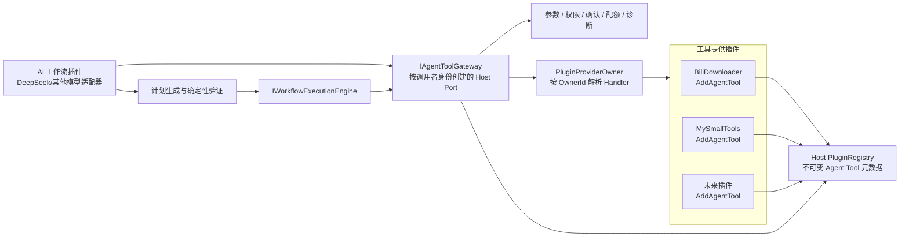

# AI 工作流插件与动态 Agent Tool 架构规划

> **文档状态：架构探索 / 实施前规划**
> 本文只定义目标架构、边界、风险与验证路径，不表示相关功能已经实现。正式编码需要另行建立实施门禁和验收记录。
>
> 初始探索：2026-08-07
> 结合 V2 架构重整：2026-08-22
> 适用基线：当前 `HostRuntime`、manifest v2、每插件独立 Provider、每插件独立 `PluginLoadContext`、不可变 `PluginRegistry`

相关文档：

- [`host-plugin-architecture-review.md`](./host-plugin-architecture-review.md)
- [`Host V2 architecture.md`](../../Host/MyAvaloniaManagement/docs/design/architecture.md)
- [`compatibility-contracts.md`](../../Host/MyAvaloniaManagement/docs/reference/compatibility-contracts.md)

---

## 1. 目标与结论

目标是让一个 AI 工作流插件（首个模型接入可使用 DeepSeek）能够：

1. 动态发现当前 Host 中已经安装且处于可用状态的插件工具；
2. 把用户自然语言转换成结构化、可验证的执行计划；
3. 经参数校验、权限检查和用户确认后调用工具；
4. 执行下载、加密、文件处理等跨插件工作流；
5. 支持取消、诊断、状态投影，并为后续持久化和恢复保留演进空间。

典型用例：

> 从指定网址下载全部视频，使用最高画质且只下载视频；下载完成后逐个加密，成功后删除原视频，密码由用户提供。

### 1.1 核心架构结论

本场景不应实现为“DeepSeek 插件依赖所有其他插件”，而应实现为：

> **其他插件向 Host 声明式注册经过筛选的 Agent Tool；AI 插件只依赖 Host 提供的工具目录与调用网关。**

因此本规划区分两种机制：

| 机制 | 解决的问题 | 是否形成本轮插件依赖图 |
| --- | --- | --- |
| **Agent Tool Contribution + Host Gateway** | AI 动态发现和调用未知插件提供的工具 | 否；工具提供者是运行期动态可选项 |
| **Typed Cross-Plugin Capability Exchange** | 普通插件必须调用另一个插件的强类型服务 | Required 依赖需要 Host 管理的 DAG；不属于本轮主线 |

本轮只规划第一种机制。不得为了 AI 调用而开放父容器回退、共享根 Provider、任意 `IServiceProvider` 或通用跨插件 Service Locator。

### 1.2 执行引擎结论

计划格式、验证器和 Agent Tool Gateway 必须与具体工作流引擎解耦。第一阶段优先使用轻量顺序执行器验证产品价值；Elsa Workflows 作为长运行、书签、暂停恢复和持久化需求出现后的候选适配器，而不是前置架构依赖。

---

## 2. 当前 V2 架构事实

以下事实是本规划的硬约束。

### 2.1 Provider 与所有权

- `PluginProviderOwner` 为每个插件创建新的私有 `ServiceCollection` 和独立 Provider；
- 插件 Provider 只预置明确承诺的 Host Port，不存在父 Provider 或 Host 服务回退；
- 普通 DI 注册只留在所属插件 Provider；
- `PluginRegistry` 不保存 Provider；
- `PluginContributionActivator` 只负责 Document/Tool 贡献激活，不应扩张为通用跨插件调用入口；
- Host 关闭时先撤回贡献、释放 View/Document Scope，再停止生命周期、释放插件 Provider，最后释放 Host Provider。

### 2.2 Registry 与组合

- `IPluginModule.Configure(IPluginRegistration)` 只在组合期同步执行一次；
- Document、Tool、View、Lifecycle 必须通过专用注册方法进入临时 Builder；
- Provider 构建成功后，声明才进入全局冲突校验；
- Registry 最终发布不可变快照；
- 单插件失败只隔离所属插件，无关插件继续组合。

Agent Tool 应复用这套模式，成为一种新的显式贡献，而不是被伪装成普通 DI 服务或 Document/Tool。

### 2.3 ALC 与类型身份

- 每个插件目录拥有独立、不可回收的 `PluginLoadContext`；
- 普通业务依赖只从当前插件 `.deps.json` / RID 图解析；
- 只有 Host 明确认可的 SDK、UI Profile 和框架闭包由默认 ALC 共享；
- 当前产品采用“更新后重启”，不支持运行期安装、热卸载或 ALC 回收。

因此，两个插件各自携带一份同名契约 DLL 并不能形成可靠的公共接口。Agent Tool 的通用框架契约必须由 Host 提供并通过共享程序集策略加载。

### 2.4 生命周期与可用性

- 当前生命周期按规范 PluginId 确定性启动，成功启动项反向停止；
- 生命周期失败或超时后，`PluginAvailabilityReadModel` 撤回该插件贡献；
- 当前没有插件依赖图；
- `IHostEventBus` 是 HostRuntime 内同步、精确类型、无返回值的通知总线，不是请求—响应 RPC。

Agent Tool Gateway 必须在每次调用前检查工具所有者是否可用；状态广播仍可使用事件总线，但工具请求—响应不得经事件总线实现。

---

## 3. 对历史方案的修正

历史文档建立在早期架构假设上，其中几项已经不适用于当前代码。

| 历史假设 | 当前事实 | 本规划修正 |
| --- | --- | --- |
| 所有插件向同一个根容器注册，AI 插件注入 `IEnumerable<IPluginCapability>` | 每个插件拥有独立 Provider，私有服务不能被另一个插件解析 | Host Registry 收集 Agent Tool 声明，Host Gateway 按所有者路由调用 |
| 工作流插件可直接从 DI 取得其他插件能力实例 | 跨插件私有解析是明确禁止并有测试保护的边界 | AI 插件只能取得 `IAgentToolGateway`，不能取得提供者 Provider 或私有 Service |
| 公共契约可依赖默认 ALC 的自然回退 | 当前共享策略是显式白名单/闭包，普通依赖仍在插件 ALC | Agent Tool SDK 必须成为 Host 明确共享的契约程序集 |
| 能力统一注册为根容器 singleton | 当前不存在跨插件共享根容器 | Handler 注册在所有者 Provider；Host 只保存 Handler 类型和所有权元数据 |
| Elsa 是已确定的第一阶段执行基础设施 | 当前尚无真实兼容性、部署、持久化和敏感信息验证 | 先定义引擎无关计划和轻量执行器，再通过 PoC 决定是否接入 Elsa |
| `ISavableDocument` 表示可保存 Document | 当前 V2 使用 `IPersistablePluginDocument` | 工作流定义/对话 Document 如需保存，遵守 V2 Document 信封与持久化契约 |

历史文档中关于“插件私有能力实现、AI 只规划、确定性校验、风险确认、事件总线只做通知”的方向仍然保留。

---

## 4. 目标架构



### 4.1 责任划分

| 组件 | 责任 | 明确不负责 |
| --- | --- | --- |
| 工具提供插件 | 选择可暴露的业务动作，提供描述、Schema 和薄 Handler | 不暴露整个私有服务图，不决定全局权限 |
| `PluginRegistryBuilder` | 收集声明、校验稳定 ID/类型/Schema/冲突 | 不创建 Handler，不执行插件代码 |
| `PluginRegistry` | 保存不可变 Agent Tool 元数据快照 | 不保存 Provider 或 Handler 实例 |
| `IAgentToolGateway` | 列举当前可用工具，提交受控调用 | 不把任意服务解析能力交给插件 |
| Host Tool Executor | 可用性、参数、权限、确认、超时、调用、结果清理、诊断 | 不负责 LLM 提示词和计划生成 |
| AI 工作流插件 | 模型接入、对话、计划生成/修复、执行编排和结果总结 | 不直接解析其他插件 Provider，不替代 Host 授权 |
| 工作流执行引擎 | 执行已批准计划，管理步骤状态和变量 | 不解释自然语言，不绕过 Gateway |

---

## 5. Agent Tool 公共契约草案

### 5.1 SDK 放置

第一版建议把最小 Agent Tool 契约放入现有 Core Plugin SDK。它们只依赖 BCL，符合 Core SDK 的依赖边界；`IPluginRegistration` 所在 UI SDK 已经依赖 Core，因此不需要新增第三套 SDK 版本事实或改变 manifest v2 的单一 SDK 区间。

如果以后 AI 契约明显增长，可以再拆出与 Core/UI 同版本的 `MyAvaloniaManagement.PluginSdk.AI`，由 Host 显式加入共享程序集根。拆包前必须同步扩展 SDK 兼容性检查和插件发布排除规则。不建议恢复旧的 `MyAvaloniaManagementCommon` 万能程序集。

### 5.2 稳定标识与描述符

```csharp
public sealed record AgentToolId;

public enum AgentToolRiskLevel
{
    ReadOnly,
    Mutating,
    Destructive,
    Sensitive,
}

public enum AgentToolConfirmationPolicy
{
    Never,
    OncePerWorkflow,
    EveryInvocation,
}

public sealed record AgentToolDescriptor(
    AgentToolId ToolId,
    string Name,
    string DisplayName,
    string Description,
    JsonElement InputSchema,
    JsonElement? OutputSchema,
    AgentToolRiskLevel RiskLevel,
    AgentToolConfirmationPolicy ConfirmationPolicy);
```

约束：

- `ToolId` 是 Registry 的规范稳定身份，建议使用插件命名空间，例如 `myavalonia.plugin.bilidownloader.agent.submit-download`；
- `Name` 是模型传输层名称，需要满足目标模型 API 的字符和长度限制，但不能代替稳定 ID；
- Schema 在注册时克隆并冻结，拒绝空对象、过深结构、重复/未知关键字策略另行确定；
- 描述必须说明副作用、前置条件、返回结构和失败语义；
- 不允许描述符在运行期执行插件回调或动态变化。

### 5.3 强类型 Handler，JSON 跨边界

```csharp
public interface IAgentToolHandler<TArguments, TResult>
    where TArguments : class
{
    Task<TResult> InvokeAsync(
        TArguments arguments,
        AgentToolContext context,
        CancellationToken cancellationToken);
}
```

`TArguments` 和 `TResult` 可以是工具提供插件的私有 DTO。DeepSeek 插件不引用这些类型；Host 根据 Registry 中冻结的类型完成：

```text
JsonElement arguments
→ Schema 校验
→ 反序列化成插件私有 TArguments
→ 在所有者 Provider 中调用 Handler
→ TResult 序列化成克隆后的 JsonElement
→ 返回 AI 插件或工作流引擎
```

这样既保留插件内部强类型体验，也避免把业务 DTO 变成跨 ALC 公共 ABI。

### 5.4 注册入口

```csharp
public interface IPluginRegistration
{
    void AddAgentTool<TArguments, TResult, THandler>(
        AgentToolDescriptor descriptor)
        where TArguments : class
        where THandler : class, IAgentToolHandler<TArguments, TResult>;
}
```

注册语义：

- Handler 由所属插件 Provider 作为 singleton 拥有；
- Handler 可以构造注入本插件私有服务；
- Handler 必须无会话可变状态并保证并发安全，不能直接依赖 scoped 服务；需要调用级资源时，由插件内部显式创建并在本次调用结束前释放；
- Tool 注册不会把 Handler 或私有服务放进 Host Provider；
- 同一插件重复 ToolId、跨插件 ToolId 冲突、Handler 契约不匹配均按“整插件候选失败/冲突所有者隔离”的现有 Registry 纪律处理；
- 第一版一个 ToolId 只允许一个提供者，不引入优先级、多实现或随机选择。

### 5.5 AI 插件使用的 Host Port

```csharp
public interface IAgentToolGateway
{
    IReadOnlyList<AgentToolDescriptor> GetAvailableTools(
        AgentToolQuery? query = null);

    Task<AgentToolInvocationResult> InvokeAsync(
        AgentToolInvocationRequest request,
        CancellationToken cancellationToken);
}
```

Host 为每个消费插件创建带调用者 `PluginId` 的 facade，而不是向所有插件注入同一个无身份实例。调用者身份用于诊断、配额和未来权限策略；这不是安全沙箱，插件代码仍处于同一进程信任边界。

---

## 6. 组合、提交与运行期路由

### 6.1 组合流程

建议扩展现有两阶段组合：

```text
1. manifest / 目录 / deps / 入口预检
2. 为每个插件创建私有 ServiceCollection
3. Configure 收集 Document / Tool / Lifecycle / Agent Tool 声明
4. 构建并验证插件 Provider
5. 全局 Registry 冲突校验
6. 校验 Agent Tool 描述符、Schema、Handler 类型和稳定 ID
7. 排除失败或冲突所有者，立即释放其 Provider
8. 发布不可变 PluginRegistry
9. 向 AgentToolCatalogStore 提交一次不可变路由快照
10. 执行插件生命周期，按可用性动态过滤工具
```

### 6.2 为什么需要 Catalog Store

插件 Provider 在 Registry 构建前创建，而 `IAgentToolGateway` 需要作为 Host Port 注入 AI 插件。Gateway 不能在构造时强制解析尚未建立的 Registry，否则会提前触发组合。

建议增加 Host internal `AgentToolCatalogStore`：

- Host Provider 建立时可安全构造，但初始状态是 `NotCommitted`；
- Registry Build 成功后只允许 `Commit(snapshot)` 一次；
- 提交前列举或调用返回受控的 `AGENT_TOOL_CATALOG_NOT_READY`；
- 提交后只读取不可变快照；
- 开始关闭后拒绝新调用。

### 6.3 调用路由

Registry 记录：

```csharp
internal sealed record AgentToolRegistration(
    PluginId OwnerId,
    AgentToolDescriptor Descriptor,
    Type HandlerType,
    Type ArgumentsType,
    Type ResultType);
```

Gateway 调用步骤：

1. 验证请求、调用 ID 和调用者身份；
2. 从冻结快照按 ToolId 精确查找；
3. 检查工具所有者当前是否 Ready；
4. 对照冻结 Schema 校验参数；
5. 应用 Host 权限、风险和确认策略；
6. 通过 `PluginProviderOwner.GetRequiredService(ownerId, handlerType)` 解析 Handler；
7. 在调用者线程/异步上下文执行，应用取消和 Host 超时；
8. 限制并克隆输出，清理异常并写入诊断；
9. 返回结构化结果。

不得通过 `PluginContributionActivator` 或 `IHostEventBus` 执行以上请求—响应调用。

---

## 7. AI 规划模式与直接工具模式

Agent Tool Gateway 同时支持两种上层使用方式，但首个产品版本应优先计划模式。

### 7.1 计划优先模式（本项目推荐）

```text
用户自然语言
→ AI 读取工具目录
→ AI 只调用 submit_plan
→ 确定性验证器
→ 风险摘要与用户确认
→ 工作流执行器逐步调用 IAgentToolGateway
→ 结构化结果回流 AI 总结
```

适用于：

- 多步骤；
- 有变量引用或循环；
- 长时间执行；
- 写文件、删除、加密等有副作用操作；
- 需要暂停、恢复、审计的任务。

### 7.2 直接工具模式（后续可选）

```text
用户问题
→ 向模型暴露筛选后的 ReadOnly 工具
→ 模型产生 tool_call
→ Host Gateway 调用
→ 结果回填模型
```

第一版不允许 Destructive/Sensitive 工具走无需计划的直接调用。即便模型 API 支持强制 Tool Call 或严格 Schema，模型输出仍然是不可信输入，Host 参数验证和授权不得省略。DeepSeek 官方当前 Tool Calls 文档也明确要求调用方验证模型产生的参数，具体模型名称、严格模式和限制应在实施时从官方文档重新确认：<https://api-docs.deepseek.com/guides/tool_calls/>。

### 7.3 工具数量增长

工具较少时可以把全部可用 Descriptor 渲染给模型。规模增长后按以下顺序演进：

1. Host 根据风险、分类、当前文档和用户意图过滤；
2. 限制每轮候选工具数量；
3. 增加 `search_tools` 元工具，先检索再暴露精确 Schema；
4. 缓存不可变 Registry 版本对应的模型工具清单。

AI 插件不能自己维护一份静态工具名单，否则会重新引入“新增插件必须修改 AI 插件”的耦合。

---

## 8. 工作流计划、验证与执行

### 8.1 引擎无关计划

计划是 Host/AI 工作流插件拥有的版本化数据模型，不使用 Elsa 类型作为持久化格式。

最小结构：

```json
{
  "schemaVersion": 1,
  "summary": "下载视频后逐个加密并删除成功加密的源文件",
  "catalogRevision": "runtime-snapshot-id",
  "steps": [
    {
      "id": "download",
      "toolId": "myavalonia.plugin.bilidownloader.agent.submit-download",
      "arguments": {
        "url": "https://example.invalid/video",
        "quality": "highest",
        "media": "video_only"
      }
    },
    {
      "id": "encrypt",
      "forEach": "${download.result.files}",
      "toolId": "myavalonia.plugin.mysmalltools.agent.encrypt-video",
      "arguments": {
        "path": "${item}",
        "password": "${secret.encryptionPassword}",
        "deleteSourceAfterSuccess": true
      }
    }
  ]
}
```

密码等敏感值不应直接持久化在计划正文中。上例的 `${secret.encryptionPassword}` 表示执行时从会话级短期 Secret Store 取得，工作流日志、Document 信封和 AI 对话记录只保存引用或脱敏投影。

### 8.2 确定性验证管线

AI 输出不能直接进入执行器，至少经过：

1. **结构验证**：JSON、schemaVersion、步骤数量、字符串/对象上限；
2. **目录版本验证**：计划使用的 catalog revision 是否仍与当前 Runtime 一致；
3. **工具存在与可用性验证**：ToolId 精确存在，所有者当前 Ready；
4. **参数验证**：对照工具 InputSchema，不允许未知字段、类型漂移或非法枚举；
5. **引用与计划图验证**：只能引用前序输出；拒绝未定义变量、自引用和计划环；
6. **风险与权限验证**：汇总 Mutating/Destructive/Sensitive 步骤，生成确定性确认清单；
7. **资源预算验证**：步骤、循环项、调用深度、超时、输出和并发上限；
8. **敏感信息验证**：阻止凭据进入日志、提示词回显和持久化字段。

校验失败可以把受控、非敏感的错误回填模型修复，但重试次数必须有上限；最终是否执行只由确定性验证器和用户授权决定。

### 8.3 轻量执行器接口

```csharp
internal interface IWorkflowExecutionEngine
{
    Task<WorkflowExecutionResult> ExecuteAsync(
        ValidatedWorkflowPlan plan,
        WorkflowExecutionContext context,
        CancellationToken cancellationToken);
}
```

第一版支持：

- `Sequence`；
- 有上限的 `ForEach`；
- 前序 JSON 输出引用；
- 失败即停；
- 用户取消；
- 步骤状态事件；
- Mutating 调用的 InvocationId / 幂等键。

第一版不支持任意表达式、脚本、无限循环、并行写操作、自动补偿或模型在执行过程中随意改写计划。

### 8.4 Elsa 适配条件

只有出现以下真实需求时再评估 Elsa：

- 跨进程重启恢复；
- 等待数小时/数天的外部事件；
- 人工审批书签；
- 工作流实例、活动记录和恢复点持久化；
- 复杂分支、定时器或成熟运维能力。

Elsa 3 官方文档描述了 Activity、Bookmark 和多种持久化存储能力，可作为 PoC 依据：

- <https://docs.elsaworkflows.io/getting-started/concepts>
- <https://docs.elsaworkflows.io/guides/persistence>
- <https://docs.elsaworkflows.io/extensibility/custom-activities>

接入时必须特别验证：

- .NET 10 与当前锁定包版本；
- 插件独立 ALC、`.deps.json` 和 win-x64 发布物；
- 数据库迁移与宿主退出顺序；
- Activity 输入/输出是否会把密码、路径或模型上下文写入持久化日志。Elsa 支持控制 Activity 输入/输出日志持久化，但默认和具体版本必须在实施时验证：<https://docs.elsaworkflows.io/optimize/log-persistence>。

Elsa 依赖应保留在 AI 工作流插件目录，不应为了方便而加入 Host 普通共享依赖闭包。

---

## 9. 依赖图与循环问题

### 9.1 DeepSeek 与工具提供者不形成强启动依赖

AI 插件只依赖 Host 保证存在的 `IAgentToolGateway`。某个工具插件缺失或初始化失败时：

- AI 插件仍可启动；
- 该插件工具从可用列表中消失；
- 已引用该工具的旧计划在执行前验证失败；
- 无关工具继续可用。

因此不需要建立：

```text
DeepSeek → BiliDownloader → MySmallTools → 所有未来插件
```

### 9.2 真正的强类型插件依赖另行设计

如果插件 A 自身的正确运行必须调用插件 B 的强类型服务，应使用未来的 Typed Capability Exchange：

- A 显式声明 Required/Optional Import；
- Host 建立全局依赖图；
- Required 图必须是 DAG；
- 强连通分量中的环整体隔离，并向强依赖下游传播不可用；
- 初始化按拓扑顺序，停止和 Provider 释放按反拓扑顺序。

这类依赖不能由 Agent Tool Gateway 暗中代替，也不能通过运行期字符串查找隐藏。

### 9.3 运行期递归与工作流环

即使没有启动依赖图，仍需防止：

```text
AI → Tool A → 再次调用 AI → Tool A → ...
```

第一版规则：

- Agent Tool Handler 不得重新发起模型推理；
- Handler 不得递归调用 Agent Tool Gateway；
- `AgentToolContext` 携带 CorrelationId、InvocationId 和调用深度；
- 最大工具嵌套深度为 1；
- 工作流变量引用只能前向，计划图必须无环；
- 同一 Mutating InvocationId 的重复请求必须返回已有结果或受控冲突，不能重复产生副作用。

---

## 10. 权限、安全与可靠性边界

### 10.1 信任模型

插件运行在同一进程，当前 ALC 和 Provider 隔离不是安全沙箱。Agent Tool 机制的目标是最小化可调用面、提供治理和审计，不是防御恶意本地插件突破进程权限。

模型输出、工具描述、工具参数和外部内容都应视为不可信数据。

### 10.2 Host 必须拥有的政策

| 政策 | 最低要求 |
| --- | --- |
| 参数 | Schema 后再次做业务校验；路径规范化；拒绝越界路径和未知字段 |
| 风险 | ReadOnly / Mutating / Destructive / Sensitive 分级 |
| 确认 | Destructive/Sensitive 每次调用确认；模型不能代替用户授权 |
| 超时 | Host 为每个工具设置上限；超时触发协作取消，但不宣称能强杀进程内代码 |
| 输出 | 限制 JSON 深度、字节数和集合数量；`JsonElement` 必须克隆后跨边界 |
| 并发 | 每工具/插件/工作流限流；Mutating 工具默认串行 |
| 幂等 | 写操作携带 InvocationId；工具声明是否支持重试 |
| 诊断 | Host 记录 OwnerId、ToolId、阶段、耗时和稳定错误码；不持久化插件异常正文和秘密 |
| 关闭 | `HostRuntime.BeginShutdown` 后拒绝新工具调用；等待或取消在途调用，再停止插件生命周期 |

### 10.3 删除与加密用例的事务语义

“加密后删除源文件”不应拆成不受约束的两个模型决定。优先提供一个业务原子工具：

```text
encrypt_video(deleteSourceAfterSuccess = true)
```

由工具实现保证：

1. 输出写入临时文件；
2. 完整性校验成功；
3. 原子提交加密文件；
4. 只有提交成功后才删除源文件；
5. 删除失败返回可恢复的部分成功结果，不谎报全成功。

AI 只选择显式业务选项，不自行拼接“加密工具 + 任意文件删除工具”制造脆弱事务。

### 10.4 密码与凭据

- API Key 使用插件私有安全存储，不进入 Document、Registry、提示词日志或诊断；
- 工作流密码使用短期 Secret Store，计划只保存 secret reference；
- UI 展示和模型结果总结必须脱敏；
- Tool Handler 只在调用期间取得所需秘密，不把秘密写入结果；
- 任何工作流持久化引擎接入前，必须通过“无秘密落盘”专项测试。

---

## 11. UI、Document、Tool 与事件映射

| 当前扩展概念 | AI 工作流插件中的角色 |
| --- | --- |
| `IPluginModule` | 注册 AI 客户端、计划器、执行器、Agent Tool 消费端和 UI 贡献 |
| `IPluginLifecycle` | 启动/停止工作流后台队列、恢复服务和模型客户端资源；不依赖视觉树 |
| `IPersistablePluginDocument` | 可选：保存脱敏后的工作流定义、对话或运行查看状态，遵守 Document 信封 v2 |
| Tool singleton | 工作流队列、运行状态、失败诊断和人工确认入口 |
| `IHostEventBus` | 工作流进度、步骤完成、终态通知；不承担工具请求—响应 |

建议将“工作流运行真相”保留在工作流插件自己的状态存储/执行引擎中，Tool 只消费投影。Document 和 Tool 不直接持有其他插件 Handler。

事件类型若只由 AI 工作流插件内部 Document/Tool 使用，可以留在同一插件程序集；若需要跨插件订阅，事件契约必须进入 Host 共享 SDK，并接受公共 API 兼容约束。

---

## 12. 对当前代码的预期影响

本表只描述未来实施落点，不表示已经修改。

| 现有区域 | 预期变化 |
| --- | --- |
| `MyAvaloniaManagement.PluginSdk` | 第一版增加最小 Agent Tool 通用契约、稳定 ID、描述符、调用结果和 Gateway Port；规模增长后再评审拆包 |
| `PluginRegistrationContracts.cs` | 增加 `AddAgentTool<TArguments,TResult,THandler>` |
| `PluginRegistrationContext.cs` | 注册 Handler 到当前插件私有集合，并把声明写入临时 Builder |
| `PluginRegistryBuilder.cs` | 本地/全局 ToolId、Handler、Schema、共享类型与冲突校验 |
| `PluginRegistry.cs` | 冻结 Agent Tool 注册元数据和目录 revision |
| `PluginProviderOwner.cs` | 为消费插件注入带 CallerId 的 Gateway facade；按 OwnerId 解析 Agent Tool Handler |
| `PluginLifecycleStateStore.cs` | Gateway 复用现有 Owner 可用性门控 |
| `HostRuntime.cs` | Registry 提交目录快照；关闭时先撤回调用入口并处理在途调用 |
| `PluginSharedAssemblyPolicy.cs` | 第一版沿用 Core SDK 共享闭包；若以后拆出 AI SDK，再将其作为明确共享根。普通 AI/Elsa/业务依赖始终保持私有 |
| Diagnostics / Plugin Status Tool | 增加工具注册、不可用、参数、确认、超时、执行失败等稳定错误码和投影 |
| PluginTests | 保持私有服务不可跨插件解析，新增 Agent Tool 路由与失败隔离测试 |

不应发生的变化：

- 不把所有插件 ServiceCollection 合并；
- 不让 Registry 保存 Provider/Handler；
- 不允许 AI 插件取得任意 Provider；
- 不增加进程级 AssemblyResolve；
- 不把 Elsa、DeepSeek SDK 或插件业务依赖加入 Host 共享闭包；
- 不改变事件总线为请求—响应总线。

---

## 13. 分阶段实施建议

### 阶段 A：契约与假工具门禁

- 冻结 Agent Tool ID、Descriptor、Handler 和 Gateway 最小 API；
- 使用两个测试插件注册假 ReadOnly/Mutating 工具；
- 完成 Registry 冲突、可用性、JSON Schema、结果上限和 Provider 所有权测试；
- 不接模型、不接 Elsa、不改真实业务插件。

退出条件：AI 插件无需引用提供者程序集即可列举并调用假工具，私有服务隔离测试保持通过。

### 阶段 B：真实业务适配器

- 为 BiliDownloader 选择一个无 UI 依赖的查询能力和一个受控下载提交能力；
- 为 MySmallTools 选择一个加密能力；
- Handler 只包装已有应用服务，不从 ViewModel 抽取临时状态；
- 建立加密成功后删除源文件的事务与恢复语义。

退出条件：不接 AI 时，可通过 Gateway 完成确定性端到端用例。

### 阶段 C：DeepSeek 规划 PoC

- 模型适配器与 Agent Tool 目录解耦；
- 工具清单运行时渲染，不在提示词硬编码；
- 强制结构化 `submit_plan`；
- 建立固定中文语料集、缺参追问、幻觉工具、非法枚举和恶意参数测试；
- 实施时重新核对 DeepSeek 官方模型、Tool Calls、Schema 限制、配额和数据政策。

退出条件：模型只生成候选计划；任何模型输出都不能绕过验证器调用真实工具。

### 阶段 D：轻量工作流执行器

- Sequence、ForEach、变量引用、取消、失败停止、步骤事件；
- 风险确认、Secret Store、InvocationId 和输出上限；
- Tool 状态面板与结果总结。

退出条件：典型“下载 → 加密 → 成功后删除源文件”用例两轮完整通过，故障注入不造成误删或重复提交。

### 阶段 E：持久化引擎决策

- 评估是否已有长运行、书签、审批、重启恢复的真实需求；
- 若有，执行 Elsa 独立 ALC、发布物、数据库、迁移、日志脱敏和退出恢复 PoC；
- 若无，继续保持轻量执行器，避免提前承担框架复杂度。

### 阶段 F：产品化

- 可保存工作流定义；
- 运行历史、恢复和审计；
- 工具搜索/筛选；
- 权限管理 UI；
- 其他模型提供者适配；
- 对外 SDK 文档和兼容基线。

---

## 14. 验收矩阵

### 14.1 架构与隔离

- 插件私有服务仍不能由 Host 或另一个插件直接解析；
- AI 插件不引用 BiliDownloader/MySmallTools 程序集；
- Registry 不保存 Provider 或 Handler 实例；
- Agent Tool 契约随 Core SDK 只从默认 ALC 共享，插件私带不兼容副本时受控隔离；
- 未声明的普通 DI 服务不会自动成为 AI Tool；
- 新增工具插件不需要修改或重新编译 AI 插件。

### 14.2 Registry 与运行期

- 单插件重复 ToolId、跨插件冲突、非法 Schema、错误 Handler 类型均有稳定诊断；
- 工具所有者未 Ready、失败、超时或开始停止时不可调用；
- 一个工具插件失败不影响 AI 插件和无关工具；
- Gateway 调用可归因到 CallerId、OwnerId、ToolId 和 InvocationId；
- Host 关闭后拒绝新调用，Provider 不会在 Handler 执行中被提前释放。

### 14.3 AI 与计划安全

- 幻觉 ToolId、未知参数、非法枚举、后向/循环引用全部在执行前拒绝；
- 缺少网址、密码等必需信息时只追问，不猜测；
- Destructive/Sensitive 操作未经用户确认不能执行；
- 模型参数即使符合 Tool Calls 格式仍需 Host Schema 和业务校验；
- 修复循环有次数上限，不把插件异常正文回填模型。

### 14.4 数据与故障

- 密码、API Key、Cookie 不进入日志、计划正文、Document 信封和工作流持久化；
- 下载失败不会进入加密步骤；
- 加密校验失败不会删除源文件；
- 删除失败返回部分成功而不是全成功；
- 重复 InvocationId 不重复执行 Mutating 操作；
- 超时、取消和应用退出均有可诊断的终态。

---

## 15. 实施前仍需决定的问题

1. Agent Tool 契约何时需要从 Core SDK 拆出独立 `PluginSdk.AI`；本文建议第一版不拆，出现明确的独立版本或包体边界需求后再评审。
2. 第一版 JSON Schema 是插件显式提供，还是由 `TArguments` 生成后允许补充；推荐显式/生成混合，但先用少量真实工具验证。
3. Host 的确认 UI 由现有窗口交互端口扩展，还是增加专门的 Agent Authorization Port；推荐专门端口，避免通用窗口接口承担安全语义。
4. 第一版工作流是否只支持严格线性 + ForEach；本文建议是。
5. Mutating 工具的幂等结果保存位置和保留周期。
6. Workflow Secret Store 是否只支持当前进程，还是需要凭据保护后的恢复；第一版建议只支持当前会话并禁止秘密随工作流恢复。
7. DeepSeek 只是首个模型适配器，还是产品契约直接绑定 DeepSeek；本文建议模型无关，DeepSeek 仅是实现。
8. 哪些 BiliDownloader / MySmallTools 服务已满足“无视觉树依赖、可取消、结果结构化、失败不泄漏敏感信息”的工具封装条件。

---

## 16. 非目标

本规划不包含：

- 恶意插件进程隔离或权限沙箱；
- 插件热安装、热卸载或 ALC 回收；
- 让模型反射调用任意 public 方法；
- 自动把所有 DI 服务暴露为工具；
- 通用跨插件 Service Locator；
- Required 插件依赖图的完整实现；
- 第一阶段的任意脚本、无限循环或自动补偿；
- 将 Elsa Studio/Web Designer 直接视为 Avalonia 内嵌设计器。

---

## 17. 最终建议

当前架构下最稳妥的实施路线是：

> **插件通过 `AddAgentTool` 声明经过安全包装的工具；Host 用不可变 Registry、所有者 Provider 路由、可用性门控和统一授权执行工具；AI 插件只依赖 `IAgentToolGateway`，动态读取工具目录并生成经过确定性验证的计划。**

这条路线保留了 V2 最重要的结构性成果：每插件私有 Provider、独立 ALC、显式贡献、不可变 Registry、Host 单一编排权、失败隔离和确定性释放；同时解决了“新增一个插件能力就必须修改 DeepSeek 插件”的扩展性问题。

一句话职责划分：

> **Registry 负责声明，Gateway 负责治理与调用，AI 负责规划，执行器负责状态推进，事件总线只负责通知。**
