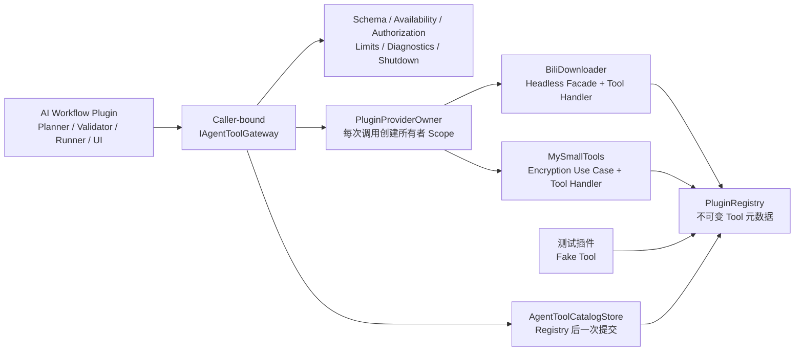

# 基于 Host V3 的 AI 工作流与 Agent Tool 实施方案

> **文档状态：重新评估后的实施方案，尚未编码**
>
> 初始探索：2026-08-07
>
> 本次复核：2026-08-23
>
> 代码基线：产品/Plugin SDK `3.0.0`、.NET 10、Avalonia 12.1、manifest schema v2、每插件独立 Provider 与 `PluginLoadContext`
>
> 本文描述的是建议实施顺序和验收门禁，不表示 Agent Tool、AI 插件或工作流执行器已经存在。

相关事实源：

- [`host-plugin-architecture-review.md`](./host-plugin-architecture-review.md)
- [`Host V3 architecture.md`](../../Host/MyAvaloniaManagement/docs/design/architecture.md)
- [`compatibility-contracts.md`](../../Host/MyAvaloniaManagement/docs/reference/compatibility-contracts.md)
- [`plugin-sdk-api-compatibility.md`](../reference/plugin-sdk-api-compatibility.md)

---

## 1. 执行结论

这个方向可行，但不应直接从“接 DeepSeek + 上工作流引擎 + 打通下载和加密”开始。基于当前代码，建议按以下顺序实施：

1. 在 Host 中建立最小的 **Agent Tool 内核**：声明、不可变目录、调用者身份、所有者路由、可用性、参数校验、授权、调用级 Scope 和关闭门控；
2. 先用测试插件证明跨 ALC、跨私有 Provider 的受控调用成立；
3. 为 BiliDownloader 和 MySmallTools 补充真正无 UI 依赖的应用服务，再注册真实 Tool；
4. 先用确定性计划完成“下载 → 加密并保留源文件”的端到端闭环；
5. 再接入 DeepSeek，模型只生成候选计划，不能直接越过验证器执行；
6. “加密成功后删除源文件”必须等 MySmallTools 新增原子业务用例和故障门禁后开放；
7. 在确有跨进程恢复、长时间书签或人工审批恢复需求前，不引入 Elsa。

核心边界保持不变：

> **提供者插件声明经过筛选的业务 Tool；Host 负责目录、治理和路由；AI 工作流插件只依赖 Host Gateway，不引用任何业务插件程序集。**

### 1.1 首版产品范围

首版可交付闭环为：

```text
用户输入 B 站链接、输出目录和会话密码
→ AI 生成候选计划
→ 确定性验证与风险摘要
→ BiliDownloader 解析、预检、提交并等待任务终态
→ MySmallTools 对成功下载的文件逐个加密
→ 保留原视频并汇总成功/失败结果
```

首版明确不承诺：

- 自动删除原视频；
- 应用重启后恢复工作流；
- 任意分支、脚本、并行写操作和自动补偿；
- 运行期安装、卸载或刷新插件；
- 恶意插件的进程级安全隔离。

---

## 2. 当前项目事实与差距

### 2.1 已经具备的基础

| 现有事实 | 代码落点 | 对本方案的意义 |
| --- | --- | --- |
| 每插件独立 `ServiceCollection`、Provider | `PluginProviderOwner` | Tool Handler 必须在所有者 Provider 内解析，不能把业务服务搬到 Host |
| 每插件独立 `PluginLoadContext` | `PluginLoadContext`、`PluginSharedAssemblyPolicy` | 跨边界只能使用共享 SDK 类型或 JSON，不能传业务插件 DTO |
| 显式贡献、两阶段提交、冲突所有者隔离 | `PluginRegistration`、`PluginRegistryBuilder` | Agent Tool 应作为新的显式贡献复用同一提交纪律 |
| 不可变 Registry | `PluginRegistry` | 工具目录可在启动时冻结，不需要运行期可变注册表 |
| 生命周期状态与可用性投影 | `PluginLifecycleStateStore`、`PluginAvailabilityReadModel` | 每次调用前可检查工具所有者是否仍可用 |
| Provider 反向释放和 Runtime 关闭顺序 | `HostRuntime.Dispose` | Gateway 可在关闭开始时拒绝新调用，再等待/取消在途调用 |
| 严格诊断白名单 | `HostDiagnostics` | Tool 诊断只能记录稳定 ID、阶段、耗时和错误码，不能记录参数正文或路径 |
| BiliDownloader 有无 UI 的提交边界 | `IDownloadSubmissionService` | 已有预检与提交基础，但输入仍是完整 `DownloadSubmission` |
| MySmallTools 有流式加密与原子输出提交 | `IVideoEncryptionService`、`OutputFileTransaction` | 可复用加密能力，但当前没有删除源文件事务 |

### 2.2 当前不存在的能力

仓库中目前没有：

- Agent Tool 公共契约、Registry 条目或 Gateway；
- AI/LLM 客户端插件；
- 通用工作流计划、执行器或恢复存储；
- Host 级 Secret Store；
- Host 级事件总线；V3 已删除公共事件总线，现有消息器均为插件私有；
- JSON Schema 验证依赖或统一 Schema Profile；
- BiliDownloader 的“URL → 全部条目 → 下载提交 → 等待输出文件”无 UI Facade；
- MySmallTools 的“加密、验证成功、删除源文件”原子应用服务。

### 2.3 版本名称必须区分

当前产品和 Plugin SDK 是 **V3 / 3.0.0**，但以下磁盘协议仍是 schema v2：

- `plugin.manifest.json`；
- Document envelope；
- Dock layout；
- Host 数据根代际。

因此后续文字应写“Host V3 + manifest schema v2”，不能再笼统称为“当前 V2 架构”。

---

## 3. 对原探索方案的重新评估

| 原设想 | 评估 | 调整后的决定 |
| --- | --- | --- |
| AI 插件依赖所有业务插件 | 不符合私有 Provider 和独立 ALC | 保留 Host Gateway 方向，AI 插件不引用业务程序集 |
| 给 `IPluginRegistration` 直接增加 `AddAgentTool` | 会改动已经冻结的 V3 public interface，兼容风险过大 | 使用新增扩展接口 + 扩展方法，保持现有接口签名不变 |
| Agent Tool Handler 为 singleton | 与 MySmallTools 当前 scoped 加密服务不匹配，也缺少调用级释放边界 | Handler 采用 invocation scope；Host 每次调用创建并释放所有者 Scope |
| Host/Event Bus 广播工作流状态 | 当前不存在 Host 公共事件总线 | 工作流状态留在 AI 插件内部；UI 订阅插件私有状态源 |
| 直接包装 BiliDownloader 提交服务 | 输入需要完整业务 DTO，不能从 URL 直接调用 | 先在 BiliDownloader 内新增 headless Facade，Tool 只包装该 Facade |
| 直接给加密 Tool 增加 `deleteSourceAfterSuccess` | 当前业务服务没有该语义，临时拼接 `File.Delete` 不安全 | 第二阶段新增独立事务用例，通过故障门禁后再暴露删除选项 |
| 第一阶段引入 Elsa | 当前没有持久化恢复的已验证需求 | 先实现轻量顺序执行器，Elsa 只保留为后续 PoC 候选 |
| 风险用单一等级表达 | “联网、写入、删除、处理秘密”不是同一条有序轴 | 改为风险标志 + 确认策略，Host 根据组合政策授权 |
| 计划和执行能力放入 Host SDK | 会让公共 SDK 过早绑定产品模型 | SDK 只放 Tool 边界；计划、提示词和执行器属于 AI 工作流插件私有实现 |

原方案中以下判断继续成立：

- 不能开放父容器回退、共享根 Provider、任意 `IServiceProvider` 或跨插件 Service Locator；
- Registry 只保存冻结元数据和类型，不保存 Provider、Scope 或 Handler 实例；
- 模型输出永远是不可信输入；
- 事件通知不能代替有返回值、有超时、有授权的请求—响应调用；
- 新增普通插件能力不应要求修改 AI 插件。

---

## 4. 目标结构



### 4.1 职责边界

| 组件 | 负责 | 不负责 |
| --- | --- | --- |
| 业务插件 | 提供窄应用服务、Schema、Handler 和业务错误映射 | 不暴露整个私有对象图，不执行全局授权 |
| `PluginRegistryBuilder` | 收集、校验、判重并冻结 Tool 声明 | 不解析 Handler，不运行插件代码 |
| `PluginRegistry` | 保存 Owner、Descriptor、类型和目录 revision | 不保存 Provider、Scope 或实例 |
| `AgentToolCatalogStore` | 解决 Provider 先构建、Registry 后发布的时序 | 不允许二次提交或运行期追加 Tool |
| `IAgentToolGateway` | 列举可用工具并提交受控调用 | 不提供服务定位，不解释自然语言 |
| Host Tool Executor | 可用性、Schema、授权、Scope、超时、输出限制和诊断 | 不保存提示词，不生成计划 |
| AI 工作流插件 | 模型接入、候选计划、验证、执行状态和 UI | 不直接解析其他插件 Provider |
| 轻量执行器 | 顺序、有限 `ForEach`、引用、取消和失败停止 | 不运行任意表达式或脚本 |

---

## 5. Plugin SDK 演进方案

### 5.1 版本决定

建议把 Agent Tool 作为 **Plugin SDK 3.1.0 的兼容新增**，不直接修改已经进入 v3 Shipped 的 `IPluginRegistration`。

新增 API 采用以下形态：

```csharp
// Core SDK：只依赖 BCL / System.Text.Json
public interface IAgentToolHandler<TArguments, TResult>
    where TArguments : class
{
    ValueTask<TResult> InvokeAsync(
        TArguments arguments,
        AgentToolContext context,
        CancellationToken cancellationToken);
}

public interface IAgentToolGateway
{
    IReadOnlyList<AgentToolDescriptor> GetAvailableTools();

    Task<AgentToolInvocationResult> InvokeAsync(
        AgentToolInvocationRequest request,
        CancellationToken cancellationToken);
}

// UI SDK：Host 实现的新扩展面，不改变 IPluginRegistration 的成员集合
public interface IAgentToolRegistration
{
    void AddAgentTool<TArguments, TResult, THandler>(AgentToolDescriptor descriptor)
        where TArguments : class
        where THandler : class, IAgentToolHandler<TArguments, TResult>;

    void UseAgentToolGateway();
}

public static class AgentToolRegistrationExtensions
{
    public static void AddAgentTool<TArguments, TResult, THandler>(
        this IPluginRegistration registration,
        AgentToolDescriptor descriptor) { /* 转发到扩展面 */ }

    public static void UseAgentToolGateway(
        this IPluginRegistration registration) { /* 转发到扩展面 */ }
}
```

关键兼容规则：

- 现有 `IPluginRegistration`、Document、Tool、Lifecycle public 签名保持不变；
- `PluginRegistration` 由 Host internal 同时实现两个接口；
- 使用 Agent Tool API 的插件 manifest 必须把 `sdk.minInclusive` 提升到 `3.1.0`；
- 未使用新能力的 3.0 插件仍可由 3.1 Host 加载；
- 新 public API 先进入 v3 `PublicAPI.Unshipped.txt`，通过 API/包消费者门禁后才能发布；
- 若实现过程中无法保持现有签名与旧插件二进制兼容，立即停止 3.1 路线并建立 SDK V4，而不是改写 v3 Shipped。

### 5.2 最小公共类型

Core SDK 第一版只增加：

- `AgentToolId`；
- `AgentToolDescriptor`；
- `[Flags] AgentToolRiskFlags`；
- `AgentToolConfirmationPolicy`；
- `AgentToolContext` 与进度 DTO；
- `IAgentToolHandler<TArguments,TResult>`；
- `IAgentToolGateway`；
- 调用请求和结构化结果 DTO。

不把以下类型放入公共 SDK：

- Workflow Plan、步骤、变量表达式；
- DeepSeek 请求/响应 DTO；
- Elsa Activity；
- BiliDownloader/MySmallTools 参数类型；
- Host internal Registry、授权器和执行器。

### 5.3 ID、Schema 与描述符

Tool ID 延续当前稳定 ID 纪律：

```text
myavalonia.plugin.bili-downloader.agent.prepare-download
myavalonia.plugin.bili-downloader.agent.commit-download
myavalonia.plugin.bili-downloader.agent.await-download
myavalonia.plugin.my-small-tools.agent.encrypt-video
```

Host 校验 Tool ID 必须属于声明者的 `myavalonia.plugin.<name>.agent.` 命名空间。

第一版不声称支持完整 JSON Schema。定义并冻结一个窄 Profile：

- 根必须是 `object`；
- 支持 `properties`、`required`、`additionalProperties: false`；
- 支持基本 `type`、`enum`、字符串/数值边界；
- 支持有 `maxItems` 的数组；
- 限制 Schema 和实例深度、属性数、字符串长度与总字节数；
- 注册时拒绝未知关键字和远程引用；
- 敏感字段由 Descriptor 的规范 JSON Pointer 列表标记，不依赖自由文本描述猜测。

Schema 由插件显式提供。首版不做任意 DTO 反射生成，避免序列化命名、可空性和 ALC 类型细节变成隐式契约。

### 5.4 Handler 生命周期

Handler 默认注册为 scoped。每次调用时 Host：

1. 在工具所有者 Provider 上创建独立 `IServiceScope`；
2. 在该 Scope 内解析 Handler 及其私有依赖；
3. 反序列化为提供者私有 `TArguments`；
4. 调用 Handler；
5. 把私有 `TResult` 序列化为受限、克隆后的 `JsonElement`；
6. 最终释放调用 Scope。

这与 MySmallTools 当前 scoped 加密服务兼容，也为临时文件、流和其他调用级资源提供确定释放边界。不得把调用 Scope 登记为 Document Scope，也不得把其 `IServiceProvider` 交给消费插件。

---

## 6. Host 侧实现方案

### 6.1 组合与提交

在现有流程上增加 Tool 声明：

```text
manifest / deps / entry point 预检
→ 为插件建立私有 ServiceCollection
→ Configure 收集 Document / Tool / Lifecycle / Agent Tool / Consumer 声明
→ Seal、所有权校验、追加 Host Port 和贡献根
→ 构建插件 Provider 并验证 Handler 可解析
→ 全局冲突校验，隔离冲突所有者
→ 发布不可变 PluginRegistry
→ Commit AgentToolCatalogStore（仅一次）
→ 启动插件生命周期
→ 创建 Workspace/UI
```

`catalogRevision` 应由冻结后的规范 Descriptor 集合计算确定性哈希，而不是随机运行时 ID。计划执行前必须核对 revision；插件更新需要重启，新的 Runtime 会得到新的 revision。

### 6.2 Consumer 显式声明

不是所有插件都自动得到 Gateway。只有调用 `UseAgentToolGateway()` 的插件才由 `PluginServiceCommitGuard` 注入绑定自身 `PluginId` 的 facade。

第一版规则：

- Tool 提供插件不能同时声明 Consumer；
- Handler Context 不含 Gateway；
- Gateway facade 不暴露 CallerId 修改入口；
- Host 诊断从 facade 获取可信 CallerId，而不是相信请求 JSON。

这样可以从结构上阻止第一版的 `Tool A → Gateway → Tool A` 递归。

### 6.3 调用顺序

Gateway 每次调用执行：

1. 检查 Runtime 是否仍接受新调用；
2. 校验 InvocationId、CallerId 和 ToolId；
3. 从已提交目录精确查找注册项；
4. 通过 `PluginAvailabilityReadModel` 检查 Owner 是否可用；
5. 按冻结 Schema 验证参数并应用尺寸限制；
6. 根据风险标志和确认策略请求 Host authorizer；
7. 建立 Owner invocation scope 并解析 Handler；
8. 应用取消、超时和每插件/每工作流并发限制；
9. 限制、克隆输出，清理异常并写入脱敏诊断；
10. 释放 Scope，返回结构化终态。

超时只能触发协作取消，不能宣称能强杀同进程插件代码。超过关闭宽限期的 Handler 属于插件缺陷，应有稳定诊断，但 Host 仍不能在未返回时安全释放其 Provider。

### 6.4 授权模型

风险使用可组合标志，例如：

- `UsesNetwork`；
- `ReadsLocalFiles`；
- `WritesLocalFiles`；
- `DeletesLocalFiles`；
- `HandlesSecret`；
- `LongRunning`。

确认策略使用：

- `Never`：只允许无副作用且不读取敏感数据的工具；
- `OncePerPlan`：对确定的工具、目标和参数摘要授权一次；
- `EveryInvocation`：删除等不可恢复操作逐次授权。

Authorizer 为 Host internal 服务，生产实现使用 Avalonia UI，测试使用可控替身。模型文本、插件返回值和 Handler 均不能伪造授权结果。

### 6.5 关闭与在途调用

`HostRuntime.Dispose` 的建议顺序调整为：

```text
Agent Tool Gateway BeginShutdown
→ 拒绝新调用并取消在途调用
→ 释放 Workspace / View / Document Scope
→ 在宽限期内等待 Tool 调用完成
→ 反向停止插件 Lifecycle
→ 反向释放插件 Provider
→ 释放 Host Provider
```

必须增加竞态测试，证明 Handler 尚在执行时 Owner Provider 不会被提前释放。

---

## 7. AI 工作流插件方案

AI 插件是普通 Managed Plugin，使用自身私有 Provider 和 ALC。它通过 `UseAgentToolGateway()` 获取唯一跨插件端口，并贡献自己的 Document/Tool UI。

### 7.1 插件内部模块

```text
Model Client Adapter
        ↓
Tool Catalog Renderer
        ↓
Candidate Plan Parser
        ↓
Deterministic Plan Validator
        ↓
Risk Summary / User Confirmation
        ↓
Lightweight Workflow Runner
        ↓
IAgentToolGateway
```

模型 Provider 是私有适配器。DeepSeek 可以是第一个实现，但计划格式、验证器、执行器和 UI 不使用 DeepSeek 类型。

### 7.2 计划优先，不直接执行

第一版只采用计划模式：

```text
自然语言
→ 模型读取筛选后的 Tool Descriptor
→ 模型提交候选计划
→ 本地确定性验证
→ 用户确认
→ 执行器逐步调用 Gateway
```

模型的 Tool Calls/JSON 严格模式只能改善输出格式，不能代替：

- ToolId 存在性检查；
- Schema 与业务预检；
- 前向引用检查；
- 风险确认；
- 路径、数量、超时和输出预算；
- Secret 脱敏。

第一版不向模型开放真实 Mutating Tool 的直接调用，只给模型一个“提交候选计划”的逻辑入口。

### 7.3 最小计划模型

计划属于 AI 插件私有、版本化数据，不属于 Plugin SDK：

```json
{
  "schemaVersion": 1,
  "catalogRevision": "sha256:...",
  "summary": "下载后逐个加密并保留源文件",
  "steps": [
    {
      "id": "prepare",
      "toolId": "myavalonia.plugin.bili-downloader.agent.prepare-download",
      "arguments": {
        "url": "https://www.bilibili.com/video/...",
        "selection": "all",
        "quality": "highest",
        "mediaMode": "video-only",
        "outputDirectory": "D:\\Videos"
      }
    },
    {
      "id": "commit",
      "toolId": "myavalonia.plugin.bili-downloader.agent.commit-download",
      "arguments": { "preparationId": "${prepare.result.preparationId}" }
    },
    {
      "id": "await",
      "toolId": "myavalonia.plugin.bili-downloader.agent.await-download",
      "arguments": { "batchId": "${commit.result.batchId}" }
    },
    {
      "id": "encrypt",
      "forEach": "${await.result.succeededFiles}",
      "toolId": "myavalonia.plugin.my-small-tools.agent.encrypt-video",
      "arguments": {
        "inputPath": "${item.path}",
        "outputPath": "${item.path}.secvid",
        "password": "${secret.videoPassword}"
      }
    }
  ]
}
```

密码值由 UI 的密码输入框直接写入会话内存 Secret Store。模型、计划正文、Document 信封和诊断只看到 secret reference。

### 7.4 轻量执行器能力

第一版只实现：

- `Sequence`；
- 有最大项数的顺序 `ForEach`；
- 只引用前序步骤输出；
- 步骤失败即停止；
- 用户取消；
- 只在内存保存的步骤状态；
- InvocationId 和有限重试；
- 受控进度投影。

第一版不实现：

- 任意表达式、脚本和循环；
- 并行写操作；
- 模型执行中自由改写计划；
- 自动补偿；
- 应用重启恢复。

### 7.5 Secret 与 API Key

- DeepSeek API Key 由 AI 插件私有安全存储负责，不进入 Host Registry；
- 首版工作流密码只存在当前运行会话，不持久化；
- Secret 值不进入模型提示词；
- Gateway 根据 Descriptor 的敏感 JSON Pointer 在诊断、错误和 UI 投影前统一遮蔽；
- 恢复型工作流出现前，不设计“可恢复 Secret”。

---

## 8. 两个真实插件的接入评估

### 8.1 BiliDownloader：基础较好，但缺少 headless 用例

可直接复用：

- `DirectLinkProvider` 的链接规范化与短链展开；
- 内容源解析与媒体探测服务；
- `IDownloadSubmissionService.PreflightAsync`；
- `IDownloadSubmissionService.CommitAsync`；
- `BiliDownloadCoordinator`、任务仓储和已有取消/恢复语义；
- `SubmissionPreflightReport.Fingerprint` 的 TOCTOU 防护。

不能直接复用为 Tool 的部分：

- `BiliDownloaderViewModel`、`DownloadSourceWorkflowViewModel` 和 UI 状态；
- 需要用户控件状态才能拼出的 `DownloadSubmission`；
- 插件私有事件总线的 fire-and-forget 提交路径。

需要先新增一个插件内部应用服务，例如 `IAgentDownloadWorkflowFacade`：

1. `PrepareFromUrlAsync`：解析 URL、选择全部内容、解析“最高画质/仅视频”、构造 `DownloadSubmission` 并预检；
2. 把 `PreparedSubmission` 存入有容量和 TTL 的插件私有缓存，返回不透明 `preparationId` 和脱敏摘要；
3. `CommitAsync`：在确认后使用 preparationId 提交，保留现有 fingerprint 复检；
4. `AwaitBatchAsync`：按提交返回的任务 ID 等待终态，返回成功输出路径和失败码；
5. 关闭时取消等待，不修改 Coordinator 的生命周期所有权。

首批 Tool 建议：

| Tool | 风险 | 返回 |
| --- | --- | --- |
| `prepare-download` | `UsesNetwork` | preparationId、条目数、预估空间、警告摘要 |
| `commit-download` | `UsesNetwork + WritesLocalFiles + LongRunning` | batchId、taskIds |
| `await-download` | `LongRunning` | succeededFiles、failedItems、终态 |

### 8.2 MySmallTools：加密可复用，删除尚未就绪

可直接复用：

- `IVideoEncryptionService.PreflightAsync`；
- `IVideoEncryptionService.EncryptAsync`；
- `Secvid03Encryptor` 的分块 AES-GCM；
- `OutputFileTransaction` 的临时文件、Flush 和同卷提交；
- 现有 scoped 生命周期和取消链。

首版 Handler 在 invocation scope 中解析 `IVideoEncryptionService`，不依赖 Document 或 ViewModel。

首个真实 Tool：

| Tool | 风险 | 语义 |
| --- | --- | --- |
| `encrypt-video` | `ReadsLocalFiles + WritesLocalFiles + HandlesSecret + LongRunning` | 输出成功提交后返回目标路径；始终保留源文件 |

“删除源文件”不能由 Handler 在 `EncryptAsync` 返回后直接调用 `File.Delete`。开放前必须新增 MySmallTools 内部事务用例，例如 `IVideoEncryptionCommitService`，至少保证：

1. 加密输出使用现有临时文件事务；
2. 正式输出提交成功；
3. 对正式输出执行格式和认证验证；
4. 验证成功后才尝试删除源文件；
5. 删除失败返回 `EncryptedButSourceRetained`，不能谎报全成功；
6. 取消、磁盘满、目标冲突、验证失败、源文件被占用均有故障注入测试；
7. 重复 InvocationId 不会重复破坏文件。

通过上述门禁后，才增加单独的 destructive Tool；不要把删除作为现有 `encrypt-video` 的一个默认布尔参数。

---

## 9. 分阶段实施与门禁

### G0：方案和 SDK 兼容性门禁

- 冻结 Tool ID、风险标志、确认语义和窄 Schema Profile；
- 用最小消费样例验证“扩展接口 + 扩展方法”不修改 `IPluginRegistration`；
- 决定 SDK 3.1 是否满足二进制兼容；不满足则切换 V4；
- 补充 public API、包依赖和 manifest min version 测试。

退出条件：旧 3.0 插件包可由新 Host 加载，使用新 API 的插件不能被旧 3.0 Host 接受。

### G1：Host Agent Tool 内核

- Registry/Builder 增加 Provider、Consumer 和 Tool 声明；
- `AgentToolCatalogStore` 一次提交；
- caller-bound Gateway；
- invocation scope、可用性、Schema、授权、限制、取消和关闭；
- 使用两个测试插件覆盖跨 ALC/Provider 调用与冲突隔离。

退出条件：Consumer 不引用 Provider 程序集即可列举并调用测试 Tool；所有现有容器隔离门禁保持通过。

### G2：MySmallTools 非破坏性加密 Tool

- scoped Handler 包装 `IVideoEncryptionService`；
- Secret 字段遮蔽；
- 取消、目标冲突、磁盘不足、临时文件清理测试；
- 暂不删除源文件。

退出条件：不接 AI，通过 Gateway 可确定性加密真实测试媒体，失败时不留下正式损坏文件。

### G3：BiliDownloader headless 下载 Tool

- 新增 URL 准备、缓存、提交、等待应用服务；
- 复用现有预检 fingerprint 和 Coordinator；
- 建立 mock HTTP、本地文件和任务终态测试；
- 不让 Handler 依赖 ViewModel、Control 或用户窗口。

退出条件：不接 AI，通过 Gateway 可从测试 URL 完成准备、确认、提交、等待并取得输出路径。

### G4：确定性跨插件工作流

- 在 AI 插件内实现计划 v1、验证器和轻量执行器；
- 先使用手工构造计划，不接模型；
- 完成“下载 → 加密并保留源文件”；
- 故障注入验证下载失败不进入加密、加密失败不影响源文件。

退出条件：确定性 E2E 连续通过，取消和应用退出有受控终态。

### G5：DeepSeek 规划 PoC

- 私有模型适配器；
- 运行时渲染 Tool 目录，不硬编码业务插件名单；
- 模型只提交候选计划；
- 中文固定语料覆盖缺参追问、幻觉 ToolId、非法枚举、提示注入和超预算计划；
- 实施时重新核对 DeepSeek 官方模型、Tool Calls、Schema、配额和数据政策。

退出条件：任何模型输出都不能绕过本地验证、Host 授权和 Gateway 调用真实 Tool。

### G6：删除源文件的破坏性能力

- 新增 MySmallTools 原子加密提交服务；
- 输出认证验证；
- 每次调用确认；
- 幂等记录和完整故障矩阵；
- 通过后增加独立 destructive Tool。

退出条件：不存在“输出未验证却删除源文件”的路径；删除失败明确报告源文件仍保留。

### G7：是否引入持久化引擎

只有出现以下真实需求后才做 Elsa 或其他引擎 PoC：

- 跨进程重启恢复；
- 等待数小时/数天的外部事件；
- 人工审批书签；
- 复杂分支、定时器和运维查询。

PoC 必须验证 .NET 10、独立 ALC、win-x64 发布资产、数据库迁移、关闭顺序和“秘密不落盘”。没有这些需求时继续维护轻量执行器。

---

## 10. 代码落点

| 区域 | 计划改动 |
| --- | --- |
| `MyAvaloniaManagement.PluginSdk` | Tool ID、Descriptor、Risk、Handler、Context、Gateway 和调用 DTO |
| `MyAvaloniaManagement.PluginSdk.UI` | 新增扩展注册接口与扩展方法；不修改既有 `IPluginRegistration` 签名 |
| `PluginRegistrationContext.cs` | 收集 Tool/Consumer 声明并冻结 Handler 类型 |
| `PluginServiceCommitGuard.cs` | 保留 Host Port 所有权，向显式 Consumer 注入 caller-bound Gateway |
| `PluginRegistryBuilder.cs` | Tool 本地校验、全局冲突、Owner 命名空间和 Schema Profile 校验 |
| `PluginRegistry.cs` | 冻结 Tool 注册、Consumer 和 catalog revision |
| `PluginProviderOwner.cs` | 增加 invocation scope 内的受控 Handler 调用，不暴露 Provider |
| `PluginLifecycleStateStore.cs` | 复用 `IsAvailable`；不新增第二套生命周期事实 |
| `HostRuntime.cs` | Catalog commit、Gateway shutdown 和在途调用等待 |
| Diagnostics | 增加少量稳定错误码；继续遵守 schema 2 脱敏白名单 |
| BiliDownloader | 新增 headless 下载 Facade、准备缓存、等待终态和三个 Handler |
| MySmallTools | 先新增非破坏性加密 Handler；后续新增删除事务用例 |
| 新 AI 插件 | DeepSeek adapter、计划/验证/执行器、Secret 会话存储和 Document/Tool UI |

明确禁止：

- 合并插件 ServiceCollection；
- Registry 保存 Provider、Scope 或 Handler 实例；
- Gateway 接受调用方传入的 CallerId；
- AI 插件引用 BiliDownloader/MySmallTools DLL；
- 把 DeepSeek、Elsa 或业务依赖加入 Host 共享程序集闭包；
- 通过反射把任意 public 方法自动暴露为 Tool；
- 恢复 Host 公共事件总线；
- 为方便 Tool 调用而打开通用跨插件服务解析。

---

## 11. 验收矩阵

### 11.1 SDK 与隔离

- [ ] 既有 v3 Shipped public API 未改写；
- [ ] 3.0 插件包可被新 Host 加载；
- [ ] 使用 Agent Tool 的插件声明 `sdk.minInclusive >= 3.1.0`；
- [ ] AI 插件不引用任何提供者程序集；
- [ ] Tool 参数和结果只以 SDK/BCL 类型及 JSON 跨边界；
- [ ] 插件私有服务仍不能被 Host 或其他插件任意解析。

### 11.2 Registry 与运行期

- [ ] 非法/重复/跨插件冲突 ToolId 隔离正确所有者；
- [ ] 非法 Schema、错误 Handler 类型和 Provider 构建失败有稳定诊断；
- [ ] Registry 发布后不可变，catalog 只能提交一次；
- [ ] Owner 未 Ready、Faulted 或 Shutdown 时不可调用；
- [ ] 每次调用 Scope 最终释放；
- [ ] Handler 执行期间 Provider 不会提前释放；
- [ ] 新增 Tool 插件不需要修改或重编译 AI 插件。

### 11.3 AI 与安全

- [ ] 幻觉 ToolId、未知字段、非法枚举和循环引用在执行前拒绝；
- [ ] 缺少 URL、目录或密码时只追问，不猜测；
- [ ] Mutating/Destructive 调用未经 Host 授权不能执行；
- [ ] CallerId 由 facade 绑定，调用方不能伪造；
- [ ] Secret 不进入提示词、计划正文、Document、诊断或异常投影；
- [ ] 参数、输出、步骤、循环、超时和重试均有硬上限。

### 11.4 业务故障

- [ ] 下载预检阻止时不提交任务；
- [ ] 下载失败项不进入加密；
- [ ] 加密失败或取消时源文件保留；
- [ ] 正式加密输出只在完整提交后出现；
- [ ] 删除功能上线后，输出验证失败绝不删除源文件；
- [ ] 删除失败返回部分成功且明确源文件仍存在；
- [ ] 重复 InvocationId 不重复产生不可恢复副作用。

---

## 12. 最终建议

当前项目最合适的路线不是先选一个 AI 或工作流框架，而是先补齐一个与 Host V3 所有权模型一致的受控调用内核。

最终职责应保持为：

> **Plugin 声明业务动作，Registry 冻结事实，Gateway 治理并路由，AI 只生成候选计划，轻量执行器推进状态，Host 授权决定副作用是否可以发生。**

按 G0 → G5 实施可以先得到安全、可测试的“下载 → 加密并保留源文件”闭环；G6 再单独解决删除事务；只有 G7 的真实需求出现后才评估 Elsa。这样既保留 V3 已完成的隔离、兼容和释放纪律，也避免把当前尚不存在的业务能力写成已经可用的 Tool。
