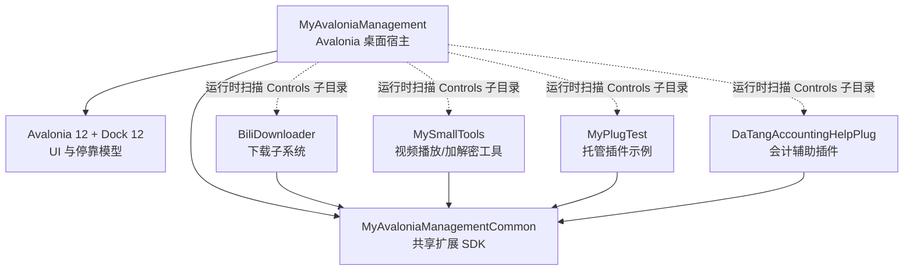
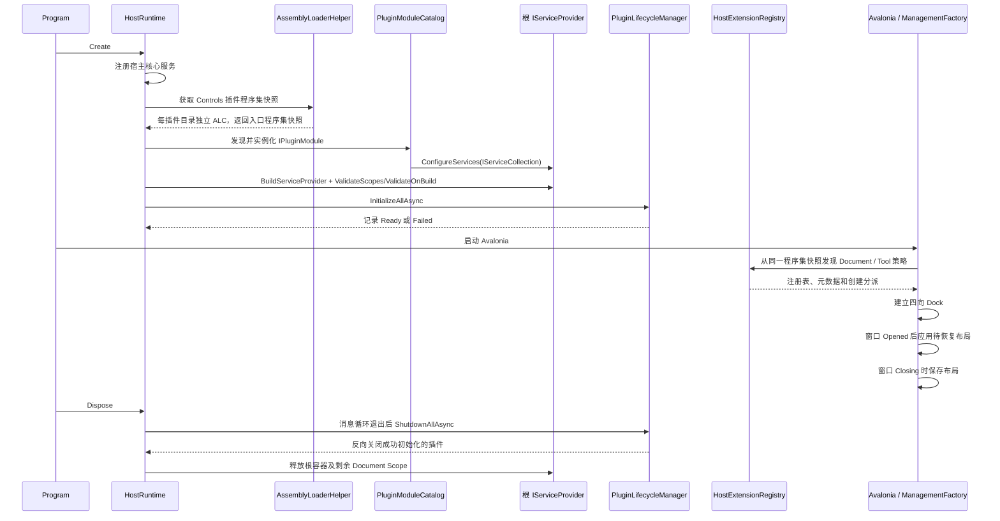
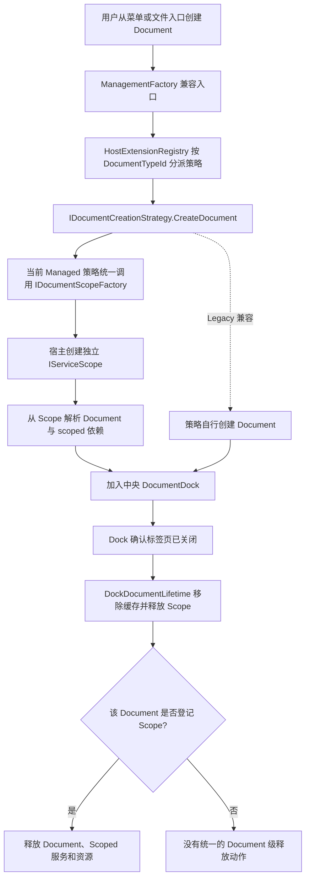
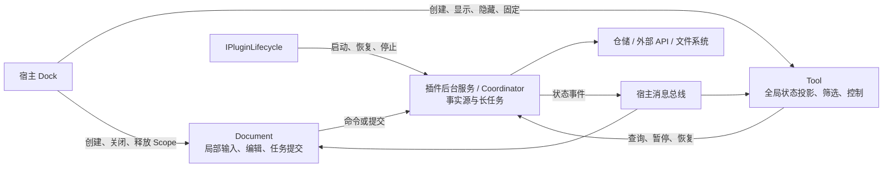
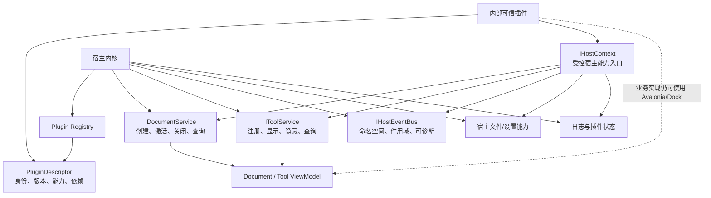

# MyAvaloniaManagement 宿主—插件交互架构整理与评审

> 更新日期：2026-08-15（已同步 G2 Host 实现面收口）<br>
> 代码基线：主项目核心链路内部重构后的当前工作区<br>
> 评审范围：宿主、公共契约、插件接入方式，以及 Document / Tool / 插件服务之间的关系  
> 默认边界：同一团队维护的内部可信插件；插件更新采用关闭应用、替换文件、重新启动  
> 不在本轮范围：逐项评审插件业务功能、第三方插件市场、运行时热卸载、插件沙箱

## 1. 先说结论：这是一个什么项目

**[架构判断]** 这不是一个单纯的 Avalonia Dock 示例，也还不是一个完整的通用插件平台。它更准确的定位是：

> 一个基于 .NET 10、Avalonia 12 和 Dock 12 的模块化桌面工作台，已经具备内部可信插件宿主的主要运行骨架，当前重点正从“能接入插件”转向“统一所有权、兼容性和诊断边界”。

宿主提供统一窗口、四向 Dock 布局、布局持久化、菜单、文件打开/保存、依赖注入、消息通信和可选插件生命周期；业务模块通过插件形式提供 Document、Tool 和后台服务。

当前工程已经形成三个核心扩展概念：

| 概念 | 当前语义 | 典型用途 |
| --- | --- | --- |
| `Document` | 中央工作区里的多实例工作上下文；每次创建拥有独立状态，可选择保存和恢复 | 下载方案、视频播放/加解密、发票导入、银行余额调节 |
| `Tool` | 宿主级单例状态投影；可以隐藏、固定和恢复 | 插件目录、文件树、工具管理、下载任务中心 |
| 插件服务 | 与页面可见性无关的业务能力；由根 DI 和可选生命周期共同管理 | 仓储、下载协调器、凭据、媒体运行时 |

这三个概念比“DLL 是否叫插件”更重要。平台是否成熟，最终取决于宿主能否一致地拥有对象创建、资源释放、兼容检查和诊断入口。

### 1.1 解决方案全景



**[代码事实]** 当前四个插件程序集都实现了 `IPluginModule`，均属于 Managed Plugin；Legacy 无参策略路径在 G4 删除前仍存在，但只属于过渡实现，不是 Managed Plugin v1 的兼容承诺。仓库中没有把它作为当前生产接入方式的插件。参见 [`PluginCompatibilityTests.cs`](../../Host/MyAvaloniaManagement.PluginTests/PluginCompatibilityTests.cs) 和各插件的 `Plugin/*PluginModule.cs`。

**[代码事实]** `MyAvaloniaManagementCommon` 已打包为 `MyAvaloniaManagement.PluginSdk`，只直接引用
公共签名实际需要的 Avalonia、Dock Model、MVVM Toolkit、DI、JSON 和 Behavior。Host 显式拥有
字体和全局主题；直接使用 Semi、Ursa 或 Dock UI 的插件选择同版本纯依赖包
`MyAvaloniaManagement.PluginSdk.UI`。因此它仍是共享桌面技术栈的进程内 SDK，但普通插件不再被迫
携带完整主题闭包。参见 [`MyAvaloniaManagementCommon.csproj`](../../Host/MyAvaloniaManagementCommon/MyAvaloniaManagementCommon.csproj)
和 [G3 记录](../plan-history/host-v1/g3-plugin-sdk-and-ui-profile.md)。

**[架构判断]** 对内部可信插件，这种强类型、进程内、共享 UI 栈的方式开发效率很高；代价是宿主、公共契约、Avalonia、Dock 和插件需要协同升级，不能把它当成稳定的第三方插件 ABI。

## 2. 宿主现在如何启动和接入插件

### 2.1 启动与退出流程



**[代码事实]** `HostRuntime` 是内部 Composition Root，统一拥有服务注册、插件发现、容器构建、生命周期初始化、Avalonia App 工厂和反向关闭；`Program.Main` 只负责进程编排。App 通过内部桌面 Shell 构造注入，根容器启用了 `ValidateScopes` 与 `ValidateOnBuild`。参见 [`Program.cs`](../../Host/MyAvaloniaManagement/Program.cs)、[`HostRuntime.cs`](../../Host/MyAvaloniaManagement/Business/Helpers/HostRuntime.cs) 和 [`PluginLifecycleManager.cs`](../../Host/MyAvaloniaManagementCommon/Plugin/PluginLifecycleManager.cs)。

**[代码事实]** `AssemblyLoaderHelper` 已收口为 Host internal 加载边界，内部按规范化插件根目录使用线程安全快照；同一根目录只扫描一次。标准插件通过唯一的“同名 DLL + `.deps.json`”确定入口，每个插件目录建立独立且不可回收的 `PluginLoadContext`；无 deps 的历史插件保留有序 DLL 回退。加载器不再注册全局 `AssemblyResolve`，也没有跨插件简单名称缓存。单个插件目录、依赖或类型失败不会终止其他插件。`HostExtensionRegistry` 和 `ViewLocator` 复用已加载入口程序集，不再为文档和工具分别触发目录扫描。

### 2.2 Managed 为现行模型，Legacy 仅为待删除过渡路径

| 模型 | 识别方式 | 策略构造 | 可用能力 | 当前状态 |
| --- | --- | --- | --- | --- |
| Managed Plugin | 程序集实现 `IPluginModule` | `ActivatorUtilities` 使用宿主 DI 构造 | DI、Document/Tool、可选 `IPluginLifecycle` | 四个现有插件均采用 |
| Legacy Plugin | 程序集中只有 Document/Tool 策略 | 公共无参构造函数 | Document/Tool，依赖自行处理 | G4 前过渡路径，无当前插件示例，不属于 v1 支持面 |

**[代码事实]** `IPluginModule.ConfigureServices(IServiceCollection)` 让托管插件在根容器构建前注册服务；未实现模块接口的程序集仍可走无参策略。参见 [`IPluginModule.cs`](../../Host/MyAvaloniaManagementCommon/Plugin/IPluginModule.cs)、[`PluginModuleCatalog.cs`](../../Host/MyAvaloniaManagement/Business/Helpers/PluginModuleCatalog.cs) 和 [`PluginStrategyActivator.cs`](../../Host/MyAvaloniaManagement/Business/Helpers/PluginStrategyActivator.cs)。

**[代码事实]** `IPluginLifecycle` 是可选能力，不是每个 Managed Plugin 的必选空壳。当前只有 BiliDownloader 注册生命周期，用它启动、恢复和关闭下载协调器；DaTang 没有常驻后台任务，因此只注册模块而不注册生命周期。生命周期管理器支持可选 `IPluginLifecycleDependencies`、拓扑排序和统一初始化/关闭超时；未声明依赖时仍按 `Order`、`PluginId` 串行初始化。失败、超时和依赖阻塞不会影响独立分支，退出时只反向关闭成功初始化的实例。

**[架构判断]** 双轨只描述 G4 前的当前代码事实。v1 已冻结为 Managed-only，文档、示例和新代码只能采用 Managed；Legacy 不再作为迁移入口或长期兼容模型。

## 3. Document：多实例工作上下文

### 3.1 创建入口已经支持“类型 + 意图”

`Document` 在本工程中更接近 IDE 编辑器标签页，而不局限于文本文件：

- 一次用户操作创建一个独立实例；
- 可以同时打开多个同类型实例；
- 实例拥有自己的交互状态和临时资源；
- 可以选择实现保存/恢复；
- 标签页真正关闭后，实例相关资源必须释放。

公共主入口仍是 `IDocumentCreationStrategy`。在不破坏旧接口的前提下，新增的 `IDocumentCreationIntentProvider` 允许一个 Document 类型声明多个菜单入口；宿主把 `CreationIntentId` 放入 `DocumentCreationParams` 传给同一策略。BiliDownloader 当前提供“链接下载”和“个人内容来源”两个入口。参见 [`IDocumentCreationStrategy.cs`](../../Host/MyAvaloniaManagementCommon/DocumentCreation/IDocumentCreationStrategy.cs)、[`IDocumentCreationIntentProvider.cs`](../../Host/MyAvaloniaManagementCommon/DocumentCreation/IDocumentCreationIntentProvider.cs) 和 [`BiliDownloaderDocumentStrategy.cs`](../../Plugins/BiliDownloader/BiliDownloader/Create/BiliDownloaderDocumentStrategy.cs)。

### 3.2 所有 Managed Document 已统一纳入宿主 Scope



**[代码事实]** `DocumentScopeManager` 建立 `Document` 与 `IServiceScope` 的一一映射。`ManagementFactory.OnDockableClosed` 把关闭后清理委托给 `DockDocumentLifetime`：先移除控件回收缓存对该 Document 的强引用，再释放对应 Scope；根容器释放时还会兜底释放仍打开的 Scope。参见 [`DocumentScopeManager.cs`](../../Host/MyAvaloniaManagement/Business/Helpers/DocumentScopeManager.cs)、[`DockDocumentLifetime.cs`](../../Host/MyAvaloniaManagement/Business/Helpers/DockDocumentLifetime.cs) 和 [`ManagementFactory.cs`](../../Host/MyAvaloniaManagement/ViewModels/ManagementFactory.cs)。

当前接入情况：

| 插件 / Document | 当前创建方式 | 判断 |
| --- | --- | --- |
| MySmallTools 的播放、库、加密、解密 Document | `IDocumentScopeFactory` + scoped ViewModel/资源 | 已纳入宿主所有权 |
| DaTang 银行余额调节 Document | `IDocumentScopeFactory` + scoped 运行状态 | 已纳入宿主所有权 |
| BiliDownloader Document | `IDocumentScopeFactory` + scoped ViewModel | 已纳入宿主所有权；插件级下载任务不随标签关闭 |
| MyPlugTest 三个 Document | `IDocumentScopeFactory` + scoped ViewModel/局部状态 | 已纳入宿主所有权 |
| DaTang 发票导入 Document | `IDocumentScopeFactory` + scoped ViewModel | 已纳入宿主所有权，与同插件对账 Document 规则一致 |

**[架构判断]** 当前全部 Managed Document 都由宿主 Scope 托管；Document 注册为 scoped，策略只依赖 `IDocumentScopeFactory`，根容器在 `ValidateScopes` 下不能直接解析这些 ViewModel。Legacy 无参策略仍保留原有自管创建语义，不纳入这一所有权承诺。

**[代码事实]** Managed Document Scope 现在同时提供 scoped `IDocumentLifetime`。Dock 确认关闭后，`DocumentScopeManager` 先取消 `ClosingToken`，再释放 ViewModel 与 scoped 依赖；被否决的关闭不会提前取消，宿主退出则对仍打开的 Document 执行同一路径。取消是协作式且不等待：Document 局部的 HTTP、解析、浏览、探测与发票导入停止并禁止迟到 UI 回写；BiliDownloader 已提交到插件级 Coordinator 的下载任务继续运行。原生文件选择器只能丢弃迟到结果，EPPlus 已进入同步 `SaveAs` 后允许完成写入。

### 3.3 Document 保存、关闭保护与坏文件恢复已形成 V1

**[代码事实]** 实现 `ISavableDocument` 的 Document 同时必须实现 `IDocumentSaveState`；插件报告脏状态，宿主只在主文件成功提交后调用 `AcceptChanges`。不完整契约以 `DOCUMENT_SAVE_STATE_MISSING` 拒绝发布并回滚 Document Scope。`DocumentPersistenceCoordinator` 继续负责批量打开、重复激活和单文件错误隔离，菜单保存、关闭保存和退出保存则统一复用 `DocumentSaveService` 与同一串行门。参见 [`document-persistence-v1-design.md`](./document-persistence-v1-design.md)。

**[代码事实]** 主文件与 `<主路径>.recovery.bak` 均使用 `AtomicFileTransaction`。主文件成功是唯一业务提交点：失败时不改变标题、路径、脏状态或另存保护；备份失败不回滚主文件，而是返回明确警告。损坏主文件只有在恢复备份于新 Scope 中完整加载成功后才展示恢复确认，恢复副本强制另存且永不覆盖损坏原件。

**[代码事实]** Dock 标签关闭采用“同步否决、异步确认、一次性重入”；被取消的关闭不会提前触发 `ClosingToken`。主窗口退出用一个汇总对话框处理全部脏 Document，保存全部按 Dock 顺序串行执行并在首个失败或取消处停止。BiliDownloader 只接受当前 Document V3，不再保留 V1/V2 或未知主版本的兼容读取分支。

**[验证证据]** 2026-08-13 Release 专项门禁通过 `MyAvaloniaManagement.Tests` 105、`MyAvaloniaManagement.PluginTests` 102、`MyAvaloniaManagement.UiTests` 31，合计 **238/238**；Host 行覆盖率 **76.86%**、分支覆盖率 **63.65%**，Windows 真实窗口冒烟通过。完整解决方案另有 BiliDownloader 720、银行插件 64、MySmallTools 182 项测试通过。

以下能力刻意不纳入 Document 保存 V1：

- 宿主信封版本迁移框架和历史 Document 内容迁移；
- 未安装对应插件时的占位页或延迟恢复机制；
- 所有插件一致采用的版本化内容 DTO 与安全约束。

## 4. Tool：宿主级单例状态投影

### 4.1 当前语义

`Tool` 更接近 IDE 的解决方案资源管理器、输出窗口或任务中心：

- 默认由宿主创建一次并缓存；
- 支持 Left、Right、Top、Bottom 四向停靠；
- 关闭操作实际是隐藏，之后可恢复同一实例；
- 支持固定/自动隐藏状态；
- 适合展示全局状态、导航和控制命令；
- 不应拥有必须依赖 Tool 可见性才能存活的后台任务。

**[代码事实]** `ManagementFactory` 启用 `HideToolsOnClose`，创建并缓存 Tool，禁止浮动窗口，同时保留主窗口内部拖放和四向布局。Top/Bottom 横跨 Left/Document/Right 中间行的完整宽度，没有对应 Tool 时不创建空白行。参见 [`ToolMetadata.cs`](../../Host/MyAvaloniaManagementCommon/ToolCreation/ToolMetadata.cs)、[`ToolDockPlacement.cs`](../../Host/MyAvaloniaManagement/Business/Layout/ToolDockPlacement.cs)、[`ManagementFactory.cs`](../../Host/MyAvaloniaManagement/ViewModels/ManagementFactory.cs) 和 [`DockFourWayLayoutTests.cs`](../../Host/MyAvaloniaManagement.PluginTests/DockFourWayLayoutTests.cs)。

### 4.2 Tool、Document 与后台服务的职责流



**[架构判断]** BiliDownloader 是当前最清晰的示例：下载协调器是插件级 singleton，由 `IPluginLifecycle` 初始化和关闭；Scheduler Tool 只是后台事实源的展示与控制入口。因此隐藏 Tool 或关闭提交任务的 Document 都不应停止下载。

### 4.3 布局持久化已经从“未实现”变为“可用 V1”

**[代码事实]** `DockLayoutStore` 把 `layout-v1.json` 写入 `%LOCALAPPDATA%\MyAvaloniaManagement\v1\`（测试可通过 `MYAVALONIA_DATA_DIRECTORY` 提供完整隔离根），采用同目录临时文件和原子替换；读取时校验版本、稳定 ID、重复项、Pane/Tool 状态和边界数据，损坏快照会被隔离为 `.invalid.bak`。旧预发布父目录不会被读取、迁移或删除。参见 [`DockLayoutStore.cs`](../../Host/MyAvaloniaManagement/Business/Layout/DockLayoutStore.cs) 和 [`DockLayoutSnapshotV1.cs`](../../Host/MyAvaloniaManagement/Business/Layout/DockLayoutSnapshotV1.cs)。

**[代码事实]** `DockLayoutLifecycle` 保存四向 Pane 比例、Tool 顺序、可见/固定状态和活动 Tool；能够迁移旧的两向布局，并把历史浮动 Tool 归一化回主窗口 Dock。若快照引用缺失插件、缺失 Pane 或非法 Dock，则隔离整个快照并回退默认布局。

**[剩余边界]** 当前策略强调“一致回退”，尚未做到插件缺失时保留其余可恢复布局，也没有 V2 迁移框架；这属于下一阶段的韧性改进，而不再是“布局持久化未实现”。

## 5. 宿主与插件的实际交互通道

当前交互不是单一 API，而是多条通道叠加：

| 通道 | 当前方式 | 已有价值 | 主要风险 |
| --- | --- | --- | --- |
| UI 扩展 | 插件直接返回 Dock `Document` / `Tool` | 简单、强类型、UI 自由度高 | 与 Dock 版本和宿主布局模型强耦合 |
| 服务接入 | 插件直接获得 `IServiceCollection` | 可完整使用 Microsoft DI | 可注册或覆盖根服务，缺少能力边界 |
| 创建入口 | `HostExtensionRegistry` 单次遍历发现策略；Document 可附加 Creation Intent | 元数据只读取一次，新增类型和多入口成本低 | 没有显式贡献清单；为兼容仍采用首次注册胜出 |
| 消息通信 | `IMessengerService` 包装进程级 messenger | 广播和解耦方便 | 仍暴露底层 `IMessenger`，无消息归属和契约版本 |
| 文件能力 | 宿主包装选择器、打开和保存外壳 | ViewModel 不直接依赖根窗口，Document 与布局均原子写入 | 公共保存契约仍缺少统一脏状态和关闭确认 |
| 布局能力 | 宿主持有 Dock 树和 V1 快照 | 四向、隐藏、固定、恢复已有测试 | 插件缺失时整份布局回退 |

**[代码事实]** `IMessengerService` 仍直接暴露底层 `IMessenger`，生产实现使用 `WeakReferenceMessenger.Default`。参见 [`IMessengerService.cs`](../../Host/MyAvaloniaManagementCommon/Message/IMessengerService.cs) 和 [`MessengerService.cs`](../../Host/MyAvaloniaManagementCommon/Message/MessengerService.cs)。

**[代码事实]** 宿主生产 ViewModel 只使用构造注入，App 通过内部桌面 Shell 创建；内建 Tool 策略使用对应的 `Func<ViewModel>`，Welcome 策略使用延迟 `Func<ManagementFactory>` 打破注册表构造循环。静态 `ServiceProvider` 和生产无参构造已经删除。主窗口与文件树设计器改用无 I/O 的独立样例数据；`ToolManagementViewModel` 在根 Dock 建立前读取 `ManagementFactory` 提供的内部只读注册快照。参见 [`ServiceCollectionExtensions.cs`](../../Host/MyAvaloniaManagement/Business/Helpers/ServiceCollectionExtensions.cs) 和 [`ToolManagementViewModel.cs`](../../Host/MyAvaloniaManagement/ViewModels/Tools/ToolManagementViewModel.cs)。

**[架构判断]** 当前模型仍可概括为：**高自由度、强信任、约束正在形成**。它适合内部插件，但下一步应把已经出现的宿主能力收束成稳定接口，而不是继续让插件或宿主 ViewModel 依赖内部字段和全局对象。

## 6. 当前成熟度盘点

| 能力 | 状态 | 当前证据与边界 |
| --- | --- | --- |
| .NET/UI 技术基座 | 已实现 | .NET SDK 10.0.302、`net10.0`、Avalonia 12.1.0、Dock 12.0.0.2；产品/SDK、构建和包版本分别由 `Directory.Version.props`、`Directory.Build.props`、`Directory.Packages.props` 集中管理 |
| 插件目录扫描 | 已实现 | 按规范化根目录缓存线程安全快照；标准插件只主动加载唯一 deps 入口，私有依赖按需解析；Legacy 保留有序 DLL 回退，并隔离目录/局部类型失败 |
| Managed v1 / Legacy 过渡 | Managed 已实现 | 四个现有插件均为 Managed；Legacy 无参激活路径和回归测试只保留到 G4，不属于 v1 支持面 |
| Document/Tool 策略 | 已实现 | `HostExtensionRegistry` 对程序集类型做一次遍历，以强类型主 ID 构建不可变注册表；元数据只读取一次，Document 支持可选多入口意图 |
| 插件级 DI | 已实现 | Managed Plugin 可注册 singleton/scoped/transient；根容器启用构建和 Scope 验证 |
| 插件生命周期 | 已实现 V1 | 顺序初始化、反序关闭、幂等、失败隔离、超时、依赖图和只读插件状态 Tool 均已有测试；仍不支持运行时重试、禁用或热卸载 |
| Tool 四向布局 | 已实现 | Left/Right/Top/Bottom、空 Pane 折叠、隐藏恢复、固定状态和禁用浮动均有测试 |
| 布局持久化 | 已实现 V1 | 原子写入、校验、坏文件隔离、两向迁移、历史浮动归一化已有测试；插件缺失时整份回退 |
| Document 保存 | 已实现 V1 | 公共脏状态、无副作用快照、统一保存结果、标签/退出确认、最近成功备份、坏文件恢复副本和原子替换均有回归测试；不兼容历史 Document 文件 |
| 每 Document Scope | 已实现 | 当前全部 Managed Document 均通过 `IDocumentScopeFactory` 创建 scoped ViewModel；关闭与宿主退出释放路径已有回归门禁 |
| Document 关闭取消 | 已实现 | scoped `IDocumentLifetime` 在 Dock 确认关闭后先发出取消再释放 Scope；局部任务协作退出且不等待，插件级后台任务不受影响 |
| 加载上下文隔离 | 已实现（托管私有依赖） | 每目录一个不可回收 ALC；共享 SDK 只来自默认上下文，普通私有依赖由各插件的 deps/目录索引独立解析，同名不同版本回归已覆盖 |
| 错误处理与诊断 | 已实现 V1 | 插件发现、程序集/依赖加载、模块与扩展组合、DI、生命周期和布局统一进入会话诊断；单插件加载失败隔离后继续，契约错误由独立启动错误窗汇总展示；JSON Lines 日志保留最近 20 次会话，Console/Trace 仅作兼容镜像 |
| ID 与元数据 | 已实现 | `PluginId`、`DocumentTypeId`、`ToolTypeId`、`CreationIntentId` 均为引用型值对象；主 ID、旧别名和所有权经原子注册表统一校验，不再存在 `TryAdd` 首次胜出语义 |
| 构建与部署 | 部分成熟 | SDK/包版本已集中；四个插件仍分别维护部署 Target，共享依赖排除规则可能漂移 |
| 真实包验证 | 部分成熟 | 四个当前 Managed Plugin 的真实构建目录均有动态加载测试；真实 `Controls` 四目录启动、BiliDownloader win-x64 包和同名不同版本依赖夹具已通过；尚缺统一全插件发布包矩阵与长期运行门禁 |
| 插件 manifest | 已实现 V1 | 四个现有插件根目录均部署严格 `plugin.manifest.json`，加载前提供身份、插件版本、唯一入口以及 Host API/Common 兼容区间；能力和插件依赖声明仍未纳入 V1 |
| Host API 兼容检查 | 已实现 V1 | 宿主先完成全部清单解析、显式左闭右开版本区间检查和 `pluginId` 全局去重，再创建 ALC；缺失/损坏/不兼容隔离单目录，重复身份在加载任何插件 DLL 前阻断启动 |
| 插件启停与依赖图 | 部分实现 | 生命周期支持可选依赖声明、缺失/重复/循环依赖阻断和确定性拓扑排序；仍没有用户启停配置 |
| 能力权限声明 | 未实现 | 插件可向根容器注册服务并执行任意进程内代码 |
| 运行时卸载/热更新 | 有意不做 | ALC 不可回收；内部插件采用重启更新 |

### 6.1 加载隔离需要准确理解

**[已实现]** `PluginDirectoryLayout` 把入口识别和物理路径索引从加载上下文拆出。目录顶层存在 `.deps.json` 时，必须只有一个同名入口 DLL；没有 deps 时才进入 Legacy 有序扫描。`AssemblyLoaderHelper` 只缓存根目录的入口程序集快照，不再持有跨插件程序集名称表，也不再注册 `AppDomain.AssemblyResolve`。参见 [`PluginDirectoryLayout.cs`](../../Host/MyAvaloniaManagement/Business/Helpers/PluginDirectoryLayout.cs) 和 [`AssemblyLoaderHelper.cs`](../../Host/MyAvaloniaManagement/Business/Helpers/AssemblyLoaderHelper.cs)。

**[已实现]** `PluginLoadContext` 使用 `AssemblyDependencyResolver` 处理托管、卫星和 RID 原生资产。
共享策略以基础 SDK 与显式 UI Profile 两组根建立默认上下文依赖闭包；共享程序集版本或身份不兼容
时拒绝当前插件，不加载插件自带副本。普通第三方依赖则优先从当前插件的 deps 图解析，deps 未覆盖
时只查询当前目录索引，绝不横向搜索其他插件。该模型遵循微软对
[`AssemblyDependencyResolver`](https://learn.microsoft.com/dotnet/api/system.runtime.loader.assemblydependencyresolver?view=net-10.0)
和 [`AssemblyLoadContext`](https://learn.microsoft.com/dotnet/core/dependency-loading/understanding-assemblyloadcontext) 的推荐用法。

| 请求类型 | 解析位置 | 失败语义 |
| --- | --- | --- |
| `MyAvaloniaManagementCommon`、基础 SDK 依赖与显式 UI Profile | `AssemblyLoadContext.Default` | 身份或版本不兼容时拒绝当前插件 |
| 插件 `.deps.json` 声明的托管/卫星依赖 | 当前插件 ALC | 当前插件失败，不借用其他插件程序集 |
| 无 deps 的 Legacy 托管依赖 | 当前插件目录确定性索引 | 同目录同简单名多文件时拒绝该目录 |
| RID 原生资产 | 当前插件的 `AssemblyDependencyResolver` | 返回标准原生加载失败，不递归扫描其他插件 |

**[设计意图]** 共享契约优先是为了保证跨边界类型只有一个 CLR 身份；私有依赖按插件解析是为了允许同名不同版本并存；Legacy 回退只服务迁移，不是新插件部署规范。`PluginLoadContext` 仍未启用 `isCollectible`，因为当前内部可信插件采用“重启更新”。ALC 只提供程序集名称解析隔离，不是安全沙箱，也不能隔离原生崩溃、进程级原生全局状态或恶意代码。

**[验证证据]** 插件测试包含两个最小插件：它们引用程序集简单名称和类型全名相同、版本分别为 1.0.0.0 与 2.0.0.0 的私有依赖。测试证明两个版本分别进入不同 `PluginLoadContext`、没有进入默认上下文，同时两个插件看到同一个 `MyAvaloniaManagementCommon` 实例；缺少 V1 私有依赖时，V1 候选在服务注册前整体隔离，V2 插件仍可加载和执行。四个当前 Managed Plugin 也分别从真实 Release 构建目录完成模块发现。

### 6.2 2026-08-11 宿主专项测试基线

执行命令：

```powershell
.\scripts\Invoke-MyAvaloniaManagementTests.ps1 -Configuration Release -WindowsSmoke
```

本次主项目内部重构后的专项结果：

| 测试项目 | 通过 | 失败 | 总计 |
| --- | ---: | ---: | ---: |
| `MyAvaloniaManagement.Tests` | 55 | 0 | 55 |
| `MyAvaloniaManagement.PluginTests` | 92 | 0 | 92 |
| `MyAvaloniaManagement.UiTests` | 30 | 0 | 30 |
| **合计** | **177** | **0** | **177** |

合并后的 Host 行覆盖率为 **80.10%**，分支覆盖率为 **64.44%**；public API 指纹、并发文档打开、保存失败状态保护、线程安全插件快照、同名不同版本私有依赖、四个 Managed Plugin 动态加载、Tool 只读注册快照和原子替换均进入回归。带 `-WindowsSmoke` 的独立发布目录真实窗口冒烟通过；另外，Release 解决方案构建为 0 错误、0 警告，携带四个真实 `Controls` 插件目录的宿主启动退出码为 0。该专项门禁不等同于所有插件业务测试、媒体集成 Harness 或长期运行验证。

**[判断边界]** 已通过的测试能证明宿主生命周期编排、Document Scope、四向布局、布局存储、Managed/Legacy 激活、托管私有依赖版本隔离、当前四插件构建目录加载和真实窗口基础行为；它们仍不能替代统一的全插件发布包矩阵、Host API 版本拒绝、原生库冲突和长期运行稳定性验证。

### 6.3 2026-08-12 强类型身份与元数据升级

**[已实现]** Common 以不可变引用型值对象分别表达插件、Document 类型、Tool 类型和创建意图，避免不同身份在编译期误传，也避免值类型的 `default` 绕过构造校验。运行时比较固定区分大小写；值对象不做隐式字符串转换，也不自动裁剪输入。JSON Adapter 仍把 Document/Tool ID 写成字符串标量，Dock 与文件选择器等必须使用字符串的边界才读取 `.Value`。

**[已实现]** `PluginModuleCatalog` 在调用任何 `ConfigureServices` 前验证“一程序集一模块”和全局唯一 `PluginId`。`HostExtensionRegistry` 随后按 Builder → Validate → Commit 三阶段构建：扫描并激活候选策略、各读取一次元数据、校验命名空间与别名的全量碰撞，最后一次性发布只读注册表。任何错误都会抛出包含错误码、冲突 ID、贡献类型和程序集的 `HostCompositionException`，宿主会在生命周期回调和 Avalonia UI 启动前失败并释放容器。

插件贡献示例：

```csharp
public static class PluginIds
{
    public static readonly PluginId Plugin =
        new("myavalonia.plugin.example");
    public static readonly DocumentTypeId ReportDocument =
        new("myavalonia.plugin.example.document.report");
    public static readonly DocumentTypeId LegacyReportDocument =
        new("A3F7E1B2-9C4D-4E8A-B6F1-2D5E8A7C3B10");
}

public DocumentMetadata GetMetadata() => new(
    PluginIds.ReportDocument,
    "报表",
    [PluginIds.LegacyReportDocument])
{
    MenuCategory = "示例插件",
    Description = "创建并维护业务报表"
};
```

主 ID 必须采用小写点分层命名，并归属于模块的 `.document.*` 或 `.tool.*` 空间；历史大写 GUID、短名称等只能进入 `LegacyIds`。读取旧 Document 信封或 Tool 布局时，注册表先把别名规范化为主 ID，后续保存只写主 ID。新建与“另存为”统一建议 `.mamdoc`，但打开旧文件后的普通保存继续覆盖原路径，不强制改名。

### 6.4 2026-08-12 统一启动诊断 V1

**[已实现]** 宿主在扫描插件之前创建 `HostDiagnosticSession`。每条诊断同时进入线程安全内存快照、逐条刷新的 JSON Lines 会话文件和 Trace/Console 兼容镜像；默认目录为 `%LOCALAPPDATA%/MyAvaloniaManagement/v1/Diagnostics`，自动化仍可通过 `MYAVALONIA_DATA_DIRECTORY` 提供完整隔离根，启动时仅保留最近 20 个会话。日志设施失败只产生 `DIAGNOSTIC_PERSISTENCE_UNAVAILABLE`，不会成为新的启动失败原因。

**[已实现]** `AssemblyLoaderHelper` 的生产入口返回程序集、预检类型与失败记录来自同一次扫描的不可变快照。入口程序集加载后会先解析其完整程序集引用并执行类型预检；任一环节失败都隔离整个插件目录，不能以局部类型继续贡献服务或被误判为 Legacy。模块身份、服务注册、容器构建和扩展组合错误仍属于全局契约错误，阻止主工作台启动；生命周期和布局错误则记录后继续或回退。

**[已实现]** 可恢复的加载错误进入“插件状态”Tool，即使尚未取得 `PluginId` 也会按目录名展示。致命错误使用独立的最小 Avalonia 应用显示错误码、对象与日志位置，可复制摘要或打开日志目录；该路径不加载 `App.axaml`、`ViewLocator`、Dock 或插件 ViewModel，关闭窗口返回退出码 1。宿主和 Common 的 public API 指纹保持不变。

**[验证证据]** 2026-08-12 执行宿主 Release 专项门禁与 Windows 真实窗口冒烟：`MyAvaloniaManagement.Tests` 84、`MyAvaloniaManagement.PluginTests` 93、`MyAvaloniaManagement.UiTests` 31，合计 **208/208** 通过；Host 行覆盖率 **76.45%**、分支覆盖率 **62.48%**，真实 `Controls` 四插件目录启动退出码为 0。新增回归覆盖 JSON Lines 字段与留存、日志失败内存降级、失败策略、组合诊断来源、缺失依赖候选隔离、状态 Tool 投影和启动错误窗敏感详情隔离；独立失败冒烟同时验证 `PLUGIN_ROOT_SCAN_FAILED` 日志和退出码 1。

### 6.5 2026-08-12 Host API 与公共契约兼容检查 V1

**[已实现]** 每个插件根目录强制提供严格 `plugin.manifest.json`。发现过程先只读 JSON，校验 schema、稳定身份、插件版本、唯一根级入口和 Host API/Common 左闭右开版本区间；全部有效清单还会在任何 ALC 创建前完成全局 `pluginId` 去重。缺失、损坏、未知 schema 或不兼容只隔离单目录，重复身份属于致命全局歧义。

**[已实现]** 通过兼容检查后，宿主才建立目录布局并加载清单声明的唯一入口；入口 `AssemblyVersion` 与 `pluginVersion`、Managed 模块 `PluginId` 与清单身份还会在 `ConfigureServices` 前二次核对。现有共享程序集身份检查继续作为运行时纵深校验。四个当前插件、私有依赖隔离夹具、构建输出和发布部署目录均已纳入清单规则。

**[验证证据]** 最新 Release 专项门禁通过 `MyAvaloniaManagement.Tests` 105、`MyAvaloniaManagement.PluginTests` 102、`MyAvaloniaManagement.UiTests` 31，合计 **238/238**；Host 行覆盖率 **76.86%**、分支覆盖率 **63.65%**，Windows 真实窗口冒烟与携带四个真实 `Controls` 目录的宿主启动均无诊断错误。回归继续覆盖严格 JSON、大小限制、版本上下界、路径穿越、版本/模块身份二次核对、重复身份预加载阻断，以及“不兼容目录即使携带损坏 DLL 也不进入程序集加载阶段”。

## 7. 宿主应该给插件多大自由度

### 7.1 当前可信模型下的责任边界

| 宿主必须拥有 | 插件可以拥有 | 插件不应决定 |
| --- | --- | --- |
| 插件发现与兼容性判断 | 业务 View / ViewModel | 根窗口和应用生命周期 |
| 根容器构建顺序 | 插件内部服务和仓储 | Dock 根布局整体结构 |
| Document/Tool 注册表 | Document 的业务状态和版本化内容 | 其他插件是否加载 |
| Dock 创建、激活、关闭、布局保存 | Tool 的展示与控制逻辑 | 覆盖宿主核心服务 |
| Document Scope 创建与释放 | 插件后台 Coordinator | 全局文件格式与安全策略 |
| 文件选择和统一保存外壳 | 插件序列化内容 | 全局更新、权限和诊断策略 |
| 应用启动、退出和插件状态 | 插件内部消息 | 直接修改其他插件状态 |

### 7.2 目标能力边界



**[建议]** 不需要立即禁止插件引用 Avalonia/Dock。内部插件的 UI 自由度是该项目的价值之一。
Host 实现面和静态服务定位已经收口；下一步应在 G3/G5 中把 Common 依赖和 View 贡献形成正式、
可打包的 SDK 边界，同时继续减少业务代码直接操作根 Dock。

### 7.3 建议的候选契约

以下是下一阶段设计方向，不是当前已实现接口：

```csharp
public sealed record PluginDescriptor(
    PluginId PluginId,
    Version PluginVersion,
    Version RequiredHostApiVersion,
    IReadOnlyList<string> Capabilities,
    IReadOnlyList<PluginId> Dependencies);

public interface IHostContext
{
    IDocumentService Documents { get; }
    IToolService Tools { get; }
    IHostEventBus Events { get; }
    IHostDiagnostics Diagnostics { get; }
}
```

- `IDocumentService`：创建、激活、关闭、按 ID 查询，并统一建立/释放 Document Scope。
- `IToolService`：注册、显示、隐藏、固定和查询 Tool，不向插件暴露根 Dock 树。
- `IHostEventBus`：不再暴露底层 `IMessenger`，要求消息归属、作用域和错误诊断。
- `IDocumentSaveState`：已经统一公共脏状态与成功提交；关闭确认和磁盘事务由宿主协调器负责，当前版本不提供历史 Document 格式迁移。
- `PluginDescriptor`：加载代码前即可完成身份、兼容性和依赖检查。

## 8. 哪些场景适合做插件

| 场景 | 建议 | 原因 |
| --- | --- | --- |
| 下载器、媒体处理、数据导入 | 适合进程内插件 | 有清晰业务边界，同时需要宿主 Document/Tool UI |
| 项目浏览器、日志查看器、任务中心 | 适合 Tool 或 Document | 可复用宿主 Dock、布局和消息能力 |
| 带后台队列的领域子系统 | 适合 Managed Plugin | 后台服务由生命周期托管，UI 只是投影 |
| 主题、根窗口、主菜单总体结构 | 保留在宿主 | 属于全局一致性和应用生命周期 |
| 插件安装器、全局更新器 | 保留在宿主 | 涉及全部插件和发布安全 |
| 权限、安全策略、凭据总规则 | 保留在宿主 | 插件不能自行决定安全边界 |
| 不可信第三方代码 | 独立进程 | 当前进程内插件没有安全隔离 |
| 容易导致进程崩溃的原生组件 | 优先独立进程 | ALC 不能隔离 native crash |
| 高 CPU/内存、需要强制限额的长任务 | 独立 Worker 进程 | 便于资源限制、重启和故障恢复 |

## 9. 建议演进路线

### P0：收口当前已经暴露的所有权和稳定性问题

1. **已完成**：所有当前 Managed Document 都经 `IDocumentScopeFactory` 创建，scoped 注册与 `ValidateScopes` 共同禁止从根容器解析 Document；未来的 `IDocumentService` 可在此基础上扩展激活和查询能力。
2. **已完成（G2）**：Host 自有类型全部 internal，构造注入成为唯一生产路径；静态 `ServiceProvider` 与生产无参 ViewModel 构造已删除，设计器使用独立内存样例。
3. **已完成**：重复 `PluginId`、Document/Tool 主 ID 与别名、所有权错误、空元数据和重复 Creation Intent 均形成排序稳定的结构化诊断；注册表无诊断时才一次性发布，不再有“首次注册胜出”。
4. **已完成**：只读插件状态 Tool 已覆盖程序集加载与生命周期结果；模块构造、服务注册、策略发现、DI 和布局均进入同一会话诊断，致命组合错误由独立启动错误窗展示。
5. **隔离部分已完成**：真实 `Controls` 四插件目录可启动，同名不同版本托管私有依赖已有独立 ALC 回归；统一全插件发布包矩阵、原生冲突和长期运行验证继续由 P2 承担。

### P1：形成稳定宿主 API

1. **已完成 V1**：引入外部插件清单和 Host API/Common 显式版本区间，在执行插件代码前完成身份与兼容性校验；插件依赖与能力声明留待后续 Descriptor/Registry 演进。
2. 建立 Plugin Registry，集中保存插件身份、程序集、状态、Document/Tool 贡献和诊断。
3. 以 `IHostContext`、`IDocumentService`、`IToolService` 收束宿主能力。
4. 将消息按宿主事件、插件内部事件和跨插件公共事件分层，默认不暴露底层 messenger。
5. **已完成 V1**：公共脏状态、标签与退出确认、统一保存结果、最近成功备份和坏文件恢复已落地；宿主外壳版本不在本轮范围。
6. 为布局快照建立显式版本迁移，并允许插件缺失时部分恢复其余 Pane/Tool，而不是整份回退。

### P2：统一工程化和真实包验证

1. 把插件 publish、宿主共享依赖排除和部署目录规则抽成统一 MSBuild Target。
2. 增加从临时 `Controls` 目录启动宿主并加载全部真实插件包的集成测试。
3. 扩展统一发布包矩阵，继续覆盖缺少依赖、重复 ID、模块构造失败、生命周期超时和关闭异常；同名不同版本托管依赖已由最小真实程序集夹具覆盖，仍需纳入最终发布包门禁。
4. Document 多开、关闭释放、宿主退出释放和损坏文件恢复已覆盖；缺失插件占位仍待实现。
5. 增加结构化日志、插件启动耗时、失败阶段和长期后台任务状态，并把发布验收入口统一到 CI。

### 当前明确不做

- 运行时卸载和热更新；
- 插件沙箱或权限强制执行；
- 跨进程 UI 合成；
- 第三方插件市场；
- 为了“形式完整”给无后台职责的插件增加空生命周期。

这些能力只有在信任模型、产品定位或发布方式改变后才值得重新评估。

## 10. 最终评价

项目已经明显跨过“把几个 DLL 反射进 Dock”的阶段：四个插件都进入 Managed 模型并具有加载前清单；Host API/Common 兼容预检、根容器验证、插件生命周期、每 Document Scope 基础设施、创建意图、四向 Tool、禁用浮动、文档/布局原子持久化、坏文件隔离、真实窗口测试和插件级 Document V3 都已经落地。宿主内部也已经形成 Composition Root、Registry、Builder、Navigator、Coordinator 和 Adapter 的清晰协作边界。

它尚未完全跨过“宿主能力产品化”的门槛，核心问题收敛为：

1. 插件仍能直接接触根 DI、Dock 类型和全局消息器，宿主为外部兼容仍保留静态服务定位入口；
2. 运行前 manifest、Host API/Common 兼容检查和用户可见诊断已有 V1，仍缺少统一 Plugin Registry、能力声明和插件依赖清单；
3. 公共契约承担了宿主 SDK 的角色，但保存状态、版本演进和错误语义仍主要由单个插件自行补齐；
4. 宿主专项测试与 Windows 冒烟已全绿，但全插件发布矩阵、媒体集成和长期运行仍是独立验收边界。

因此，下一步最值得做的不是热加载或沙箱，而是把已有的正确方向彻底收口：**宿主拥有生命周期、布局与资源；Document 表达多实例工作上下文；Tool 表达单例状态投影；插件后台服务承载长期事实；所有扩展贡献在执行前可识别、执行中可诊断、关闭后可释放。**
