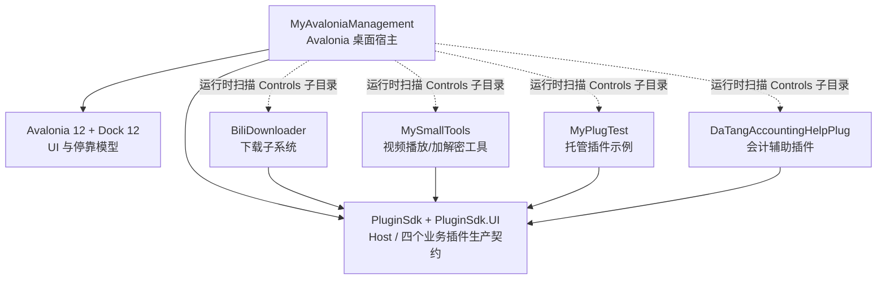
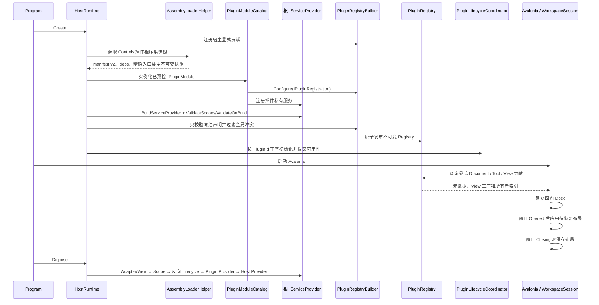
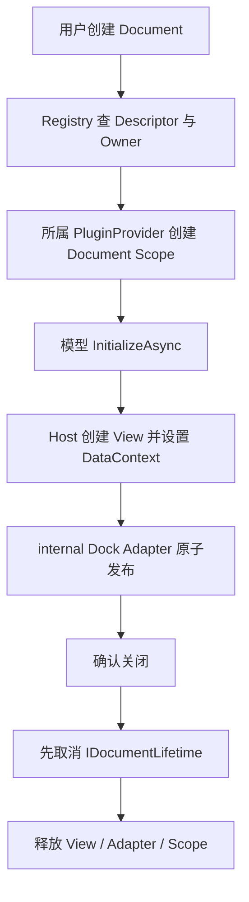
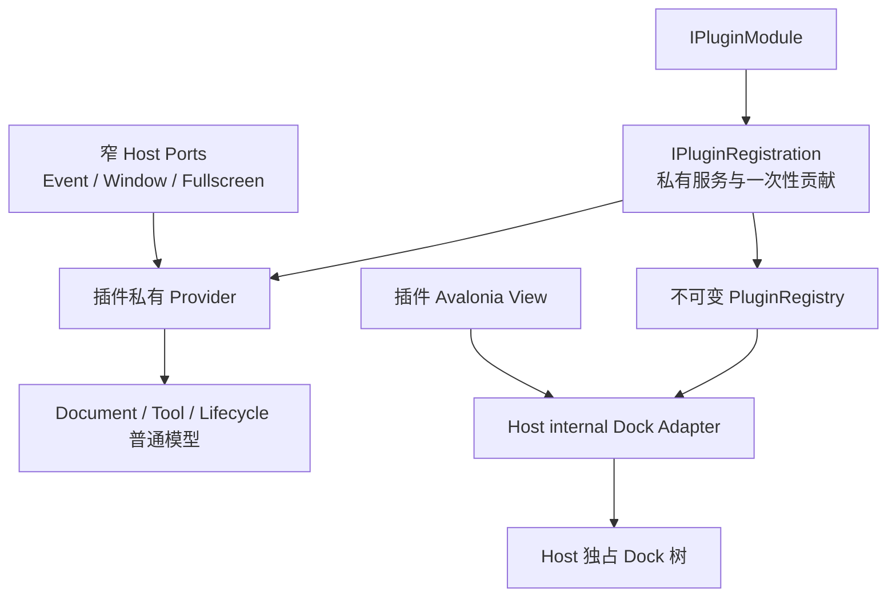

# MyAvaloniaManagement 宿主—插件交互架构整理与评审

> 更新日期：2026-08-22（已同步 Managed Plugin V3 G6 Workspace / Dock Factory 拆分）<br>
> 历史代码基线：`managed-plugin-v1.0.0`<br>
> 评审范围：宿主、公共契约、插件接入方式，以及 Document / Tool / 插件服务之间的关系
> 默认边界：同一团队维护的内部可信插件；插件更新采用关闭应用、替换文件、重新启动
> 不在本轮范围：逐项评审插件业务功能、第三方插件市场、运行时热卸载、插件沙箱

> V2 当前状态：G0–G14 已完成。四个业务插件均使用正式 SDK、声明式贡献与普通模型；Legacy
> 项目、兼容适配和过渡构建属性已经删除，API Shipped 与两轮隔离发布门禁已经建立。

> V3 当前状态：G0–G6 已完成。源码版本线为未发布 `3.0.0`，活动 API 位于 v3 Unshipped；Document
> 保存已使用修订协议，激活已使用互斥 New/Restore 类型，插件注册已采用 Host 最终提交与 ID 归属；
> MyPlugTest 与 BiliDownloader 的消息器已归各自插件 Provider 所有；唯一 Workspace Session、Dock
> Factory Adapter 和无 Dock Tool ReadModel 已建立。磁盘 schema 仍为 2，G7–G14 尚未实施。

## 1. 先说结论：这是一个什么项目

**[架构判断]** 这不是一个单纯的 Avalonia Dock 示例，也不是面向不可信第三方代码的通用插件平台。它更准确的定位是：

> 一个基于 .NET 10、Avalonia 12 和 Dock 12 的模块化桌面工作台；内部可信 Managed Plugin V2 已完成所有权、兼容性、诊断和发布制品边界封板。

宿主提供统一窗口、四向 Dock 布局、布局持久化、菜单、文件打开/保存、依赖注入、消息通信和可选插件生命周期；业务模块通过插件形式提供 Document、Tool 和后台服务。

当前工程已经形成三个核心扩展概念：

| 概念 | 当前语义 | 典型用途 |
| --- | --- | --- |
| `Document` | 中央工作区里的多实例工作上下文；每次创建拥有独立状态，可选择保存和恢复 | 下载方案、视频播放/加解密、发票导入、银行余额调节 |
| `Tool` | 宿主级单例状态投影；可以隐藏、固定和恢复 | 插件目录、文件树、工具管理、下载任务中心 |
| 插件服务 | 与页面可见性无关的业务能力；由插件私有 Provider 和可选生命周期共同管理 | 仓储、下载协调器、凭据、媒体运行时 |

这三个概念比“DLL 是否叫插件”更重要。平台是否成熟，最终取决于宿主能否一致地拥有对象创建、资源释放、兼容检查和诊断入口。

### 1.1 解决方案全景



**[代码事实]** 四个业务插件已只保留最终 UI SDK `IPluginModule`，并通过真实 V2 加载分别形成
MyPlugTest 4 Document + 1 Tool、DaTang 2 Document、MySmallTools 4 Document，以及
BiliDownloader 1 Document + 1 Tool + 1 Lifecycle。不存在双接口回退。
最终 SDK 加载链由两个独立依赖测试夹具验证。参见
[`ManagedOnlyPluginLoadingTests.cs`](../../Host/MyAvaloniaManagement.PluginTests/ManagedOnlyPluginLoadingTests.cs)。

**[代码事实]** G2 已把最终 V2 SDK 分成平台无关的 `MyAvaloniaManagement.PluginSdk` 与真实
`MyAvaloniaManagement.PluginSdk.UI`。Host 已在 G5 迁移，四个业务插件已在 G9–G12 迁移；G13 又删除
Legacy 项目、双生命周期适配和入口契约选择开关。活动编译与加载图现在只有当前 Core/UI 契约。
历史阶段桥的建立原因仍见 [V2 G2 记录](../plan-history/host-v2/g2-plugin-sdk-rebuild.md)。

**[架构判断]** 对内部可信插件，这种强类型、进程内、共享 UI 栈的方式开发效率很高；代价是宿主、公共契约、Avalonia、Dock 和插件需要协同升级，不能把它当成稳定的第三方插件 ABI。

## 2. 宿主现在如何启动和接入插件

### 2.1 启动与退出流程



**[代码事实]** `HostRuntime` 是内部 Composition Root，统一拥有服务注册、插件发现、容器构建、生命周期初始化、Avalonia App 工厂和反向关闭；`Program.Main` 只负责进程编排。根容器启用 `ValidateScopes` 与 `ValidateOnBuild`，生命周期实现由 internal Coordinator/Runner/StateStore 分工。参见 [`Program.cs`](../../Host/MyAvaloniaManagement/Program.cs)、[`HostRuntime.cs`](../../Host/MyAvaloniaManagement/Business/Helpers/HostRuntime.cs) 和 [`PluginLifecycleCoordinator.cs`](../../Host/MyAvaloniaManagement/Business/Lifecycle/PluginLifecycleCoordinator.cs)。

**[代码事实]** `AssemblyLoaderHelper` 已收口为 Host internal 加载边界，内部按规范化插件根目录使用线程安全快照；同一根目录只发现一次。manifest v2 的入口必须携带同名 `.deps.json`，每个插件目录建立独立且不可回收的 `PluginLoadContext`；加载器不注册全局 `AssemblyResolve`、不递归索引 DLL，也没有跨插件简单名称缓存。加载器只按大小写敏感完整名称取得 `entryPoint.type`，并在不实例化插件对象的前提下预检可执行结构；程序集中的其他模块不会被扫描或执行。单个插件目录、依赖、类型或入口结构失败不会终止其他插件。后续贡献只来自精确入口的显式注册。

### 2.2 Managed-only 为唯一模型

| 入口要求 | 策略构造 | 可用能力 | 当前状态 |
| --- | --- | --- | --- |
| 严格 manifest v2、同名 deps、最终 UI SDK 精确 `IPluginModule` 类型 | Registration 显式登记，插件私有 Provider 激活 | 私有 DI、Document/Tool/View、可选 Lifecycle | Host、四个业务插件与最终测试夹具采用 |

**[代码事实]** `PluginModulePreflight` 要求清单精确入口 public、非抽象、非泛型、实现最终 UI SDK
`IPluginModule` 且具有 public 无参构造；`PluginProviderOwner` 在 Host Provider 建立后为每个插件创建
新的服务集合，调用一次 `Configure`，再建立插件私有 Provider。同程序集其他模块不参与发现。manifest
是身份唯一事实源；四类宿主贡献使用专用 `Add*` 方法并先写入插件临时 Builder，只有 Provider 成功后
才合并。Host 描述符从不交给插件，旧保护事务已删除。参见
[`PluginProviderOwner.cs`](../../Host/MyAvaloniaManagement/Business/Helpers/PluginProviderOwner.cs)。

**[代码事实]** 最终 `IPluginLifecycle` 是可选能力，不是每个插件的必选空壳。G8 按 PluginId 正序启动、
按实际成功顺序反向停止；30/10 秒超时、失败隔离、状态和可用性均为 Host internal。Registry 不保存
运行状态。BiliDownloader 的 lifecycle 也直接实现最终接口；插件内 readiness 不复制 Host 的 `Order`、
依赖图、超时或状态机。

**[架构判断]** v1 已冻结并实现为 Managed-only；Legacy 只在历史验收记录和持久化数据迁移语境中出现，不是插件接入方式。

## 3. Document：多实例工作上下文

> G12 当前生产事实：四个业务插件的全部 Document 与 Host 内建贡献都通过最终
> `DocumentDescriptor`、Registry、internal Activator、异步初始化与 Dock Adapter 创建。

### 3.1 最终创建入口统一为“类型 + ActivationContext”

`Document` 在本工程中更接近 IDE 编辑器标签页，而不局限于文本文件：

- 一次用户操作创建一个独立实例；
- 可以同时打开多个同类型实例；
- 实例拥有自己的交互状态和临时资源；
- 可以选择实现保存/恢复；
- 标签页真正关闭后，实例相关资源必须释放。

Host 生产入口接收 `DocumentTypeId + DocumentActivation` 并异步返回完整 Adapter。Creation Intent
只存在于 `NewDocumentActivation` 并先与冻结 Descriptor 核对；恢复内容只存在于
`RestoreDocumentActivation`，且注册项必须声明持久化能力。旧
`IDocumentCreationStrategy`、`DocumentCreationParams` 与 Intent Provider 已没有生产插件消费者，
不会进入 Host V2 生产路径。

### 3.2 所有 V2 Document 统一纳入所属 Provider Scope

**[当前生产事实]** Registry 先确定所有者，`DocumentScopeManager` 返回包含普通 `IPluginDocument`、
关闭令牌和幂等释放入口的窄 Lease。Host 等待 `InitializeAsync` 后才构造 Adapter/View；最终关闭依次
断开 View、发出令牌并释放模型与 scoped 依赖。生产不注册 `IDocumentScopeFactory`。



**[代码事实]** 每个插件 Provider 都拥有自己的 `DocumentScopeManager`，建立 `Document` 与该插件
`IServiceScope` 的一一映射。`HostDockFactory.OnDockableClosed` 在 `finally` 把关闭交回唯一
`WorkspaceSession`：先移除控件回收缓存强引用，再释放对应 Scope；宿主退出时 Session 先释放全部
Document，再逆序释放 Tool Adapter。

当前接入情况：

| 插件 / Document | 当前创建方式 | 判断 |
| --- | --- | --- |
| MySmallTools 的播放、库、加密、解密 Document | 最终 Descriptor + V2 Activator + 独立 Scope | G11 已完整迁移；原生资源随关闭令牌释放 |
| DaTang 发票导入 Document | 最终 Descriptor + V2 Activator + 独立 Scope | G10 已完整迁移；不可持久化 |
| DaTang 银行余额调节 Document | 最终 Descriptor + V2 Activator + 独立 Scope | G10 已完整迁移；严格 content schema 1 |
| BiliDownloader Document | 最终 Descriptor + V2 Activator + 独立 Scope | G12 已完整迁移；严格 content schema 3 |
| MyPlugTest 四个 Document | 最终 Descriptor + V2 Activator + 独立 Scope | G9 已完整迁移；Welcome 可持久化 |

**[架构判断]** 四个业务插件 Document 都由所属插件 Scope 托管；声明式注册自动固定 scoped 生命周期，
Host 与其他插件不能解析其模型。BiliDownloader 已提交到插件级 Coordinator 的下载任务仍不随标签关闭。

**[代码事实]** Managed Document Scope 现在同时提供 scoped `IDocumentLifetime`。Dock 确认关闭后，`DocumentScopeManager` 先取消 `ClosingToken`，再释放 ViewModel 与 scoped 依赖；被否决的关闭不会提前取消，宿主退出则对仍打开的 Document 执行同一路径。取消是协作式且不等待：Document 局部的 HTTP、解析、浏览、探测与发票导入停止并禁止迟到 UI 回写；BiliDownloader 已提交到插件级 Coordinator 的下载任务继续运行。原生文件选择器只能丢弃迟到结果，EPPlus 已进入同步 `SaveAs` 后允许完成写入。

### 3.3 Document V2 保存、关闭保护与坏文件恢复

**[代码事实]** 可保存普通模型实现 `IPersistablePluginDocument`。`DocumentPersistenceCoordinator` 负责异步
新建、批量打开、重复激活和恢复编排；菜单保存、关闭保存和退出保存复用 `DocumentSaveService` 与同一
串行门。主文件成功后才提交 Host 路径/标题/恢复状态并调用 `AcceptChanges`。参见
[`document-persistence-v2-design.md`](./document-persistence-v2-design.md)。

**[代码事实]** 主文件与 `<主路径>.recovery.bak` 均使用 `AtomicFileTransaction`。主文件成功是唯一业务
提交点：失败时不改变标题、路径、脏状态或另存保护；`AcceptChanges` 或备份失败不回滚主文件，而是
返回明确警告。损坏主文件只有在严格 V2 备份于新 Scope 中完整初始化后才展示恢复确认，恢复副本由
Host `RequiresSave` 强制另存且永不覆盖损坏原件。

**[代码事实]** Dock 标签关闭采用“同步否决、异步确认、一次性重入”；被取消的关闭不会提前触发 `ClosingToken`。主窗口退出用一个汇总对话框处理全部脏 Document，保存全部按 Dock 顺序串行执行并在首个失败或取消处停止。BiliDownloader 只接受当前 Document V3，不再保留 V1/V2 或未知主版本的兼容读取分支。

**[验证证据]** 2026-08-21 G7 Release 专项 **83/83**；Host 全量 **374/374**，行覆盖率 **82.22%**、
分支覆盖率 **67.22%**。本阶段明确没有运行 Windows CI/Smoke 或发布门禁。

以下能力刻意不纳入 Document V2：

- 宿主信封版本迁移框架和历史 Document 内容迁移；
- 未安装对应插件时的占位页或延迟恢复机制；
- 所有插件一致采用的版本化内容 DTO 与安全约束。

## 4. Tool：宿主级单例状态投影

### 4.1 当前语义

`Tool` 更接近 IDE 的解决方案资源管理器、输出窗口或任务中心：

- 默认由宿主创建一次并缓存；
- 支持 Left、Right、Top、Bottom 四向停靠；
- 关闭操作实际是隐藏，之后可恢复同一实例；
- 支持固定/自动隐藏状态；
- 适合展示全局状态、导航和控制命令；
- 不应拥有必须依赖 Tool 可见性才能存活的后台任务。

**[代码事实]** `WorkspaceSession` 按最终 `ToolDescriptor` 创建并缓存 Tool Adapter，`Hide` 关闭行为只隐藏
而不重建模型；同时保留主窗口内部拖放和四向布局。`HostDockFactory` 只提供框架 Dock 操作和禁浮动，
`ToolWorkspaceReadModel` 把可见/Pinned/Prevent 状态投影为无 Dock DTO。Top/Bottom 横跨
Left/Document/Right 中间行的完整宽度，没有对应 Tool 时不创建空白行。参见
[`WorkspaceSession.cs`](../../Host/MyAvaloniaManagement/Business/Workspace/WorkspaceSession.cs)、
[`ToolWorkspaceReadModel.cs`](../../Host/MyAvaloniaManagement/Business/Workspace/ToolWorkspaceReadModel.cs) 和
[`DockFourWayLayoutTests.cs`](../../Host/MyAvaloniaManagement.PluginTests/DockFourWayLayoutTests.cs)。

### 4.2 Tool、Document 与后台服务的职责流


**[架构判断]** BiliDownloader 是当前最清晰的示例：下载协调器是插件级 singleton，由 `IPluginLifecycle` 初始化和关闭；Scheduler Tool 只是后台事实源的展示与控制入口。因此隐藏 Tool 或关闭提交任务的 Document 都不应停止下载。

### 4.3 布局持久化是唯一严格 V2

**[代码事实]** `DockLayoutStore` 只查找 `layout-v2.json`，采用同目录临时文件和原子替换；严格 Codec 拒绝未知、重复、缺失、大小写错误、错误类型、注释、尾逗号和 schema 1。损坏快照隔离为 `.invalid.bak`；`layout-v1.json` 原样保留。参见 [`DockLayoutStore.cs`](../../Host/MyAvaloniaManagement/Business/Layout/DockLayoutStore.cs) 和 [Layout V2 参考](../reference/dock-layout-snapshot-v2.md)。

**[代码事实]** `DockLayoutLifecycle` 保存四向 Pane 比例、Tool 顺序、可见/固定状态和活动 Tool；不存在
Migrator、浮动字段或历史 ID 归一化。缺失/生命周期不可用插件、缺失 Pane、非法 Dock 或应用异常会隔离整份快照并重建默认布局。

**[设计边界]** 当前策略有意坚持一致回退，不在插件缺失时猜测性保留部分状态，也不建立未来迁移框架。

## 5. 宿主与插件的实际交互通道

当前交互不是单一 API，而是多条通道叠加：

| 通道 | 当前方式 | 已有价值 | 主要风险 |
| --- | --- | --- | --- |
| UI 扩展 | Descriptor 一次声明普通模型与 Avalonia View；Host Adapter 独占 Dock | 强类型、元数据无副作用、插件不依赖 Dock | View 仍与宿主验证过的 Avalonia/UI SDK 版本协同升级 |
| 服务接入 | 插件通过 Context 获得独占的新服务集合并建立私有 Provider | 可使用 Microsoft DI，多实现/keyed/开放泛型不受影响；Host/插件对象图分离 | 仍是可信进程内代码，不构成安全沙箱 |
| 创建入口 | Context 显式登记，`PluginRegistry` 原子发布；Document 可附加 Creation Intent | 未登记类型不可见，元数据只读一次，所有权明确 | 插件作者必须维护完整贡献清单 |
| 事件通信 | MyPlugTest、BiliDownloader 分别由自身 Provider 持有私有 singleton 消息器；Host 内部使用窄服务和 Dock 协调器 | 同步强类型、精确类型、令牌式生命周期；插件间和 Runtime 间隔离 | 事件接口只属于对应插件，不能回流 SDK 或伪装成跨插件通道 |
| 文件能力 | 宿主包装选择器、打开、保存、路径/所有权状态 | 内容契约与脏状态分离，Document 与布局均原子写入，关闭确认共用同一提交事实 | 当前仅存在单一内容版本分支；真实旧版本出现时需由对应插件显式读取 |
| 布局能力 | 宿主持有 Dock 树和严格 Layout V2 | 四向、隐藏、固定、恢复已有测试 | 插件缺失时整份布局回退 |

**[代码事实]** V3 SDK 与 Host 已没有事件总线。两个插件各自只公开最小的 `Publish/Subscribe` 接口，
internal sealed 实现在调用线程按登记顺序同步执行，订阅者持有幂等令牌并在自身生命周期结束时释放；
不存在静态默认实例、全局 Reset 或共享公共基类。参见
[`IMyPlugTestEventBus.cs`](../../Plugins/MyPlugTest/MyPlugTest/Messaging/IMyPlugTestEventBus.cs) 和
[`IBiliDownloaderEventBus.cs`](../../Plugins/BiliDownloader/BiliDownloader/Messaging/IBiliDownloaderEventBus.cs)。

**[代码事实]** 宿主生产 ViewModel 只使用构造注入，App 通过内部桌面 Shell 创建；组合根显式构造
`HostDockFactory` 与 `WorkspaceSession` 并执行一次绑定。Welcome 只取得窄 Tool 显示动作，不持有 Session、
Factory 或容器；`ToolManagementViewModel` 只依赖 `ToolWorkspaceReadModel` 和 Session 显隐命令。静态
`ServiceProvider` 和生产无参构造已经删除。参见
[`ServiceCollectionExtensions.cs`](../../Host/MyAvaloniaManagement/Business/Helpers/ServiceCollectionExtensions.cs) 和
[`ToolManagementViewModel.cs`](../../Host/MyAvaloniaManagement/ViewModels/Tools/ToolManagementViewModel.cs)。

**[架构判断]** 当前模型仍可概括为：**高自由度、强信任、约束正在形成**。它适合内部插件，但下一步应把已经出现的宿主能力收束成稳定接口，而不是继续让插件或宿主 ViewModel 依赖内部字段和全局对象。

## 6. 当前成熟度盘点

| 能力 | 状态 | 当前证据与边界 |
| --- | --- | --- |
| .NET/UI 技术基座 | 已实现 | .NET SDK 10.0.302、`net10.0`、Avalonia 12.1.0、Dock 12.0.0.2；产品/SDK、构建和包版本分别由 `Directory.Version.props`、`Directory.Build.props`、`Directory.Packages.props` 集中管理 |
| 插件目录扫描 | 已实现 | 按规范化根目录缓存线程安全快照；只加载清单声明且携带 deps 的入口，模块结构错误按目录隔离 |
| Managed-only V2 | 已实现 | Host 与四个业务插件只使用最终 UI SDK 精确入口；普通类型冒充模块会在构造前隔离 |
| 显式扩展贡献 | 已实现 | Host 与四个插件一次登记模型/View/Descriptor；Builder 全量校验后原子发布不可变 `PluginRegistry` |
| 插件级 DI | 已实现 | Managed Plugin 可注册 singleton/scoped/transient；根容器启用构建和 Scope 验证 |
| 插件生命周期 | 已实现 V2 | PluginId 正序初始化、成功项反序关闭、幂等、失败隔离、超时和只读可用性投影已有测试；不支持热卸载 |
| Tool 四向布局 | 已实现 | Left/Right/Top/Bottom、空 Pane 折叠、隐藏恢复、固定状态和禁用浮动均有测试 |
| Workspace / Dock 边界 | 已实现 V3 G6 | Factory 只适配框架，Session 独占 Root/Document/Tool；多窗口共享、回调顺序、退出释放和无 Dock Tool 投影通过 441 项专项门禁 |
| 布局持久化 | 已实现 V2 | 唯一严格 schema、原子写入、坏文件隔离、可用性门控和整体回退已有测试；不读取 V1 |
| Document 保存 | 已实现 V3 G2 | 六字段 envelope v2、插件内容 schema、修订快照、指定修订确认、关闭竞争保护、备份恢复和原子替换均有回归；MyPlugTest、DaTang 与 BiliDownloader 已真实接入 |
| Document 激活 | 已实现 V3 G3 | New/Restore 在 public 类型层互斥；Host、四插件 11 个 Document、取消与 Scope/View 回滚均有专项测试 |
| 每 Document Scope | 已实现 | Host 与四个插件均经 V2 Activator 创建 scoped 模型，关闭与退出释放已有门禁 |
| Document 关闭取消 | 已实现 | scoped `IDocumentLifetime` 在 Dock 确认关闭后先发出取消再释放 Scope；局部任务协作退出且不等待，插件级后台任务不受影响 |
| 加载上下文隔离 | 已实现（托管私有依赖） | 每目录一个不可回收 ALC；共享 SDK 只来自默认上下文，普通私有依赖只由各插件 deps/RID 图解析，同名不同版本回归已覆盖 |
| 错误处理与诊断 | 已实现 V2 | 插件发现、程序集/依赖加载、模块与扩展组合、DI、生命周期和布局统一进入会话诊断；单插件加载失败隔离后继续，JSON Lines 日志保持白名单脱敏 |
| ID 与元数据 | 已实现 V2 | 稳定 ID 是引用型值对象；V2 只接受主 ID，Descriptor 与所有权经原子 Registry 校验，不存在 LegacyIds 或首次胜出 |
| 构建与部署 | 已实现，G1 已切换 V3 版本 | 根级 Props/Targets 无条件验证当前入口、生成 schema 2 清单、收集声明资产并只清理当前插件目录；四插件保持独立版本和 ZIP |
| 真实包验证 | 已实现基础矩阵 | 四个最终 win-x64 ZIP 各做两次隔离确定性构建、严格文件复验和宿主真实加载；长期运行仍是独立门禁 |
| 插件 manifest | 已实现 V2 | 四个清单由项目身份、版本、精确入口和单一 SDK 区间生成；源码树不保留手写副本 |
| SDK 兼容检查 | 已实现 V2 | 宿主先完成严格清单解析、SDK 左闭右开区间检查和 `pluginId` 全局去重，再创建 ALC |
| 插件启停 | 已实现 V2 | 生命周期按 PluginId 确定性启动、反向停止、失败隔离；不声明跨插件依赖 |
| 能力权限声明 | 未实现 | 插件只能修改私有容器，但仍可在宿主进程执行可信代码；V2 不是安全沙箱 |
| 运行时卸载/热更新 | 有意不做 | ALC 不可回收；内部插件采用重启更新 |

### 6.1 加载隔离需要准确理解

**[已实现]** `PluginDirectoryLayout` 只验证清单声明的入口 DLL 和必需的同名 `.deps.json`，不建立物理 DLL 索引。`AssemblyLoaderHelper` 缓存包含入口程序集、清单、类型和模块类型的同一次不可变快照，不持有跨插件程序集名称表，也不注册 `AppDomain.AssemblyResolve`。参见 [`PluginDirectoryLayout.cs`](../../Host/MyAvaloniaManagement/Business/Helpers/PluginDirectoryLayout.cs) 和 [`AssemblyLoaderHelper.cs`](../../Host/MyAvaloniaManagement/Business/Helpers/AssemblyLoaderHelper.cs)。

**[已实现]** `PluginLoadContext` 使用 `AssemblyDependencyResolver` 处理托管、卫星和 RID 原生资产。
共享策略以基础 SDK 与显式 UI Profile 两组根建立默认上下文依赖闭包；共享程序集版本或身份不兼容
时拒绝当前插件，不加载插件自带副本。普通第三方依赖只从当前插件的 deps/RID 图解析，未声明
资产不会回退到目录扫描，也绝不横向搜索其他插件。该模型遵循微软对
[`AssemblyDependencyResolver`](https://learn.microsoft.com/dotnet/api/system.runtime.loader.assemblydependencyresolver?view=net-10.0)
和 [`AssemblyLoadContext`](https://learn.microsoft.com/dotnet/core/dependency-loading/understanding-assemblyloadcontext) 的推荐用法。

| 请求类型 | 解析位置 | 失败语义 |
| --- | --- | --- |
| Core/UI SDK 依赖与显式 UI Profile | `AssemblyLoadContext.Default` | 身份或版本不兼容时拒绝当前插件 |
| 插件 `.deps.json` 声明的托管/卫星依赖 | 当前插件 ALC | 当前插件失败，不借用其他插件程序集 |
| 缺少入口 `.deps.json` | 不创建插件 ALC | `PLUGIN_DEPENDENCY_MANIFEST_MISSING` 并隔离目录 |
| RID 原生资产 | 当前插件的 `AssemblyDependencyResolver` | 返回标准原生加载失败，不递归扫描其他插件 |

**[设计意图]** 共享契约优先是为了保证跨边界类型只有一个 CLR 身份；私有依赖按插件 deps 解析是为了允许同名不同版本并存并保持发布闭包可审阅。`PluginLoadContext` 仍未启用 `isCollectible`，因为当前内部可信插件采用“重启更新”。ALC 只提供程序集名称解析隔离，不是安全沙箱，也不能隔离原生崩溃、CLR Module Initializer、进程级全局状态或恶意代码。

**[验证证据]** 插件测试包含两个最小 V2 插件：它们引用程序集简单名称和类型全名相同、版本分别为
1.0.0.0 与 2.0.0.0 的私有依赖。测试证明两个版本分别进入不同 `PluginLoadContext`、没有进入默认上下文；
缺少任一私有依赖时只隔离对应候选。四个当前 Managed Plugin 也从最终测试 ZIP 完成真实模块发现。

### 6.2 2026-08-11 宿主专项测试基线

执行命令：

```powershell
.\scripts\Invoke-MyAvaloniaManagementTests.ps1 -Configuration Release -WindowsSmoke
```

本次主项目内部重构后的专项结果：

| 测试项目 | 通过 | 失败 | 总计 |
| --- | ---: | ---: | ---: |
| `MyAvaloniaManagement.Tests` | 55 | 0 | 55 |
| `MyAvaloniaManagement.PluginTests` | 92 | 0 | 92 |
| `MyAvaloniaManagement.UiTests` | 30 | 0 | 30 |
| **合计** | **177** | **0** | **177** |

2026-08-20 G12 后的 Host 门禁为 352/352，行覆盖率 **80.62%**、分支覆盖率 **65.91%**；
Windows Smoke、Release 零警告构建和四个最终独立 ZIP 的真实加载均通过。包矩阵还覆盖 16 个声明、
路径、资产和共享依赖负例。该专项门禁仍不等同于联网媒体验收、真实播放或长期运行验证。

**[判断边界]** 已通过的测试能证明宿主生命周期编排、Document Scope、四向布局、Managed-only
拒绝、托管私有依赖版本隔离、四插件最终 ZIP 加载和真实窗口基础行为；它们仍不能替代恶意插件
隔离、原生崩溃防护和长期运行稳定性验证。

### 6.3 2026-08-12 强类型身份与元数据升级

**[已实现]** Common 以不可变引用型值对象分别表达插件、Document 类型、Tool 类型和创建意图，避免不同身份在编译期误传，也避免值类型的 `default` 绕过构造校验。运行时比较固定区分大小写；值对象不做隐式字符串转换，也不自动裁剪输入。JSON Adapter 仍把 Document/Tool ID 写成字符串标量，Dock 与文件选择器等必须使用字符串的边界才读取 `.Value`。

**[已实现，G5 后现状]** `PluginModuleCatalog` 只验证并实例化“一程序集一模块”，不再从模块读取身份或发现扩展。`PluginRegistrationContext` 绑定 manifest `PluginId`，`PluginRegistryBuilder` 按 Collect → Activate → Validate → Commit 构建：激活显式候选、各读取一次元数据、校验命名空间、别名、贡献类型和 View 映射，最后一次性发布只读 Registry。任何错误都会通过包含错误码、冲突 ID、贡献类型和程序集的 `HostCompositionException` 阻断生命周期与 Avalonia UI。

插件贡献示例：

```csharp
public static class PluginIds
{
    public static readonly PluginId Plugin =
        new("myavalonia.plugin.example");
    public static readonly DocumentTypeId ReportDocument =
        new("myavalonia.plugin.example.document.report");
    public static readonly DocumentTypeId LegacyReportDocument =
        new("A3F7E1B2-9C4D-4E8A-B6F1-2D5E8A7C3B10");
}

public DocumentMetadata GetMetadata() => new(
    PluginIds.ReportDocument,
    "报表",
    [PluginIds.LegacyReportDocument])
{
    MenuCategory = "示例插件",
    Description = "创建并维护业务报表"
};
```

主 ID 必须采用小写点分层命名，并归属于 manifest 所有者的 `.document.*` 或 `.tool.*` 空间。Tool
Layout V2 与 Document V2 都只接受当前主 ID，不存在历史短名称、GUID、别名或 V1 迁移。
新建与“另存为”统一使用 `.mamdoc`。

### 6.4 2026-08-12 统一启动诊断 V1

**[已实现]** 宿主在扫描插件之前创建 `HostDiagnosticSession`。每条诊断同时进入线程安全内存快照、逐条刷新的 JSON Lines 会话文件和 Trace/Console 兼容镜像；默认目录为 `%LOCALAPPDATA%/MyAvaloniaManagement/v1/Diagnostics`，自动化仍可通过 `MYAVALONIA_DATA_DIRECTORY` 提供完整隔离根，启动时仅保留最近 20 个会话。日志设施失败只产生 `DIAGNOSTIC_PERSISTENCE_UNAVAILABLE`，不会成为新的启动失败原因。

**[已实现]** `AssemblyLoaderHelper` 的生产入口返回程序集、预检类型与失败记录来自同一次扫描的不可变快照。入口程序集加载后会先解析其完整程序集引用并执行类型预检；任一环节失败都隔离整个插件目录，不能以局部类型继续贡献服务或被误判为 Legacy。模块身份、服务注册、容器构建和扩展组合错误仍属于全局契约错误，阻止主工作台启动；生命周期和布局错误则记录后继续或回退。

**[已实现]** 可恢复的加载错误进入“插件状态”Tool，即使尚未取得 `PluginId` 也会按目录名展示。致命错误使用独立的最小 Avalonia 应用显示错误码、对象与日志位置，可复制摘要或打开日志目录；该路径不加载 `App.axaml`、`ViewLocator`、Dock 或插件 ViewModel，关闭窗口返回退出码 1。宿主和 Common 的 public API 指纹保持不变。

**[验证证据]** 2026-08-12 执行宿主 Release 专项门禁与 Windows 真实窗口冒烟：`MyAvaloniaManagement.Tests` 84、`MyAvaloniaManagement.PluginTests` 93、`MyAvaloniaManagement.UiTests` 31，合计 **208/208** 通过；Host 行覆盖率 **76.45%**、分支覆盖率 **62.48%**，真实 `Controls` 四插件目录启动退出码为 0。新增回归覆盖 JSON Lines 字段与留存、日志失败内存降级、失败策略、组合诊断来源、缺失依赖候选隔离、状态 Tool 投影和启动错误窗敏感详情隔离；独立失败冒烟同时验证 `PLUGIN_ROOT_SCAN_FAILED` 日志和退出码 1。

### 6.5 2026-08-12 Host API 与公共契约兼容检查 V1

**[已实现]** 每个插件根目录强制提供严格 `plugin.manifest.json`。发现过程先只读 JSON，校验 schema、稳定身份、插件版本、唯一根级入口和 Host API/Common 左闭右开版本区间；全部有效清单还会在任何 ALC 创建前完成全局 `pluginId` 去重。缺失、损坏、未知 schema 或不兼容只隔离单目录，重复身份属于致命全局歧义。

**[已实现，G5 后现状]** 通过兼容检查后，宿主才建立目录布局并加载清单声明的唯一入口；入口 `AssemblyVersion` 与 `pluginVersion` 在插件配置前核对。模块不再自报身份，Context 只使用清单身份。现有共享程序集身份检查继续作为运行时纵深校验。四个当前插件、私有依赖隔离夹具、构建输出和发布部署目录均已纳入清单规则。

**[验证证据]** 2026-08-15 G0 当时的 Release 专项门禁通过 `MyAvaloniaManagement.Tests` 105、`MyAvaloniaManagement.PluginTests` 102、`MyAvaloniaManagement.UiTests` 31，合计 **238/238**；Host 行覆盖率 **76.86%**、分支覆盖率 **63.65%**，Windows 真实窗口冒烟与携带四个真实 `Controls` 目录的宿主启动均无诊断错误。该时间点回归覆盖严格 JSON、大小限制、版本上下界、路径穿越、版本/模块身份二次核对、重复身份预加载阻断，以及“不兼容目录即使携带损坏 DLL 也不进入程序集加载阶段”。

### 6.6 2026-08-15 Managed-only 收口

**[已实现]** G4 删除了无模块策略激活、`myavalonia.legacy.*` 所有者推断、无 deps 目录索引以及
历史程序集加载 Facade。新增 `PluginModulePreflight` 在插件对象实例化前验证唯一模块结构；
Document/Tool 策略统一使用 DI。详细设计和诊断语义见
[G4 Managed-only 插件加载记录](../plan-history/host-v1/g4-managed-only-plugin-loading.md)。

**[验证证据]** Managed-only 专项 9/9，Host Unit 113、Headless UI 37、Plugin 127，合计
**277/277**；Host 行覆盖率 **78.70%**、分支覆盖率 **64.35%**，SDK 包消费和 Windows 真实窗口 Smoke 通过。稳定 ID、布局 V1 和旧浮动状态迁移
测试仍保留。

### 6.7 2026-08-16 显式贡献与 Plugin Registry

**[v1 历史事实]** G5 破坏式重定基线删除了模块/生命周期重复 `PluginId`、`ConfigureServices`、策略扫描、
View 的 AppDomain/目录扫描和命名推断。宿主与四个仓库插件统一使用
`Configure(IPluginRegistrationContext)`；所有消费者读取同一不可变 `PluginRegistry`，其发布发生在
生命周期初始化和窗口启动之前。详细契约、SOLID 依据、错误码和验收证据见
[G5 显式贡献与 Plugin Registry](../plan-history/host-v1/g5-explicit-contributions-and-plugin-registry.md)。

**[验证证据]** 2026-08-16 锁定还原和解决方案 Release 构建通过，构建 0 警告、0 错误；
Host Unit 119、Plugin 127、Headless UI 37，合计 **283/283**。SDK 包门禁证明最终 v1 示例可编译、
旧候选模块接口以 `CS0535` 被拒绝，且 UI Profile 示例可编译。本次未重跑覆盖率和 Windows Smoke。

### 6.8 2026-08-16 宿主 DI 保护（v1 历史，已由 V2 G4 取代）

**[v1 历史事实]** G6 在模块配置前捕获完整宿主 ServiceType 基线，每个插件只接触当前服务集合的工作
副本。既有描述符必须按引用和顺序保持不变，尾部新增项不得使用宿主保护类型；通过校验后才把
增量提交到最终根容器。私有三种生命周期、多实现、keyed 和开放泛型继续允许。删除、替换、
重排和覆盖以 `PLUGIN_HOST_SERVICE_MUTATION` 在容器构建前阻断。详细规则见
[G6 宿主 DI 保护](../plan-history/host-v1/g6-host-di-protection.md)。

**[验证证据]** PluginServiceProtection 专项 11/11，Host Unit 120、Plugin 138、Headless UI 37，
合计 **295/295**；锁定还原、解决方案 Release 0 警告/0 错误构建和 SDK 包门禁通过。四个真实
插件通过完整 Catalog 保护链形成 Registry。本次未重跑覆盖率和 Windows Smoke。

### 6.9 2026-08-20 Managed Plugin v1 封板

**[v1 历史事实]** v1 G7–G8 固定过七字段信封与字符串内容快照；V2 G7 已由六字段根对象、
原生 JSON `DocumentContent` 与异步初始化链取代。v1 G9–G10 把跨插件事件收口到
每 HostRuntime 隔离的 SDK 总线，并删除 Host 内部广播；G11–G13 完成 public 面清理、统一插件包和
可读 API 基线；G14–G15 建立可重复的历史发布证据与默认诊断脱敏。G16 最终同步当前文档，直接从
集中版本、API baseline 和四插件项目读取事实，并以 `managed-plugin-v1.0.0` 定位源码基线。

**[验证边界]** G16 执行文档核心单元测试、文档事实门禁、不含 Windows Smoke 的 Release 构建、Host 与插件
单元测试、SDK 包/API 和四插件包矩阵；没有执行 Windows Smoke、G14 总发布门禁、CI、上传或真实
网络/媒体验收。完整动态结果和回退说明见
[G16 文档与 v1 基线](../plan-history/host-v1/g16-documentation-and-v1-baseline.md)。

### 6.10 2026-08-22 Managed Plugin V2 封板

**[当前事实]** G14 将 Core 85 条、UI 46 条 public 签名移入 v2 Shipped，两个 Unshipped 清空；
新增独立 V2 发布入口，在两个隔离克隆中重复执行零警告构建、Host/SDK/四插件测试、覆盖率、
包/API、诊断、文档和 Windows 真实窗口 `layout-v2.json` Smoke。V1 门禁与阶段记录保持历史原样，
当前发布资格只由 V2 门禁判定。完整证据和 SOLID 取舍见
[G14 V2 封板记录](../plan-history/host-v2/g14-v2-sealing.md)。

## 7. 宿主应该给插件多大自由度

### 7.1 当前可信模型下的责任边界

| 宿主必须拥有 | 插件可以拥有 | 插件不应决定 |
| --- | --- | --- |
| 插件发现与兼容性判断 | 业务 View / ViewModel | 根窗口和应用生命周期 |
| 根容器构建顺序 | 插件内部服务和仓储 | Dock 根布局整体结构 |
| Document/Tool 注册表 | Document 的业务状态和版本化内容 | 其他插件是否加载 |
| Dock 创建、激活、关闭、布局保存 | Tool 的展示与控制逻辑 | 覆盖宿主核心服务 |
| Document Scope 创建与释放 | 插件后台 Coordinator | 全局文件格式与安全策略 |
| 文件选择和统一保存外壳 | 插件序列化内容 | 全局更新、权限和诊断策略 |
| 应用启动、退出和插件状态 | 插件内部消息 | 直接修改其他插件状态 |

### 7.2 当前正式能力边界



**[当前事实]** 插件 UI 可以依赖 G14 已签署的 UI SDK 与 Avalonia，但不能引用 Dock、Host 实现或
Legacy 程序集。模块通过 `IPluginRegistration` 一次声明私有服务、Descriptor、模型和 View；Host
只向插件 Provider 注入经过评审的窄端口。插件没有通用 `IHostContext`、服务定位器或修改 Dock 树的
入口，Document/Tool 创建、布局、保存、关闭和生命周期状态都由 Host internal 协作者拥有。

### 7.3 延后能力

依赖图、动态启停、在线安装、第三方市场、通用 Document/Tool 控制端口和进程外协议都需要独立的
所有权与兼容评审。G14 没有为这些尚无当前消费者的能力预留 `Capabilities`、`Dependencies` 或
通用 Host Facade 字段，避免占位 API 在正式 Shipped 后形成无行为承诺。

## 8. 哪些场景适合做插件

| 场景 | 建议 | 原因 |
| --- | --- | --- |
| 下载器、媒体处理、数据导入 | 适合进程内插件 | 有清晰业务边界，同时需要宿主 Document/Tool UI |
| 项目浏览器、日志查看器、任务中心 | 适合 Tool 或 Document | 可复用宿主 Dock、布局和消息能力 |
| 带后台队列的领域子系统 | 适合 Managed Plugin | 后台服务由生命周期托管，UI 只是投影 |
| 主题、根窗口、主菜单总体结构 | 保留在宿主 | 属于全局一致性和应用生命周期 |
| 插件安装器、全局更新器 | 保留在宿主 | 涉及全部插件和发布安全 |
| 权限、安全策略、凭据总规则 | 保留在宿主 | 插件不能自行决定安全边界 |
| 不可信第三方代码 | 独立进程 | 当前进程内插件没有安全隔离 |
| 容易导致进程崩溃的原生组件 | 优先独立进程 | ALC 不能隔离 native crash |
| 高 CPU/内存、需要强制限额的长任务 | 独立 Worker 进程 | 便于资源限制、重启和故障恢复 |

## 9. 建议演进路线

### P0：收口当前已经暴露的所有权和稳定性问题

1. **已完成并迁移四个插件**：Host、MyPlugTest、DaTang、MySmallTools 与 BiliDownloader Document 经最终 Registry/Activator 创建所属插件 Scope，scoped 注册与 `ValidateScopes` 共同禁止从根容器解析 Document。
2. **已完成（G2）**：Host 自有类型全部 internal，构造注入成为唯一生产路径；静态 `ServiceProvider` 与生产无参 ViewModel 构造已删除，设计器使用独立内存样例。
3. **已完成**：重复 `PluginId`、Document/Tool 主 ID 与别名、所有权错误、空元数据和重复 Creation Intent 均形成排序稳定的结构化诊断；注册表无诊断时才一次性发布，不再有“首次注册胜出”。
4. **已完成**：只读插件状态 Tool 已覆盖程序集加载与生命周期结果；模块构造、服务注册、策略发现、DI 和布局均进入同一会话诊断，致命组合错误由独立启动错误窗展示。
5. **隔离与包矩阵已完成基础 v1**：真实 `Controls` 与四个最终独立 ZIP 均可加载，同名不同版本
托管私有依赖已有独立 ALC 回归；恶意代码、原生崩溃和长期运行不在该边界内。

### P1：形成稳定宿主 API

1. **已完成 V1**：引入外部插件清单和 Host API/Common 显式版本区间，在执行插件代码前完成身份与兼容性校验；插件依赖与能力声明留待后续 Descriptor/Registry 演进。
2. 建立 Plugin Registry，集中保存插件身份、程序集、状态、Document/Tool 贡献和诊断。
3. 以 `IHostContext`、`IDocumentService`、`IToolService` 收束宿主能力。
4. 将消息按宿主事件、插件内部事件和跨插件公共事件分层，默认不暴露底层 messenger。
5. **已完成 V1**：公共脏状态、标签与退出确认、统一保存结果、最近成功备份和坏文件恢复已落地；宿主外壳版本不在本轮范围。
6. 为布局快照建立显式版本迁移，并允许插件缺失时部分恢复其余 Pane/Tool，而不是整份回退。

### P2：统一工程化和真实包验证

1. **已完成（G12）**：插件 publish、宿主共享依赖排除和部署目录规则已抽成统一声明式 MSBuild 协议。
2. 增加从临时 `Controls` 目录启动宿主并加载全部真实插件包的集成测试。
3. 在现有四插件最终 ZIP 矩阵上继续补充生命周期超时、关闭异常和长期运行；缺资产、重复/越界路径、
共享程序集和非 win-x64 资产已经由 G12 负例覆盖。
4. Document 多开、关闭释放、宿主退出释放和损坏文件恢复已覆盖；缺失插件占位仍待实现。
5. 增加结构化日志、插件启动耗时、失败阶段和长期后台任务状态，并把发布验收入口统一到 CI。

### 当前明确不做

- 运行时卸载和热更新；
- 插件沙箱或权限强制执行；
- 跨进程 UI 合成；
- 第三方插件市场；
- 为了“形式完整”给无后台职责的插件增加空生命周期。

这些能力只有在信任模型、产品定位或发布方式改变后才值得重新评估。

## 10. 最终评价

项目已经明显跨过“把几个 DLL 反射进 Dock”的阶段：Host 与四个业务插件均已进入最终 V2 模型并具有加载前清单；
manifest v2、每插件独立 Provider、插件生命周期、每 Document Scope 基础设施、创建意图、四向 Tool、
禁用浮动、文档/布局原子持久化和坏文件隔离都已经落地。宿主内部也已形成 Composition Root、Registry、
Builder、Navigator、Coordinator 和 Adapter 的清晰协作边界。

它尚未完全跨过“宿主能力产品化”的门槛，核心问题收敛为：

1. V2 G9–G12 已迁移四个业务插件，G13 已删除 Legacy 阶段桥并建立防回流门禁；
2. 运行前 manifest v2、Core/UI 兼容检查、声明式 Plugin Registry 和用户可见诊断已经建立；能力声明和 manifest 插件依赖清单仍属于后续版本；
3. 公共契约承担了宿主 SDK 的角色，但保存状态、版本演进和错误语义仍主要由单个插件自行补齐；
4. 宿主专项测试与 Windows 冒烟已全绿，但全插件发布矩阵、媒体集成和长期运行仍是独立验收边界。

因此，下一步最值得做的不是热加载或沙箱，而是把已有的正确方向彻底收口：**宿主拥有生命周期、布局与资源；Document 表达多实例工作上下文；Tool 表达单例状态投影；插件后台服务承载长期事实；所有扩展贡献在执行前可识别、执行中可诊断、关闭后可释放。**
