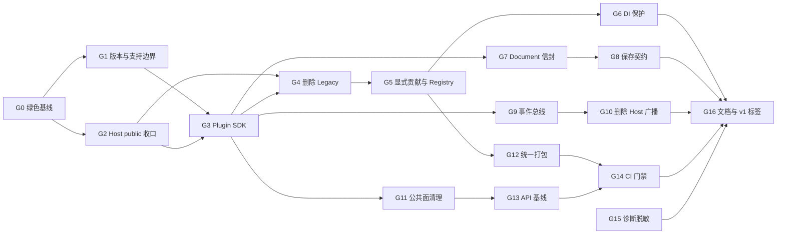

# MyAvaloniaManagement Managed Plugin v1 封板评审与整改任务书

> 状态：待整改，不满足封板条件
> 审计日期：2026-08-15
> 审计基线：`dev-重构-2026年8月13日` 分支，提交 `8beaab2`
> 整改进度：G0、G1 已于 2026-08-15 完成；G2–G16 待完成
> 适用范围：`MyAvaloniaManagement` 宿主、`MyAvaloniaManagementCommon`、插件装载与注册边界、Document/Tool 公共契约和发布门禁
> 不评审：现有插件的领域业务正确性、第三方插件市场、运行时热卸载和恶意插件隔离

## 1. 目的与封板结论

本文用于回答一个具体问题：在后续主要转入插件开发之前，主程序还需要完成哪些工作，删除哪些历史或占位能力，并建立哪些兼容规则，才能把宿主认定为可长期演进的 **Managed Plugin v1**。

结论是：当前宿主已经有较完整的插件运行骨架，G0 已恢复解决方案绿色基线，G1 也已冻结支持边界、版本线和 v1 数据根，但 **尚不能封板**。主要问题不是 Dock、Document Scope 或插件隔离没有实现，而是公共面仍未真正收口：Host 内部实现被意外纳入 public API，Document 宿主信封没有版本，消息总线泄漏第三方抽象，Legacy 激活和静态服务定位仍在，插件部署与兼容门禁也没有形成单一发布入口。

本次封板采用以下一次性定基线策略：

- 只支持实现正式模块契约、携带严格清单和 `.deps.json` 的 Managed Plugin；
- 不再兼容仓库外的 Legacy 二进制插件；
- 不迁移预发布阶段产生的宿主或插件业务数据；
- 旧数据只保留，不自动移动、改写或删除；
- v1 默认使用 `%LOCALAPPDATA%\MyAvaloniaManagement\v1\` 作为新的宿主数据根目录；
- 设置 `MYAVALONIA_DATA_DIRECTORY` 时，该值仍表示完整数据根目录，不再额外拼接 `v1`，以保持自动化测试隔离语义；
- 运行时热更新、插件沙箱和第三方市场不属于 v1 封板目标。

### 1.1 什么叫“达到封板标准”

只有在本文 G0–G16 全部完成后，才能创建 Managed Plugin v1 基线标签。优先级的含义如下：

- **阻断**：完成前不得冻结 SDK public API；
- **高**：完成前不得创建 v1 Release Candidate；
- **收尾**：完成前不得创建正式 v1 标签；
- **明确延后**：不影响 v1 封板，未来必须通过新 schema、SDK 次版本或主版本演进。

封板不是“当前功能能运行”，而是同时满足：公共契约最小且明确、落盘格式可识别、破坏性变化可检测、插件包可重复构建、失败可诊断、升级和回退边界有文档与自动化证据。

## 2. 当前基线与验证证据

### 2.1 已经具备、应继续保留的能力

以下能力已有代码、测试或格式文档支持，不应在封板重构中推倒重做：

| 能力 | 当前事实 | 封板处理 |
| --- | --- | --- |
| 插件清单 | `plugin.manifest.json` 严格解析，包含 schema、插件身份、入口和 Host/Common 左闭右开兼容区间 | 保留严格模式；未来扩展提升 manifest schema，不预留空字段 |
| 插件加载隔离 | 每插件目录独立 `PluginLoadContext`，共享契约来自默认上下文，私有托管依赖按插件解析 | 保留；删除 Legacy 回退后进一步简化 |
| 稳定身份 | `PluginId`、`DocumentTypeId`、`ToolTypeId`、`CreationIntentId` 已强类型化并校验 | 保留主 ID 与已发布别名；禁止重新使用历史 ID |
| Document Scope | 每个 Managed Document 使用独立 DI Scope，关闭后取消 `ClosingToken` 并释放资源 | 保留，并纳入 SDK 回归门禁 |
| 保存与关闭 | 主文件原子提交、恢复备份、脏状态、关闭确认和坏文件恢复已形成 V1 行为 | 保留事务语义；只重做宿主信封与插件内容的版本边界 |
| Dock 布局 | 四向 ToolDock、隐藏/固定、禁用浮动、V1 快照、校验、隔离和迁移已有实现 | 保留格式与迁移测试；本次不实现缺失插件的部分恢复 |
| 外观和诊断格式 | `appearance-v1.json` 与诊断 JSON Lines 已有整数 schema | 保留 schema；诊断内容需要脱敏 |
| 生命周期 | 初始化、反向关闭、超时、依赖图、失败和阻塞状态已实现并测试 | 保留 `IPluginLifecycleDependencies`，它不是空契约 |
| 组合验证 | 根容器启用 `ValidateScopes` 与 `ValidateOnBuild`，重复 ID 与元数据冲突可阻断启动 | 保留，并增加宿主核心服务覆盖保护 |

### 2.2 G0 绿色基线恢复

2026-08-15 执行：

```powershell
dotnet test Host/MyAvaloniaManagement.Tests/MyAvaloniaManagement.Tests.csproj `
  -c Release -p:SkipPluginDeploy=true --no-restore
```

结果为宿主单元测试 **105/105 通过**。

随后执行：

```powershell
dotnet build MyAvaloniaManagement.sln `
  -c Release -p:SkipPluginDeploy=true --no-restore --nologo
```

初始结果为 **0 警告、2 错误**，解决方案无法构建：

1. `MyAvaloniaManagement.PluginTests` 中的 `ExcelGetUrlGeneratorTests.FixedFileDialogService` 未实现 `IExcelFileDialogService.PickOutputTextFileAsync(string, CancellationToken)`；
2. `MyAvaloniaManagement.UiTests` 中的 `ExcelGetUrlGeneratorViewTests.EmptyDialogService` 未实现同一方法。

继续检查还发现，同一提交中的插件测试仍读取已经不存在的 `OutputText`，Headless UI 测试也仍断言旧按钮文案和旧输出控件形态。这些都属于测试消费者没有同步当前生产契约。

G0 已于 2026-08-15 完成。最终执行锁定还原、解决方案 Release 构建和带 Windows Smoke 的综合门禁，结果为 **0 警告、0 错误**，Unit 105、UI 32、Plugin 112，共 **249/249 通过**；Host 行覆盖率 76.86%、分支覆盖率 63.65%。详细根因、SOLID 取舍、失败过程和可重放命令见 [G0 绿色基线恢复记录](../plan-history/host-v1/g0-green-baseline.md)。测试数量是时间点证据，后续继续从 TRX 和 `summary.json` 动态读取。

### 2.3 当前风险清单

| 等级 | 发现 | 影响 |
| --- | --- | --- |
| 高 | `DocumentSaveData` 没有宿主 `schemaVersion`，插件用自由格式 `PluginMetadata` 记录内容版本 | 宿主升级后无法可靠区分信封版本、插件版本和业务内容版本 |
| 高 | Host 窗口、ViewModel、加载器、服务定位器、工厂和内部模型大量为 public | 普通内部重构会被误判为插件 API 破坏，或反过来意外锁死实现 |
| 高 | API 门禁只有一个 SHA256 | 只能知道“变了”，不能审阅删除了哪个类型、改了哪个签名，也不能区分兼容新增 |
| 高 | `IMessengerService` 暴露 `IMessenger`，生产实现使用 `WeakReferenceMessenger.Default` | SDK 被 CommunityToolkit 具体 API 绑定，不同 HostRuntime 和测试可能共享全局状态 |
| 高 | Legacy 无模块激活、公共无参策略和无 `.deps.json` 回退仍存在 | 同一宿主同时维护两套所有权、依赖注入和错误语义 |
| 高 | 插件可直接修改完整 `IServiceCollection` | 可信插件仍可能误覆盖宿主核心服务，错误直到运行期才暴露 |
| 高 | ViewLocator 通过静态构造、AppDomain 和命名约定重复发现视图 | 贡献来源不明确，异常被吞掉或只写控制台，难以形成确定性注册表 |
| 高 | 诊断记录默认使用 `Exception.ToString()` | 可能把路径、URL、插件异常正文或其他敏感上下文写入长期日志 |
| 中 | Common 引用了整套 Avalonia/Dock 主题和控件包 | 放大共享程序集闭包和插件协同升级面，增加版本冲突概率 |
| 中 | 四个插件分别维护部署 Target | 共享依赖排除、入口、清单和原生资产规则可能漂移 |
| 中 | 仓库没有统一 CI 工作流 | 本地曾通过的门禁不能保证每次提交和干净环境都执行 |
| 低 | `AdditionalData`、未实际传入的初始化字段、未使用 Behavior 和空 `Chain` 项 | 在 v1 public API 中制造无语义兼容负担 |

## 3. v1 契约和版本模型

### 3.1 六条版本线必须分开

| 版本线 | 所有者 | 用途 | 升级规则 |
| --- | --- | --- | --- |
| 产品版本 | Host 发布包 | 用户可见功能、安装包和发布说明 | 按产品发布节奏使用 SemVer |
| Plugin SDK 版本 | `MyAvaloniaManagementCommon` 的正式 SDK 包 | 插件编译时 public API 和共享程序集身份 | 兼容新增提升次版本；删除、改签名或改变已承诺语义提升主版本 |
| 插件版本 | 每个插件 | 插件自身发布、诊断和包追踪 | 与插件入口程序集/包元数据一致，不充当数据格式版本 |
| manifest schema | Host 插件加载器 | 解释 `plugin.manifest.json` 的结构 | 整数版本；结构变化创建新 schema reader |
| 宿主持久化 schema | Host | Document 信封、布局、外观和诊断格式 | 每种格式独立整数 schema，不共享一个全局数字 |
| 插件内容 schema | Document 或插件业务存储的拥有者 | 解释插件业务 payload | 独立整数版本；插件明确支持哪些旧版本，未知未来版本拒绝读取 |

`AssemblyVersion` 只承担 CLR 共享程序集身份和主版本兼容，不再被当成所有发布版本的唯一事实源。包版本、文件版本、信息版本和 manifest 中的兼容区间应由统一构建属性生成或校验，不能在多个项目文件和 JSON 中手工复制。

### 3.2 消息是否需要 Version 字段

普通进程内强类型消息 **不统一增加 `Version` 字段**，原因如下：

- 消息不会跨重启保存；
- 发送方与接收方已经处于同一个、完成 SDK 兼容检查的进程；
- 一个没有迁移或分派行为的 `Version` 只是装饰字段，不能自动提供兼容；
- 破坏消息语义时应创建新消息类型，或提升 Plugin SDK 主版本；
- 插件内部消息由插件自行拥有，不进入 Host SDK 兼容承诺。

只有跨进程、入队、落盘或需要旧消费者读取的消息信封才必须有 `schemaVersion`。如果未来引入 Worker 进程，应单独设计带消息类型、schema、关联 ID 和 payload 的传输信封，不能复用当前内存事件对象。

### 3.3 Document 信封 v1

正式信封由宿主创建，最低字段固定为：

```json
{
  "schemaVersion": 1,
  "pluginId": "myavalonia.plugin.sample",
  "documentTypeId": "myavalonia.plugin.sample.document.report",
  "contentSchemaVersion": 1,
  "title": "示例文档",
  "savedAtUtc": "2026-08-15T00:00:00+00:00",
  "payload": "{...插件拥有的业务内容...}"
}
```

约束如下：

- `schemaVersion` 由宿主解释；只支持明确注册的版本；
- `pluginId` 用于校验 Document 类型的所有权和缺失插件诊断；
- `contentSchemaVersion` 由对应插件解释，不等于插件发布版本；
- `title`、`savedAtUtc`、路径和原子事务由宿主拥有；
- `savedAtUtc` 使用 `DateTimeOffset.UtcNow`；
- `payload` 是插件唯一拥有的业务部分；
- 删除当前自由格式 `PluginMetadata`；
- 未知宿主 schema、未知未来内容 schema、所有权不匹配或损坏 payload 都只能返回脱敏错误，不得改写原文件；
- 当前预发布 Document 格式没有迁移器。v1 reader 不猜测旧字段，也不读取旧数据目录。

### 3.4 新数据根目录与回退

生产默认路径改为：

```text
%LOCALAPPDATA%\MyAvaloniaManagement\v1\
```

宿主的布局、外观、诊断和未来宿主级设置都从该目录解析。旧版位于父目录的文件保持原样。插件拥有的数据库、凭据和缓存不由宿主擅自迁移；每个准备进入 v1 发布包的插件必须选择新的 v1 业务数据根或明确将自身 schema 重置为 v1，并通过其发布验收证明不会误读预发布数据。

回退旧版本时，旧程序仍读取原目录；新版不自动清理旧目录。发布说明必须告诉用户两个目录的位置和手工备份方式。

## 4. public API 的保留、删除与降级原则

### 4.1 应保留为 Plugin SDK public 契约

- `PluginId`、`DocumentTypeId`、`ToolTypeId`、`CreationIntentId` 及稳定 ID 校验；
- Managed Plugin 模块入口和受控注册扩展；
- Document/Tool 创建策略或其 v1 替代接口；
- `IDocumentScopeFactory` 和 `IDocumentLifetime`；
- `IDocumentCreationIntentProvider` 及创建意图元数据；
- `ISavableDocument`、`IDocumentSaveState` 的 v1 替代版本；
- `IPluginLifecycle`、`IPluginLifecycleDependencies` 和生命周期状态模型；
- `IWindowContentFullscreenHost`，因为 MySmallTools 有真实生产消费者；
- SDK 自有的事件总线接口，不暴露 CommunityToolkit 类型。

### 4.2 应从 public API 删除或改为 internal

- `AssemblyLoaderHelper`、`PluginLoadContext`、`PluginModuleCatalog`、`PluginStrategyActivator`；
- `ManagementFactory`、`PluginMenuService`、`DocumentScopeManager` 的具体实现类型；
- Host 的 ViewModel、内部 Model、消息类型、常量类和服务注册扩展；
- 静态 `ServiceProvider`；
- 仅供测试调用的 `Program.BuildAvaloniaApp()` 等入口，改由 `InternalsVisibleTo` 或专用测试引导器访问；
- public 无参 ViewModel 构造；
- Legacy 无模块策略激活及相关 public Facade；
- `DocumentCreationParams.AdditionalData`；
- 没有任何真实输入来源的 `InitializationData`；
- 没有生产实现且宿主恢复注册表已经覆盖其职责的 `IDocumentSavePathPolicy`；
- 未被任何 XAML 或代码引用的 `HandledEventsAwareBehavior`；
- Common 项目中的空 `Chain` 项目项。

Avalonia XAML 或源生成确实要求 public 的 `App`、窗口和 View 可以保持 public，但它们不属于 Plugin SDK，也不纳入 SDK 兼容承诺。

### 4.3 不能因为抛异常就删除的方法

实现上游接口所必需的方法不是“未实现契约”。例如 `IValueConverter.ConvertBack` 即使单向转换不支持反向转换，也必须保留签名并明确抛 `NotSupportedException`。测试替身中为验证失败分支而故意抛出的异常同样不属于生产占位代码。

`IPluginLifecycleDependencies` 当前没有真实插件声明依赖，但生命周期管理器、拓扑排序、阻塞状态和测试已经完整实现，且它解决的是明确的插件启动依赖问题，因此保留。判断标准是“契约有没有完整行为和已批准场景”，而不是“当前有几个生产实现”。

## 5. 独立整改包

每个任务应独立提交。除明确依赖外，不允许在一个任务中顺带修改其他 public 契约。所有任务都必须提供变更前失败证据、变更后命令结果和可逆的单提交边界。

### G0：恢复绿色基线

**优先级：阻断；依赖：无**

**状态：已完成（2026-08-15）**。验收结果为解决方案 Release 构建 0 警告、0 错误，三套测试 249/249 通过，Host 行覆盖率 76.86%、分支覆盖率 63.65%，Windows Smoke 通过。完整记录见 [G0 绿色基线恢复记录](../plan-history/host-v1/g0-green-baseline.md)。

- 目标：补齐两个 `IExcelFileDialogService` 测试替身，恢复解决方案 Release 构建和宿主三套测试。
- 修改边界：只修改对应测试文件，不借机改变生产接口或 Excel 工具行为。
- 验收：解决方案 Release 构建零错误零警告；Unit、Plugin、UI 三套宿主测试全部通过。
- 验收命令：`dotnet build MyAvaloniaManagement.sln -c Release -p:SkipPluginDeploy=true`，随后依次对三个 Host 测试项目执行 `dotnet test -c Release -p:SkipPluginDeploy=true --no-build`。
- 完成定义：测试总数从 TRX 读取并在报告中汇总；不再把手写的 238 当成永久事实。
- 回滚：单独回滚该测试修复应重新出现同一编译错误，不影响其他整改包。

### G1：冻结 v1 支持边界与版本线

**优先级：阻断；依赖：G0**

**状态：已完成（2026-08-15）**。产品、Host API、Plugin SDK、插件、manifest 和数据根代际已建立集中事实与交叉校验；默认宿主数据根已切换到 `v1`，完整门禁 258/258 通过。详细设计、SOLID 取舍和验证证据见 [G1 支持边界与版本线冻结记录](../plan-history/host-v1/g1-support-boundary-and-version-lines.md)。

- 目标：将本文第 1、3 节转成正式发布政策和集中构建版本属性。
- 修改边界：产品/SDK/插件/manifest/宿主持久化/插件内容六条版本线；新的默认数据根目录。
- 验收：程序集、包、清单和欢迎页版本均来自可追踪的构建属性；版本不一致会使构建或包验证失败。
- 验收命令：新增并执行 `dotnet test Host/MyAvaloniaManagement.PluginTests/MyAvaloniaManagement.PluginTests.csproj -c Release --filter FullyQualifiedName~VersionPolicy`。
- 完成定义：可信模型、操作系统、更新方式和数据重置规则在 README、兼容文档和发布说明中一致。
- 回滚：恢复旧数据根不会删除 v1 目录；两套版本均可读取各自目录。

### G2：将 Host 实现移出插件 API

**优先级：阻断；依赖：G0**

- 目标：插件只引用 Plugin SDK，不引用 Host 可执行程序集的实现类型。
- 修改边界：Host 类型可见性、测试访问入口、静态服务定位器和无参 ViewModel 构造。
- 实施要求：生产对象全部由 `HostRuntime` 的构造注入路径创建；设计器使用显式设计时数据，不调用生产 Service Locator。
- 验收：四个插件生产项目不存在对 Host 项目的引用；仓库测试或 Harness 需要访问 internal 时使用明确的 friend assembly 或测试引导器。
- 验收命令：`dotnet build MyAvaloniaManagement.sln -c Release`，并执行 `rg -n "MyAvaloniaManagement.csproj|ServiceProvider\." Plugins Host/MyAvaloniaManagement -g "*.csproj" -g "*.cs"` 人工确认只剩获准的 Host 组合根引用。
- 完成定义：Host public 类型清单只剩框架要求入口；Plugin SDK public 基线不包含 Host ViewModel、窗口、加载器或工厂。

### G3：形成正式 Plugin SDK

**优先级：阻断；依赖：G1、G2**

- 目标：把 `MyAvaloniaManagementCommon` 收口为唯一插件编译契约并生成可验证的 SDK 包。
- 修改边界：包元数据、XML 文档、依赖闭包和 public API。
- 删除候选：Common 中未使用的字体、主题、Ursa、Semi、Dock 主题和 Dock 控件包；只保留契约实际编译所需依赖。
- 验收：从本地产生的 SDK 包可在临时目录中编译最小插件；包依赖图不携带无关主题和宿主实现。
- 验收命令：`dotnet pack Host/MyAvaloniaManagementCommon/MyAvaloniaManagementCommon.csproj -c Release`，随后运行本任务新增的 `scripts/Test-PluginSdkPackage.ps1`。
- 完成定义：仓库插件可以继续在开发期使用统一属性，但发布兼容测试必须针对打包后的 SDK，而不是只靠 ProjectReference。

### G4：删除 Legacy 二进制插件路径

**优先级：阻断；依赖：G2、G3**

- 目标：宿主只保留一套 Managed Plugin 所有权、DI 和错误语义。
- 修改边界：无模块程序集发现、公共无参策略要求、无 `.deps.json` 入口回退、Legacy 加载 Facade 和对应测试。
- 保留边界：Document/Tool 的历史稳定 ID 别名、布局 V1 迁移和旧浮动状态归一化继续保留；这些是数据兼容，不是二进制插件兼容。
- 验收：缺少模块、清单或 `.deps.json` 的插件在执行入口代码前被隔离，并给出稳定错误码。
- 验收命令：执行 `dotnet test Host/MyAvaloniaManagement.PluginTests/MyAvaloniaManagement.PluginTests.csproj -c Release --filter FullyQualifiedName~ManagedOnly`，并通过现有布局迁移测试证明数据兼容未被删除。
- 完成定义：快速开始和测试夹具只展示 Managed 模型，不再称 Legacy 为长期兼容能力。

### G5：显式注册扩展贡献并建立 Plugin Registry

**优先级：阻断；依赖：G3、G4**

- 目标：Document、Tool、View 和生命周期均由插件模块显式注册，清单是插件身份唯一事实源。
- 修改边界：模块注册 API、HostExtensionRegistry、ViewLocator 和生命周期归属解析。
- 实施要求：提供 SDK 注册扩展，例如注册 Document 策略、Tool 策略、View 映射和生命周期；宿主不再通过 AppDomain 或名称替换猜测贡献。
- Registry 至少保存：清单描述、入口程序集、状态、Document/Tool/View 贡献、生命周期和诊断摘要。
- 验收：未显式注册的策略或 View 不会被激活；重复贡献在 UI 启动前形成确定性诊断；View 创建异常进入统一诊断而非被静默吞掉。
- 验收命令：执行 `dotnet test Host/MyAvaloniaManagement.PluginTests/MyAvaloniaManagement.PluginTests.csproj -c Release --filter FullyQualifiedName~ExplicitContribution` 和 `dotnet test Host/MyAvaloniaManagement.UiTests/MyAvaloniaManagement.UiTests.csproj -c Release --filter FullyQualifiedName~ViewRegistration`。
- 完成定义：插件程序集只扫描一次，后续菜单、Dock、View 和状态页读取同一不可变注册快照。

### G6：保护宿主 DI

**优先级：阻断；依赖：G5**

- 目标：允许插件注册自己的服务，但阻止插件误替换宿主核心服务。
- 修改边界：模块服务注册编排和诊断策略。
- 实施要求：每个模块调用前后记录 `IServiceCollection` 差异；禁止删除或覆盖 Host 核心服务、SDK 基础服务、Plugin Registry、文档生命周期和诊断服务。
- 验收：正常插件私有 singleton/scoped/transient 注册不受影响；覆盖宿主服务的夹具在容器构建前失败并定位到具体插件。
- 验收命令：执行 `dotnet test Host/MyAvaloniaManagement.PluginTests/MyAvaloniaManagement.PluginTests.csproj -c Release --filter FullyQualifiedName~PluginServiceProtection`。
- 完成定义：违规注册不会留下部分可用的根容器，宿主显示统一启动错误页。

### G7：建立 Document 信封 v1

**优先级：阻断；依赖：G3**

- 目标：实现本文第 3.3 节的宿主信封，并删除 `PluginMetadata`。
- 修改边界：`DocumentSaveData`、序列化器、Document 打开/保存和各可保存插件的适配。
- 验收：序列化字段、大小与深度约束、严格 schema、UTC 时间、插件所有权和 Document 类型校验都有测试。
- 验收命令：执行 `dotnet test Host/MyAvaloniaManagement.Tests/MyAvaloniaManagement.Tests.csproj -c Release --filter FullyQualifiedName~DocumentEnvelopeV1`。
- 完成定义：宿主而非插件填充标题、时间、插件身份和文档类型；插件只返回内容版本和 payload。
- 回滚：旧预发布文件不被自动改写，失败打开不会生成新版本覆盖原件。

### G8：重构保存契约与内容版本处理

**优先级：阻断；依赖：G7**

- 目标：插件只负责不可变业务快照和内容恢复，宿主继续独占路径、原子事务、备份和关闭提交点。
- 修改边界：`ISavableDocument`、内容快照 DTO、各插件实现和恢复测试。
- 实施要求：快照创建不得改变路径、标题或脏状态；未知内容版本通过稳定 `DocumentLoadException` 拒绝；未来需要迁移时由插件显式读取旧版本并输出当前版本。
- 验收：当前版本往返、未知未来版本、损坏内容、主文件失败、备份失败和恢复另存全部覆盖。
- 验收命令：执行 `dotnet test Host/MyAvaloniaManagement.Tests/MyAvaloniaManagement.Tests.csproj -c Release --filter FullyQualifiedName~DocumentPersistence`，再执行四个插件各自的 Document 内容 schema 测试。
- 完成定义：插件发布版本改变但内容 schema 不变时，旧文档仍可读取；内容 schema 改变时有独立测试和发布说明。

### G9：收口 SDK 事件总线

**优先级：高；依赖：G3**

- 目标：事件 API 不泄漏 CommunityToolkit 类型，也不依赖进程全局单例。
- 修改边界：用 SDK 自有事件接口替换 `IMessengerService.Messenger`；每个 `HostRuntime` 创建独立总线实例。
- 实施要求：订阅返回 `IDisposable` 或等价令牌；Document 订阅由 Scope 跟踪并在关闭时释放；发送和处理失败有明确策略。
- 验收：两个 HostRuntime 互不收到对方事件；关闭 Document 后不再接收事件；测试并行执行不依赖全局 Reset。
- 验收命令：执行 `dotnet test Host/MyAvaloniaManagement.Tests/MyAvaloniaManagement.Tests.csproj -c Release --filter FullyQualifiedName~HostEventBus` 和 Document Scope 释放测试。
- 完成定义：Plugin SDK public API 中没有 `CommunityToolkit.Mvvm.Messaging.IMessenger`。

### G10：删除 Host 内部广播消息

**优先级：高；依赖：G9**

- 目标：将文件打开、布局刷新和 Tool 显隐改为直接的宿主协调器或窄服务调用。
- 修改边界：`OpenFileMessage`、`UpdateLayoutMessage`、`ToolVisibilityChangedMessage` 及发送/接收方。
- 验收：文件树打开文件、Tool 隐藏恢复、布局更新和主窗口命令行为不变；Host 内部不再通过公共事件类型绕行。
- 验收命令：运行 `dotnet test Host/MyAvaloniaManagement.Tests/MyAvaloniaManagement.Tests.csproj -c Release --filter "FullyQualifiedName~MainWindowViewModelTests|FullyQualifiedName~ToolViewModelTests"`，并确认 `rg -n "OpenFileMessage|UpdateLayoutMessage|ToolVisibilityChangedMessage" Host` 无结果。
- 完成定义：跨插件事件必须有真实跨插件消费者才可进入 SDK；BiliDownloader 等插件内部消息继续留在插件程序集。
- 版本规则：内存消息不加统一 `Version`；破坏语义时创建新类型或提升 SDK 主版本。

### G11：删除低价值 public 面和占位代码

**优先级：高；依赖：G3**

- 目标：在 v1 基线前删除没有语义、没有调用方或已被宿主内部机制替代的契约。
- 删除清单：`AdditionalData`、无真实输入的 `InitializationData`、`IDocumentSavePathPolicy`、未使用 Behavior、空 `Chain` 项、Legacy 文案和只为旧无参构造存在的适配。
- 保留清单：生命周期依赖、创建意图、Document 关闭令牌、全屏宿主和上游接口强制成员。
- 验收：全仓引用搜索、编译器和测试共同证明删除项无消费者；单向 Converter 将 `NotImplementedException` 改为语义明确的 `NotSupportedException`，不删除接口方法。
- 验收命令：执行 `dotnet build MyAvaloniaManagement.sln -c Release`，并用 `rg` 对本节删除清单逐项确认声明和生产引用均已消失。
- 完成定义：为每个删除项在提交说明中记录“无调用方、替代机制、重新引入条件”。

### G12：统一插件构建与部署

**优先级：高；依赖：G3、G5**

- 目标：四个插件共享同一 MSBuild 打包/部署规则，只声明插件特有的托管和原生资产。
- 修改边界：统一 `.props/.targets`、清单生成或校验、共享依赖排除、`Controls/<Plugin>/` 输出布局。
- 验收：四插件在干净目录构建后均包含唯一入口、清单、`.deps.json` 和所需私有资产，不携带 Host 或重复 SDK 副本。
- 验收命令：新增并执行 `scripts/Test-ManagedPluginPackages.ps1 -Configuration Release`，脚本必须从空临时输出目录构建并校验全部四个插件。
- 完成定义：新增插件不复制现有插件的整段 Target；包验证脚本能输出机器可读清单。
- 回滚：统一 Target 可按单插件关闭部署，但不能退回四份漂移规则后仍宣称通过封板。

### G13：建立可审阅的 SDK API 兼容基线

**优先级：高；依赖：G3、G11**

- 目标：替换只输出 SHA256 的 Host/Common 全程序集指纹。
- 修改边界：只对正式 Plugin SDK 建立 public API 文本或元数据基线；Host 实现程序集不作为插件契约。
- 验收：兼容新增被标记为可接受；删除类型、收窄可见性、改参数、改返回类型和删除成员给出具体差异并阻断。
- 验收命令：新增并执行 `scripts/Test-PluginSdkCompatibility.ps1 -Baseline v1`；脚本需在测试副本中证明删除一个 public 成员时会失败并打印该成员。
- 完成定义：有意破坏必须提升 SDK 主版本、更新清单兼容区间、基线、迁移说明和样例插件验证，不能只替换一个哈希。

### G14：建立 Windows CI 与发布门禁

**优先级：高；依赖：G0、G12、G13**

- 目标：在干净 Windows x64 环境重复执行封板证据。
- 门禁顺序：锁定还原、Release 零警告构建、宿主 Unit/Plugin/UI 测试、SDK API 比较、真实插件包矩阵、Windows 窗口 Smoke。
- 实施要求：失败即停止；测试数量从结果文件计算；日志和包清单作为构建产物保存。
- 验收：同一提交连续两次干净执行结果一致；不依赖开发机已有 `Controls`、LocalAppData 或全局工具状态。
- 验收命令：本地执行 `scripts/Invoke-MyAvaloniaManagementTests.ps1 -Configuration Release -WindowsSmoke` 和 G12/G13 脚本；CI 调用完全相同的入口。
- 完成定义：合并到 v1 分支和创建发布标签都必须经过同一工作流。

### G15：诊断脱敏

**优先级：高；依赖：无，可与 G0 并行**

- 目标：默认日志不保存完整异常正文和未经验证的技术输入。
- 修改边界：`HostDiagnosticDraft` 到持久记录的转换、加载/保存错误映射和敏感扫描测试。
- 白名单字段：异常类型、稳定错误码、阶段、插件 ID、程序集简单名、经过校验的稳定 ID、受控枚举和耗时。
- 禁止字段：文档正文、密码、Cookie、Token、签名 URL、完整请求响应、未验证绝对路径、插件 `Exception.Message/StackTrace` 原文。
- 验收：构造含凭据、URL、路径和正文的异常后，内存展示与 JSON Lines 均不出现敏感值。
- 验收命令：执行 `dotnet test Host/MyAvaloniaManagement.Tests/MyAvaloniaManagement.Tests.csproj -c Release --filter FullyQualifiedName~HostDiagnostics`，再运行本任务新增的 `scripts/Test-HostDiagnosticRedaction.ps1`。
- 完成定义：调试所需原始异常只能通过显式本地开发开关进入短期、受提醒的调试输出，不能成为发布默认值。

### G16：同步文档并创建 v1 基线

**优先级：收尾；依赖：全部阻断项及 G9–G15**

- 目标：让根 README、架构、兼容契约、快速开始、测试说明和实际实现保持一致。
- 删除过期描述：保存契约尚未统一、Legacy 为并列接入方式、固定测试总数以及 Host public 实现属于插件 API等。
- 新增说明：v1 数据根、旧数据保留、SDK SemVer、Document 两层 schema、消息版本规则、插件包布局和 CI 入口。
- 验收：文档中的每个当前事实都能指向代码、测试或稳定文件格式；历史计划只标记历史状态，不改写当时证据。
- 验收命令：新增并执行 `scripts/Test-Documentation.ps1` 校验本地链接、当前类型名、命令路径和禁止的过期表述，再执行完整 Release 门禁。
- 完成定义：创建 Plugin SDK v1 API 基线、四插件兼容基线和 Managed Plugin v1 标签。

## 6. 推荐执行顺序



G0 与 G15 可以并行。G7/G8、G9/G10 和 G11 在 G3 完成后可以分别独立推进。G12 只依赖显式贡献模型，不必等待 Document 或消息重构；G14 等待打包和 API 基线稳定后再固定最终流水线。

## 7. 最终验收矩阵

### 7.1 构建与测试

- 干净工作区完成锁定还原；
- 解决方案 Release 构建零错误、零警告；
- 宿主 Unit、Plugin、Headless UI 全部通过；
- Windows x64 真实窗口通过正常 Opened/Closing 路径退出；
- 测试数量和覆盖率从当前结果文件生成，不依赖文档中的永久常量。

### 7.2 插件加载与组合

- 四个真实插件从统一生成的独立目录加载；
- 缺失、损坏、未知 schema 清单在入口代码执行前隔离；
- Host/SDK 不兼容、重复插件 ID、缺少私有依赖和共享程序集身份冲突有稳定诊断；
- 插件尝试覆盖 Host 核心服务时在容器构建前阻断；
- 未显式注册的 Document、Tool 或 View 不会通过反射偶然出现；
- 同名不同版本私有托管依赖继续进入各自加载上下文。

### 7.3 Document 与磁盘兼容

- Document 信封 v1 往返保持字段和内容一致；
- 插件发布版本变化但内容 schema 不变时仍可读取；
- 未知信封版本、未知内容版本、所有权不匹配、损坏 payload 和缺失插件不会修改原文件；
- 主文件失败不提交内存状态，备份失败只产生警告；
- 恢复副本必须另存为且不能覆盖损坏主文件或恢复备份；
- 新版只读取 v1 数据根，预发布目录保持原样。

### 7.4 生命周期与消息

- 两个 HostRuntime 的事件互不串扰；
- Document 关闭后 Scope、订阅和控件缓存均释放；
- 被取消的关闭不提前取消 `ClosingToken`；
- 插件生命周期依赖、超时、阻塞和反向关闭行为不退化；
- Plugin SDK public API 不暴露底层 `IMessenger`；
- 普通进程内消息没有无行为的版本占位字段。

### 7.5 API、包与诊断

- 使用 v1 SDK 包编译的样例插件可被当前宿主加载；
- 对 SDK 做破坏性修改时，门禁给出具体成员差异；
- 插件包不包含重复 Host/SDK 或未声明的共享依赖；
- 诊断敏感扫描不出现文档正文、凭据、签名 URL、未验证完整路径或插件异常原文；
- 所有正式门禁在 Windows CI 中使用同一脚本执行。

## 8. 明确延后

以下能力不作为 Managed Plugin v1 封板条件：

- 运行时卸载或热更新；
- 插件沙箱和恶意代码权限隔离；
- 第三方插件市场、在线安装器和自动更新器；
- 跨进程 UI 合成；
- 用户动态启停插件；
- manifest 能力/权限声明；
- 缺失插件 Document 占位页；
- 缺失插件时的布局部分恢复；
- 为没有后台职责的插件增加空生命周期；
- 给普通进程内消息统一添加 `Version` 字段。

上述需求出现真实产品场景后，应先确定所有者和兼容语义，再通过 manifest schema、Plugin SDK 次版本/主版本或独立跨进程协议实现，不能提前在 v1 契约中放置无行为的占位字段。

## 9. 封板签署清单

- [ ] G0–G16 均有独立合并记录和验证证据；
- [ ] Plugin SDK public API 基线已经生成并可读；
- [ ] 四个真实插件使用正式 SDK/打包规则构建；
- [ ] v1 数据根和旧数据保留规则已经验证；
- [ ] Document 信封与插件内容 schema 已分离；
- [ ] Legacy 二进制插件路径和静态 Service Locator 已删除；
- [ ] Host 内部类型不再被误当作 Plugin SDK；
- [ ] 消息总线不泄漏第三方接口或进程全局状态；
- [ ] Release 构建、全部宿主测试、包矩阵和 Windows Smoke 全绿；
- [ ] 诊断日志通过敏感信息扫描；
- [ ] 根 README、架构、兼容契约、快速开始和测试说明与代码一致；
- [ ] 明确延后项没有被误写为已实现能力；
- [ ] 已创建 Managed Plugin v1 发布标签和回退说明。
