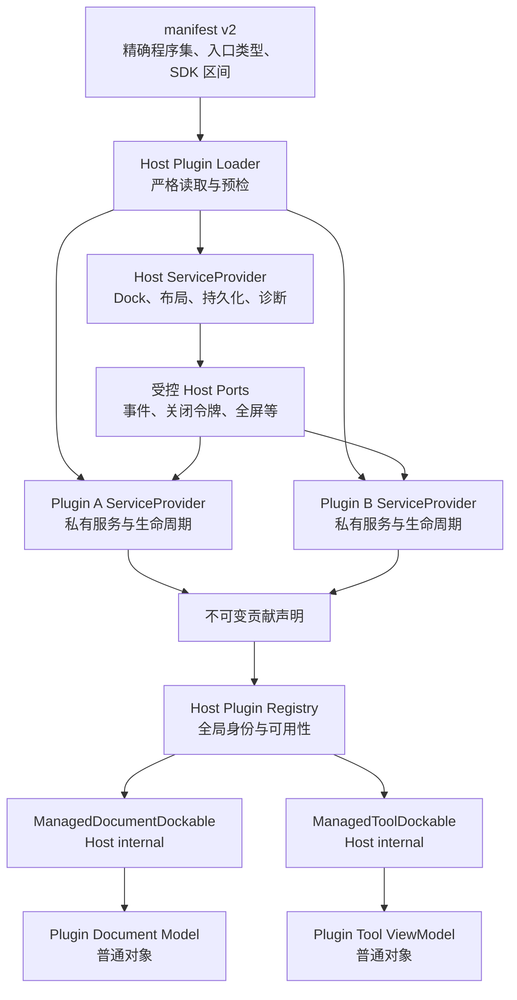

# MyAvaloniaManagement V2 破坏式架构重构评审与整改任务书

> 状态：实施中；G0–G5 已完成，G6–G14 尚未实现。
>
> 评审日期：2026-08-21。
>
> 事实基线：`dev-重构-2026年8月18日` 分支提交 `abb8c26`、Managed Plugin v1 文档与
> [V2 G0 非发布绿色基线](../plan-history/host-v2/g0-green-baseline.md)与
> [V2 G1 版本与数据边界](../plan-history/host-v2/g1-version-and-data-boundaries.md)，以及
> [V2 G2 Plugin SDK 重建](../plan-history/host-v2/g2-plugin-sdk-rebuild.md)与
> [V2 G3 manifest v2 与构建协议](../plan-history/host-v2/g3-manifest-v2-and-build-protocol.md)，以及
> [V2 G4 每插件独立容器](../plan-history/host-v2/g4-per-plugin-containers.md)与
> [V2 G5 声明式贡献目录](../plan-history/host-v2/g5-declarative-contribution-catalog.md)。
>
> 重要说明：G5 已完成最终 Core/UI 模块生产入口、声明式 Host Registry、内建 Welcome/Tool 声明和
> 两阶段冲突隔离；Dock Adapter、Document v2、layout/lifecycle v2 与四业务插件迁移仍属于 G6–G14，
> 不得引用为当前能力。

## 1. 目的与结论

本项目尚未对外发布，现有四个插件与宿主也由同一仓库、同一团队维护。因此 V2 不再以保护
Managed Plugin v1 二进制和本地数据兼容为目标，而是在当前绿色基线上进行第二次契约收敛：

- 每个插件拥有独立依赖注入容器，不再向宿主根容器追加服务；
- 宿主独占 Dock 类型和布局行为，插件只贡献普通 Document Model、Tool ViewModel 与 Avalonia View；
- Strategy、Metadata、View 映射合并为一次声明式贡献；
- 基础 Plugin SDK 不再传递 Avalonia、Dock、Newtonsoft 或 Microsoft DI；
- 生命周期计划、超时、状态机和诊断回到 Host internal 实现；
- manifest、Document、layout 和默认数据根直接建立 V2，不读取或迁移 V1。

V2 不是进程外插件系统，也不是安全沙箱。插件仍是在宿主进程中执行的可信 Managed 代码；容器隔离
解决的是对象图所有权、失败归属和演进耦合，不防御反射、原生代码、线程或恶意行为。

### 1.1 实施范围

本任务书覆盖：

- Host 启动、插件发现、组合、Registry、生命周期、Dock 与持久化；
- `MyAvaloniaManagement.PluginSdk` 和 Avalonia UI 集成包；
- Managed Plugin 构建、清单、独立 ZIP 和兼容门禁；
- MyPlugTest、DaTangAccountingHelpPlug、MySmallTools、BiliDownloader 的 V2 接入迁移；
- 当前架构、快速开始、API 基线和发布证据。

四个插件内部业务架构不在本轮重构范围。只有为解除 Host/SDK 耦合所必需的 ViewModel 基类、Scope、
readiness、生命周期和序列化适配允许修改；不得借迁移增加下载、播放、会计或工具业务功能。

### 1.2 明确不兼容的边界

- V1 SDK 编译的插件不能由 V2 Host 加载，必须重新编译并重新打包；
- manifest v1、Document envelope v1、`layout-v1.json` 和默认 `v1` 数据根不被 V2 读取；
- V1 历史 ID、`LegacyIds`、旧模块扫描和旧布局迁移不进入 V2 生产代码；
- 旧目录和文件原样保留，V2 不迁移、不覆盖、不重命名、不删除；
- 历史计划和验收证据继续保留，但必须明确标记为 V1 历史事实。

## 2. 当前基线与代码审查

### 2.1 本轮验证证据

在仓库根目录执行：

```powershell
.\scripts\Invoke-MyAvaloniaManagementTests.ps1 -Configuration Release
```

结果如下：

| 套件 | 通过 | 失败 | 跳过 |
| --- | ---: | ---: | ---: |
| Unit | 173 | 0 | 0 |
| UI | 38 | 0 | 0 |
| Plugin | 150 | 0 | 0 |
| **合计** | **361** | **0** | **0** |

Host 行覆盖率为 **81.12%**，分支覆盖率为 **66.85%**。本结果证明 V2 从绿色基线出发，
不表示本文方案已经实现，也不替代带真实窗口 Smoke 的正式发布门禁。

### 2.2 应继续保留的 V1 成果

- 严格 manifest、必需 `.deps.json`、唯一可信身份和加载前兼容检查；
- 显式贡献、不可变 Registry、全局稳定 ID 校验和结构化诊断；
- 每个 Document 独立 Scope、关闭取消、保存失败不提交和确定性释放；
- 四向 Dock、Tool 单例、隐藏恢复、Pinned 状态、禁用浮动和整体布局回退；
- 原子文件事务、资源上限、严格字段集合和默认诊断脱敏；
- 同步强类型事件、每 HostRuntime 隔离和订阅令牌所有权；
- SDK public API 文本基线、独立插件包、确定性 ZIP 和 Windows 门禁。

V2 改变实现与契约形状，但不能降低这些已验证的行为质量。

### 2.3 主要问题

| 发现 | 当前证据 | V2 判断 |
| --- | --- | --- |
| SDK 名称和职责不一致 | 项目/命名空间仍为 `MyAvaloniaManagementCommon`，包 ID 已是 `MyAvaloniaManagement.PluginSdk` | 直接统一程序集、项目和命名空间 |
| 基础 SDK 泄漏 UI/框架实现 | Common 引用 Avalonia、Dock、DI.Abstractions、Newtonsoft | Core SDK 清零这些外部依赖，UI 契约单独成包 |
| 插件共享宿主根容器 | `IPluginRegistrationContext.Services` 接收宿主注册集合的工作副本 | 每插件独立 Provider，插件注册不再触碰 Host DI |
| 防御代码替代真实所有权边界 | `HostServiceDescriptorPolicy`、`PluginServiceRegistrationTransaction` 校验删除、替换、重排和覆盖 | 删除整套保护事务；错误插件只能破坏自己的容器 |
| 贡献分三处声明 | Strategy 的 `Create*`、`GetMetadata()` 和单独 `AddView` | 合并为泛型声明式贡献，注册时一次冻结 |
| SDK 暴露 Dock | Document/Tool Strategy 直接返回 Dock `Document`/`Tool` | Host Adapter 是唯一 Dock 子类，插件模型不认识 Dock |
| 启动期执行策略才能取元数据 | Registry Builder 激活 Strategy 后调用 `GetMetadata()` | Descriptor 是无副作用数据，Provider 构建前即可校验 |
| Host 生命周期实现成为 public API | SDK 中包含 Manager、Runner、PlanBuilder、状态与诊断实现，Bili Tool 直接注入 Manager | SDK 仅保留启动/停止接口，所有编排 internal |
| 同一兼容事实重复表达 | manifest 同时声明 `hostApi` 和 `commonContract` | V2 只保留一个 SDK 左闭右开区间 |
| 模块入口依赖扫描 | manifest 只有入口 DLL，Host 再扫描唯一 `IPluginModule` | manifest v2 明确入口程序集和完整类型名 |
| 无发布历史却保留迁移面 | `LegacyIds`、Newtonsoft/STJ 双转换器、旧两向布局迁移 | V2 生产代码全部删除，不建立兼容读取器 |
| Document payload 二次编码 | 插件先生成 JSON 字符串，Host 再把它写为 JSON 字符串字段 | 内容改用克隆的 `JsonElement`，作为嵌套 JSON 写入 |

## 3. V2 目标架构



### 3.1 包和依赖方向

| 目标包 | 内容 | 允许依赖 | 禁止依赖 |
| --- | --- | --- | --- |
| `MyAvaloniaManagement.PluginSdk` | `PluginId`、事件、生命周期接口、Document 内容、Document 关闭观察 | .NET BCL、`System.Text.Json` | Avalonia、Dock、Newtonsoft、Microsoft DI、Host 实现 |
| `MyAvaloniaManagement.PluginSdk.UI` | 模块入口、私有服务注册、Document/Tool Descriptor、View 约束、全屏 UI Port | Core SDK、Avalonia、DI.Abstractions，以及宿主明确支持的 UI Profile | Dock、Host 实现、Newtonsoft |
| `MyAvaloniaManagement` | 所有 Dock Adapter、Loader、Registry、Provider、持久化、布局和诊断 | Core/UI SDK、Dock 和宿主实现依赖 | 被插件项目直接引用 |

G2 已新建 `Host/MyAvaloniaManagement.PluginSdk`，程序集和根命名空间统一为
`MyAvaloniaManagement.PluginSdk`；`PluginSdk.UI` 也已从依赖元包变成真实契约程序集，Dock 相关包已移除。
旧 Common 被移至 `Host/MyAvaloniaManagement.LegacyPluginContracts`，只保留旧程序集名和命名空间作为
不可打包的仓库内部阶段桥。G5 已迁移 Host 模块与贡献目录；四业务插件迁移仍属于 G9–G12，
Legacy 项目的最终删除属于 G13。

### 3.2 public API（G2 已建立，G5 已接入 Host 生产路径）

以下签名定义 V2 必须表达的能力。实施时可以因 C# nullable 或命名细节调整，但不得改变所有权：

```csharp
public interface IPluginModule
{
    void Configure(IPluginRegistration registration);
}

public interface IPluginRegistration
{
    PluginId PluginId { get; }
    IServiceCollection Services { get; } // 只属于当前插件

    void UseLifecycle<TLifecycle>()
        where TLifecycle : class, IPluginLifecycle;

    void AddDocument<TDocument, TView>(DocumentDescriptor descriptor)
        where TDocument : class, IPluginDocument
        where TView : Control, new();

    void AddPersistableDocument<TDocument, TView>(DocumentDescriptor descriptor)
        where TDocument : class, IPersistablePluginDocument
        where TView : Control, new();

    void AddTool<TTool, TView>(ToolDescriptor descriptor)
        where TTool : class
        where TView : Control, new();
}
```

`AddDocument` 自动把模型注册为 scoped，`AddPersistableDocument` 同时建立保存能力约束，
`AddTool` 自动把模型注册为 plugin singleton。注册 API 同时保存实现类型和 View 工厂，因而不存在
“贡献已注册但 View 漏注册”或同一精确 ViewModel 被映射两次的合法状态。

Document 契约目标为：

```csharp
public interface IPluginDocument
{
    DocumentPresentationState Presentation { get; }
    event EventHandler? PresentationChanged;
    ValueTask InitializeAsync(
        DocumentActivationContext context,
        CancellationToken cancellationToken);
}

public interface IPersistablePluginDocument : IPluginDocument
{
    bool IsDirty { get; }
    ValueTask<DocumentContent> CaptureContentAsync(
        CancellationToken cancellationToken);
    void AcceptChanges();
}

public sealed class DocumentContent
{
    public int SchemaVersion { get; }
    public JsonElement Payload { get; } // 构造时 Clone
}
```

`DocumentActivationContext` 只携带宿主已经校验的标题、可选创建意图和可选恢复内容，不携带文件路径、
Dock 对象、PluginId 或可修改的服务集合。`IDocumentLifetime` 继续作为只读关闭令牌端口，由 Host 在
每个插件 Document Scope 中提供；主动取消能力保持 internal。

`DocumentDescriptor` 固定 DocumentTypeId、显示名称、说明、菜单分类、图标和创建意图。
`ToolDescriptor` 固定 ToolTypeId、显示名称、说明、图标、默认 DockSide 和关闭策略。二者不包含
`LegacyIds`，元数据对象在注册后不可变。

### 3.3 插件容器所有权

启动顺序固定为：

1. Host 注册并构建自己的根 Provider；
2. 严格读取全部 manifest v2，验证目录、版本、程序集和入口类型；
3. 为每个插件创建新的空 `ServiceCollection`，预置允许的 Host Port；
4. 创建入口模块并调用 `Configure`，模块只能修改当前插件集合；
5. 校验声明、构建插件 Provider，并激活该插件的生命周期与 Tool 单例；
6. 汇总所有成功插件的声明，验证全局 Plugin/Document/Tool ID；
7. 冲突涉及的全部插件标为不可用，重新发布不含冲突插件的不可变 Registry；
8. 按规范 PluginId 排序，依次启动成功插件生命周期；
9. 只有生命周期成功或没有生命周期的插件贡献可以进入菜单、布局和创建流程；
10. 退出时先阻止新建，关闭/释放 Document Scope，再逆序停止生命周期，最后逆序释放插件 Provider
    和 Host Provider。

一个插件不得从其 Provider 解析另一个插件的私有类型。跨插件协作只允许通过 SDK 事件或以后单独评审的
显式公共服务契约；V2 不提供父容器回退、命名服务查找或任意 `IServiceProvider` 桥接。

### 3.4 Host Dock Adapter

`ManagedDocumentDockable` 是 Host internal Dock `Document`，持有：插件身份、贡献描述符、插件 Scope、
`IPluginDocument`、可选 `IPersistablePluginDocument` 以及 View 映射。它负责：

- 把插件 `Presentation` 投影为 Dock 标题和视觉状态；
- 在初始化和恢复完全成功后才发布到 DocumentDock；
- 把保存成功提交、关闭确认、ClosingToken 和 Scope Dispose 保持为一条顺序链；
- 在初始化、恢复或 View 构建失败时释放全部暂存资源，不留下半个标签。

`ManagedToolDockable` 是 Host internal Dock `Tool`，持有插件 Tool singleton 和描述符。它负责稳定 ID、
默认四向位置、显示、隐藏、Pinned、激活和禁用浮动。插件 Tool ViewModel 不再需要继承 Dock 类型，
也不能主动修改 Dock 树。

### 3.5 失败与诊断

| 失败 | V2 行为 |
| --- | --- |
| manifest/入口程序集/入口类型无效 | 隔离该插件目录，不执行模块代码 |
| 模块 Configure 或插件 Provider 构建失败 | 释放该插件临时资源，记录稳定诊断，其他插件继续 |
| 插件内重复贡献或类型不满足泛型约束 | 当前插件不可用，不发布任何部分贡献 |
| 跨插件稳定 ID 冲突 | 所有冲突插件不可用；Host 与无冲突插件继续启动 |
| 生命周期启动失败或超时 | 插件贡献不激活；状态 Tool 显示受控错误，Host 继续 |
| Document 初始化/恢复失败 | 不发布 Adapter，取消并释放该 Document Scope |
| 布局引用缺失或不可用插件 | 隔离整个布局快照并使用默认布局，不做部分恢复 |

诊断继续使用白名单字段和固定错误码。插件异常正文、路径、URL、payload 和凭据不得进入 UI、JSONL
或默认 Trace/stderr；现有显式敏感调试开关边界不因 V2 放宽。

## 4. V2 磁盘和版本契约

### 4.1 manifest v2

最终线格式固定为严格五字段根对象：

```json
{
  "schemaVersion": 2,
  "pluginId": "myavalonia.plugin.example",
  "pluginVersion": "2.0.0",
  "entryPoint": {
    "assembly": "Example.Plugin.dll",
    "type": "Example.Plugin.ExamplePluginModule"
  },
  "sdk": {
    "minInclusive": "2.0.0",
    "maxExclusive": "3.0.0"
  }
}
```

- 拒绝未知/重复/缺失字段、注释、尾随逗号、绝对路径和非规范入口类型名；
- `entryPoint.type` 必须是入口程序集中的非抽象、非泛型、public `IPluginModule` 实现；
- 不扫描第二个模块，不从程序集名推导入口类型，不回退 manifest v1；
- 插件程序集版本必须与 `pluginVersion` 精确一致；
- `sdk` 同时约束 Core/UI 同版本线，删除 `hostApi` 和 `commonContract`。

统一构建属性改为 `ManagedPluginSdkMinInclusive`、`ManagedPluginSdkMaxExclusive` 和
`ManagedPluginEntryType`；删除 V1 Host/Common 兼容属性。构建必须在打包前验证入口类型并生成严格清单。

### 4.2 Document envelope v2

Document 文件继续建议使用 `.mamdoc`，但 V2 只接受以下严格结构：

```json
{
  "schemaVersion": 2,
  "pluginId": "myavalonia.plugin.example",
  "documentTypeId": "myavalonia.plugin.example.document.sample",
  "title": "示例",
  "savedAtUtc": "2026-08-21T00:00:00.0000000+00:00",
  "content": {
    "schemaVersion": 1,
    "payload": {
      "example": true
    }
  }
}
```

Host 仍拥有 PluginId、DocumentTypeId、标题、UTC 时间、路径和原子事务；插件只拥有 content schema 和
任意 JSON payload。`DocumentContent` 构造时克隆 `JsonElement`，防止底层 `JsonDocument` 释放或插件
后续修改产生悬空状态。继续保留 8 MiB 和最大 JSON 深度 8 的边界、严格字段集合、保存成功后提交、
坏文件不创建 Document、主文件原子替换和备份警告语义。reader 直接拒绝 schemaVersion 1。

### 4.3 layout v2

- 文件名固定为 `layout-v2.json`；默认位置为 `%LOCALAPPDATA%\MyAvaloniaManagement\v2\`；
- 根结构继续只含 `schemaVersion`、`panes`、`tools`、`activeToolId`，不保存 Document 或业务状态；
- 删除 `DockFloatingBoundsV1`、兼容浮动读取和两向到四向 Migrator；V2 Tool 条目不允许浮动字段；
- Left/Right/Top/Bottom、可见、Pinned、隐藏、顺序、比例和活动 Tool 语义保持；
- 缺失插件、未知 ID、重复顺序、非法比例或未知字段时整体隔离并回退默认布局；
- 不读取 `layout-v1.json`，不识别 `Files`、旧 GUID 或历史 Tool ID。

设置 `MYAVALONIA_DATA_DIRECTORY` 时，其值继续表示完整数据根，`layout-v2.json` 和诊断目录直接位于
该目录下，不再追加 `v2`。这条规则服务测试与部署隔离，不是 V1 数据兼容承诺。

### 4.4 独立版本线

V2 初始基线统一从 2 开始，但所有者仍然独立：产品 `2.0.0`、SDK `2.0.0`、四插件 `2.0.0`、
manifest schema 2、Document envelope 2、layout schema 2、默认数据根 `v2`。以后只有真正发生变化的
所有者提升版本；不得用产品版本代替 SDK 或磁盘 schema。

Host 不再向插件提供可引用的 public 实现程序集，因此删除 Host API 二进制兼容版本线。

## 5. public 删除清单

| 删除项 | V2 替代 |
| --- | --- |
| `IDocumentCreationStrategy` | 声明式 `AddDocument`/`AddPersistableDocument` |
| `IToolCreationStrategy` | 声明式 `AddTool` |
| `IDocumentCreationIntentProvider` | `DocumentDescriptor.CreationIntents` |
| `DocumentCreationMenuEntry` | Host internal 菜单投影 |
| `IDocumentScopeFactory` | Host internal Adapter 创建插件 Scope |
| 独立 `AddView<TViewModel,TView>` | Document/Tool 注册同时绑定 View |
| Metadata 的 `LegacyIds` | 无替代；V2 只接受主 ID |
| public Newtonsoft/STJ ID Converter | Host DTO 显式读写 `.Value` |
| public `PluginLifecycleManager` 及状态/注册 DTO | Host internal lifecycle coordinator/state store |
| `IPluginLifecycleDependencies` 和 `Order` | 无替代；V2 按 PluginId 确定性启动 |
| `ISavableDocument`、`IDocumentSaveState`、字符串 `DocumentContentSnapshot` | `IPersistablePluginDocument`、`DocumentContent(JsonElement)` |
| Common 项目名和命名空间 | `MyAvaloniaManagement.PluginSdk` |
| manifest Host/Common 双区间 | 单一 SDK 区间 |

只有出现真实生产消费者、明确所有权和无法由现有窄契约表达的需求时，才允许在 V2 封板后重新引入能力；
不得为“以后可能有用”保留转发类型、Obsolete 成员或双轨 reader。

## 6. G0–G14 独立整改包

每个 G 包必须记录：目标、删除或新增、插件影响、专项验证、完整回归和回滚边界。实施过程中可以在
功能分支保留短生命周期编译脚手架，但每个 G 验收点必须只有一套生产事实；G14 前不得残留 V1/V2 双栈。

### G0：冻结绿色基线（已完成）

- **目标**：保存 361/361、覆盖率、解决方案包图、SDK 243 条 Shipped API 和四插件包事实。
- **变更**：在 [G0 专项记录](../plan-history/host-v2/g0-green-baseline.md) 中增加 V2 删除面清单、
  目标依赖白名单和当前消费者矩阵；未改生产行为。
- **插件影响**：无。
- **验证**：Release 零警告构建、三套 Host 测试、四插件测试、诊断脱敏、SDK/API/包门禁和文档门禁。
- **本阶段排除**：Windows Smoke、Windows CI、G14 发布门禁、发布验收、联网/真实媒体、上传和发布；
  这些排除项不改变 G14 最终封板时的发布验收责任。
- **回滚**：仅删除新增证据；不得改写 V1 历史基线。

### G1：建立 V2 版本与数据边界（已完成）

- **目标**：集中声明产品、SDK、四插件和三种 schema 的 V2 初始事实。
- **删除/新增**：删除独立 Host API 版本事实；增加 V2 目标 schema/文件名、V2 数据根和 V1 默认根拒绝测试。
- **插件影响**：四插件版本与兼容属性切换为 V2，但尚不发布产物。
- **验证**：版本政策测试证明各版本线独立、默认根为 v2、环境覆盖不追加 v2、V1 默认根文件不被读取。
- **回滚**：整体回到 G0；禁止在同一数据根混写 V1/V2。

G1 没有把现有 V1 结构仅改写 `schemaVersion` 后冒充 V2。manifest、Document envelope 与 layout 的
格式级 V1 拒绝和最终线格式仍分别由 G3、G7、G8 一次建立；当前 V1 reader 与 `layout-v1.json` 只是
未发布分支继续编译和回归所需的阶段桥，不属于 V2 最终契约。完整证据见
[G1 专项记录](../plan-history/host-v2/g1-version-and-data-boundaries.md)。

### G2：重建 Plugin SDK（已完成）

- **目标**：形成 Core/UI 两层真实程序集和 V2 public API 基线。
- **删除/新增**：重命名 Common；Core 移除 Avalonia/Dock/Newtonsoft/DI；UI 增加注册与 Descriptor 契约。
- **插件影响**：先提供编译夹具，不要求业务插件在本 G 完成迁移。
- **验证**：依赖白名单、API Analyzer、临时 NuGet 消费、旧 API 编译失败和新最小插件编译成功。
- **回滚**：删除 V2 包项目并回到 G1；不得把 V2 类型塞回 Common 形成混合程序集。

G2 的实现、API 清单、Legacy 阶段桥、SOLID 取舍和非发布门禁证据见
[G2 专项记录](../plan-history/host-v2/g2-plugin-sdk-rebuild.md)。本阶段没有实现 manifest v2、独立插件容器、
Host Registry、Dock Adapter 或 Document v2，也没有运行 Windows Smoke、Windows CI 或发布门禁。

### G3：建立 manifest v2 与构建协议（已完成）

- **目标**：精确入口类型和单一 SDK 区间成为执行插件代码前的唯一事实。
- **删除/新增**：删除唯一模块扫描和 Host/Common 兼容字段；构建生成五字段严格 manifest v2。
- **插件影响**：四插件项目声明 `ManagedPluginEntryType` 和 SDK 区间。
- **验证**：未知字段、入口路径、入口类型、程序集版本、SDK 区间、v1 清单和双模块负例；确定性 ZIP。
- **回滚**：回到 G2 的 V2 编译包，不保留生产 loader 双 reader。

G3 的严格格式、SOLID 所有权、Legacy 阶段桥、构建探针、失败语义和非发布门禁证据见
[G3 专项记录](../plan-history/host-v2/g3-manifest-v2-and-build-protocol.md)。本阶段没有迁移独立容器、
声明式贡献、Dock、Document 或 layout，也没有运行 Windows Smoke、Windows CI、ReleaseAcceptance
或任何发布门禁。

### G4：实现每插件独立容器（已完成）

- **目标**：Host、每个插件和每个 Document 的对象所有权可独立说明与释放。
- **删除/新增**：增加 plugin provider owner；删除服务描述符 Policy、Transaction 和旁路检测。
- **插件影响**：插件继续使用完整 Microsoft DI 注册私有服务，但不能解析其他插件私有服务。
- **验证**：Host 注册不可变、插件间不可解析、开放泛型/keyed/multi-registration 可用、失败隔离、反向 Dispose。
- **回滚**：整体回到 G3；禁止临时回接 Host 根 `IServiceCollection`。

G4 已由 `PluginProviderOwner` 建立“Host Provider 先构建、每插件从空 `ServiceCollection` 建立私有
Provider、按规范 PluginId 构建并逆序释放”的唯一生产路径。`DocumentScopeRegistry` 只负责把 Dock
关闭通知路由到实际拥有 Scope 的插件容器；旧 `HostServiceDescriptorPolicy`、
`PluginServiceRegistrationTransaction` 和贡献旁路扫描已删除。模块配置、Provider 构建和模块构造失败
只隔离所属插件。完整 SOLID 取舍、Legacy 阶段桥、专项门禁和非发布回归证据见
[G4 专项记录](../plan-history/host-v2/g4-per-plugin-containers.md)。本阶段没有实现 G5 声明式贡献、
G6 Dock Adapter、G7 Document v2 或 G8 layout/lifecycle v2，也没有运行 Windows CI、Smoke 或发布门禁。

### G5：建立声明式贡献目录（已完成）

- **目标**：注册时一次冻结身份、元数据、实现、生命周期和 View。
- **删除/新增**：增加 Descriptor 和不可变 Registry；删除 Strategy、GetMetadata、Intent Provider 和独立 AddView。
- **插件影响**：先以测试夹具和 Host 内建 Welcome/Tool 贡献完成新 API 验证。
- **验证**：元数据无启动副作用、泛型约束、重复 ID、View 冲突、跨插件冲突隔离和失败不发布。
- **回滚**：回到 G4 的容器骨架；不得恢复反射发现贡献。

G5 的生产模块预检与组合已切换到最终 UI SDK `IPluginModule`。`PluginRegistration` 在模块返回后同时
封闭贡献方法和私有服务集合；插件局部 Builder 先完成所有者、重复 ID、模型映射和生命周期校验，
Provider 可构建后才导入全局 Builder。全局冲突按所有者整体排除，Host 内建贡献优先，无冲突插件继续
发布；未接受 Provider 立即释放且不登记 Document Scope。`PluginRegistry` 只保存不可变事实，模型创建
由 internal Activator 按所有者路由。Welcome、文件树、插件菜单、工具管理与插件状态均来自该目录。
完整设计、测试和阶段边界见
[G5 专项记录](../plan-history/host-v2/g5-declarative-contribution-catalog.md)。G5 未实现 G6 Dock Adapter、
G7 Document v2、G8 生命周期编排，也未迁移四个业务插件；未运行 Windows CI、Smoke 或发布门禁。

### G6：实现 Host Dock Adapter

- **目标**：只有 Host internal 类型继承 Dock `Document`/`Tool`。
- **删除/新增**：增加两个 Adapter 与统一 View Locator；删除插件 Dock 对象创建路径。
- **插件影响**：测试插件改用普通模型，真实插件留到 G9–G12。
- **验证**：四向 Dock、Tool 单例、隐藏/恢复、Pinned、禁浮动、标题投影、View 构建失败释放。
- **回滚**：回到 G5，不允许插件和 Adapter 同时拥有同一 Dock 项。

### G7：建立 Document V2

- **目标**：创建、恢复、保存、关闭和 Scope 释放只存在一条 V2 流程。
- **删除/新增**：增加 ActivationContext、异步初始化和 JsonElement 内容；删除 v1 信封与字符串快照生产路径。
- **插件影响**：可保存插件模型实现 `IPersistablePluginDocument`；文件路径继续只由 Host 拥有。
- **验证**：新建/打开、8 MiB/深度、严格字段、v1 拒绝、初始化失败、并发查重、原子保存、关闭取消和释放顺序。
- **回滚**：恢复 G6 无持久化 Adapter；不得对用户文件做降级写回。

### G8：建立布局与生命周期 V2

- **目标**：删除 V1 迁移，并把插件可用性和生命周期实现完全移入 Host。
- **删除/新增**：增加 layout-v2、internal lifecycle coordinator/read model；删除 Migrator、public Manager/状态和顺序接口。
- **插件影响**：有生命周期的插件只实现 Start/Stop；Tool 不再读取 Host Manager。
- **验证**：布局严格读写与整体回退、生命周期失败/超时、贡献门控、反向停止、状态 Tool 和脱敏诊断。
- **回滚**：回到 G7 默认布局和无生命周期激活；不得重新读 layout-v1。

### G9：迁移 MyPlugTest

- **目标**：用最小插件打通 Document、Tool、View、事件、Scope 和打包全链路。
- **删除/新增**：删除全部 Strategy/Dock 基类；模块改为声明式贡献。
- **插件影响**：示例代码成为 V2 快速开始的事实源，不增加示例业务。
- **验证**：多 Document 隔离、Tool 单例、事件订阅释放、最终 ZIP 加载和 UI 测试。
- **回滚**：移除 V2 MyPlugTest 包；Host V2 不加载旧包。

### G10：迁移 DaTangAccountingHelpPlug

- **目标**：证明多 Document、文件交互和 scoped 业务服务可在私有 Provider 中运行。
- **删除/新增**：ViewModel 脱离 Dock；保存和窗口端口接入 V2 契约。
- **插件影响**：计算、匹配、Excel 读写和业务 DTO 不重构。
- **验证**：插件完整单元测试、Document Scope、文件取消边界、两类 Document UI 和最终包加载。
- **回滚**：回到最后一个 V1 插件提交；不制作兼容适配包。

### G11：迁移 MySmallTools

- **目标**：验证原生播放器、Document 关闭令牌、全屏 UI Port 和资源释放。
- **删除/新增**：播放器/媒体库/加解密 Document 改为普通模型；全屏端口移入 UI SDK。
- **插件影响**：SECVID03、LibVLC、媒体库和批处理语义保持，不升级业务格式。
- **验证**：插件完整测试、真实媒体 Harness、原生资源释放、全屏恢复、关闭取消、稳定性和最终包加载。
- **回滚**：回到 V1 MySmallTools 源码；V2 Host 不加载其 V1 ZIP。

### G12：迁移 BiliDownloader

- **目标**：验证大型对象图、后台生命周期、数据库、下载 Tool 和内容 Document。
- **删除/新增**：Tool 不再注入 Host `PluginLifecycleManager`；增加插件内部 readiness 状态，由 lifecycle 更新、Tool 读取。
- **插件影响**：下载、认证、SQLite、FFmpeg、限速和内容来源业务保持。
- **验证**：插件完整测试、生命周期失败/恢复、后台关闭、Document Scope、Tool readiness、发布验收和最终包加载。
- **回滚**：回到 V1 BiliDownloader 源码；不得为旧 Manager 增加 V2 facade。

### G13：删除 V1 生产面

- **目标**：最终生产代码、项目和脚本中只剩 V2。
- **删除/新增**：删除旧 API、Converters、LegacyIds、manifest/layout/document reader、旧构建属性、双轨夹具和无消费者转发。
- **插件影响**：四插件只能引用 V2 Core/UI 包；旧 API 编译负例成为门禁。
- **验证**：源码/二进制扫描、依赖白名单、V2 API 基线、四插件完整测试和包矩阵。
- **回滚**：回滚整个 G13 提交；禁止选择性恢复单个兼容类型。

### G14：V2 封板

- **目标**：把实现、文档、测试和可复现制品签署为同一 V2 基线。
- **删除/新增**：更新当前架构、快速开始、SDK 指南、布局/Document 参考和根 README；历史 V1 文档加“已取代”说明但不改写证据。
- **插件影响**：四插件形成各自 2.0.0 确定性 ZIP 和兼容签署。
- **验证**：两轮隔离 Release 门禁、零警告、全部测试、覆盖率、诊断扫描、API/包、Windows Smoke 和文档门禁。
- **回滚**：以 V2 基线提交为整体回滚单位；不读取或恢复用户 V1 数据。

## 7. 执行顺序与合并纪律

```text
G0 → G1 → G2 → G3 → G4 → G5 → G6 → G7 → G8
                                      ↓
                     G9 → G10 → G11 → G12 → G13 → G14
```

- G0–G3 先固定版本、包和加载边界；未完成前不得实现容器或 UI 双轨；
- G4–G8 先用 Host 内建贡献和测试插件形成完整 V2 Host；
- G9–G12 按复杂度从低到高迁移真实插件，每个插件独立复跑；
- G13 只负责删除和证明没有残留，不承载新架构设计；
- G14 只封板已经通过的事实，不在发布门禁阶段追加功能或重写契约。

每个 G 的生产构建、专项测试和受影响插件测试必须绿色后才能进入下一个 G。不得通过降低覆盖率、
跳过测试、放宽严格 reader 或保留静默 fallback 获得阶段通过。

## 8. 最终验收矩阵

### 8.1 构建、API 与依赖

- 全解决方案 Release `-warnaserror` 构建通过；
- Core SDK 不引用 Avalonia、Dock、Newtonsoft、DI 或 Host；UI SDK 不引用 Dock、Newtonsoft 或 Host；
- Host 自有实现类型仍为零导出；V2 public API Shipped/Unshipped 基线和变异门禁通过；
- 旧 V1 API、命名空间、manifest 字段和构建属性编译/加载失败；
- 四个插件只引用 V2 SDK，并分别生成可复现 ZIP。

### 8.2 容器与插件组合

- 插件私有服务不能被 Host 或其他插件解析；插件注册不能改变 Host 描述符；
- 模块、Provider、贡献和生命周期失败只隔离所属插件；
- 跨插件稳定 ID 冲突拒绝全部冲突插件，但 Host 与无冲突插件可用；
- Document Scope、Tool singleton、插件 Provider 和 Host Provider 的创建/释放顺序有自动化证明；
- 不存在 V1/V2 双 loader、父容器回退、反射贡献扫描或运行期注册。

### 8.3 Document、Tool 与布局

- Document 新建、打开、异步初始化、恢复、保存、另存、关闭和失败回滚全部通过；
- JsonElement payload 精确线格式、资源上限、UTC、所有权、未知字段和 v1 拒绝通过；
- Tool 单例、Left/Right/Top/Bottom、隐藏、恢复、Pinned、活动状态和禁用浮动通过；
- layout-v2 严格读写、损坏隔离、插件缺失整体回退和 layout-v1 拒绝通过；
- 插件生产代码不继承 Dock `Document`/`Tool`，Dock 只存在于 Host 与 Host 测试。

### 8.4 生命周期、诊断与真实运行

- 无生命周期、正常启动、启动失败、超时、逆序停止和退出释放通过；
- BiliDownloader readiness 不依赖 Host lifecycle implementation；
- 默认诊断和 UI 不包含异常正文、路径、URL、payload 或凭据；
- Headless UI、四插件完整测试、专项 Harness 和 Windows 真实窗口 Smoke 全部通过；
- 现有覆盖率门槛不得降低；G14 记录新的 V2 实际覆盖率和关键文件基线。

### 8.5 文档与发布

- 根 README 和文档导航区分“当前实现”“V2 候选任务书”“V1 历史记录”；
- 快速开始可从空项目构建一个 V2 Document、Tool 和最终 ZIP；
- manifest、Document、layout 和版本参考与最终代码逐字段一致；
- 两轮隔离发布产物在忽略时间、耗时和绝对路径后完全一致；
- 只有以上矩阵全部通过后，才允许把本文状态改为“G0–G14 已完成”并建立 V2 源码基线。

## 9. 明确延后

- 运行期热加载、热卸载或可回收 ALC；
- 进程外插件、权限模型、恶意代码沙箱或第三方插件市场；
- 插件动态启停、在线安装、自动更新和版本回滚 UI；
- 跨插件任意服务解析、共享数据库或分布式事件；
- 缺失插件时的部分布局恢复或未知 Tool 占位；
- V1 数据导入工具。若未来确有用户数据需要导入，应作为宿主外独立、显式、一次性的离线工具评审，
  不得把兼容 reader 重新塞入 V2 Host 启动路径。

## 10. 最终签署清单

V2 只有在以下问题全部回答“是”后才算完成：

1. 是否只有 Host 类型依赖 Dock，四个插件生产代码均已解耦？
2. 是否每个插件有独立 Provider，且没有 Host 根服务保护事务？
3. 是否所有贡献通过 Descriptor 一次声明，没有 Strategy/GetMetadata/AddView 三轨？
4. 是否 Core/UI SDK 依赖边界和 public API 基线已由门禁保护？
5. 是否 manifest、Document、layout 和默认数据根只支持 V2？
6. 是否 public 生命周期实现已移回 Host，Bili Tool 不再依赖 Host Manager？
7. 是否四插件完整回归、确定性 ZIP、最终加载和 Windows Smoke 全部通过？
8. 是否覆盖率门槛未降低，诊断脱敏和失败原子性未退化？
9. 是否历史 V1 文档仍可追溯，但不会被误读为当前 V2 契约？
10. 是否生产代码和发布包中不存在 V1/V2 双栈、兼容 shim 或隐藏 fallback？

任何一项为“否”，本文都只能保持候选任务书状态，不能宣称 V2 已封板。
