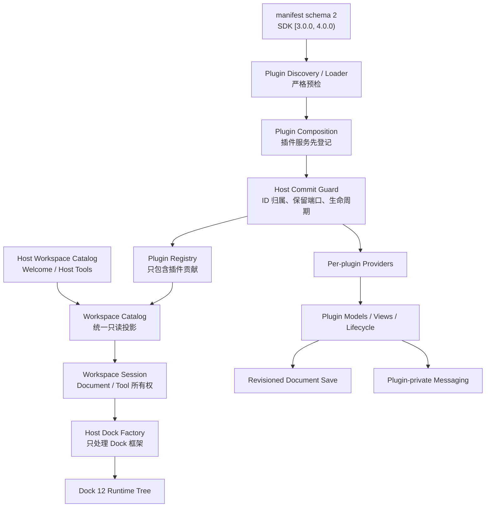

# MyAvaloniaManagement V3 破坏式架构重构评审与整改任务书

> 状态：实施中；G0–G8 已完成，G9–G14 尚未实施。Document 保存已采用 V3 G2 修订协议，
> Document 激活已采用 V3 G3 互斥 New/Restore 类型，插件注册已采用 V3 G4 Host 最终提交与 ID 归属校验；
> 插件事件通信已采用 V3 G5 私有消息器；Dock Factory、Workspace Session 与 Tool 只读投影已按 V3 G6
> 分离；Host Catalog 与 Plugin Registry 已按 V3 G7 分离；全屏租约与 Host V3 骨架已按 V3 G8
> 完成；其余生产语义仍由 V2 G14 签署，
> 代码与程序集版本线处于未发布 V3。
>
> 评审日期：2026-08-22。
>
> 事实基线：[Managed Plugin V2 破坏式架构重构任务书](./host-v2-breaking-refactor-plan.md)、
> [V2 G14 封板记录](../plan-history/host-v2/g14-v2-sealing.md)、
> [V3 G0 非发布绿色基线](../plan-history/host-v3/g0-green-baseline.md)、
> [V3 G1 版本与数据边界](../plan-history/host-v3/g1-version-and-data-boundaries.md)、
> [V3 G2 修订化 Document 保存](../plan-history/host-v3/g2-revisioned-document-save.md)、
> [V3 G3 互斥 Document 激活](../plan-history/host-v3/g3-exclusive-document-activation.md)、
> [V3 G4 插件注册所有权](../plan-history/host-v3/g4-plugin-registration-ownership.md)、
> [V3 G5 插件私有消息](../plan-history/host-v3/g5-plugin-private-messaging.md)、
> [V3 G6 Workspace Session 与 Dock Factory](../plan-history/host-v3/g6-workspace-session-and-dock-factory.md)、
> [V3 G7 Host Catalog 与 Plugin Registry](../plan-history/host-v3/g7-host-catalog-and-plugin-registry.md)、
> [V3 G8 全屏租约与 Host V3 骨架](../plan-history/host-v3/g8-fullscreen-lease-and-host-v3-skeleton.md)、
> [宿主—插件架构评审](./host-plugin-architecture-review.md)及当前 `main`/工作分支代码。
>
> 计划性质：V3 是一次“协议语义纠错 + 宿主工作区解耦”的破坏式重构，不是第三次插件框架扩张。
> 本文只定义目标、阶段、删除面、门禁和回滚边界；每个 G 的实际提交、测试数量、覆盖率和制品摘要
> 必须在实施时写入 `docs/plan-history/host-v3/`，不得预填或沿用 V2 数字。

## 1. 目的与结论

Managed Plugin V2 已经解决了插件独立 Provider、声明式贡献、Host Dock Adapter、Document/Layout、
生命周期、诊断和发布制品的主要所有权问题。V3 不再重做这些已经成立的基础，而只处理当前代码中仍然
具有高收益的语义缺口：

- G2 前可持久化 Document 使用无版本确认；G2 已以指定修订确认消除捕获后编辑被错误清脏的竞争；
- G3 前的 `DocumentActivationContext` 可以同时携带创建意图和恢复内容；G3 已以两个密封输入类型删除该非法组合；
- 根级 `IHostEventBus` 的生产消费者实际都在插件内部，公共名称与真实所有权不一致；
- 插件可通过原始 `IServiceCollection` 影子注册 Host 保留端口或贡献模型，Host 无法保证最终解析语义；
- Contribution ID 虽然实际遵循插件命名空间，但 Registry 没有强制验证其归属；
- `ManagementFactory` 同时承担 Dock 框架适配、工作区会话、Document 所有权、Tool 操作和退出释放；
- Host Welcome/Tool 被作为特殊插件贡献注册，导致 Provider 路由、冲突策略和可用性存在 Host 特判；
- 全屏端口使用 `TryPresent`/`TryRestore` 和任意 `object owner` 成对调用，恢复责任容易遗漏；
- `Files`、`Plug` 等 Dock Locator 兼容别名仍存在于生产和 Harness，和 V2 “只保留规范 ID”的目标不一致。

V3 的最终结论固定为：

1. **保存确认必须绑定插件捕获时的内容修订号**，Host 只能确认已写入的那个版本；
2. **Document 新建与恢复使用互斥输入类型**，不再用多个可空字段表达状态；
3. **插件内部消息回到插件内部**，Host SDK 不再提供无真实跨插件语义的通用总线；
4. **Host 保留端口和贡献生命周期由 Host 最后提交**，插件仍可使用 Microsoft DI，但不能覆盖协议底座；
5. **Dock Framework Adapter 与 Host Workspace Session 分离**，ViewModel 不读取 Dock 树或 Factory 私有状态；
6. **Host 内建 UI 与插件 Registry 分开组合**，统一展示不等于伪造同一所有者；
7. **破坏代码契约不自动破坏用户数据**。manifest、Document envelope、layout 和数据根只有在线格式
   实际变化时才提升版本。

V3 仍然是同一进程内、同一团队维护、可信 Managed Plugin 模型。它不提供恶意代码隔离、权限系统、
热卸载、第三方市场或跨进程 UI。

### 1.1 实施范围

本任务书覆盖：

- `MyAvaloniaManagement.PluginSdk` 与 `MyAvaloniaManagement.PluginSdk.UI` 的 V3 public API；
- Host 的插件组合、保留端口提交、Contribution ID 归属和不可变 Registry；
- Document 激活、修订化保存确认、关闭与 Scope 释放链；
- Host Dock Framework Adapter、Workspace Session、Tool 只读投影和布局接入；
- Host Welcome/Tool 与插件贡献的最终组合边界；
- MyPlugTest、DaTangAccountingHelpPlug、MySmallTools、BiliDownloader 的 V3 迁移和独立验收；
- API 基线、构建协议、确定性插件包、Windows Smoke、文档和两轮发布门禁。

四个插件的下载、播放、加解密、会计和工具业务功能不在本轮范围。只允许修改为满足 V3 SDK、消息
所有权、保存修订、激活输入、全屏租约和测试隔离所必需的代码；不得借 V3 增加新的业务功能。

### 1.2 设计纪律

- 按变化原因拆分职责，不按文件行数机械拆类；
- 优先删除错误所有权，不用新 Facade、Manager 或事件再次包住旧结构；
- 保留 Microsoft DI、现有 Dock 库、严格 JSON 和原子文件事务，不替换成熟基础设施；
- internal 类型默认使用具体类协作；只有存在两个生产实现或明确测试边界时才增加接口；
- 每个 G 只建立一项可验收事实，不在封板阶段追加功能；
- 破坏性是允许手段，不是目标。能够保持正确数据兼容时，不得为了版本整齐主动丢弃数据。

### 1.3 明确不兼容的边界

- V2 SDK 编译的插件不由 V3 Host 加载；四个插件必须重新编译、重新打包并声明 SDK `[3.0.0, 4.0.0)`；
- V3 删除旧 `IHostEventBus`、无修订保存确认、可空组合激活上下文和成对全屏 owner API；
- `Files`、`Plug` Locator 别名不再属于生产行为，Harness 和测试必须使用规范 Dock ID 或工作区入口；
- 插件注册 Host 保留端口、覆盖贡献模型生命周期或声明不属于自身命名空间的 Contribution ID 会被拒绝；
- 不提供 V2/V3 双 SDK loader、运行时适配器、Obsolete 转发类型或静默 fallback；
- V2 API 文本与历史文档继续保留用于审计，但不参与 V3 编译、加载或打包。

以下磁盘事实默认保持兼容，不属于本节破坏面：manifest schema 2、Document envelope schema 2、
`layout-v2.json` 和默认数据根 `v2`。只有对应 G 提供独立格式变更理由、迁移/拒绝策略和专项证据时，
才允许改变其中任意一项。

## 2. 当前基线与代码审查

### 2.1 G0 基线冻结结果

V3 G0 已在一次性本地干净提交 `c5d65a61772350a01d5bb63515e07e3068ba75c8` 上执行并保存：

```powershell
./scripts/Invoke-MyAvaloniaManagementTests.ps1 -Configuration Release
./scripts/Test-PluginSdkCompatibility.ps1 -Baseline v2 -Configuration Release
./scripts/Test-ManagedPluginPackages.ps1 -Configuration Release
./scripts/Test-HostDiagnosticRedaction.ps1
./scripts/Test-DocumentationCore.ps1
./scripts/Test-Documentation.ps1
```

完整结果见 [G0 专项记录](../plan-history/host-v3/g0-green-baseline.md)。本轮 Host Unit/UI/Plugin 为
170/53/202，共 425/425；行覆盖率 83.24%、分支覆盖率 68.98%；Core/UI v2 Shipped 为 85/46，
Unshipped 均为 0；四插件两轮确定性包和最终 Host 加载 4/4 通过。以下证据均已记录：

- Host Unit/UI/Plugin 实际测试数量、失败、跳过和耗时；
- Host 行/分支覆盖率及 V3 重点文件基线；
- Core/UI SDK v2 Shipped/Unshipped API 数量；
- 四插件版本、SDK 区间、ZIP 文件清单和确定性摘要；
- 当前解决方案包图、共享程序集白名单和源码敏感信息扫描结果；
- Windows Smoke 与完整发布门禁是否执行。本轮固定记录 `false`，没有使用历史结果代替。

### 2.2 必须保留的 V2 成果

- 严格 manifest、必需 `.deps.json`、精确入口类型和加载前 SDK 兼容检查；
- 每插件独立 Provider、插件间私有依赖隔离、无父 Provider 回退；
- 声明式 Document/Tool/Lifecycle、不可变 Registry 和冲突插件整体隔离；
- 只有 Host internal Adapter 依赖 Dock，插件贡献普通模型与 Avalonia View；
- 每 Document Scope、关闭令牌、失败不发布和确定性资源释放；
- 六字段 Document envelope、原生 `JsonElement`、8 MiB/深度限制和严格读取；
- 四向布局、Tool 单例、隐藏/恢复、Pinned、禁浮动和严格 layout v2；
- Host internal 生命周期、启动失败隔离、超时、反向停止和只读可用性投影；
- 默认诊断脱敏、稳定错误码、独立 ZIP、锁定还原、API 基线和两轮隔离发布门禁。

V3 可以改变 public C# 契约与 Host internal 协作者，但不得降低上述行为质量。

### 2.3 主要问题与 V3 判断

| 发现 | 当前证据 | V3 判断 |
| --- | --- | --- |
| 保存确认不绑定快照版本 | `DocumentSaveService` 写入后调用无参数 `AcceptChanges()`；现有插件直接清除脏状态 | 引入修订化 `DocumentSaveSnapshot`，只确认已写入修订 |
| 激活输入允许非法组合 | G3 前的 `DocumentActivationContext` 同时有可空 Intent 与 RestoredContent | 已改为 New/Restore 两种互斥输入 |
| Host 总线实际承载插件内部事件 | Host 无生产业务订阅；MyPlugTest/BiliDownloader 使用私有消息类型 | 从 SDK/Host 删除，插件注册自己的内部消息器 |
| 插件可影子注册 Host Port | Host 先预置服务，再暴露原始 `IServiceCollection` 给模块 | 插件先登记；Host 校验保留类型并最后提交端口/贡献生命周期 |
| ID 归属只是约定 | Registry 校验重复 ID，但不强制 `{PluginId}.document/tool.*` | 在插件局部 Seal 阶段拒绝越权 ID |
| Dock Facade 职责集中 | `ManagementFactory` 同时负责框架 override、布局、Document、Tool、状态与退出 | 分为 Dock Adapter 与 Workspace Session；复用现有协调器 |
| ViewModel 读取 Dock 事实 | Tool 管理模型接收 RootDock、Dock Tool 和可变字典投影 | 改为 Host internal 只读 Tool 状态投影 |
| Host 作为特殊插件 | Host Contribution 使用 `PluginRegistration`，Activator/冲突/可用性保留 Host 分支 | Host Catalog 与 Plugin Registry 分离，最终投影合并 |
| 全屏恢复依赖 owner 配对 | `TryPresent(Control, object)` 与 `TryRestore(object)` | 返回幂等 `IDisposable` 租约，释放即恢复 |
| 规范 Dock ID 未彻底收口 | `Files`/`Plug` Locator 仍由生产与 Harness 使用 | 迁移到 `DockLayoutIds.Documents`/Workspace API 后删除别名 |
| 大型静态文件包含多个变化原因 | Diagnostics、Manifest、Layout Mapper 文件较大 | 不因行数拆分；只在本轮真实改变相应策略时按职责移动 |

## 3. V3 目标架构



### 3.1 包和依赖方向

| 目标包 | V3 内容 | 允许依赖 | 禁止依赖 |
| --- | --- | --- | --- |
| `MyAvaloniaManagement.PluginSdk` | 稳定 ID、互斥 Document 激活、修订化保存、关闭观察、生命周期 | .NET BCL、`System.Text.Json` | Avalonia、Dock、Microsoft DI、Host、通用事件实现 |
| `MyAvaloniaManagement.PluginSdk.UI` | 模块/注册、Descriptor、View 约束、窗口交互、全屏租约 | Core SDK、Avalonia、DI.Abstractions、已签署 UI Profile | Dock、Host、事件总线实现 |
| `MyAvaloniaManagement` | Loader、组合保护、Registry、Workspace、Dock、布局、持久化、诊断 | Core/UI SDK、Dock、Host 实现依赖 | 被插件项目引用 |
| 各业务插件 | 私有服务、内部消息器、Document/Tool/View/Lifecycle、内容 Codec | Core/UI SDK、插件私有依赖 | Host、Dock、其他插件私有程序集 |

Core/UI 两包继续保留。V3 没有证据证明合并程序集能降低运行风险；Core 的 BCL-only 边界仍有测试和
包审阅价值。不得为了目录对称继续拆分 Host 程序集。

### 3.2 修订化 Document 保存协议

V3 public API 目标形状如下。命名可在 G2 实施时调整，但修订所有权和确认语义不得改变：

```csharp
public readonly record struct DocumentRevision(long Value);

public sealed class DocumentSaveSnapshot
{
    public DocumentSaveSnapshot(
        DocumentRevision revision,
        DocumentContent content);

    public DocumentRevision Revision { get; }
    public DocumentContent Content { get; }
}

public interface IPersistablePluginDocument : IPluginDocument
{
    bool IsDirty { get; }
    event EventHandler? IsDirtyChanged;

    ValueTask<DocumentSaveSnapshot> CaptureSaveSnapshotAsync(
        CancellationToken cancellationToken);

    void AcceptChanges(DocumentRevision savedRevision);
}
```

约束固定为：

- Revision 由插件拥有并在任何会改变持久化内容的提交后递增；
- `CaptureSaveSnapshotAsync` 必须返回同一时刻的 Content 与 Revision；
- Host 不解释、不排序也不持久化 Revision，只在主文件原子提交后把原值交还插件；
- 插件只有在当前 Revision 仍等于 `savedRevision` 时才能清除脏状态；
- 保存期间出现新修改时，磁盘提交仍成功，但 Document 必须继续保持 Dirty；
- `AcceptChanges` 异常仍属于提交后警告，不能回滚已经成功写入的主文件；
- 恢复副本的 Host `RequiresSave`、路径所有权和另存保护保持不变。

禁止通过保存期间禁用整个 UI 来掩盖协议缺陷。UI 可以按产品需要显示保存状态，但正确性必须来自修订
确认，而不是假设用户不会在异步写入期间修改。

### 3.3 互斥 Document 激活协议

V3 不再使用一个对象中的两个可空字段表达新建和恢复：

```csharp
public abstract record DocumentActivation(string Title);

public sealed record NewDocumentActivation(
    string Title,
    CreationIntentId? CreationIntentId = null)
    : DocumentActivation(Title);

public sealed record RestoreDocumentActivation(
    string Title,
    DocumentContent RestoredContent)
    : DocumentActivation(Title);

public interface IPluginDocument
{
    DocumentPresentationState Presentation { get; }
    event EventHandler? PresentationChanged;

    ValueTask InitializeAsync(
        DocumentActivation activation,
        CancellationToken cancellationToken);
}
```

Host 创建菜单只能产生 `NewDocumentActivation`，严格信封读取只能产生 `RestoreDocumentActivation`。
Creation Intent 只在 New 分支验证；Restore Content 只在 Restore 分支存在。路径、PluginId、DocumentTypeId、
Dock 和 ServiceProvider 继续不进入插件激活输入。

### 3.4 插件组合与保留端口提交

V3 继续允许插件使用完整 Microsoft DI，不创建自定义 DI DSL。组合顺序调整为：

1. 为插件创建空 `ServiceCollection` 和局部 Contribution Builder；
2. 调用一次 `IPluginModule.Configure`；
3. 立即封闭 `IPluginRegistration` 和服务集合；
4. 验证插件没有登记 Host 保留服务类型，也没有手工登记已声明的 Document/Tool/Lifecycle 根类型；
5. 验证 Document/Tool ID 分别属于 `{PluginId}.document.*` 与 `{PluginId}.tool.*`；
6. Host 按声明最后追加 Document scoped、Tool/Lifecycle singleton 和 `IDocumentLifetime`、窗口交互等端口；
7. 构建并验证插件 Provider；
8. 成功候选进入全局冲突检查，失败候选整体释放且不发布部分贡献。

`IPluginRegistration.Services` 可以继续返回标准 `IServiceCollection`，但初始集合中不再暴露可删除的 Host
端口。插件尝试注册保留类型时必须在 Provider 构建前得到稳定诊断，而不是依赖 Microsoft DI 的“最后一项
胜出”规则。开放泛型、keyed、多实现、singleton/scoped/transient 等插件私有能力必须继续可用。

Contribution ID 归属失败是当前插件的结构错误，只隔离该插件；它不升级为全局启动失败。命名空间约束
使插件无法声明 Host ID 或另一个插件的 ID，但全局重复检查仍保留为防御性门禁。

### 3.5 消息所有权

V3 从 Core SDK 删除 `IHostEventBus`，Host 删除 `HostEventBus` 及根/插件 Provider 注入。迁移原则为：

- MyPlugTest 的请求/响应示例使用插件私有消息器，仍验证跨 Document Scope 的订阅释放；
- BiliDownloader 的登录、提交、进度、状态和删除消息使用插件私有 singleton 消息器；
- 插件内部消息类型、同步/异步策略、异常和线程切换由所属插件负责；
- Host 内部继续使用直接依赖和窄定向通知，不增加新的全局 Messenger；
- V3 不提供任意跨插件事件。出现真实跨插件用例时，必须单独定义共享契约、所有者和版本策略。

### 3.6 Workspace 与 Dock 边界

最终职责划分为：

| 类型/区域 | 唯一职责 |
| --- | --- |
| `HostDockFactory : Dock.Model.Mvvm.Factory` | Dock override、Locator、框架回调、禁浮动和回调转发 |
| `WorkspaceSession` | 根 Dock、DocumentDock、已创建 Tool、已拥有 Document、创建/发布/释放和退出顺序 |
| `ToolDockCoordinator` | Tool 停靠、隐藏、恢复、Pinned 与稳定 Pane 操作；继续复用现有实现 |
| `DocumentPersistenceCoordinator` | 新建、打开、恢复、保存入口；继续复用现有用例边界 |
| `DockLayoutLifecycle` | Prepare、Apply、Save；不接管 Workspace 所有权 |
| `ToolWorkspaceReadModel` | 向 Tool 管理 ViewModel 提供不含 Dock 类型的只读状态 |

拆分后必须满足：

- `ManagementFactory` 旧类型被删除或收窄并重命名，不保留转发 Facade；
- MainWindow/Tool ViewModel 不接收 `IRootDock`、Dock `Tool`、Factory 字典或服务定位器；
- Dock Layout Mapper 可以依赖 Host internal Workspace/Dock 端口，但不得进入 Plugin SDK；
- Document 正常关闭、创建失败、恢复失败和 Host 退出仍汇入同一个幂等释放入口；
- 关闭保护、恢复登记、控件回收缓存、ClosingToken 和 Scope Dispose 的顺序不变；
- 核心关闭/持久化依赖不再使用可空构造参数制造“测试可用、生产非法”的对象图。

### 3.7 Host 内建贡献与插件 Registry

V3 G7 已将 Host Welcome 和 Host Tool 从插件 Registry 中移出：

- `HostWorkspaceCatalog` 保存 Host 内建 Document/Tool 的只读描述和工厂；
- `PluginRegistry` 只保存 manifest 已验证插件及其贡献；
- `WorkspaceCatalog` 在 Host internal 边界合并二者供菜单、Workspace 和 ViewLocator 查询；
- Host ID 使用 `myavalonia.host.*`，插件 ID 必须使用自身 `myavalonia.plugin.*` 前缀，二者不存在合法碰撞；
- `PluginContributionActivator` 不再判断 Owner 是否为 Host；它只路由插件 Provider；
- Host 内建模型由 Host Provider 直接创建，不经过插件可用性或插件生命周期状态；
- Welcome 不再被迫通过“必须同步完成的异步插件初始化”建立初始布局。

统一 Catalog 只统一读取和展示，不统一 Provider 所有权。不得新建一个能够任意解析 Host/插件服务的
公共 Workspace Context。

### 3.8 全屏租约

V3 UI SDK 的目标形状为：

```csharp
public interface IWindowContentFullscreenHost
{
    IDisposable? TryPresent(Control content);
}
```

返回 `null` 表示已有活动全屏所有者；成功返回的租约由调用者持有并幂等释放，释放即恢复原内容。
Host 在窗口关闭或内容宿主销毁时也必须使租约失效并恢复状态。插件不再传入任意 owner，不再调用独立
`TryRestore`。全屏仍是 Avalonia UI 能力，保留在 UI SDK，不进入 Core。

### 3.9 失败与诊断

| 失败 | V3 行为 |
| --- | --- |
| SDK v2 插件或不包含 3.0.0 的范围 | 在创建 ALC 前隔离该插件目录 |
| 插件注册 Host 保留端口 | 当前插件组合失败；记录稳定代码，不构建 Provider |
| Contribution ID 不属于 manifest PluginId | 当前插件组合失败，不进入全局 Registry |
| 修订无效、快照为 null 或内容捕获失败 | 本次保存失败，路径、标题、脏状态不提交 |
| 保存后 Revision 已变化 | 主文件提交成功，Document 继续 Dirty，不报告数据已全部保存 |
| New/Restore 激活类型与入口不匹配 | 不创建或不发布 Adapter，释放暂存 Scope |
| 插件私有消息处理器失败 | 由插件内部策略处理；Host 不把它伪装成 Host 总线故障 |
| Host Dock 回调或 Workspace 提交失败 | Host internal 诊断；不得留下半发布 Document/Tool |
| 全屏内容构造/切换失败 | 租约不发布或立即回滚，不改变其他 Document 所有权 |

诊断仍使用白名单、稳定错误码和受控字段。V3 可以把诊断定义按“代码目录、脱敏策略、持久化会话”移动
到不同文件，但不得为了文件变短引入规则引擎或把异常正文写入默认通道。

## 4. V3 版本与磁盘契约

### 4.1 独立版本线

V3 初始目标事实为：

| 所有者 | V2 当前值 | V3 目标 | 理由 |
| --- | --- | --- | --- |
| 产品版本 | `2.0.0` | `3.0.0` | 用户可见主版本重构 |
| Core/UI Plugin SDK | `2.0.0` | `3.0.0` | public C# 契约破坏 |
| 四插件版本 | `2.0.0` | `3.0.0` | 必须以 V3 SDK 重新编译和交付 |
| manifest schema | `2` | **保持 `2`** | 五字段线格式足以表达 SDK 3 区间 |
| Document envelope schema | `2` | **保持 `2`** | 保存修订只存在于运行时握手，不进入文件 |
| layout schema/文件名 | `2` / `layout-v2.json` | **保持不变** | 本轮不改变布局字段语义 |
| 默认数据根 generation | `v2` | **保持 `v2`** | 外观、布局、诊断线格式兼容，不复制或丢弃用户状态 |

版本集中在 `Directory.Version.props`。SDK v3 API 基线使用新的 `ApiCompatibility/v3/`，开发阶段 public API
只进入 v3 Unshipped；V2 Shipped 文本保持原样用于历史审计。G14 才允许把最终 V3 签名移入 Shipped。

### 4.2 manifest schema 2 在 V3 中继续使用

V3 插件继续生成：

```json
{
  "schemaVersion": 2,
  "pluginId": "myavalonia.plugin.example",
  "pluginVersion": "3.0.0",
  "entryPoint": {
    "assembly": "Example.Plugin.dll",
    "type": "Example.Plugin.ExamplePluginModule"
  },
  "sdk": {
    "minInclusive": "3.0.0",
    "maxExclusive": "4.0.0"
  }
}
```

严格字段、入口、版本匹配、大小限制和 deps 规则全部保持。V2 插件的 `[2.0.0, 3.0.0)` 会自然拒绝
V3 Host，不需要 manifest schema 3、双 reader 或 `apiGeneration` 新字段。

### 4.3 Document envelope schema 2 保持不变

修订号用于防止运行期保存确认竞争，不属于业务内容，也不需要跨进程持久化。Host 仍按六字段 envelope
写入 `DocumentContent(schemaVersion,payload)`；现有文件可以由 V3 Host 严格读取。各插件内容 schema
只有在业务 payload 实际改变时才独立提升，本任务书不统一提升 MyPlugTest、DaTang 或 BiliDownloader
内容 schema。

V3 必须增加“保存捕获后、主文件提交前再次编辑”的自动化负例，但不得把 Revision 写入 envelope 来
回避插件自身的修改追踪责任。

### 4.4 layout v2 与数据根保持不变

V3 继续使用 `layout-v2.json`、四向 Pane、Tool 顺序/可见/Pinned/活动状态和整体回退语义。本轮删除
`Files`/`Plug` 运行时 Locator 别名不会改变持久化 ID；规范 `Documents` 和四向 ToolDock ID 已经是
layout v2 的唯一线格式。

缺失插件的部分恢复、未知 Tool 占位和布局迁移不进入 V3。它们需要新的用户体验与合并规则，应作为
独立产品能力评审，不能夹带在 Dock internal 拆分中。

默认数据根继续为 `%LOCALAPPDATA%\MyAvaloniaManagement\v2\`。`MYAVALONIA_DATA_DIRECTORY` 仍表示
完整覆盖根，不追加 generation。产品主版本提升不等于磁盘 generation 必须同步提升。

## 5. V3 删除清单

| 删除项 | V3 替代 |
| --- | --- |
| `CaptureContentAsync` + 无参数 `AcceptChanges()` | `CaptureSaveSnapshotAsync` + `AcceptChanges(DocumentRevision)` |
| 可空组合 `DocumentActivationContext` | `NewDocumentActivation` / `RestoreDocumentActivation` |
| SDK `IHostEventBus` | 插件私有消息器；无 Host 通用替代 |
| Host `HostEventBus` 和根/插件注入 | 删除；Host internal 使用直接协调 |
| Host Port 预置后允许插件删除/覆盖 | 插件先登记，Host 校验并最后提交保留端口 |
| 手工覆盖 Document/Tool/Lifecycle 根注册 | Host 根据 Contribution 声明最后建立固定生命周期 |
| 无归属限制的全局 Contribution ID | `{PluginId}.document.*` / `{PluginId}.tool.*` 强制归属 |
| `ManagementFactory` 大 Facade | `HostDockFactory` + `WorkspaceSession` + 现有专用协调器 |
| `ToolManagementData` 中的 RootDock/Tool 字典 | 不含 Dock 类型的 Tool 只读状态投影 |
| Host `V2Owner` 伪插件激活路径 | Host Workspace Catalog 与 Host Provider |
| Registry/Activator/Availability 中的 Host Owner 特判 | 插件 Registry 只处理插件；Workspace Catalog 合并展示 |
| `TryPresent(Control, object)` / `TryRestore(object)` | `TryPresent(Control)` 返回幂等释放租约 |
| Dockable Locator `Files` / `Plug` | 规范 Dock ID 或 Workspace Session 查询 |
| 为测试保留的核心可空依赖 | 完整合法对象图或专用测试替身 |
| V2 public API 活动基线 | v3 Unshipped/Shipped；v2 文本只作历史审计 |

不得保留 Obsolete 转发、V2/V3 双实现、反射兼容调用或“若 V3 失败则回退 V2”生产分支。

## 6. G0–G14 独立整改包

每个 G 必须新建 `docs/plan-history/host-v3/gN-*.md`，记录目标、代码变化、删除面、插件影响、测试命令、
实际结果、SOLID 取舍、非发布声明和回滚边界。本文只给出计划，不预建空验收记录。

功能分支可以保留短生命周期、internal、不可打包的插件局部迁移帮助代码，但每个 G 验收点不得存在
Host 同时加载 V2/V3 SDK 的生产双栈。G9–G12 必须删除对应插件的阶段帮助代码，G13 证明零残留。

### G0：冻结 V2 绿色基线（已完成）

- **目标**：把 V2 G14 之后的真实代码、测试、覆盖率、API、包和数据行为冻结为 V3 输入。
- **生产变化**：无；只增加测试、文档门禁和 [G0 专项记录](../plan-history/host-v3/g0-green-baseline.md)。
- **证据**：实际测试数、覆盖率、SDK API、四插件包图、Git 状态和摘要均以 G0 专项记录为准，
  不沿用 V2 G14 数字。
- **新增负例**：真实保存链已确定性证明无修订 `AcceptChanges()` 会在捕获后再次编辑时错误清除 Dirty；
  测试只刻画 V2 缺陷，没有修改生产实现。
- **本阶段排除**：V3 版本提升、API 修改、数据写入、AIFLOW、Windows CI/Smoke、发布门禁和任何插件发布。
- **回滚**：只删除 G0 新增证据和复现测试；不得改写 V2 G14 历史记录。

### G1：建立 V3 版本与数据边界（已完成）

- **目标**：产品、SDK、四插件切换到未发布 V3 线，同时明确四种磁盘事实保持 V2。
- **变更**：集中设置产品/SDK/插件 3.0.0、SDK `[3.0.0, 4.0.0)` 和 API baseline v3；保留 manifest/
  envelope/layout schema 2 与数据根 v2。
- **插件影响**：四插件只改变版本和构建兼容区间，尚不宣称完成 V3 语义迁移。
- **验证**：版本政策、manifest 生成、V2 插件拒绝、V3 最小插件接受、数据根与现有 V2 文件读取测试。
- **实施记录**：版本、API 文本、磁盘兼容、SOLID 取舍与非发布门禁结果见
  [G1 专项记录](../plan-history/host-v3/g1-version-and-data-boundaries.md)。
- **回滚**：整体回到 G0；不得出现产品 3、SDK 2 或数据根被无理由复制为 v3 的混合事实。

### G2：建立修订化 Document 保存（已完成）

- **目标**：消除捕获后编辑被无参数确认清除的竞争。
- **变更**：新增 `DocumentRevision`、`DocumentSaveSnapshot`；替换保存接口与 Host SaveService 提交回调。
- **插件影响**：MyPlugTest Welcome、DaTang 银行对账、BiliDownloader Document 建立修订追踪；非持久化
  Document 不受影响。
- **验证**：捕获后修改、写入失败、写入成功无并发修改、Accept 回调异常、关闭保存、恢复另存、备份警告。
- **不变项**：envelope schema 2、内容 schema、路径/标题所有权、原子提交点和恢复保护不变。
- **实施记录**：最终 API、保存/关闭时序、三插件策略、157/157 专项测试、全量覆盖率和非发布边界见
  [G2 专项记录](../plan-history/host-v3/g2-revisioned-document-save.md)。
- **回滚**：整体回到 G1；不得保留有参/无参两个 Accept 分支。

### G3：建立互斥 Document 激活（已完成）

- **目标**：用类型结构消除 Intent/Restore 非法组合。
- **变更**：以 `NewDocumentActivation`、`RestoreDocumentActivation` 替换旧 Context；Host 创建、打开、恢复、
  Adapter Factory 和测试夹具改用穷尽分支。
- **插件影响**：四插件全部 Document 的 `InitializeAsync` 显式处理支持的激活类型；恢复 Codec 不改变。
- **验证**：无 Intent 新建、有 Intent 新建、恢复、错误分支、初始化取消、View 失败和 Scope 原子回滚。
- **实施记录**：最终 API、Host 与 11 个插件 Document 的支持矩阵、143/143 专项门禁、全量覆盖率和
  非发布边界见 [G3 专项记录](../plan-history/host-v3/g3-exclusive-document-activation.md)。
- **回滚**：整体回到 G2；不得保留同时接受旧 Context 的 overload。

### G4：收紧插件注册所有权与 ID 归属（已完成）

- **目标**：Host Port、贡献生命周期和稳定 ID 从文档约定变为可执行约束。
- **变更**：插件在空集合登记；Seal 校验保留类型与 ID；Host 最后追加端口及 Document/Tool/Lifecycle 注册。
- **插件影响**：当前四插件的规范 ID 应保持不变；删除任何手工重复根注册或 Host Port 替换。
- **验证**：删除/覆盖/多注册保留端口负例，Document 生命周期覆盖负例，越权 ID、Host ID、他插件 ID、
  合法开放泛型/keyed/多实现和 Provider 失败隔离。
- **实施记录**：最终提交时序、保留类型、四插件 ID 矩阵、58/58 专项门禁、全量覆盖率和非发布边界见
  [G4 专项记录](../plan-history/host-v3/g4-plugin-registration-ownership.md)。
- **回滚**：整体回到 G3；不能只放宽某个保留类型来让单个插件通过。

### G5：把事件通信收回插件内部（已完成）

- **目标**：公共 Host 能力与插件内部消息分开。
- **变更**：删除 SDK `IHostEventBus`、Host 实现和注入；MyPlugTest/BiliDownloader 注册独占消息器。
- **插件影响**：消息业务语义不变；订阅令牌继续随 Document Scope 或插件 Provider 释放。
- **验证**：多 Document 消息、Bili 提交/进度/登录/删除、处理器异常、订阅中再订阅、Dispose、并行 Runtime
  与插件间不可见性。
- **实施记录**：最终接口、消息拓扑、SOLID 取舍、删除面、165/165 专项测试、两个重点文件 97.72%
  行覆盖率、四插件确定性包和非发布边界见
  [G5 专项记录](../plan-history/host-v3/g5-plugin-private-messaging.md)。
- **回滚**：整体回到 G4；不得保留一个未被 Host 使用的 V3 `IHostEventBus` 转发接口。

### G6：拆分 Workspace Session 与 Dock Factory（已完成）

- **目标**：Dock 框架继承面不再同时作为应用工作区服务。
- **变更**：建立 `HostDockFactory`、`WorkspaceSession` 和无 Dock Tool ReadModel；迁移 DocumentWorkspace、
  MainWindow、Tool 管理、布局和退出入口；删除核心可空依赖。
- **插件影响**：无 public SDK 变化；插件仍只看到普通模型/View。
- **验证**：Document 创建/发布/关闭/退出、Tool 四向/隐藏/恢复/Pinned、Layout 捕获/应用、Factory 回调、
  Window 多实例测试和所有资源释放顺序。
- **删除**：`ManagementFactory` 转发 Facade、`ToolManagementData` Dock 泄漏、生产 `Files` 查询。
- **实施记录**：最终职责图、对象所有权、回调与退出时序、SOLID 取舍、441/441 专项测试、Host
  83.78% / 70.32% 覆盖率、三个重点类型 92.39% / 97.96% / 100.00% 行覆盖率和非发布边界见
  [G6 专项记录](../plan-history/host-v3/g6-workspace-session-and-dock-factory.md)。
- **回滚**：整体回到 G5；不得让两个对象同时拥有同一 Document/Tool 集合。

### G7：分离 Host Catalog 与 Plugin Registry（已完成）

- **目标**：Host 内建 UI 不再模拟插件 Provider 和插件可用性。
- **变更**：Host Welcome/Tool 进入 Host Catalog；Plugin Registry 只保留 manifest 插件；Workspace Catalog
  合并只读展示；Activator 删除 Host Owner 分支；删除 `V2Owner` 语义和 `Plug` Locator。
- **插件影响**：插件 Descriptor、Provider 和可用性语义不变。
- **验证**：Host UI 始终存在、插件全失败仍可启动、Host/插件命名空间隔离、菜单合并、View 精确映射、
  Tool 管理、插件状态和 Welcome 创建失败语义。
- **实施记录**：最终职责图、对象/Provider 所有权、同步 Host 与异步插件激活、失败回滚、SOLID 取舍、
  删除面、448/448 专项测试、Host 84.04% / 70.26% 覆盖率和非发布边界见
  [G7 专项记录](../plan-history/host-v3/g7-host-catalog-and-plugin-registry.md)。
- **回滚**：整体回到 G6；不得同时从 Host Catalog 与 Plugin Registry 发布同一 Host Tool。

### G8：建立全屏租约并完成 Host V3 骨架（已完成）

- **目标**：全屏内容恢复拥有单一、幂等、可释放的所有权令牌，并完成 G2–G7 的 Host 集成闭环。
- **变更**：全屏 API 返回租约；MainWindow 只允许一个活动租约；窗口关闭和失败路径自动回滚。
- **插件影响**：MySmallTools 播放器改为持有/释放租约，不再保存 Host owner 引用。
- **验证**：进入/退出、重复释放、第二所有者拒绝、内容构造失败、窗口关闭、Document 关闭、20 轮真实
  播放/全屏资源归零，以及完整 Host V3 专项。
- **实施记录**：租约/窗口/Document 时序、SOLID 取舍、owner API 删除面、672/672 专项测试、Host
  84.15% / 70.30% 覆盖率、关键会话 96.43% 行覆盖率、20 轮真实媒体资源与弱引用归零证据见
  [G8 专项记录](../plan-history/host-v3/g8-fullscreen-lease-and-host-v3-skeleton.md)。
- **回滚**：整体回到 G7；不得同时保留 owner API 和 lease API。

### G9：MyPlugTest V3 验收

- **目标**：用最小示例完整验证 V3 保存修订、互斥激活、私有消息和 Workspace 创建链。
- **变更**：删除 MyPlugTest 阶段帮助代码；快速开始示例切换 V3 最终 API。
- **验证**：4 Document + 1 Tool、保存期间再编辑仍 Dirty、内容 schema 1、消息订阅释放、多 Scope、UI、
  两次确定性 ZIP 和真实 V3 Host 加载。
- **回滚**：移除 MyPlugTest V3 包；V3 Host 不加载 V2 ZIP，也不增加兼容适配。

### G10：DaTangAccountingHelpPlug V3 验收

- **目标**：验证多 Document、修订保存、文件交互和 scoped 业务对象图。
- **变更**：删除 DaTang 阶段帮助代码；银行对账使用最终 Revision 协议，发票 Document 使用最终激活类型。
- **不变项**：Excel 读取、匹配、报告、业务 DTO 和内容 schema 不重构。
- **验证**：插件业务测试、保存竞争、恢复、窗口选择取消、关闭令牌、两个 Document UI、确定性 ZIP 和加载。
- **回滚**：整体回到 G9 基线；不得制作 V2/V3 双协议插件包。

### G11：MySmallTools V3 验收

- **目标**：验证四个非持久化 Document、激活类型、关闭令牌和全屏租约的真实原生资源边界。
- **变更**：删除 MySmallTools 阶段帮助代码和 owner 式全屏调用。
- **不变项**：SECVID03、LibVLC、加解密格式、媒体库和批处理业务不升级。
- **验证**：完整插件测试、真实媒体 Harness、重复全屏、关闭取消、原生句柄/流/播放器归零、确定性 ZIP。
- **回滚**：整体回到 G10 基线；不得恢复 UI SDK 旧全屏接口。

### G12：BiliDownloader V3 验收

- **目标**：验证大型对象图在 Revision、私有消息器、生命周期和 Tool readiness 下的最终行为。
- **变更**：删除 Bili 阶段帮助代码；全部内部事件使用插件私有总线；Document 使用最终保存/激活协议。
- **不变项**：下载、认证、SQLite、FFmpeg、限速、任务恢复、内容来源和 Document 内容 schema 不升级。
- **验证**：保存期间修改、消息并发、任务提交/进度/删除、Lifecycle 失败/恢复、Tool readiness、关闭、覆盖率、
  两次确定性 ZIP 和真实加载。
- **回滚**：整体回到 G11 基线；不得为旧 Host EventBus 增加插件 Facade。

### G13：删除 V2 生产面

- **目标**：生产代码、SDK、测试夹具、脚本和包中只剩最终 V3 语义。
- **删除**：第 5 节全部项目、四插件阶段帮助代码、旧 API 测试双、旧全屏 owner、Host 总线、Host 伪插件
  分支、`Files`/`Plug` Locator 和任何 V2/V3 条件编译。
- **保留**：v2 API 文本、V2 计划和验收记录作为历史；manifest/envelope/layout schema 2 作为当前兼容线格式。
- **验证**：源码/二进制负例、API v3、包依赖白名单、四插件全量、真实包矩阵、数据兼容和文档门禁。
- **回滚**：回滚整个 G13，不得选择性恢复单个 V2 类型或隐藏 fallback。

### G14：V3 封板

- **目标**：把代码、API、文档、测试和可复现制品签署为同一 V3 基线。
- **变更**：最终 V3 API 从 Unshipped 移入 Shipped；更新根 README、文档导航、架构、兼容约束、快速开始、
  SDK README、Document 保存设计和测试说明；建立 V3 发布门禁入口。
- **插件影响**：四插件分别形成 3.0.0 独立确定性 ZIP 与 manifest schema 2 / SDK 3 区间签署。
- **验证**：两个无硬链接隔离克隆中的锁定还原、Release 零警告、全部测试、覆盖率、API/包、诊断脱敏、
  V2 磁盘兼容、Windows Smoke、四插件 Harness、文档和两轮摘要比较。
- **发布限制**：门禁默认不上传、不推送标签、不访问外部账号；实际发布必须另行明确授权。
- **回滚**：以 V3 基线提交为整体回滚单位；已经由 V3 保存且线格式仍为 v2 的用户文件不得被删除或降级。

## 7. 执行顺序与合并纪律

```text
G0 → G1 → G2 → G3 → G4 → G5 → G6 → G7 → G8
                                             ↓
                    G9 → G10 → G11 → G12 → G13 → G14
```

- G0 只冻结事实，G1 只建立版本和磁盘边界，G2 已完成修订保存；
- G3 已完成互斥激活，G4 已完成插件组合所有权，G5 已完成插件私有消息边界；
- G6 已完成 Host Workspace / Dock Factory 拆分；G7 已拆分 Host Catalog，G8 已建立全屏租约资源边界；
- G9–G12 按插件逐个删除阶段帮助代码并完成真实包验收；
- G13 只删除和证明无残留，不承载新设计；
- G14 只封板已通过事实，不在发布门禁阶段调整 API；
- 每个 G 的生产构建、专项测试和受影响插件测试绿色后才能进入下一个 G；
- 不得通过降低覆盖率、放宽严格 reader、跳过真实包加载或保留 fallback 获得阶段通过；
- 任一 G 若需要改变 manifest/envelope/layout/data root，必须暂停本计划并先新增独立格式评审，不能顺手修改。

## 8. 最终验收矩阵

### 8.1 构建、API 与依赖

- 全解决方案 Release `-warnaserror` 构建通过，锁文件无意外漂移；
- Core SDK 保持 BCL-only；UI SDK 不引用 Dock、Host 或插件实现；
- V3 Core/UI API Shipped/Unshipped、成员级变异和独立 NuGet 消费门禁通过；
- V2 SDK 插件在执行代码前被 SDK 区间拒绝；不存在双 loader 或转发类型；
- 四插件只引用 V3 Core/UI SDK，并分别生成两次一致的 ZIP；
- Host 自有实现仍为 internal，不新增 public Host 实现程序集。

### 8.2 Document 与保存

- New/Restore 激活在类型层互斥，旧可空组合 API 编译失败；
- 保存无并发修改时正确清除 Dirty；捕获后修改时磁盘提交成功但仍保持 Dirty；
- 捕获失败、写入失败、Accept 失败、备份失败、取消、恢复另存和关闭保存语义均有测试；
- Host 仍独占路径、标题、envelope、原子事务和恢复保护；
- envelope schema 2 的已有 MyPlugTest/DaTang/Bili 文件可由 V3 打开，写回仍是严格 schema 2；
- Document Scope、ClosingToken、View 和插件模型在全部失败/关闭路径中确定释放。

### 8.3 插件组合与消息

- 插件不能注册或覆盖 Host 保留端口、Document/Tool/Lifecycle 根生命周期；
- 插件私有 Microsoft DI 开放泛型、keyed、多实现和普通生命周期继续可用；
- Document/Tool ID 必须属于 manifest PluginId，Host/他插件命名空间负例稳定失败；
- Plugin Registry 不包含 Host 伪插件，Activator 与 Availability 无 Host Owner 特判；
- SDK/Host 中不存在 `IHostEventBus`/`HostEventBus`；插件消息实例不能跨插件解析；
- MyPlugTest 与 BiliDownloader 的消息行为、订阅释放和并发回归通过。

### 8.4 Workspace、Dock 与 UI

- Dock Framework override 与 Workspace 所有权由不同具体类型承担；
- ViewModel 不读取 RootDock、Dock Tool、Factory 字典或任意 IServiceProvider；
- Document/Tool 创建、发布、显隐、Pinned、关闭、退出和异常回滚保持单一提交点；
- `Files`、`Plug` Locator 不存在于生产和 Harness；规范 Dock ID 全部通过；
- Host Welcome/Tool 在零插件、全插件失败和部分插件失败时仍正确建立；
- 全屏租约排他、幂等释放、窗口/Document 关闭恢复和真实媒体资源归零通过；
- layout-v2 现有快照可读取、应用和再次保存，字段与文件名不变。

### 8.5 生命周期、诊断与发布

- 无生命周期、正常启动、启动失败、超时、反向停止和退出释放保持 V2 行为；
- 默认诊断/UI/JSONL/Trace 不包含异常正文、路径、URL、payload 或凭据；
- 新增保留端口、ID 归属、Revision 和 Workspace 错误具有稳定、脱敏诊断；
- Host Unit/UI/Plugin、四插件完整测试、专项 Harness 和 Windows Smoke 全部通过；
- G0 覆盖率下限不得降低，G14 记录新的实际数字和重点类型覆盖；
- 两轮隔离发布结果在忽略时间、耗时和绝对路径后完全一致；
- 只有全部矩阵通过后，才允许把本文状态改为“G0–G14 已完成”并建立 V3 源码基线。

## 9. 明确延后

- 运行期热加载、热卸载、可回收 ALC 或插件不停机更新；
- 进程外插件、权限模型、恶意代码沙箱、插件市场和在线安装；
- 跨插件任意事件、服务发现、依赖图、共享数据库或分布式消息；
- 缺失插件时的部分布局恢复、未知 Tool 占位和布局合并策略；
- 通用 Document 内容迁移框架或自动升级所有插件内容 schema；
- MediatR、CQRS、事件溯源、通用 Repository/Unit of Work；
- 为每个 internal 协作者增加接口、抽象工厂或服务定位器；
- 因为文件较大而机械拆分类，或因为产品升 V3 而同步提升全部磁盘 schema；
- 合并 Core/UI SDK、继续拆分 Host 程序集或替换 Microsoft DI/Dock；
- V1/V2 离线数据导入工具。若出现真实用户迁移需求，应作为独立、显式、一次性工具评审。

## 10. 最终签署清单

V3 只有在以下问题全部回答“是”后才算完成：

1. [x] 保存确认绑定捕获 Revision，保存期间的新修改不会被错误清除。
2. [x] Document New/Restore 激活在 public 类型层互斥，不存在旧可空组合入口。
3. [x] SDK 和 Host 已删除通用 Host EventBus，插件内部消息由插件独占。
4. [x] Host 保留端口和贡献生命周期由 Host 最后提交，插件不能影子覆盖。
5. [x] Document/Tool ID 的 PluginId 命名空间归属由自动化强制验证。
6. [x] Dock Factory 与 Workspace Session 分离，ViewModel 不依赖 Dock 运行时对象。
7. [x] Host 内建贡献不再作为特殊插件进入 Plugin Registry 或 Availability。
8. [x] 全屏使用幂等租约，失败、关闭和重复释放都能恢复并释放资源。
9. [ ] `Files`、`Plug` 和全部 V2 public 生产入口已删除且有负例防回流。
10. [ ] manifest/envelope/layout/data root 只在有真实格式理由时变化；本轮保持的 V2 数据可由 V3 使用。
11. [ ] 四插件完整回归、确定性 ZIP、真实 Host 加载、Windows Smoke 和发布矩阵通过。
12. [ ] 覆盖率未降低，诊断脱敏、失败原子性和资源释放没有退化。
13. [ ] V3 API 已进入 Shipped，V2 历史 API/文档可追溯但不参与生产。
14. [ ] 根 README、文档导航、快速开始、架构、兼容约束和测试说明均与最终代码一致。
15. [ ] 两轮隔离发布门禁可重复，且未在无授权情况下上传、打标签或执行外部发布。

任一项未完成时，V3 都只能保持候选或开发状态，不得通过降低门禁、修改历史证据或保留隐藏兼容路径
宣称封板。
