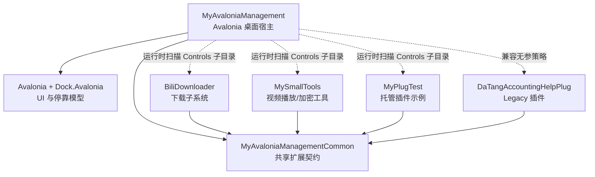
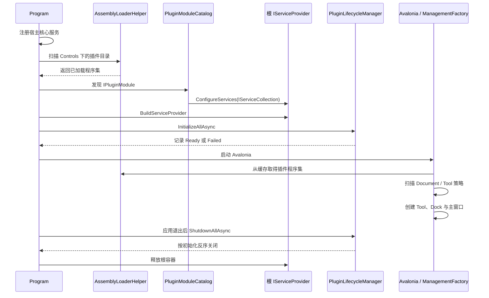
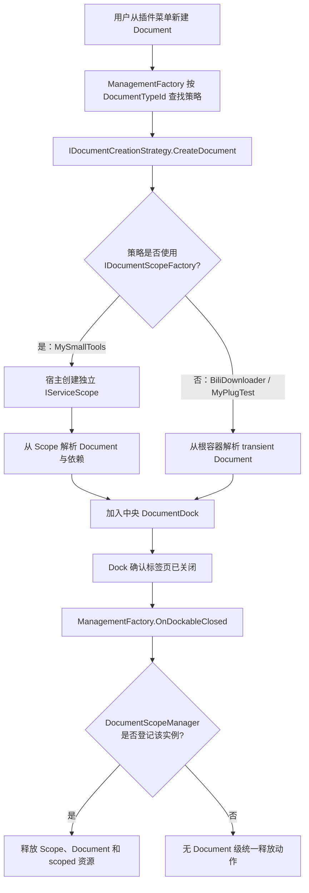
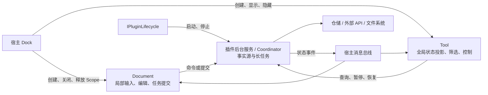
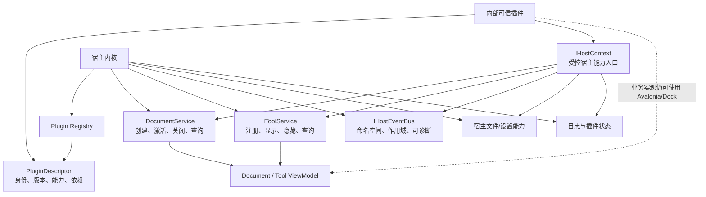

# MyAvaloniaManagement 宿主—插件交互架构整理与评审

> 评审日期：2026-07-22  
> 评审范围：宿主、公共契约、插件接入方式，以及 Document / Tool / 插件服务之间的关系  
> 默认边界：同一团队维护的内部可信插件；插件更新采用关闭应用、替换文件、重新启动  
> 不在本轮范围：逐项评审插件业务功能、第三方插件市场、运行时热卸载、插件沙箱

## 1. 先说结论：这是一个什么项目

**[架构判断]** 这不是一个单纯的 Avalonia Dock 示例，也还不是一个完整的通用插件平台。它更准确的定位是：

> 一个基于 .NET 10、Avalonia 和 Dock.Avalonia 的模块化桌面工作台，正在从“可停靠页面原型”向“内部可信插件宿主”演进。

它希望宿主提供统一的窗口、Dock 布局、菜单、文件打开/保存、依赖注入、消息通信和生命周期；业务模块则通过插件形式提供 Document、Tool 和后台服务。

当前工程已经形成三个核心扩展概念：

| 概念 | 期望语义 | 当前典型用途 |
| --- | --- | --- |
| `Document` | 中央工作区里的多实例工作上下文；每次创建拥有独立状态，必要时可保存 | 视频下载配置、视频播放/加密、数据导入 |
| `Tool` | 宿主级单例侧边面板；可以隐藏和恢复，展示全局状态或控制后台能力 | 插件目录、文件树、工具管理、下载调度器 |
| 插件服务 | 与具体页面是否可见无关的业务能力；生命周期由插件或宿主管理 | 仓储、下载协调器、凭据、播放器运行时 |

这三个概念比“DLL 是否叫插件”更重要。真正决定平台是否成熟的，是宿主是否清楚地拥有对象创建、资源释放和交互边界。

### 1.1 解决方案全景



**[代码事实]** 宿主和全部插件项目都直接引用 `MyAvaloniaManagementCommon`；公共项目本身又引用 Avalonia、Dock、MVVM Toolkit 等 UI 库。因此它目前不是“UI 无关的插件协议”，而是“共享同一套桌面 UI 技术栈的扩展 SDK”。参见 [`MyAvaloniaManagementCommon.csproj`](../Host/MyAvaloniaManagementCommon/MyAvaloniaManagementCommon.csproj) 和各插件 `.csproj`。

**[架构判断]** 对内部可信插件，这种强类型、进程内、共享 UI 栈的方式有很高开发效率；代价是宿主、契约、Dock 和插件需要协同升级，不能把它当成稳定的第三方插件 ABI。

## 2. 宿主现在如何启动和接入插件

### 2.1 启动流程



**[代码事实]** 入口按照“加载程序集 → 发现模块 → 插件注册服务 → 构建根容器 → 初始化插件生命周期 → 启动 UI → 反向关闭插件”的顺序运行，参见 [`Program.cs`](../Host/MyAvaloniaManagement/Program.cs#L21)。

### 2.2 两种插件接入模型并存

| 模型 | 识别方式 | 策略构造 | 可用能力 | 当前示例 |
| --- | --- | --- | --- | --- |
| Legacy Plugin | 程序集中只有 Document/Tool 策略 | 公共无参构造函数、`Activator.CreateInstance` | Document/Tool，依赖由插件自行处理 | DaTangAccountingHelpPlug |
| Managed Plugin | 程序集实现 `IPluginModule` | 策略通过宿主 DI 构造 | DI、Document/Tool、可选插件生命周期 | BiliDownloader、MyPlugTest、MySmallTools |

**[代码事实]** `IPluginModule.ConfigureServices(IServiceCollection)` 让托管插件直接向宿主根服务集合注册依赖；未实现模块接口的程序集继续使用无参策略，不被自动迁移。参见 [`IPluginModule.cs`](../Host/MyAvaloniaManagementCommon/Plugin/IPluginModule.cs#L13)、[`PluginModuleCatalog.cs`](../Host/MyAvaloniaManagement/Business/Helpers/PluginModuleCatalog.cs#L39) 和 [`PluginStrategyActivator.cs`](../Host/MyAvaloniaManagement/Business/Helpers/PluginStrategyActivator.cs)。

**[代码事实]** `IPluginLifecycle` 是可选能力。生命周期管理器按 `Order`、`PluginId` 串行初始化，单个插件失败不会阻止后续插件，退出时只反向关闭成功初始化的插件。参见 [`IPluginLifecycle.cs`](../Host/MyAvaloniaManagementCommon/Plugin/IPluginLifecycle.cs#L10) 和 [`PluginLifecycleManager.cs`](../Host/MyAvaloniaManagementCommon/Plugin/PluginLifecycleManager.cs#L78)。

**[架构判断]** 兼容双轨是合理的过渡策略，但不能长期成为最终模型。只要两套对象所有权规则长期并存，宿主就难以统一保证释放、诊断和兼容性。

## 3. Document：多实例工作上下文

### 3.1 概念定义

`Document` 不应被理解为传统意义上的“文本文件”。在这个工程中，它更接近 IDE 中的编辑器标签页：

- 一次用户操作创建一个独立实例；
- 可以同时打开多个同类型实例；
- 实例拥有自己的交互状态和临时资源；
- 可以选择实现保存/恢复；
- 标签页真正关闭后，实例相关资源必须释放。

公共入口是 [`IDocumentCreationStrategy`](../Host/MyAvaloniaManagementCommon/DocumentCreation/IDocumentCreationStrategy.cs#L9)，宿主按 `DocumentTypeId` 保存策略和元数据，再通过 `CreateManagementNewDocument` 调用对应策略，参见 [`ManagementFactory.cs`](../Host/MyAvaloniaManagement/ViewModels/ManagementFactory.cs#L205)。

### 3.2 当前创建与释放流程



**[代码事实]** `DocumentScopeManager` 建立 `Document` 与 `IServiceScope` 的一一映射，并在 Dock 的 `OnDockableClosed` 之后释放，避免在仍可取消的 closing 阶段提前销毁。参见 [`DocumentScopeManager.cs`](../Host/MyAvaloniaManagement/Business/Helpers/DocumentScopeManager.cs#L19) 和 [`ManagementFactory.cs`](../Host/MyAvaloniaManagement/ViewModels/ManagementFactory.cs#L415)。

**[代码事实]** MySmallTools 的两个策略已经通过 `IDocumentScopeFactory.CreateDocument<TDocument>()` 创建 Document；播放器、加密任务和相关 ViewModel 使用 scoped 生命周期。参见 [`SecretVideoDocumentStrategy.cs`](../Plugins/MySmallTools/MySmallTools/InitPlug/SecretVideoPlayer/SecretVideoDocumentStrategy.cs#L10)、[`VideoEncryptorDocumentStrategy.cs`](../Plugins/MySmallTools/MySmallTools/InitPlug/SecretVideoPlayer/VideoEncryptorDocumentStrategy.cs#L13) 和 [`MySmallToolsPluginModule.cs`](../Plugins/MySmallTools/MySmallTools/Plugin/MySmallToolsPluginModule.cs#L24)。

**[代码事实]** BiliDownloader 和 MyPlugTest 的策略仍保存根 `IServiceProvider`，从根容器解析 transient Document。参见 [`BiliDownloaderDocumentStrategy.cs`](../Plugins/BiliDownloader/BiliDownloader/Create/BiliDownloaderDocumentStrategy.cs#L18) 和 [`TestWelcomeDocumentStrategy.cs`](../Plugins/MyPlugTest/MyPlugTest/Create/TestWelcomeDocumentStrategy.cs#L18)。

**[架构判断]** 当前只能说“宿主具备每 Document Scope 能力”，不能说“所有 Managed Document 都已由 Scope 托管”。这是现阶段最重要的所有权不一致。

### 3.3 保存模型

**[代码事实]** 实现 `ISavableDocument` 的 Document 可以生成统一的 `DocumentSaveData`；宿主负责文件选择、序列化和写入，插件负责 `Content` 与 `PluginMetadata`。参见 [`ISavableDocument.cs`](../Host/MyAvaloniaManagementCommon/Save/ISavableDocument.cs)、[`DocumentSaveData.cs`](../Host/MyAvaloniaManagementCommon/Save/DocumentSaveData.cs) 和 [`MainWindowViewModel.cs`](../Host/MyAvaloniaManagement/ViewModels/MainWindowViewModel.cs#L209)。

当前缺少：

- 文档脏状态和关闭前保存确认；
- 宿主级格式版本、插件数据版本协商和迁移入口；
- 未安装对应插件时的可恢复错误页；
- 原子写入、备份和损坏文件诊断；
- `InitializationData`、`AdditionalData` 的明确类型与实际使用约定。

## 4. Tool：宿主级单例状态投影

### 4.1 概念定义

`Tool` 更接近 IDE 的解决方案资源管理器、输出窗口或任务中心：

- 默认由宿主创建一次；
- 通常放在左/右侧 Dock；
- 关闭操作实际是隐藏，之后可恢复同一实例；
- 适合展示全局状态、导航和控制命令；
- 不应拥有必须依赖 Tool 可见性才能存活的后台任务。

**[代码事实]** `ManagementFactory` 启用了 `HideToolsOnClose`，并缓存所有已创建 Tool；托管示例也把 Tool ViewModel 注册为 singleton。参见 [`ManagementFactory.cs`](../Host/MyAvaloniaManagement/ViewModels/ManagementFactory.cs#L55)、[`MyCustomToolStrategy.cs`](../Plugins/MyPlugTest/MyPlugTest/Create/MyCustomToolStrategy.cs) 和 [`BiliSchedulerToolStrategy.cs`](../Plugins/BiliDownloader/BiliDownloader/Create/BiliSchedulerToolStrategy.cs)。

### 4.2 推荐的职责流



**[架构判断]** BiliDownloader 当前的方向是正确的：下载协调器作为插件级 singleton，由 `IPluginLifecycle` 初始化和关闭；Scheduler Tool 只是这个后台事实源的显示与控制入口。这样隐藏 Tool 或关闭提交任务的 Document 都不应停止下载。

**[不成熟点]** `ToolMetadata.Alignment` 注释宣称支持 Left、Right、Top、Bottom，但布局构建和恢复逻辑实际上只区分 Left/Right，其他值会退化为左侧。参见 [`ToolMetadata.cs`](../Host/MyAvaloniaManagementCommon/ToolCreation/ToolMetadata.cs#L31)、[`ManagementFactory.cs`](../Host/MyAvaloniaManagement/ViewModels/ManagementFactory.cs#L250) 和 [`ToolManagementViewModel.cs`](../Host/MyAvaloniaManagement/ViewModels/Tools/ToolManagementViewModel.cs#L226)。

## 5. 宿主与插件的实际交互通道

当前交互不是单一 API，而是五条通道叠加：

| 通道 | 当前方式 | 优点 | 风险 |
| --- | --- | --- | --- |
| UI 扩展 | 插件直接返回 Dock `Document` / `Tool` | 简单、强类型、UI 自由度高 | 与 Dock 版本和宿主布局模型强耦合 |
| 服务接入 | 插件直接获得 `IServiceCollection` | 可完整使用 Microsoft DI | 可注册/覆盖任意根服务，缺少能力边界 |
| 创建入口 | 反射发现 `IDocumentCreationStrategy` / `IToolCreationStrategy` | 新增类型成本低 | 无显式清单；冲突和失败难诊断 |
| 消息通信 | 共享 `WeakReferenceMessenger.Default` | 低耦合广播方便 | 全局命名空间、无所有者、无契约版本 |
| 文件保存 | 宿主包装外层，插件序列化内部内容 | 职责基本合理 | 缺少迁移、脏状态和失败恢复 |

**[代码事实]** `IMessengerService` 还直接暴露底层 `IMessenger`，其实现使用进程级 `WeakReferenceMessenger.Default`。参见 [`IMessengerService.cs`](../Host/MyAvaloniaManagementCommon/Message/IMessengerService.cs#L8) 和 [`MessengerService.cs`](../Host/MyAvaloniaManagementCommon/Message/MessengerService.cs#L24)。

**[代码事实]** 宿主自身仍存在静态 `ServiceProvider` 服务定位器；部分 Tool 甚至通过反射读取 `ManagementFactory` 私有字典。参见 [`ServiceProvider.cs`](../Host/MyAvaloniaManagement/Business/Helpers/ServiceProvider.cs)、[`PlugGroupMenuViewModel.cs`](../Host/MyAvaloniaManagement/ViewModels/Tools/PlugGroupMenuViewModel.cs#L20) 和 [`ToolManagementViewModel.cs`](../Host/MyAvaloniaManagement/ViewModels/Tools/ToolManagementViewModel.cs#L63)。

**[架构判断]** 当前模型可以概括为：**高自由度、低约束、强信任**。它适合内部插件，但需要把“能做什么”逐步收束为稳定的宿主能力，而不是继续暴露更多内部对象。

## 6. 当前成熟度盘点

| 能力 | 状态 | 说明与证据 |
| --- | --- | --- |
| 插件目录扫描 | 已实现 | 按 Controls 下的一级目录建立 `PluginLoadContext`，递归加载托管 DLL，并排除 native/runtimes/libvlc；见 [`AssemblyLoaderHelper.cs`](../Host/MyAvaloniaManagement/Business/Helpers/AssemblyLoaderHelper.cs#L30) |
| Legacy/Managed 兼容 | 已实现 | 仅声明 `IPluginModule` 的程序集走 DI，Legacy 保持无参策略 |
| Document/Tool 策略 | 已实现 | 反射发现策略，按字符串类型 ID 注册和创建 |
| 插件级 DI | 已实现 | Managed Plugin 可注册 singleton/scoped/transient 服务 |
| 插件生命周期 | 已实现 | 顺序初始化、反序关闭、幂等和单插件失败隔离已有测试 |
| Tool 隐藏/恢复 | 已实现 | Tool 实例缓存，关闭后隐藏，可由工具管理面板恢复 |
| Document 保存 | 部分成熟 | 有统一外层格式和插件内容，但没有迁移、脏状态和关闭确认 |
| 每 Document Scope | 部分成熟 | 基础设施和 MySmallTools 已完成，其他 Managed Document 尚未统一 |
| 加载上下文隔离 | 部分成熟 | 每目录一个 ALC，但不是 collectible，没有卸载；共享依赖正确性依赖部署时按文件名排除 |
| 错误处理与诊断 | 不成熟 | 多处捕获后仅输出 Console；没有宿主插件状态页、结构化日志或用户可操作错误 |
| ID 与元数据 | 不成熟 | `PluginId`、Document/Tool ID 都是字符串；重复策略通过 `TryAdd` 静默保留首个实例，见 [`ManagementFactory.cs`](../Host/MyAvaloniaManagement/ViewModels/ManagementFactory.cs#L130) |
| Tool 布局能力 | 不成熟 | 元数据承诺四个方向，实现只有左右两类 |
| 构建与部署 | 不成熟 | BiliDownloader、MyPlugTest、MySmallTools 分别维护部署 Target，规则已经出现差异 |
| 插件 manifest | 未实现 | 没有独立插件描述、版本、入口程序集、能力或依赖清单 |
| 宿主 API 兼容检查 | 未实现 | 加载前不校验插件目标宿主/公共契约版本 |
| 插件启停与依赖图 | 未实现 | 没有用户配置、依赖声明、缺失依赖阻断或拓扑排序 |
| 能力权限声明 | 未实现 | 插件可直接注册根容器并执行任意进程内代码 |
| 布局持久化 | 未实现 | 虽引用 Dock Settings 相关包，但代码中没有保存/恢复 Dock 布局的实现 |
| 真实目录集成测试 | 未实现 | 现有测试覆盖扫描排除规则和组件级行为，未覆盖完整插件包在独立依赖目录中的启动 |
| 运行时卸载/热更新 | 有意不做 | 当前 ALC 不可回收；对内部插件采用重启更新更合理 |

### 6.1 加载隔离需要准确理解

**[代码事实]** `PluginLoadContext` 继承 `AssemblyLoadContext`，但构造时没有启用 `isCollectible`，宿主又长期缓存上下文和程序集。因此当前实现解决的是“按目录查找依赖”，不是“可卸载插件”。参见 [`PluginLoadContext.cs`](../Host/MyAvaloniaManagement/Business/Helpers/PluginLoadContext.cs#L13) 和 [`AssemblyLoaderHelper.cs`](../Host/MyAvaloniaManagement/Business/Helpers/AssemblyLoaderHelper.cs#L19)。

**[架构判断]** 对“内部可信插件 + 重启更新”的既定边界，这不是必须修复的缺陷。更值得优先验证的是共享契约程序集只能由默认上下文提供，以及两个插件携带不同版本第三方依赖时不会互相串用。

### 6.2 测试基线

评审时执行：

```powershell
dotnet test MyAvaloniaManagement.sln -p:SkipPluginDeploy=true --no-restore
```

结果：

- `BiliDownloader.Tests`：7/7 通过；
- `MyAvaloniaManagement.PluginTests`：15/15 通过；
- `MySmallTools.Tests`：18/18 通过；
- 合计 40/40 通过；
- 构建仍报告约 22 项历史警告，主要来自 DaTangAccountingHelpPlug 的异步、可空性和 MVVM Toolkit 用法。

**[判断边界]** 这些测试证明生命周期编排、Document Scope 基础设施、Legacy/Managed 激活和若干插件业务边界可工作；它们还不能证明完整 GUI、真实插件包加载、版本冲突、保存损坏恢复或长期运行稳定性。

## 7. 宿主应该给插件多大自由度

### 7.1 当前可信模型下的责任边界

| 宿主必须拥有 | 插件可以拥有 | 插件不应决定 |
| --- | --- | --- |
| 插件发现与兼容性判断 | 业务 View / ViewModel | 根窗口和应用生命周期 |
| 根容器构建顺序 | 插件内部服务和仓储 | Dock 根布局整体结构 |
| Document/Tool 注册表 | Document 的业务状态 | 其他插件是否加载 |
| Dock 创建、激活、关闭 | Tool 的展示与控制逻辑 | 覆盖宿主核心服务 |
| Document Scope 创建与释放 | 插件后台 Coordinator | 全局文件格式与安全策略 |
| 文件选择和统一保存外壳 | 插件序列化内容 | 全局更新、权限和诊断策略 |
| 应用启动、退出和插件状态 | 插件内部消息 | 直接修改其他插件状态 |

### 7.2 目标能力边界



**[建议]** 不需要立即禁止插件引用 Avalonia/Dock。内部插件的 UI 自由度是该项目的价值之一。应先限制插件对“宿主内部状态”的访问：用稳定服务替代静态 `ServiceProvider`、私有字段反射和直接操纵根 Dock。

### 7.3 建议的候选契约

以下是下一阶段设计方向，不是本轮已实现接口：

```csharp
public sealed record PluginDescriptor(
    string PluginId,
    Version PluginVersion,
    Version RequiredHostApiVersion,
    IReadOnlyList<string> Capabilities,
    IReadOnlyList<string> Dependencies);

public interface IHostContext
{
    IDocumentService Documents { get; }
    IToolService Tools { get; }
    IHostEventBus Events { get; }
    IHostDiagnostics Diagnostics { get; }
}
```

- `IDocumentService`：创建、激活、关闭、按 ID 查询，并统一建立/释放 Document Scope。
- `IToolService`：注册、显示、隐藏和查询 Tool，不向插件暴露根 Dock 树。
- `IHostEventBus`：不再暴露底层 `IMessenger`，要求消息归属、作用域和错误诊断。
- `IDocumentState`：统一脏状态、保存、恢复、格式版本和迁移。
- `PluginDescriptor`：加载代码前即可完成身份、兼容性和依赖检查。

## 8. 哪些场景适合做插件

| 场景 | 建议 | 原因 |
| --- | --- | --- |
| 下载器、媒体处理、数据导入 | 适合进程内插件 | 有清晰业务边界，同时需要宿主 Document/Tool UI |
| 项目浏览器、日志查看器、任务中心 | 适合 Tool 或 Document | 可复用宿主 Dock 和消息能力 |
| 带后台队列的领域子系统 | 适合 Managed Plugin | 后台服务由生命周期托管，UI 只是投影 |
| 主题、根窗口、主菜单总体结构 | 保留在宿主 | 属于全局一致性和应用生命周期 |
| 插件安装器、全局更新器 | 保留在宿主 | 涉及全部插件和发布安全 |
| 权限、安全策略、凭据总规则 | 保留在宿主 | 插件不能自行决定安全边界 |
| 不可信第三方代码 | 独立进程 | 当前进程内插件没有安全隔离 |
| 容易导致进程崩溃的原生组件 | 优先独立进程 | ALC 不能隔离 native crash |
| 高 CPU/内存、需要强制限额的长任务 | 独立 Worker 进程 | 便于资源限制、重启和故障恢复 |

## 9. 建议演进路线

### P0：统一对象所有权和诊断

1. 所有 Managed Document 都必须经 `IDocumentScopeFactory` 或新的 `IDocumentService` 创建，禁止从根容器解析 Document。
2. 用显式查询 API 替代 ToolManagement 对 `ManagementFactory` 私有字段的反射。
3. 逐步移除宿主 ViewModel 中的静态 `ServiceProvider`，构造注入作为唯一正常路径。
4. 对重复 `PluginId`、Document ID、Tool ID、空元数据和未知 Alignment 直接产生结构化加载错误，不再静默忽略。
5. 为加载、初始化、策略发现和关闭建立统一插件状态；用户能够看到失败插件、阶段、原因和建议动作。
6. 明确 Tool 只支持 Left/Right，或真正补齐 Top/Bottom；契约与实现必须一致。

### P1：形成稳定宿主 API

1. 引入 `PluginDescriptor` 和 Host API 版本，先校验再加载模块。
2. 建立 Plugin Registry，集中保存插件身份、程序集、状态、Document/Tool 贡献和诊断。
3. 以 `IHostContext`、`IDocumentService`、`IToolService` 收束宿主能力。
4. 将消息按宿主事件、插件内部事件和跨插件公共事件分层；默认不暴露底层 messenger。
5. 增加 Document 脏状态、关闭确认、格式版本、迁移和未知插件占位页。
6. 实现 Dock 布局保存/恢复，并处理插件缺失或 Tool ID 变化。

### P2：工程化和真实集成验证

1. 把插件 publish、宿主共享依赖排除和部署目录规则抽成统一 MSBuild Target。
2. 增加从临时 Controls 目录加载真实插件包的集成测试。
3. 覆盖两个插件携带不同第三方依赖版本、缺少依赖、重复 ID、模块构造失败、生命周期超时和关闭异常。
4. 覆盖 Document 多开、关闭释放、宿主退出释放、保存迁移和损坏文件恢复。
5. 增加结构化日志、插件启动耗时、失败阶段和长期后台任务状态。

### 当前明确不做

- 运行时卸载和热更新；
- 插件沙箱或权限强制执行；
- 跨进程 UI 合成；
- 第三方插件市场；
- 为了“形式完整”给无后台职责的插件增加空生命周期。

这些能力只有在信任模型、产品定位或发布方式改变后才值得重新评估。

## 10. 最终评价

这个项目已经跨过了“把几个 DLL 反射进 Dock”的阶段：它有了兼容式模块注册、插件级生命周期、Document Scope 基础设施、Tool 单例语义和可验证测试。

但它尚未跨过“宿主能力产品化”的门槛。最核心的问题不是插件数量少，而是：

1. Managed Document 的所有权规则没有完全统一；
2. 插件能直接接触根 DI、Dock 类型和全局消息总线，能力边界仍然模糊；
3. 缺少 manifest、兼容性、注册表和统一诊断，加载成功与否主要依赖控制台和约定；
4. 公共契约已经承担宿主 SDK 的角色，但尚未按可演进 API 管理。

因此，下一步最值得做的不是热加载或沙箱，而是把已有的正确方向收口：**宿主拥有生命周期与资源，Document 表达多实例工作上下文，Tool 表达单例状态投影，插件后台服务承载长期事实。** 当这条边界在所有插件中一致后，这个工程才会从“能加载插件的桌面程序”变成“可持续演进的内部插件宿主”。
