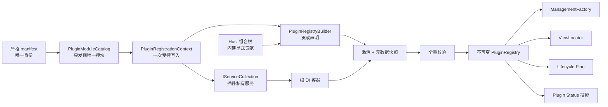

# G5：显式贡献与 Plugin Registry 破坏式重定基线

> **历史说明：本 V1 阶段已由 Managed Plugin V2 G14 取代；以下日期、数量和结论保持原样。**

状态：已完成

实施日期：2026-08-16

适用范围：Host、`MyAvaloniaManagementCommon`、四个仓库插件及宿主三套测试

## 1. 决策与兼容边界

G5 把此前的 Plugin SDK `1.0.0` 视为封板前候选，并执行一次有意的破坏式重定基线。旧候选
二进制插件不提供适配器，也不会因为程序集仍能被加载而继续获得隐式扩展发现。宿主和四个仓库
插件在同一变更中重新编译；完成后仍以 Managed Plugin v1、包版本 `1.0.0`、程序集版本
`1.0.0.0` 发布。

本次没有修改 manifest schema、兼容区间、Document/Tool 稳定 ID、数据别名或布局迁移规则。
manifest 是插件身份唯一事实源；破坏的是封板前二进制接入契约，不是持久化数据身份。

| 旧候选契约 | v1 最终契约 | 删除理由 |
| --- | --- | --- |
| `IPluginModule.PluginId` | `context.PluginId` 只读 | 避免 manifest 与模块重复声明身份 |
| `ConfigureServices(IServiceCollection)` | `Configure(IPluginRegistrationContext)` | 区分私有服务与宿主可见贡献 |
| `IPluginLifecycle.PluginId` | Registry 绑定 manifest 所有权 | 生命周期不能自报第二份身份 |
| 程序集扫描策略 | `AddDocument` / `AddTool` | 类型存在不等于产品功能已发布 |
| AppDomain、目录及命名推断 View | `AddView<TViewModel,TView>` | 映射可审阅、可校验且无静态全局状态 |
| 枚举 DI 中的 Lifecycle | `AddLifecycle<TLifecycle>` | 生命周期集合与插件所有权来自同一 Registry |

## 2. 最终 SDK 契约

```csharp
public interface IPluginModule
{
    void Configure(IPluginRegistrationContext context);
}

public interface IPluginRegistrationContext
{
    PluginId PluginId { get; }
    IServiceCollection Services { get; }

    void AddDocument<TStrategy>()
        where TStrategy : class, IDocumentCreationStrategy;

    void AddTool<TStrategy>()
        where TStrategy : class, IToolCreationStrategy;

    void AddView<TViewModel, TView>()
        where TView : Control, new();

    void AddLifecycle<TLifecycle>()
        where TLifecycle : class, IPluginLifecycle;
}
```

设计意图如下：

- `PluginId` 由宿主从已严格验证的 manifest 注入。插件可以读取自己的所有者身份，但没有 setter，
  也没有第二个声明位置。
- `Services` 只表达插件私有业务对象的构造关系和生命周期。Document、Tool、View 与 Lifecycle 是
  宿主需要理解、校验和呈现的贡献，必须使用专用方法。
- 注册窗口只存在于根容器建立前的组合阶段。模块返回后 Context 立即封闭，不支持运行期追加、
  删除、动态启停或热卸载。
- 未登记类型不会被发现。新增一个策略或符合命名习惯的 View 不会静默改变菜单或界面。
- View 保持无参控件构造；业务依赖放入由 DI 管理的 ViewModel，避免根容器跟踪瞬态可释放控件。

## 3. 组合数据流与失败原子性



顺序固定为：清单和 deps 预检、模块实例化、按 manifest ID 配置模块、构建 DI、激活贡献、全量
校验、发布 Registry、解析 Factory 与生命周期计划、初始化生命周期、启动 UI。任何模块配置、容器
构建、贡献激活或校验失败都会放弃本次 Builder 与容器；不会留下部分菜单、View 映射或已运行生命周期。

## 4. 组件职责

| 组件 | 单一职责 | 明确不负责 |
| --- | --- | --- |
| `PluginModuleCatalog` | 从严格快照创建唯一模块，并按 manifest ID 调用一次配置 | 扫描 Document、Tool、View 或读取模块身份 |
| `PluginRegistrationContext` | 将一个 manifest 所有者绑定到一次注册调用，并检测贡献 DI 旁路 | 全局碰撞校验、运行期修改、宿主核心服务保护 |
| `PluginRegistryBuilder` | 收集声明，激活贡献，读取元数据，聚合诊断并提交 | UI 状态、生命周期运行状态、热更新 |
| `PluginRegistry` | 提供不可变的清单所有权、贡献和创建查询 | 写入、覆盖、重试、诊断持久化 |
| `PluginLifecycleManager` | 排序、超时、阻塞、初始化和反向关闭 | 发现生命周期或决定其身份 |
| `ViewLocator` | 使用已登记工厂创建 View，并把失败转为诊断占位 | AppDomain、目录、类型名或 `Type.GetType` 回退 |

## 5. SOLID 与朴素设计模式

- **SRP**：Catalog、Context、Builder、Registry、生命周期管理器和 ViewLocator 分别只有一种变化
  原因；Registry 不吸收诊断会话和生命周期状态。
- **OCP**：插件通过四个明确方法增加贡献，宿主分派代码不需要识别插件具体类型。
- **LSP**：Document、Tool、Lifecycle 仍按各自 SDK 接口激活；显式注册不改变策略行为语义。
- **ISP**：模块只依赖一个组合期 Context；插件业务服务继续依赖自己的窄接口，不依赖 Host 实现。
- **DIP**：public SDK 提供抽象 Context，Host 内部实现写入内部 Builder；插件无法引用 Registry 实现。

采用的模式只包括 Context/Registrar、Builder、Immutable Registry 和 Factory。它们分别解决受控
写入、分阶段组合、原子只读发布和 View/策略创建。没有引入通用模块框架、动态代理、事件溯源或
运行期可变注册表。

## 6. 实例生命周期

| 贡献 | 建立方式 | 生命周期与所有者 |
| --- | --- | --- |
| Document 策略 | Context 同时登记具体类型到根 DI 与 Builder | 根级单例；每次创建的 Document Scope 仍由 `IDocumentScopeFactory` 管理 |
| Tool 策略 | Context 同时登记具体类型到根 DI 与 Builder | 根级单例；Tool 隐藏后恢复同一实例的既有规则不变 |
| View | Registry 保存 `Func<Control>` | DataTemplate 请求时按需无参创建；不由根容器跟踪 |
| Lifecycle | Context 登记具体类型，Builder 激活并绑定 manifest ID | 根级单例；每插件最多一个，成功初始化后才参与反向关闭 |
| 插件私有服务 | 插件写入 `context.Services` | 由插件选择 singleton/scoped/transient；G5 不改变业务生命周期 |

## 7. 校验与稳定错误码

Registry 发布前会拒绝以下情况：

| 错误码 | 含义 |
| --- | --- |
| `CONTRIBUTION_REGISTRATION_BYPASS` | 插件通过 `Services` 直接登记贡献接口，绕过 Context |
| `DOCUMENT_CONTRIBUTION_TYPE_DUPLICATE` | 同一 Document 策略类型被重复登记 |
| `TOOL_CONTRIBUTION_TYPE_DUPLICATE` | 同一 Tool 策略类型被重复登记 |
| `LIFECYCLE_CONTRIBUTION_TYPE_DUPLICATE` | 同一 Lifecycle 类型被重复登记 |
| `LIFECYCLE_PLUGIN_ID_DUPLICATE` | 同一 manifest 所有者登记多个 Lifecycle |
| `CONTRIBUTION_TYPE_INVALID` | 贡献是抽象、接口、开放泛型或没有 public 构造 |
| `VIEW_MODEL_REGISTRATION_DUPLICATE` | 一个 ViewModel 映射到多个 View |
| `DOCUMENT_ID_DUPLICATE` / `TOOL_ID_DUPLICATE` | 多个贡献声明同一主 ID |
| `DOCUMENT_ID_ALIAS_DUPLICATE` / `TOOL_ID_ALIAS_DUPLICATE` | 主 ID 与数据兼容别名或别名之间碰撞 |
| `EXTENSION_OWNER_MISMATCH` | 元数据 ID 不属于 manifest 命名空间 |
| `EXTENSION_METADATA_INVALID` | 元数据为空或字段违反契约 |
| `CREATION_INTENT_ID_DUPLICATE` | 同一 Document 内创建意图重复 |
| `EXTENSION_ACTIVATION_FAILED` | 策略/Lifecycle 激活或元数据读取抛出异常 |
| `VIEW_CREATION_FAILED` | 已登记 View 工厂抛出异常；UI 显示占位 |

`HostCompositionException` 聚合结构性错误，Contributor 包含贡献类型和程序集简单名。模块配置或贡献
激活异常仍进入诊断会话，但对用户稳定边界只承诺错误码和结构字段，不依赖异常正文。Lifecycle 的
缺失、重复和循环依赖继续由既有计划构建器在 UI 前拒绝。

G5 只禁止三类贡献接口绕过 Context；插件删除、替换或覆盖宿主核心 DI 描述符的完整差异保护属于 G6。

## 8. 宿主与四插件迁移结果

| 所有者 | Document | Tool | 动态 View | Lifecycle |
| --- | ---: | ---: | ---: | ---: |
| Host | 1（Welcome） | 4 | 5 | 0 |
| BiliDownloader | 1 | 1（Scheduler） | 2 | 1 |
| DaTangAccountingHelpPlug | 2 | 0 | 2 | 0 |
| MyPlugTest | 4 | 1 | 5 | 0 |
| MySmallTools | 4 | 0 | 4 | 0 |

只登记由全局 DataTemplate 动态解析的根 View。XAML 内部直接创建的 UserControl 不进入 Registry。
四插件的业务服务注册和既有 singleton/scoped/transient 选择保持不变；Bili Scheduler Tool 使用延迟
ViewModel 工厂打破 Registry 构造阶段的循环，不把整个 `IServiceProvider` 泄漏给策略。

## 9. 插件作者完整示例

```csharp
public sealed class ExamplePluginModule : IPluginModule
{
    public void Configure(IPluginRegistrationContext context)
    {
        // 私有业务服务：只有插件负责其用途和生命周期。
        context.Services.AddSingleton<IExampleService, ExampleService>();
        context.Services.AddScoped<ExampleDocumentViewModel>();
        context.Services.AddSingleton<ExampleToolViewModel>();

        // 宿主可见贡献：必须逐项显式声明。
        context.AddDocument<ExampleDocumentStrategy>();
        context.AddTool<ExampleToolStrategy>();
        context.AddView<ExampleDocumentViewModel, ExampleDocumentView>();
        context.AddView<ExampleToolViewModel, ExampleToolView>();
        context.AddLifecycle<ExamplePluginLifecycle>();
    }
}
```

不要向 `context.Services` 注册 `IDocumentCreationStrategy`、`IToolCreationStrategy` 或
`IPluginLifecycle` 接口；不要在 `Configure` 返回后保存 Context；不要依赖类名、程序集扫描或
AppDomain 让未登记类型自动出现。

## 10. 删除项与保留项

已删除：策略程序集扫描、`DiscoveredAssemblies`、`GetDiscoveryTypes`、ViewLocator 静态状态、插件
目录/AppDomain View 扫描、View/ViewModel 字符串替换、`Type.GetType` View 回退、生产路径直接枚举
DI Lifecycle、模块/生命周期 `PluginId`、旧 `ConfigureServices` 以及空 `PluginStrategyActivator.cs`。

继续保留：严格清单、同名 deps、唯一模块预检、稳定 ID 与 Legacy 数据别名、Document Scope、
生命周期依赖排序/超时/反向关闭和 View 无参构造。它们具有明确的 v1 场景，不是过渡占位代码。

## 11. 测试与验收证据

新增或迁移的测试覆盖：未登记程序集类型不可见、重复 ViewModel 映射、直接 DI 贡献旁路、View
构造失败诊断与占位、manifest 所有权、真实四插件贡献、生命周期排序和关闭，以及 SDK 旧成员消失。

最终门禁命令：

```powershell
dotnet restore MyAvaloniaManagement.sln --locked-mode
dotnet build MyAvaloniaManagement.sln -c Release --no-restore
dotnet test Host/MyAvaloniaManagement.Tests/MyAvaloniaManagement.Tests.csproj -c Release --no-build
dotnet test Host/MyAvaloniaManagement.PluginTests/MyAvaloniaManagement.PluginTests.csproj -c Release --no-build
dotnet test Host/MyAvaloniaManagement.UiTests/MyAvaloniaManagement.UiTests.csproj -c Release --no-build
powershell -File scripts/Test-PluginSdkPackage.ps1 -Configuration Release
```

2026-08-16 在仓库根目录依次执行上述命令，实际结果为：

| 门禁 | 结果 |
| --- | --- |
| 锁定还原 | 通过，22 个解决方案项目均满足 lock file |
| 解决方案 Release 构建 | 通过，0 警告、0 错误 |
| `MyAvaloniaManagement.Tests` | 119/119 通过 |
| `MyAvaloniaManagement.PluginTests` | 127/127 通过 |
| `MyAvaloniaManagement.UiTests` | 37/37 通过 |
| 三套宿主测试合计 | **283/283 通过** |
| SDK 包门禁 | 通过；最终 v1 临时插件编译成功，旧候选接口夹具以 `CS0535` 失败，UI Profile 临时插件编译成功 |

包门禁使用本次临时目录下的隔离 NuGet global-packages 目录，防止开发机曾缓存的同版本 `1.0.0`
旧包遮蔽刚生成的 nupkg。Plugin 测试同时从四个真实插件构建目录验证严格清单、唯一入口、模块加载，
并断言四插件的贡献类型、数量和 Context 所有权。

本次 G5 命令没有重新采集覆盖率或 Windows Smoke，因此不把 G4 的覆盖率/Smoke 数字冒充为 G5
证据；它们仍属于整体发布门禁 G14。测试数量是 2026-08-16 的时间点证据，后续继续从测试输出动态读取。

## 12. 后续任务衔接与回滚

- **G6**：在 Context 已能定位单个插件服务增量的基础上，保护宿主核心 DI 描述符；不扩大 G5 Registry 职责。
- **G12**：统一四插件构建与部署 Target，并自动校验 manifest、入口、deps 和私有资产；继续消费 G5 显式模块。
- **G13**：用可审阅 public API 基线替换临时 SHA256；本次删除的旧候选成员应成为正式 v1 基线中的“不可恢复项”。

本变更没有迁移或删除磁盘数据。代码回滚必须同时回滚 Host、SDK 和四插件，不能单独恢复旧接口或
View 扫描，否则会再次形成两套所有权事实源。旧候选二进制插件的唯一处理方式是用最终 v1 SDK
重新编译并显式登记贡献。
