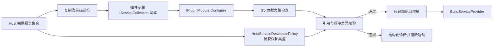

# G6：宿主 DI 保护与插件注册事务

状态：已完成

实施日期：2026-08-16

适用范围：Host、`MyAvaloniaManagementCommon`、四个仓库插件及宿主三套测试

## 1. 决策与边界

G6 保持 `IPluginModule.Configure(IPluginRegistrationContext)` 和
`IPluginRegistrationContext.Services` 的 public 签名不变，只把后者从“直接写入宿主集合”收紧为
“只追加插件私有服务的组合期事务入口”。遵守既有契约的插件无需修改或重新设计生命周期。

本能力不是安全沙箱。Managed Plugin v1 仍是可信、进程内、退出后替换的插件模型；插件代码一旦执行，
仍可访问进程级 API、启动线程、调用反射或原生代码。G6 只承诺错误的 Microsoft DI 注册不能悄悄
删除、替换或覆盖宿主对象图。

## 2. 保护规则

| 插件最终留下的服务集合变化 | 结果 | 理由 |
| --- | --- | --- |
| 追加插件私有 singleton/scoped/transient | 允许 | 插件负责自己的对象生命周期 |
| 为插件私有接口追加多个实现 | 允许 | 保留 `IEnumerable<T>` 与 formatter/provider 集合语义 |
| 追加插件私有 keyed 或开放泛型服务 | 允许 | Microsoft DI 的正常私有能力 |
| 修改插件本次刚新增、尚未提交的描述符 | 允许 | 不影响宿主或前序插件 |
| 删除、替换、重排或在既有区域插入描述符 | 拒绝 | 会改变宿主或前序插件的确定对象图 |
| 追加宿主基线中已有的 ServiceType | 拒绝 | Microsoft DI 单服务解析通常选择最后注册项，等价于覆盖 |
| 为宿主类型追加 keyed 描述符 | 拒绝 | keyed 不能成为绕过同一所有权规则的旁路 |
| 直接注册 Document/Tool/Lifecycle 接口 | 由 G5 拒绝 | 宿主可见贡献必须通过对应 `Add*` API |
| 模块返回后继续修改保存的 `Services` | 对宿主无效果 | 插件保存的是已脱离正式集合的工作副本 |

保护基线在全部宿主服务、ViewModel、诊断、`PluginRegistryBuilder`、`PluginRegistry` 工厂和
`PluginModuleCatalog` 注册完成后捕获。基线自动包含每个宿主 `ServiceType`，并额外包含默认容器
隐式提供的 Provider、Scope 与 keyed-service 基础类型；以后新增宿主服务不需要同步手写清单。

## 3. 组合数据流



每个模块开始时，`PluginServiceRegistrationTransaction` 保存正式集合的描述符引用和顺序，再把这些
引用复制到新的 `ServiceCollection`。`PluginRegistrationContext` 只接收副本。模块返回后按固定顺序：

1. 封闭 Context，并执行 G5 贡献旁路检查；
2. 确认所有既有描述符仍以相同引用位于相同索引；
3. 检查尾部新增描述符没有使用宿主保护类型；
4. 只把验证过的尾部增量追加到正式集合。

比较描述符引用而不是显示属性是有意设计。两个描述符即使 ServiceType、生命周期和实现类型相同，
其工厂委托或实现实例也可能不同；只有原引用仍在原位置，才能证明宿主注册没有被替换。

模块抛异常或违反规则时不会执行提交。本次 `HostRuntime.Create` 的服务集合、Registry Builder 和
后续根容器整体放弃，不会启动生命周期或 Avalonia UI。前序插件可能已经完成组合期提交，但根容器
从未成为可用运行时，因此不存在“半成功宿主”。

## 4. SOLID 与朴素模式

| 原则 | 落地方式 |
| --- | --- |
| SRP | Catalog 编排模块；Policy 判定保护类型；Transaction 负责复制、差异和提交；Context 负责贡献登记 |
| OCP | 宿主新增注册自动进入基线，不修改校验算法 |
| LSP | 所有只追加私有服务的现有模块继续通过同一 `IServiceCollection` API 工作 |
| ISP | SDK 没有暴露宿主保护方法，插件只依赖现有 Context |
| DIP | 插件依赖 SDK 抽象；组合根选择并执行 Host internal 策略 |

只采用 Policy 与 Transaction 两个直接对应问题的模式。没有引入插件子容器、动态代理、通用中间件、
服务所有权框架，也没有为唯一内部实现增加接口。最终仍构建一个 Microsoft DI 根容器，Document
Scope 语义保持不变。

## 5. 稳定诊断

新增 `PLUGIN_HOST_SERVICE_MUTATION`，固定发生在 `PluginServiceRegistration` 阶段，严重程度为
Fatal，处置为 AbortStartup。记录字段包括 manifest 插件 ID、入口程序集、违规 ServiceType、
生命周期、是否 keyed，以及以下稳定违规种类：

- `ExistingDescriptorChanged`：既有描述符被删除、替换、重排或插入导致位置改变；
- `ProtectedServiceAdded`：尾部新增描述符使用了宿主保护 ServiceType。

这是确定性契约错误，因此诊断不保存异常正文或调用栈。普通模块代码抛出的异常仍使用
`PLUGIN_SERVICE_REGISTRATION_FAILED`；通过 `Services` 直接登记贡献接口仍使用
`CONTRIBUTION_REGISTRATION_BYPASS`。

## 6. SDK 行为契约

`IPluginRegistrationContext.Services` 的最终 v1 规则是：

```csharp
public void Configure(IPluginRegistrationContext context)
{
    // 允许：当前插件拥有的私有服务，以及同一私有接口的多个实现。
    context.Services.AddSingleton<IExampleService, ExampleService>();
    context.Services.AddScoped<ExampleDocumentViewModel>();

    // 宿主可见贡献使用专用 API。
    context.AddDocument<ExampleDocumentStrategy>();
    context.AddView<ExampleDocumentViewModel, ExampleDocumentView>();
}
```

插件不得调用 `Remove`、`RemoveAll`、`Replace`、`Clear`，不得重排已有项，也不得向宿主已经拥有的
ServiceType 追加实现。`TryAdd` 如果没有产生最终变化可以继续使用；宿主判断最终结果而不是插件调用
过哪些扩展方法。

本次没有修改 SDK 包版本、程序集版本、manifest schema 或持久化 schema。它属于正式 v1 标签前的
行为基线收紧；任何依赖覆盖宿主服务的候选插件都不属于受支持插件。

## 7. 测试与验收证据

专项 `PluginServiceProtectionTests` 覆盖：

- 私有三种生命周期、开放泛型、keyed 与多实现注册；
- Remove、Replace、Clear、重排、追加 protected 类型和追加 keyed protected 类型；
- 模块追加服务后抛异常的回滚；
- 模块返回后继续修改保存集合的隔离；
- 前序有效插件与后序违规插件的提交边界；
- 稳定诊断字段、Fatal/AbortStartup 和无异常正文；
- 四个真实插件通过完整 Catalog 保护链并形成可用 Registry。

最终门禁命令：

```powershell
dotnet restore MyAvaloniaManagement.sln --locked-mode
dotnet build MyAvaloniaManagement.sln -c Release --no-restore
dotnet test Host/MyAvaloniaManagement.PluginTests/MyAvaloniaManagement.PluginTests.csproj -c Release --no-build --filter FullyQualifiedName~PluginServiceProtection
dotnet test Host/MyAvaloniaManagement.Tests/MyAvaloniaManagement.Tests.csproj -c Release --no-build
dotnet test Host/MyAvaloniaManagement.PluginTests/MyAvaloniaManagement.PluginTests.csproj -c Release --no-build
dotnet test Host/MyAvaloniaManagement.UiTests/MyAvaloniaManagement.UiTests.csproj -c Release --no-build
powershell -File scripts/Test-PluginSdkPackage.ps1 -Configuration Release
```

2026-08-16 在仓库根目录执行，实际结果为：

| 门禁 | 结果 |
| --- | --- |
| 锁定还原 | 通过，所有项目 lock file 满足要求 |
| 解决方案 Release 构建 | 通过，0 警告、0 错误 |
| `PluginServiceProtectionTests` | 11/11 通过 |
| `MyAvaloniaManagement.Tests` | 120/120 通过 |
| `MyAvaloniaManagement.PluginTests` | 138/138 通过 |
| `MyAvaloniaManagement.UiTests` | 37/37 通过 |
| 三套宿主测试合计 | **295/295 通过** |
| SDK 包门禁 | 通过；最终 v1 基础/UI 示例编译成功，旧候选模块接口被拒绝 |

本次没有重新采集覆盖率或 Windows 真实窗口 Smoke，因此不复用 G4/G5 的历史数字充当 G6 证据。
测试数量来自本次命令输出，不作为源码中的永久门槛。

## 8. 后续衔接与回滚

- G9 收口消息总线时，新的宿主事件总线注册会自动进入保护基线，不需要扩充 G6 清单；
- G12 的真实插件包矩阵应继续通过生产 Catalog 路径验证 G6，而不是直接调用模块绕过保护链；
- G13 冻结 public SDK 时，`Services` 的追加式行为说明属于兼容契约，签名不变不代表允许恢复覆盖语义；
- G15 负责整个诊断系统的异常脱敏；G6 已先保证自身确定性违规不写异常正文。

代码回滚必须同时回滚 SDK 文档中的追加式契约。仅删除事务而保留文档会产生虚假安全承诺；仅恢复
直接集合写入则会重新允许插件以注册顺序覆盖宿主服务。
