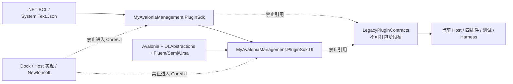

# Managed Plugin V2 G2：Plugin SDK 重建记录

> 状态：已完成（2026-08-21）
> 适用范围：最终 Core/UI SDK、v2 Public API 基线、NuGet 消费门禁与 Legacy 阶段桥
> 前置记录：[G0 绿色基线](./g0-green-baseline.md)、[G1 版本与数据边界](./g1-version-and-data-boundaries.md)
> 发布边界：本阶段不发布包，不运行 Windows Smoke、Windows CI 或发布总门禁

## 1. 结果摘要

G2 已建立程序集、包名和根命名空间一致的 `MyAvaloniaManagement.PluginSdk` Core，以及真实的
`MyAvaloniaManagement.PluginSdk.UI` 程序集。Core 只表达平台无关契约；UI 只表达 Avalonia、插件注册与
视图贡献。Host 实现、Dock、生命周期编排、Registry 与持久化实现均未进入 SDK。

当前 Host、四个业务插件、测试与 Harness 仍依赖 V1 形状。为避免在 G2 吞并 G5–G12 的迁移工作，旧
Common 已移动为 `MyAvaloniaManagement.LegacyPluginContracts` 内部项目：它仍输出
`MyAvaloniaManagementCommon.dll` 与旧命名空间，但 `IsPackable=false`，没有活动 API 基线，也不能增加新的
生产消费者。两个新 SDK 项目不引用 Legacy，两个 nupkg 也不包含或依赖 Legacy DLL。

这意味着“最终 V2 SDK 已可编译消费”，不意味着“V2 运行时迁移已完成”。manifest v2、独立插件容器、
Host Registry、Dock Adapter、Document v2 和 layout v2 仍由后续整改包负责。

## 2. 依赖方向与 SOLID 约束

本轮以 SOLID 为首要约束，并保持实现朴素：

- 单一职责：Core 只定义平台无关能力，UI 只定义 UI 注册和贡献，Legacy 只承担短期编译连续性。
- 开闭原则：新增贡献通过已有泛型注册入口与不可变描述符表达，不要求修改 Host 实现类型。
- 里氏替换：泛型约束在编译期要求 Document 模型实现相应 Core 接口、View 继承 `Control` 且可直接构造。
- 接口隔离：生命周期只保留初始化/关闭，Document 关闭端口只暴露观察权，持久化能力独立于普通 Document。
- 依赖倒置：SDK 表达 Host 需要实现的窄端口；插件不依赖 Host、Dock 或生命周期 Manager。

没有增加服务定位器、抽象工厂层、反射式扩展系统、兼容适配器或双向桥。使用的模式仅包括值对象、
不可变描述符、构造注入、观察者式事件端口和简单泛型注册。

## 3. Core public API

Core 统一位于 `MyAvaloniaManagement.PluginSdk`：

- `PluginId`、`DocumentTypeId`、`ToolTypeId`、`CreationIntentId` 是不可变引用值对象，提供 `Value`、
  `Parse`、`TryParse`、值相等和 `ToString`；拒绝大小写、空段、非法字符与不符合各自规则的 ID。
- `IHostEventBus` 保持同步、精确类型与订阅令牌所有权语义。
- `IPluginLifecycle` 只有 `InitializeAsync` 和 `ShutdownAsync`，不含顺序、依赖声明、Manager、Runner 或状态 DTO。
- `IDocumentLifetime` 只有 `ClosingToken` 和 `IsClosing`，主动取消仍由 Host 所有。
- `DocumentContent` 保存正整数 schema 与构造时克隆的 `JsonElement`；拒绝 `Undefined`，接受其他合法 JSON 值。
- `DocumentActivationContext` 只含非 null 标题、可选创建意图和可选恢复内容。
- `DocumentPresentationState` 只表达非 null 标题；脏状态由 `IPersistablePluginDocument` 独立表达。
- `IPluginDocument` 与 `IPersistablePluginDocument` 使用 `ValueTask` 初始化/捕获，并提供 Presentation 变化、
  `IsDirty` 与 `AcceptChanges`。

Core 没有运行时 NuGet 依赖。`System.Text.Json` 来自框架，不引入 JSON Converter、Legacy ID 或
`IsCanonical` 之类的冗余表面。

## 4. UI public API

UI 统一位于 `MyAvaloniaManagement.PluginSdk.UI`：

- `IPluginModule.Configure(IPluginRegistration)` 是唯一模块入口。
- `IPluginRegistration` 暴露当前插件的 `PluginId`、私有 `IServiceCollection`、`UseLifecycle`、
  `AddDocument`、`AddPersistableDocument` 与 `AddTool`。
- `DocumentDescriptor`、`DocumentCreationIntentDescriptor`、`ToolDescriptor` 对输入集合执行防御性复制，
  校验必填显示字段、枚举和重复 Intent，注册后不可变且不含 Legacy ID。
- `ToolDockSide` 保留 Left/Right/Top/Bottom；`ToolCloseBehavior` 只表达关闭时隐藏或禁止关闭。
- `IWindowContentFullscreenHost` 保留为窄 UI 端口，中文 XML 文档明确 UI 线程、调用者与 Host 所有权。
- 普通 Document 约定 scoped；Tool 与 Lifecycle 约定插件级 singleton。泛型约束在编译期绑定 Model 与 View。

UI 只允许同版本 Core、Avalonia、`Microsoft.Extensions.DependencyInjection.Abstractions`、
Avalonia Fluent、Semi 与 Ursa 支持包的精确依赖，不允许 Dock 或 Newtonsoft。

## 5. API 基线与项目结构

历史 v1 API 文本已移动到 Core 的 `ApiCompatibility/v1`，内容保持只读历史事实。当前活动基线为：

| 程序集 | v2 Shipped | v2 Unshipped |
| --- | ---: | ---: |
| `MyAvaloniaManagement.PluginSdk` | 0 | 84 |
| `MyAvaloniaManagement.PluginSdk.UI` | 0 | 42 |

两项目均启用 XML 文档和 PublicApiAnalyzers。所有 G2 public 类型、成员、异常、线程与所有权边界均使用
中文 XML 注释，并在需要说明取舍处使用 `remarks`。API 脚本分别验证两个程序集的基线、排序、重复、
版本和成员级变异，不再把 Legacy Common 当成 SDK。

## 6. 单元测试与门禁证据

SDK 专用测试覆盖四类 ID 的正常/边界/失败/相等语义，`DocumentContent` 的 schema、Undefined、克隆与
`JsonDocument` 释放后读取，Activation/Presentation/Descriptor 的空值、不可变集合、重复 Intent、枚举
与默认值，以及程序集归属、泛型约束、窄生命周期和旧类型缺失。本轮为 **32/32**。

| 门禁 | 本轮结果 |
| --- | --- |
| 锁定还原 | 解决方案全部项目通过 |
| Release `-warnaserror` 全解决方案构建 | 通过，0 warning / 0 error |
| SDK 专用单元测试 | 32/32 |
| Core/UI API 兼容与变异 | Core 84、UI 42；7 个破坏性负例与兼容新增验证通过 |
| Core/UI 真实 nupkg 消费 | DLL/XML/nuspec/精确依赖图、2 个正例和 10 个反例通过 |
| Host SDK/API/版本政策专项 | 21/21 |
| 三套 Host 测试 | Unit 173、UI 38、Plugin 152，共 363/363；行 81.12%、分支 66.85% |
| 三个业务插件完整单元测试 | BiliDownloader 720、DaTang 64、MySmallTools 183，共 967/967 |
| 文档核心/正式门禁 | 通过 |
| `git diff --check` | 通过 |

测试数量只记录本次执行事实，不作为永久阈值。三套 Host 的动态汇总来自本轮 TRX/Cobertura；业务插件
数量来自各自 `dotnet test` 输出。门禁脚本使用系统临时目录和隔离 NuGet 缓存，不修改仓库源文件，也不
发布包。

## 7. 明确排除项目

G2 没有实现或宣称以下能力：manifest v2、每插件独立容器、Host Registry、Dock Adapter、Document v2、
layout v2、业务插件迁移或完整 V2 Host 运行链。本轮也没有运行 Windows Smoke、Windows CI、G14 发布
总门禁、发布验收、联网/真实媒体、上传、标签或任何发布操作。这些仅在对应后续阶段或真实发布时执行。

## 8. 回滚边界与完成检查表

回滚单位固定为“新 Core、真实 UI、两套 v2 基线、API/包脚本和 Legacy 隔离设置”。如需撤销，应整体
回到 G1，不得只删除一个程序集，不得让 Core/UI 引用 Legacy，也不得把 V2 类型重新放进 Common 形成
混合程序集。现有工作树的回退应使用可审阅的新提交，不改写 G0/G1 或 V1 历史证据。

- [x] Core 程序集、包名与根命名空间一致，且只有平台无关依赖。
- [x] UI 是真实程序集，注册、Descriptor、View 与全屏端口边界完整。
- [x] public XML 文档、Core/UI Public API 基线和成员级变异门禁齐全。
- [x] Legacy 项目不可打包、无活动基线，引用由结构测试限制。
- [x] SDK 单元测试、真实 nupkg 正反消费与仓库回归门禁齐全。
- [x] 根 README、文档导航、兼容指南、测试说明、快速开始与包 README 已同步。
- [x] 未读取、修改或生成 `.aiflow` 内容，未使用 AIFLOW。
- [x] 未运行 Windows CI、Smoke 或任何发布门禁/发布操作。
