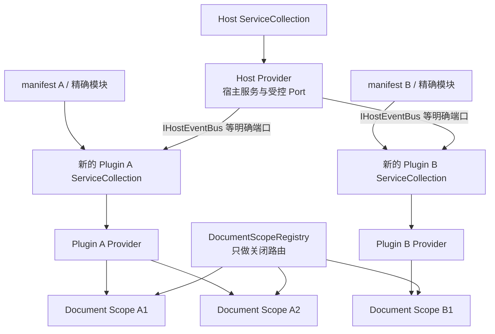

# Managed Plugin V2 G4：每插件独立容器记录

> 状态：已完成（2026-08-21）
> 适用范围：Host Provider、每插件 Provider、每 Document Scope、失败隔离与释放顺序
> 前置记录：[G3 manifest v2 与构建协议](./g3-manifest-v2-and-build-protocol.md)
> 发布边界：本阶段不运行 Windows Smoke、Windows CI、ReleaseAcceptance 或任何发布门禁

## 1. 结果摘要

G4 已把“服务描述符保护”改为真正的对象图所有权边界。Host 先建立自己的 Provider；每个通过
manifest v2 精确入口预检的插件随后从新的空 `ServiceCollection` 建立独占 Provider。插件不再取得
Host 集合的副本，也看不到前序插件描述符。模块配置、Provider 构建或宿主可见单例激活失败时，只释放
当前临时 Provider 并隔离该插件，其他插件继续组合。

每个成功插件拥有独立 `DocumentScopeManager`，所以插件 Document 及其 scoped 业务依赖来自同一个
插件 Provider。Host 的 `DocumentScopeRegistry` 只保存 Scope 所有者列表，把 Dock 关闭请求路由到实际
管理器；它不解析插件服务、不创建 Scope，也不拥有插件 Provider。退出顺序固定为：

1. 阻止新的宿主关闭链外对象继续存活，并关闭全部 Document Scope；
2. 对已经初始化的插件执行反向生命周期停止；
3. 按规范 PluginId 构建顺序的反方向释放插件 Provider；
4. 最后释放 Host Provider。

旧 `HostServiceDescriptorPolicy`、`PluginServiceRegistrationTransaction`、违规 DTO、增量提交和贡献旁路
扫描已经从生产代码删除。Microsoft DI 原生的开放泛型、keyed service、多实现、singleton、scoped 与
transient 注册均保留，不再用自定义事务模拟容器行为。

## 2. 所有权模型



对象图之间没有父容器回退、命名服务定位或任意 `IServiceProvider` 桥。`PluginProviderOwner` 的内部解析
入口只供 Legacy Registry 按已验证 PluginId 激活该插件已经声明的具体贡献类型；它没有进入 SDK，也不
提供给插件代码。

## 3. 生产组合顺序

`HostRuntime` 当前采用以下单线流程：

1. 严格发现 manifest v2、入口程序集和精确入口类型；
2. 构造可执行模块；单个模块构造失败只记录 `PLUGIN_MODULE_ACTIVATION_FAILED` 并排除自身；
3. 注册并建立 Host Provider，插件代码尚未取得任何服务集合；
4. `PluginProviderOwner` 按规范 PluginId 排序处理模块；
5. 为当前插件创建空集合，预置事件总线、插件自己的 Document Scope 基础设施和明确阶段桥；
6. 使用插件私有 `PluginRegistryBuilder` 调用一次 `Configure`；
7. 以 `ValidateScopes=true`、`ValidateOnBuild=true` 建立插件 Provider，并激活已声明具体服务；
8. 成功后才把该插件声明合并到全局 Builder、登记 Document Scope 管理器并保存 Provider 租约；
9. 全部插件处理完后，从各自 Provider 取得 Legacy Strategy/Lifecycle 并发布不可变 Registry；
10. 退出时按“Document → Lifecycle → Plugin Provider → Host Provider”释放。

临时 `PluginRegistryBuilder` 是普通内存声明集合，不是 DI 事务。失败时丢弃临时 Builder 即可，成功时
一次合并；没有复制或比较任何宿主 `ServiceDescriptor`。

## 4. SOLID 设计与朴素模式

本阶段以 SOLID 为首要规定，模式只取解决所有权所需的最小集合：

- 单一职责：`PluginProviderOwner` 只构建、定位宿主已声明对象并释放插件 Provider；
  `DocumentScopeManager` 只拥有一个容器中的 Document Scope；`DocumentScopeRegistry` 只做关闭路由；
  `PluginModuleCatalog` 只保存清单与模块对应关系；Registry Builder 只保存贡献声明。
- 开闭原则：新增插件只增加一个新的 Provider 租约，不修改 Host 服务白名单算法；新增插件私有的开放
  泛型、keyed 或多实现注册无需修改 Host。
- 里氏替换：每个 Provider 都使用 Microsoft DI 的同一构建与 Scope 语义；插件服务不因是否来自第一或
  后续插件而得到不同的解析规则。
- 接口隔离：插件只得到 `IHostEventBus`、`IDocumentScopeFactory`、`IDocumentLifetime` 等当前阶段真正
  需要的窄入口，不得到 Host `IServiceCollection` 或通用父 Provider。
- 依赖倒置：Dock 关闭依赖宿主内部的 Scope 路由职责，而不是依赖某个具体插件 Provider；插件业务继续
  依赖 SDK/Legacy 窄契约，不引用 Host internal 所有者。

使用的模式只有组合根、所有者、租约列表、显式端口和关闭路由。没有引入子容器框架、通用服务定位器、
装饰器链、自定义 DI 容器、反射式注册框架或事件驱动释放协议。

## 5. 阶段桥与未提前实施内容

四个业务插件仍实现 Legacy `IPluginModule`，并使用 Strategy、独立 View 映射与旧生命周期契约；这些由
G5–G12 分步迁移。G4 只改变 `IPluginRegistrationContext.Services` 的所有权语义，没有提前改变最终
UI SDK public API。

BiliDownloader Tool 仍读取 Legacy public `PluginLifecycleManager`。为保持 G4 的四插件可运行基线，插件
容器中存在一个只解析该精确类型的延迟阶段桥；它不复制 Host 描述符，也不提供任意父 Provider 访问。
G12 将按任务书改为插件内部 readiness 后删除此桥。事件总线则是明确受控 Host Port，由 Host 拥有，
插件 Provider 不取得其释放权。

G4 没有实现最终声明式 Descriptor Registry、Dock Adapter、Document v2、layout v2、internal 生命周期
Coordinator 或真实业务插件 V2 模型迁移，也没有删除 Legacy 项目。

## 6. 失败语义与诊断

| 失败位置 | 稳定码 | 当前行为 |
| --- | --- | --- |
| 精确模块公共构造失败 | `PLUGIN_MODULE_ACTIVATION_FAILED` | 排除当前入口，其他模块继续 |
| 模块 `Configure` 抛出 | `PLUGIN_SERVICE_REGISTRATION_FAILED` | 丢弃当前私有集合，不合并任何声明 |
| 私有 Provider 构建或贡献单例激活失败 | `PLUGIN_CONTAINER_BUILD_FAILED` | 释放临时 Provider，不发布当前插件 |
| 成功插件存在全局 Legacy Registry 冲突 | 既有结构码 | G5 前继续按既有全局校验阻断启动 |

前两类插件级错误的诊断处置为 `Continue`。异常对象只进入现有白名单收窄边界；异常正文、路径、URL、
payload 和凭据不会写入 UI、JSONL 或默认 Trace/stderr。

## 7. 测试与非发布门禁

专项入口：

```powershell
.\scripts\Test-PluginContainerIsolation.ps1 -Configuration Release
```

专项测试覆盖：

- 插件配置前后 Host `ServiceDescriptor` 数量、引用和顺序逐项不变；
- Host、插件 A、插件 B 之间不能解析彼此私有服务；
- 开放泛型、keyed service 和多实现保持 Microsoft DI 原生语义；
- 模块配置失败与 Provider 构建失败只隔离当前插件，成功插件 Registry 仍可用；
- 四个真实业务插件分别建立私有 Provider 并形成四个可用 Registry 快照；
- 插件 Provider 按规范 PluginId 顺序建立并逆序 Dispose，且早于 Host Provider；
- 每插件 Document Scope 解析自己的 scoped 对象，关闭一个不会释放另一个；
- 生产源码不再包含 Policy、Transaction、违规 DTO 或旁路检测符号。

2026-08-21 非发布验证结果：

| 门禁 | 结果 |
| --- | --- |
| G4 插件独立容器专项 | 8/8 |
| Host Unit | 172/172 |
| Host UI | 39/39 |
| Host Plugin | 158/158 |
| Host 合计 | 369/369 |
| Host 行 / 分支覆盖率 | 81.58% / 66.99% |
| 锁定还原与全解决方案 Release `-warnaserror` 构建 | 通过，0 warning / 0 error |
| BiliDownloader / DaTang / MySmallTools | 720 + 64 + 183 = 967/967 |
| 文档核心 / 正式门禁 | 通过 |

测试数量只记录本次执行事实，不是永久阈值；覆盖率继续由既有 baseline 自动判定，没有降低门槛。

## 8. 明确排除与发布边界

本轮不使用 AIFLOW，不读取、修改或生成 `.aiflow` 内容。没有运行 Windows CI、Windows 真实窗口
Smoke、Host v1/G14 发布总门禁、ReleaseAcceptance、联网/真实媒体、确定性发布复跑、上传、标签或任何
发布操作。G4 专项脚本只运行容器单元测试与源码结构扫描，摘要明确写入 `windowsCi=false`、
`releaseGate=false`。

## 9. 回滚边界与完成清单

回滚单位固定为“PluginProviderOwner、DocumentScopeRegistry、HostRuntime 组合顺序、Registry 按所有者
解析、Document Scope 路由、失败诊断、删除旧保护事务、测试、脚本和文档”。如需撤销，应整体回到 G3，
不得临时把插件描述符重新追加到 Host 根集合，也不得保留新旧两条容器生产路径。

- [x] Host Provider 在执行模块 Configure 前建立，且不包含插件私有描述符。
- [x] 每个插件从新的空集合建立独立 Provider，不读取前序插件服务。
- [x] 开放泛型、keyed、多实现和标准生命周期保持 Microsoft DI 原生行为。
- [x] 配置、Provider 构建与模块构造失败只隔离所属插件。
- [x] 每插件 Document Scope 可独立说明、关闭和释放。
- [x] 插件 Provider 按确定顺序构建、逆序释放，并晚于 Document、早于 Host Provider。
- [x] Policy、Transaction、违规 DTO、旁路扫描和旧生产文件均已删除。
- [x] 四个真实插件经过独立 Provider 组合验证。
- [x] 专项门禁、三套 Host 回归、覆盖率和文档同步齐全。
- [x] 未使用 AIFLOW，未运行 Windows CI、Smoke 或任何发布门禁。
