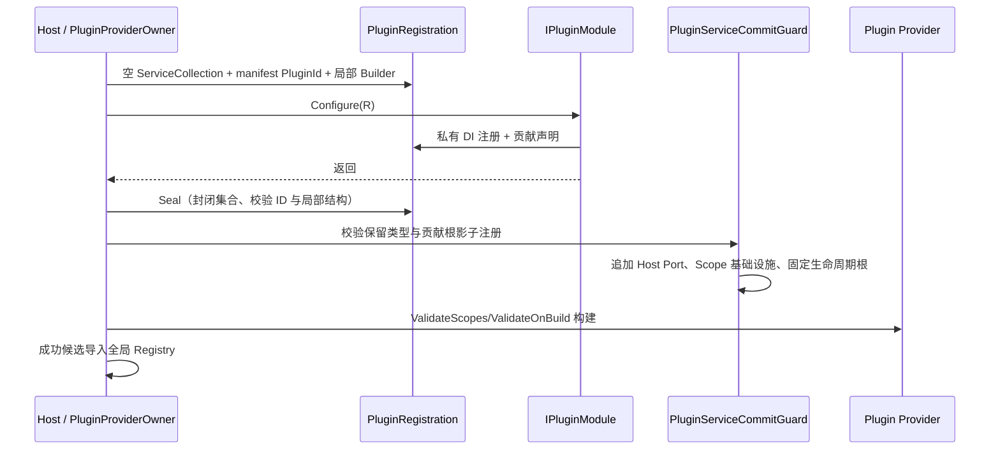

# V3 G4 插件注册所有权与 ID 归属

> 状态：已完成
>
> 完成日期：2026-08-22
>
> 所属任务：[MyAvaloniaManagement V3 破坏式架构重构任务书](../../design/host-v3-breaking-refactor-plan.md#g4收紧插件注册所有权与-id-归属已完成)

## 1. 结果

G4 已把 Host Port、贡献根生命周期和 Contribution ID 从文档约定变为 Provider 构建前的可执行约束。
每个插件的 `Configure` 现在从真正空的 `ServiceCollection` 开始，只能修改自己的私有描述符；
Document、Tool 与 Lifecycle 根描述符由 `PluginRegistration` 暂存为 Host 拥有的冻结事实，不进入插件
可写集合。模块返回、注册窗口 Seal 且全部校验通过后，Host 才一次性追加端口、Document Scope
基础设施和固定生命周期贡献根。

当前四插件无需修改任何 Plugin、Document、Tool 或 Creation Intent ID，也没有手工重复登记贡献根。
本阶段没有删除 `IHostEventBus`；其消息所有权迁移仍属于 G5。manifest schema 2、Document envelope
schema 2、`layout-v2.json`、默认数据根 `v2`、三个插件内容 schema 和全部用户数据均未改变。

## 2. 最终组合时序



`Clear`、`Remove`、`Replace` 仍可用于插件自己的私有描述符；它们无法观察尚未提交的 Host 描述符。
模块保存的 `Services` 引用在 Seal 后永久拒绝写入。没有复制宿主集合、父 Provider fallback、描述符
差异事务、自定义 DI 容器或服务定位器。

## 3. 所有权规则

Host 最终提交并独占以下协议底座：

- `IHostEventBus`、`IPluginWindowInteraction`；
- `DocumentLifetime` 与 `IDocumentLifetime`；
- `DocumentScopeManager`；
- 每个已声明 Document 的 scoped 根类型；
- 每个已声明 Tool 和 Lifecycle 的 singleton 根类型。

插件以普通、keyed、实例、工厂或多注册形式使用上述 ServiceType 均不能绕过检查。只要 ServiceType
归 Host 或等于当前候选的贡献根，就会在 Provider 构建前拒绝整个插件候选。插件私有的
singleton/scoped/transient、开放泛型、keyed、多实现、实例和工厂注册继续使用 Microsoft DI 原生语义。

ID 归属采用精确点分边界：Document 必须匹配 `{PluginId}.document.{非空后缀}`，Tool 必须匹配
`{PluginId}.tool.{非空后缀}`。因此 Host ID、另一个插件 ID、相似字符串前缀、错误贡献种类和缺失
后缀都会在局部 Seal 失败。全局重复检查仍保留，内部绕过局部入口的夹具证明其仍会排除全部冲突所有者。

## 4. 四插件事实矩阵

| 插件 | 规范 PluginId | Document | Tool | Lifecycle | G4 结果 |
| --- | --- | ---: | ---: | ---: | --- |
| MyPlugTest | `myavalonia.plugin.my-plug-test` | 4 | 1 | 0 | ID 不变，通过最终提交 |
| DaTangAccountingHelpPlug | `myavalonia.plugin.datang-accounting-help` | 2 | 0 | 0 | ID 不变，通过最终提交 |
| MySmallTools | `myavalonia.plugin.my-small-tools` | 4 | 0 | 0 | ID 不变，通过最终提交 |
| BiliDownloader | `myavalonia.plugin.bili-downloader` | 1 | 1 | 1 | ID 不变，通过最终提交 |

四插件共 11 个 Document、2 个 Tool、1 个 Lifecycle；Creation Intent 仍只在所属 Document 内使用单段
kebab-case，不参与跨插件命名空间判断。

## 5. 稳定诊断与失败原子性

G4 新增四个稳定码：

| 错误码 | 条件 | 处置 |
| --- | --- | --- |
| `PLUGIN_HOST_SERVICE_REGISTRATION_FORBIDDEN` | 普通或 keyed 影子注册 Host 保留服务 | 当前插件 `Continue` 隔离 |
| `PLUGIN_CONTRIBUTION_SERVICE_REGISTRATION_FORBIDDEN` | 手工登记已声明贡献根 | 当前插件 `Continue` 隔离 |
| `DOCUMENT_ID_OWNER_MISMATCH` | Document ID 越权或种类错误 | 当前插件 `Continue` 隔离 |
| `TOOL_ID_OWNER_MISMATCH` | Tool ID 越权或种类错误 | 当前插件 `Continue` 隔离 |

确定性所有权错误只投影稳定码、manifest PluginId、入口程序集及合法 Contribution ID，不携带异常对象。
默认 UI、JSONL、Trace/stderr 不包含异常正文、服务实现详情、路径或 payload。普通模块异常仍使用
`PLUGIN_SERVICE_REGISTRATION_FAILED`，Provider 构建失败仍使用 `PLUGIN_CONTAINER_BUILD_FAILED`。
违规候选不会构建 Provider、构造 Lifecycle、登记 Document Scope 或导入部分 Registry；合法插件继续发布。

## 6. SOLID 与朴素设计

- **SRP**：`PluginRegistration` 管理声明窗口与冻结事实；`PluginRegistryBuilder` 管理贡献元数据；
  `PluginServiceCommitGuard` 只做所有权校验和 Host 最终提交；`PluginProviderOwner` 只编排 Provider
  候选和租约；诊断投影由独立具体协作者承担。
- **OCP**：新增插件私有服务和 Microsoft DI 原生注册形态无需修改 Guard；新增声明式根由冻结描述符
  自动进入同一校验与提交链。
- **LSP**：所有合法插件仍使用标准 `IServiceCollection`/`ServiceProvider` 行为，第一和后续插件没有
  不同解析规则。
- **ISP**：插件只看到 `IPluginRegistration`、私有 `Services` 和实际需要的 SDK 窄端口，不得到 Host
  Provider、原始 Host 集合或所有权控制接口。
- **DIP**：插件业务依赖 SDK 契约；Host internal 组合根选择并提交具体实现，插件不引用 Host 类型。
- **朴素实现**：只新增一个具体 Commit Guard 和一个诊断投影协作者，没有接口套接口、Policy DSL、
  中间件链、事件驱动提交或第三方模式库。

所有新增类型、关键提交顺序和失败原子性均使用中文 XML/行内注释；注释解释所有权理由，不逐行复述赋值。

## 7. 测试、覆盖率与制品

专项入口：

```powershell
.\scripts\Test-PluginRegistrationOwnership.ps1 -Configuration Release -NoRestore
```

专项串行通过 **58/58**：Host 26、插件生产组合 32。覆盖空集合、Seal 后不可写、Clear/Remove 隔离、
普通/keyed/多注册保留端口、三种贡献根生命周期覆盖、精确 ID 归属、稳定脱敏诊断、合法 Microsoft DI
能力、Provider 失败隔离、全局重复纵深防线和四个真实插件完整组合。机器摘要位于
`artifacts/test-results/PluginRegistrationOwnership/summary.json`。

完整 Host 为 Unit 179、UI 56、Plugin 203，共 **438/438**；行覆盖率 **83.41%**、分支覆盖率
**69.25%**，高于 G0 的 83.24%/68.98%，重点文件门槛全部通过。独立全量测试为 PluginSdk **37/37**、
MyPlugTest **3/3**、DaTang **62/62**、BiliDownloader **718/718**、MySmallTools **184/184**。

Release 全解决方案 `warnaserror` 构建为零警告、零错误；v3 API 保持 Core 130/UI 46，7 个破坏性
变异负例与独立 Core/UI 包消费通过。G2 修订保存 **159/159**、G3 互斥激活 **143/143** 回归通过。
四个 Managed Plugin 两次隔离构建的 ZIP 逐插件确定一致，包契约负例、最终 ZIP Host 加载和诊断脱敏
源码门禁通过。

## 8. 非发布边界

专项摘要固定记录：

```text
aiflow=false
windowsCi=false
windowsSmoke=false
releaseAcceptance=false
releaseGate=false
publishable=false
```

本阶段没有读取、初始化或调用 AIFLOW，没有运行 Windows CI/Smoke、ReleaseAcceptance、任何 V1/V2/V3
发布门禁、真实账号或真实媒体门禁，也没有签名、上传、推送、标签或发布操作。`Release` 仅表示编译配置。

## 9. 回滚边界

G4 必须整体回到 G3：空集合组合时序、注册入口冻结描述符、Commit Guard、ID 归属校验、四个稳定诊断、
测试、专项脚本、SDK 行为说明和当前文档一起回滚。不得只对某个插件、保留类型、keyed 注册或 ID 前缀
放宽规则。G4 不改变任何磁盘格式，因此回滚不迁移、删除、覆盖或降级 `.mamdoc`、布局或用户数据。
