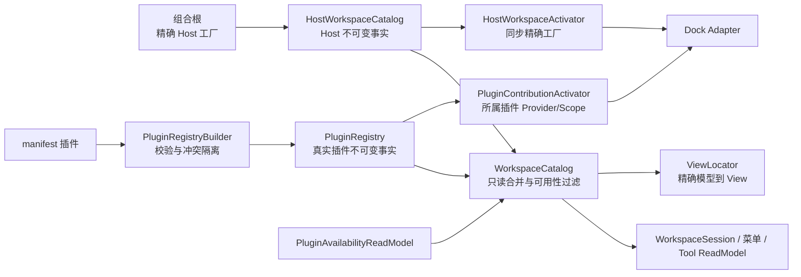
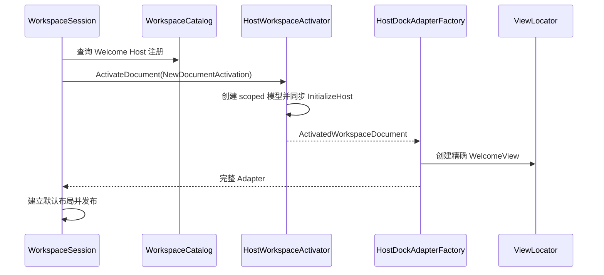

# V3 G7：分离 Host Catalog 与 Plugin Registry

> 完成日期：2026-08-22
> 状态：已完成；本记录是开发期非发布证据，不是发布批准。
> 前置基线：[G6 Workspace Session 与 Dock Factory](./g6-workspace-session-and-dock-factory.md)

## 1. 目标与结论

G7 删除了“Host 内建界面是假插件”这一临时建模。Welcome 与文件系统、插件菜单、插件状态、工具管理
四个 Host Tool 现在由 `HostWorkspaceCatalog` 独立声明；`PluginRegistry` 只接收通过 manifest 发现并
成功组合的真实插件。`WorkspaceCatalog` 只读合并两个来源，供 Workspace、菜单、Tool 投影与 View 定位
查询，但不拥有任何 Provider，也不负责创建模型。

本次没有改变 Core/UI Plugin SDK public API，没有新增 NuGet 包、服务定位器、事件总线、规则引擎或
公共 Workspace Context。稳定字符串 ID、manifest/envelope/layout schema 2、`layout-v2.json` 与 v2
数据根全部保持不变。

## 2. 设计思路与职责图



这里刻意只采用不可变目录、构造注入、两个明确激活器和已有 Factory Adapter：

- `HostWorkspaceCatalog` 只保存 Host Descriptor、模型类型、View 类型、精确 View 工厂和精确模型工厂；
- `PluginRegistry` 只保存真实插件的身份、Document、Tool、View 与 Lifecycle 声明；
- `WorkspaceCatalog` 只做查询投影，不创建对象，不解析服务，不复制生命周期状态机；
- `HostWorkspaceActivator` 只能按已冻结 Host ID 调用精确工厂；
- `PluginContributionActivator` 只能先由 Registry 确认真实 owner，再进入对应插件 Provider/Scope；
- `HostDockAdapterFactory` 接收来源无关的激活结果并承担 Dock 投影，不判断伪 owner。

## 3. 类型与所有权

| 对象 | 内容 | 所有者与释放者 |
| --- | --- | --- |
| `HostWorkspaceCatalog` | Welcome、四个 Host Tool、精确 View 映射 | Host 根容器；构造后不可变 |
| `PluginRegistry` | manifest 插件、插件 Document/Tool/View/Lifecycle | Host 根容器；不含 Host 项和 Provider |
| `WorkspaceCatalog` | 两个目录的只读查询视图 | Host 根容器；不持有模型或 Provider |
| Host Welcome 模型 | scoped `WelcomeViewModel` 与关闭令牌 | `DocumentScopeManager`；Adapter 关闭或失败时释放 |
| 四个 Host Tool 模型 | Host singleton | Host Provider；Tool Adapter 只释放 View |
| 插件 Document | 所属插件 Scope | 插件 `DocumentScopeManager`；先取消再释放 Scope |
| 插件 Tool | 所属插件 singleton | 插件 Provider；Tool Adapter 只释放 View |
| Host/插件 View | 每次 Adapter 创建的精确 Control | Adapter；失败回滚与关闭时断开并释放引用 |

Host 与插件使用两种明确的注册记录。共同接口只表达 Workspace 真正需要的 Descriptor、模型类型和 View
事实；Host 记录没有可空 `PluginId`，插件记录必须带真实 manifest owner。可持久化 Document 继续保留
原始 `PluginDocumentRegistration`，所以 envelope 所有权校验没有被“来源无关”投影削弱；Welcome
从类型上就不能进入插件持久化路径。

## 4. 激活与失败时序

### 4.1 Welcome 同步创建



Welcome 不再借用插件异步初始化路径。同步 Host 初始化失败会立即释放 Scope；View 构造、类型错配或
DataContext 建立失败会释放 View/Adapter/Scope，默认布局不会半发布。默认布局也不再通过检查
`ValueTask.IsCompletedSuccessfully` 猜测插件初始化是否“碰巧同步”。

### 4.2 Tool 隔离

Host 与插件 Tool 都先完整创建模型、View 和 Adapter，再加入工作区集合。单个 Tool 失败只丢弃该 Tool，
释放已经创建的 View，并写入白名单脱敏诊断；其他 Tool 与 Welcome 继续建立。规范 Tool ID 是唯一
Locator 键，不再发布 `Plug` 别名。

### 4.3 插件失败与冲突

插件初始化失败、停止或不可用时，`WorkspaceCatalog` 只过滤该插件贡献；Host 项绕过插件可用性模型，
始终可查询。跨插件同一 Document/Tool ID 或模型 View 映射冲突时，Builder 隔离全部冲突插件，不再有
“Host 优先”的特殊分支。Host 与插件事实若在 Workspace 合并边界碰撞，则构造立即失败，避免双目录发布。

## 5. SOLID 取舍

- **SRP**：Host 声明、插件声明、Workspace 合并、Host 激活、插件激活和 Dock 投影分别由独立类型负责；
  Catalog 不再同时承担 Provider 路由或生命周期判断。
- **OCP**：新增插件贡献只进入插件 Registration/Builder；新增 Host 项只修改组合根中的 Host Catalog
  声明。两个方向互不修改对方协议。
- **LSP**：Dock Adapter 仍只观察 `IPluginDocument`/普通 Tool 模型和来源无关激活结果；Host 与插件
  注册投影遵守同一最小只读语义，没有用 null owner 改变前置条件。
- **ISP**：三个 Workspace 注册接口分别覆盖 Document、Tool、View 所需最小事实，没有建立万能 Catalog
  或通用创建接口。
- **DIP**：Workspace/UI 依赖只读 `WorkspaceCatalog`；插件激活依赖 Registry 与插件 Provider 所有权；
  Host 激活依赖精确目录工厂。高层工作区不依赖具体 DI 容器查询。

这些选择优先保证依赖方向清晰。G7 没有为了复用而引入抽象工厂层级、Visitor、事件驱动刷新或联合类型
框架；两类来源只有在确实共享的只读投影上相交。

## 6. 删除面与兼容边界

已删除：

- `HostExtensionIds.V2Owner` 与所有生产/测试 Host owner 特判；
- 组合根构造 Host `PluginRegistration` 的临时路径；
- `PluginServiceCommitGuard.AppendHostContributions`；
- `PluginContributionActivator` 的 Host Provider、Host 可用性和伪 owner 分支；
- `DockableLocator["Plug"]`、Session 对应分支和测试替身；
- `CreatePluginDocument`、`ActivatedPluginDocument`、`ActivatedPluginTool` 等来源偏置命名。

保持不变：

- `myavalonia.host.*` Document/Tool 字符串；只把内部常量名改为无版本语义；
- Plugin SDK v3 Shipped/Unshipped public 成员文本；
- 四个业务插件生产代码、Descriptor、Provider、生命周期和可用性语义；
- manifest schema 2、Document envelope schema 2、插件内容 schema、layout schema 2、文件名和数据根。

## 7. 自动化测试与实际证据

专项入口：

```powershell
.\scripts\Test-HostCatalogPluginRegistry.ps1 -Configuration Release -NoRestore
```

脚本串行运行完整三组 Host 测试，生成 TRX、三份独立 Cobertura、合并报告和
`artifacts/test-results/HostCatalogPluginRegistry/summary.json`。2026-08-22 实际结果：

| 套件 | 通过 | 失败 | 跳过 |
| --- | ---: | ---: | ---: |
| Host Unit | 188 | 0 | 0 |
| Headless UI | 56 | 0 | 0 |
| Plugin / Dock | 204 | 0 | 0 |
| 合计 | **448** | **0** | **0** |

Host 合并覆盖率为行 **84.04%**、分支 **70.26%**，均高于 G0 的 83.24% / 68.98%。关键文件行覆盖率：

| 文件 | 行覆盖率 |
| --- | ---: |
| `HostWorkspaceCatalog.cs` | 100.00% |
| `WorkspaceCatalog.cs` | 96.23% |
| `HostWorkspaceActivator.cs` | 100.00% |
| `PluginContributionActivator.cs` | 100.00% |

专项覆盖零插件、插件失败、目录合并、命名空间与跨插件冲突、精确 View 映射、Host/插件激活隔离、
Welcome 同步初始化与失败回滚、Tool 失败隔离、Scope/View 释放、规范 Locator 和 layout-v2 往返。
结构扫描阻止 `V2Owner`、Host `PluginRegistration`、Registry/Availability Host 特判、`Plug` Locator、
Catalog 服务容器依赖和公共 Workspace Context 回流。

此外已通过：锁定还原、全解决方案 Release `TreatWarningsAsErrors`（0 警告/0 错误）、G2 159、G3 143、
G4 59、G5 165、G6 447，v3 SDK API 兼容与 NuGet 消费、Host 诊断脱敏。四插件开发期专项分别为
MyPlugTest **94**、DaTang **157**、BiliDownloader **822**、MySmallTools **279**；每个插件均生成两次
一致的 3.0.0 测试 ZIP，并从解压目录经真实 Host Loader 加载。四个旧 V2 脚本同时改为动态读取唯一
manifest/ZIP 名称，不再硬编码 `2.0.0`。

## 8. 非发布声明

专项摘要固定写入：

```text
aiflow=false
windowsCi=false
windowsSmoke=false
releaseAcceptance=false
releaseGate=false
publishable=false
```

本轮没有读取、初始化或修改 AIFLOW；没有运行 Windows CI、Windows Smoke、任何 ReleaseAcceptance
可执行测试、发布验收、发布门禁、签名、上传或标签。`Release` 仅表示本地编译配置，不能作为发布批准。

## 9. 回滚边界

G7 必须把生产代码、测试、`Test-HostCatalogPluginRegistry.ps1` 和本文作为一个整体回滚到 G6。禁止只
恢复 `V2Owner`、`Plug` 别名或 Host Registry 特判，也禁止让 Host Catalog 与 Plugin Registry 同时发布
同一 Host 项。回滚不删除用户 v2 数据、不修改 schema 或稳定 ID；四插件包可继续由 G6 Host 读取。
