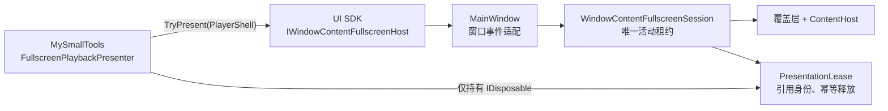
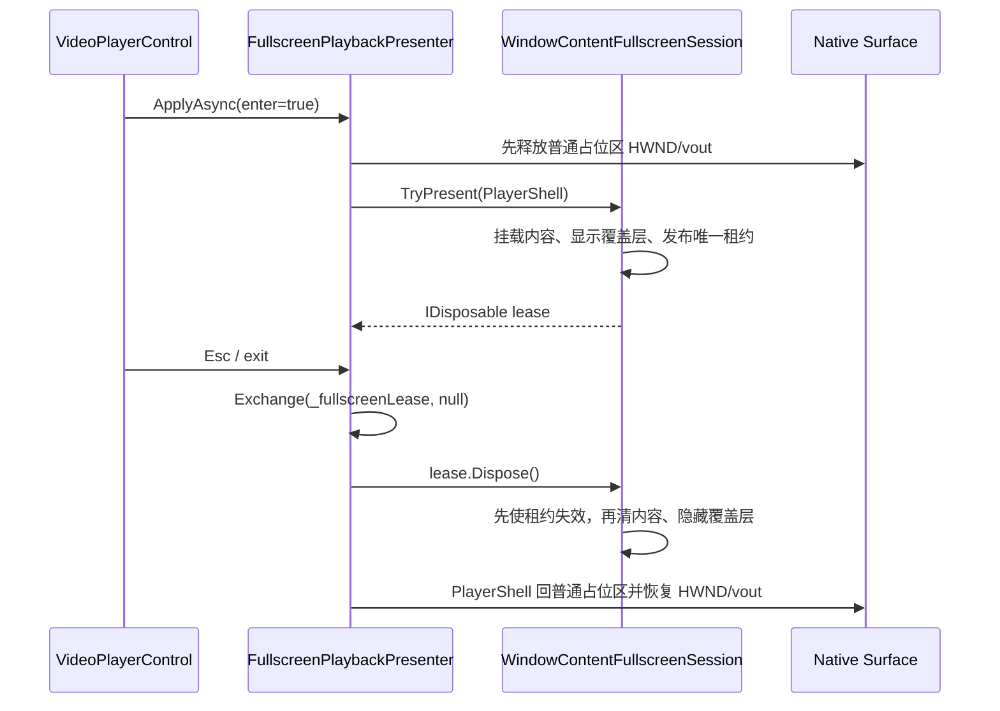

# V3 G8：全屏租约与 Host V3 骨架

> 完成日期：2026-08-22
>
> 状态：已完成；本记录是开发期非发布证据，不是发布批准。
>
> 前置基线：[G7 Host Catalog 与 Plugin Registry](./g7-host-catalog-and-plugin-registry.md)

## 1. 结论

G8 将 UI SDK 的全屏端口破坏式收口为 `IDisposable? TryPresent(Control content)`。Host 通过一个
`internal sealed WindowContentFullscreenSession` 维护唯一活动租约；MySmallTools 只持有标准
`IDisposable`，退出、失败、View 卸载、控件释放或 Document 关闭时交换并释放租约。活动源码已删除
owner 参数与 `TryRestore`，没有兼容转发、双接口、服务定位器、事件总线或额外状态机。

本阶段保持产品、Core/UI SDK 和四插件为未发布 `3.0.0`；manifest、Document envelope、layout schema
仍为 2，`layout-v2.json` 和默认数据根 `v2` 不变。SECVID03、LibVLC 播放业务、加解密和插件内容
schema 均未修改。

## 2. 设计与所有权



职责保持朴素：

- SDK 端口只表达“尝试展示并返回释放令牌”，不暴露 Window、Dock 或 owner；
- `MainWindow` 只把窗口 `Closed` 和端口调用委托给会话，仍独立负责可取消关闭协调；
- 全屏会话只拥有覆盖层、ContentHost、宿主有效性和唯一活动租约；
- 私有租约以引用身份回调会话，旧租约不能释放之后创建的新租约；
- MySmallTools 继续使用已有 `SemaphoreSlim` 和请求修订号，不复制 Host 状态机。

Host 只是暂借插件 `Control`。插件仍拥有控件、播放器和业务资源；租约释放只负责把内容从覆盖层
摘下并隐藏覆盖层，不会 Dispose 插件控件。

## 3. 线程亲和、回滚与迁移时序

`TryPresent` 和有效租约的首次 `Dispose` 必须在 Avalonia UI 线程执行。错误线程调用立即抛出，且
不会消耗租约；调用者仍可回到 UI 线程完成释放。已经失效或已经释放的租约再次 Dispose 为无操作。

### 3.1 正常进入与退出



先使租约失效再改视觉树，可阻止 `DetachedFromVisualTree` 重入时重复释放当前租约。内容挂载失败时，
会话清空 Content、隐藏覆盖层并保持“无活动租约”，随后传播原异常；MySmallTools 在边界处恢复唯一
PlayerShell 和原生表面，并只向 UI 返回固定脱敏 `PlaybackFailure`。

### 3.2 Document 与窗口关闭

Document 在租约有效时直接关闭，View 的卸载/Dispose 会交换并释放租约，随后恢复 PlayerShell、销毁
HWND，最后由 Document Scope 释放播放器和加密流。Host 最终关闭或 ContentHost 被销毁时，会话自动
失效当前租约；插件稍后重复释放旧令牌仍是安全无操作。可取消的 `Closing` 不做提前失效，只有真正
`Closed` 才兜底清理。

真实压力测试还发现 Avalonia `KeyboardNavigation.TabOnceActiveElement` 会在 Dock `ItemsControl` 上
保留刚关闭的聚焦 View。`DocumentControlRecycling` 现在只在最终关闭时、且只对指向待关闭控件子树的
值清除该引用，再摘除视觉父级；普通标签切换的 View 复用和其他 Dock 的焦点记忆不受影响。

## 4. SOLID 取舍

| 原则 | G8 落点 |
| --- | --- |
| SRP | MainWindow 适配窗口事件；全屏会话只维护租约状态；Presenter 只协调播放器视图迁移。 |
| OCP | 任何展示者都可竞争同一端口，不需新增 owner 类型或 Host 判断分支。 |
| LSP | 每个成功租约都遵守排他、幂等、错误线程不消耗、自动失效后无操作的相同语义。 |
| ISP | 插件只看到一个 `TryPresent(Control)` 和标准 `IDisposable`。 |
| DIP | MySmallTools 依赖 UI SDK 端口，不依赖 MainWindow、Dock 或全屏会话实现。 |

没有为“可能的未来需求”引入通用租约框架、多层工厂或消息器。具体会话、私有具体租约、构造注入和
显式委托足以表达当前所有权。

## 5. 删除面与兼容边界

- 删除 `TryPresent(Control, object owner)`、`TryRestore(object owner)` 及 Host/MySmallTools owner 状态；
- UI SDK v3 Unshipped 只保留 `TryPresent(Control) -> IDisposable?`，当前 UI 表面为 45 条；
- v2 Shipped 历史文本保持原样，继续记录旧 owner API；
- SDK 包消费正例验证新租约；旧二参数调用与 `TryRestore` 作为编译失败负例；
- 活动源码扫描禁止 owner API、双全屏接口、Host 实现泄漏和插件保存 Host 引用回流。

## 6. 实际测试证据

`scripts/Test-FullscreenLeaseHostV3.ps1 -Configuration Release -NoRestore` 实际通过：

| 组 | 通过 |
| --- | ---: |
| Plugin SDK | 37 |
| Host Unit | 188 |
| Headless UI | 59 |
| Plugin / Dock | 204 |
| MySmallTools Unit | 184 |
| 合计 | **672/672** |

三份 Host Cobertura 合并结果为行覆盖率 **84.15%**、分支覆盖率 **70.30%**，高于 G0 的
83.24% / 68.98% 下限；`WindowContentFullscreenSession.cs` 行覆盖率为 **96.43%**，高于 90% 专项下限。

本地 Windows x64 真实媒体 Harness 固定执行 **20/20** 轮，每轮均为“真实播放 -> 进入全屏 -> 不先
退出全屏而直接关闭 Document”。报告耗时 24,007 ms，最终 `LiveLeases`、`LivePlayers`、
`LiveMediaInputs`、`LiveEncryptedStreams`、`ActiveSurfaceRestores`、`CachedPlaintextChunks`、
`LiveNativeDispatchers`、`LiveResourceReapers` 全部为 0；关闭的 Document、View、已释放加密流弱引用
存活数和意外顶层窗口也全部为 0。

此外，锁定还原、V3 API 兼容、SDK nupkg 正/负消费、诊断脱敏、G2–G7 专项均通过；四插件全量测试
分别为 MyPlugTest 11、DaTang 62、BiliBili 726、MySmallTools 184 项通过；全解决方案 Release
零警告构建在文档门禁完成后再次执行。TRX、Cobertura、Harness JSON 与摘要位于
`artifacts/test-results/FullscreenLeaseHostV3/`，数量和覆盖率均从制品读取。

## 7. 非发布声明与回滚

```text
aiflow=false
windowsCi=false
windowsSmoke=false
releaseAcceptance=false
releaseGate=false
publishable=false
```

本阶段没有调用 AIFLOW、Windows CI、Windows Smoke、ReleaseAcceptance、Accept/Approve/Release
脚本或 Host 发布门禁。本地 Windows x64 真实媒体 Harness 是开发期资源门禁，不构成发布验收。

G8 的生产代码、SDK API、测试、专项脚本和文档必须作为一个整体回滚到 G7。不能只恢复 owner 接口，
也不能同时保留 owner API 与租约 API；任何回滚都必须恢复匹配的 Host、MySmallTools 和包消费测试。
