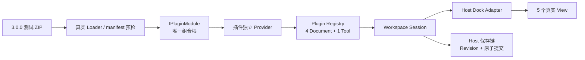
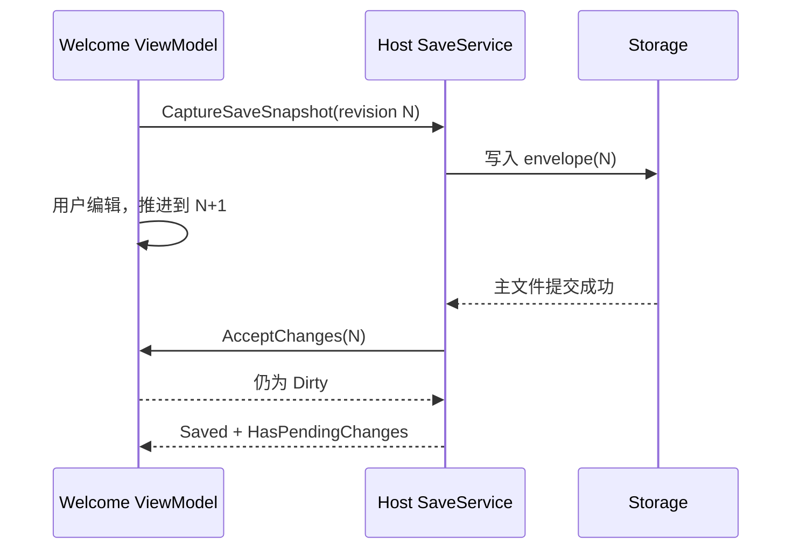

# V3 G9：MyPlugTest V3 验收

> 完成日期：2026-08-22
>
> 状态：已完成；本记录是开发期非发布证据，不是发布批准。
>
> 前置基线：[G8 全屏租约与 Host V3 骨架](./g8-fullscreen-lease-and-host-v3-skeleton.md)

## 1. 结论

G9 使用仓库中最小的真实业务插件完成 V3 消费者验收。MyPlugTest 的 4 个 Document、1 个 Tool 和
5 个 View 继续由一个 `IPluginModule` 声明；Document 进入所属插件的独立 Scope，Tool 由插件 Provider
持有 singleton。Welcome 的修订保存、严格 content schema 1、私有消息订阅和全部 Headless View 现在
都通过最终 `WorkspaceSession`、Registry、插件 Provider 与 Host Dock Adapter 验证。

本阶段没有重写网络、Excel 或界面业务，没有修改 Plugin SDK public API、稳定 ID、manifest schema 2、
Document envelope schema 2、layout schema 2、`layout-v2.json` 或默认 `v2` 数据根。活动的 V2 测试类名
与旧 V2 专项脚本已删除；V2 API 文本和 V2 G9 历史记录仍只作为审计证据保留。

## 2. 设计思路与职责



职责保持朴素：

- 模块只登记插件私有服务和声明式贡献，不解释 Dock、保存路径或 Host 生命周期；
- Welcome 模型只拥有插件内容、修订号和 Dirty 状态，Host 只确认实际写入的捕获修订；
- `TestWelcomeDocumentContentCodec` 只负责严格 schema 1 编解码，恢复先完整验证再一次提交；
- `MyPlugTestEventBus` 只在当前插件 Provider 内同步投递，订阅令牌由各 Document Scope 释放；
- Workspace 只负责创建、发布、关闭和 Tool 显隐提交，View 与 Scope 仍由 Adapter/Provider 所有。

没有增加通用消息框架、Repository、Manager、服务定位器、公共 Workspace Context 或 G9 专用生产接口。
现有 Microsoft DI、普通不可变 DTO、严格 JSON、构造注入和标准 `IDisposable` 已足够表达所有权。

## 3. 保存、消息与 Workspace 时序

### 3.1 保存期间再次编辑



专项测试在第一次主文件写入处设置受控门闩，精确插入一次新编辑。旧修订写盘后仍保持 Dirty 和 Tab
修改标记；第二次保存捕获最新修订后才清脏。Host 不读取插件内部计数，也不把磁盘成功误当成“当前
内存内容已全部保存”。

### 3.2 消息订阅与关闭

两个消息接收 Document 经 Workspace 发布后分别持有订阅。后台线程发布事件时，模型在 UI Dispatcher
提交集合更新；关闭其中一个标签必须经过 Dock 到 Workspace 的回调链，Scope 释放订阅令牌。后续消息
只进入仍存活的 Document，`object` 订阅不会收到精确 DTO，插件外 Provider 也不能解析该消息器。

### 3.3 Tool 与 View

默认布局通过 Workspace 创建插件 Tool。隐藏和恢复操作保持同一个 Adapter 与 singleton 模型；4 个
Document 均通过 Workspace 原子发布，5 个 View 的 `DataContext` 与关键 XAML 绑定在真实 Headless
Avalonia 中验证。三个非持久化 Document 在 Workspace 激活校验处拒绝 Restore，不会发布半初始化标签。

## 4. SOLID 对照

| 原则 | G9 落点 |
| --- | --- |
| SRP | 模块负责组合，Codec 负责内容协议，消息器负责插件内投递，Workspace 负责工作区提交，Host 保存服务负责文件事务。 |
| OCP | 4 Document 与 1 Tool 使用既有声明接口；Host 没有新增 MyPlugTest 类型分支或 public API。 |
| LSP | 所有 Document 遵守统一激活/关闭契约；可持久化 Welcome 额外遵守 Revision 快照语义，不削弱基类前置条件。 |
| ISP | 插件只依赖 Core/UI 的 Document、生命周期和贡献窄接口；内部消息器只有 Publish/Subscribe。 |
| DIP | ViewModel 依赖 URL、Excel、消息和关闭令牌端口，不依赖 Flurl 静态调用、Window、Dock 或 Host 容器。 |

## 5. 删除面与兼容边界

已删除或收口：

- 活动测试类中的 V2 阶段命名及其门禁过滤器；
- 活动 V2 专项脚本和旧结果目录约定；
- UI 验收直接调用 `IHostDockableFactory` 创建贡献的旁路；
- 最终 ZIP 只到 Registry、不验证 Workspace 可见性的不足。

结构门禁阻止 Legacy、Dock、Host 实现、Newtonsoft、旧保存契约、Host EventBus、静态 Messenger、
`IServiceProvider`、过渡构建开关以及 `Files`/`Plug` Locator 回流。V2 SDK 区间仍在插件代码执行前拒绝；
没有双 Loader、兼容转发或旧 ID 别名。

V2 G9 文档中的旧脚本命令是当时真实证据，文档门禁只对“该历史文档 + 该已删除路径”建立精确例外；
当前文档或其他历史文档重新引用旧入口仍会失败。

## 6. 实际自动化证据

专项入口：

```powershell
.\scripts\Test-MyPlugTestV3.ps1 -Configuration Release -NoRestore
```

实际结果：

| 套件 | 通过 | 失败 | 跳过 |
| --- | ---: | ---: | ---: |
| Plugin SDK | 37 | 0 | 0 |
| Host Unit | 188 | 0 | 0 |
| Headless UI | 60 | 0 | 0 |
| Plugin / Dock | 204 | 0 | 0 |
| MyPlugTest | 11 | 0 | 0 |
| 最终 ZIP → Workspace | 1 | 0 | 0 |
| 合计 | **501** | **0** | **0** |

三份 Host Cobertura 合并结果为行覆盖率 **84.39%**、分支覆盖率 **70.58%**，高于 G0 的
83.24% / 68.98% 下限。三份 MyPlugTest 覆盖率合并后，`MyPlugTestEventBus.cs` 行覆盖率为
**98.15%**，`TestWelcomeDocumentContentCodec.cs` 为 **100.00%**，均高于 90% 专项下限。

两次隔离构建均生成 11 文件 `MyPlugTest-3.0.0-win-x64.zip`，逐文件路径、长度、SHA-256 与归档
SHA-256 完全一致；归档摘要为
`D52C87120D7CE0483771BB9592DB72138415C120160CFD2B497C2836F9C4702C`。解压后的 manifest 为
schema 2、插件版本 3.0.0、SDK `[3.0.0,4.0.0)`，真实发现、加载上下文、模块组合、Registry 和
Workspace 目录最终发布 4 Document + 1 Tool。机器摘要位于
`artifacts/test-results/MyPlugTestV3/summary.json`。

## 7. 非发布声明与回滚

```text
aiflow=false
windowsCi=false
windowsSmoke=false
releaseAcceptance=false
releaseGate=false
publishable=false
```

本阶段没有读取、初始化或修改 AIFLOW；没有运行 Windows CI、Windows Smoke、ReleaseAcceptance、
Accept/Approve/Release 脚本、发布门禁、签名、上传或标签。`Release` 仅是本地编译配置，两个 ZIP
只用于确定性和真实加载验证，不是发布候选。

G9 的回滚单位是 MyPlugTest 活动测试、专项脚本、当前事实文档以及因验收暴露而产生的插件修正；G0–G8
平台能力不回滚。回滚后 V3 Host 仍不得加载 V2 MyPlugTest ZIP，也不得增加双协议适配、宽松内容读取或
旧稳定 ID 别名。
