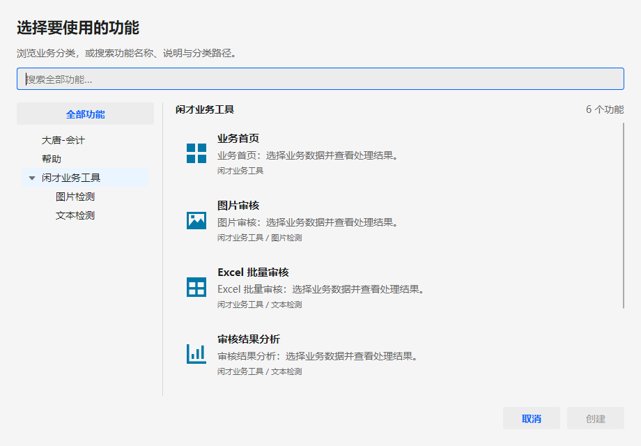
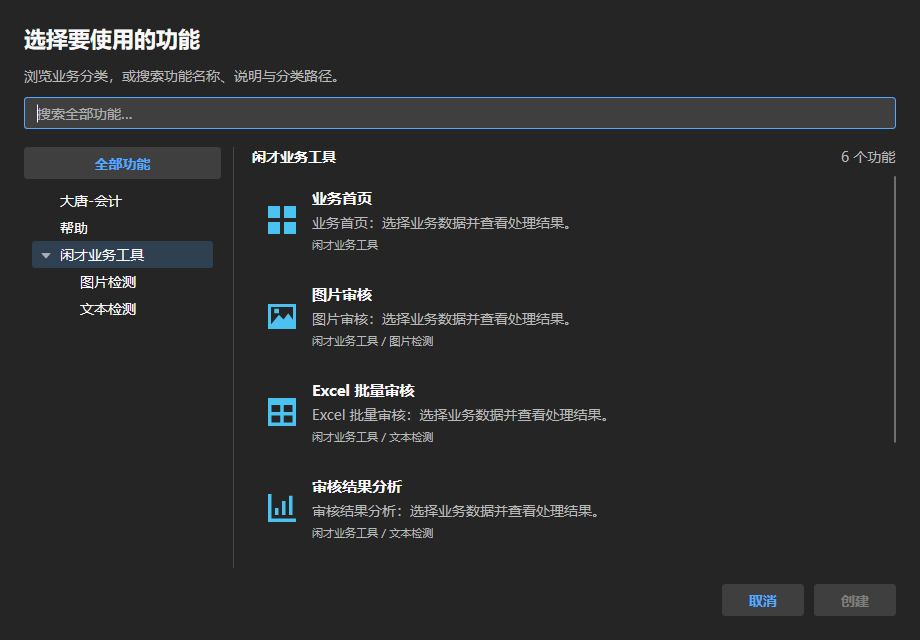

# V6 插件目录双模式与功能中心实施验收记录

> 状态：Host V6 已实现；Host/Workflow 开发门禁与 Host 覆盖率通过，完整 all 门禁仍有外部 ClassicGame 失败，详见第 5 节。
> 日期：2026-09-11；输入基线：`e4d7bd7`，实施开始时工作树干净。
> 依据：[V6 设计](../../design/host-v6-plugin-navigation-and-function-center-plan.md)。
> 使用说明：[目录、功能中心与图标配置](../../quick-start/plugin-navigation-and-function-center.md)。
> 边界：仅 Host、测试和文档；无 AIFLOW、Windows CI、Windows Smoke、seal、发布、上传、tag 或自动提交。

## 1. 已实现的行为

保留唯一的 `myavalonia.host.tool.plugin-menu`，默认仍为旧版平铺，在 Tool 顶部选择树形模式。
新增文件菜单命令 `myavalonia.host.command.document.new` 打开单实例模态功能中心。
三处入口使用同一目录来源及 `DocumentPersistenceCoordinator.CreateDocumentAsync`，创建身份仍是
`(DocumentTypeId, CreationIntentId)`，没有第二套插件激活或 Scope 管理。

路径使用 `/`，保留 `大唐-会计` 等既有名称。分类可以混合子分类与直属入口，后代计数保留每个创建意图。
非法空段整体回退并诊断，不删除功能。旧版继续按完整原始字符串分组，保持原排序与统一图标。
Host 提供 8 个固定矢量名称，空值与无效值使用公共默认图标，不增加位图文件、图标依赖包或 SDK 公共属性。

功能中心提供全局搜索、分类筛选、说明、路径、单选、创建、失败重试和空结果提示；按本次返回结果判定成功。
浏览不初始化插件；创建中防重复提交并阻止窗口关闭。退出还通过文档操作门证明在途初始化结束，再释放资源。
导航偏好单独原子保存，显示名可自定义，布局线格式与产品版本保持不变。

外部插件源码和元数据未改。测试图中的二级“闲才业务工具/文本检测”为 Host 测试注册样例；
现有外部闲才插件仍按其实际一级分类展示，不能把样例截图理解为外部插件已经迁移。

## 2. SOLID 与职责

| 原则 | 实施方式 |
| --- | --- |
| SRP | 路径只解释分类；目录只生成只读快照；设置存储只读写偏好；ViewModel 管展示状态；窗口服务管 Owner 与会话；协调器管创建用例。 |
| OCP | 新树与功能中心消费原有入口，保留旧分组语义；新增图标只扩展固定目录，不修改插件激活链。 |
| LSP | 无新增插件接口要求。原有空图标、平面分类、多意图文档继续可用，旧 Tool 身份与布局不变。 |
| ISP | 窗口、图标与分类数据不接触插件容器；关闭参与者只记录真实已创建对象，不冷解析服务。 |
| DIP | 复用已有查询、文档协调器、工作台命令与组合根；依赖通过构造函数显式传入，无服务定位器或全局事件总线。 |

采用现有 MVVM、组合与窄适配器；内部单实现协作者使用具体类型，不为“模式数量”新增接口或框架。
中文注释说明只读快照、绑定重入、图标回退、窗口所有权、串行化与退出资源保留的原因。

| 主要文件 | 职责 |
| --- | --- |
| `Business/Workspace/DocumentCategoryPath.cs` | 分段、非法回退、完整路径身份 |
| `Business/Workspace/DocumentCreationDirectory.cs` | 只读分类树、后代计数、搜索筛选 |
| `Business/Workspace/DocumentCreationMenuQuery.cs` | 当前可用目录与通知转发 |
| `Models/Tools/NavigationTreeNode.cs` | 每个视图独立的展开状态 |
| `Business/Navigation/PluginNavigationSettingsStore.cs` | 稳定模式、自定义显示名、原子文件与损坏备份 |
| `Business/Presentation/Icons/HostIconCatalog.cs` | 固定矢量键、默认回退、UI 几何转换 |
| `ViewModels/Tools/PlugGroupMenuViewModel.cs` | 原 Tool 双模式与共享创建入口 |
| `ViewModels/FunctionCenter/FunctionCenterViewModel.cs` | 一次选择会话、过滤、提交、错误状态 |
| `Business/Presentation/FunctionCenterWindowService.cs` | 单窗口、Owner、关闭与订阅释放 |
| `Business/Documents/DocumentOperationGate.cs` | 在途与排队文档操作的退出屏障 |

以上路径均相对 `Host/MyAvaloniaManagement/`。

## 3. 退出与刷新中的额外修复

功能中心打开命令立即返回，不能把弹窗整个存活期占为工作台在途命令。
因此 Tool/功能中心的异步创建需要独立排空：文档门统计执行中与排队请求，关闭后拒绝新请求及未执行的排队请求。
默认宽限 5 秒；无法排空时保留 Workspace、Scope 与 Provider，继续遵守 V5 的“迟到完成不自动解除保留”政策。
创建协调器同时捕获门外拒绝，使三个入口都返回失败结果，不向 UI 传播未观察异常。

服务释放时若弹窗正忙，暂存会话到任务返回再关闭，避免产生失去引用的模态窗口。
目录刷新会替换 TreeView/ListBox 的 ItemsSource，控件会同步回写临时空选择；ViewModel 对投影更新期间的回写
做重入保护，保持搜索词与仍有效的选择。真实用户点击分类仍会退出全局搜索。

刷新问题先由真实 XAML 测试复现：`v6-refresh-before.trx` 中 2 失败 / 6 通过，搜索词预期“欢迎”却变成空字符串。
修复后 `v6-refresh-after.trx` 为 8/8 通过，覆盖分类保留与移除；原始证据位于 `artifacts/v6/tests/`。

## 4. 专项测试与视觉证据

| 风险 | 测试 |
| --- | --- |
| 多级、共同前缀、同名不同父级、非法路径、64 层、创建意图计数 | `PluginNavigationTests` |
| 独立展开、两种模式、显示名恢复、零提前初始化 | `PluginNavigationTests`、`PluginNavigationUiTests` |
| 默认、持久化、原子替换、损坏备份、未知值、写入失败 | `PluginNavigationSettingsTests` |
| 图标缺省与无效回退、意图继承、8 个实际几何、多控件同时显示 | `PluginNavigationTests`、`PluginNavigationUiTests` |
| 创建意图传递、重复提交、历史错误、失败重试、关闭后拒绝 | `PluginNavigationTests` |
| 文件菜单顺序、真实鼠标创建、Enter、防关闭、12 次开关、可用性刷新 | `PluginNavigationUiTests` |
| 在途/排队拒绝、超时保留、正常排空释放顺序 | `DocumentOperationShutdownTests` |

UI 测试加载生产 XAML 与主题。默认使用 Avalonia Headless，另通过 Skia 实际渲染并人工查看图像：

```powershell
$env:MYAVALONIA_V6_RENDER_DIRECTORY = "$PWD/artifacts/v6/screenshots"
dotnet test Host/MyAvaloniaManagement.UiTests/MyAvaloniaManagement.UiTests.csproj --no-build --no-restore --filter FullyQualifiedName~PluginNavigationUiTests
Remove-Item Env:MYAVALONIA_V6_RENDER_DIRECTORY
```

这只是测试程序集的可选绘图方式，不启动 Windows Smoke，不属于 Windows CI 或发布门禁。
截图为实际生产视图的 Headless/Skia 渲染，没有桌面窗口边框，不宣称已做真实桌面、多显示器或系统 DPI 验收。

| 旧版 | 新版 |
| --- | --- |
|  |  |

另见[新版树形深色渲染](images/tool-tree-dark.png)。





## 5. 最终开发门禁与覆盖率

最终 Host 开发门禁：`artifacts/gate/20260911-004026-e4d7bd780fc6/summary.json`，
`profile=verify`、`scope=host`、`passed=true`。锁定还原、Release 零警告构建、测试、契约、打包与大唐跨仓检查全部通过。
`workspaceSnapshotVerified=true`，`externalInputsClean=true`，`releaseEligible=false`，`publishable=false`。

| 测试组 | 通过数 |
| --- | ---: |
| SDK | 81 |
| Host Unit | 334 |
| Host Plugin | 213 |
| Host Headless UI | 75 |
| MyPlugTest | 11 |
| DaTang 业务 | 71 |
| DaTang Host / Host UI / Standalone UI | 14 / 6 / 3 |

Host 三层共 **622/622**，0 失败、0 跳过；本轮 Host 门禁全部 TRX 合计 808 次执行通过，包含专项重复执行。
另使用本次 Release 构建输出建立实体 `Controls` 组合目录，明确设置
`MYAVALONIA_WORKBENCH_COMMAND_G10_EXTERNAL_PLUGIN_ROOT`，执行 Workbench 跨仓 Plugin/UI 两项测试，均通过。
证据：`artifacts/v6/tests/v6-workbench-PluginTests.trx` 与 `v6-workbench-UiTests.trx`。
这是补充的真实加载/命令/UI 验证，不替代 ClassicGame 自身仍失败的全套测试，也不宣称完成全仓封板。

最终 Workflow 开发门禁：`artifacts/gate/20260911-004245-e4d7bd780fc6/summary.json`，
`profile=verify`、`scope=workflow`、`passed=true`。WorkflowStudio 86 项、VideoSecurityPlayer 231 项、
真实 Workflow Action 组合 1 项全部通过；Standalone 自检通过。单轮资源 Harness 为 `Success=true`、`Cycles=1`，
所有 FinalResources 为 0，关闭后的 Document/View/加密流存活弱引用为 0，Failures 为空。
证据在同一 Gate 目录的 `pass-1/harness/report.json`；原生媒体 stderr 的非致命消息不替代实际退出码与资源断言。
该 Harness 是现有 verify 的开发检查，不是正式 seal 专有的 Windows Smoke，也未运行 Windows CI。

### 5.1 覆盖率

`verify` 本身不采集覆盖率，因此额外对最终 Release 的 Host Unit/Plugin/UI 与现有 DaTang Host/Host UI
五个来源采集 `XPlat Code Coverage`。使用既有 `Host/MyAvaloniaManagement.Tests/coverage.runsettings`，
后两组排除 `DaTangPackageTests`，分别 13/6 通过；五组共 641 次测试执行通过。
合并只选择五个 GUID 目录的原始 Cobertura，程序集限定为既有 `MyAvaloniaManagement`，没有新增类型排除或下调阈值。

| 指标 | 实测 | 当前阈值 | 结果 |
| --- | ---: | ---: | --- |
| Host 行覆盖率 | 87.41% | 84.39% | 通过 |
| Host 分支覆盖率 | 70.93% | 70.58% | 通过 |

阈值从当前 `tools/MyAvaloniaManagement.Gate/gate.config.json` 读取。
证据：`artifacts/v6/coverage/host/Cobertura.xml`、`Summary.txt` 与 `../host-threshold-result.json`。
第一次合并重复读入 TRX 附件副本，已改为只选五个原始文件，指标保持相同；没有因此重复执行测试。

### 5.2 实际命令与环境

本机主仓目录为 `D:/code/local/avalonia_dock_simple_test`，外部根为同级 `avalonia_dock_plug_test`。
准备本轮 NuGet 缓存和下节提到的临时路径映射后，在主仓执行：

```powershell
$env:NUGET_PACKAGES = "$PWD/artifacts/v6/nuget-packages"
$env:NUGET_FALLBACK_PACKAGES = "$env:USERPROFILE/.nuget/packages"
dotnet run --project tools/MyAvaloniaManagement.Gate -- verify --scope all --workflow-studio ../avalonia_dock_plug_test/myavalonia-workflow-studio --classic-game ../avalonia_dock_plug_test/myavalonia-classic-game
dotnet run --project tools/MyAvaloniaManagement.Gate -- verify --scope host
dotnet run --project tools/MyAvaloniaManagement.Gate -- verify --scope workflow --workflow-studio ../avalonia_dock_plug_test/myavalonia-workflow-studio
```

每条运行有独立日志与 summary；all 失败不能被 scope 检查的成功覆盖。
覆盖率按五个工程分别运行 `dotnet test <project> -c Release --no-build --no-restore -m:1`
并追加 `--collect:"XPlat Code Coverage" --settings <coverage.runsettings>`、独立输出目录和 TRX logger。
图像由第 4 节的独立绘图开关产生，常规测试没有开启该开关。

### 5.3 环境与基线问题

- 初次锁定还原发现 7 个测试夹具 lock 残留 `win-x64` / `ILLink.Tasks 10.0.10`，与当前普通开发项目属性不符。
  按当前项目属性 `dotnet restore --force-evaluate` 重建这 7 个夹具 lock，未升级生产依赖。
- Gate 外部仓库默认路径仍使用旧目录名。验证期间临时创建旧路径到当前外部插件根的 Junction，结束后移除；不提交机器路径更改。
- 外部 Workflow SDK `1.0.0` 的全局缓存与锁定哈希不同，导致 `NU1403`。找到已有 `lock-refresh` 缓存中的同版匹配包，
  复制到本轮隔离 NuGet 缓存，其他依赖使用全局 fallback，保持锁定校验，不改外部 lock 或全局缓存。
- `20260911-003150-e4d7bd780fc6` 的 verify 到达外部 ClassicGame 测试，553 通过 / 1 失败：
  `RubiksCubeGeometryAndDocumentTests.Document包装绑定标题与工作台重置仅作用于当前实例` 在 Dispatcher 验证线程时失败。
  该测试和仓库未被本轮修改；单独完整复核仍为 553/554，失败同一项，见 `artifacts/v6/tests/classic-recheck.trx`。
  其源码使用普通 Fact 调用 `Dispatcher.UIThread.RunJobs`，失败位置为外部测试第 79 行。
  本轮保留失败，不过滤该用例、不改外部测试、不把完整 all 门禁标成通过。
- 大唐与视频插件的 Host 集成验证会按当前 Host 引用自动刷新 4 个外部 lock（补入实施前帮助中心已有的 WebView/Markdig 依赖）。
  已先保存差异到 `artifacts/v6/*-gate-lock-diff.txt`，再只恢复这些运行前干净的 lock。
  最终四个外部仓库均干净；临时 Junction 已删除并确认真实目标目录保留。生产代码和测试在最终 Host 门禁后未再修改，只回填说明及证据。

## 6. 使用边界与回退

- 旧版可随时切回，保持完整分类字符串；无需删除或迁移布局。
- 模式选择与显示名跨启动保存；展开、搜索和选中只属于当次会话。
- 现有插件升级分类/图标是后续工作；本轮不猜测业务分类、不增加插件安装或市场功能。
- 分类树没有业务深度上限；已测试 64 层，但实际导航建议保持少量层级。卡片用默认虚拟化列表，未声称已做万级目录性能基准。
- 创建中的取消不伪装为事务回滚；创建任务返回前保持忙碌。后台初始化超时的资源保留限制继承 V5。
- 无 SDK 公共 API、manifest、Document envelope、布局格式和产品版本变化。
- 后续方案标题可以自定义，V6 仅表示本次时间顺序；运行时模式身份始终是 `legacy` / `tree`。
