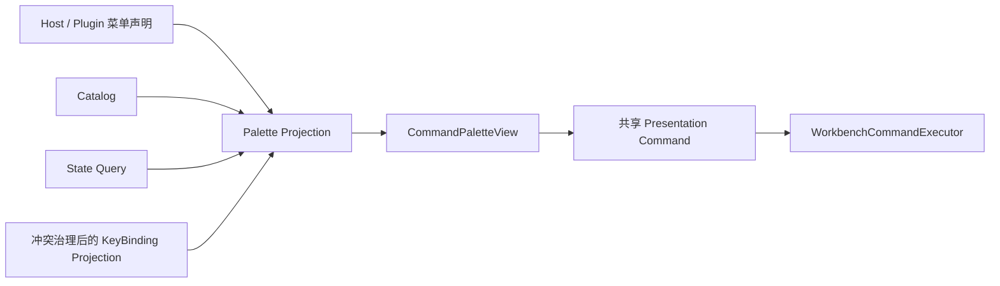

# Workbench Command G9：最小 Command Palette

> 状态：已完成（2026-08-28；完整本地非发布门禁通过）。
>
> 输入提交：`af5ed4da562a6bfaca97a7a5c8989fee41a60c03`。实施时主仓库工作树已包含用户保留的 G0–G8
> 改动和既有行尾状态；本阶段没有 reset、清理或全仓格式化，也没有修改 WorkflowStudio、ClassicGame
> 或四个仓内业务插件。
>
> 本记录只签署 G9 Host internal Palette，不提前签署 G10 跨仓库发布资格。

## 1. 目标与边界

G9 在 `MainWindow` 内增加窗口级 Command Palette，使用 `Ctrl+Shift+P` 打开模态遮罩。它只发现至少有
一个菜单声明的命令，复用既有 Catalog、Context、State Query、快捷键冲突结果、Presentation Command
和 Executor；没有第二套命令状态或执行通道。

明确未实现模糊搜索、分词/拼音、最近使用、历史权重、持久化、用户排序、设置、Toolbar、ContextMenu、
参数化命令、动态图标和动态名称。Palette 本身不是 Catalog Command，整体删除其 View、Projection 和
窗口入口后，菜单、快捷键和 Executor 仍可独立工作。

本阶段没有新增或修改 Plugin SDK public API，没有提升 Host/SDK/模板/插件版本，没有改变 manifest schema
2、Document envelope schema 2、layout schema 2、`layout-v2.json` 或数据根 `v2`，也没有数据迁移。

## 2. 设计与 SOLID 取舍



- **SRP**：Projection 只负责候选、状态过滤、搜索、排序和快捷键文本；View 只负责打开、焦点、查询和选择；
  Executor 继续独占执行与执行前重查。
- **OCP**：用新的 Host internal 投影扩展展示，不改变 Catalog、Context、Target、State Query 或 Executor 语义。
- **LSP**：生产 Presentation 与纯内存设计数据都实现相同只读 Palette 绑定面，设计器实现返回稳定静态样例投影。
- **ISP**：Palette 不获得 Provider、Scope、Document、Dock、Control、插件对象或 Workflow Action Runtime。
- **DIP**：View 只依赖 internal Palette 投影和共享命令绑定，不依赖具体插件或其业务类型。

设计模式只使用朴素的只读 Projection、共享 Command Adapter 和事件订阅/释放。没有为单一实现制造额外小接口，
也没有引入 Mediator、通用命令总线、索引框架或状态缓存。生产与设计器确实需要替换的绑定面才保留接口。

## 3. 投影语义

`WorkbenchCommandPaletteProjection` 从 Host/Plugin 菜单 Placement 收集 CommandId，同一命令的多个菜单位置
只形成一个条目。`CommandNotFound`、`OwnerUnavailable`、`TargetUnavailable` 隐藏；当前目标匹配但
`CanExecute=false` 的真实 Disabled 项保留。

名称和说明使用注册时冻结的不可变文本，不调用插件生成动态内容。查询先 Trim，再对 DisplayName 和
Description 做 `OrdinalIgnoreCase` 普通子串匹配；结果按 DisplayName ordinal 排序，重复名称按 CommandId
ordinal 打破平局。快捷键只读取冲突治理后实际生效的 Gesture；多个 Gesture 按 PlacementId 排序并统一展示。

Projection 监听统一状态失效和有效快捷键变化，通过 UI Dispatcher 合并刷新。刷新不缓存插件业务状态；
观察者异常被隔离并写入既有稳定脱敏诊断，Dispose 与所有订阅严格成对。

## 4. UI、键盘与焦点

`CommandPaletteView` 是 MainWindow 持有的单一遮罩控件，不创建独立窗口。首次打开清空查询、选择首项并聚焦
搜索框；已打开时再次按 `Ctrl+Shift+P` 只重新聚焦，保留查询与选择。查询或状态刷新尽量按 CommandId
保留选择，原项消失时回到首项；上下键在边界停止，Disabled 仍可查看但不能执行。

Enter 会再次调用所选项共享绑定的 `CanExecute`。可执行时先关闭遮罩并恢复焦点，再由同一 Presentation
Adapter 进入 Executor；失效时保持面板并刷新。Escape 无条件关闭，无结果显示明确空状态。关闭前保存原焦点，
若其仍可聚焦则恢复，否则回退主窗口。延迟聚焦回调会重查会话存活，避免窗口关闭后隐藏搜索框抢回焦点。

`Ctrl+Shift+P` 加入 Host 保留 Gesture 集合。插件争用该 Gesture 时仍按既有 Host 优先政策禁用并产生稳定
诊断；Palette 打开期间窗口暂时撤下其他生成 KeyBinding，防止模态搜索被后台命令截获，关闭时统一重建。
执行失败只经过既有诊断边界，UI 不呈现插件异常正文、路径或 Payload。

## 5. 源码变化

- 新增 `WorkbenchCommandPaletteProjection.cs`，实现菜单候选去重、状态过滤、搜索、排序、有效 Gesture 和释放。
- 新增 `CommandPaletteView.axaml` / `.axaml.cs`，实现遮罩视图、键盘、选择、空状态和焦点会话。
- `MainWindow` 持有遮罩与 `Ctrl+Shift+P` 壳层入口，并在打开期间暂停生成 KeyBinding。
- `HostWorkbenchCommandPresentation` 在 KeyBinding 投影之后创建 Palette 投影，并在其之前释放。
- 生产与设计数据的内部 Presentation 绑定面同步增加只读 Palette。
- `Ctrl+Shift+P` 进入 Host 保留 Gesture，继续复用既有冲突治理和稳定诊断。
- 覆盖率关键文件基线加入 Palette Projection，最低行覆盖率为 90%。

所有新增类型、成员、线程切换、状态所有权、焦点恢复、冲突保留和释放时序都使用详细中文 XML 或设计注释。

## 6. 测试与实测

G9 专用入口：

```powershell
pwsh -NoProfile -File .\scripts\Test-WorkbenchCommandG9.ps1 -Configuration Release
```

| 验证面 | 实测结果 |
| --- | ---: |
| Palette Projection 定向单元测试 | **13/13** |
| Palette/MainWindow Headless UI 定向测试 | **10/10** |
| Host 三层完整测试 | **584/584** |
| Host 行覆盖率 | **87.32%** |
| Host 分支覆盖率 | **72.58%** |
| `WorkbenchCommandPaletteProjection.cs` 行覆盖率 | **98.41%** |

Host 总覆盖率不低于 G8 的 86.98% / 72.42%，Palette 关键文件高于 90% 门槛。单元测试覆盖空查询、Trim、
中文/英文、大小写、说明匹配、仅菜单可发现、CommandId 去重、稳定排序、重复名称 tie-break、Owner/目标隐藏、
真实 Disabled、有效/冲突快捷键、状态/目标/生命周期刷新、Dispatcher 合并、异常观察者隔离和 Dispose 后零通知。

Headless UI 覆盖打开/初始焦点/重复打开、中文/英文过滤、上下键、当前 Document 实例执行、Disabled 不执行、
目标切换与选择更新、Escape、执行后焦点恢复、窗口关闭后不可重开且订阅解除、保留快捷键争用，以及 Executor
失败不崩溃、不泄漏异常正文。机器摘要位于
`artifacts/test-results/WorkbenchCommandG9/summary.json`。

## 7. 门禁与非发布声明

`Test-WorkbenchCommandG9.ps1` 执行现有 Host V4 G7 本地开发门禁，或在同一工作树中显式复用已经验证的结果；
随后运行 G9 定向 Unit/UI、覆盖率、SDK/API/版本/Schema 冻结和文档门禁。摘要固定记录：

```text
aiflow=false
windowsCi=false
windowsSmoke=false
releaseAcceptance=false
releaseGate=false
publishable=false
published=false
uploaded=false
signed=false
tagCreated=false
```

本阶段没有读取或运行 AIFLOW，没有运行 Windows CI、Windows Smoke、Release Acceptance、Host Release Gate，
没有签名、上传、打 tag 或发布。`Release` 只表示本地编译配置，不表示发布资格。

## 8. 整体回滚边界

回滚时整体删除 Palette Projection、View、MainWindow 遮罩/键盘入口、Presentation Palette 属性、设计数据实现、
专项测试/脚本/文档和覆盖率条目，并从 Host 保留 Gesture 集合移除 `Ctrl+Shift+P`。不得回滚或复制 Catalog、
Context、State Query、Target、Menu、KeyBinding、Presentation Command 或 Executor。这样 G0–G8 的菜单、快捷键、
WorkflowStudio 与 ClassicGame 命令仍沿原路径工作，且没有用户数据或磁盘格式需要迁移。
