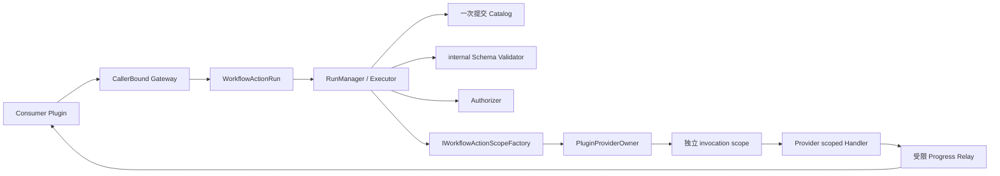

# Workflow Action G1：Host Workflow Action 内核实施记录

> 状态：已完成（2026-08-25；完整非发布门禁通过）
>
> 产品版本：`3.0.0`
>
> Core/UI SDK 候选：`3.1.0`，程序集与 FileVersion：`3.1.0.0`
>
> 前置：[G0 重新签署记录](./g0-facts-naming-repositories-sdk-compatibility.md)
>
> 总设计：[工作流执行与可选 AI 规划方案](../../design/ai-workflow-plugin-exploration.md)

## 1. 结果与边界

G1 把 Workflow Action 从 G0 测试候选推进到生产 SDK 与 Host internal 运行路径。Provider 可以显式声明
scoped Handler；Consumer 只有显式调用 `UseWorkflowActionGateway` 后才能取得绑定自身 PluginId 的
Gateway。Gateway 创建独立 `IWorkflowActionRun`，Run 拥有本次运行的取消、并发计数、授权缓存和目录
revision。Consumer 不能提交 CallerId、OwnerId、RunId 或授权结果。

G1 没有创建 Workflow Studio、工作流定义或执行器，也没有修改模板、Build 包、manifest、Document、
Layout 或数据根协议。这些仍属于 G2 及以后阶段。Release 仅是本地编译配置，不代表发布资格。

## 2. 设计思路与 SOLID 对照

实现只使用值对象、可选注册接口、caller-bound Gateway、显式 Run、一次提交目录和窄 Host 端口。没有
引入工作流框架、通用规则引擎、服务定位器、反射调用桥、父 Provider 回退或第二套容器。

| 原则 | G1 做法 |
| --- | --- |
| SRP | Schema、Catalog、授权、Run 执行、进度代理和关闭门控分别承担单一职责；Registry 只保存冻结事实 |
| OCP | 新增 `IWorkflowActionRegistration`，不修改已进入 v3 Shipped 的 `IPluginRegistration` |
| LSP | SDK 3.1 Host 可加载固定历史树构建的真实 3.0 插件 ZIP；旧 Host 在执行入口前拒绝要求 3.1 的插件 |
| ISP | Provider 只依赖 Handler/Descriptor；Consumer 只依赖 Gateway/Run；关闭门控只依赖排空端口 |
| DIP | Executor 依赖 `IWorkflowActionScopeFactory` 与 `IWorkflowActionAuthorizer`，不依赖插件 Provider 实现或 Avalonia 对话框细节 |

朴素设计的关键取舍是让 Run 成为真实运行边界。若直接把 `InvokeAsync` 放在 Gateway 上，Host 无法精确
表达 OncePerRun 授权、运行级并发和 Dispose 取消；若把 CallerId 放进请求，又会允许 Consumer 伪造身份。
因此 Gateway 只负责创建绑定可信 Caller 的 Run，所有运行状态都留在 Host。

## 3. 职责和所有权



- `PluginRegistry` 只冻结 Owner、Descriptor、Handler Type 和 Consumer 身份，不保存 Provider、Scope、
  Handler 实例、授权结果或运行状态。
- `WorkflowActionCatalogStore` 在 Registry 完成后只允许提交一次；revision 是排序规范描述符 JSON 的
  SHA-256，不支持运行期追加、刷新或二次提交。
- `PluginProviderOwner` 只实现窄 invocation-scope 工厂；Executor 看不到 `IServiceProvider`。
- 每次调用创建并异步释放一个独立 Scope；成功、失败、取消和输出非法路径都遵循同一释放规则。
- Provider 与 Consumer 不能由同一插件同时声明，首版从结构上禁止递归 Action 调用。

## 4. 公共契约

Core SDK 3.1 新增：

- `WorkflowActionId`、Descriptor、风险/确认枚举、Context、Progress；
- `IWorkflowActionHandler`；
- `WorkflowActionInvocationRequest`、结构化 Result/Failure/Status；
- `IWorkflowActionGateway.GetAvailableActions()` 与 `CreateRun()`；
- `IWorkflowActionRun.InvokeAsync(request, progress, cancellationToken)` 与 `DisposeAsync()`。

UI SDK 3.1 新增独立 `IWorkflowActionRegistration`，以及
`AddWorkflowAction<THandler>`、`UseWorkflowActionGateway` 扩展方法。全部新增 public API 具有中文 XML
注释并进入排序后的 v3 Unshipped；v3 Shipped Core 127/UI 45 及其哈希保持不变。

跨 ALC 只传 SDK、BCL 和 `JsonElement`。Descriptor、请求、Handler 输入和成功输出均在边界处克隆，
调用不依赖外部 `JsonDocument` 生命周期。真实 Provider 夹具在 Handler 内使用 private DTO，Consumer
不引用 Provider 程序集。

## 5. 调用治理

固定调用顺序为：

```text
运行/关闭状态
→ Action 查找与 revision
→ Owner 可用性
→ 输入 Schema/预算
→ Run 与 Owner 并发占位
→ 授权
→ invocation scope
→ Handler / 超时 / 取消 / 进度代理
→ 成功输出 Schema/预算
→ 结构化终态与脱敏诊断
→ Scope 释放和并发归还
```

稳定失败码区分 Action 未找到、输入/输出非法、授权拒绝、并发上限、Handler 失败、Owner 不可用、取消、
超时和 Host 关闭。插件异常原文不会进入返回结果；诊断只接收稳定阶段、Owner、Action、错误码和耗时，
不记录参数、路径、Secret、参数指纹或进度消息。

授权规则：

- `Never` 只允许 `RiskFlags.None`；
- `OncePerRun` 使用 catalog revision、ActionId 和规范参数 SHA-256 作为内存缓存键；拒绝不缓存；
- `EveryInvocation` 每次确认；删除风险必须使用该策略；
- 摘要展示 Caller、Action、风险和必要参数，敏感 JSON Pointer 对应值统一替换为 `***`；
- UI 不可用、Owner 不可用、提示异常或授权异常均失败关闭。

Schema 是 Host internal 冻结 Profile，不是通用框架。根必须为 object；支持 object/array/scalar、required、
enum 和长度/数值边界；拒绝组合、联合、未知关键字、远程引用和额外属性。

| 资源 | 限制 |
| --- | ---: |
| Schema / 输入 / 输出 | 64 KiB / 256 KiB / 1 MiB |
| 深度 / 累计属性 / 数组项 | 16 / 128 / 1024 |
| 单字符串 | 64 KiB UTF-8 |
| 每 Run / 每 Owner 并发 | 4 / 4，满额快速拒绝 |
| 普通 / LongRunning 超时 | 5 分钟 / 6 小时 |
| Host 关闭宽限 | 10 秒 |
| 进度 | stage 64 个稳定字符、message 512 字符、最多 10 次/秒 |

非法、超额或 Consumer 回调异常的进度被隔离，不反向改变合法业务结果。测试使用可控
`TaskCompletionSource` 和可注入期限，不使用 `Sleep` 猜竞态。

## 6. 关闭门控

```text
WorkflowActionShutdownGate.BeginShutdown
→ 拒绝新 Run/调用并取消全部 Run
→ Workspace / View / Document Scope 收口
→ 在冻结宽限内等待真实 Handler 退出
→ 仅在排空成功时反向停止 Lifecycle
→ 反向释放插件 Provider
→ 释放 Host Provider
```

`WorkflowActionShutdownGate` 依赖最小 `IWorkflowActionShutdownParticipant`。若宽限超时或排空检查异常，
Host 不能证明 Provider 已经安全，因此记录关闭失败并跳过 Lifecycle、插件 Provider 和 Host Provider 的
不安全释放，最终抛出聚合关闭异常；绝不在 Handler 尚运行时假装强杀或释放其对象图。

## 7. 测试、门禁与证据

开发期统一入口：

```powershell
pwsh -NoProfile -File .\scripts\Test-WorkflowActionG1.ps1 -Configuration Release
```

入口执行锁定还原、Release 零警告构建、G0 重新签署兼容专项、SDK API/真实 nupkg 消费、Host 三层
测试、真实 3.0 插件 ZIP、G1 双插件夹具、四个业务插件单元回归、文档链接和事实门禁。机器摘要和候选
Core/UI 3.1 nupkg 位于 Git 忽略的 `artifacts/test-results/WorkflowActionG1/`。

本轮机器摘要事实如下；专用重复测试是聚合门禁中的独立复核，不能与 Host 三层数量解释为唯一测试数：

| 套件 | 通过 |
| --- | ---: |
| Host Unit / Headless UI / Plugin 三层 | 497/497 |
| SDK Workflow Action 专项 | 3/3 |
| G1 真实双插件专用复核 | 1/1 |
| MyPlugTest / DaTangAccountingHelpPlug | 11/11 + 62/62 |
| MySmallTools / BiliDownloader | 197/197 + 729/729 |
| G0 旧 Host / 重新签署候选 | 1/1 + 14/14 |

失败 0、跳过 0。Host 合并覆盖率为行 **85.7%**、分支 **71.8%**，高于 84.39% / 70.58%
保护线。关键文件行覆盖率为：Schema **93.65%**、Catalog **98.46%**、Run/Executor **91.41%**、
关闭门控 **100%**。文档门禁检查 84 份文档、483 个本地链接、175 个脚本路径和 43 个项目路径。

| API / 制品 | 数量或 SHA-256 |
| --- | --- |
| Core/UI v3 Shipped | 127 / 45；哈希 `063BCB5852827612B0501C135D23FECD015069A6F7DDB409547157E4FA00F80F` / `B11FBE768C3AD04CA65CBF5128BF6FCE8C00058EBB24052D51FE5464A65AD803` |
| Core/UI v3 Unshipped | 72 / 6 |
| 真实 3.0 MyPlugTest ZIP | `4B1AF24160497EEB0B2A407EAB42922488DA7544D02D83BBF84E18CEF52BFCFA` |
| Core 3.1 候选 nupkg | `147B3B8B7AA5F2881AD5FE1222FBC4B400A5BC2C5BE73F167809323A43C146FB` |
| UI 3.1 候选 nupkg | `78417BF2B32DE8810175E8439F26264D6FA7C8FF6639664BBD81C7BCF02ACE3F` |

权威机器摘要为 `artifacts/test-results/WorkflowActionG1/summary.json`。候选包位于同一 Git 忽略目录，
只用于本地消费证明，不是发布输入或已承诺的可重复发布制品。

## 8. 非发布边界与回滚

```text
aiflow=false
windowsCi=false
windowsSmoke=false
releaseAcceptance=false
releaseGate=false
publishable=false
published=false
uploaded=false
tagCreated=false
```

G1 回滚单位是生产 API/版本、Host 内核、双插件夹具、G1 门禁和本文档整体。回滚后恢复为“G0 已重新
签署但只存在测试候选资产”，不得留下只能注册却不能治理的半套 Action，不得修改既有 v3 Shipped。
