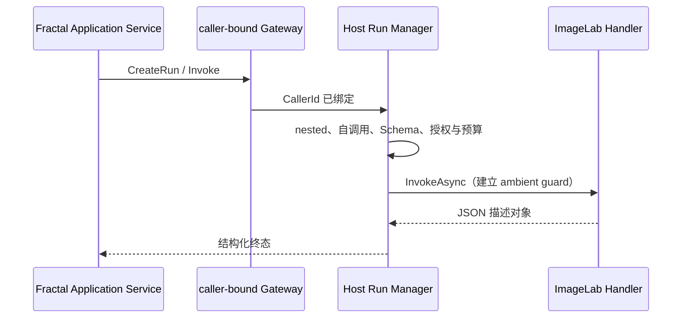

# Workflow Action G5：Provider + Consumer 双角色安全治理

## 结论

Host 允许同一插件同时登记 `AddWorkflowAction<THandler>()` 与 `UseWorkflowActionGateway()`，公共 SDK、
`JsonElement` 协议、Definition v2、Schema Profile 和大小预算均未变化。安全边界由 caller-bound 目录过滤、
调用阶段自调用拒绝和 Handler 异步链嵌套拒绝共同完成。

## 治理顺序

```text
接收请求
→ 检查是否处于 Handler 异步调用链
→ 按 Run revision 解析 Action
→ 比较 CallerId 与 OwnerId
→ Host 活跃调用计数
→ Owner/Run 并发预算
→ Schema
→ 授权
→ Provider Scope 与 Handler
```

自调用返回 `WORKFLOW_ACTION_SELF_INVOCATION_FORBIDDEN`，且发生在 Host 活跃计数、授权、Provider Scope、
Handler 和文件操作之前。Handler 链再次进入任意 Gateway 返回
`WORKFLOW_ACTION_NESTED_INVOCATION_FORBIDDEN`。异步标记通过 `AsyncLocal` 传播，并在 `finally`/`Dispose`
恢复；Document、Application Service 和 Workflow Studio Runner 的顶层调用不带该标记。

## 调用关系



Provider Handler 不允许再调用其他 Handler。这里没有引入调用图、总线或循环检测器，编排责任仍位于
Consumer 应用层或 Workflow Studio。

## 测试

- 混合角色注册成功并同时保留 Gateway 与 Handler 登记；
- caller-bound 目录过滤自己的 Action；
- 手工构造自有 ActionId 在授权和 Scope 前拒绝；
- Handler 内跨 Provider 调用稳定拒绝；
- 原并发、取消、超时、排空与纯 Provider/Consumer 回归继续由 Host 全量测试覆盖。

本阶段仅执行本地开发门禁，不增加 Windows CI、发布、签名或 NuGet 门禁。
