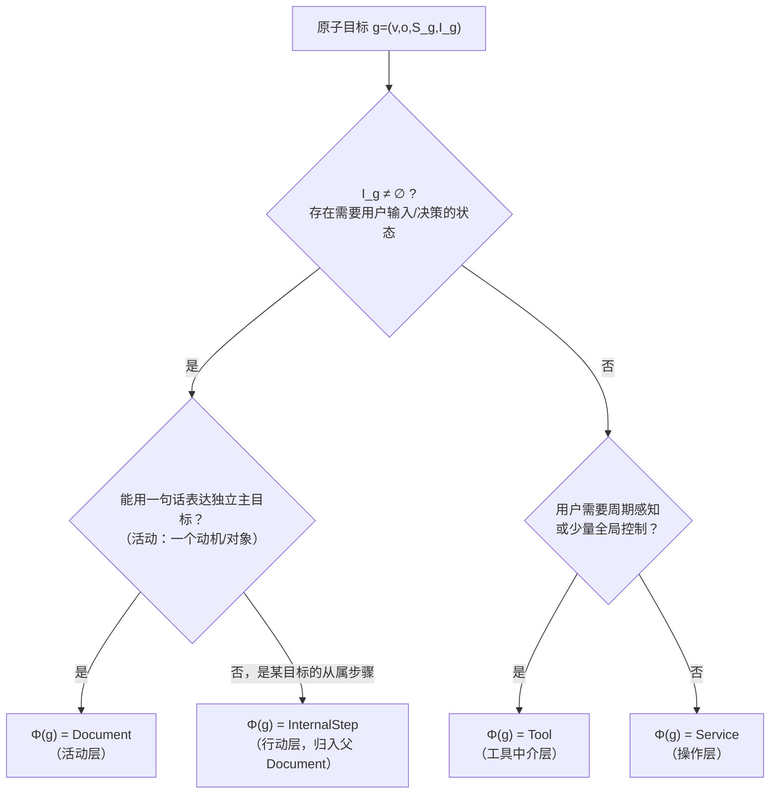

# 基于活动理论的需求分解方法论：从自然语言需求到 Document 与 Tool 的拆分

> 文档性质：方法论草案（形式化与非形式化讨论并行）
> 适用对象：开发团队、产品设计者、项目评审者
> 前置阅读：[以注意力为中心的可停靠工作台设计](./attention-centered-dock-workspace-design.md)（下文简称《主设计文档》，其参考文献编号沿用为 M-n）
> 关联文档：[宿主—插件交互架构评审](../design/host-plugin-architecture-review.md)
> 状态说明：本文是"先定方向、后补严谨"的第一版方法论。其中活动理论映射属于概念框架，信息论部分中一部分是已有结论的直接引用、一部分是本项目提出的工程模型，两者会被明确区分。本文不构成任何已验证效果的声明。

## 摘要

《主设计文档》回答了"为什么工作台要按 `Document` / `Tool` / 后台服务来组织注意力"，但没有回答一个工程上更靠前的问题：**给定一条自然语言需求，如何系统地把它拆分成若干 `Document`、若干 `Tool` 与若干后台服务，并进一步给它们归类？**

本文提出以**活动理论（Activity Theory）**为拆分骨架、以**信息论与任务切换成本**为粒度判据的需求分解方法论。核心主张有三条：

1. 活动理论的"活动—行动—操作"三层结构，与本项目的"Document—文档内步骤—插件服务"三层架构存在可辩护的概念同构；自然语言需求中的每个**有意识的、目标驱动的工作单元**候选为一个 `Document`，每个**无需用户意识参与的自动化执行**候选为一个后台服务，而**跨任务的全局感知与导航中介**候选为一个 `Tool`。
2. 拆分粒度不应由直觉决定，而应由一个可形式化的目标函数约束：分解的价值来自任务上下文对选择不确定性的降低（条件熵下降），分解的代价来自跨上下文切换与界面拥挤；最优粒度存在于两者的权衡点，因此**既不是越细越好，也不是越粗越好**。
3. 上述两条分别提供"怎么拆"与"拆到哪一层停"。前者是定性的概念框架，后者可以写成可检验的数学命题；二者的咬合关系在本文第 8 节接受自洽性检查。

本文同时给出一个可执行的判定程序（决策树）、`Document` 与 `Tool` 的子分类轴，以及已知边界案例与仲裁规则草案。所有形式化内容都标注了证明边界。

## 1. 问题陈述：本文要回答什么、不回答什么

### 1.1 回答什么

设用户给出一条自然语言需求 \(R\)（例如："我要批量下载 B 站视频，能看到下载进度，下载完了在媒体库里播放，还要能加密后再播。"）。本文给出的方法论要产出：

- 一组界面单元集合 \(\mathcal{U} = \mathcal{D} \cup \mathcal{T} \cup \mathcal{S}\)，其中 \(\mathcal{D}\) 是 `Document` 类型集合、\(\mathcal{T}\) 是 `Tool` 集合、\(\mathcal{S}\) 是后台服务集合；
- 每个单元的子分类标签（第 6、7 节的分类轴）；
- 单元之间的关联关系（用于布局代价模型中的 \(w_{ij}\)，见《主设计文档》第 10 节）。

### 1.2 不回答什么

- 不回答自然语言解析本身的可靠性问题。"从句子中抽取目标—对象—状态三元组"这一步，本文假定可以由人工或语言模型辅助完成且结果可供人复核；这是整条方法论中最薄弱的一环，见第 9.4 节。
- 不回答界面内部的具体视觉设计。
- 不宣称任何已被用户实验证明的效果。分解质量的最终检验标准是《主设计文档》第 17 节的实验指标。

### 1.3 与主设计文档的分工

《主设计文档》的第 2、3、5、10、14 节提供了信息熵、Hick–Hyman、恢复延迟、布局代价与任务条件率失真等**评价性**理论工具；本文把它们重新用作**生成性**工具——不是评价一个既定布局好不好，而是生成一个拆分方案。两文共享同一组工程事实（`Document` 多实例、每实例独立 DI Scope；`Tool` 宿主级单例、关闭即隐藏；插件服务与界面可见性无关），但视角相反。

## 2. 非形式化讨论：为什么需要一个拆分理论

复杂需求天然混合了三种不同性质的工作成分：

1. **用户必须亲自在场完成的工作**：填写下载配置、选择视频、输入密码。这些工作需要持续的注意力与局部状态。
2. **用户只需要偶尔看一眼的全局事实**：队列里还有几个任务、哪个插件已加载。
3. **用户根本不需要看见的执行**：下载本身、加解密本身、文件扫描。

如果不对这三种成分做拆分，就会得到《主设计文档》第 1 节批评的"大而全"界面：三类信息没有层次，用户被迫同时承担操作、监控与记忆三种认知角色。

但"应该拆"只是方向，工程上真正困难的是三个判定问题：

- **判定问题 A（归属）**：某个功能成分属于 `Document`、`Tool` 还是后台服务？
- **判定问题 B（粒度）**：两个成分该合成一个 `Document` 还是拆成两个？
- **判定问题 C（归类）**：得到的 `Document` / `Tool` 属于哪个子类别，从而决定其内部结构与默认位置？

本方法论的结构是：**第 4 节用活动理论回答判定问题 A，第 5 节用信息论回答判定问题 B，第 6、7 节用分类轴回答判定问题 C。** 第 8 节回头检查三者是否互相矛盾。

## 3. 理论基础一：活动理论

### 3.1 活动理论的三层结构

活动理论起源于 Vygotsky 的文化历史心理学，由 Leontiev 系统化为一个分析人类对象性活动的框架[1]。Leontiev 把人的活动划分为三个层级：

| 层级 | 定义 | 关键特征 |
| --- | --- | --- |
| **活动（Activity）** | 由动机（motive）驱动的整体 | 回答"为什么做"；一个活动对应一个完整的对象性目标 |
| **行动（Action）** | 由自觉目标（conscious goal）驱动的步骤 | 回答"正在做什么"；需要意识注意参与 |
| **操作（Operation）** | 在给定条件下自动完成的执行方式 | 回答"怎么完成"；无需意识参与，条件变化时可重新上升为行动 |

Leontiev 强调的关键机制有两个[1]：

- **层级升降**：一个行动经过练习可以"下沉"为操作（自动化）；一个操作在条件受阻时会"上升"回行动（重新需要意识关注）。例如"输入密码"通常是操作，但当密码框报错时它上升为需要专注的行动。
- **对象性（object-orientedness）**：活动总是围绕一个对象展开，对象既是活动的材料也是活动的产物。

活动理论进入人机交互领域的标志性工作是 Nardi 主编的 *Context and Consciousness*[2]，其中 Kuutti 明确把活动理论作为面向对象设计的对照框架[3]；Kaptelinin 与 Nardi 随后系统论证了活动理论对交互设计的适用性与边界[4]。Engeström 则把活动扩展为包含主体、客体、工具、规则、共同体与分工的活动系统模型，其中**工具中介（mediation by artifacts）**是核心命题：人不是直接作用于客体，而是通过工具（物质的或符号的）间接作用[5]。

### 3.2 三层结构到本项目架构的映射

把上述理论结构对照本项目的架构事实，可以得到如下映射表。这里要强调：**这是一个概念同构主张，不是一个经验证明**——我们主张这个映射"讲得通且有解释力"，而不是主张 Leontiev 的理论预言了 Dock 架构。

| 活动理论层级 | 本项目载体 | 判定依据 |
| --- | --- | --- |
| 活动（动机驱动、对象性整体） | `Document` 实例 | 一个有独立动机、独立对象、独立局部状态的完整工作单元 |
| 行动（自觉目标步骤） | `Document` 内部的表单阶段、步骤组件 | 需要用户意识参与、但在文档边界内完成的子目标 |
| 操作（自动化执行） | 插件后台服务、调度器、队列 | 不依赖用户注意力、不因界面隐藏而停止 |
| 工具中介（artifact） | `Tool`、Dock 布局本身 | 主体借以感知和作用于客体的中介物，承担外围感知 |

这个映射解释了《主设计文档》中若干原本彼此独立的设计原则为什么会同时成立：

1. **"一个 Document 对应一个主要目标"（主设计文档 16.1）** 在活动理论中对应"一个活动对应一个动机/对象"：把两个动机塞进一个活动，在理论上就构成活动的混淆，而不只是界面的拥挤。
2. **"后台服务不因 Tool 隐藏而停止"（主设计文档第 8 节）** 对应"操作层不依赖意识注意"：操作的定义就是无需意识在场。
3. **"层级升降"机制预言了一个设计需求**：当操作失败时（下载中断、解密失败），它会上升为需要意识处理的行动——此时系统应该把该事件从后台服务**升级到某个可见单元**（`Tool` 的显著性提示，或 `Document` 的错误状态），而不是让失败沉默地停留在操作层。这为《主设计文档》16.9 的"只有确需用户决策的事件才提升显著性"提供了理论表述：**显著性提升的触发条件，正是操作向行动的上升**。
4. **工具中介命题支持 `Tool` 的定位**：`Tool` 不是第二种 `Document`，而是主体感知活动系统的中介——文件树让用户感知"有哪些客体"，任务中心让用户感知"操作层正在做什么"。这解释了为什么 `Tool` 应当"摘要先于细节"（主设计文档第 8 节）：中介物的职责是投射（projection），不是承载完整工作。

### 3.3 与任务分析传统的关系

活动理论不是唯一的需求分解传统。经典任务分析方法——如 Annett 与 Duncan 的层级任务分析（HTA）[6]，以及 Card、Moran 与 Newell 的 GOMS 模型[7]——同样把任务分解为目标、操作与方法的层级。它们与本文的关系是：

- HTA/GOMS 适合分解**单一既定任务内部**的步骤（对应本文映射表中"行动"层内部），不回答"哪些目标应该成为不同的界面单元"；
- 活动理论额外提供了**动机/对象**与**意识参与程度**这两个维度，恰好是判定问题 A 需要的维度；
- 因此本文以活动理论为骨架，但承认在第 4.3 节的具体判定规则中，"状态所有权""生命周期"等工程判据来自项目实践而非 Leontiev 原文——这是有意为之的混合，其自洽性在第 8 节检查。

## 4. 判定问题 A 的形式化：归属分类算子

### 4.1 需求的形式表示

**定义 4.1（需求分解）。** 设自然语言需求 \(R\) 经解析后得到原子目标集合

\[
\mathcal{G}(R)=\{g_1,g_2,\ldots,g_m\},
\]

其中每个原子目标是一个四元组

\[
g=(v,\ o,\ S_g,\ I_g).
\]

- \(v\) 是动词短语（下载、播放、加密、查看……），表达意图；
- \(o\) 是对象短语（视频、媒体库、队列……），即活动的客体；
- \(S_g\) 是该目标涉及的状态集合（登录态、解析结果、播放位置、密码……）；
- \(I_g \subseteq S_g\) 是其中**需要用户输入或决策才能确定**的状态子集，称为交互状态集。

这个四元组不追求语言学的完备性，它是一个工程上的最小充分表示：后文的所有判定只依赖 \(v,o,S_g,I_g\) 四个成分。

**定义 4.2（状态所有权）。** 对任意状态 \(s\)，定义所有权函数

\[
\omega(s)\in\{\texttt{instance},\ \texttt{global}\},
\]

其中 \(\omega(s)=\texttt{instance}\) 表示 \(s\) 应随一次具体工作的结束而被释放或归档（例如"这次下载配置里填的 URL"），\(\omega(s)=\texttt{global}\) 表示 \(s\) 是跨工作共享的事实（例如"下载队列当前长度""文件系统中已存在的媒体文件"）。

工程对应：\(\omega(s)=\texttt{instance}\) 的状态由每 `Document` 独立的 DI Scope 持有；\(\omega(s)=\texttt{global}\) 的状态由宿主单例或插件服务持有。这不是新增约束，而是对现有架构事实（见架构评审中 Document 与 Tool 的生命周期章节）的语言化。

### 4.2 归属分类算子 Φ

**定义 4.3（归属分类算子）。** 定义映射

\[
\Phi:\mathcal{G}(R)\longrightarrow\{\texttt{Document},\ \texttt{Tool},\ \texttt{Service}\}\cup\{\texttt{InternalStep}\},
\]

按以下**有序**规则判定（顺序本身是定义的一部分）：

1. **交互性规则**：若 \(I_g\neq\varnothing\) 且 \(g\) 的目标可以用一句陈述句完整表达，则 \(\Phi(g)=\texttt{Document}\)；
2. **内化规则**：若 \(I_g\neq\varnothing\) 但 \(g\) 只是某个已判定 `Document` 内部的从属步骤（其对象与父目标相同、没有独立动机），则 \(\Phi(g)=\texttt{InternalStep}\)；
3. **投影规则**：若 \(I_g=\varnothing\) 且 \(\exists s\in S_g:\omega(s)=\texttt{global}\)，且用户需要**周期性地感知** \(S_g\) 或对其做**少量全局控制**，则 \(\Phi(g)=\texttt{Tool}\)；
4. **自治规则**：若 \(I_g=\varnothing\) 且 \(g\) 描述的是执行本身（用户既不需要持续感知、也不需要直接控制），则 \(\Phi(g)=\texttt{Service}\)。

这个决策树的 Mermaid 形式：

**与活动理论的对应**：规则 1/2 区分"活动"与"行动"（判据是动机的独立性），规则 3/4 区分"工具中介"与"操作"（判据是用户是否需要经由它感知系统）。

### 4.3 判定规则的理论依据与工程依据

每条规则都是理论判据与工程判据的合取，列出如下以便第 8 节检查：

| 规则 | 理论判据（活动理论） | 工程判据（架构事实） |
| --- | --- | --- |
| 交互性 → Document | 活动是有意识、有动机、围绕对象的整体 | 需要交互状态 ⇒ 需要实例私有状态 ⇒ 需要独立 DI Scope 与关闭语义 |
| 内化 → InternalStep | 行动从属于活动，无独立动机 | 共享父实例状态，不应新建 Scope |
| 投影 → Tool | 工具中介：主体经中介物感知客体 | 全局状态的单例投影；隐藏 ≠ 销毁 |
| 自治 → Service | 操作无需意识在场 | 与界面可见性无关的宿主/插件服务 |

### 4.4 工作示例：完整走一遍分解

以第 1.1 节的 B 站需求为例。解析得到原子目标：

| \(g_i\) | \(v\) | \(o\) | \(I_g\) | 关键 \(S_g\) | \(\omega\) |
| --- | --- | --- | --- | --- | --- |
| \(g_1\) | 下载配置并提交 | 视频 URL | ≠∅（URL、清晰度、存储位置） | 登录态、解析结果、选择列表 | 混合 |
| \(g_2\) | 查看下载进度 | 下载任务集合 | =∅ | 排队数、完成数 | global |
| \(g_3\) | 调度与执行下载 | 任务队列 | =∅ | 队列状态、重试策略 | global |
| \(g_4\) | 播放 | 媒体文件 | ≠∅（选片、播放控制、解密凭据） | 播放位置、凭据 | instance |
| \(g_5\) | 浏览管理媒体库 | 媒体文件集合 | 弱（筛选） | 文件列表 | global+局部筛选 |
| \(g_6\) | 加密 | 视频文件 | ≠∅（文件、密码） | 密码、进度 | instance |

逐个判定：

- \(g_1\)：\(I_g\neq\varnothing\)，"提交一次下载任务"可一句话表达 ⇒ **Document**。登录态是 global 成分，但按第 8.2 节的多数所有权规则，该目标的动机（"我要下载这个视频"）是实例性的，global 成分由服务提供。
- \(g_2\)：\(I_g=\varnothing\)，用户需周期感知 ⇒ **Tool**（对应现有 `BiliSchedulerTool`）。
- \(g_3\)：\(I_g=\varnothing\)，执行本身 ⇒ **Service**（下载协调器）。
- \(g_4\)：⇒ **Document**（播放器）。
- \(g_5\)：边界案例，见第 8.2 节仲裁；按多数所有权规则判为 **Document**（媒体库文档）。
- \(g_6\)：⇒ **Document**（加密）。

结果 \(\mathcal{D}=\{\)下载、播放器、媒体库、加密\(\}\)，\(\mathcal{T}=\{\)调度面板\(\}\)，\(\mathcal{S}=\{\)下载协调器、媒体扫描服务、加密引擎\(\}\)。这与项目现有拆分一致——该方法论首先应通过"回溯复现"测试，即能复现已有被证明可行的拆分，见第 10 节。

## 5. 判定问题 B 的形式化：拆分粒度的目标函数

第 4 节回答了"每个目标归到哪一层"，但没有回答"两个目标是否应合并进同一个 `Document`"。本节给出粒度判据。

### 5.1 分解即划分

**定义 5.1（分解方案）。** 设 \(\mathcal{G}\) 是原子目标集合。一个分解方案 \(\pi\) 是 \(\mathcal{G}\) 的一个划分：

\[
\pi=\{G_1,G_2,\ldots,G_k\},\qquad
G_i\cap G_j=\varnothing\ (i\neq j),\qquad
\bigcup_i G_i=\mathcal{G},
\]

其中每个划分块 \(G_i\) 对应一个界面上下文（一个 `Document` 类型、一个 `Tool` 或一个服务的界面投影）。

### 5.2 分解收益：条件熵下降（对已有结论的引用）

**命题 5.1（上下文降低选择不确定性）。** 设 \(A\) 是用户当前操作的选择随机变量，\(C\) 是划分块指示变量（用户当前所在上下文），则

\[
H(A\mid C)=\sum_{i}p(G_i)\,H(A\mid C=G_i)\ \leq\ H(A),
\]

且差值 \(I(A;C)=H(A)-H(A\mid C)\geq 0\)，当且仅当 \(A\) 与 \(C\) 独立时取等。

**依据**：这是 Shannon 信息论中条件熵与互信息的直接推论（《主设计文档》2.1 节，引用 Shannon M-1）。本文不重复证明，只指出其在本节的用法：**一个划分块 \(G_i\) 的价值，是它作为任务上下文所排除的无关操作量**。若某个划分块内混入了与其他成员无关的操作，则 \(H(A\mid C=G_i)\) 不会下降，该块的上下文价值为零——这就是"拆分无效"的形式化定义。

### 5.3 分解代价：切换与拥挤（工程模型）

**定义 5.2（跨块依赖）。** 对目标 \(g_i\in G_p,\ g_j\in G_q\)（\(p\neq q\)），设 \(w_{ij}\) 为用户在两者之间比较或传递状态的经验频率，\(d_{pq}\) 是两个上下文之间的操作距离（标签切换次数、面板距离等）。

**定义 5.3（分解目标函数）。** 本项目的分解方案评价函数定义为

\[
Q(\pi)
=
\underbrace{\big[H(A)-H(A\mid C_\pi)\big]}_{\text{上下文收益：注意力聚焦}}
-
\underbrace{\sum_{g_i\in G_p,\ g_j\in G_q,\ p\neq q}w_{ij}\,d_{pq}}_{\text{跨块切换代价}}
-
\underbrace{\lambda\,C_{\text{clutter}}(|\pi|)}_{\text{拥挤代价}},
\]

其中 \(|\pi|\) 是划分块数量，\(\lambda>0\) 是拥挤敏感系数，\(C_{\text{clutter}}\) 随 \(|\pi|\) 单调不减。该函数的两项代价直接沿用《主设计文档》第 10 节的布局代价结构；\(H(A)-H(A\mid C_\pi)\) 一项则是把 2.1 节的条件熵思想转写为收益项。

**性质声明**：\(Q(\pi)\) 是本项目的工程模型，不是心理学定律。其中 \(w_{ij}\)、\(p(G_i)\) 在无实测数据前只能由设计者估计；该函数的用途是**组织设计争论**（"这两个功能拆开，切换代价大还是聚焦收益大？"），而不是自动计算答案。

### 5.4 命题：最优粒度存在且非单调

**命题 5.2（非单调性）。** 设 \(\pi'\) 是把 \(\pi\) 中相邻两块 \(G_p,G_q\) 合并得到的粗化划分。则：

(i) 上下文收益项不增：

\[
H(A)-H(A\mid C_{\pi'})\ \leq\ H(A)-H(A\mid C_{\pi});
\]

(ii) 跨块切换代价项严格不增（至少减少 \(w_{pq}\,d_{pq}\) 对应的全部跨块项）；

(iii) 拥挤代价项不增（\(|\pi'|=|\pi|-1\)）。

**证明 (i)**：合并两块等价于把上下文变量 \(C_\pi\) 粗化为 \(C_{\pi'}\)，后者是前者的确定性函数。由数据处理不等式（或条件熵对条件变量的单调性），\(H(A\mid C_{\pi'})\geq H(A\mid C_\pi)\)，即得。∎

**推论 5.3（拆分与合并都不单调改善）。** 由命题 5.2，细化的唯一系统性收益是上下文收益项，唯一系统性代价是切换与拥挤；而这两类项的相对大小取决于任务结构 \(w_{ij}\) 与上下文语义质量。因此：

- 存在划分 \(\pi\) 使 \(Q\) 更大的情形（两目标动机独立、交互状态不相交）；
- 也存在合并后 \(Q\) 更大的情形（两目标高频互查、上下文收益被切换代价吞没）。

这为《主设计文档》2.2 节的告诫提供了形式化版本："把 16 个入口机械拆成两级"并不降低总信息量，反而可能因切换代价使 \(Q\) 下降；反过来，把两个独立动机塞回一个页面，也会因 \(H(A\mid C)\) 居高不下而损失收益项。**粒度判定的正确问题是"比较两种划分下的 \(Q\)"，而不是任何单方向的口号。**

**命题 5.4（最优粒度的存在性）。** 划分数量有限（\(\mathcal{G}\) 的划分个数是 Bell 数 \(B_m\)，有限），因此 \(\arg\max_\pi Q(\pi)\) 必然存在。

**说明**：该命题只是有限集上最大化必有解的平凡结论，它的实际意义是：最优粒度**概念上良定义**，工程困难仅在于估计 \(w_{ij}\) 与 \(H\)。这也给出了未来工具化的方向：用真实使用日志估计 \(w_{ij}\) 后，可以小规模枚举划分。

### 5.5 停止规则（操作版）

把第 5.3、5.4 节翻译成设计评审中的四条可操作规则：

1. **继续拆**：一个候选 `Document` 内存在两组互不依赖的主操作，且两组的使用时段基本不重叠（上下文收益明显、切换代价趋零）。
2. **停止拆**：两个候选上下文之间 \(w_{ij}\) 高（用户几乎每次都要来回查看），拆开后切换代价吞没聚焦收益。
3. **禁止机械拆**：拆分的依据必须是动机/对象的独立性（活动理论判据），而不是"控件太多"（数量判据）——后者会退化为主设计文档 2.2 批评的机械分层。
4. **允许并排替代合并**：当拆分收益为正但切换代价也高时，解不是回退合并，而是通过布局让两块相邻（减小 \(d_{pq}\)），即《主设计文档》第 10 节的"聚集"动作。

## 6. 判定问题 C（一）：Document 的子分类轴

第 4 节产出 \(\mathcal{D}\) 后，每个 `Document` 需要子分类以决定其内部结构与生命周期预期。本文采用**正交属性轴**而非互斥枚举——轴之间独立取值，组合即类型；这样分类体系可以随项目演化而不必推翻重排。

### 6.1 四条分类轴

| 轴 | 取值 | 判定依据 | 理论锚点 |
| --- | --- | --- | --- |
| **A1 意图类型** | 创建型 / 转换型 / 消费型 / 参考型 | 活动的对象性产物是什么：产生新对象、变换既有对象、使用对象、还是查阅对象 | 活动理论的对象性；JTBD 的"任务情境"分类思想[8] |
| **A2 实例基数** | 多实例 / 事实上单实例 | 同类活动是否会并行发生 | 《主设计文档》第 7 节状态隔离 |
| **A3 时间尺度** | 会话级 / 长任务代理级 | 活动是否跨越很长的后台时间，文档只是其代理 | 操作层与活动层的分离（第 3.2 节映射） |
| **A4 状态敏感度** | 高（脏状态重要） / 低（可弃） | 丢失局部状态的恢复失真 \(D_{\text{resume}}\) 是否显著 | 《主设计文档》14.4 节恢复失真 |

### 6.2 意图类型轴的操作定义

A1 是四轴中对内部结构约束最强的一轴，给出操作定义：

- **创建型**：\(g\) 的产物在开始时不存在（下载配置→任务提交、新建导入批次）。内部结构应是"表单 → 校验 → 提交 → 反馈"。
- **转换型**：\(g\) 改变既有对象的状态（加密、解密、格式转换、数据导入计算）。内部结构应是"输入对象 → 参数 → 执行 → 结果/错误"，且高风险操作需显式目标（主设计文档 16.8）。
- **消费型**：\(g\) 使用对象而不改变它（播放、预览）。内部结构应是"对象选择 → 控制 → 进度"，状态所有权在实例（播放位置、凭据）。
- **参考型**：\(g\) 的目的是查阅与筛选（媒体库浏览、欢迎页）。内部结构应是"列表优先、设置折叠"（主设计文档 16.3 的既有实践）。

**JTBD 的引入理由与限制**：意图类型轴借用了 Christensen 等人 jobs-to-be-done 框架中"按用户要完成的任务而非产品属性来分类"的核心主张[8]。该框架原本用于产品创新分析而非界面设计，本文只借用其"任务情境分类"的思想，并注意到它与活动理论的相容性：两者都以"目标/动机"为第一分类维度，而非以界面控件或数据表为维度。这一借用属于启发式移植，其严谨性见第 9 节。

### 6.3 分类轴与现有代码的咬合

当前 [`DocumentMetadata`](../../Host/MyAvaloniaManagementCommon/DocumentCreation/DocumentMetadata.cs) 只含 `DocumentTypeId`、`DisplayName`、`MenuCategory` 等展示性字段，尚无分类轴字段。若本方法论经回溯验证后被采纳，可将 A1–A4 以枚举或位标志形式加入元数据，供菜单分组、默认布局与恢复策略消费。**是否落码是后续决定，不属于本文承诺。**

## 7. 判定问题 C（二）：Tool 的子分类轴

### 7.1 三条分类轴

| 轴 | 取值 | 判定依据 | 默认位置（对应 `ToolMetadata.Alignment`） |
| --- | --- | --- | --- |
| **T1 中介职能** | 导航类 / 感知类 / 控制类 / 管理类 | 见 7.2 | Left / Right 或 Bottom / Right / Right |
| **T2 更新频度** | 低频静态 / 高频动态 | 内容是否随后台操作持续变化 | 高频者默认不抢焦点（主设计文档 16.9） |
| **T3 可见必要性** | 常驻 / 可隐藏 | 是否跨多数任务高价值（主设计文档 16.10） | 可隐藏者不进默认布局 |

### 7.2 中介职能轴的操作定义

沿用第 3.2 节"工具中介"命题，`Tool` 的职能按"主体经由它感知/作用于什么"划分：

- **导航类**：告诉用户"系统里有哪些客体"（文件树、插件目录）。降低入口发现的 \(H(A)\)。
- **感知类**：告诉用户"操作层正在发生什么"（调度面板、任务中心）。对应 Grudin 的外围感知研究（主设计文档 M-14）。
- **控制类**：少量全局决策（开始/暂停调度、清理已完成任务）。必须显式作用范围（主设计文档 16.8），防止"看着 A 却控制 B"。
- **管理类**：低频配置与治理（外观、工具管理）。渐进披露，可隐藏。

**自检规则**：若一个 `Tool` 同时承担导航与控制的完整职责，按第 5 节非单调性推论检查其 \(w_{ij}\)：两类职能若服务于不同活动且互不查询，则应拆分——这与 `Document` 的"一句话主目标"是同一原则在外围层的应用。实践中 `BiliSchedulerTool` 同时含感知（排队数）与控制（开始/暂停），属于允许的耦合，因为控制动作直接作用于被感知的对象，二者 \(w_{ij}\) 极高。

## 8. 自洽性检查

本节回答一个核心要求：**这套方法论能否自圆其说**。逐条检查潜在矛盾。

### 8.1 检查一：决策树与四层注意力模型是否一致

《主设计文档》第 6 节的四层模型：焦点（活动 Document）→ 上下文（其他实例）→ 外围（Tool）→ 后台（服务）。本文算子 \(\Phi\) 的输出与该模型的对应关系：

| \(\Phi\) 输出 | 四层模型位置 | 一致性 |
| --- | --- | --- |
| Document | 焦点（活动时）/ 上下文（暂停时） | ✓ 同一单元随注意状态在两层间移动，不矛盾 |
| Tool | 外围 | ✓ |
| Service | 后台 | ✓ |
| InternalStep | 焦点层内部 | ✓ 不产生新单元 |

结论：\(\Phi\) 是四层模型的**生成侧**，四层模型是 \(\Phi\) 输出的**安置侧**，二者是同一划分的两个视角，无冲突。

### 8.2 检查二：混合所有权状态的仲裁（媒体库案例）

\(g_5\)（媒体库）的 \(S_g\) 同时含 global（文件列表，属媒体扫描服务）与 instance（筛选条件、选择状态）。决策树规则 1 要求 \(I_g\neq\varnothing\)，筛选属于弱交互，判定会摇摆。**仲裁规则草案（多数所有权规则）**：

> 若 \(g\) 的**动机**（"我为什么做这件事"）是实例性的——即换一个会话、换一个时间点上动机内容会不同——则判为 `Document`，其 global 成分以服务注入方式获得；反之判为 `Tool`。

媒体库的动机是"我现在要挑一个片子"，是实例性的 ⇒ Document。文件树的动机是"系统里有什么"，与会话无关 ⇒ Tool（导航类）。

**诚实声明**：该规则是草案，其"动机实例性"判定依赖人的判断而非可计算的函数，这是第 4.1 节语义解析不可靠性在仲裁环节的传导。第 10 节的回溯验证要专门收集这类摇摆案例。

### 8.3 检查三：活动理论映射与生命周期事实是否互相支持

这是映射能否成立的最强检验点——如果架构事实与理论预测相悖，映射就不自洽：

| 理论预测 | 架构事实 | 结果 |
| --- | --- | --- |
| 活动是有界的、可终结的 | Document 真正关闭后释放 Scope 与资源 | ✓ |
| 操作不因意识离开而停止 | 服务不因 Tool 隐藏而停止 | ✓ |
| 工具中介是被共享的中介物 | Tool 单例、关闭仅隐藏、恢复同一实例 | ✓ |
| 操作受阻时上升为行动（需可见化） | 需要事件从服务升级到 Tool 显著性 / Document 错误态 | ⚠ 方向存在（主设计文档 16.9），但升级规则尚未形式化 |

第四行是映射**预言了一个当前不完整的设计需求**：操作失败的可见化路径。这不是矛盾，而是理论给出的增量设计要求，列入第 10 节路线图。

### 8.4 检查四：粒度目标函数是否与"一句话主目标"原则相容

表面上 5.3 节的 \(Q(\pi)\) 是纯信息论的，而主设计文档 16.1 的"一句话主目标"是语义原则。检查二者的相容性：

- \(Q\) 的收益项 \(H(A)-H(A\mid C_\pi)\) 要取大值，要求每个划分块 \(G_i\) 内部的操作在给定块上下文时高度确定——即块内操作共享同一个任务语义；
- "无法用一句话说明主要目标"的块，其任务语义不唯一，\(H(A\mid C=G_i)\) 必然偏高，收益项受损；
- 因此"一句话主目标"是 \(Q\) 收益项最大化的**必要语义条件**的信息论表述。

两个判据（语义的与信息论的）在方向上一致，互为表述，不构成独立且可能冲突的双重标准。✓

### 8.5 检查五：判定顺序敏感性

决策树先问 \(I_g\)（交互性）再问动机独立性。若顺序反过来（先问动机），媒体库案例会得到相同结果吗？动机维度下"挑片子"与"系统里有什么"已可区分；交互性维度下两者的 \(I_g\) 都较弱。两顺序在本案例结论相同，但**不能证明对所有案例相同**。为消除顺序敏感性，建议后续把硬规则改为加权打分：

\[
\text{score}(g,\text{Document})=
\alpha\,\mathbb{1}[I_g\neq\varnothing]
+\beta\,\mathbb{1}[\text{动机实例性}]
+\gamma\,\mathbb{1}[\text{预期多实例}],
\]

以阈值差判定归属；差值小于阈值时强制人工仲裁。打分版本是第 10 节的演化方向，本版保留硬规则以降低使用门槛。

### 8.6 检查结论

五项检查中四项通过（8.1、8.3 前三行、8.4，以及 8.2 经仲裁规则后），两处遗留未闭环项：失败可见化的形式化（8.3 第四行）与顺序敏感性（8.5）。二者均已被识别并进入路线图。**在当前已识别的范围内，方法论不存在互相矛盾的断言；但"自洽"不等于"已验证"——验证属于第 10 节。**

## 9. 证明边界

| 内容 | 性质 | 不能由此推出 |
| --- | --- | --- |
| 活动理论三层结构 | 已发表的成熟理论[1][2][4] | 不能推出人的认知真的按三层运行；也不能推出该映射是唯一合理的映射 |
| 第 3.2 节映射表 | 本项目的概念同构主张 | 未经用户实验检验；存在竞争性映射（例如把 Tool 也视为行动层） |
| 命题 5.1 | Shannon 信息论的直接推论（引用，非新证）[9] | 不能按按钮数机械计算界面质量（主设计文档 2.2） |
| 命题 5.2、推论 5.3、命题 5.4 | 对工程模型 \(Q(\pi)\) 的数学推导，推导本身有效[10] | \(Q\) 的输入（\(w_{ij}\)、概率分布）在无实测前是估计值；结论的**实践**有效性未验证 |
| 判定算子 \(\Phi\) 与仲裁规则 | 工程启发式 | 存在边界案例摇摆（8.2），不是可靠算法 |
| 意图类型轴 | JTBD 思想的启发式移植[8] | JTBD 原生于产品创新语境，移植有效性待回溯验证 |

一条总约束：本文所有形式化都服务于"把设计争论变成可以写下来的争论"，不服务于"用公式代替判断"。凡公式输入不可得之处，人工判断优先，公式让位。

## 10. 验证路线图

按依赖顺序排列：

1. **回溯验证（零成本先行）**：用 \(\Phi\) 重新分解 Bilibili、加密视频、发票导入三个已有子系统的需求描述，检查是否能复现现有拆分；记录全部摇摆案例，作为仲裁规则（8.2）与打分版本（8.5）的训练素材。
2. **边界案例库**：把媒体库这类混合所有权单元集中建档，检验多数所有权规则的稳定性。
3. **失败可见化设计**：落实 8.3 第四行——定义操作层事件升级为可见状态的规则（哪些错误进 Tool 显著性、哪些进 Document 错误态）。
4. **打分版本替换硬规则**：当摇摆案例 ≥ 10 个时，用加权打分替代有序规则，并固定权重。
5. **元数据落码评估**：若 1–4 通过，评估在 `DocumentMetadata` / `ToolMetadata` 增加分类轴字段的收益。
6. **与用户实验衔接**：分解质量的最终判据接入《主设计文档》第 17 节指标——重点测量：按本方法论分解后的界面，其恢复延迟与切换成本是否优于单一复杂页面。

## 11. 结论

本文把《主设计文档》的评价性理论转写为生成性方法论：

- **怎么拆**：用活动理论的"活动—行动—操作"三层结构，通过归属分类算子 \(\Phi\) 把原子目标分配到 `Document` / 文档内步骤 / `Tool` / 后台服务；
- **拆到哪停**：用分解目标函数 \(Q(\pi)\) 说明最优粒度非单调存在——上下文收益、切换代价与拥挤代价的权衡点；
- **拆出什么类别**：用正交分类轴（Document 四轴、Tool 三轴）替代脆弱的枚举分类；
- **是否自洽**：五项检查通过四项，两处未闭环项已识别并进入路线图。

方法论的自我定位与《主设计文档》一致：这是一份**可以被证伪的设计承诺**——如果回溯验证显示 \(\Phi\) 无法复现已被证明可行的拆分，或用户实验显示按此分解的界面没有降低恢复失真，则应修改本文的规则而不是辩护它们。

## 参考文献

1. Leontiev, A. N. (1978). *Activity, Consciousness, and Personality*. Englewood Cliffs, NJ: Prentice-Hall.（俄文原著 1975 年出版，此为 1978 年英译本）
2. Nardi, B. A. (Ed.). (1996). *Context and Consciousness: Activity Theory and Human-Computer Interaction*. Cambridge, MA: MIT Press.
3. Kuutti, K. (1996). Activity theory as a challenge to object-oriented design. In B. A. Nardi (Ed.), *Context and Consciousness: Activity Theory and Human-Computer Interaction* (pp. 17–44). Cambridge, MA: MIT Press.
4. Kaptelinin, V., & Nardi, B. A. (2006). *Acting with Technology: Activity Theory and Interaction Design*. Cambridge, MA: MIT Press.
5. Engeström, Y. (1987). *Learning by Expanding: An Activity-Theoretical Approach to Developmental Research*. Helsinki: Orienta-Konsultit.
6. Annett, J., & Duncan, K. D. (1967). Task analysis and training design. *Occupational Psychology, 41*(3), 211–221.
7. Card, S. K., Moran, T. P., & Newell, A. (1983). *The Psychology of Human-Computer Interaction*. Hillsdale, NJ: Lawrence Erlbaum Associates.
8. Christensen, C. M., Cook, S., & Hall, T. (2006). *What Customers Want from Your Products*. Harvard Business School Working Knowledge. [原文链接](https://hbswk.hbs.edu/item/what-customers-want-from-your-products)（后以同题发表于 *Harvard Business Review* 2007 年 1/2 月号）
9. Shannon, C. E. (1948). A Mathematical Theory of Communication. *Bell System Technical Journal, 27*, 379–423, 623–656. [DOI](https://doi.org/10.1002/j.1538-7305.1948.tb01338.x)（《主设计文档》中记为 M-1）
10. Cover, T. M., & Thomas, J. A. (2006). *Elements of Information Theory* (2nd ed.). Hoboken, NJ: Wiley-Interscience.（数据处理不等式与条件熵单调性的标准教材依据，用于第 5.2、5.4 节）
11. Tishby, N., Pereira, F. C., & Bialek, W. (1999). The Information Bottleneck Method. *Proceedings of the 37th Annual Allerton Conference on Communication, Control, and Computing*, 368–377. [arXiv](https://arxiv.org/abs/physics/0004057)（《主设计文档》中记为 M-19）
12. Borst, J. P., Taatgen, N. A., & van Rijn, H. (2015). What Makes Interruptions Disruptive? A Process-Model Account of the Effects of the Problem State Bottleneck on Task Interruption and Resumption. *Proceedings of CHI 2015*, 2971–2980. [DOI](https://doi.org/10.1145/2702123.2702156)（《主设计文档》中记为 M-22）
13. Grudin, J. (1999). Primary Tasks and Peripheral Awareness: A Field Study of Multiple Monitor Use. Microsoft Research Technical Report MSR-TR-99-72. [Microsoft Research](https://www.microsoft.com/en-us/research/publication/primary-tasks-and-peripheral-awareness-a-field-study-of-multiple-monitor-use/)（《主设计文档》中记为 M-14）

> 引用说明：标注 M-n 的条目与《主设计文档》参考文献列表中的同一编号指向同一文献；第 1–8、10 条为本文新增引用，均给出完整书目信息或可核验链接。
