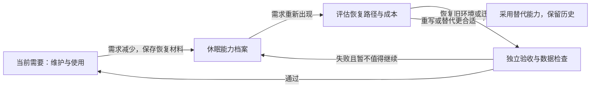

# AI 辅助的可分叉软件基底：能力休眠、按需再生与约束驱动的个人开源模式

> 文档性质：概念框架与研究假说，包含工程模型、条件命题和实验方案。
> 版本与日期：0.1，2026-09-06。
> 适用范围：以个人需求为主的本地工具、专业工作台，以及可独立演进的小型软件模块。
> 思想来源：作者与 AI 的[《评估GitHub项目架构》对话](https://chatgpt.com/c/6a9ca8b9-396c-83ea-b80e-7306ca6d2485)，尤其是最后三轮关于能力分身、插件休眠和 Host 解空间的讨论。该链接可能要求访问权限；本文可以独立阅读。
> 证据边界：文献支持、当前工程事实、本文推论分别标识；未实施长期恢复实验，也未证明本模式具有普遍生产率优势。

## 摘要

源码公开赋予软件被修改和延续的可能性，但从取得源码到得到可使用的个人版本，仍存在理解、构建、实现、验证、迁移与后续维护等成本。本文提出“**AI 辅助的可分叉软件基底**”这一工作概念：将可运行软件、明确的模块契约、构建环境描述、数据语义和验证机制共同交付，使后继使用者能够以可承受的成本保留、裁剪、扩展或重构软件，并形成具有独立需求与演进节奏的版本。

在此基础上，本文讨论一种个人开源模式：作者优先维护当下需要的能力，将低频能力保存为可理解、可重建、可验证的档案；当需求重新出现时，再决定恢复旧环境、迁移到新环境、重写或替换。因此，停止维护是一种维护活动状态，不能直接等同于使用价值消失或恢复路径消失。

本文以可塑软件、软件产品线、模块化和程序验证为理论参照，给出合法实现空间、实际可分叉性与按需恢复成本模型。核心假说是：**AI 对软件个性化和再生的贡献，受到软件架构、外部依赖与验证能力的共同调节；降低生成成本，只有在这些条件配合时，才可能转化为更低的人类注意力成本与更大的可达软件空间。** `avalonia_dock_simple_test` 提供了一个可开展实验的工程载体，但其现有插件机制与 Gate 尚不足以证明长期再生能力。

**关键词：** 可塑软件；开源分叉；个人软件；按需恢复；模块化；软件产品线；契约；AI 辅助软件工程。

## 1. 问题来源与研究定位

### 1.1 从“个人工具集合”到“可延续的能力档案”

原始讨论中的意图可以整理为三个相互联系的命题：

1. **维护按需求分配。** 仓库首先服务作者的工作与生活；作者可能持续新增能力，也可能停止维护已经不再关注的插件。
2. **分叉是正常使用路径。** 他人可以取得 Host 与插件，借助 AI 进行局部修改乃至整体重构，形成自己的软件，而无需等待所有需求被原作者接纳。
3. **结构决定改造可行性。** 只有源码或 DLL 发现机制还不够；身份、版本、兼容规则、数据格式与验证边界，使改造的前提和后果更明确。

本文将其视为研究问题，而不将原对话中“迁移已经很便宜”“未来必然如此”等判断直接当作事实。需要检验的是：对哪些人、哪些任务、哪些架构和哪些模型，这种模式能够降低完整任务的成本？

### 1.2 与项目已有理论的关系

| 已有文档 | 主要问题 | 本文接续的问题 |
| --- | --- | --- |
| [以注意力为中心的可停靠工作台](./attention-centered-dock-workspace-design.md) | 软件如何组织用户的工作注意力 | 软件能力如何随用户注意力的长期变化而启用、休眠和恢复 |
| [基于活动理论的需求分解方法论](./activity-theory-requirements-decomposition.md) | 需求如何拆分为 Document、Tool 与后台服务 | 能力边界如何成为改造和保存的边界 |
| [约束驱动的软件工业化](./约束驱动的软件工业化.md) | 如何约束 AI 的实现活动并验证变化 | 这种生产方式如何改变软件交付、分叉与维护的组织方式 |

前述理论主要讨论软件内部结构与生产过程；本文进一步讨论软件如何跨使用者、跨版本和跨维护间隔延续。这里的“能力分身”指已经外化为程序、数据模型和工作流程的个人能力，不表示一个具有独立人格或自主决策权的 AI 主体。

### 1.3 “新”体现在哪里

模块化、用户定制、开源分叉和暂停维护都早于生成式 AI。本文不主张发明这些机制，也不主张传统开源只允许被动使用。拟研究的增量是：将它们组合为一种**以实际改造成本和按需恢复能力为显式设计目标**的工程模式，并测量 AI 与结构化边界是否具有互补作用。

“可分叉软件基底”是本文的工作术语，不是已被标准组织认可的分类。它可以被理解为可塑软件的一种源码级实现路线。

## 2. 相关工作与证据

### 2.1 理论参照

| 方向 | 已有工作的相关结论 | 对本文的意义与区别 |
| --- | --- | --- |
| 模块化 | Parnas 强调模块划分标准影响可理解性与变化的局部性，并讨论通过隐藏可能变化的设计决策来划分模块。[1](https://doi.org/10.1145/361598.361623) | 支持按变化边界组织代码；不能据此直接断言插件架构会提升 AI 的成功率 |
| 软件产品线 | SEI 将软件产品线描述为从共同核心资产、按规定方式开发的一组相关系统。[2](https://www.sei.cmu.edu/library/software-product-lines-collection/) | 软件基底同样提供共同资产；本文关注使用者可以独立改变契约和演进目标，不要求所有派生版本受同一产品线计划管理 |
| 可塑软件 | Ink & Switch 讨论让使用者低摩擦地改造工具，并指出开放源码或 AI 代码生成并不能单独解决可塑性的全部障碍。[3](https://www.inkandswitch.com/essay/malleable-software/) | 这是最直接的概念邻域；本文具体化版本、验证、能力休眠及源码分叉的工程条件 |
| 本地优先软件 | Local-first 强调本地数据的主体地位、长期保存与使用者控制。[4](https://www.inkandswitch.com/essay/local-first/) | 支持降低对持续在线服务的依赖；桌面程序并不自动具备所有 local-first 属性 |
| 公理化程序验证 | Hoare 通过前置条件、程序和后置条件表达程序性质。[5](https://www.cs.cmu.edu/~crary/819-f09/Hoare69.pdf) | 为迁移与行为保持提供规范表达；测试通过与数学证明须明确区分 |
| 可复现构建 | Reproducible Builds 要求在相同源码、环境和指令下重建指定的逐位一致制品。[6](https://reproducible-builds.org/docs/definition/) | 提醒档案保存需要环境和构建信息；逐位复现、功能恢复、迁移成功是三个不同目标 |

由此，本文关注的不是“软件能否扩展”这一个问题，而是：**一个已经能运行的软件，能否连同其变化规则和行为证据一起，被另一位使用者接手、重新组织，并在较长时间后再次利用。**

### 2.2 AI 降本的支持证据与反向证据

| 来源 | 可核实结果 | 可以支持什么 | 不能支持什么 |
| --- | --- | --- | --- |
| Stanford AI Index 2025 | 报告称，达到 GPT-3.5 水平的系统推理成本在 2022-11 至 2024-10 间下降超过 280 倍。[7](https://hai.stanford.edu/ai-index/2025-ai-index-report) | 同等特定能力水平的推理服务价格曾显著下降 | 软件维护总成本同比例下降；所有能力或未来价格遵循同一趋势 |
| Peng 等，2023 | 在实现 JavaScript HTTP 服务器的受控任务中，Copilot 组完成任务所需时间缩短 55.8%。[8](https://arxiv.org/abs/2302.06590) | 某些明确编程任务能够获得显著加速 | 陌生大型仓库、长期维护或旧插件迁移具有同样收益 |
| METR，2025 | 对 16 名熟悉各自开源仓库的开发者、246 个任务进行随机试验；允许 AI 的任务耗时增加 19%。[9](https://metr.org/blog/2025-07-10-early-2025-ai-experienced-os-dev-study/) | 真实仓库任务中的净收益具有情境依赖性 | AI 总体无效，或后续模型仍必然减速 |
| METR，2026-02 更新 | 后续数据出现加速迹象，但研究者指出参与者和任务选择偏差，以及多 Agent 场景的计时问题，使效果估计不可靠。[10](https://metr.org/blog/2026-02-24-uplift-update/) | 工具效果和研究方法都需随使用方式更新 | 用早期减速或后续点估计代表当前全部开发工作 |

上述研究并未直接检验“休眠多年插件在 AI 帮助下低成本恢复”。本轮定向检索也不是系统综述，不能据此断言不存在其他相关研究。本文只将它们用于确定合理假说和测量边界，不拼接成尚不存在的长期因果证据。

## 3. 概念与对象

### 3.1 软件基底的工作定义

设一个可交付的软件基底为：

\[
B=(H,K,P,D,E,V,L)
\]

其中，\(H\) 为可运行 Host；\(K\) 为 SDK、接口与行为契约；\(P\) 为插件或模块集合；\(D\) 为数据格式、样例及语义；\(E\) 为环境、依赖与构建描述；\(V\) 为验证器和验收依据；\(L\) 为来源与许可信息。

这一定义不要求每一部分都完备，而要求缺失项可被识别。仅有一个可执行文件、一个空 SDK 或一次性项目模板，不充分体现本文所讨论的基底；既有应用只要逐步补足这些条件，也可以采用本模式。

**能力档案**是保留某项能力的意图、实现和再验证条件的材料集合。源码是核心材料，但源码本身不保证其外部数据、依赖服务或运行环境仍然存在。

**实际可分叉性**是相对于使用者、目标、工具、环境和预算的能力：能否获得满足目标且通过约定验收的派生版本。它不是 Git 平台上的 Fork 按钮，也不能只用 fork 数量衡量。

### 3.2 区分三个“活着”的维度

| 维度 | 问题 | 示例 |
| --- | --- | --- |
| 维护活动 | 是否有人持续处理变化和问题 | 最近半年没有提交 |
| 当前可用性 | 在指定环境中是否仍能完成任务 | 固定旧环境中仍能运行 |
| 可恢复性 | 在预算内能否恢复到目标可用状态 | 新环境暂不可用，但能迁移并重新验收 |

因此，“没有提交”“作者不再维护”“无法在最新版运行”和“没有恢复价值”不是同义词。反过来，仓库最近有提交也不能证明它对某位用户有用。

本文避免给“软件死亡”一个脱离环境的绝对定义。更精确的说法是：对于指定需求、环境和预算，暂时不存在已知的可接受恢复路径。环境变化、替代服务或工具进步可能改变这个判断。

### 3.3 两种分叉层级

**契约内分叉：** 修改插件业务、局部 UI 或 Host 内部实现，同时保留约定的外部行为、身份和数据语义。可以继续参与既有兼容范围内的生态。

**契约分叉：** 派生者改变 SDK、交互模型或数据契约，形成自己的基底。此时应声明新的兼容边界和迁移规则；不能因为新版本通过自己的 Gate，就声称它仍兼容原生态。

这一划分使“规则稳定”与“Host 也可重构”同时成立：稳定是相对于声明的兼容关系，不是原作者对所有未来派生版本的永久控制。

## 4. 为什么软件结构会影响这一模式

下表列出的是作用机制假说。它们具有工程理由，但效果大小仍需测量。

| 结构条件 | 减少的不确定性或成本 | 缺失时的典型困难 |
| --- | --- | --- |
| 稳定身份与所有权 | 找到能力、贡献和数据的归属 | 把同名类型当成同一能力；覆盖其他插件数据 |
| 独立版本与显式兼容区间 | 区分“实现错误”与“不受支持的组合” | 以试运行代替兼容判断 |
| 模块私有状态与依赖边界 | 限定理解范围和变化传播范围 | 改一处功能需要理解大量无关代码 |
| 明确数据格式与迁移语义 | 保留使用者已经积累的状态 | 程序启动成功，但旧数据含义改变 |
| 可取得的依赖和构建说明 | 从源码进入可测试状态 | 源码存在，工具链或依赖已经丢失 |
| 行为测试和真实组合验收 | 判断修改是否满足目标 | 仅靠 AI 对自己生成代码的解释 |
| 可替换的外部服务接口 | 缩小供应商变化的影响 | 服务关闭导致整项能力无法恢复 |
| 清晰的状态和支持说明 | 识别维护责任与恢复入口 | 把历史绿色结果误认为当前支持承诺 |

原始 DLL 扫描可以解决“怎样找到并实例化类型”，却没有独立回答“这个插件是谁、适用于哪个世界、失败应拒绝什么、旧数据如何解释”。增加版本号也不自动解决问题；版本必须参与实际兼容判断，并对应真实行为证据。

插件并非必要形式。具有明确边界的模块化单体也可能具备较高可分叉性；大量彼此穿透依赖的插件则可能不具备。真正的判断对象是边界是否约束了变化，而不是程序集或仓库数量。[1](https://doi.org/10.1145/361598.361623)

从产品形态看，可以逐步提供“直接使用—配置—组合能力—修改插件—改造 Host”的路径。不同层级应有相应的反馈和验收方式；不必要求每位使用者最终都成为完整系统的维护者。这是本文对个人工作台的设计建议，与可塑软件的用户改造目标相呼应。[3](https://www.inkandswitch.com/essay/malleable-software/)

## 5. 形式化模型一：约束与可达软件空间

### 5.1 理想合法集合与实际验收集合

设 \(\Omega\) 为候选软件实现集合，\(K\) 为选定契约，\(e\) 为明确的运行环境。定义：

\[
\Omega_{K,e}=\{s\in\Omega\mid s\models_e K\}
\]

这是理论上满足契约的集合。工程中实际运行的是验证器 \(V\)，因此可观测集合为：

\[
\widehat{\Omega}_{V,e}=\{s\in\Omega\mid V(s,e)=\mathrm{pass}\}
\]

通常不能假定两个集合相等，也不能未经证明便假定其中一个包含另一个。有限测试会漏掉错误；过度绑定实现的规则也可能拒绝符合真实需求的实现。

因此，Gate 的准确含义是“通过指定版本、范围和环境中的检查”。它能提供性质成立的证据，但不是通用正确性证明。若修改了验证器，验收依据本身也发生了变化，必须记录并审查该变化。

### 5.2 不用集合大小代表软件的自由度

“解空间足够大”不宜直接以 \(|\Omega_{K,e}|\) 衡量：仅改变无关变量名称就能产生大量候选，而两个无限集合的基数也不能表达实际可用性。

更有操作性的定义，是给定目标集合 \(\mathcal T\) 和预算向量 \(b\)，研究可达目标比例：

\[
\mathrm{Reach}(B,a,e,b)=
\frac{1}{|\mathcal T|}
\sum_{r\in\mathcal T}
\mathbf 1[\text{工具配置 }a\text{ 能在 }b\text{ 内从 }B\text{ 得到通过独立验收的目标 }r]
\]

这里 \(a\) 包含模型、提示策略与工具，预算可以分别限制人类分钟、总耗时和费用。\(\mathcal T\) 应包含不同类型的真实改造目标，而不是大量重复的表面变化。实际实验只能估计此值，且应报告失败与重复运行的波动。

于是“边界清晰、内部宽广”成为两个可分别考察的目标：降低违反关键契约的概率，同时保留较高的任务可达率。规则越多并不必然越好；无关规则可能降低可达率。

### 5.3 局部变化的组合条件

设插件 \(P_i\) 的契约为“环境假设 \(A_i\) 下保证 \(G_i\)”，其余系统记为 \(R\)。一次替换 \(P_i\to P_i'\) 若要保持系统性质，至少需要证明或检查：

1. \(R\) 仍满足 \(A_i\)；
2. \(P_i'\) 在 \(A_i\) 下仍满足 \(G_i\)；
3. \(R\) 所依赖的性质全部包含在 \(G_i\) 及已声明的交互约束中；
4. 共享资源、生命周期和数据副作用没有越过这些约束。

**条件命题 1。** 若上述契约刻画了有关交互，且原系统性质仅依赖这些契约，则契约保持的局部替换保留该系统性质。

**论证。** 在有关性质的推理中，原插件的作用可以由其保证替代；新插件提供相同保证，环境假设保持，原推理中的相关前提不变。若存在未刻画的共享状态、时序或性能依赖，论证便不成立。

这不是“插件各自单测通过，所以组合一定正确”。它说明局部验证何时具有意义，以及为什么还需要真实 Host 组合测试。

## 6. 形式化模型二：实际可分叉性与成本下限

### 6.1 完整成本

对于需求 \(r\)，将取得可验收派生版本的成本写为：

\[
C_{fork}=C_{understand}+C_{environment}+C_{implement}
+C_{verify}+C_{migrate}+C_{operate}
\]

各项采用相同计量单位；如果无法合理折算，就分别报告人类时间、墙钟时间和费用，而不要直接相加。失败尝试、返工和约定观察期内的缺陷处理应计入成本。

本文建议将实际可分叉性报告为一组指标，而不是一个任意加权分数：

\[
F=(p_{accept},\ H,\ T,\ C,\ d)
\]

其中 \(p_{accept}\) 为预算内通过独立验收的比例，\(H\) 为人类投入，\(T\) 为耗时，\(C\) 为费用，\(d\) 为后续观察到的缺陷。报告时间和费用时，应说明它们覆盖全部尝试还是仅成功样本。

### 6.2 推理价格下降能推出什么

固定工具能力和一条策略 \(\pi\)，令其消耗 \(n_\pi\) 个计费单元，单价为 \(p\)，其他成本为 \(c_\pi\)：

\[
C_\pi(p)=c_\pi+p n_\pi
\]

**条件命题 2。** 若策略集合、能力、质量门槛和非推理成本都不变，降低 \(p\) 不会提高最优可行成本 \(C^*(p)=\inf_\pi C_\pi(p)\)。

**证明。** 对每条策略有 \(n_\pi\ge0\)，因此 \(p'\le p\Rightarrow C_\pi(p')\le C_\pi(p)\)。对同一可行策略集合取下确界，关系仍成立。

这个简单命题支持“价格下降可以扩大预算内可行的改造集合”，但不证明用户必然采用最优策略，也不允许忽略质量变化。真实使用中，更便宜的模型可能需要更多重试；更强的 Agent 也可能使任务范围扩大。

另一个下限来自无法被当前自动化消除的成本。若人工验收、外部服务接入和数据确认至少需要 \(C_{fixed}\)，则即使生成费用趋近于零，也有 \(C_{fork}\ge C_{fixed}\)。在固定任务、成本可加且只加速某一部分的简化模型下，若该部分占比为 \(f\)、加速倍数为 \(s\)，总体加速比为：

\[
\frac{1}{(1-f)+f/s}
\]

这是成本分解的代数结果，不是对本项目的效果估计。例如取纯示意值 \(f=0.4\)，即使该部分成本趋零，总体加速上限也只有约 1.67 倍。

### 6.3 架构与 AI 的互补性假说

本文真正需要实验支持的命题是：明确边界不仅降低人工理解成本，还可能提高 AI 提案通过验收的概率、减少返工，以及降低审查所需的人类时间。

形式上，可比较“有无结构化边界”与“有无 AI”的四个实验条件，而不能仅比较某项目改造前后的提交速度。架构变化、开发者熟练度、任务难度和模型版本同时变化时，无法把差异单独归因于 AI。

## 7. 形式化模型三：停止维护与按需恢复

### 7.1 将管理状态与技术状态分开

建议用管理状态表达作者的投入意图：`Active`（当前投入）、`Dormant`（停止例行维护但保留恢复入口）、`Archived`（保存历史）、`Retired`（不再计划恢复）。另外独立记录技术状态：在什么环境最后验证、当前构建是否可用、依赖是否可取得、是否存在已知阻断。

这些是本文建议的档案标签，不是当前 Host 的运行时枚举；`Dormant` 也不表示程序集热卸载或进程挂起。

图中表达按需恢复的决策过程，不预设每次恢复都会成功。

### 7.2 维护与休眠的条件成本比较

考虑长度为 \(T\) 的规划期，直到首次需求出现。令 \(\tau\) 为首次需求时间；若期内没有需求，记作 \(\infty\)。设持续维护的单位时间成本为 \(m(t)\)，档案保存初始成本为 \(A\)，休眠期间保存成本为 \(h(t)\)，首次需要时的恢复成本和延迟损失分别为 \(R(\tau)\)、\(D(\tau)\)。

令 \(u=\min(\tau,T)\)，在两条路径首次恢复到等价可用状态之后的成本相同、持续维护路径保持就绪的简化假设下：

\[
J_{active}=\mathbb E\!\left[\int_0^u m(t)\,dt\right]
\]

\[
J_{dormant}=A+\mathbb E\!\left[
\int_0^u h(t)\,dt+
\mathbf1_{\{\tau\le T\}}\big(R(\tau)+D(\tau)\big)
\right]
\]

恢复成本应包含失败尝试，并可选择恢复旧环境、迁移、重写或采用替代方案的最低可接受总成本；所有路径均不可行时，应记录未满足需求的损失，而不是把成本记为零。无法货币化的损失可以作为单独的决策约束。

**条件命题 3。** 在上述假设下，且不违反必须持续履行的支持约束时，只有当 \(J_{dormant}<J_{active}\)，休眠策略才具有期望成本优势。

这是决策定义的直接结果，不是“暂停维护总是划算”的定理。低需求概率、较低保存成本和可控恢复成本有利于休眠；频繁需求、严重恢复延迟、快速变化的外部 API 或不可替代的数据有利于持续维护。反复启停的能力需要扩展成多周期状态模型，不能直接套用首次需求模型。

### 7.3 停止维护后还剩下什么价值

可以用一个简化的单次需求模型表达档案价值：

\[
V_{archive}=\mathbb E\!\left[\delta^\tau
\mathbf1_{\{\tau\le T\}}\max(0,U(\tau)-R(\tau)-D(\tau))\right]-C_{preserve}
\]

\(U\) 为恢复后的效用，\(\delta\in(0,1]\) 为按所选时间单位的折扣因子，\(C_{preserve}\) 为同一基准下的保存成本。期内无需求的项定义为零。这个表达式描述“保留未来选择”的价值，不是经过市场校准的资产定价模型。

它说明：当前无人维护并不强制令未来价值为零。但如果关键服务永久消失、数据语义无法恢复、依赖不可取得或恢复成本高于效用，档案可能只剩参考价值。

对于仍在实际运行、连接外部系统或已有持续支持承诺的软件，不能仅通过改变标签便认为例行维护已无必要。按需恢复改变的是时间安排和资源分配，不会自动消除现存依赖关系。

## 8. “可恢复”需要保存哪些信息

建议将最小恢复材料保存为一页 `REVIVAL.md` 或等价记录；这只是建议，本文没有为所有插件新增文件，也没有改变现行 manifest schema。

| 材料 | 最低内容 | 防止的失真 |
| --- | --- | --- |
| 意图与边界 | 解决什么问题，明确不处理什么 | AI 完整实现一个偏离原目的的新工具 |
| 身份与来源 | PluginId、来源提交、版本、许可及贡献 ID | 不清楚从哪里派生，误占同一身份 |
| 环境 | OS、架构、SDK、锁定依赖、构建指令 | 只能在作者机器偶然运行 |
| 数据语义 | Schema、脱敏样例、关键字段含义、迁移约束 | 新程序能读取但错误解释历史数据 |
| 外部条件 | 服务、原生库、设备及所需权限的说明 | 把外部能力丢失误当作代码缺陷 |
| 行为证据 | 少量高价值输入输出、失败语义、验收入口 | 用新实现生成的测试覆盖旧需求 |
| 最后验证 | 日期、提交、环境、实际通过范围 | 把旧结果当成当前结论 |
| 恢复路径 | 已知阻断、可选替代、发布和回滚方式 | 没有成功判据，持续盲目修补 |

不应把凭据或个人原始数据作为恢复档案的一部分。对于不可重新取得的依赖，锁文件只记录“需要什么”，不会自动保存依赖本体。

恢复时还应区分三个目标：

1. **历史复现：** 在明确旧环境中复现历史结果；若声称可复现构建，还需满足逐位一致的制品标准。[6](https://reproducible-builds.org/docs/definition/)
2. **目标环境恢复：** 在新环境中保留约定的可观察行为，二进制通常会改变。
3. **能力再实现：** 只保留所需业务语义，允许重写或替代，但不得把语义缩减隐藏为兼容迁移。

测试可以成为未来接手者的“可执行记忆”，但旧测试也可能编码历史缺陷。重要预期值应关联业务理由、标准样例或可独立判断的规则，并明确哪些行为有意保留、哪些有意修正。

## 9. 可采用的形式化验证方法

### 9.1 数据迁移的证明义务

设 \(M\) 是数据迁移程序，\(P\) 为合法旧数据和备份条件，\(Q\) 为合法新数据及应保持的业务语义，可以借用 Hoare 三元组表达：

\[
\{P\}\ M\ \{Q\}
\]

在通常的部分正确性解释下，它表示：若从满足 \(P\) 的状态执行且终止，结果满足 \(Q\)；终止性需要额外论证。[5](https://www.cs.cmu.edu/~crary/819-f09/Hoare69.pdf)

更具体地，若 \(\pi_{old}\)、\(\pi_{new}\) 分别提取迁移前后必须保留的业务含义，则无损迁移的目标为：

\[
\forall d\in D_{supported},\qquad
\pi_{new}(M(d))=\pi_{old}(d)
\]

例如图像工程恢复时，可以要求源文件引用、操作顺序和参数含义保持；数值计算若允许误差，应定义容差关系，不能直接套用严格相等。对于有损迁移，应事先声明保留哪些投影、丢弃哪些信息。

实际工程可以用代表性历史数据、性质测试和独立结果比对寻找反例，但不能把有限样例代入成功称为对上述全称命题的证明。

### 9.2 验证层级与各自边界

| 方法 | 适合验证的对象 | 证明边界 |
| --- | --- | --- |
| 类型与静态分析 | 类型身份、公开 API、禁止依赖 | 不覆盖全部运行时语义 |
| 契约与性质测试 | 数据往返、修订确认、实例隔离 | 只覆盖抽样输入与执行路径 |
| 状态机模型检查 | 激活、关闭、恢复与取消的有限状态关系 | 对抽象模型成立；还需检查实现符合模型 |
| 变异测试 | 验证器是否能发现预先设计的违规变化 | 检出率不等于所有真实缺陷的检出率 |
| 历史夹具和真实组合测试 | 旧数据、旧插件包、新 Host 的具体兼容组合 | 不自动外推到未测试版本 |
| 人工需求验收 | 功能是否真正服务使用者目的 | 需明确标准，并保留判断过程 |

例如，可将“迁移提交前不覆盖唯一原始数据”“未通过兼容检查不执行插件入口”写成状态不变量，再检查失败和取消路径。是否引入专门模型检查器应由失败代价和状态复杂度决定；本文没有为当前 Host 声明已完成形式化证明。

## 10. 本项目提供的证据与尚缺的证据

以下为 2026-09-06 对当前工作区的静态核查；当时 HEAD 为 `101c7835bb18953faace282e9992fef56314a72f`，且存在未提交开发变更。因此该提交号只是定位参考，不代表下表所有工作区文件都已冻结于该提交。本次文档工作没有重新执行完整运行门禁。

| 所需条件 | 可核查的本地依据 | 当前能说明什么 |
| --- | --- | --- |
| 身份、版本与显式范围 | [PluginManifest.cs](../../Host/MyAvaloniaManagement/Business/Plugins/Discovery/PluginManifest.cs) 中的 `PluginManifest`、`PluginVersionRange` 和 `PluginCompatibilityEvaluator` | 清单包含稳定身份、插件版本和 SDK 左闭右开区间；宿主按声明判断，不推测兼容关系 |
| 先检查后加载 | [AssemblyLoaderHelper.cs](../../Host/MyAvaloniaManagement/Business/Plugins/Discovery/AssemblyLoaderHelper.cs) 与 [PluginManifestCompatibilityTests.cs](../../Host/MyAvaloniaManagement.PluginTests/PluginManifestCompatibilityTests.cs) | 存在加载前兼容检查机制及对应测试；测试存在不等于本次已重跑通过 |
| 依赖与服务边界 | [PluginLoadContext.cs](../../Host/MyAvaloniaManagement/Business/Plugins/Discovery/PluginLoadContext.cs)、[PluginProviderOwner.cs](../../Host/MyAvaloniaManagement/Business/Plugins/Registration/PluginProviderOwner.cs) | 依赖解析与插件 Provider 有独立边界；这些机制不是恶意代码安全沙箱 |
| 注册所有权 | [PluginRegistryBuilder.cs](../../Host/MyAvaloniaManagement/Business/Plugins/Registration/PluginRegistryBuilder.cs) | 贡献可经集中构建与校验形成 Registry，不只依赖任意类型扫描 |
| 可验证数据格式 | [DocumentEnvelopeSerializer.cs](../../Host/MyAvaloniaManagement/Business/Documents/DocumentEnvelopeSerializer.cs)、[DocumentEnvelopeV2Tests.cs](../../Host/MyAvaloniaManagement.Tests/DocumentEnvelopeV2Tests.cs) | 存在明确文档信封和格式测试；插件业务内容迁移仍需自己的语义证据 |
| API 演进依据 | [SDK API 兼容基线指南](../reference/plugin-sdk-api-compatibility.md) | 存在 Shipped/Unshipped 与兼容审阅规则；API 签名兼容不代表完整行为兼容 |
| 独立开发与交付 | [创建插件](../quick-start/create-managed-plugin.md)、[打包与真实 Host 验收](../quick-start/verification-and-troubleshooting.md) | 已提供外部作者开发和验收路径；需要另行测量陌生使用者实际完成成本 |
| 自动检查入口 | [GateOptions.cs](../../tools/MyAvaloniaManagement.Gate/GateOptions.cs)、[GateChecks.cs](../../tools/MyAvaloniaManagement.Gate/GateChecks.cs) | 存在 `verify`、`seal` 和架构/文档检查；不由此推定远端强制合并保护已启用 |

主仓库当前提供 [MIT 许可文本](../../LICENSE)；派生者仍需检查具体插件、依赖和资源各自的许可与来源。这里记录仓库事实，不进行整个生态的许可审计。

特别需要避免三个误读：

- 当前 [Host 架构](../../Host/MyAvaloniaManagement/docs/design/architecture.md) 的信任模型是进程内可信插件；ALC 和私有 DI 不足以隔离不可信代码。
- `PluginLoadContext` 当前采用 `isCollectible: false`；本文的能力休眠属于开发与档案管理，不代表已支持插件热卸载。
- 已有版本与 Gate 为长期恢复提供条件，但不证明某个插件经过两年外部变化后仍能低成本恢复。

因此，本项目可被定位为**具备部分关键条件的研究原型与实验载体**。尚缺的核心证据包括陌生人分叉实验、真实休眠后的恢复数据、跨版本语义保真度，以及整个生命周期的人类投入记录。

## 11. 可证伪的研究假说与实验方案

| 假说 | 可观察预测 | 反例或否定条件 |
| --- | --- | --- |
| H1：显式边界改善 AI 改造 | 在相同任务、模型、预算和质量门槛下，完整基底比缺少边界说明和验证材料的基线减少人类投入，且不降低验收率 | 多次实验中投入无改善，或改善仅来自降低质量要求 |
| H2：恢复材料有增量价值 | 保留语义样例、构建说明和版本事实的档案，比只有源码的档案更容易恢复 | 控制任务差异后效果消失，或所有失败均受外部不可恢复条件支配 |
| H3：部分低频能力适合休眠 | 在明确需求分布和规划期中，保存加按需恢复的总成本低于例行维护 | 恢复延迟和批量迁移成本持续超过节省的维护投入 |
| H4：契约保持的 Host 分叉可延续插件能力 | Host 内部重构后，声明支持的旧插件包和旧数据通过独立组合验收 | 必须同步改写大量插件或改变旧数据语义才能通过 |
| H5：局部边界减少协作冲突 | 对互不依赖的插件任务，并行工作提高吞吐量，且共享契约变动和组合失败未显著增加 | 文件无冲突但频繁产生语义冲突，整合投入抵消收益 |

### 11.1 第一阶段：有限预算的分叉试验

选择至少三类任务：局部功能、Host 内部改造、旧数据迁移。任务应事先固定目标、质量要求、禁止改变的契约和超时预算。引入没有原仓库经验的参与者；作者自身经验可作为另一个分层，不与陌生人结果混合。

若要识别 AI 与结构的互补性，可以设置“基底材料完整/消融”与“允许/不允许 AI”的 2×2 条件。消融应在隔离实验副本中进行，保持起始功能等价；它只能解释被移除材料的作用，不能代表所有单体与插件架构的差别。

记录模型版本、工具配置、源码提交、环境、全部尝试、人类介入、总耗时、费用与失败原因。主要指标采用预算内成功率和人类投入；代码行数、commit 数量只作过程描述。验收者尽可能不知道实验条件，关键样例不由实现者临时重新定义。

先导试验用于估计变异和可行性；正式样本量由预先定义的最小有意义差异和统计功效决定。报告效应量与置信区间，按参与者和任务处理重复测量；不因“结果看起来明显”而省略失败样本。

### 11.2 第二阶段：恢复试验

冻结若干能力快照，保存两组恢复材料，并在后续时间点尝试恢复。短期可人工设置依赖升级、SDK 变化或服务适配替换，但必须标明这是受控扰动，不是真实多年自然休眠的替代证据。

恢复的成功条件至少包括目标任务可用、关键旧数据语义保持和约定组合行为成立。只编译成功或只显示 UI 不算完成。分别记录环境重建、代码迁移、数据确认、验证和外部阻断成本，判断 AI 到底降低了哪一项。

### 11.3 第三阶段：长期观察

对真实低频能力记录每次需求、维护与恢复活动，并观察再次使用后的缺陷。持续维护与休眠应以相近需求和依赖波动的能力比较；避免只把简单、稳定的插件放入休眠组。

这一阶段才能检验第 7 节成本模型。单次成功恢复说明存在可行路径，不能证明长期策略优于持续维护。

## 12. 个人开源模式的组织含义

在本文模式中，作者可以优先维护正在使用的能力，并清楚公开其他能力的状态。后继使用者可以选择使用原版、提交通用修复、维持个人补丁、独立发布派生版，或只提取其中一项能力。独立分叉不必以最终合并回原仓库为目标。

然而，劳动并未消失：部分维护从原作者转移给真正需要这项能力的人和其工具。维护成本也可能在多个分叉中重复发生。若大量派生版本仍需要同一个 SDK，保留共同契约、回传通用修复和共享验收夹具仍有价值。

对于个人版本，内部实现稳定性可以按自身需要决定；对于共同 SDK、共享数据和已公开支持的组合，变化会传播给其他人，应明确记录兼容决策。分叉修改身份时，还应区分“替代原插件”和“与原插件并存”：前者需验证数据与行为兼容，后者需防止贡献 ID、更新来源和存储位置冲突。

“核心持续维护、外围按需恢复”是一个可选配置，不是永久义务。如果 Host 本身也停止维护，同样需要保存恢复材料；基底并不天然免于环境老化。

这一模式较适合可本地运行、需求间歇出现、模块边界清晰、数据可导出的工具。它在依赖持续在线服务、严格时效、共享基础设施或大规模用户支持的场景中会遇到更高的持续维护要求。适用范围应由依赖和失败代价判断，而不是仅由“个人项目”标签判断。

## 13. 当前结论

可以成立的较弱结论是：维护活动、当前可用性与未来可恢复性是不同属性；源码开放提供必要材料之一，明确架构与验证机制能够使接手条件更可观察。现有研究也表明，AI 的真实开发收益不能从生成速度或推理价格单独推出。

本文提出的较强结论仍是假说：**当软件以可理解、可局部改变、可独立验证的基底交付时，AI 可能使源码分叉从少数开发者的重大工程，逐步成为更多使用者能够承担的个性化方式；能力也可能通过“使用—休眠—再验证—恢复”的过程延续价值。**

对 `avalonia_dock_simple_test` 而言，下一步有价值的证据不是继续增加概念名称，而是测量：陌生使用者在有限预算内能否改造一个版本；暂停维护的插件能否恢复关键语义；改变 Host 后能否继续使用声明兼容的插件和数据。只有这些可重复结果，才能把“软件世界可以被持续重新生成”的直觉推进为可辩护的软件工程模式。

## 参考文献

以下为定向检索选取的原始论文、研究机构报告和官方定义；在线资料访问日期均为 2026-09-06。本文自己的模型和实验假说不归属于这些文献。

1. PARNAS D L. On the criteria to be used in decomposing systems into modules[J]. *Communications of the ACM*, 1972, 15(12): 1053–1058. [DOI: 10.1145/361598.361623](https://doi.org/10.1145/361598.361623). [论文副本](https://john.cs.olemiss.edu/~hcc/csci555/notes/localcopy/Parnas_Criteria_Decomposing.pdf).
2. SOFTWARE ENGINEERING INSTITUTE. *Software Product Lines Collection*[EB/OL]. 2014-12-31. [SEI 官方页面](https://www.sei.cmu.edu/library/software-product-lines-collection/). 概念与研究资料入口，非本文场景的实验。
3. LITT G, HOROWITZ J, VAN HARDENBERG P, et al. *Malleable Software: Restoring User Agency in a World of Locked-Down Apps*[EB/OL]. Ink & Switch, 2025-06. [研究文章](https://www.inkandswitch.com/essay/malleable-software/). 概念与原型研究综述，非软件维护成本随机试验。
4. KLEPPMANN M, WIGGINS A, VAN HARDENBERG P, et al. *Local-first software: You own your data, in spite of the cloud*[EB/OL]. Ink & Switch, 2019-04. [作者公开版本](https://www.inkandswitch.com/essay/local-first/).
5. HOARE C A R. An axiomatic basis for computer programming[J]. *Communications of the ACM*, 1969, 12(10): 576–580, 583. [论文副本](https://www.cs.cmu.edu/~crary/819-f09/Hoare69.pdf). [牛津大学作者文献目录](https://www.cs.ox.ac.uk/people/publications/date/Tony.Hoare).
6. REPRODUCIBLE BUILDS. *Definitions: When is a build reproducible?*[EB/OL]. [官方定义](https://reproducible-builds.org/docs/definition/).
7. STANFORD INSTITUTE FOR HUMAN-CENTERED ARTIFICIAL INTELLIGENCE. *The 2025 AI Index Report*[R/OL]. 2025. [报告与主要发现](https://hai.stanford.edu/ai-index/2025-ai-index-report). 本文引用的是特定历史期间的能力等效推理成本指标。
8. PENG S, KALLIAMVAKOU E, CIHON P, et al. *The Impact of AI on Developer Productivity: Evidence from GitHub Copilot*[EB/OL]. arXiv:2302.06590, 2023. [论文摘要及全文入口](https://arxiv.org/abs/2302.06590). 受控实验预印本。
9. BECKER J, RUSH N, BARNES B, et al. *Measuring the Impact of Early-2025 AI on Experienced Open-Source Developer Productivity*[R/OL]. METR, 2025-07-10. [研究机构发布与论文入口](https://metr.org/blog/2025-07-10-early-2025-ai-experienced-os-dev-study/).
10. BECKER J, RUSH N, CUNNINGHAM T, et al. *We are Changing our Developer Productivity Experiment Design*[R/OL]. METR, 2026-02-24. [后续数据与方法限制](https://metr.org/blog/2026-02-24-uplift-update/).
